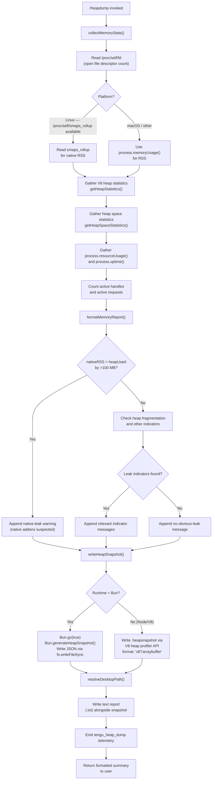

# `/heapdump`

> Analysis basis: CC v2.1.183 bundle.js (AST extraction + Claude interpretation)
> Minimum version: v2.1.183

---

## Overview

`/heapdump` is a hidden diagnostic command that captures a JavaScript heap snapshot and collects a comprehensive set of runtime memory statistics, then writes both to `~/Desktop`. It is intended for developer/support use to diagnose memory leaks and high-memory situations in the Claude Code process. The command supports non-interactive execution and emits a single telemetry event upon invocation.

---

## Registration

| Field | Value |
|---|---|
| type | `local` |
| name | `heapdump` |
| description | `Dump the JS heap to ~/Desktop` |
| supportsNonInteractive | `true` |
| isHidden | `true` |
| module_id | `dwl` |
| load_inline | `true` |
| loc_byte | `12865947` |
| loc_byte_end | `12866375` |
| loc_line | `8542` |
| arbor_handler.name | `Ilf` |
| arbor_handler.fqn | `claude-2.1.183::Ilf` |
| arbor_handler.kind | `AsyncFunction` |
| arbor_handler.resolution_path | `module_id` |
| arbor_handler.n_hits | `0` |

Analysis basis: CC v2.1.183 bundle.js:+12865947

---

## Input Branching

The command follows a broadly linear flow but branches at three points: (1) platform detection for smaps/memory source, (2) runtime environment detection (Bun vs. Node/V8) for heap snapshot generation, and (3) memory classification logic. A Mermaid chart is used accordingly.



---

## Behavioral Spec

### Handler Entry Point (`heapdumpHandler`)

The handler (bundle identifier: `Ilf`) is an `AsyncFunction` resolved via `module_id` → `dwl`.

```
async function heapdumpHandler(context):
    emit telemetry event "tengu_heap_dump"
    stats = await collectMemoryStats()
    snapshotPath = await writeHeapSnapshot()
    report = formatMemoryReport(stats)
    lines = []
    lines.push("Open the .heapsnapshot in Chrome DevTools → Memory → Load to inspect retainers.")
    lines.push(report)
    lines.push(snapshotPath summary)
    return lines.join("\n")
```

Analysis basis: CC v2.1.183 bundle.js:+12864816

---

### Memory Statistics Collection (`collectMemoryStats`)

```
async function collectMemoryStats():
    result = {}

    // Core JS heap metrics
    result.memoryUsage       = process.memoryUsage()
    result.heapStatistics    = v8.getHeapStatistics()
    result.resourceUsage     = process.resourceUsage()
    result.uptime            = process.uptime()
    result.heapSpaceStats    = v8.getHeapSpaceStatistics()

    // Active handle / request counts (internal Node.js APIs)
    result.activeHandles     = process._getActiveHandles().length
    result.activeRequests    = process._getActiveRequests().length

    // Open file descriptor count (Linux only)
    try:
        fdEntries = await fs.readdir("/proc/self/fd")
        result.openFdCount = fdEntries.length
    except:
        result.openFdCount = null

    // Native RSS via smaps (Linux only)
    try:
        smapsText = await fs.readFile("/proc/self/smaps_rollup", "utf8")
        result.nativeRss = parseSmapsRss(smapsText)   // in bytes
    except:
        result.nativeRss = null

    // Load "bun:jsc" module for Bun-specific introspection if available
    try:
        jsc = require("bun:jsc")
        result.bunJscStats = jsc.heapStats()
    except:
        result.bunJscStats = null

    // Filesystem-level data: convert sizes using 3600 and 1048576 constants
    // (rolling window / MB conversion)

    return result
```

Analysis basis: CC v2.1.183 bundle.js:+12860979 – +12861564

**Key constants observed in `collectMemoryStats`:**
- Rolling window size: `3600` (bundle.js:+12861511)
- Bytes-per-MB divisor: `1048576` (bundle.js:+12861516)
- Percentage threshold for native-leak warning: `100` (bundle.js:+12861663)

---

### Memory Report Formatter (`formatMemoryReport`)

```
function formatMemoryReport(stats):
    lines = []

    heapUsedMB   = stats.memoryUsage.heapUsed  / 1048576
    rssMB        = stats.memoryUsage.rss        / 1048576
    nativeRssMB  = stats.nativeRss              / 1048576  // may be null

    lines.push(formatLine("heapUsed",   heapUsedMB.toFixed(1) + " MB"))
    lines.push(formatLine("rss",        rssMB.toFixed(1) + " MB"))
    // ... additional fields from heapStatistics and resourceUsage

    // Native vs JS heap classification
    if nativeRssMB is not null:
        nativeDeltaMB = nativeRssMB - heapUsedMB
        if nativeDeltaMB > 100:
            lines.push("Native memory > heap - leak may be in native addons (node-pty, sharp, etc.)")
            lines.push("— most memory is native (NOT in the .heapsnapshot)")
        else:
            lines.push("— most memory is JS heap (inspect the .heapsnapshot)")

    // macOS: apply 1024-byte unit conversion for platform memory counters
    if platform == "darwin":
        // scale macOS-reported values by 1024 where needed

    // Leak indicator check
    indicators = checkLeakIndicators(stats)
    if indicators is empty:
        lines.push("  (no obvious leak indicators)")
        lines.push("No obvious leak indicators. Check heap snapshot for retained objects.")
    else:
        for each indicator in indicators:
            lines.push(indicator)

    return lines.join("\n")
```

Analysis basis: CC v2.1.183 bundle.js:+12861663, +12861749, +12861872, +12862596, +12862603, +12862613, +12862868

---

### Desktop Path Resolution (`resolveDesktopPath`)

```
function resolveDesktopPath():
    home = os.homedir()   // via cmr.homedir()

    // WSL detection: check if path starts with /mnt/c/Users
    // Exclude known non-user dirs: "Public", "Default", "Default User", "All Users"
    if isWSL():
        wslUsers = listWindowsUsers("/mnt/c/Users")
        filteredUsers = wslUsers.filter(u => not in ["Public", "Default", "Default User", "All Users"])
        if filteredUsers.length > 0:
            home = path.join("/mnt/c/Users", filteredUsers[0])

    desktopPath = path.join(home, "Desktop")
    return desktopPath
```

Analysis basis: CC v2.1.183 bundle.js:+1101758, +1101765, +1101801, +1102033, +1102077, +1102096, +1102116, +1102141

---

### Heap Snapshot Writer (`writeHeapSnapshot`)

```
async function writeHeapSnapshot():
    desktopPath = resolveDesktopPath()
    timestamp   = currentTimestamp()
    baseName    = path.join(desktopPath, "claude-heapdump-" + timestamp)

    if isBunRuntime():
        // Bun path: force GC then generate snapshot
        Bun.gc(true)
        snapshot = Bun.generateHeapSnapshot()
        fs.writeFileSync(baseName + ".heapsnapshot", JSON.stringify(snapshot))
    else:
        // Node/V8 path: use V8 heap profiler
        // format: "v8", encoding: "arraybuffer"
        writeV8HeapSnapshot(baseName + ".heapsnapshot", format="v8", encoding="arraybuffer")

    // Write accompanying text report (file mode 0o600 = 384 decimal)
    await fs.writeFile(baseName + ".txt", textReport, { mode: 384 })

    return baseName
```

Analysis basis: CC v2.1.183 bundle.js:+12863926, +12863942, +12863961, +12864496, +12864516, +12864541, +12864546, +12864573

**File permission constant:** `384` decimal = `0o600` octal — owner read/write only (bundle.js:+12863961).

---

### Summary Formatter (`formatSummaryLines`)

```
function formatSummaryLines(stats, snapshotBasePath):
    lines = []
    lines.push("Open the .heapsnapshot in Chrome DevTools → Memory → Load to inspect retainers.")

    // Build columnar memory summary using Math.max for column width alignment
    // Threshold for "auto" memory label: 1073741824 bytes (1 GiB)
    // Label "auto-1.5GB" appears in memory tier classification
    columnWidth = Math.max(...fieldNameLengths) + 8
    for each stat field:
        lines.push(fieldName.padEnd(columnWidth) + formattedValue)

    // Classification suffix
    if jsHeapDominant:
        lines.push("— most memory is JS heap (inspect the .heapsnapshot)")
    else:
        lines.push("— most memory is native (NOT in the .heapsnapshot)")

    return lines.join("\n")
```

Analysis basis: CC v2.1.183 bundle.js:+12864972, +12865084, +12865191, +12865259, +12865319, +12865456, +12865503, +12865591, +12865865

**Memory tier label:** `"auto-1.5GB"` (bundle.js:+12864134); threshold `1073741824` bytes = 1 GiB (bundle.js:+12865865).

---

## State & Side Effects

| Item | Detail |
|---|---|
| Telemetry | `tengu_heap_dump` (bundle.js:+12864068) |
| File writes | `.heapsnapshot` file on `~/Desktop` (or WSL equivalent Desktop path) |
| File writes | `.txt` memory report alongside snapshot, mode `0o600` |
| GC side effect | `Bun.gc(true)` called before snapshot on Bun runtime (bundle.js:+12864573) |
| Native APIs called | `process._getActiveHandles()`, `process._getActiveRequests()` (bundle.js:+12861122, +12861159) |
| Platform-specific I/O | Reads `/proc/self/fd` and `/proc/self/smaps_rollup` on Linux (bundle.js:+12861222, +12861285) |
| appState changes | None observed in depth-2 traversal |
| Sound | None observed |
| Hook registration | None observed |

---

## Version History

| Version | Change |
|---|---|
| v2.1.183 | Initial analysis |

---

## Common Mistakes

1. **Command not visible in autocomplete** — `/heapdump` has `isHidden: true`. It will not appear in the slash-command menu; it must be typed in full.
2. **Snapshot not on Desktop** — On WSL, the resolved path targets the Windows user's Desktop under `/mnt/c/Users/<username>/Desktop`, not the Linux home directory. If the Windows user profile cannot be detected, the fallback is `~/Desktop` inside WSL, which may not be visible from Windows Explorer.
3. **Running under Node expecting Bun output** — The snapshot format differs between runtimes. On Node/V8 the file uses the V8 heap profiler format (`arraybuffer`); on Bun it is a JSON serialisation of `Bun.generateHeapSnapshot()`. Both share the `.heapsnapshot` extension and are loadable in Chrome DevTools, but the internal structure differs.
4. **Native memory not in snapshot** — When `smaps_rollup` indicates that native RSS substantially exceeds heap usage (delta > 100 MB), the leak is in a native addon (e.g., `node-pty`, `sharp`) and will not appear in the `.heapsnapshot` file. The text report will note this explicitly.
5. **File permission** — The `.txt` report is written with mode `0o600` (owner read/write only). The `.heapsnapshot` file may inherit a different default umask depending on the write path used.

---

## Appendix — Identifier Mapping

> For bundle debugging only. Identifiers change across versions.

| Identifier | Role |
|---|---|
| `Ilf` | `heapdumpHandler` — async top-level handler for `/heapdump`; Arbor-resolved entry point |
| `HCo` | `runHeapDump` — orchestrates stats collection, snapshot writing, and report assembly |
| `cwl` | `collectMemoryStats` — gathers process.memoryUsage, V8 heap stats, smaps, fd count, etc. |
| `Tlf` | `writeHeapSnapshot` — writes `.heapsnapshot` file; branches on Bun vs. V8 runtime |
| `Clf` | `formatSummaryLines` — builds columnar summary lines with Math.max column alignment |
| `rQo` | `resolveDesktopPath` — resolves `~/Desktop` with WSL Windows-user detection |
| `Lt` | `logDebug` or internal logger — called at start of `runHeapDump` and within stats helper |
| `gx` | Low-level log sink called by `Lt` |
| `H` | File/stream utility called by `collectMemoryStats` |
| `I4e` | `markTeammateMessagesAsRead` — teammate mailbox helper (reached transitively; not heapdump-specific) |
| `T6f` | Background daemon protocol message handler (reached via process-spawn path; not heapdump-specific) |
| `Ee` | String coercion / error formatter utility |
| `T` | `logToOutput` — general output/log function used by `runHeapDump` |
| `QHc` | Output channel writer called by `T` |
| `j2o` | Inner output channel helper |
| `Pe` | `jsonStringify` — wraps `JSON.stringify` |
| `Kc` | Path segment formatter / redactor (replaces home path with `[REDACTED]`) |
| `g9o` | Home-path redaction map builder |
| `Hqe` | stdout/stderr write helper called by `T` |
| `s9o` | Low-level stream `.write` wrapper |
| `n_c` | `appendToLogFile` — rolling log-file appender with rotation logic |
| `YWe` | Log buffer/flush scheduler (uses `setTimeout`, `setImmediate`) |
| `rpe` | Log line serialiser |
| `jt` | `mkdirp` — recursive directory creator |
| `Pre` | Error code classifier (checks `errno`, `EISDIR`, etc.) |
| `y9o` | Log file path builder |
| `csr` | Log file rotation handler (rename, unlink, size checks) |
| `t_c` | Log file write-and-rotate worker |
| `qi` | Crash/exit handler registration |
| `o` | Padding/alignment helper for columnar output |
| `s` | Async task tracker (add/delete/finally pattern) |
| `i` | Individual tracked async operation wrapper |
| `rQo` | `resolveDesktopPath` (see above) |
| `j` | Intermediate value / temp variable in `runHeapDump` |
| `Ho` | Error constructor wrapper |
| `Gp` | Error display / user-facing error emitter |
| `De` | `logError` — structured error logger |
| `st` | String coercion helper |
| `ra` | Error record builder |
| `eJo` | Inner error serialiser |
| `Bzc` | Error ring-buffer manager (shift/push) |
| `Clf` | `formatSummaryLines` (see above) |
| `_mt` | Column-width computation helper called by `Clf` |

---

Note: index built via Arbor fallback; some signals (telemetry, literals) may be missing — see arbor-fallback.js.