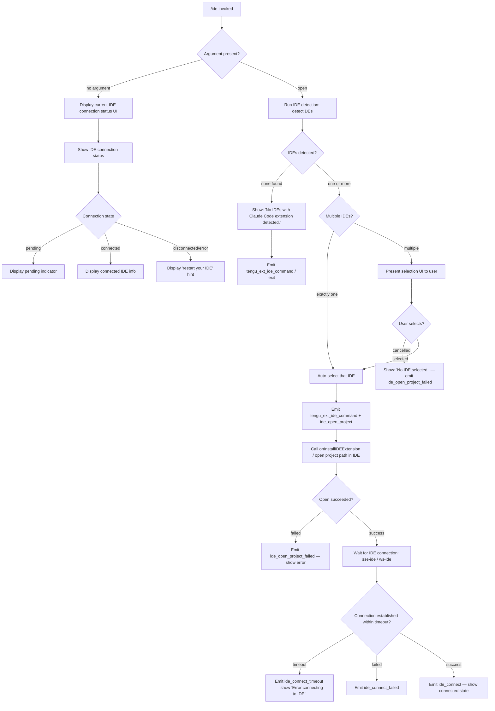

# `/ide`

> Analysis basis: CC v2.1.183 bundle.js (AST extraction + Claude interpretation)
> Minimum version: v2.1.183

---

## Overview

The `/ide` command manages IDE integrations for Claude Code, allowing users to detect connected IDEs, open the current project in a selected IDE, and monitor or establish IDE extension connections via SSE (`sse-ide`) or WebSocket (`ws-ide`) transports. When invoked with the optional `open` subcommand argument, the handler attempts to locate a compatible IDE with the Claude Code extension installed, opens the project there, and reports success or failure via telemetry.

---

## Registration

| Field | Value |
|---|---|
| type | `local-jsx` |
| name | `ide` |
| description | `Manage IDE integrations and show status` |
| argumentHint | `[open]` |
| module_id | `odl` |
| load_inline | `true` |
| loc_byte | `11820763` |
| loc_byte_end | `11820919` |
| loc_line | `7146` |
| arbor_handler.name | `e7p` |
| arbor_handler.fqn | `claude-2.1.183::e7p` |
| arbor_handler.kind | `AsyncFunction` |
| arbor_handler.resolution_path | `module_id` |
| arbor_handler.n_hits | `0` |

Analysis basis: CC v2.1.183 bundle.js:+11820763

---

## Input Branching

The command has four or more distinct input/state branches (no argument vs. `open` subcommand, IDE detection results, connection states), so a Mermaid flowchart is used.



Analysis basis: CC v2.1.183 bundle.js:+11816878 (handler entry `e7p`), +11817000, +11817266, +11817288, +11817331, +11817428, +11817634, +11817961, +11818005, +11818032, +11818982, +11819069, +11819176

---

## Behavioral Spec

### Top-level Handler (`e7p`)

The primary handler is the async function identified as `e7p` (Arbor resolution via `module_id` → `odl`). It runs when `/ide` is dispatched from the CLI.

```
async function ideCommandHandler(args, context):
    emit telemetry("tengu_ext_ide_command")

    subcommand = args[0]  // "open" or absent

    if subcommand == "open":
        return await handleIdeOpen(context)
    else:
        return renderIdeStatusUI(context)
```

Analysis basis: CC v2.1.183 bundle.js:+11816878, +11816986, +11817000

### IDE Detection (`_xn` / `detectIDEsWithExtension`)

When the `open` subcommand is used, the handler calls the IDE detection subsystem (`_xn`). Detection logic:

1. Iterates over known IDE process name patterns including: `windsurf`, `devin`, `cursor`, `insiders`, `vscode`, `vs code`, `visual studio code`, `vscodium`, `code - oss`, `codium`, `jetbrains` family (idea, pycharm, webstorm, phpstorm, rubymine, clion, goland, rider, datagrip, dataspell, aqua, gateway, fleet, android-studio), and `appcode`.
2. On Linux, executes: `ps aux | grep -E "code|cursor|windsurf|devin-desktop|idea|pycharm|webstorm|phpstorm|rubymine|clion|goland|rider|datagrip|dataspell|aqua|gateway|fleet|android-studio" | grep -v grep` (bundle.js:+6665451) to enumerate running IDE processes.
3. On macOS and WSL environments, uses platform-specific path resolution (`D3d`), including scanning `~` home directory and resolving symlinks/realpaths. WSL paths under `/mnt/c/Users` are considered (bundle.js:+6658692), skipping system accounts (`Public`, `Default`, `Default User`, `All Users`).
4. Normalises detected IDE names to lowercase for matching (`nea`, `yxn`).
5. Each candidate IDE is verified for the Claude Code extension via socket-connectivity probing (`x3d`, `Vvr`, `qr`) — connecting to an IDE-side IPC socket, checking availability.
6. Emits `tengu_feature_ok` (bundle.js:+1021887) on successful detection, `tengu_feature_bad` (bundle.js:+1021954) on failure.
7. Detection failures are reported as `ide_detect` / `ide_detect_failed` telemetry (bundle.js:+6662041, +6662105).

```
async function detectIDEsWithExtension():
    emit telemetry("ide_detect")
    candidates = gatherRunningIDEProcesses()   // platform-aware
    results = await Promise.all(candidates.map(verifyExtensionSocket))
    validIDEs = results.filter(r => r.connected)
    if validIDEs.isEmpty():
        emit telemetry("ide_detect_failed")
        return []
    return validIDEs
```

Analysis basis: CC v2.1.183 bundle.js:+6660686, +6660735, +6660749, +6660775, +6661054, +6661145, +6661680, +6662038, +6662083

### IDE Name Normalisation (`nea`, `yxn`)

```
function normaliseIDEName(rawName):
    lower = rawName.toLowerCase()
    // match against known families: windsurf, devin, cursor, insiders,
    // vscode/vs code/visual studio code, vscodium, code-oss, codium,
    // jetbrains products, appcode
    return matchedFamily or lower
```

Analysis basis: CC v2.1.183 bundle.js:+6663521, +6663964

### IDE Process Path Resolution (`D3d` / `resolveIDEPaths`)

```
async function resolveIDEPaths(baseDir):
    // Check if path is directory or symlink
    stat = await fs.stat(path)
    if stat.isDirectory() or stat.isSymbolicLink():
        realpath = await fs.realpath(path)
        // skip already-visited (dedup set)
        // collect binary paths
    // Special handling for WSL: scan /mnt/c/Users, skip Public/Default accounts
    // Return list of resolved executable paths
```

Analysis basis: CC v2.1.183 bundle.js:+6658394, +6658471, +6658523, +6658692, +6658786, +6658825, +6659147

### Open Project in IDE (`e7p` → `onInstallIDEExtension` → `RL`)

When an IDE is selected:

1. Calls `t.onInstallIDEExtension` (bundle.js:+11818005) with the selected IDE descriptor.
2. Uses `RL` (bundle.js:+11818072) to resolve the IDE executable's basename and command path, appending `.cmd` on Windows (bundle.js:+6664134).
3. Opens the current project directory (worktree or project root) in the IDE via the resolved command.
4. Emits `ide_open_project` (bundle.js:+11817431), tagging whether a `worktree` or `project` path was used (bundle.js:+11817465, +11817476).
5. On failure, emits `ide_open_project_failed` (bundle.js:+11817538).
6. Hint text "restart your IDE" is shown on persistent failure (bundle.js:+11818097).

```
async function openProjectInIDE(ideDescriptor, projectPath):
    emit telemetry("ide_open_project", {type: worktreeOrProject})
    cmd = resolveIDECommand(ideDescriptor)   // uses RL, handles .cmd suffix
    result = await spawnIDECommand(cmd, projectPath)
    if result.failed:
        emit telemetry("ide_open_project_failed")
        showError("restart your IDE")
        return false
    return true
```

Analysis basis: CC v2.1.183 bundle.js:+11817428, +11817431, +11817465, +11817476, +11817492, +11817516, +11817538, +11818005, +11818072, +6664056, +6666345, +6666403

### IDE Connection Monitoring (React UI Component `rdl`)

The JSX rendering component (`rdl`) manages the connection state UI:

1. Uses `React.useState`, `React.useRef`, `React.useEffect`, `React.useCallback` (bundle.js:+11818765, +11818843, +11818857, +11819264).
2. Reads app state via `ft` / `So` (Zustand-style store hooks).
3. Connection state transitions: `pending` → `connected` or `ide_connect_failed` / `ide_connect_timeout`.
4. Filters MCP tool names prefixed with `mcp__ide__` (bundle.js:+11819572) to enumerate IDE-provided tools.
5. Detects disconnect events and emits `ide_disconnect` (bundle.js:+11819675).
6. Supports both SSE transport (`sse-ide`, bundle.js:+11814865) and WebSocket transport (`ws-ide`, bundle.js:+11814885).
7. Shows "Connecting to …" (bundle.js:+11820012) while establishing; "IDE selection cancelled" (bundle.js:+11820145) on user abort.

```
function IDEStatusComponent(props):
    [connectionState, setConnectionState] = useState("pending")
    appState = useAppState()
    ideTools = appState.mcpTools.filter(t => t.name.startsWith("mcp__ide__"))

    useEffect(() => {
        // subscribe to ide connection events
        // on connect: emit tengu ide_connect, setConnectionState("connected")
        // on timeout: emit ide_connect_timeout
        // on fail:    emit ide_connect_failed
        // on disconnect: emit ide_disconnect
    }, [])

    if connectionState == "pending":   render PendingIndicator
    if connectionState == "connected": render ConnectedIDEInfo(ideTools)
    else:                              render ErrorUI("Error connecting to IDE.")
```

Analysis basis: CC v2.1.183 bundle.js:+11818765, +11818836, +11818843, +11818857, +11818938, +11818979, +11818982, +11819052, +11819069, +11819138, +11819176, +11819264, +11819425, +11819444, +11819572, +11819665, +11819675, +11819779, +11819933

### IDE Status Display Formatting (`dEo` / `formatIDEStatusLine`)

A formatting helper builds truncated IDE status lines for display:

- Slices the detected IDE list to a maximum of 3 entries (literal `3`, bundle.js:+11820294).
- Normalises strings to NFC form (bundle.js:+11820362, literal `"NFC"`).
- Maps entries with `Math.floor` for width calculation (bundle.js:+11820325).
- Joins with `", "` separator and appends `", …"` when truncated (bundle.js:+11820519, +11820533).

```
function formatIDEStatusLine(ideList):
    displayList = ideList.slice(0, 3)
    normalised = displayList.map(name => name.normalize("NFC"))
    line = normalised.join(", ")
    if ideList.length > 3:
        line = line + ", …"
    return line
```

Analysis basis: CC v2.1.183 bundle.js:+11820257, +11820264, +11820294, +11820325, +11820350, +11820362, +11820371, +11820389, +11820411, +11820437, +11820496, +11820519, +11820533

### MCP Skills Integration (`fw` / `Uk` / `ct`)

The command integrates with the MCP subsystem for IDE tools:

- `fw` initialises MCP tool hashing and cleanup (bundle.js:+11819425).
- `Uk` calls `ct` (bundle.js:+6624968) to register discovered MCP skills; emits `tengu_mcp_skills` (bundle.js:+6624971).
- Tool fingerprinting uses SHA-256 hashing of tool descriptors (literal `"sha256"`, bundle.js:+6571574), truncated to 16 chars (bundle.js:+6571616).

Analysis basis: CC v2.1.183 bundle.js:+11819425, +6832491, +6832574, +6832695, +6624968, +6624971, +6571415, +6571559, +6571574, +6571616

---

## State & Side Effects

| Item | Detail |
|---|---|
| Telemetry: `tengu_ext_ide_command` | Emitted at handler entry (bundle.js:+11816880) |
| Telemetry: `tengu_feature_ok` | IDE detection succeeded (bundle.js:+1021887) |
| Telemetry: `tengu_feature_bad` | IDE detection hard failure (bundle.js:+1021954) |
| Telemetry: `tengu_feature_sad` | IDE detection soft/partial failure (bundle.js:+1022035) |
| Telemetry: `ide_detect` / `ide_detect_failed` | Per detection attempt (bundle.js:+6662041, +6662105) |
| Telemetry: `ide_open_project` | When `open` succeeds in opening IDE (bundle.js:+11817431) |
| Telemetry: `ide_open_project_failed` | When open attempt fails (bundle.js:+11817538) |
| Telemetry: `ide_connect` | IDE extension connection established (bundle.js:+11818982) |
| Telemetry: `ide_connect_failed` | Connection failed (bundle.js:+11819069) |
| Telemetry: `ide_connect_timeout` | Connection timed out (bundle.js:+11819176) |
| Telemetry: `ide_disconnect` | IDE disconnected during session (bundle.js:+11819675) |
| Telemetry: `tengu_mcp_skills` | MCP IDE tool registration (bundle.js:+6624971) |
| Telemetry: `tengu_daemon_control` | Daemon control operations (bundle.js:+17311864) |
| Telemetry: `tengu_bg_spare_enable` / `tengu_bg_spare_claim` / `tengu_bg_spare_claim_fail` | Background session spare pool events (bundle.js:+17276321, +17276449, +17276715) |
| Transport registration | Registers `sse-ide` (SSE transport) and `ws-ide` (WebSocket transport) connections (bundle.js:+11814865, +11814885) |
| MCP tool filtering | Filters app-state tools matching prefix `mcp__ide__` for IDE tool enumeration (bundle.js:+11819572) |
| appState changes | Reads and subscribes to IDE connection state via Zustand-compatible store hooks (`ft`, `So`) |
| Sound | None observed in depth-2 traversal |
| File I/O | Config directory `.claude` (bundle.js:+4906694); `pins.json` for pinned jobs (bundle.js:+4287825); PTY/roster files under daemon job directories |
| Process interaction | Spawns IDE command via `zq.spawn` (bundle.js:+17276778); sends SIGTERM on kill (bundle.js:+17276971); checks free memory via `os.freemem` (bundle.js:+17275454) |

---

## Version History

| Version | Change |
|---|---|
| v2.1.183 | Initial analysis |

---

## Common Mistakes

1. **Invoking `/ide open` when no IDE has the Claude Code extension installed** — the command will display "No IDEs with Claude Code extension detected." (bundle.js:+11817095) and exit without opening anything. Install the Claude Code extension in your IDE first.
2. **Cancelling the IDE selection prompt** — if multiple IDEs are detected and the user dismisses the selection UI, the command shows "No IDE selected." (bundle.js:+11817233) and exits. This is logged as `ide_open_project_failed`.
3. **Expecting instant connection after `/ide open`** — after the IDE opens, the command waits for the IDE extension to establish its SSE or WebSocket connection. A timeout triggers `ide_connect_timeout` and shows "Error connecting to IDE." (bundle.js:+11819294). Restart the IDE extension if this occurs.
4. **Using `/ide` without the `open` argument to open an IDE** — without `open`, the command only shows the current IDE connection status; it does not attempt to launch any IDE.
5. **WSL users with Windows-side IDEs** — the detection path scans `/mnt/c/Users` but skips system accounts (`Public`, `Default`, `Default User`, `All Users`). Ensure your Windows user profile is accessible under `/mnt/c/Users/<username>` for detection to work.
6. **JetBrains IDEs on Linux** — detection relies on the `ps aux` grep pattern including `idea`, `pycharm`, etc. (bundle.js:+6665451). If the JetBrains launcher process name differs (e.g. custom scripts), detection may fail.

---

## Appendix — Identifier Mapping

> For bundle debugging only. Identifiers change across versions.

| Identifier | Role |
|---|---|
| `e7p` | Main `/ide` async command handler (Arbor-resolved, `module_id` path) |
| `dEo` | IDE status line formatter / display helper |
| `_xn` | IDE detection orchestrator (detects IDEs with extension) |
| `D3d` | IDE path resolver (filesystem walk, symlink resolution, WSL handling) |
| `Hxn` | Parallel IDE candidate enumerator (Promise.all map over candidates) |
| `x3d` | IDE socket connectivity verifier |
| `Vvr` | IDE socket response validator / parser |
| `nea` | IDE name normaliser (lowercase matching) |
| `yxn` | IDE variant classifier (maps process name to IDE family) |
| `RL` | IDE command resolver (basename, `.cmd` suffix on Windows) |
| `$3d` | IDE open command builder (builds open-project invocation) |
| `tzr` | IDE open orchestrator (wraps `$3d`) |
| `QZi` | Process signal helper (calls `process.kill`) |
| `rea` | String replacement helper for IDE names (e.g. "Devin Desktop") |
| `Di` | String index/slice utility |
| `rdl` | React JSX component: IDE status/connection UI |
| `e7p` (also `handler_name`) | AsyncFunction handler registered via `module_id: odl` |
| `iA` | Internal arg-parsing helper called by `e7p` |
| `Mt` | Store/state accessor helper |
| `Qen` | State getter (calls `Jen.getStore`) |
| `Ar` | App-level utility called from `Mt` |
| `gx` | Low-level utility called from `Ar`/`Ec` |
| `Un` | Rendering helper (uses `qr`, `Mt`) |
| `dEo` | Status-line formatting function (NFC normalise, slice-3, join) |
| `Pt` | Feature telemetry wrapper (emits `tengu_feature_*`) |
| `ke` | Telemetry emitter (`tengu_feature_ok`) |
| `Re` | Telemetry emitter (`tengu_feature_bad`) |
| `Ue` | Telemetry sink (`ogt`) |
| `ft` | Zustand store hook (reads app state) |
| `So` | Zustand store hook (alternate accessor) |
| `BBr` | React context reader for app state (`hCe.useContext`) |
| `Rd` | Zustand-compatible `useSyncExternalStore` hook wrapper |
| `fw` | MCP tool registration and cleanup coordinator |
| `hot` | MCP tool hash/fingerprint builder |
| `Vwe` | Tool descriptor hasher (SHA-256, 16-char truncation) |
| `Uk` | MCP skills registration caller (calls `ct`) |
| `ct` | MCP skill registration function (emits `tengu_mcp_skills`) |
| `Oee` | IDE-related helper called after open attempt |
| `zzp` | Post-connection handler called by `e7p` |
| `hxn` | IDE connection wait / timeout monitor |
| `gLi` | Pattern-match helper (`.match` on IDE name string) |
| `Gp` | Utility called in IDE verification path |
| `qr` | Core rendering/output function |
| `zOe` | Promise-based connection helper (reject/resolve logic) |
| `Cv` | Calls `zOe` in connection context |
| `j` | General-purpose low-level utility (appears many call sites) |
| `T` | Formatting / string output utility |
| `Ee` | String coercion helper (`String()`) |
| `De` | Error logging helper (`QJ.logError`) |
| `ds` | File/directory utility (`dn`) |
| `dn` | Low-level filesystem or error helper |
| `Pe` | JSON serialisation helper (`JSON.stringify`) |
| `Gt` | JSON parse helper (`JSON.parse`) |
| `Mn` | Error/normalise helper (`dn`) |
| `wp` | Logging/debug helper (`dn`) |
| `st` | String coercion (`String`) |
| `Ho` | Error constructor wrapper |
| `Bn` | Timeout/abort promise helper |
| `Fs` | Process exit helper (calls `process.exit`) |
| `SG` | Graceful shutdown orchestrator (`Promise.race`, `Promise.all`) |
| `rF` | Daemon control emitter (`tengu_daemon_control`) |
| `MNr` | Session ID generator (`randomUUID`) |
| `gFe` | First-party session tagger |
| `T4` | Session state updater |
| `uB` | Sub-updater called by `T4` |
| `Lme` | MCP server shutdown caller (`wme.shutdown`) |
| `Nme` | Timeout clearer and cleanup (`clearTimeout`, `Cko`) |
| `p` | IDE normalise helper (calls `WT`, `process.exit`, `u.abort`) |
| `WT` | Forced-shutdown trigger (literal `"forced shutdown"`) |
| `u` | Background session manager (`ke`, `Re`, `rF`, `SG`) |
| `f` | Background job session handler (dispatch, spawn, memory checks) |
| `M` | Background job orchestrator (sessions, MCP, scheduling) |
| `Jnc` | Scheduled task formatter/runner |
| `AP` | Cron expression parser |
| `fae` | Background session file manager (`CMt`, `Dtt`) |
| `CMt` | Claude config directory writer (`.claude`) |
| `Dtt` | Config file reader (`utf-8`, `ENOENT`, `utf-8`) |
| `J1` | Config line parser (trims, pushes) |
| `J1i` | Session filter/expiry helper |
| `ktt` | Session timestamp checker |
| `d` | IDE daemon supervisor manager (start/stop/update) |
| `Aje` | File existence/type verifier (lstat, isFile, 1048576-byte limit) |
| `qDl` | Column-width formatter (`Math.max`, `ay`) |
| `Puc` | Heartbeat sender (`zse`) |
| `E` | Spinner/progress component (Math.max, Math.min) |
| `I` | Keyboard-event handler (`preventDefault`) |
| `CQ` | Shell command runner (`vfe`, sh -c, 3000ms timeout) |
| `vfe` | Shell output trimmer (`moe`, `t.trim`) |
| `k` | IDE process verifier via realpath/stat (`Uuc`) |
| `Uuc` | Realpath+stat resolver (`RZn.realpath`, `RZn.stat`) |
| `j6f` | PTY path helper (`BUn`) |
| `g` | Background session I/O handler (Buffer, IPC messages) |
| `T6f` | Daemon IPC protocol handler (dispatch, attach, resize, etc.) |
| `Qp` | IPC response encoder (`e.end`, `Pe`) |
| `m` | Job registry (values, kill) |
| `h` | IPC socket wrapper (`a`, `setTimeout`) |
| `NNo` | Socket-claim sender (`zq.claim`) |
| `Nko` | Daemon config writer (`Yq.writeFile`, JSON.stringify, 448/384 literals) |
| `f6f` | Claim send-timeout handler (5000ms, `send-claim timeout`) |
| `m6f` | Socket connection helper (`xZn.connect`) |
| `p6f` | Claim frame builder (`zq.buildClaimFrame`) |
| `FM` | Binary frame encoder (Buffer, `writeUInt32BE`, `writeUInt8`) |
| `jNo` | Background job connection lifecycle manager |
| `Ic` | Job directory path builder (`fb.join`, `wk`) |
| `fa` | File-watch state manager (`zZ`, `NCe`) |
| `pg` | Active state setter (`Wx`) |
| `Wx` | State activator (`Bie`) |
| `OCe` | MCP tool set builder (startsWith, indexOf, J4/Zkt/F$e sets) |
| `WAd` | MCP tool set diff helper |
| `Pp` | Atomic file writer (`vh`, `fb.join`) |
| `vh` | Safe file write (random bytes temp file, rename, chmod) |
| `mT` | Cache-delete helper (`zZ.delete`) |
| `rft` | Roster file manager (read, write, validate) |
| `Iq` | Roster entry parser/validator (lstat, isFile, E2BIG/EFTYPE) |
| `TKp` | Roster entry writer (`vh`, mkdir) |
| `P6t` | PTY PID path helper |
| `e_e` | PTY error path helper (`xGe`) |
| `xGe` | PTY sub-path builder (`ZHe`) |
| `iD` | Late-PTY path resolver (`Lcl`) |
| `Lcl` | PTY path from session parts (split, join) |
| `BN` | Daemon socket path builder (`Uyo`, `nft`) |
| `Uyo` | Socket path helper (`yKp`) |
| `nft` | PTY path builder (`yne`) |
| `WM` | Late-roster path builder (`Lcl`) |
| `R6t` | Socket path builder (`qh.join`, `M6t`) |
| `M6t` | Auth token path builder (`yne`) |
| `YKn` | Low-memory checker (`zt`, `ct`; emits `tengu_bg_low_mem_mb`) |
| `B$e` | Pins-file manager (`pins.json`, lstat, rm, readdir) |
| `nDt` | Pin path resolver (`fb.join`, `wk`) |
| `wk` | Job-base path builder (`fb.join`, `tr`) |
| `zAd` | Directory scanner for pinned jobs (readdir, lstat, filter) |
| `mki` | Directory creator helper (`fT.mkdir`) |
| `LA` | File copy/link helper (`dn`, `SPe`, `T`, `Ee`, `De`) |
| `$` | Permission-decision handler (`zlt`, `R6`; allow/deny/classify/ask) |
| `zlt` | Risk classifier (`rio`, `R2t`, `T`) |
| `R2t` | Classifier model runner (many sub-helpers) |
| `R6` | Permission routing (`Eu`, `Bot`, `yb`, `st`, `cdt`, `wfo`, `Lfo`, `hP`) |
| `Eu` | Permission state resolver (`zt`, `xpe`) |
| `Bot` | Permission store lookup (`ZC`, `Eu`) |
| `yb` | Permission UI renderer (`Hl`) |
| `wfo` | Permission SSE handler (`SKa`, `ro`) |
| `Lfo` | Permission fetch handler (`tN`, `Gut`, `ro`) |
| `hP` | Permission model caller (`MMt`, `T`, `wr`, `Mu`) |
| `_` | MCP transport manager (SDK/HTTP/SSE/dynamic; `xht`, `GF`, `vP`, `eY`, `ZB`) |
| `xht` | MCP transport state reader (`pcc`) |
| `pcc` | MCP server key enumerator (`Object.keys`) |
| `Ho` | Error string constructor |
| `Rd` | React `useSyncExternalStore` wrapper for Zustand |

---

Note: index built via Arbor fallback; some signals (telemetry, literals) may be missing — see arbor-fallback.js.