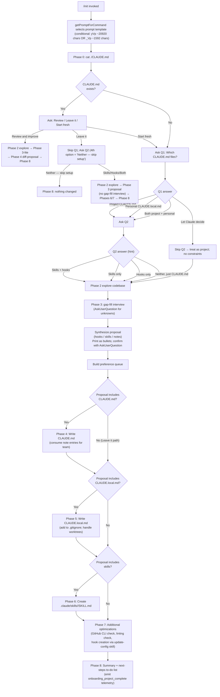

# `/init`

> Analysis basis: CC v2.1.181 bundle.js (AST extraction + Claude interpretation)
> Minimum version: v2.1.181

---

## Overview

The `/init` command bootstraps a repository's Claude Code configuration by creating `CLAUDE.md` file(s) and optionally scaffolding skills and hooks. It drives a structured, multi-phase agent conversation that first inspects the codebase, gathers user preferences through guided questions, then writes only the artifacts that pass user approval. The command's handler resolves conditionally to one of two prompt templates (`yVp` at ~20 920 chars or `_Vp` at ~1 592 chars) before dispatching the agent.

---

## Registration

| Field | Value |
|---|---|
| type | `prompt` |
| name | `init` |
| description | `Initialize new CLAUDE.md file(s) and optional skills/hooks with codebase documentation \| Initialize a new CLAUDE.md file with codebase documentation` |
| loc_byte | `11820316` |
| loc_byte_end | `11820709` |
| loc_line | `7337` |
| handler_method | `getPromptForCommand` |
| handler_method_start | `11820632` |
| handler_method_end | `11820708` |
| prompt_body.length | `22519` characters |
| prompt_body.trace | `conditional; identifier→yVp (var template, 20920 chars); identifier→_Vp (var template, 1592 chars)` |
| arbor_handler.name | `getPromptForCommand` |
| arbor_handler.kind | `Method` |
| arbor_handler.fqn | `claude-2.1.181::getPromptForCommand` |
| arbor_handler.resolution_path | `direct` |
| arbor_handler.n_hits | `2` |

Analysis basis: CC v2.1.181 bundle.js:+11820316

---

## Input Branching

The command has more than three distinct decision paths; a flowchart is mandatory.



---

## Behavioral Spec

### Phase 0 — Pre-flight existence check

```
function checkExistingClaudeMd():
    content = shell("cat ./CLAUDE.md")   // project root only
    return content IS NOT error           // true = file exists
```

The agent reads only the project-root `CLAUDE.md`; it does not recurse into subdirectories at this step.

Analysis basis: CC v2.1.181 bundle.js:+11820632

---

### Prompt template selection (conditional dispatch)

```
function getPromptForCommand(context):
    if featureFlag(context) is ENABLED:
        return templateYVp     // ~20920-char extended template with full 8-phase flow
    else:
        return templateVp      // ~1592-char legacy template (simpler CLAUDE.md creation)
```

The handler (`getPromptForCommand`) conditionally chooses between two prompt bodies. The feature-flag check calls through `onboardingProjectComplete` detection (literal `"onboarding_project_complete"` at bundle.js:+4126255) and the experiment routing function (`slateHarborExperiment`). The extended template is the dominant path in v2.1.181.

Analysis basis: CC v2.1.181 bundle.js:+11820638, +11820667, +4126255

---

### Phase 1 — Guided setup questions

```
function phaseOneQuestions(claudeMdExists):
    printPrimer()   // always print the CLAUDE.md / skills / hooks primer first

    if claudeMdExists:
        answer = askUserQuestion("I found an existing CLAUDE.md. What would you like to do?",
                                  options=["Review and improve it",
                                           "Leave it, set up other things",
                                           "Start fresh (replace it)"])
        route(answer)
    else:
        answer_q1 = askUserQuestion("Which CLAUDE.md files should /init set up?",
                                     options=["Project CLAUDE.md",
                                              "Personal CLAUDE.local.md",
                                              "Both project + personal",
                                              "Let Claude decide"])
        if answer_q1 != "Let Claude decide":
            answer_q2 = askUserQuestion("Also set up skills and hooks?",
                                         options=["Skills + hooks", "Skills only",
                                                  "Hooks only", "Neither, just CLAUDE.md"])
        // "Let Claude decide" skips Q2; treated as project + no constraints
```

Q1 and Q2 are separate `AskUserQuestion` calls; they must **not** be merged into a single call.

Analysis basis: CC v2.1.181 bundle.js:+11820316

---

### Phase 2 — Codebase exploration (subagent)

```
function exploreCodbase():
    files = [
        "package.json", "Cargo.toml", "pyproject.toml",
        "go.mod", "pom.xml", "README", "Makefile",
        "CI config", "CLAUDE.md", ".claude/rules/",
        "AGENTS.md", ".cursor/rules", ".cursorrules",
        ".github/copilot-instructions.md",
        ".devin/rules/", ".windsurf/rules/", ".windsurfrules",
        ".clinerules", ".mcp.json"
    ]
    subagent.readAll(files)

    detect("build, test, lint commands (non-standard)")
    detect("languages, frameworks, package manager")
    detect("project structure: monorepo | multi-module | single")
    detect("code style deviations from language defaults")
    detect("non-obvious gotchas, required env vars")
    detect("existing .claude/skills/ and .claude/rules/")
    detect("formatter config: prettier | biome | ruff | black | gofmt | rustfmt")
    detect("git worktrees: shell('git worktree list')")

    unknowns = whatCouldNotBeDetermined()
    return { findings, unknowns }
```

Analysis basis: CC v2.1.181 bundle.js:+11820316

---

### Phase 3 — Gap-fill interview and proposal synthesis

```
function phaseThreeInterview(q1Choice, findings, unknowns):
    // Ask only what the code cannot answer
    if q1Choice IN ["project", "both", "let claude decide"]:
        askAboutCodebasePractices(unknowns)   // no "recommended" labels
    if q1Choice IN ["personal", "both"]:
        askAboutUserPreferences()             // role, familiarity, sandboxes, worktrees, comms
    if q1Choice == "review and improve":
        askSingleQuestion("Has anything changed about how the team works?",
                           options=["No, nothing's changed", "Yes — let me describe"])

    proposal = synthesize(findings, gapFillAnswers)
    // Each item typed as: hook | skill | note | file
    // Q2 is a hint — deviation from Q2 is noted but doesn't block proposal

    printProposal(proposal)   // plain assistant text, not preview field
    confirmation = askUserQuestion("Does this look right?",
                                   options=["Looks good — proceed", "Drop the hook",
                                            "Drop the skill"])
    preferenceQueue = buildQueue(confirmation)
    return preferenceQueue
```

Analysis basis: CC v2.1.181 bundle.js:+11820316

---

### Phase 4 — Write CLAUDE.md

```
function writeCLAUDEmd(path, findings, noteEntries, isReviewPath):
    if isReviewPath:
        existing = readFile(path)
        diffs = computeDiffs(existing, findings)
        printDiffs(diffs)
        confirmation = askUserQuestion("Apply these edits?",
                                       options=["Apply all", "Let me pick which",
                                                "Skip — leave it as is"])
        if confirmation == "Skip": return

    content = buildMinimalContent(findings, noteEntries)
    // content test: "would removing this line cause Claude to make mistakes?"
    // prefix with standard CLAUDE.md header
    // consume team-level note entries from preference queue
    // suggest .claude/rules/ for multi-concern projects
    // offer subdirectory CLAUDE.md for monorepos

    writeFile("./CLAUDE.md", content)
```

Every included line must answer "yes" to the removal-error test. Generic advice, standard conventions, and frequently-changing information are excluded. The string `"CLAUDE.md"` is referenced at bundle.js:+4125743.

Analysis basis: CC v2.1.181 bundle.js:+11820316, +4125743

---

### Phase 5 — Write CLAUDE.local.md

```
function writeCLAUDELocalMd(findings, noteEntries, worktreeInfo):
    if worktreeInfo.hasSiblingOrExternalWorktrees:
        // Write personal content to ~/.claude/<project-name>-instructions.md
        // Make CLAUDE.local.md a one-line import stub
        stub = "@~/.claude/<project-name>-instructions.md"
        writeFile("./CLAUDE.local.md", stub)
    else:
        content = buildPersonalContent(noteEntries)
        if fileExists("./CLAUDE.local.md"):
            proposeAdditionsOnly()   // do not silently overwrite
        else:
            writeFile("./CLAUDE.local.md", content)

    appendToGitignore("CLAUDE.local.md")
```

The personal-notes import stub must never appear in the shared `CLAUDE.md`.

Analysis basis: CC v2.1.181 bundle.js:+11820316

---

### Phase 6 — Create skills

```
function createSkills(preferenceQueue, findings):
    for skill in preferenceQueue.filter(type="skill"):
        name = deriveSkillName(skill.description)
        body = combineUserWordsAndFindings(skill, findings)
        if conflictsWithBundledSkill(name):
            notifyUser("bundled skill still exists; yours is additive")
        writeSKILLmd(".claude/skills/" + name + "/SKILL.md", body)

    additionalSkills = suggestFromFindings(findings)
    for each suggestion:
        printSuggestion(name, purpose, reason)
        // do not overwrite existing skills in .claude/skills/
```

Skills with side effects receive `disable-model-invocation: true` and accept `$ARGUMENTS`.

Analysis basis: CC v2.1.181 bundle.js:+11820316

---

### Phase 7 — Additional optimizations

```
function phaseSevenOptimizations(preferenceQueue, findings, q1Choice):
    // GitHub CLI check
    ghPresent = shell("which gh")  // "where gh" on Windows
    if NOT ghPresent AND projectUsesGitHub():
        askUserQuestion("Install GitHub CLI?")

    // Linting check
    if NOT findings.hasLintConfig():
        askUserQuestion("Set up linting?")

    // Hooks from preference queue
    for hook in preferenceQueue.filter(type="hook"):
        targetFile = resolveTargetFile(q1Choice)
        // project → .claude/settings.json
        // personal → .claude/settings.local.json
        // only ask if q1Choice == "both" or ambiguous

        event, matcher = resolveEventMatcher(hook.description)
        // "after every edit" → PostToolUse, Write|Edit
        // "when Claude finishes" → Stop
        // "before running bash" → PreToolUse, Bash
        // "before committing" → NOT a hooks.json hook → git pre-commit hook

        if firstHookInRun:
            invokeTool("update-config", args="[hooks-only] " + summary)

        executeHookConstructionFlow(
            dedupCheck, construct, pipeTestRaw, wrap,
            writeJSON, jqValidate, liveProof, cleanup, handoff
        )

    // Formatter fallback
    if findings.hasFormatter AND NOT queueHasFormattingHook():
        offerFormatOnEditHook()
```

Analysis basis: CC v2.1.181 bundle.js:+11820316

---

### Phase 8 — Summary and next-steps

```
function phaseEightSummary(artifactsWritten, findings):
    printRecap(artifactsWritten)    // list files + key points
    printReminder("Review and tweak; run /init again anytime")

    todoList = []
    if findings.hasFrontendCode():
        todoList.add("/plugin install frontend-design@claude-plugins-official")
        todoList.add("/plugin install playwright@claude-plugins-official")
    if phase7GapsRejected():
        todoList.add(missingGhCli)
        todoList.add(missingLinting)
    if findings.testsAbsent():
        todoList.add("Set up a test framework")
    todoList.add("/plugin install skill-creator@claude-plugins-official")  // always
    todoList.add("Browse /plugin for official plugins")                    // always

    printTodoList(sortByImpact(todoList))
    emitTelemetry("onboarding_project_complete")
```

Analysis basis: CC v2.1.181 bundle.js:+4126255

---

### Config persistence (internal infrastructure)

The call graph shows that both `saveProjectConfig` (path through `II` → `n7n`) and `saveCurrentConfig` (path through `M_`) are reachable from the handler. These functions implement file locking and atomic writes.

```
function saveConfigWithLock(configPath, data):
    startTime = Date.now()
    if lockAcquisitionTime > 100ms:
        emitTelemetry("tengu_config_lock_contention")
        warn("Lock acquisition took longer than expected...")

    reRead = readConfigFromDisk(configPath)
    if cacheHasAuth AND reReadMissingAuth:
        emitTelemetry("tengu_config_auth_loss_prevented")
        refuse()   // see GH #3117

    try:
        mkdirSync(dirname(configPath))
        writeFileSyncAndFlush(configPath, JSON.stringify(data))
    catch staleness:
        emitTelemetry("tengu_config_stale_write")
    catch fallback:
        emitTelemetry("tengu_config_fallback_write")

function saveCurrentProjectConfig(projectPath, data):
    // similar lock+re-read pattern
    // emits "save_project" literal (bundle.js:+13943501)
```

The write routine (`writeFileSyncAndFlush`) performs: open file descriptor → write content → apply original permissions → fsync → rename (atomic swap). Maximum backup files retained: 5 (bundle.js:+13940158). Backup directory: `"backups"` (bundle.js:+13940740). Backup filename prefix uses `".backup."` (bundle.js:+13940025). Lock timeout threshold: 100 ms (bundle.js:+13939133). Config lock wait ceiling: 60 000 ms (bundle.js:+13939909). File mode for new config files: `384` (octal 0o600, bundle.js:+13940440).

Analysis basis: CC v2.1.181 bundle.js:+13939228, +13939364, +13939707, +13938844, +13943501

---

### Onboarding flag / experiment wiring

```
function resolveOnboardingExperiment(context):
    featureResult = checkFeatureFlag("tengu_feature_ok")
    experimentResult = checkSlateHarborExperiment("tengu_slate_harbor_experiment")
    // determines which of the two prompt templates is dispatched
    // also gates the onboarding_project_complete event
```

Analysis basis: CC v2.1.181 bundle.js:+1019804, +11797207

---

## State & Side Effects

| Item | Detail |
|---|---|
| Telemetry — `tengu_config_parse_error` | Fired when the config file cannot be parsed (bundle.js:+13941803) |
| Telemetry — `tengu_config_lock_contention` | Fired when config lock acquisition exceeds 100 ms (bundle.js:+13939228) |
| Telemetry — `tengu_config_stale_write` | Fired when a stale write is detected during config save (bundle.js:+13939364) |
| Telemetry — `tengu_config_auth_loss_prevented` | Fired when a write is refused because re-read config is missing auth (bundle.js:+13939707) |
| Telemetry — `tengu_config_fallback_write` | Fired on fallback write path (bundle.js:+13938844) |
| Telemetry — `tengu_feature_ok` | Fired during feature-flag check that gates prompt template selection (bundle.js:+1019804) |
| Telemetry — `tengu_slate_harbor_experiment` | Fired during A/B experiment routing (bundle.js:+11797207) |
| Files written | `./CLAUDE.md`, `./CLAUDE.local.md` (optional), `.claude/skills/<name>/SKILL.md` (optional), `.claude/settings.json` or `.claude/settings.local.json` for hooks |
| `.gitignore` mutation | `CLAUDE.local.md` appended when Phase 5 runs |
| Config backup | Up to 5 rotated backups kept under `backups/` subdirectory alongside the config file |
| File locking | Exclusive lock acquired before every config write; max wait 60 000 ms |
| Atomic write | `open → write → fchmod → fsync → rename` sequence used by `writeFileSyncAndFlush` |
| Onboarding completion event | Literal `"onboarding_project_complete"` emitted (bundle.js:+4126255) after Phase 8 |
| Project config save | Literal `"save_project"` used as operation identifier (bundle.js:+13943501) |
| Sound | <!-- TODO: not found in depth-2 traversal; needs --depth 4 --> |
| appState changes | <!-- TODO: not found in depth-2 traversal; needs --depth 4 --> |

---

## Version History

| Version | Change |
|---|---|
| v2.1.181 | Initial analysis — 8-phase prompt flow (22 519 chars), conditional template dispatch between `yVp` (~20 920 chars) and `_Vp` (~1 592 chars), config lock telemetry, skills/hooks scaffolding |

---

## Common Mistakes

1. **Merging Q1 and Q2 into one call** — the prompt explicitly forbids calling `AskUserQuestion` with both questions simultaneously. Q2 must be asked only after Q1 is answered, and is skipped entirely when the user picks "Let Claude decide."
2. **Writing to CLAUDE.md before user confirmation** — every artifact must be presented as a proposal and confirmed via `AskUserQuestion` before any file is written.
3. **Putting `@~/.claude/<project-name>-instructions.md` in project CLAUDE.md** — this import stub is for `CLAUDE.local.md` only; placing it in the shared team file leaks personal references into source control.
4. **Overwriting an existing CLAUDE.local.md silently** — Phase 5 requires reading the existing file and proposing additions, not silently replacing it.
5. **Overwriting existing skills in `.claude/skills/`** — Phase 6 must review existing skills first and only propose complementary new ones.
6. **Using the `preview` field in the proposal confirmation call** — the proposal is already printed as plain assistant text; the `preview` field must not be used.
7. **Issuing the `update-config` skill invocation more than once per `/init` run** — the hook reference must be loaded exactly once; subsequent hooks reuse the already-loaded schema.
8. **Routing a "before committing" preference to a hooks.json hook** — `PostToolUse`/`PreToolUse` matchers cannot filter by Bash command content; `git commit` gates must use a git pre-commit hook mechanism instead.
9. **Ignoring the auth-loss guard** — if the re-read config is missing auth that the cache holds, the write must be refused and `tengu_config_auth_loss_prevented` emitted (GH #3117 regression).
10. **Accessing config before it is allowed** — the literal `"Config accessed before allowed."` (bundle.js:+13941172) guards premature reads; any caller must respect this gate.

---

## Appendix — Identifier Mapping

> For bundle debugging only. Identifiers change across versions.

| Identifier | Role |
|---|---|
| `__handler_init` | Synthetic BFS entry point for the `/init` command handler (not a real bundle symbol) |
| `qZe` | Onboarding orchestrator — top-level coordinator called from the handler |
| `M_` | Save-current-config writer (project-level config persistence) |
| `It` | Config file watcher / change-detection loop |
| `jt` | Logging / debug utility |
| `p0o` | Config path resolver |
| `w_e` | Config file reader (reads, parses, and handles ENOENT/EEXIST) |
| `Byf` | File-watch setup helper (wraps `watchFile`/`unwatchFile`) |
| `Fwi` | CLAUDE.md path / workspace resolution wrapper |
| `FBr` | CLAUDE.md file locator (joins path, checks `"CLAUDE.md"` literal) |
| `Mt` | Module/config entry loader |
| `KXo` | Config key lookup helper |
| `II` | Save-project-config writer (project config with lock) |
| `n7n` | Atomic config write core (mkdir → lock → re-read → write → backup rotation) |
| `t` | Generic utility / `t.toUpperCase` string helper |
| `s` | Lock-set manager (`s.mkdirSync`, `s.statSync`, `s.copyFileSync`, etc.) |
| `gBs` | Config merge helper (`Object.assign` wrapper with `kvr`) |
| `I` | Log-level / debug filter (`"debug"` literal gating) |
| `j` | JSON serialization / deserialization utility |
| `ln` | Error logger |
| `qmt` | Auth-loss guard checker (implements GH #3117 protection) |
| `n` | String normalizer (`i.toLowerCase`) |
| `Re` | JSON stringifier wrapper |
| `h0o` | Backup directory manager (creates `"backups"` subdirectory) |
| `T` | Scroll / UI position calculator (unrelated to file I/O) |
| `g` | Stream/buffer handler (`Buffer.concat`, `ETOOLARGE` guard) |
| `E` | Slice/range utility (`Math.max`, `Math.min`) |
| `lSt` | Atomic file write with fsync (`writeFileSyncAndFlush`) |
| `i` | Stream/socket close manager |
| `e` | Retry/back-off utility (`Math.random`, `setTimeout`) |
| `dMe` | Directory existence check helper |
| `L8t` | Timestamp recorder (`Date.now` wrapper) |
| `t7n` | Config fallback write path |
| `$e` | App-state accessor |
| `xe` | Feature-flag evaluator (emits `tengu_feature_ok`) |
| `HVp` | Experiment router (emits `tengu_slate_harbor_experiment`) |
| `rt` | String coercion utility |
| `ut` | Command registry / session watcher dispatcher |
| `txt` | Text-node renderer |
| `nxt` | Next-tick scheduler |
| `p4` | Priority queue or patch accumulator |
| `d4` | Diff / delta producer |
| `Ygn` | Session/command deduplication guard |
| `V1r` | Growthbook experiment event emitter (`GrowthbookExperimentEvent`) |
| `Q1r` | Queue consumer / resolution finalizer |

---

Note: index built via Arbor fallback; some signals (telemetry, literals) may be missing — see arbor-fallback.js.