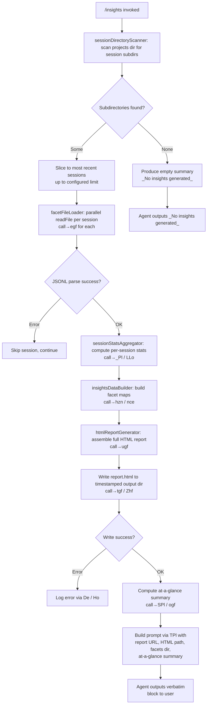

# `/insights`

> Analysis basis: CC v2.1.183 bundle.js (AST extraction + Claude interpretation)
> Minimum version: v2.1.183

---

## Overview

The `/insights` command generates a shareable HTML usage report that analyzes a user's Claude Code sessions, reading historical JSONL session data from disk, computing aggregated statistics across multiple facets, and then directing the agent to output a fixed confirmation message with a link to the generated report. The command is handled entirely inline via `getPromptForCommand`, which orchestrates data collection, HTML assembly, and prompt construction before handing off to the agent.

---

## Registration

| Field | Value |
|---|---|
| type | `prompt` |
| name | `insights` |
| description | `Generate a report analyzing your Claude Code sessions` |
| loc_byte | `13429814` |
| loc_byte_end | `13431118` |
| loc_line | `9828` |
| handler_method | `getPromptForCommand` |
| handler_method_start | `13429988` |
| handler_method_end | `13431117` |
| prompt_body.length | `513` characters |
| prompt_body.trace | `call→TPl(...) (1 literals)` |
| arbor_handler.name | `getPromptForCommand` |
| arbor_handler.fqn | `claude-2.1.183::getPromptForCommand` |
| arbor_handler.kind | `Method` |
| arbor_handler.resolution_path | `direct` |
| arbor_handler.n_hits | `1` |

Analysis basis: CC v2.1.183 bundle.js:+13429814

---

## Input Branching

The command's execution involves more than three distinct branches across session discovery, facet data loading, and report generation. A Mermaid flowchart is used below.



Analysis basis: CC v2.1.183 bundle.js:+13429994 (handler entry), +13430087 (call to `bPl`), +13430885 (`_No insights generated_` literal), +13431020 (call to `TPl`)

---

## Behavioral Spec

### 1. Handler Entry (`getPromptForCommand`)

The handler is registered as an inline ObjectMethod on the command registration object. Arbor resolves it directly via `resolution_path: direct` within the byte range `(13429988, 13431117)`.

```
function getPromptForCommand(commandContext):
    sessionList = collectAndProcessSessions(commandContext)
    if sessionList is empty:
        return buildPrompt(noInsightsPlaceholder)
    reportPaths = writeHtmlReport(sessionList)
    summary = computeAtAGlanceSummary(sessionList)
    promptText = buildFinalPrompt(reportPaths, summary)
    return promptText
```

Analysis basis: CC v2.1.183 bundle.js:+13429988

---

### 2. Session Directory Scanner (`pgf`)

Reads the top-level `projects` directory (literal: `"projects"`, bundle.js:+5216940) to enumerate session subdirectories. Filters entries using `isDirectory`. Up to 50 directories are processed per sweep (literals: `50` at bundle.js:+13416765, `200` at bundle.js:+13416770 suggest a secondary cap). Sorting is applied after collection (call to `r.sort`, bundle.js:+13416677). A `setImmediate` yield is inserted mid-scan to avoid blocking the event loop (bundle.js:+13416653).

```
function sessionDirectoryScanner(baseDir):
    entries = fs.readdir(baseDir)
    dirs = entries.filter(entry => entry.isDirectory())
    yield setImmediate()   // event-loop yield
    dirs.sort()
    return dirs
```

Analysis basis: CC v2.1.183 bundle.js:+13416373, +13416427, +13416441, +13416653, +13416677

---

### 3. Facet File Loader (`egf` → `vLo` → `C8t`)

For each discovered session directory, reads the session metadata file. The path is constructed by joining the base directory with subdirectory segments `"usage-data"` (bundle.js:+13355580), `"session-meta"` (bundle.js:+13355676), and `"facets"` (bundle.js:+13355630) via `jq.join`. Files are read with encoding `"utf-8"` (bundle.js:+13361729). The raw content is parsed via `JSON.parse` (call to `Gt`, bundle.js:+13361750). All session reads are issued concurrently via `Promise.all` (bundle.js:+13416842).

```
function facetFileLoader(sessionDir):
    metaPath = path.join(baseDir, "usage-data", "session-meta", sessionDir)
    rawContent = fs.readFile(metaPath, { encoding: "utf-8" })
    return JSON.parse(rawContent)
```

Analysis basis: CC v2.1.183 bundle.js:+13361662, +13355580, +13355676, +13355630, +13361729, +13361750, +13416842

---

### 4. JSONL Session File Scanner (`Qmt`)

Separately scans session directories for `.jsonl` files (literal: `".jsonl"`, bundle.js:+13513564). Each candidate is tested with a filename-pattern check (`pR` → `MAc.test`, bundle.js:+13513589). Passing files are stat-checked and recorded into a map via `t.set` (bundle.js:+13513778). All stat calls are batched with `Promise.all` (bundle.js:+13513699).

```
function jsonlSessionScanner(sessionDir):
    entries = fs.readdir(sessionDir)
    jsonlFiles = entries.filter(e => e.isFile() && filenameMatchesPattern(e) && e.endsWith(".jsonl"))
    stats = await Promise.all(jsonlFiles.map(f => fs.stat(f)))
    return Map(jsonlFiles, stats)
```

Analysis basis: CC v2.1.183 bundle.js:+13513458, +13513535, +13513564, +13513589, +13513699, +13513778

---

### 5. Session Stats Aggregator (`_Pl` inside `LLo`)

Iterates over parsed session records and computes per-session statistics. Checks for tool-use entries with type `"tool_use"` (bundle.js:+13356159), detects MCP-prefixed tool calls via the `"mcp__"` prefix (bundle.js:+13356252), classifies tool outcomes (e.g., `"rejected"` at bundle.js:+13357327, `"Command Failed"` at bundle.js:+13357291, `"Edit Failed"` at bundle.js:+13357463, `"File Too Large"` at bundle.js:+13357601), and tracks git operations (`"git commit"` at bundle.js:+13356660, `"git push"` at bundle.js:+13356692). Session duration in seconds is capped at 3600 (bundle.js:+13357077). Timestamps are read via `w.getTime()`, `w.getHours()`, etc. (bundle.js:+13356943, +13356963).

Time-of-day bucketing uses four named periods:
- `"Morning (6-12)"` — hours 7, 11 (bundle.js:+13373764, +13373790, +13373799)
- `"Afternoon (12-18)"` — hours 13, 14, 16, 17 (bundle.js:+13373811)
- `"Evening (18-24)"` — hours 18, 19, 21, 22, 23 (bundle.js:+13373865)
- `"Night (0-6)"` — remaining hours (bundle.js:+13373917)

Response-time buckets: `"2-10s"`, `"10-30s"`, `"30s-1m"`, `"1-2m"`, `"2-5m"`, `"5-15m"`, `">15m"` (bundle.js:+13372916–13372976).

```
function sessionStatsAggregator(sessionRecords):
    for record in sessionRecords:
        classify tool outcomes (rejected, failed, file-too-large, etc.)
        detect MCP tool prefix "mcp__"
        track git commits and pushes
        bucket response time into named ranges
        bucket timestamp into time-of-day period
        cap session duration at 3600s
    return aggregatedStats
```

Analysis basis: CC v2.1.183 bundle.js:+13356114, +13356159, +13356252, +13356660, +13357077, +13357327, +13372916, +13373764

---

### 6. Insights Data Builder (`hzn` / `nce`)

Assembles facet data structures from the aggregated statistics. Stores data under named facet keys including `"summary"` (bundle.js:+13499998), `"last-prompt"` (bundle.js:+13500065), `"custom-title"` / `"ai-title"` (bundle.js:+13500161, +13500239), `"tag"` (bundle.js:+13500309), `"agent-name"` / `"agent-color"` / `"agent-setting"` (bundle.js:+13500370, +13500444, +13500520), `"mode"` (bundle.js:+13500600), `"permission-mode"` (bundle.js:+13500663), `"isolation-latch"` (bundle.js:+13500747), `"worktree-state"` (bundle.js:+13500821), `"pr-link"` (bundle.js:+13500905), `"bridge-session"` (bundle.js:+13501036), `"file-history-snapshot"` (bundle.js:+13501253), `"attribution-snapshot"` (bundle.js:+13501315), `"content-replacement"` (bundle.js:+13501386), `"fork-context-ref"` (bundle.js:+13501592), `"marble-origami-commit"` / `"marble-origami-snapshot"` / `"marble-origami-reset"` (bundle.js:+13501647, +13501698, +13501745). Parent-cycle detection emits telemetry `tengu_transcript_parent_cycle` (bundle.js:+13502683).

```
function insightsDataBuilder(aggregatedStats):
    facetMap = new Map()
    for each facet key:
        facetMap.set(key, computeFacetValue(aggregatedStats, key))
    detectAndReportParentCycles(facetMap)  // telemetry: tengu_transcript_parent_cycle
    return facetMap
```

Analysis basis: CC v2.1.183 bundle.js:+13499998, +13500065, +13502683

---

### 7. HTML Report Generator (`ugf`)

Assembles a self-contained HTML report. Key behaviors:

- HTML-escapes all user-derived strings via an escape helper (`yp` → `Np`), replacing `&`, `<`, `>`, `"`, `'` with their HTML entity equivalents (bundle.js:+5254675–5254798).
- Applies Markdown-to-HTML conversions: bold via `<strong>$1</strong>` (bundle.js:+13374622), bullet points via `• ` (bundle.js:+13374665), line breaks via `<br>` (bundle.js:+13374695).
- Renders tool-error data using named CSS colors: `#dc2626` for errors (bundle.js:+13414297), `#16a34a` for successes (bundle.js:+13414546), `#eab308` for warnings (bundle.js:+13415039).
- Chart sections use colors: `#2563eb`, `#0891b2`, `#10b981`, `#8b5cf6` (bundle.js:+13410581, +13410719, +13410891, +13411034).
- Empty-state placeholders: `<p class="empty">No data</p>` (bundle.js:+13372407), `<p class="empty">No response time data</p>` (bundle.js:+13372864), `<p class="empty">No time data</p>` (bundle.js:+13373714), `<p class="empty">No tool errors</p>` (bundle.js:+13414308).
- Output file is named `report.html` (bundle.js:+13419003).
- Maximum HTML size hint: 8192 characters for certain sections (bundle.js:+13372085).
- Includes an `"Add to CLAUDE.md"` suggestion element (bundle.js:+13378260).

```
function htmlReportGenerator(facetMap, stats):
    html = buildHeader()
    for section in [summary, tools, timeOfDay, responseTimes, errors, ...]:
        if section.data is empty:
            html += emptyStatePlaceholder(section)
        else:
            html += renderSection(section, escapeHtml, applyMarkdown)
    html += buildFooter()
    return html  // written as report.html
```

Analysis basis: CC v2.1.183 bundle.js:+13374550, +13372407, +13374622, +13414297, +13419003

---

### 8. Report Writer (`tgf`, `Zhf`)

Creates the output directory (via `j$.mkdir`) and writes two artifacts:
1. A JSON facets file via `Zhf` (joining with `"facets"` path segment, bundle.js:+13355630), serialized via `JSON.stringify` (bundle.js:+191292), with a maximum serialized size of 384 bytes per entry (bundle.js:+13362378).
2. The HTML report file `report.html` via `tgf` (bundle.js:+13419003).

The output directory name is constructed from a timestamp using `Date` components: `x.getFullYear()`, `x.getMonth()`, `x.getDate()`, `x.getHours()`, `x.getMinutes()`, `x.getSeconds()` (bundle.js:+13418835–13418933), joined via `jq.join` (bundle.js:+13418953).

```
function reportWriter(htmlContent, facetsData, baseOutputDir):
    timestamp = formatTimestamp(new Date())  // YYYY-MM-DD-HH-MM-SS
    outputDir = path.join(baseOutputDir, timestamp)
    fs.mkdir(outputDir, { recursive: true })
    fs.writeFile(path.join(outputDir, "facets", ...), JSON.stringify(facetsData))
    fs.writeFile(path.join(outputDir, "report.html"), htmlContent)
    return { reportUrl, htmlPath, facetsDir }
```

Analysis basis: CC v2.1.183 bundle.js:+13362246, +13362327, +13418744, +13419003, +13418835

---

### 9. Prompt Builder (`TPl` → `Pe`)

Constructs the 513-character prompt body using the gathered data. The prompt informs the agent that the user ran `/insights`, provides the full insights data, report URL, HTML file path, facets directory, and an at-a-glance summary labeled as context-only (the user has not yet seen output). The agent is then instructed to output text enclosed in `<message>` tags verbatim, confirming the report is ready and asking if the user wants to explore any section. If no insights were generated, the fallback literal `"_No insights generated_"` (bundle.js:+13430885) is substituted.

```
function buildFinalPrompt(reportPaths, summary, insightsData):
    if insightsData is empty:
        return wrapPrompt(noInsightsPlaceholder)  // "_No insights generated_"
    return buildPrompt({
        insightsData: insightsData,
        reportUrl: reportPaths.url,
        htmlFile: reportPaths.htmlPath,
        facetsDir: reportPaths.facetsDir,
        atAGlanceSummary: summary,
        messageBlock: "<message>Your shareable insights report is ready: ..."
    })
```

Analysis basis: CC v2.1.183 bundle.js:+13431020, +13431038, +13430885, +13430375

---

### 10. At-a-Glance Summary Builder (`SPl`, `ogf`)

Computes a condensed summary of statistics for injection into the prompt (labeled as agent-context-only). Applies `Math.round` (bundle.js:+13367697) and `Math.floor` (bundle.js:+13367518) for numeric formatting. Sorts data using `r.sort` (bundle.js:+13367344). Uses `r.at(-1)` (bundle.js:+13367409) to retrieve extremes. Percentile calculations are performed within `EPl` (bundle.js:+13367783). The `"at_a_glance"` key (bundle.js:+13369943) identifies this summary block. A `"None captured"` fallback string (bundle.js:+13369277) is used when no data is available.

```
function atAGlanceSummaryBuilder(stats):
    sorted = stats.sort(comparator)
    percentiles = computePercentiles(sorted)  // via EPl
    return {
        key: "at_a_glance",
        data: {
            ...roundedAggregates,
            fallback: "None captured"
        }
    }
```

Analysis basis: CC v2.1.183 bundle.js:+13367518, +13367697, +13369277, +13369943

---

## State & Side Effects

| Item | Detail |
|---|---|
| Telemetry — `tengu_mcp_skills` | Fired during MCP client skill enumeration (bundle.js:+6624971) |
| Telemetry — `tengu_transcript_parent_cycle` | Fired when a parent-cycle is detected in transcript chain (bundle.js:+13502683) |
| Telemetry — `tengu_transcript_phantom_parent` | Fired on phantom parent UUID during chain walk (bundle.js:+13498763) |
| Telemetry — `tengu_relink_walk_broken` | Fired when transcript relink walk encounters a broken link (bundle.js:+13477796) |
| Telemetry — `tengu_chain_parent_cycle` | Fired on chain-level parent cycle (bundle.js:+13479573) |
| Telemetry — `tengu_chain_timestamp_fallback` | Fired when timestamp is missing and a fallback is used (bundle.js:+13479722) |
| Telemetry — `tengu_chain_parallel_tr_recovered` | Fired on recovery of parallel transcript entries (bundle.js:+13481588) |
| Telemetry — `tengu_daemon_config_reload` | Fired on daemon config reload triggered during session scan (bundle.js:+17290894) |
| File write — `report.html` | Written to a timestamped subdirectory under the insights output base (bundle.js:+13419003) |
| File write — facets JSON | Written alongside `report.html` under the `"facets"` subdirectory (bundle.js:+13355630) |
| Directory creation | `j$.mkdir` is called with `recursive: true` for the timestamped output dir (bundle.js:+13418744) |
| appState changes | No direct appState mutations observed at depth ≤ 2 from handler |
| Hook registration | None observed in this command's call graph |
| Sound | None observed |

---

## Version History

| Version | Change |
|---|---|
| v2.1.183 | Initial analysis |

---

## Common Mistakes

1. **Running `/insights` with no prior sessions**: If the user has no Claude Code session history in the `projects` directory, the agent will respond with `_No insights generated_` rather than a report link. This is expected behavior, not an error.
2. **Expecting real-time data**: The report is built from stored JSONL session files on disk; it does not reflect the currently active session unless that session has already been flushed to disk.
3. **Assuming the agent can expand the report interactively**: The agent's response is constrained to output the verbatim `<message>` block from the prompt. Follow-up analysis requires a subsequent conversational turn.
4. **Editing the `facets` directory manually**: The facets JSON written alongside the HTML report is machine-generated and may be overwritten on the next `/insights` invocation; manual edits will be lost.
5. **Missing `report.html` in the output**: If the insights output directory cannot be created (e.g., due to filesystem permissions), the write step fails silently with error logging via the `De` / `Ho` path, and no report URL is available to the user.

---

## Appendix — Identifier Mapping

> For bundle debugging only. Identifiers change across versions.

| Identifier | Role |
|---|---|
| `__handler_insights` | Synthetic BFS entry point for the `/insights` command handler |
| `bPl` | Main session data collection and report orchestration function |
| `pgf` | Session directory scanner (reads `projects` dir, filters subdirs) |
| `D7` | Path join helper using `"projects"` literal |
| `Qmt` | JSONL session file scanner (reads `.jsonl` files, stat-checks them) |
| `pR` | Filename pattern test helper (delegates to `MAc.test`) |
| `egf` | Facet file loader (reads session metadata JSON per session) |
| `vLo` | Intermediate path resolver for session metadata |
| `C8t` | Low-level path constructor joining `"usage-data"` / `"session-meta"` / `"facets"` |
| `yPl` | Session metadata parser helper |
| `Gt` | JSON.parse wrapper |
| `n3e` | MCP connection manager / state initializer (reached via `a.push`) |
| `dW` | MCP transport dispatcher |
| `Nk` | MCP client factory |
| `Wn` | Utility wait/resolve helper |
| `pra` | Async operation scheduler |
| `Ohn` | MCP auth-state observer |
| `Mhn` | MCP disconnect handler |
| `on` | MCP debug log emitter |
| `oxn` | MCP error handler |
| `Sra` | MCP reconnect / retry scheduler |
| `OKr` | MCP output router |
| `Uk` | Telemetry skills reporter (`tengu_mcp_skills`) |
| `yKr` | MCP capability inclusion checker |
| `Cu` | MCP error logger (`QJ.logMCPError`) |
| `Ee` | String coercion utility |
| `gra` | MCP stats aggregator |
| `Hot` | Integer parser (parseInt, base-10) |
| `p0n` | Integer parser variant (parseInt) |
| `uZn` | MCP connection result applicator |
| `t3e` | MCP update validator |
| `fw` | MCP slot cleanup / Uk caller |
| `mta` | MCP server state tracker |
| `k0l` | Session keepalive / heartbeat helper |
| `B1o` | MCP server list refresher |
| `jLn` | MCP server presence checker |
| `Bn` | Timeout-with-abort utility |
| `hot` | MCP warm-up trigger |
| `hzn` | Insights facet data builder (top-level) |
| `nce` | Facet map populator (sets all named facet keys) |
| `Rgf` | Facet registry initializer |
| `D` | Timeout-keyed write map |
| `S6` | Facet diff/merge helper |
| `pYt` | JSON structure walker |
| `wb` | Facet write-back scheduler |
| `aHf` | Binary JSONL parser (Buffer-based, sync file I/O) |
| `lHf` | Lightweight sync file reader |
| `YPl` | Facet value accessor / session cache |
| `iHf` | Alternative JSONL binary parser |
| `gSe` | File format detector |
| `ds` | Error code normalizer |
| `De` | Error logger (pushes to log queue, calls `QJ.logError`) |
| `yOl` | Session record accumulator |
| `Nge` | Chain parent resolver |
| `Ygf` | NaN-guarded value extractor |
| `Xgf` | Parallel transcript recovery / sort helper |
| `Kgf` | BFS chain traversal helper |
| `alt` | Array mapper for session entries |
| `oxo` | String sanitizer / HTML-safe replacement |
| `JGt` | Content-type classifier for session entries |
| `ixo` | Attachment/image type gate |
| `Jgf` | Trim and array-type checker |
| `Qgf` | Array membership validator |
| `kzn` | Facet range/bucket getter-setter |
| `Dzn` | Facet value array extractor |
| `Vhf` | NaN guard for numeric facet values |
| `LLo` | Per-session stats aggregator (top-level) |
| `_Pl` | Detailed session record parser (tool classification, git ops, durations) |
| `I8t` | Tool name normalizer |
| `qhf` | File extension extractor |
| `rwe` | Diff computation helper |
| `$u` | String index search utility |
| `Ah` | Rounding / formatting helper |
| `wLo` | Warmup flag checker |
| `$` | Configuration store accessor |
| `zlt` | Permission classifier lookup |
| `R2t` | Permission rule evaluator |
| `R6` | Permission policy resolver |
| `Eu` | Platform OS detector |
| `Bot` | Permission rule constructor |
| `yb` | Permission highlight resolver |
| `cdt` | Permission cache accessor |
| `wfo` | Permission deny-path handler |
| `Lfo` | Permission allow-path handler |
| `hP` | API provider resolver |
| `tgf` | Report file writer (mkdir + writeFile for report.html and facets JSON) |
| `Pe` | JSON.stringify wrapper |
| `Qhf` | Legacy facets file reader/cleaner |
| `Azn` | Facets subdirectory path builder |
| `IPl` | Facets file integrity checker |
| `ngf` | Report generation orchestrator (calls edt, Wc, HPl, Am, Cc, Gt, IPl, T) |
| `Jhf` | Parallel session chunk processor |
| `zhf` | Session record formatter |
| `edt` | HTML template renderer (calls F6n, Pn, ije, B0, Hx, R1) |
| `Wc` | HTML wrapper / document builder |
| `F6n` | Agent listing delta builder |
| `Pn` | UUID-keyed HTML section builder |
| `ije` | Assistant message extractor |
| `B0` | HTML section flag |
| `Hx` | UI component renderer |
| `R1` | Report section finalizer |
| `HPl` | Path resolver for insights output base dir |
| `w_` | Base directory locator |
| `Am` | Main-thread directory helper |
| `Lt` | Entry-point path resolver |
| `Cc` | Content filter |
| `Ho` | Error string coercer (Error + String) |
| `Zhf` | Facets JSON writer (mkdir + writeFile) |
| `fgf` | Object-key counter / stat helper |
| `SPl` | At-a-glance summary builder |
| `Jmt` | Object.entries iterator for summary |
| `Di` | String slice utility |
| `EPl` | Percentile / histogram calculator |
| `ogf` | Full report data assembler (calls gPl, Pe, Math.round) |
| `gPl` | Per-session HTML block generator |
| `Bhf` | Secondary path resolver |
| `ugf` | HTML report string generator (all sections, escape, charts) |
| `yp` | HTML entity escaper |
| `Np` | String replaceAll-based escaper |
| `mzn` | Markdown-to-HTML converter |
| `cgf` | JSON.stringify section serializer |
| `U_e` | Table/column layout builder |
| `agf` | Max-value aggregator for chart scaling |
| `lgf` | Row mapper for HTML tables |
| `TPl` | Final prompt template builder (produces the 513-char prompt body) |