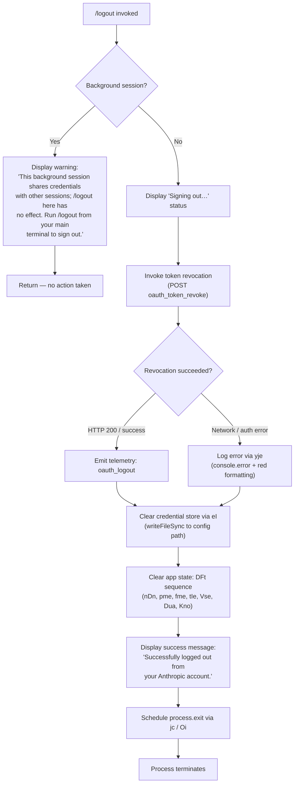

# `/logout`

> Analysis basis: CC v2.1.183 bundle.js (AST extraction + Claude interpretation)
> Minimum version: v2.1.183

---

## Overview

The `/logout` command signs the user out of their Anthropic account by revoking the OAuth token, removing stored credentials, clearing in-memory session state, and then terminating the current Claude Code process. It is a `local-jsx` command that renders a brief status UI before performing the logout sequence.

---

## Registration

| Field | Value |
|---|---|
| type | `local-jsx` |
| name | `logout` |
| description | `Sign out from your Anthropic account` |
| loc_byte | `11863056` |
| loc_byte_end | `11863340` |
| loc_line | `7630` |
| module_id | `Vno` |
| load_inline | `true` |
| arbor_handler.name | `Kup` |
| arbor_handler.fqn | `claude-2.1.183::Kup` |
| arbor_handler.kind | `AsyncFunction` |
| arbor_handler.resolution_path | `module_id` |
| arbor_handler.n_hits | `0` |

Analysis basis: CC v2.1.183 bundle.js:+11863056

---

## Input Branching

The command has 3+ distinct branches depending on session type and logout outcome.



---

## Behavioral Spec

### Main Handler — `logoutCommandHandler` (Kup)

The Arbor-resolved handler is `Kup` (AsyncFunction, reached via `module_id → Vno`).

Analysis basis: CC v2.1.183 bundle.js:+8134362

```
async function logoutCommandHandler(commandContext):
    sessionInfo = getSessionInfo()          // Hi → uNe (bundle.js:+8134362)
    configStore  = getConfigStore()         // K$e (bundle.js:+8134373)

    // Background-session guard
    if sessionInfo.type in ["bg", "daemon", "daemon-worker"]:
        render JSX warning element:
            "This background session shares credentials
             with other sessions; /logout here has no
             effect. Run /logout from your main terminal
             to sign out."
        return                              // bundle.js:+8134472

    // Kick off the logout sequence
    render JSX status: "Signing out…"      // bundle.js:+8134825
    await performLogout(commandContext)     // mat (bundle.js:+8134435)

    // Display success, then exit after a brief delay
    render JSX: "Successfully logged out from your Anthropic account."
                                           // bundle.js:+8134671
    setTimeout(() => exitProcess(), 200)   // bundle.js:+8134734; constant: 200 ms
```

Analysis basis: CC v2.1.183 bundle.js:+8134362

---

### Core Logout Sequence — `performLogout` (mat)

Analysis basis: CC v2.1.183 bundle.js:+8132873

```
async function performLogout(ctx):
    // 1. Resolve current credentials
    await Promise.resolve()                 // bundle.js:+8132873
    authData = readAuthStore()              // Wno (bundle.js:+8132903)

    // 2. Revoke the OAuth token remotely
    try:
        await revokeOAuthToken(authData)    // r → p1 (bundle.js:+8132924)
        recordTelemetry("oauth_logout")     // literal bundle.js:+8134142
    catch networkError:
        logRedError(networkError)           // yje (bundle.js:+13324744)

    // 3. Wipe credential file on disk
    clearCredentialFile()                   // Hi (bundle.js:+8132928)

    // 4. Clear all runtime state
    clearRuntimeState()                     // DFt (bundle.js:+8132940)

    // 5. Flush config to disk (removes auth from ~/.claude.json)
    await saveGlobalConfig()               // pn / ZPr (bundle.js:+8133254)

    // 6. Drain async I/O queues before exit
    flushIoQueues()                        // dc, s.readAsync, o.readAsync, etc.
                                           // bundle.js:+8132987
```

---

### Token Revocation — `revokeOAuthToken` (p1)

Analysis basis: CC v2.1.183 bundle.js:+2138510

```
async function revokeOAuthToken(authData):
    endpoint = resolveOAuthEndpoint()      // Ps → Oqo / uUc (bundle.js:+2138521)
    // Endpoint selection honours CLAUDE_CODE_CUSTOM_OAUTH_URL if set
    // and validates against an approved-endpoint allowlist.
    // Error if not approved: "CLAUDE_CODE_CUSTOM_OAUTH_URL is not an approved endpoint."
    //                         (bundle.js:+861165)

    response = await httpPost(endpoint, {
        grant_type : "refresh_token",      // bundle.js:+2138570
        token      : authData.refreshToken
    }, {
        headers    : { "Content-Type": "application/json" }, // bundle.js:+2138625/2138640
        timeout    : 5000                  // ms, bundle.js:+2138668
    })

    if isAxiosError(response):             // bundle.js:+2138715
        classifyError(response)            // T (bundle.js:+2138760)
        // Error classes: "auth" (HTTP 401/403), "timeout" (ECONNABORTED),
        //                "network" (ECONNREFUSED / ENOTFOUND), "other"
        // bundle.js:+183229 … +183508
        raise NetworkError

    return response                        // success path
```

---

### Credential File Wipe — `clearCredentialFile` (Hi → eI)

Analysis basis: CC v2.1.183 bundle.js:+2303034

```
function clearCredentialFile():
    credPath = joinPaths(configDir, credentialFileName)  // Xor.join (bundle.js:+199377)
    Nre.writeFileSync(credPath, emptyContent)            // bundle.js:+199359
    // Overwrites the on-disk credential file with empty/cleared content.
```

---

### Runtime State Teardown — `clearRuntimeState` (DFt)

Analysis basis: CC v2.1.183 bundle.js:+8134219

```
function clearRuntimeState():
    resetNetworkDefaults()    // nDn  (bundle.js:+8134219)
    clearPendingMessages()    // pme  (bundle.js:+8134225)
    clearFeatureFlags()       // fme → $ti.clear (bundle.js:+3043381)
    resetToolState()          // tIe  (bundle.js:+8134237)

    // Tear down event listeners and interval timers
    teardownEventSystem()     // Vse → aQe (bundle.js:+8134262)
        // aQe clears: pIe, RHn, Cxt, ONr, u8 (Set/Map caches)
        //              process.off for "exit" and "beforeExit" listeners
        //              GNr → clearInterval + process.removeListener
        // bundle.js:+3326094 … +3326889

    // Delete lock / socket files
    removeLockFiles()         // Dua → wst.unlink (bundle.js:+7232667)
        // also clears path-join artefacts via Qtn (bundle.js:+7232655)

    // Stop background workers / daemon sockets
    shutdownDaemonSocket()    // Kno → sko (bundle.js:+13948769)
        // sko: ako, Mme checks, clearTimeout (bundle.js:+13943402 … +13943455)
        // Kno: Pje.unlink, gIe path cleanup (bundle.js:+13948785)
```

---

### Error Logging — `logRedError` (yje)

Analysis basis: CC v2.1.183 bundle.js:+13324744

```
function logRedError(error):
    formatted = Ht.red(error.message)      // red ANSI formatting (bundle.js:+13324713)
    console.error(formatted)               // bundle.js:+13324699
    // Writes a "cli_error" category entry (literal bundle.js:+13324754)
    writeCliError("cli_error", formatted)  // eI (bundle.js:+13324751)
    process.exit(1)                        // bundle.js:+13324767
```

---

### Process Exit — `exitProcess` (jc → Oi)

Analysis basis: CC v2.1.183 bundle.js:+7194468

```
async function exitProcess():
    // Unmount the React/Ink UI
    unmountUI()                            // k3e → e.unmount (bundle.js:+7193741)
    // Write final newline to stdout
    nge.writeSync(stdout, "\n")            // bundle.js:+7196552

    // Wait for pending I/O with a 3 500 ms cap
    await Promise.race([
        drainIo(),                         // XWe → B2o.drain (bundle.js:+69581)
        sleep(3500)                        // constant: 3500 ms (bundle.js:+7196088)
    ])

    // Settle all active MCP / agent cleanup promises
    await Promise.allSettled(             // kca (bundle.js:+13551802)
        Array.from(activeSessions)
    )

    // Hard exit
    lJr():
        clearTimeout(exitTimer)           // bundle.js:+7194247
        process.exit(0)                   // bundle.js:+7194328
        // If exit stalls: process.kill(process.pid, "SIGKILL") (bundle.js:+7194353)
```

---

## State & Side Effects

| Item | Detail |
|---|---|
| Telemetry — `oauth_logout` | Emitted after a successful token-revocation HTTP call (literal bundle.js:+8134142) |
| Telemetry — `tengu_feature_ok` | Emitted on successful sub-feature paths (bundle.js:+1021887) |
| Telemetry — `tengu_feature_sad` | Emitted on expected-failure sub-feature paths (bundle.js:+1022035) |
| Telemetry — `tengu_feature_bad` | Emitted on unexpected-error sub-feature paths (bundle.js:+1021954) |
| Telemetry — `tengu_config_lock_contention` | Fired if config-write lock is contested during credential wipe (bundle.js:+13966745) |
| Telemetry — `tengu_config_stale_write` | Fired if config on disk is stale at write time (bundle.js:+13966881) |
| Telemetry — `tengu_config_auth_loss_prevented` | Fired if write would have erased auth data (guards GH#3117) (bundle.js:+13967224) |
| Telemetry — `tengu_config_fallback_write` | Fired when config write falls back to an in-place write (bundle.js:+13966361) |
| Telemetry — `tengu_config_parse_error` | Fired if config JSON cannot be parsed during save (bundle.js:+13969320) |
| Telemetry — `tengu_scroll_summary` | Fired during UI teardown (bundle.js:+7195497) |
| Telemetry — `tengu_cache_eviction_hint` | Fired during session-end cache eviction (bundle.js:+7196440) |
| Telemetry — `tengu_pewter_brook` | Fired during terminal-mode detection at exit (bundle.js:+3545436) |
| Credential file | Overwritten with empty content via `Nre.writeFileSync` (bundle.js:+199359) |
| `~/.claude.json` auth fields | Removed by `saveGlobalConfig` (pn/ZPr) with lock acquisition (bundle.js:+8133254) |
| Process event listeners | `exit` and `beforeExit` listeners removed by `aQe` (bundle.js:+3326152, +3326912) |
| Interval timers | All intervals cleared by `GNr → clearInterval` (bundle.js:+3326854) |
| In-memory caches | `pIe`, `RHn`, `Cxt`, `ONr`, `u8` Maps/Sets cleared (bundle.js:+3326220 … +3326268) |
| Lock / socket files | Unlinked by `Dua → wst.unlink` and `Kno → Pje.unlink` (bundle.js:+7232667, +13948785) |
| React/Ink UI | Unmounted via `k3e → e.unmount` (bundle.js:+7193741) |
| Process exit | `process.exit(0)` after ≤ 3 500 ms drain; `SIGKILL` self-kill if exit stalls (bundle.js:+7194328, +7194353) |
| Background-session guard | `/logout` is a no-op (returns early) when session type is `"bg"`, `"daemon"`, or `"daemon-worker"` (bundle.js:+8134472; literals +2302957 … +2302981) |

---

## Version History

| Version | Change |
|---|---|
| v2.1.183 | Initial analysis |

---

## Common Mistakes

1. **Running `/logout` in a background or daemon session** — the command detects session types `bg`, `daemon`, and `daemon-worker` and exits immediately with a warning. Only run `/logout` from the primary interactive terminal session.
2. **Expecting a silent exit** — the command displays "Signing out…" and then "Successfully logged out…" before terminating the process; redirection of stdout will suppress these messages.
3. **Assuming credentials are wiped immediately** — token revocation is attempted first over the network (5 000 ms timeout). If the network call fails the logout still proceeds locally (credential file is overwritten), but the remote token may remain valid until it expires.
4. **Re-using the same process after `/logout`** — the command calls `process.exit(0)` after ≤ 3 500 ms; any code that tries to continue using the Claude Code process after `/logout` will be terminated.
5. **Using a custom OAuth URL** — `CLAUDE_CODE_CUSTOM_OAUTH_URL` must point to an allowlisted endpoint; setting it to an unapproved value throws `"CLAUDE_CODE_CUSTOM_OAUTH_URL is not an approved endpoint."` (bundle.js:+861165) and blocks revocation.

---

## Appendix — Identifier Mapping

> For bundle debugging only. Identifiers change across versions.

| Identifier | Role |
|---|---|
| `Kup` | Main logout command handler (AsyncFunction; arbor_handler) |
| `mat` | Core logout execution sequence (`performLogout`) |
| `zup` | JSX render wrapper for logout UI |
| `r` | Token-revocation dispatch helper |
| `Fs` | Error-logging and process-exit helper (calls `yje`, `eI`, `process.exit`) |
| `yje` | Red-formatted `console.error` logger |
| `eI` | Credential-file writer (`Nre.writeFileSync`) |
| `Hi` | Session-info / credential-clear helper |
| `uNe` | Session-info accessor |
| `DFt` | Runtime state teardown orchestrator |
| `nDn` | Network-defaults reset |
| `pme` | Pending-message queue clear |
| `fme` | Feature-flag cache clear (`$ti.clear`) |
| `tIe` | Tool-state reset |
| `Vse` | Event-system teardown coordinator |
| `I4` | Sub-step in event teardown |
| `T4` | Sub-step in event teardown |
| `aQe` | Process event-listener and timer cleanup |
| `GNr` | `clearInterval` + `process.removeListener` helper |
| `De` | Error-dispatch / routing helper |
| `Ho` | Error constructor wrapper |
| `st` | String-conversion utility |
| `ra` | Essential-traffic queue accessor |
| `Bzc` | Queue shift/push helper (`Ven`) |
| `Dua` | Lock-file / socket-file cleanup |
| `Pua` | Sub-step in lock cleanup |
| `vNt` | Path accessor for lock files |
| `xts` | Lock path constant accessor |
| `Ppe` | Path primitive helper |
| `Qtn` | Path-join utility |
| `Kno` | Daemon-socket shutdown |
| `sko` | Socket teardown (calls `ako`, `Mme`, `clearTimeout`) |
| `ako` | Socket accessor |
| `Mme` | Daemon membership check |
| `gIe` | Daemon path-cleanup helper |
| `wr` | Auth-provider type checker (bedrock / foundry / vertex etc.) |
| `dc` | I/O queue flush orchestrator |
| `D3s` | Credential-store read/write/update/delete abstraction |
| `hNe` | Async credential-store read |
| `QRu` | Credential store with async-local-storage context |
| `ke` | Telemetry OK emitter (`tengu_feature_ok`) |
| `Pt` | Telemetry sad emitter (`tengu_feature_sad`) |
| `Re` | Telemetry bad emitter (`tengu_feature_bad`) |
| `Ue` | Telemetry dispatch helper (`ogt`) |
| `p1` | OAuth token revocation HTTP call |
| `Ps` | OAuth endpoint resolver |
| `Oqo` | OAuth base-URL selector |
| `uUc` | OAuth URL validator |
| `T` | HTTP error classifier |
| `QHc` | HTTP response parser |
| `j2o` | HTTP header helper |
| `Pe` | JSON-stringify wrapper |
| `Kc` | Path/URL sanitiser for logs (`[REDACTED]` insertion) |
| `g9o` | Header-map builder |
| `Hqe` | Output-write helper |
| `s9o` | Stdout write helper |
| `n_c` | Log-file writer (append-file with rotation) |
| `YWe` | Log-line batching / flush scheduler |
| `rpe` | Log directory path builder |
| `Pre` | EISDIR guard for log writes |
| `y9o` | Log file path builder |
| `csr` | Log-file rotation helper (`.txt` → rename/unlink) |
| `t_c` | Append-file writer with mkdir |
| `qi` | `B2o.register` hook helper |
| `_J` | Misc cleanup helper |
| `ZPr` | Config-save with file lock |
| `eni` | Config-read helper (normalised path + sha256 hash) |
| `BRs` | Config-file path resolver (NFC normalise, sha256, hex) |
| `f1` | Path normalisation + hash helper |
| `Cv` | Config schema validator |
| `RR` | Username resolver (`hcn.userInfo`) |
| `Ee` | String coercion helper |
| `pn` | Global config save (with auth-loss guard, GH#3117) |
| `W7n` | Config write with lock acquisition and backup |
| `C3s` | Async-local-storage writer object factory |
| `q_e` | Config file reader and backup copier |
| `AAt` | Config file accessor helper |
| `Sko` | Backup directory path builder |
| `MSt` | Atomic file-write helper (temp + rename + fsync) |
| `LMe` | Config-load helper |
| `_ko` | Config `Object.entries` iterator |
| `oWt` | Config write timestamp helper |
| `j7n` | Incremental config-save helper |
| `Edn` | Config-format helper |
| `o` | Async read helper (padEnd formatting) |
| `rPe` | Miscellaneous reset helper |
| `K$e` | Config-store accessor |
| `PS` | String-conversion helper |
| `Ru` | Config-event emitter (emits `a.emit`) |
| `V$e` | App config builder (user / identity / OTEL attributes) |
| `o8` | Random-bytes session-ID generator |
| `Lt` | Terminal capability helper |
| `Zbn` | OTEL attribute builder (identity.source, user.id, etc.) |
| `mDt` | String formatter |
| `L2` | Allowlist membership check (`zqc.has`) |
| `Mc` | Colour / terminal helper (`hy`, `Ct`) |
| `ghd` | JWT / base64url decoder |
| `Wki` | Attribute-filter helper |
| `fHt` | Config-event sequence builder |
| `cnr` | Config-change notifier |
| `a` | MCP server manager (emit, get, values, B1o) |
| `n3e` | MCP server connection orchestrator |
| `uZn` | MCP connection-result applicator |
| `mta` | MCP stats helper |
| `l` | Worker-pool helper (`k0l`) |
| `B1o` | MCP bulk-update helper |
| `unr` | Config-update notifier |
| `jc` | UI teardown + process-exit sequencer |
| `Oi` | Full exit sequence (unmount, drain, kill) |
| `k3e` | Ink UI unmount and final write |
| `fF` | UI finalisation helper |
| `MEn` | Terminal-restore helper (ANSI escape `\x1b7` / `\x1b8`) |
| `aJr` | Exit summary renderer |
| `zw` | Scroll-position store |
| `E9` | Line-count helper |
| `yNt` | Stats-file path resolver |
| `mh` | Session-stats helper |
| `yca` | Summary formatter |
| `lJr` | Hard-exit helper (`process.exit` / `SIGKILL`) |
| `XWe` | I/O drain (`B2o.drain`) |
| `d` | MCP server lifecycle manager (stop/start/updateConfig) |
| `Aje` | File-stat and content-hash checker |
| `qDl` | MCP configuration differ |
| `y` | Server-status tracker (`l1t`, `xht`) |
| `Puc` | Heartbeat supervisor |
| `kca` | `Promise.allSettled` shutdown helper |
| `C_t` | Startup-profiling report writer |
| `bsr` | Profiling-event builder |
| `O9o` | Profiling-report serialiser |
| `dDn` | Scroll-summary telemetry recorder |
| `_ca` | Scroll-offset accessor |
| `Hca` | Scroll-metrics calculator |
| `Os` | Terminal-mode detector (fullscreen / tmux-CC / ConPTY) |
| `Dgt` | Cache-eviction hint emitter |
| `Qe` | Telemetry dispatch (`ogt`) |
| `ogt` | Low-level telemetry emit function |
| `Ur` | Non-conforming telemetry wrapper |
| `ey` | Telemetry helper |
| `M3e` | Deferred-resolve helper |
| `cDn` | Cleanup deferred helper |

---

Note: index built via Arbor fallback; some signals (telemetry, literals) may be missing — see arbor-fallback.js.