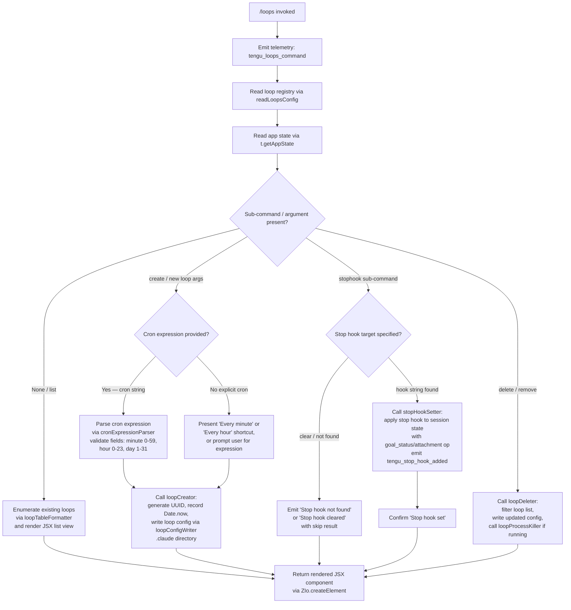

# `/loops`

> Analysis basis: CC v2.1.183 bundle.js (AST extraction + Claude interpretation)
> Minimum version: v2.1.183

---

## Overview

The `/loops` command provides an interactive management interface for Claude Code's background loop (scheduled agent) system. It allows users to list active loops, create new scheduled loops with cron-like expressions, delete existing loops, and optionally configure stop hooks. The command renders a JSX-based UI component and operates asynchronously against the daemon's loop registry and app state.

---

## Registration

| Field | Value |
|---|---|
| type | `local-jsx` |
| name | `loops` |
| description | `List, create, and delete loops` |
| loc_byte | `12763338` |
| loc_byte_end | `12763495` |
| loc_line | `8420` |
| immediate | `true` |
| module_id | `aCl` |
| load_inline | `true` |
| arbor_handler.name | `eaf` |
| arbor_handler.fqn | `claude-2.1.183::eaf` |
| arbor_handler.kind | `AsyncFunction` |
| arbor_handler.resolution_path | `module_id` |
| arbor_handler.n_hits | `0` |

Analysis basis: CC v2.1.183 bundle.js:+12763338

---

## Input Branching

The handler has five or more distinct operational branches (list, create with cron, create with stop-hook, delete, and goal/status display), warranting a Mermaid flowchart.



---

## Behavioral Spec

### Top-Level Handler (`eaf`)

The command entry point is the `AsyncFunction` resolved as `eaf` via `module_id` path from module `aCl`.

```
async function loopsCommandHandler(context):
    emit telemetry("tengu_loops_command")          // bundle.js:+12762295
    config = await readLoopsConfig(context)        // calls loopConfigReader (mae→Dtt)
    loopTable = buildLoopTable(config)             // calls loopTableFormatter (Xdt→g0e,IFa)
    appState = context.getAppState()               // bundle.js:+12762345
    activeLoops = fetchActiveLoops(appState)       // calls activeLoopFetcher (Lt)
    mappedLoops = activeLoops.map(...)             // bundle.js:+12762373

    args = parseArguments(context.input)           // calls argumentParser (AP)
    loopType = detectLoopType(args)                // checks literal "cron" bundle.js:+12762391

    if loopType == "cron":
        result = await createLoop(args, config)    // calls loopCreator (Mtt)
    else if subCommand == "stophook":
        result = await setOrClearStopHook(args)    // calls stopHookHandler (Jdt/Qdt)
    else if subCommand == "delete":
        result = await deleteLoop(args, config)    // calls loopDeleter (fae)
    else:
        result = buildListView(loopTable, mappedLoops)

    return ZIo.createElement(ResultComponent, result)  // bundle.js:+12763098
```

Analysis basis: CC v2.1.183 bundle.js:+12762293

---

### Loop Configuration Reader (`mae` → `Dtt`)

Reads the persisted loop configuration from disk, decoding files with UTF-8 encoding (literal `"utf-8"` at bundle.js:+4905553).

```
async function readLoopsConfig(context):
    basePath = computeBasePath()               // WAe → JIn.join, Ec
    rawData = await fs.readFile(basePath, "utf-8")
    if error.code in ["ENOENT","EACCES","EPERM","ENOTDIR","ELOOP","ENAMETOOLONG","EROFS"]:
        return defaultConfig()                 // ds → dn handles error codes
    parsed = parseLoopConfig(rawData)          // De → Ho, st, ra, Bzc
    // De maintains a rotating ring buffer via Bzc (Ven.shift / Ven.push)
    // Errors are pushed via hKe.push and logged via QJ.logError
    // Falls back to empty config on parse failure
    return parsed
```

Analysis basis: CC v2.1.183 bundle.js:+4907514

---

### Loop Table Formatter (`Xdt` → `g0e`, `IFa`)

Builds the display table for the list view, padding column entries (literal `"  "` at bundle.js:+17300766) and mapping over loop entries.

```
function buildLoopTable(loops):
    table = new Map()
    for each loop in loops:
        label = padLabel(loop.name)     // o.set, i.padEnd  bundle.js:+9146943
        row = formatRow(loop)           // IFa → e.map      bundle.js:+9146712
        table.set(label, row)
    return table
```

Analysis basis: CC v2.1.183 bundle.js:+10715836

---

### Argument Parser (`AP`)

Parses the raw user input string to extract sub-command, cron expression, loop index, and schedule description.

```
function parseArguments(rawInput):
    trimmed = rawInput.trim()                       // bundle.js:+4903297
    cronMatch = trimmed.match(cronPattern)          // bundle.js:+4903438
    if cronMatch:
        index = parseInt(cronMatch[1])              // bundle.js:+4903473
        scheduleString = cronMatch.toString()       // bundle.js:+4903671

    // Human-readable shortcuts
    if scheduleString matches "Every minute":       // literal bundle.js:+4903417
        // normalize to "* * * * *"
    if scheduleString matches "Every hour":        // literal bundle.js:+4903634
        // normalize to "0 * * * *"

    // Day-of-week arithmetic using UTC date methods
    dayOfWeek = computeDay(new Date())             // A.getUTCDay, A.setUTCDate, A.getUTCDate
                                                   // A.setUTCHours, A.getDay  bundle.js:+4904174

    // Range "1-5" weekday shorthand detected       // literal "1-5" bundle.js:+4904341
    return { subCommand, cronExpr, index, dayOfWeek }
```

Analysis basis: CC v2.1.183 bundle.js:+4903297

---

### Cron Expression Parser / Validator (`Zif`)

Validates and normalises a cron expression string. Uses several numeric boundary constants.

```
function parseCronExpression(expr):
    parts = expr.match(pattern)
    minute = parseInt(parts.minute)               // bundle.js:+12761918
    minute = Math.max(0, minute)                  // bundle.js:+12762003
    minute = Math.ceil(minute)                    // bundle.js:+12762014
    // Minute boundary: 0–59 (literal 59 at bundle.js:+12762060)
    // Hour boundary:   0–23 (literal 23 at bundle.js:+12762131)
    // Day boundary:    0–31 (literal 31 at bundle.js:+12762184)
    // Full-hour boundary: 60 (literal 60 at bundle.js:+12762026)
    rounded = Math.round(computed)                // bundle.js:+12762087
    schedule = buildScheduleLines(parts)          // J1 → Bbd: split/match/parseInt/o.add/Array.from
    return schedule
```

Analysis basis: CC v2.1.183 bundle.js:+12761881

---

### Loop Creator (`Mtt`)

Creates a new loop entry, writing configuration to the `.claude` directory (literal `".claude"` at bundle.js:+4906694).

```
async function createLoop(args, existingConfig):
    id = crypto.randomUUID()                        // K1i.randomUUID  bundle.js:+4906853
    createdAt = Date.now()                          // bundle.js:+4906915
    entry = buildLoopEntry(id, createdAt, args)     // sPe
    updatedConfig = existingConfig.concat([entry])  // a.push  bundle.js:+4907018
    await loopConfigWriter(updatedConfig)           // CMt → Ec, XIn.mkdir, JIn.join, XIn.writeFile
    // CMt also calls WAe and Pe for path/serialisation
    logResult = activeLoopFetcher(updatedConfig)    // Lt
    return { id, createdAt, logResult }
```

Analysis basis: CC v2.1.183 bundle.js:+4906853

---

### Loop Config Writer (`CMt`)

Serialises and persists loop configuration. Creates the `.claude` directory if absent, then writes the file.

```
async function loopConfigWriter(config):
    dir = Ec(basePath)                // path helpers  bundle.js:+4906662
    await fs.mkdir(dir, { recursive: true })       // XIn.mkdir  bundle.js:+4906673
    filePath = path.join(dir, fileName)            // JIn.join   bundle.js:+4906683
    serialised = config.map(serializeEntry)        // bundle.js:+4906734
    await fs.writeFile(filePath, serialised)       // XIn.writeFile  bundle.js:+4906770
    verifiedPath = WAe(filePath)                   // bundle.js:+4906784
    result = Pe(serialised)                        // bundle.js:+4906791
    return result
```

Analysis basis: CC v2.1.183 bundle.js:+4906662

---

### Loop Deleter (`fae`)

Removes a loop entry from configuration and optionally kills any running background process for that loop.

```
async function deleteLoop(args, config):
    currentLoops = await readLoopsConfig()          // Dtt  bundle.js:+4907233
    filtered = currentLoops.filter(                 // r.filter  bundle.js:+4907242
        loop => not n.has(loop.id)                  // n.has  bundle.js:+4907257
    )
    await loopConfigWriter(filtered)               // CMt  bundle.js:+4907306
    relatedProcess = lookupProcess(args.id)        // Dre  bundle.js:+4907183
    if relatedProcess:
        await killLoopProcess(relatedProcess)
    return { removed: true }
```

Analysis basis: CC v2.1.183 bundle.js:+4907183

---

### Stop Hook Setter (`Jdt` / `Qdt`)

Sets or clears a stop hook on the current loop session. Emits `tengu_stop_hook_added` on success.

```
async function stopHookHandler(context, args):
    // Check hooks_gate and trust_gate feature flags  // literals bundle.js:+10716033, +10716087
    hookBody = parseStopHookBody(args)               // tho → hB, eie

    if hookBody is null:
        return { text: "Stop hook not found", action: "skip" }
                                                     // literals bundle.js:+12762737, +12763204

    // Apply to session via message operation
    timestamp = Date.now()                           // bundle.js:+10716386
    sessionState = context.getAppState()             // bundle.js:+10716222
    updated = applyGoalOp(sessionState, {            // t.applyMessageOp  bundle.js:+10716466
        op: "append",                                // literal bundle.js:+10716861
        kind: "goal",                                // literal bundle.js:+10716929
        goal_status: "active",                       // literal bundle.js:+10717058 / +4293835
        attachment: hookBody                         // literal bundle.js:+10716971
    })
    context.setAppState(updated)                     // bundle.js:+10716424
    newUUID = generateUUID()                         // wQa → IQa.randomUUID  bundle.js:+10716989
    emit telemetry("tengu_stop_hook_added")          // bundle.js:+10716523

    return { text: "Stop hook set" }                 // literal bundle.js:+12763055
```

Analysis basis: CC v2.1.183 bundle.js:+10716137

---

### Background Loop Process Manager (`f` / process-kill path)

When a loop is killed or a background session is stopped, the process manager signals the subprocess and emits lifecycle telemetry. The literal `"SIGKILL"` appears at bundle.js:+17275071 and `"SIGTERM"` at bundle.js:+17251793.

```
async function killLoopProcess(process):
    if process.state == "closed":                    // literal bundle.js:+17274885
        return
    // Attempt SIGTERM first; escalate to SIGKILL after timeout
    // 30-second and 15-second intervals: literals bundle.js:+17274978, +17274989
    process.kill("SIGTERM")
    await waitForClose(30_000)
    if still alive:
        process.kill("SIGKILL")
        emit telemetry("tengu_bg_dispatch_sigkill_escalate")  // bundle.js:+17275023
    emit telemetry("tengu_daemon_control")                    // bundle.js:+17311864
```

Analysis basis: CC v2.1.183 bundle.js:+17274885

---

### Schedule Description Formatter (`Jnc`)

Formats a human-readable summary of schedule changes for display. Uses pluralisation literals (`"s were"` / `" was"`, `"They have"` / `"It has"`, `"these prompts"` / `"this prompt"`, `"each one"` / `"it"`).

```
function formatScheduleDescription(changedItems):
    count = changedItems.length                         // bundle.js:+16745867
    plural = count != 1
    verb   = plural ? "s were" : " was"                // literals bundle.js:+16745423, +16745432
    subj   = plural ? "They have" : "It has"           // literals bundle.js:+16745481, +16745493
    noun   = plural ? "these prompts" : "this prompt"  // literals bundle.js:+16745579, +16745595
    each   = plural ? "each one" : "it"                // literals bundle.js:+16745676, +16745687
    lines  = changedItems.map(formatItem)              // bundle.js:+16745736
    return lines.join(", ")                             // r.join bundle.js:+16745973
```

Analysis basis: CC v2.1.183 bundle.js:+16745736

---

## State & Side Effects

| Item | Detail |
|---|---|
| Telemetry — primary | `tengu_loops_command` (bundle.js:+12762295) — fired on every `/loops` invocation |
| Telemetry — stop hook added | `tengu_stop_hook_added` (bundle.js:+10716523) |
| Telemetry — stop hook removed | `tengu_stop_hook_removed` (bundle.js:+10716895) |
| Telemetry — scheduled task missed | `tengu_scheduled_task_missed` (bundle.js:+16742321) |
| Telemetry — daemon control | `tengu_daemon_control` (bundle.js:+17311864) |
| Telemetry — daemon config reload | `tengu_daemon_config_reload` (bundle.js:+17290894) |
| Telemetry — SIGKILL escalation | `tengu_bg_dispatch_sigkill_escalate` (bundle.js:+17275023) |
| Telemetry — low-memory dispatch | `tengu_bg_dispatch_low_mem` (bundle.js:+17275624) |
| Telemetry — low-memory threshold | `tengu_bg_low_mem_mb` (bundle.js:+13292202) |
| Telemetry — background session create | `tengu_bg_dispatch_sigkill_escalate` / `tengu_bg_spare_enable` (bundle.js:+17276321) |
| Telemetry — spare claim | `tengu_bg_spare_claim` (bundle.js:+17276449) / `tengu_bg_spare_claim_fail` (bundle.js:+17276715) |
| Telemetry — send-claim failed | `tengu_bg_sendclaim_failed` (bundle.js:+17251555) |
| Telemetry — bg state read transient | `tengu_bg_state_read_transient` (bundle.js:+4286669) |
| Telemetry — feature gate | `tengu_feature_ok` (bundle.js:+1021887) / `tengu_feature_bad` (bundle.js:+1021954) / `tengu_feature_sad` (bundle.js:+1022035) |
| Telemetry — MCP skills | `tengu_mcp_skills` (bundle.js:+6624971) |
| File I/O | Reads and writes loop config under `.claude` directory (bundle.js:+4906694). Creates directories recursively. |
| appState changes | `t.getAppState` / `t.setAppState` / `t.applyMessageOp` called when a stop hook is set or cleared (bundle.js:+10716222, +10716424, +10716466) |
| Hook registration | Stop hooks are attached to the session via `applyMessageOp` with `op:"append"`, `kind:"goal"` (bundle.js:+10716861, +10716929) |
| Process signals | SIGTERM → SIGKILL escalation for running loop processes; 30 s and 15 s timeouts (bundle.js:+17274978, +17274989) |
| UUID generation | Two UUID sources: `K1i.randomUUID` for loop ID (bundle.js:+4906853) and `IQa.randomUUID` for stop-hook message (bundle.js:+10716989) |
| Sound | <!-- TODO: not found in depth-2 traversal; needs --depth 4 --> |

---

## Version History

| Version | Change |
|---|---|
| v2.1.183 | Initial analysis |

---

## Common Mistakes

1. **Omitting the cron expression**: Invoking `/loops` without a valid cron string when trying to create a loop will fall through to the list view rather than creating a new entry. Provide a quoted cron expression (e.g., `*/5 * * * *`) or a shortcut like `Every minute`.
2. **Expecting synchronous confirmation**: Because the handler is `async` and writes to disk, the confirmation message (e.g., `"Stop hook set"`) may appear with a brief delay. Do not repeat the command if the UI is briefly blank.
3. **Confusing stop hooks with loops**: Stop hooks (registered via the `stophook` sub-command) are session-level hooks applied via `applyMessageOp`, not persistent loop entries in the `.claude` directory. Deleting a loop does not automatically clear a stop hook.
4. **Manual directory creation**: The command creates the `.claude` directory automatically (via `mkdir --recursive`). Do not pre-create the directory with different permissions, as this may cause `EACCES` or `EPERM` errors that fall back to a default empty config.
5. **Day-of-week range `1-5`**: The parser handles the `1-5` shorthand for weekdays (Monday–Friday) natively. Writing out individual days will not be parsed correctly — use the compact range literal.

---

## Appendix — Identifier Mapping

> For bundle debugging only. Identifiers change across versions.

| Identifier | Role |
|---|---|
| `eaf` | Top-level async handler for `/loops` command (Arbor-resolved, `module_id` path) |
| `j` | Utility / logger helper called at command entry |
| `mae` | Loop config bootstrap / initialiser |
| `Dtt` | Loop configuration file reader (reads UTF-8 loop config from disk) |
| `jt` | Path / filesystem join helper used by config reader |
| `WAe` | Base-path resolver (joins directory segments via `JIn.join`) |
| `Ec` | Directory path extractor |
| `ds` | Filesystem error code handler |
| `dn` | Error code classifier / normaliser |
| `De` | Loop config parser (full parsing pipeline with error queue) |
| `Ho` | Error constructor wrapper |
| `st` | String coercion utility |
| `ra` | Config entry builder (calls `eJo`) |
| `Bzc` | Ring-buffer manager for parsed config entries (`Ven.shift` / `Ven.push`) |
| `T` | Multi-purpose transformer / token processor |
| `QHc` | Token classifier (calls `FO`, `ssr`, `j2o`) |
| `Pe` | JSON serialiser wrapper (`JSON.stringify`) |
| `Kc` | String replacement / path tail utility |
| `Hqe` | Helper calling `s9o` |
| `n_c` | File-context builder (reads buffer byte length, binds callbacks) |
| `J1` | Input line parser (trim + parse via `Bbd`) |
| `Bbd` | Schedule line tokeniser (split, match, parseInt, Set operations) |
| `j0` | Secondary logger / output helper (calls `gx`) |
| `gx` | Core logger sink |
| `Xdt` | Loop table builder (calls `g0e`, `IFa`; pushes rows) |
| `g0e` | Table cell setter (`o.set`, calls `IFa`) |
| `IFa` | Row mapper (`e.map`) |
| `Lt` | Active-loop fetcher / renderer (calls `gx`) |
| `AP` | Argument parser (cron match, parseInt, day arithmetic) |
| `f` | Background process runner / daemon spawner |
| `M` | Loop process kill coordinator |
| `d` | Daemon subprocess controller (write, stop, updateConfig, start) |
| `CQ` | Config validator (calls `vfe`) |
| `CMt` | Loop config writer (mkdir + writeFile to `.claude`) |
| `J1i` | Loop list filter helper (calls `ktt`) |
| `g` | Stream buffer reader / IPC frame reader |
| `u` | Daemon stop helper (ke, Re, rF, SG) |
| `k` | Daemon loop runner (T, De, write, j6f) |
| `h` | Session timeout handler |
| `Jnc` | Schedule-change description formatter |
| `fae` | Loop deleter (filters config, kills process, writes updated config) |
| `Bn` | Process abort / timeout manager |
| `c` | Cleanup callback holder (calls `Tn`) |
| `Re` | Feature gate checker (OK path, calls `Ue`) |
| `Ue` | Gate event emitter (calls `ogt`) |
| `ke` | Feature gate checker (good path, calls `Ue`) |
| `YKn` | Memory check dispatcher (calls `zt`, `ct`) |
| `ct` | Memory usage evaluator (wxt, Lxt, I4, OHn) |
| `B$e` | Loop file stat / delete / read handler (`fT.lstat`, `fT.rm`, `fT.readFile`) |
| `nDt` | Pins path builder (`fb.join`, `wk`) |
| `Gt` | JSON parser wrapper (`JSON.parse`) |
| `Mn` | Normaliser / decoder (calls `dn`) |
| `zAd` | Loop directory reader (`fT.readdir`, recursive lstat, push) |
| `$` | Permission resolver (allow/deny/classify; calls `zlt`, `R6`) |
| `zlt` | Warn-mode handler (calls `rio`, `R2t`, `T`) |
| `R6` | Rule evaluator (Eu, Bot, yb, st, cdt, wfo, Lfo, wza, hP) |
| `NNo` | Daemon socket connection manager (claim, spawn, auth, connect) |
| `Nko` | Daemon initialiser (mkdir, writeFile, JSON.stringify) |
| `f6f` | Send-claim timeout handler (Date.now, Error, `m6f`, `dn`, `Bn`) |
| `p6f` | Claim-frame builder (`zq.buildClaimFrame`) |
| `wp` | Warning logger (calls `dn`) |
| `Ee` | String error formatter |
| `FM` | IPC frame encoder (Buffer.from, allocUnsafe, writeUInt32BE, writeUInt8, copy) |
| `jNo` | Background session lifecycle manager (rm, De, fa, pg, OCe, Pp, rft, etc.) |
| `Ic` | Session path builder (`fb.join`, `wk`) |
| `fa` | Session file watcher / state reader (lstat, readFile, JSON parse, Map operations) |
| `pg` | Active-session detector (calls `Wx`) |
| `OCe` | Session capability extractor (startsWith, indexOf, slice, Set lookups) |
| `Pp` | Session entry builder (vh, fb.join, Pe, mT) |
| `rft` | Session result tracker (Mcl.then, Iq, Date.now, TKp) |
| `P6t` | Session path resolver (qh.join, M6t) |
| `e_e` | Session error path resolver (qh.join, xGe) |
| `iD` | Late-error handler (calls `Lcl`) |
| `BN` | Session state writer (zt, Uyo, qh.join, nft) |
| `WM` | Late-write handler (calls `Lcl`) |
| `R6t` | Session roster path resolver (qh.join, M6t) |
| `p` | Forced shutdown handler (WT, process.exit, u.abort) |
| `WT` | Shutdown signaller |
| `m` | Multi-process kill helper (n.values, k.kill) |
| `l` | Loop-runner instance (calls `k0l`) |
| `k0l` | Loop runner (CQ, Date.now, ci, Mjt, Pe) |
| `ci` | Async-store accessor (`L0u.getStore`) |
| `Mjt` | Status file path builder (`x0l.join`, `tr`) |
| `A` | Date calculation context object |
| `Qdt` | Stop-hook setter (get/setAppState, applyMessageOp, wQa, Qe) |
| `wQa` | UUID generator for stop-hook messages (`IQa.randomUUID`) |
| `Qe` | Stop-hook render helper (calls `ogt`) |
| `ogt` | Output formatter sink |
| `Zif` | Cron expression parser / validator (match, parseInt, Math.max/ceil/round, J1) |
| `Mtt` | Loop creator (randomUUID, Date.now, sPe, Dtt, a.push, Lt, CQ, CMt) |
| `sPe` | Loop entry factory |
| `a` | MCP server / background agent host (n3e, uZn, mta, B1o) |
| `n3e` | MCP connection initialiser (dW, Nk, pra, Ohn, Mhn, on, oxn, Sra, OKr, Uk, etc.) |
| `dW` | MCP transport descriptor builder |
| `Nk` | Permission policy loader (P_, EKr) |
| `Wn` | MCP result wrapper |
| `pra` | MCP server start helper (w7r, Vwe, Phn, Date.now) |
| `Ohn` | MCP cleanup helper (Phn, EI) |
| `Mhn` | MCP disconnect helper (dc) |
| `on` | MCP debug logger (hKe.push, QJ.logMCPDebug) |
| `oxn` | MCP output sink (Lr, CBd, vBd) |
| `Sra` | MCP async start handler (a0n.then, w7r, ci, d0n, Pe) |
| `OKr` | MCP error handler (EI, dc, on, Ee) |
| `Uk` | MCP skills emitter (calls `ct`) |
| `yKr` | MCP include-filter helper (pn, n.includes) |
| `w` | Blur/focus timer (kz, Date.now, Math.min, L, v, Dec) |
| `Cu` | MCP error logger (hKe.push, QJ.logMCPError) |
| `gra` | MCP graceful-stop helper (U8) |
| `Hot` | Integer extractor for MCP (parseInt) |
| `p0n` | Secondary integer extractor (parseInt) |
| `uZn` | MCP connection result applier (applyMcpUpdate, t3e, on, n.cleanup, fw, fE) |
| `t3e` | MCP connection state mapper (Vwe) |
| `fw` | MCP connection cleanup runner (hot, o.cleanup, Uk) |
| `mta` | MCP server metadata fetcher (Szr) |
| `Szr` | Server metadata resolver |
| `B1o` | MCP client-list refresh coordinator (Object.entries, filter, getClients, jLn, n3e, uZn, etc.) |
| `jLn` | MCP client filter checker (X2d.has, LKr.has) |
| `hot` | MCP health-check runner (Vwe) |
| `Jdt` | Stop-hook resolver / display handler (tho, Pt, Lt, Xdt, getAppState, setAppState, applyMessageOp, wQa, ke) |
| `tho` | Stop-hook body parser (hB, eie, Lr, kp) |
| `hB` | Policy-settings reader (calls `xn`) |
| `xn` | Settings store accessor (Mnn, B2) |
| `eie` | Stop-hook text extractor (xn, ts) |
| `Lr` | Output text renderer |
| `kp` | Hooks gate checker (calls `hbf`) |
| `hbf` | Gate evaluation function (st, qWe, Hi, Ct, zue, uK, Mt, vS.resolve) |
| `Pt` | Feature gate checker (sad path, calls `Ue`) |
| `ry` | Token-count accessor (RWe, Object.values) |

---

Note: index built via Arbor fallback; some signals (telemetry, literals) may be missing — see arbor-fallback.js.