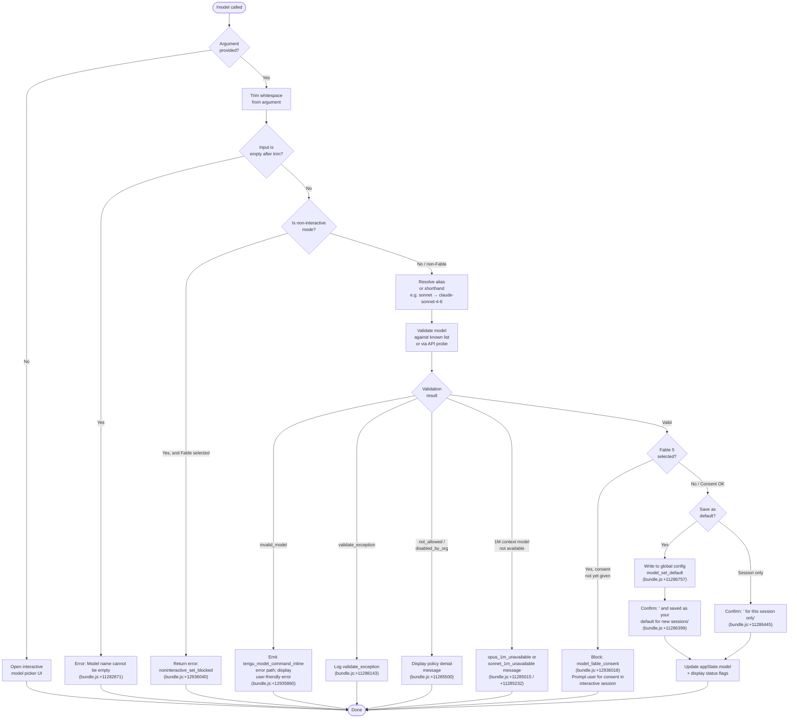

# `/model`

> Analysis basis: CC v2.1.183 bundle.js (AST extraction + Claude interpretation)
> Minimum version: v2.1.183

---

## Overview

The `/model` command lets users inspect and change the active AI model used by Claude Code for the current session or persistently. When invoked without an argument it displays a model picker; when invoked with a model name (or shorthand alias) it validates the selection, enforces policy constraints, handles Fable 5 consent, and writes the chosen model to app state — optionally saving it as the global default.

---

## Registration

| Field | Value |
|---|---|
| type | `local` |
| name | `model` |
| description | `Set the AI model for Claude Code` |
| argumentHint | `<model>` |
| supportsNonInteractive | `true` |
| module_id | `VLl` |
| load_inline | `true` |
| loc_byte | `12972295` |
| loc_byte_end | `12972469` |
| loc_line | `8557` |
| arbor_handler.name | `Xcf` |
| arbor_handler.fqn | `claude-2.1.183::Xcf` |
| arbor_handler.kind | `AsyncFunction` |
| arbor_handler.resolution_path | `module_id` |
| arbor_handler.n_hits | `0` |

Analysis basis: CC v2.1.183 bundle.js:+12972295

---

## Input Branching

The handler has 5+ distinct branches (empty input → picker, shorthand alias → resolve, inline non-interactive → block/abort, Fable consent required → block, full model string → validate+apply), so a Mermaid flowchart is used.



---

## Behavioral Spec

### 1. Handler Entry — `modelCommandHandler` (Xcf)

```
async function modelCommandHandler(argument, context):
    rawInput = argument.trim()                     // bundle.js:+12935710
    
    if rawInput is in knownAliasSet (uoe):         // bundle.js:+12935726
        // e.g. "sonnet", "opus", "haiku", "best", "fable", "opusplan"
        resolvedModel = resolveAlias(rawInput)
    
    appState = context.getAppState()               // bundle.js:+12935749
    
    availableModels = getAvailableModelList(appState)  // calls mjn → bundle.js:+12935793
    
    if resolvedModel is in G9 (extended-context list):  // bundle.js:+12935813
        // handle 1M context availability check
    
    emit telemetry: tengu_model_command_inline     // bundle.js:+12935860
    
    if isFableModel(resolvedModel):
        if not interactive:
            return blockWithMessage(                // bundle.js:+12936040
                "noninteractive_set_blocked",
                "Fable 5 uses usage credits…"      // bundle.js:+12936089
            )
        checkFableConsent()                        // bundle.js:+12936018
    
    result = validateAndApplyModel(               // calls n6t → bundle.js:+12935941
        resolvedModel, appState
    )
    
    formatAndDisplayResult(result)                // calls mX/fjn → bundle.js:+12935996 / +12936240
```

Analysis basis: CC v2.1.183 bundle.js:+12935710

---

### 2. Alias Resolution — `resolveAliasOrShorthand` (derived from `_s`)

The alias resolver maps human-friendly short names to canonical full model IDs. Analysis basis: CC v2.1.183 bundle.js:+2291812

Known shorthand aliases (from literals):

| Alias | Resolves to (display name) |
|---|---|
| `fable` | `claude-fable-5` → "Fable 5" |
| `opus` | `claude-opus-4-0` → "Opus 4" |
| `sonnet` | `claude-sonnet-4-0` → "Sonnet 4" |
| `haiku` | `claude-haiku-4-5` → "Haiku 4.5" |
| `best` | (highest-tier available) |
| `opusplan` | Opus in plan mode, else Sonnet (bundle.js:+2290222) |
| `sonnet[1m]` | Extended-context Sonnet 4.6 (bundle.js:+11287285) |
| `sonnet-4-6[1m]` | Extended-context Sonnet 4.6 (bundle.js:+11287311) |

The suffix `[1m]` designates the 1 million-token context window variant (bundle.js:+2291936).

```
function resolveAliasOrShorthand(input):
    normalized = input.trim().toLowerCase()       // bundle.js:+2291812, +2291823
    
    if normalized matches short alias table:
        return canonicalModelId
    
    if normalized starts with "claude-":          // bundle.js:+2281446
        // treat as literal model string — pass through
        return normalized
    
    // attempt fuzzy match / prefix expansion
    return applyPrefixExpansion(normalized)
```

Analysis basis: CC v2.1.183 bundle.js:+2291812

---

### 3. Available-Model-List Resolution — `buildAvailableModelList` (derived from `ul` / `Uun`)

This subsystem enumerates every model the current account is permitted to use. It is called by `getAvailableModelList` (mjn → $M → cCt / pL → ul / Uun).

```
function buildAvailableModelList(appState):
    baseModels = loadBuiltinModelDefinitions()    // bundle.js:+2272772 (Ubt)
    remotePolicies = loadRemotePolicies()         // bundle.js:+2280369 ($vr)
    
    for each model in baseModels:
        tier = resolveTierForModel(model, remotePolicies)
        
        if tier.status == "refused":             // bundle.js:+2280804
            skip model
        if tier.status == "inactive":            // bundle.js:+2280842
            mark as unavailable
        if tier.status == "active":              // bundle.js:+2280884
            include model
        
        if model.name starts with "claude-":    // bundle.js:+2281446
            // apply foundry / gateway provider overrides
            if provider == "foundry":            // bundle.js:+2283171
                applyFoundryMapping(model)
    
    return filteredList
```

Log messages emitted during tier resolution:
- `"tier default is the admin-mapped value…"` (bundle.js:+2283687)
- `"user steering detected…"` (bundle.js:+2283809)
- `"keeping the tier default"` (bundle.js:+2283905)

Analysis basis: CC v2.1.183 bundle.js:+2272772

---

### 4. Model Validation — `validateModelSelection` (derived from `t6t`)

```
async function validateModelSelection(modelId, appState):
    trimmed = modelId.trim()                      // bundle.js:+11282834
    
    if trimmed is empty:
        return error("Model name cannot be empty") // bundle.js:+11282871
    
    normalized = trimmed.toLowerCase()
    
    if not allowedModelSet.includes(normalized):  // bundle.js:+11283038
        return error("invalid_model")             // bundle.js:+11286046
    
    if Zsl cache has result for normalized:        // bundle.js:+11283140
        return cachedResult
    
    // Live probe via API (I6 / Qj path)
    apiResult = await probeModelViaApi(           // bundle.js:+11283185
        modelId   // calls I6
    )
    
    if apiResult.error.type == "not_found_error": // bundle.js:+11283828
        return error("invalid_model")
    
    if apiResult.auth_error:
        return error("Authentication failed…")    // bundle.js:+11283607
    
    if apiResult.network_error:
        return error("Network error…")            // bundle.js:+11283709
    
    // check 1M context availability
    if modelRequires1MContext(modelId):
        if not account1MAvailable():
            if isOpus1M:
                return block("opus_1m_unavailable",   // bundle.js:+11285015
                    "Opus with 1M context is not available…")
            if isSonnet1M:
                return block("sonnet_1m_unavailable", // bundle.js:+11285232
                    "Sonnet 4.6 with 1M context…")
    
    // check org policy
    if orgDisabled(modelId):
        return block("disabled_by_org")           // bundle.js:+11285500
    
    Zsl.set(normalized, validatedResult)          // bundle.js:+11283348
    return validatedResult
```

Validation also probes Fable availability:
- `fable_unavailable` (bundle.js:+11285751)
- `fable_probe_failed` (bundle.js:+11285771)

Analysis basis: CC v2.1.183 bundle.js:+11282834

---

### 5. API Model Probe — `probeModelViaApi` (derived from `I6`)

This async function performs a minimal API call to verify the model exists and is accessible for the authenticated account. It reuses the main API client (`Qj`) with a short timeout.

```
async function probeModelViaApi(modelId):
    // Build request via Qj (API client)
    headers = {
        "x-app": "cli",                          // bundle.js:+3015871
        "User-Agent": ...,
        "anthropic-version": "2023-06-01",       // bundle.js:+8138381
        "Content-Type": "application/json"       // bundle.js:+8136189
    }
    
    payload = {
        model: modelId,
        max_tokens: 1,
        messages: [{ role: "user", content: "Hi" }], // bundle.js:+11283304
        system: [],
        cache: "ephemeral"                        // bundle.js:+11283329
    }
    
    try:
        response = await fetch(endpoint, { headers, body: payload,
            signal: AbortSignal.timeout(10000) }) // bundle.js:+2340741
        
        emit tengu_api_success                    // bundle.js:+8783279
        return { valid: true }
    
    catch authError (401/403):                   // bundle.js:+3088413 / +3088441
        return { valid: false, reason: "auth" }
    
    catch notFoundError:
        return { valid: false, reason: "not_found" }
    
    catch networkError:
        return { valid: false, reason: "network" }
```

A SHA-256 hash (first 12 hex chars) is computed for request deduplication via `Dp` (bundle.js:+12935900, +3369291).

Analysis basis: CC v2.1.183 bundle.js:+8781563

---

### 6. Result Display — `formatModelConfirmation` (derived from `fjn`)

```
function formatModelConfirmation(model, saveAsDefault, fastMode, creditsBased):
    line = bold(modelDisplayName)
    
    if saveAsDefault:
        line += " and saved as your default for new sessions" // bundle.js:+11286399
        emit telemetry: model_set_default                     // bundle.js:+11286757
    else:
        line += " for this session only"                      // bundle.js:+11286445
    
    if fastMode:
        line += " · Fast mode ON"                            // bundle.js:+11286563
    
    if creditsBased (Fable / Opus):
        line += " · Draws from usage credits"                // bundle.js:+11286614
    else:
        line += " · Fast mode OFF"                           // bundle.js:+11286660
    
    displayMessage(line)
    
    if managedByOrg:
        displayMessage("Managed settings")                   // bundle.js:+11286966
```

Analysis basis: CC v2.1.183 bundle.js:+11286247

---

### 7. Canonical Model ID Table

The following full model IDs are registered in the bundle (bundle.js:+2288424 through +2289425):

| Full Model ID | Display Name |
|---|---|
| `claude-fable-5` | Fable 5 |
| `claude-mythos-5` | Mythos 5 |
| `claude-opus-4-8` | Opus 4.8 |
| `claude-opus-4-7` | Opus 4.7 |
| `claude-opus-4-6` | Opus 4.6 |
| `claude-opus-4-5` | Opus 4.5 |
| `claude-opus-4-1` | Opus 4.1 |
| `claude-opus-4-0` | Opus 4 |
| `claude-sonnet-4-6` | Sonnet 4.6 |
| `claude-sonnet-4-5` | Sonnet 4.5 |
| `claude-sonnet-4-0` | Sonnet 4 |
| `claude-haiku-4-5` | Haiku 4.5 |
| `claude-3-7-sonnet` | Sonnet 3.7 |
| `claude-3-5-sonnet` | Sonnet 3.5 |
| `claude-3-5-haiku` | Haiku 3.5 |
| `claude-3-opus` | (legacy Opus 3) |
| `claude-3-sonnet` | (legacy Sonnet 3) |
| `claude-3-haiku` | (legacy Haiku 3) |

Short-form probe aliases recognized (bundle.js:+11284189 through +11284666):

`fable-5`, `fable_5`, `opus-4-8`, `opus_4_8`, `opus-4-7`, `opus_4_7`, `opus-4-6`, `opus_4_6`, `opus-4-5`, `opus_4_5`, `sonnet-4-6`, `sonnet_4_6`, `sonnet-4-5`, `sonnet_4_5`

---

## State & Side Effects

| Item | Detail |
|---|---|
| Telemetry: `tengu_model_command_inline` | Fired on every invocation with an inline argument (bundle.js:+12935860) |
| Telemetry: `tengu_api_success` | Fired when the live model probe call succeeds (bundle.js:+8783279) |
| Telemetry: `tengu_feature_ok` | Fired on successful feature-gate check (bundle.js:+1021887) |
| Telemetry: `tengu_feature_bad` | Fired on feature-gate failure (bundle.js:+1021954) |
| Telemetry: `tengu_feature_sad` | Fired on feature-gate soft-failure (bundle.js:+1022035) |
| Telemetry: `tengu_config_lock_contention` | Fired if config lock is slow (bundle.js:+13966745) |
| Telemetry: `tengu_config_stale_write` | Fired if stale config write is detected (bundle.js:+13966881) |
| Telemetry: `tengu_config_auth_loss_prevented` | Fired if write would erase auth credentials (bundle.js:+13967224) |
| Telemetry: `tengu_config_parse_error` | Fired on config JSON parse failure (bundle.js:+13969320) |
| Telemetry: `tengu_config_fallback_write` | Fired on in-place fallback config write (bundle.js:+13966361) |
| Telemetry: `tengu_prompt_cache_1h_config` | Fired when 1-hour prompt-cache config is applied (bundle.js:+13722283) |
| Telemetry: `tengu_lone_surrogate_sanitized` | Fired when a lone UTF-16 surrogate is sanitized in response text (bundle.js:+8782975) |
| Telemetry: `tengu_saffron_lattice` | Fired inside the credit-status subsystem (bundle.js:+5086823) |
| Telemetry: `tengu_bg_retire_pinned_low_mem` | Fired by background worker GC path reached during model switch (bundle.js:+17279713) |
| Telemetry: `tengu_bg_prewarm_per_sweep` | Fired by background prewarming sweep (bundle.js:+17279834) |
| appState changes | `appState.model` updated to the new canonical model ID |
| Global config write | When user confirms save-as-default, writes `model` key to `~/.claude.json` via atomic lock (bundle.js:+13963771) |
| Validation cache | `Zsl` (Map) caches per-model validation results for the session (bundle.js:+11283140, +11283348) |
| Fable consent gate | Interactive consent check is enforced before Fable 5 is activated; non-interactive mode is hard-blocked (bundle.js:+12936018, +12936040) |
| Bootstrap model-discovery fetch | On startup (not per-command), fetches `/v1/models` if `CLAUDE_CODE_ENABLE_GATEWAY_MODEL_DISCOVERY` is set (bundle.js:+8135781) |

---

## Version History

| Version | Change |
|---|---|
| v2.1.183 | Initial analysis; Fable 5, Mythos 5, Opus 4.8/4.7/4.6/4.5/4.1 added; 1M-context variants for Opus and Sonnet 4.6; `opusplan` alias |

---

## Common Mistakes

1. **Using a model ID without the `claude-` prefix as a literal string** — strings not in the shorthand alias table and not starting with `claude-` will likely fail the known-model check (`invalid_model`). Always use the full ID (e.g., `claude-sonnet-4-5`) or a recognized shorthand.

2. **Trying to set Fable 5 in non-interactive / headless mode** — the handler hard-blocks with `noninteractive_set_blocked` and message `"Fable 5 uses usage credits and needs a one-time consent…"` (bundle.js:+12936089). Fable must be selected interactively at least once to record consent.

3. **Expecting instant effect with `[1m]` suffix in environments without entitlement** — the 1M-context variants (`sonnet[1m]`, `sonnet-4-6[1m]`) will be blocked with a descriptive error and documentation URL if the account lacks entitlement (bundle.js:+11285053, +11285272).

4. **Confusing session-only vs. persistent change** — without explicitly confirming save-as-default in the interactive picker, the model change applies only to the current session (`" for this session only"`, bundle.js:+11286445).

5. **Org-managed model restrictions** — if an organization policy marks a model as `disabled` or `refused`, the command silently denies the selection (`disabled_by_org`, bundle.js:+11285500). The user sees `"That model"` is not available (bundle.js:+2278066) rather than a detailed policy explanation.

---

## Appendix — Identifier Mapping

> For bundle debugging only. Identifiers change across versions.

| Identifier | Role |
|---|---|
| `Xcf` | Main `/model` command handler (AsyncFunction) |
| `mjn` | Get available model list (dispatches to $M) |
| `$M` | Available-model-list builder orchestrator |
| `cCt` | Model list constructor (calls Jd, _s) |
| `Jd` | Model definition builder / expander |
| `_s` | Alias and shorthand resolver |
| `pL` | Policy-aware model-list filter |
| `$vr` | Remote policy loader |
| `Uun` | Tier/policy resolution engine |
| `Dp` | SHA-256 request deduplication hasher |
| `ey` | Hashing utility used by Dp |
| `n6t` | Model validation orchestrator |
| `ul` | Base model-list loader |
| `Ubt` | Built-in model definition list provider |
| `drs` | Model filter helper |
| `urs` | Model list builder helper |
| `Fbt` | Model registration finalizer |
| `wSe` | Remote-managed settings loader |
| `B2` | Model registry / capability matrix |
| `Ioe` | Model information record helper |
| `Pbt` | Policy-binding helper |
| `Fs` | Fatal error / process-exit handler |
| `Bl` | String sanitizer (replaces disallowed chars) |
| `k0l` | CLI model-stamping / timestamping utility |
| `nNe` | Model name normalizer |
| `PR` | Allowed-model-set membership check |
| `Run` | Model-list run helper |
| `oCt` | Model display-name compositor |
| `PBs` | Policy binding serializer |
| `xn` | Policy settings accessor (xn → Mnn → B2) |
| `Mnn` | Managed settings node resolver |
| `K7e` | Key-value entry mapper (Object.entries wrapper) |
| `Gr` | Model-group resolver |
| `RBs` | Reverse-lookup / index-of helper |
| `ZMu` | Model alias unifier |
| `DBs` | Display name builder |
| `eRu` | Extended-resolution helper (startsWith chain) |
| `MBs` | Model-string prefix checker |
| `Re` | Feature-gate evaluator |
| `Ue` | Feature-gate sub-evaluator |
| `y_o` | 1M-context Opus availability checker |
| `dee` | Credit / entitlement status fetcher |
| `Ife` | Credit-status categorizer |
| `vo` | Credit-status result builder |
| `LFi` | Credit-limit formatter |
| `sT` | Provider-type resolver |
| `Cfe` | Pro-plan credential checker |
| `wr` | Logging / write-record utility |
| `sa` | Account subscription-type resolver |
| `E_o` | 1M-context Sonnet availability checker |
| `nhe` | Sonnet entitlement status fetcher |
| `Xbe` | Per-model capability and policy record builder |
| `Mu` | Model-URI / manifest-URL builder |
| `Zln` | URL builder helper |
| `e_` | Model ID normalizer (lowercase + replace) |
| `bfe` | Content-block factory |
| `Ct` | Conversation context tracker |
| `Fo` | Format-options builder |
| `dHt` | Display-hint builder |
| `Af` | String replace / formatting helper |
| `WK` | Gateway model wrapper |
| `Yoe` | Include-check helper |
| `Joe` | Display-name suffix appender (e.g. " (1M context)") |
| `Nun` | Non-gateway model capability wrapper |
| `SYe` | Include-check helper for non-gateway |
| `EYe` | Extended capability flag builder |
| `t6t` | validateModelSelection — live probe orchestrator |
| `I6` | probeModelViaApi — API call executor |
| `Am` | API response normalizer |
| `Qj` | Core API client (builds headers, sends requests) |
| `h` | Timeout / retry scheduler |
| `GUe` | Claude-3 model gating helper |
| `nse` | Cache get/set for API responses |
| `_` | SDK connection manager |
| `nyp` | Model finder in model list |
| `Kso` | Request-hash deduplicator (createHash) |
| `Kun` | User-agent / session header builder |
| `d_n` | Request-log writer |
| `M4e` | Main-thread context / memory-shedding orchestrator |
| `UR` | Request retry wrapper |
| `L` | Background worker lifecycle manager |
| `xRa` | Response-body extractor |
| `rhn` | Response-header inspector |
| `Uv` | Message-array mapper |
| `Qve` | Response validator |
| `c9o` | Content-array pop/push utility |
| `cU` | Deep-clone (structuredClone) utility |
| `pYt` | Content-part pop/push utility |
| `Qe` | ogt-backed logger |
| `Dwr` | Request-write debouncer |
| `kwr` | Cache key-get/set helper |
| `nEe` | Error normalizer |
| `Ur` | Auth error recognizer |
| `os` | ogt-backed output stream |
| `dDt` | Sub-agent config descriptor |
| `CF` | Sub-agent config formatter |
| `Rgt` | Request gate |
| `Ajp` | Model validation annotation helper |
| `hjp` | Validation message formatter |
| `eil` | Error-in-list processor |
| `Aat` | Bootstrap model-discovery orchestrator |
| `Xup` | Bootstrap API fetch executor |
| `T` | Text-block / UI render helper |
| `Qup` | Bootstrap response parser |
| `ra` | Essential-traffic gate |
| `tg` | Token getter |
| `APr` | Header parser (split/trim/indexOf/slice) |
| `L2` | Allowlist checker |
| `js` | JK-path / settings path builder |
| `Pt` | Feature-probe helper |
| `Mv` | Message-content builder |
| `ib` | Authentication profile resolver |
| `sTe` | WIF token exchange handler |
| `RYe` | Remote credential resolver |
| `Ps` | OAuth endpoint validator |
| `Rv` | Array/include auth checker |
| `_k` | Axios-error auth handler |
| `ke` | Feature-gate reader |
| `fCa` | Cache-write gate |
| `pn` | Global config save orchestrator |
| `W7n` | Config file writer with backup rotation |
| `LMe` | Legacy config migrator |
| `_ko` | Config entry iterator |
| `oWt` | Config timestamp recorder |
| `q_e` | Config reader with lock |
| `AAt` | Atomic config write helper |
| `j7n` | Config temp-file writer |
| `KH` | Config key handler |
| `De` | Error dispatcher / logger |
| `Ho` | Error string formatter |
| `st` | String coercer |
| `Bzc` | Error queue manager |
| `Ee` | String normalizer |
| `mX` | Model-set result display dispatcher |
| `Ajn` | Model-set message builder |
| `fI` | Format-item helper |
| `Oj` | Bold-string helper |
| `DCn` | Display-component normalizer |
| `vjr` | UI component renderer |
| `fjn` | formatModelConfirmation — result display builder |
| `HJ` | Heading/label builder |
| `r6t` | Session model writer |
| `co` | Config orchestrator / settings layering |
| `QA` | Settings loader helper |
| `jt` | Path join utility |
| `Thr` | Settings layer traverser |
| `bv` | Settings backup helper |
| `Mn` | Directory-name helper |
| `RAr` | Timestamp recorder (Vtn.set + Date.now) |
| `c1e` | Settings constructor helper |
| `MSt` | Atomic file writer (rename + fsync) |
| `Pe` | JSON.stringify wrapper |
| `mH` | Cache-clear helper |
| `Ves` | Git-tracking / file-append helper |
| `J9` | Settings path joiner |
| `Ar` | gx-backed archiver |
| `_j` | Settings disk loader |
| `uc` | Write-record / stream helper |
| `zbe` | Zero-byte guard |
| `IA` | Model-include-all checker |
| `eDe` | Model-picker entry display builder |
| `Pg` | Model-picker group formatter |
| `Dk` | Credit-model badge builder |
| `eTe` | Subscription badge builder |
| `E4` | Credit-banner builder |
| `JB` | Picker-item wrapper |
| `the` | Theme context accessor |
| `qCd` | Date-stamped context builder |
| `Jtr` | Picker item transition renderer |
| `yH` | Ife-backed entitlement helper |
| `__o` | Interactive model-picker shell |
| `jpe` | Picker entry builder |
| `BD` | Selection tracking set |
| `qK` | Query key builder |