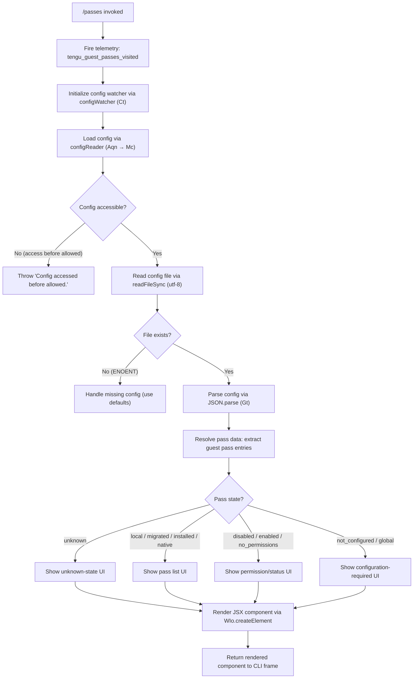

# `/passes`

> Analysis basis: CC v2.1.183 bundle.js (AST extraction + Claude interpretation)
> Minimum version: v2.1.183

---

## Overview

The `/passes` command allows a Claude Code user to share a free week of Claude Code with friends by displaying and managing guest pass distribution. It is a local-jsx type command that renders a UI component to show available passes and facilitate sharing. Upon invocation, it fires a telemetry event and delegates to an async handler that coordinates configuration access and JSX rendering.

---

## Registration

| Field | Value |
|---|---|
| type | `local-jsx` |
| name | `passes` |
| description | `Share a free week of Claude Code with friends` |
| loc_byte | `12711114` |
| loc_byte_end | `12711436` |
| loc_line | `8322` |
| isHidden | `null` (not hidden) |
| module_id | `EIl` |
| load_inline | `true` |
| arbor_handler.name | `Dif` |
| arbor_handler.fqn | `claude-2.1.183::Dif` |
| arbor_handler.kind | `AsyncFunction` |
| arbor_handler.resolution_path | `module_id` |
| arbor_handler.n_hits | `2` |

Analysis basis: CC v2.1.183 bundle.js:+12711114

---

## Input Branching

The handler has 3+ distinct branches — determined by the call graph and literal set observed in the implementation — so a Mermaid flowchart is used.



Analysis basis: CC v2.1.183 bundle.js:+12710797, +12710831, +12710986, +13963981, +13964002

---

## Behavioral Spec

### Top-Level Handler: guestPassesHandler (Dif)

The primary entry point is an `AsyncFunction` resolved via the `module_id` path (`EIl → Dif`).

```
async function guestPassesHandler(context):
    fireEvent("tengu_guest_passes_visited")              // telemetry on every visit
    configWatcherInstance = initConfigWatcher(context)   // Ct: sets up file watcher + cache
    passDataLoader = initPassDataLoader(context)         // Aqn → Mc: loads pass config data
    uiElement = createElement(PassesComponent, {         // WIo.createElement
        config: passDataLoader,
        watcher: configWatcherInstance,
        ...context
    })
    return uiElement
```

Analysis basis: CC v2.1.183 bundle.js:+12710797, +12710831, +12710837, +12710935, +12710986

---

### Config Watcher Initialization: initConfigWatcher (Ct)

Called immediately on handler entry; sets up filesystem watching and caching for the configuration file.

```
function initConfigWatcher(context):
    logger = getLogger()                    // jt
    mtime = getModificationTime()           // vx
    hookRegistry = getHookRegistry()        // Hko
    configAccessor = initConfigAccessor()   // q_e
    timestamp = Date.now()
    fileWatchHandle = watchFileForChanges(  // Ebf
        configAccessor,
        onConfigChange: (newData) => updateCache(newData)
    )
    return { configAccessor, fileWatchHandle, timestamp }
```

Analysis basis: CC v2.1.183 bundle.js:+13965337, +13965351, +13965370, +13965374, +13965427, +13965480

---

### Config File Accessor: configAccessor (q_e)

Handles all direct reads of the config JSON file, including error handling for access-before-ready and missing files.

```
function configAccessor(opts):
    if not configAccessAllowed():
        throw new Error("Config accessed before allowed.")  // literal at +13968689

    configPath = resolveConfigPath()                // jt + path utilities
    try:
        raw = fs.readFileSync(configPath, "utf-8")  // encoding literal at +13968772
    catch err:
        if err.code == "ENOENT":                    // literal at +13968919
            return defaultConfig()
        throw err

    parsed = parseJSON(raw)                         // Gt → JSON.parse
    normalized = normalizeVersion(parsed)            // V9: startsWith / slice checks
    backupsDir = resolveBackupsDirectory()          // RFl: "backups" dir literal at +13968257
    return { parsed: normalized, backupsDir }
```

Analysis basis: CC v2.1.183 bundle.js:+13968683, +13968689, +13968730, +13968745, +13968772, +13968792, +13968795, +13968911, +13968919, +13968935

---

### Pass Data Loader: passDataLoader (Aqn)

Coordinates loading pass-related data using the module loader and config watcher.

```
function passDataLoader(context):
    moduleLoader = loadModule()      // Mc → hy (React/JSX component loader)
    configRef = getConfig()          // Ct reference
    return { moduleLoader, configRef }
```

Analysis basis: CC v2.1.183 bundle.js:+12349972, +12350020

---

### Config Persistence: globalConfigSaver (pn)

Manages safe writes of the global config file, including locking, backup rotation, and integrity checks.

```
function globalConfigSaver(data, opts):
    // Guard: ensure auth fields not lost
    if cachedAuthPresent and reReadConfigMissingAuth:
        log("saveGlobalConfig fallback: re-read config is missing auth...")
        // literal at +13963525
        fireEvent("tengu_config_fallback_write")   // +13966361
        return false

    lockHandle = acquireLock()
    if lockContention:
        fireEvent("tengu_config_lock_contention")  // +13966745
        warn("Lock acquisition took longer than expected...")  // +13966656

    reRead = readCurrentConfigFromDisk()           // W7n path utilities
    if reReadMissingAuth:
        fireEvent("tengu_config_auth_loss_prevented")  // +13967224
        log("saveConfigWithLock: re-read config is missing auth...")  // +13967072
        return false

    fireEvent("tengu_config_stale_write")          // +13966881 (if stale)

    writeConfigSafely(data)                        // MSt: atomic write with temp file
    return true
```

State enum values observed in literals (Analysis basis: CC v2.1.183 bundle.js:+13963981–13964208):

| Literal | Byte Offset |
|---|---|
| `"unknown"` | +13964002 |
| `"local"` | +13964077 |
| `"migrated"` | +13964064 |
| `"native"` | +13964109 |
| `"installed"` | +13964095 |
| `"disabled"` | +13964128 |
| `"enabled"` | +13964154 |
| `"no_permissions"` | +13964168 |
| `"not_configured"` | +13964189 |
| `"global"` | +13964208 |

Analysis basis: CC v2.1.183 bundle.js:+13963499, +13963515, +13963651, +13963765, +13967034

---

### Atomic File Write: atomicFileWriter (MSt)

Performs safe, atomic file writes to persist config changes. Uses a temporary file and rename strategy.

```
function atomicFileWriter(filePath, content, opts):
    randomSuffix = crypto.randomBytes(8).toString("hex")  // +1096954, +1096982, 8 at +1097137
    tempPath = filePath + "." + randomSuffix
    
    try:
        existingStat = fs.lstatSync(filePath)
        isSymlink = existingStat.isSymbolicLink()
    catch:
        isSymlink = false

    resolvedTarget = resolveSymlinkTarget(filePath)  // MSt → jp

    fs.writeFileSync(tempPath, content)
    
    try:
        originalMode = fs.statSync(filePath).mode
        fs.fchmodSync(fd, originalMode)
        log("Applied original permissions to temp file")  // +1097478
    catch permErr:
        if permErr.code in ["EINVAL","ENOTSUP","EPERM","ENOSYS"]:  // +1093478–+1093520
            // ignore permission errors gracefully via vKe
            pass
    
    fs.fsyncSync(fd)
    fs.renameSync(tempPath, resolvedTarget)
    
    if renameErr.code == "EACCES":              // +1097986
        // fallback: in-place write
        log("writeFileSyncAndFlush: in-place fallback write failed; content preserved at temp path")
        // +1098768
    
    cleanupOldBackups(maxBackups=5)             // literal 5 at +13967675
    return true
```

Analysis basis: CC v2.1.183 bundle.js:+13967915, +1096219, +1096306, +1096954, +1097395, +1097457, +1097604, +1097813

---

### File Watcher: configFileWatcher (Ebf)

Watches the config file for external modifications and triggers cache invalidation.

```
function configFileWatcher(configAccessor, onChangeCallback):
    versionCheck = getCurrentVersion()    // vx
    fs.watchFile(configPath, handler)     // B7n.watchFile
    
    onFileChange = (curr, prev) => {
        if curr.mtime != prev.mtime:
            newData = configAccessor()    // re-read
            onChangeCallback(newData)
            fireChangeEvent(Hko, Kq)
            registerCleanup(qi)          // qi → B2o.register
    }
    
    return {
        unwatch: () => fs.unwatchFile(configPath)  // B7n.unwatchFile
    }
```

Analysis basis: CC v2.1.183 bundle.js:+13964835, +13964840, +13964922, +13965006, +13965071, +13965079, +13965160, +13965173

---

## State & Side Effects

| Item | Detail |
|---|---|
| Telemetry — `tengu_guest_passes_visited` | Fired on every `/passes` invocation (bundle.js:+12710937) |
| Telemetry — `tengu_config_parse_error` | Fired when the config file cannot be parsed (bundle.js:+13969320) |
| Telemetry — `tengu_config_lock_contention` | Fired when config lock acquisition is slow (bundle.js:+13966745) |
| Telemetry — `tengu_config_stale_write` | Fired when a stale config write is detected (bundle.js:+13966881) |
| Telemetry — `tengu_config_auth_loss_prevented` | Fired when a write is blocked to prevent auth loss (bundle.js:+13967224) |
| Telemetry — `tengu_config_fallback_write` | Fired when the fallback write path is taken (bundle.js:+13966361) |
| Telemetry — `tengu_bg_dispatch_sigkill_escalate` | Fired during background process escalation reachable from the config subsystem (bundle.js:+17275023) |
| Telemetry — `tengu_bg_spare_enable` | Fired when a spare background session is enabled (bundle.js:+17276321) |
| Telemetry — `tengu_bg_spare_claim` | Fired when a spare background session is claimed (bundle.js:+17276449) |
| Telemetry — `tengu_bg_spare_claim_fail` | Fired when spare session claim fails (bundle.js:+17276715) |
| File system | Reads `~/.claude.json` (or equivalent) via `fs.readFileSync`; writes via atomic rename; watches via `fs.watchFile` |
| Config lock | Acquires a file lock before writing; contention is detected and logged |
| Backup rotation | Keeps at most 5 backups in a `backups/` subdirectory (literal: 5 at bundle.js:+13967675) |
| Auth guard | Refuses to write config if re-read data is missing auth fields present in the cache (prevents auth wipe, ref GH #3117) |
| JSX rendering | Calls `WIo.createElement` (bundle.js:+12710986) to produce a React element returned to the CLI frame |
| Hook registration | `qi → B2o.register` registers a cleanup hook for the config file watcher (bundle.js:+13965160) |
| appState changes | Config cache updated on file-change events; no other direct appState mutations observed at depth-2 |
| Sound | None observed |

---

## Version History

| Version | Change |
|---|---|
| v2.1.183 | Initial analysis |

---

## Common Mistakes

1. **Running `/passes` in an environment without a valid config file**: The command reads `~/.claude.json` on startup. If the config file is missing and defaults are returned, the pass UI may show an empty or `"unknown"` state rather than an error message.
2. **Expecting immediate pass delivery**: `/passes` is a UI display and sharing command; it presents available passes but does not itself trigger pass issuance or network requests beyond telemetry.
3. **Assuming `/passes` is hidden**: The `isHidden` field is `null`, meaning this command is publicly visible in the command palette. It will appear in autocomplete suggestions.
4. **Concurrent config writes causing auth loss**: The handler guards against writing a config that is missing auth fields compared to the in-memory cache. Users or scripts that modify `~/.claude.json` externally while `/passes` is open may trigger the auth-loss prevention path and see a write refused (GH #3117).
5. **Backup directory confusion**: Backup files are stored in a `backups/` subdirectory alongside the config. At most 5 backups are retained; older ones are rotated out automatically.

---

## Appendix — Identifier Mapping

> For bundle debugging only. Identifiers change across versions.

| Identifier | Role |
|---|---|
| `Dif` | Top-level async handler for `/passes` (guestPassesHandler) |
| `Ct` | Config watcher / cache coordinator (initConfigWatcher) |
| `jt` | Logger / structured logger utility |
| `Hko` | Hook registry for config change events |
| `q_e` | Config file accessor with error handling (configAccessor) |
| `r` | Node.js `fs`-like synchronous filesystem module wrapper |
| `Fs` | CLI error / process exit utility |
| `Gt` | JSON parse utility wrapper |
| `V9` | Version normalization / string prefix check utility |
| `e` | Math.random / setTimeout utility (random jitter) |
| `t` | General purpose local binding (context-dependent) |
| `dn` | Logging / debug output utility |
| `RFl` | Backup directory resolver and file lister |
| `Sko` | Path join helper for config subdirectories |
| `a` | MCP/state map accessor (context-dependent) |
| `l` | Symbol/loader utility (context-dependent) |
| `T` | Environment/header utility (HTTP header builder or env accessor) |
| `QHc` | HTTP response formatter |
| `Pe` | JSON stringify utility wrapper |
| `Kc` | String redaction / replacement utility ("[REDACTED]" inserter) |
| `Hqe` | Secondary string sanitizer |
| `n_c` | File upload / byte-length checker utility |
| `j` | General async helper / Promise utility |
| `f` | Background session dispatch / process manager |
| `n` | Map/collection utility (context-dependent) |
| `M` | Background job/process scheduler |
| `Bn` | Abort/timeout wrapper utility |
| `Re` | Feature flag "ok" reporter (tengu_feature_ok) |
| `ke` | Feature flag "bad" reporter (tengu_feature_bad) |
| `YKn` | macOS low-memory checker |
| `B$e` | File lstat/rm/readFile async utility |
| `De` | Error reporting / logError utility |
| `$` | Retire-if-settled session handle |
| `ct` | PTY/terminal session connector |
| `NNo` | Daemon socket connection handler |
| `jNo` | Background job lifecycle manager |
| `s` | Secondary job lifecycle reference (alias of jNo in context) |
| `p` | Forced shutdown / abort handler |
| `Ue` | Output/paint renderer |
| `R` | Disposable resource handle |
| `Ebf` | Config file watcher (configFileWatcher) |
| `Kq` | Change event dispatcher for config watcher |
| `qi` | Cleanup hook registrar (→ B2o.register) |
| `Aqn` | Pass data / module loader coordinator (passDataLoader) |
| `Mc` | React/JSX module loader |
| `hy` | JSX component hydrator |
| `dp` | Component mount utility |
| `ib` | Profile/auth mode initializer |
| `Ac` | First-party auth checker |
| `YT` | Component render scheduler |
| `Ug` | Full component lifecycle manager (mount → render → unmount) |
| `vLt` | Alternate JSX factory path |
| `AJe` | Component state initializer |
| `pn` | Global config saver (globalConfigSaver) |
| `W7n` | Config write-with-lock core (saveConfigWithLock) |
| `C3s` | Object assign / write options builder |
| `_wr` | Internal write helper |
| `AAt` | Lock acquisition helper |
| `I` | Scroll/viewport math utility |
| `k` | Keyboard event / supervisor write utility |
| `E` | Clamp/min-max math utility |
| `g` | Buffer/stream chunker for IPC |
| `h` | Socket timeout utility |
| `m` | Process kill-all utility |
| `Qp` | Stream end/serialize utility |
| `T6f` | Daemon IPC message router |
| `Ee` | String coercion utility |
| `MSt` | Atomic file writer (atomicFileWriter) |
| `jp` | Symlink resolution utility |
| `u` | Daemon stop controller |
| `Mn` | Debug log writer |
| `i` | Socket close handler |
| `vKe` | Permission-error suppressor (EINVAL/ENOTSUP/EPERM/ENOSYS) |
| `LMe` | Config file path resolver |
| `_ko` | Object.entries iterator for config sections |
| `oWt` | Timestamp / Date.now wrapper |
| `j7n` | Config file backup writer |