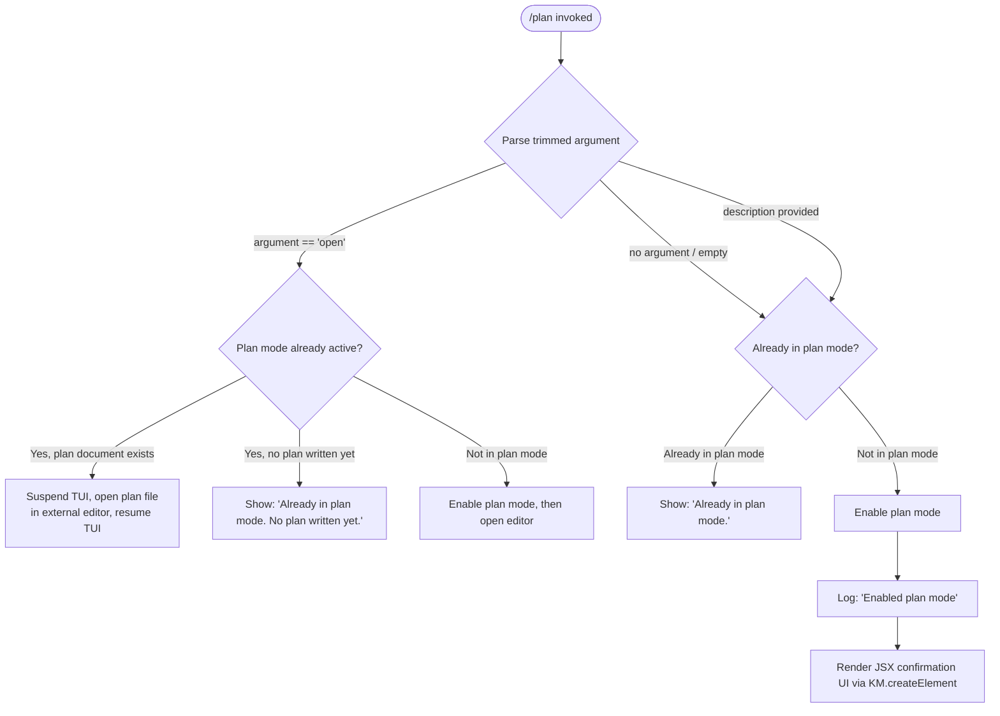

# `/plan`

> Analysis basis: CC v2.1.181 bundle.js (AST extraction + Claude interpretation)
> Minimum version: v2.1.181

---

## Overview

The `/plan` command enables "plan mode" for the current Claude Code session, or opens the existing session plan for viewing or editing in an external editor. When invoked without arguments or with a description, it activates a restricted operating mode in which the agent focuses on producing a structured plan rather than executing actions. When invoked with the `open` sub-command, it opens the plan document using an external editor process, suspending the terminal UI while the editor runs.

---

## Registration

| Field | Value |
|---|---|
| type | `local-jsx` |
| name | `plan` |
| description | `Enable plan mode or view the current session plan` |
| argumentHint | `[open\|<description>]` |
| module_id | `Ubl` |
| load_inline | `true` |
| loc_byte | `12675269` |
| loc_byte_end | `12675468` |
| loc_line | `8271` |
| arbor_handler.name | `qrf` |
| arbor_handler.fqn | `claude-2.1.181::qrf` |
| arbor_handler.kind | `AsyncFunction` |
| arbor_handler.resolution_path | `module_id` |
| arbor_handler.n_hits | `0` |

Analysis basis: CC v2.1.181 bundle.js:+12675269

---

## Input Branching

The command has 4+ distinct branches depending on argument value, current plan-mode state, and whether a plan document already exists.



Analysis basis: CC v2.1.181 bundle.js:+12674649, +12674668, +12674587, +12674607, +12674827

---

## Behavioral Spec

The primary handler is `qrf` (resolved via `module_id` → `Ubl` by Arbor). It is an `AsyncFunction`.

Analysis basis: CC v2.1.181 bundle.js:+12674382

### Sub-feature 1 — Argument Parsing and Mode Check

```
async function planCommandHandler(rawArgument, sessionState):
    trimmedArg = rawArgument.trim()                     // +12674649

    currentMode = getPlanModeState(sessionState)        // via kM / xM +12674778, +12674785
    planDocument = getPlanDocument(sessionState)        // via $S / fd +12674571

    if trimmedArg == "open":                            // +12674668
        handleOpenSubcommand(sessionState, currentMode, planDocument)
    else:
        handleActivatePlanMode(sessionState, currentMode, trimmedArg)
```

Analysis basis: CC v2.1.181 bundle.js:+12674649

### Sub-feature 2 — Activating Plan Mode

```
function handleActivatePlanMode(sessionState, currentMode, description):
    if currentMode.isActive:
        displayMessage("Already in plan mode.")         // +12674607
        return

    setPlanMode(sessionState, true)                    // via Jg +12674481, Rct +12674484
    logInfo("Enabled plan mode")                       // +12674587

    renderConfirmationUI(description)                  // via KM.createElement +12675046
```

When plan mode is successfully activated, the handler invokes `Jg` (session-mode setter) and `Rct` (apparent settings/state reconciler) to persist the mode change, then constructs a JSX element for display via `KM.createElement`.

Analysis basis: CC v2.1.181 bundle.js:+12674481, +12674484, +12674587, +12675046

### Sub-feature 3 — Opening Plan Document in External Editor

```
function handleOpenSubcommand(sessionState, currentMode, planDocument):
    if NOT currentMode.isActive:
        activatePlanMode(sessionState)

    if planDocument == null OR planDocument == "":
        displayMessage("Already in plan mode. No plan written yet.")  // +12674827
        return

    editorProcess = launchExternalEditor(planDocument)  // via uq +12674928
    // uq suspends Ink TUI, spawns editor synchronously, resumes TUI
```

The external-editor launch sequence (via `uq`) performs the following steps, derived from the call graph:

```
function launchExternalEditor(filePath):
    inkInstance = getInkInstance()                  // via jt +11769921, Vu.get +11769928
    if inkInstance == null:
        throw Error("Ink instance not found - cannot pause rendering")  // +11769969

    editorCommand = resolveEditorCommand(filePath)  // via $6 +12675012, xL +12675021
    // xL detects IDE context (literal "IDE" +6657014) and chooses appropriate editor binary
    // xL.basename used to extract editor name for display

    inkInstance.enterAlternateScreen()              // +11770122
    inkInstance.pause()                             // +11770152
    inkInstance.suspendStdin()                      // +11770162

    result = spawnSync(editorCommand, [filePath], { stdio: "inherit" })  // +11770244, +11770276

    inkInstance.exitAlternateScreen()               // +11770624
    inkInstance.resumeStdin()                       // +11770653
    inkInstance.resume()                            // +11770669

    return readFileSync(filePath, "utf-8")          // +11770546
```

Analysis basis: CC v2.1.181 bundle.js:+12674928, +11769921, +11770122, +11770244, +11770624

### Sub-feature 4 — Plan Mode State Resolution

```
function getPlanModeState(sessionState):
    // Uses xM (+12674785) which calls q0e internally
    // q0e reads from a Map (r.get +13497233) keyed by session context
    // Falls back through: policySettings, flagSettings, userSettings, localSettings
    //   (+1332264, +1332314, +1332362, +1332410)
    // Returns resolved plan mode boolean and source of the setting
```

Analysis basis: CC v2.1.181 bundle.js:+12674785, +13497233, +1332264

### Sub-feature 5 — Session Mode Mutation via setMode

```
function setPlanMode(sessionState, enabled):
    // Jg (+12674481) calls setMode("plan", enabled)
    // Internally checks bypassPermissions guard (+5235664, +5235730):
    //   if mode == "bypassPermissions" AND bypassPermissions is unavailable:
    //     log warning: "Ignoring permission update: setMode 'bypassPermissions' rejected..."
    // Applies allow/deny rule sets to session state:
    //   addRules (+5236006), replaceRules (+5236354), removeRules (+5237011)
    //   addDirectories (+5236665), removeDirectories (+5237395)
    //   alwaysAllowRules (+5236199), alwaysDenyRules (+5236238), alwaysAskRules (+5236256)
    // Writes updated settings via Re (JSON.stringify +190076)
    // Registers cleanup handler via Gi → v$o.register (+65579)
```

Analysis basis: CC v2.1.181 bundle.js:+12674481, +5235664, +5236006, +65579

### Sub-feature 6 — Editor Command Resolution

```
function resolveEditorCommand(filePath):
    // xL (+12675021) lowercases environment identifiers
    // Checks for "IDE" string (+6657014) to detect IDE-integrated terminal
    // Uses AP.basename to extract editor executable name (+6657127)
    // Falls through to gBe for fallback editor discovery (+6657201)
    // Returns [editorBinary, ...args] array
```

Analysis basis: CC v2.1.181 bundle.js:+12675021, +6657014, +6657127

### Sub-feature 7 — JSX Output Rendering

The command renders its output using `KM.createElement` (+12675046), making this a `local-jsx` type command. The rendered component is produced via `pIa` (+12675042), which internally uses `Xit` to attach event listeners (`o.on` +8142361) and render via `Mle.createElement` (+8142428). ANSI stripping is applied via `Sc → Bun.stripANSI` (+3943165) for clean output in non-TTY contexts.

Analysis basis: CC v2.1.181 bundle.js:+12675046, +12675042, +8142361, +3943165

---

## State & Side Effects

| Item | Detail |
|---|---|
| Telemetry | No `tengu_*` telemetry events detected in depth-2 traversal |
| Plan mode flag | Set to `true` in session state via `Jg` (setMode handler); persisted via settings writer (+5236924 `n.set`) |
| Allow/Deny rules | Session permission rules may be mutated when mode changes (addRules, replaceRules, removeRules) |
| Hook registration | Cleanup hook registered via `Gi → v$o.register` (+65579) on mode activation |
| TUI suspension | Ink terminal UI is fully suspended (alternate screen, stdin paused) during external editor spawn |
| File I/O | Plan file read back via `readFileSync` after editor exits (+11770546, encoding `utf-8` +13497681) |
| Error logging | CLI errors written via `eje` path with `gt.red` coloring (+13300030); telemetry error event `"cli_error"` (+13300071) on crash; `process.exit(1)` (+13300084) |
| Crash persistence | `JT` writes crash data via `Ire.writeFileSync` (+198143) joined with `cor.join` (+198161) |
| ANSI stripping | `Sc → Bun.stripANSI` (+3943165) applied to rendered output |

---

## Version History

| Version | Change |
|---|---|
| v2.1.181 | Initial analysis |

---

## Common Mistakes

1. **Invoking `/plan open` when not yet in plan mode** — the command will first activate plan mode, but if no plan content has been written yet, it will display "Already in plan mode. No plan written yet." rather than opening an editor, which may be unexpected.
2. **Expecting `/plan` to create a plan automatically** — the command activates the *mode*; the agent must subsequently produce a plan document within that mode. The mode change alone does not generate plan content.
3. **Editor detection failures in non-IDE terminals** — the `xL` editor resolver checks for an "IDE" environment marker. In plain terminal sessions without IDE integration, the fallback editor path via `gBe` is used; if no editor is configured (`$EDITOR`, `$VISUAL`, etc.), the open sub-command may fail silently or raise an error.
4. **Invoking `/plan` twice expecting a description update** — repeated invocation when already in plan mode produces "Already in plan mode." and exits early; the description argument is not applied as an update to an existing plan.
5. **Assuming telemetry is emitted** — no `tengu_*` telemetry events were found in the depth-2 traversal of this command's implementation; downstream observability tooling should not rely on plan-mode telemetry events in this version.

---

## Appendix — Identifier Mapping

> For bundle debugging only. Identifiers change across versions.

| Identifier | Role |
|---|---|
| `qrf` | Primary async handler for `/plan` command (Arbor-resolved entry point) |
| `r` | CLI error reporting / stream wrapper called early in handler |
| `Ps` | CLI error handler: logs error, writes crash file, calls `process.exit` |
| `eje` | Error formatter using `gt.red` for coloured terminal output |
| `JT` | Crash-data file writer (`Ire.writeFileSync` + `cor.join`) |
| `Tde` | Early setup/init helper called before argument branching |
| `o` | Column/display formatter using `s.map` and `i.padEnd` |
| `s` | Async set/resource tracker using `r.add`, `r.delete`, `i.finally` |
| `i` | Stream/connection manager with `n.close` and `r.close` |
| `n` | String normaliser using `i.toLowerCase` |
| `Jg` | Session mode setter (`setMode`); mutates allow/deny rule sets |
| `I` | Telemetry/logging helper; checks `bypassPermissions`, formats events |
| `xhc` | Settings validator or schema checker |
| `L$o` | Settings lookup combining `Mfc` and `Rfc` sources |
| `e` | Random-delay or retry helper using `Math.random` and `setTimeout` |
| `Re` | JSON serialiser wrapper (`JSON.stringify`) |
| `t` | String uppercaser / model-name normaliser |
| `qc` | Path or identifier slugifier using regex replace and `r.at` |
| `c3o` | Character-mapping table builder (`Chc.map`) |
| `nqe` | Output writer delegating to `QBo → e.write` |
| `QBo` | Low-level stream write wrapper |
| `Rhc` | Conversation/transcript logger; manages log file append and rotation |
| `kWe` | Batched-write scheduler using `setTimeout`, `setImmediate`, `clearTimeout` |
| `Fde` | Log-line formatter joining fields with `Ude.join` |
| `jt` | Shared utility (path or context accessor) used across multiple callers |
| `bre` | File-error classifier checking for `EISDIR`/`ENOENT` error codes |
| `f3o` | Log-file path builder using `Ude.join` and `Lt` |
| `Sor` | Log-rotation handler: stat, rename `.txt`, unlink via `tU.*` |
| `Mhc` | Log-file append worker: `mkdir`, `appendFile`, rotation, byte-length check |
| `Gi` | Cleanup-hook registrar (`v$o.register`) |
| `sm` | String sanitiser using `DYc → e.replaceAll` |
| `DYc` | Backslash/paren escape helper (`e.replaceAll`) |
| `Rct` | Settings/state reconciler; resolves tool permissions and model config |
| `Dxo` | Model and feature-flag resolver |
| `N9` | Feature-flag or capability reader |
| `gw` | Model selection logic combining `vxo`, `RTe`, `Ns` |
| `vxo` | Model enumeration source |
| `RTe` | Model family classifier (checks `claude-3-`, `claude-opus-4-*`, etc.) |
| `Ns` | Model availability checker using `xK`, `gs`, `Ug` |
| `rhr` | Settings hierarchy walker (`policySettings` → `localSettings`) |
| `Tn` | Settings reader from layered config using `qtn` and `x2` |
| `a2` | Permission rule aggregator |
| `C_e` | Tool-config entry mapper using `Object.entries` and `Jg` |
| `Q6` | Full session-config builder; assembles allowed tools, rules, model |
| `vA` | Tool-permission entry formatter using `RYc`, `ek`, `PYc`, `MYc` |
| `RYc` | Rule string builder |
| `ek` | `Object.hasOwn` wrapper for safe property check |
| `PYc` | Permission predicate helper |
| `MYc` | String replacement helper (`e.replaceAll`) |
| `bxo` | Tool-list builder with path relativisation via `Sxo` |
| `S5e` | Cached tool descriptor lookup (`f4a.get`/`f4a.set`) |
| `Sxo` | Tool path relativiser using `tNl.relative` and `AC.includes` |
| `sNl` | Session-rule set manager: get, push, set, delete via `Jg` |
| `UHf` | Rule deduplication helper (`L2.includes`) |
| `a` | React/Ink component state accessor combining `DBe`, `bQn`, `s.get`, `kOo` |
| `$S` | Plan document accessor delegating to `fd` |
| `fd` | Plan document reader using `jRe` |
| `jRe` | Underlying plan storage reader |
| `Uft` | Plan-mode state accessor combining `Gye` and `Lt` |
| `Gye` | Plan-mode flag reader from session context |
| `Lt` | Session/context accessor (shared utility, used widely) |
| `fx` | Low-level context primitive used by `Lt` |
| `kM` | Plan-mode full handler: reads state, writes change, renders output |
| `xM` | Plan-mode state reader building on `q0e` |
| `q0e` | Layered setting resolver (Map-based, with `jt`, `Ey`, path utilities) |
| `tNr` | Path normaliser using `e.replace` |
| `VJe` | Path resolver using `rxt` |
| `Zgn` | Alternative path resolver using `rxt` |
| `Dn` | Error classifier checking `ENOENT` and related codes via `ln` |
| `ln` | Filesystem error-code matcher |
| `ls` | Permission-error classifier (`EACCES`, `EPERM`, etc.) via `ln` |
| `ke` | Agent runner / main REPL loop; manages message queue and error logging |
| `Ho` | Error wrapper using `Error` and `String` |
| `rt` | Value-to-string coercer |
| `ta` | Response-history accumulator using `qYo` |
| `qYo` | Response formatter using `rt` |
| `fVc` | Ring-buffer manager for recent responses (`ren.shift`, `ren.push`) |
| `uq` | External-editor launcher: suspends Ink, spawns editor, resumes Ink |
| `$6` | Editor command builder using `b_` and `Bqp` |
| `b_` | Editor binary resolver (environment-based) |
| `jqp` | Editor-launch orchestrator calling `J_o` |
| `J_o` | File-type and editor-match resolver using `tcl` |
| `tcl` | File classifier: trim, `startsWith`, basename, lowercase, set lookup |
| `xL` | IDE-aware editor selector; checks "IDE" env, uses `AP.basename` |
| `Li` | String slicer using `indexOf` and `slice` |
| `pIa` | JSX output component factory using `Xit` and `Sc` |
| `Xit` | Event-driven render component: `o.on`, `i.toString`, `p8`, `Mle.createElement` |
| `p8` | Ink/React render helper using `L2r`, `G2r`, `wZ` |
| `G2r` | React element creator (`mIi.createElement`) |
| `wZ` | Ink Box/Text component builder using `eM`, `VIe`, `x2r` |
| `Sc` | ANSI-strip output wrapper (`Bun.stripANSI`) |