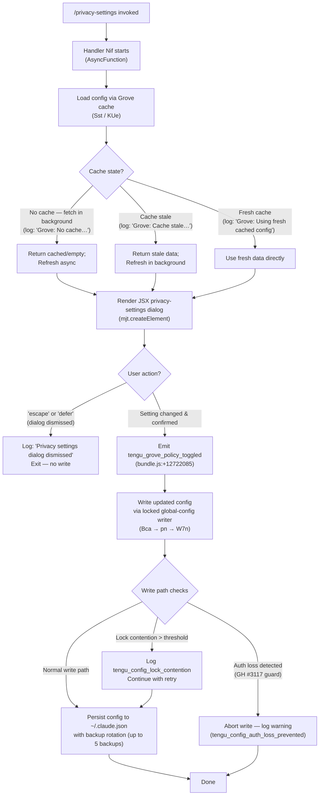

# `/privacy-settings`

> Analysis basis: CC v2.1.183 bundle.js (AST extraction + Claude interpretation)
> Minimum version: v2.1.183

---

## Overview

The `/privacy-settings` command opens an interactive dialog that lets users view and update their privacy configuration within Claude Code. When invoked, the handler (`Nif`) runs as an async function: it loads current privacy configuration from the Grove config cache, renders a JSX settings panel, and—if the user confirms a change—persists the updated preference to the global config file with lock protection before emitting a telemetry event. If the dialog is dismissed without changes (via `escape` or `defer` actions), the command exits silently.

---

## Registration

| Field | Value |
|---|---|
| type | `local-jsx` |
| name | `privacy-settings` |
| description | `View and update your privacy settings` |
| module_id | `CIl` |
| load_inline | `true` |
| loc_byte | `12722549` |
| loc_byte_end | `12722732` |
| loc_line | `8332` |
| arbor_handler.name | `Nif` |
| arbor_handler.fqn | `claude-2.1.183::Nif` |
| arbor_handler.kind | `AsyncFunction` |
| arbor_handler.resolution_path | `module_id` |
| arbor_handler.n_hits | `0` |

Analysis basis: CC v2.1.183 bundle.js:+12722549

---

## Input Branching

The command exhibits 4+ distinct paths depending on config cache freshness and the user's dialog action (confirm change, escape, or defer). A flowchart is used.



---

## Behavioral Spec

### Top-level handler: `privacySettingsHandler` (bundle name: `Nif`)

```
async function privacySettingsHandler(commandArgs):
    // Parallel initialisation
    await Promise.all([
        loadInitialState(commandArgs),   // Vee
        loadLeSettings(commandArgs)      // $Le
    ])

    // Render interactive JSX dialog
    uiElement = jsxRuntime.createElement(settingsComponent, { section: "settings" })
    show(uiElement)

    // Wait for user input signal
    action = await waitForUserAction()

    if action == "escape" or action == "defer":
        log("Privacy settings dialog dismissed")
        return  // No mutation

    // User confirmed a change
    emit("tengu_grove_policy_toggled")   // bundle.js:+12722085
    await persistUpdatedPrivacySettings(newSettings)
```

Analysis basis: CC v2.1.183 bundle.js:+12721540

---

### Config cache layer: `groveConfigLoader` (bundle names: `Sst`, `KUe`)

```
function groveConfigLoader(context):
    configStore = readConfigState(context)   // KUe → sa

    cacheAge = Date.now() - configStore.lastFetchTimestamp

    if configStore.isEmpty:
        log("Grove: No cache, fetching config in background (dialog skipped this session)")
        triggerBackgroundRefresh()
        return emptyOrDefaultConfig

    elif isCacheStale(cacheAge):
        log("Grove: Cache stale, returning cached data and refreshing in background")
        triggerBackgroundRefresh()
        return configStore.cachedValue

    else:
        log("Grove: Using fresh cached config")
        return configStore.cachedValue
```

Analysis basis: CC v2.1.183 bundle.js:+7202502, +7202617, +7202737, +7202843

---

### Config read: `configReader` (bundle names: `KUe` → `sa` → `hy`)

```
function configReader(path, options):
    // Resolve config file type
    apiKeySource = resolveApiKeySource()   // checks ANTHROPIC_API_KEY env var
    apiKeyHelper = resolveApiKeyHelper()   // checks "apiKeyHelper" config key

    // Determine auth tier: "max" | "pro" | "unknown"
    tier = classifyTier(apiKeySource)     // literals: "max" (bundle.js:+3073499), "pro" (bundle.js:+3073510)

    return {
        apiKey: ...,
        tier: tier,
        privacySettings: readPrivacyBlock()
    }
```

Analysis basis: CC v2.1.183 bundle.js:+3073537, +3049030, +3049055, +3073499, +3073510

---

### Config persistence: `saveGlobalConfig` (bundle names: `Bca` → `pn` → `W7n`)

```
async function saveGlobalConfig(newConfigValues):
    // Acquire file lock; warn if contention detected
    lockAcquiredAt = Date.now()
    if lockDuration > LOCK_WARN_THRESHOLD:
        emit("tengu_config_lock_contention")   // bundle.js:+13966745
        log("Lock acquisition took longer than expected…")

    // Re-read config from disk before writing (freshness guard)
    diskConfig = readFileSync(configPath, "utf-8")   // bundle.js:+13968772

    // Safety guard: refuse write if auth would be lost (GH #3117)
    if diskConfig.isMissingAuth AND cachedConfig.hasAuth:
        emit("tengu_config_auth_loss_prevented")   // bundle.js:+13967224
        log("saveConfigWithLock: re-read config is missing auth…")
        return  // Abort write

    // Rotate backups (max 5 kept, prefix ".backup.")
    rotateBucketBackups(configPath, maxBackups=5)   // bundle.js:+13967675, +13967542

    // Write new config
    writeFileSync(configPath, serialized)

    // Fallback path if primary write fails
    if writeFailed:
        emit("tengu_config_fallback_write")   // bundle.js:+13966361
        attemptFallbackWrite()
```

Analysis basis: CC v2.1.183 bundle.js:+13963318, +13966467, +13966517, +13967034, +13967072, +13967542, +13967675

Config lock timeout: 60 000 ms (bundle.js:+13967426)

---

### Dialog dismiss detection

The handler checks for two literal action tokens produced by the UI layer:

- `"escape"` — keyboard dismiss (bundle.js:+12721704)
- `"defer"` — explicit "later" action (bundle.js:+12721718)

When either is detected, the string `"Privacy settings dialog dismissed"` is logged (bundle.js:+12721729) and no config write occurs.

---

### Error path: unreachable settings

If the config cannot be retrieved, the handler surfaces the message:

> `"Unable to retrieve updated privacy settings"` (bundle.js:+12721856)

and exits without mutation.

---

### File-system error handling inside `configFileReader` (bundle name: `q_e`)

```
function configFileReader(filePath):
    if not accessAllowed:
        throw Error("Config accessed before allowed.")   // bundle.js:+13968689

    try:
        content = fs.readFileSync(filePath, "utf-8")
    catch err:
        if err.code == "ENOENT":   // bundle.js:+13968919
            emit("tengu_config_parse_error")   // bundle.js:+13969320
            return defaultConfig
        else:
            rethrow

    if parseError:
        emit("tengu_config_parse_error")
        return defaultConfig
```

Analysis basis: CC v2.1.183 bundle.js:+13968689, +13968772, +13968919, +13969320

---

### MCP watcher side-path: `mcpConnectionManager` (bundle names: `n3e`, `B1o`, `uZn`)

The call graph shows that the privacy-settings handler, via intermediate config-state helpers, reaches MCP connection management code (`n3e` → `B1o` → `uZn`). This is a shared infrastructure path—not specific to the privacy dialog. It handles:

- Applying MCP server updates (`e.applyMcpUpdate`, bundle.js:+16920027)
- Cleanup of orphaned connections (bundle.js:+16920161, +16920246)
- Skipping cached `needs-auth` connections (bundle.js:+6836187)
- Skipping recently failed connections with 15-minute retry window (bundle.js:+6836374)

These calls fire as part of loading the global config state that the privacy dialog reads.

Analysis basis: CC v2.1.183 bundle.js:+16919733, +16920027, +16920149

---

## State & Side Effects

| Item | Detail |
|---|---|
| Telemetry: `tengu_grove_policy_toggled` | Emitted when the user confirms a privacy setting change (bundle.js:+12722085) |
| Telemetry: `tengu_config_parse_error` | Emitted when the config JSON cannot be parsed or the file is missing (bundle.js:+13969320) |
| Telemetry: `tengu_config_lock_contention` | Emitted when config file lock takes unexpectedly long to acquire (bundle.js:+13966745) |
| Telemetry: `tengu_config_stale_write` | Emitted when a stale write is detected during config save (bundle.js:+13966881) |
| Telemetry: `tengu_config_auth_loss_prevented` | Emitted when the write is aborted to prevent losing authentication credentials (bundle.js:+13967224) |
| Telemetry: `tengu_config_fallback_write` | Emitted when the primary config write path fails and a fallback is attempted (bundle.js:+13966361) |
| Telemetry: `tengu_mcp_skills` | Emitted in MCP connection infrastructure reached during config load (bundle.js:+6624971) |
| Telemetry: `tengu_bg_retire_pinned_low_mem` | Background worker lifecycle event (bundle.js:+17279713) |
| Telemetry: `tengu_bg_prewarm_per_sweep` | Background worker prewarm sweep event (bundle.js:+17279834) |
| Config mutation | Writes to `~/.claude.json` (global config) with backup rotation; max 5 backups with `.backup.` prefix |
| File watch | `Ebf` registers a file watcher (`B7n.watchFile`) on the config file; unregistered via `B7n.unwatchFile` |
| Hook registration | `qi` registers a cleanup hook via `B2o.register` (bundle.js:+69538) |
| MCP connection side effects | Config load triggers MCP connection apply/cleanup for all registered servers |
| JSX render | `mjt.createElement` renders the privacy settings panel (bundle.js:+12722196) |

---

## Version History

| Version | Change |
|---|---|
| v2.1.183 | Initial analysis |

---

## Common Mistakes

1. **Expecting immediate disk write on every open**: The command only writes to `~/.claude.json` when the user confirms a change. Opening and closing (via `escape` or `defer`) produces no file mutation.
2. **Assuming the dialog is blocking on the MCP layer**: The config load path reaches MCP infrastructure code, but this is a side-effect of shared config-state initialization, not a dependency on MCP being connected.
3. **Editing `~/.claude.json` while the dialog is open**: The command holds a file lock during the write phase. A concurrent manual edit while the lock is held may be silently discarded or trigger the `tengu_config_lock_contention` path.
4. **Expecting the auth-loss guard to be skippable**: The guard (GH #3117) unconditionally aborts the write if the re-read config is missing credentials that the in-memory cache holds. There is no override flag.
5. **Misinterpreting `"defer"` as an error**: `"defer"` is a normal user action (equivalent to "remind me later") and produces no error output.

---

## Appendix — Identifier Mapping

> For bundle debugging only. Identifiers change across versions.

| Identifier | Role |
|---|---|
| `Nif` | Primary handler for `/privacy-settings` (AsyncFunction, resolved via module_id `CIl`) |
| `Sst` | Grove config cache loader — top-level cache orchestration |
| `KUe` | Config state reader — coordinates `sa`, `vo`, `oni` sub-reads |
| `sa` | Low-level config object assembler (reads API key, tier, privacy block) |
| `yIr` | API key environment resolver |
| `_Ir` | API key helper config field resolver |
| `hy` | Core config value constructor (reads `ANTHROPIC_API_KEY`, `apiKeyHelper`) |
| `vo` | Secondary config section reader |
| `Y2` | Array membership checker used in config value validation |
| `oni` | Tertiary config reader called from `KUe` |
| `Mc` | Config merge helper called from `Sst` |
| `Ct` | Config persistence coordinator (calls `q_e`, `Ebf`, etc.) |
| `jt` | JSON serialiser / deserialiser utility |
| `Hko` | Config schema validator |
| `q_e` | Low-level config file reader with ENOENT / parse-error handling |
| `Ebf` | File watcher registration / deregistration wrapper |
| `T` | Telemetry event dispatcher |
| `QHc` | Telemetry transport layer |
| `j2o` | Telemetry batching helper |
| `Pe` | JSON.stringify wrapper used in telemetry/logging |
| `Kc` | Log line formatter (handles `[REDACTED]` substitution) |
| `g9o` | Log prefix mapper |
| `Hqe` | Output writer (wraps `e.write`) |
| `s9o` | Low-level stream writer |
| `n_c` | Transcript/log persistence manager |
| `YWe` | Debounced flush controller |
| `rpe` | Log rotation helper |
| `Pre` | EISDIR-safe file delete helper |
| `y9o` | Log path resolver |
| `csr` | Atomic file rename helper (.txt suffix rotation) |
| `t_c` | Buffered append-file writer |
| `qi` | Cleanup hook registrar (B2o.register) |
| `Bca` | Global config save orchestrator |
| `pn` | Locked global config writer (coordinates `W7n`, `j7n`) |
| `W7n` | Config write with lock, backup rotation, and GH #3117 auth-loss guard |
| `LMe` | Lock file manager |
| `_ko` | Config key-value entry iterator |
| `oWt` | Lock timestamp recorder |
| `AAt` | Auth presence validator |
| `j` | Generic JSON parse utility |
| `j7n` | Config write fallback path |
| `a` | MCP state accessor / dispatcher (parent of `n3e`, `uZn`, `mta`) |
| `n3e` | MCP server connection manager (enumerates and connects all MCP servers) |
| `dW` | MCP server slot diff/apply helper |
| `Ort` | MCP server option resolver |
| `W7` | MCP server configuration loader (handles enterprise/user/project scopes) |
| `k5` | SDK-type MCP server enumerator |
| `NLn` | MCP server status colour renderer (red/yellow) |
| `Mrt` | MCP server connection registry manager |
| `Nk` | MCP config normaliser (calls `P_`, `EKr`) |
| `P_` | Config file accessor used by MCP normaliser |
| `EKr` | MCP config entry key resolver |
| `Wn` | Generic wait/settle utility |
| `l1t` | MCP server list filter |
| `pra` | MCP server connection attempt orchestrator |
| `w7r` | MCP needs-auth cache reader |
| `Vwe` | MCP server identity hasher (SHA-256, hex, 16-char) |
| `Phn` | MCP tool schema validator |
| `Ohn` | MCP tool capability checker |
| `EI` | MCP tool hash generator |
| `Mhn` | MCP tool descriptor builder |
| `dc` | MCP tool schema diff utility |
| `on` | MCP debug logger (QJ.logMCPDebug) |
| `oxn` | MCP connection executor (dispatches `CBd` / `vBd`) |
| `Lr` | MCP connection type router |
| `CBd` | MCP OAuth connection handler (authenticate, complete_authentication) |
| `vBd` | MCP standard (non-OAuth) connection handler |
| `Sra` | MCP post-connection state applier |
| `ci` | AsyncLocalStorage store reader (L0u.getStore) |
| `d0n` | MCP needs-auth cache path builder |
| `OKr` | MCP tool registration handler |
| `Ee` | String coercion utility |
| `m` | Worker process kill coordinator |
| `k` | Background worker process wrapper (handles SIGTERM, supervisor) |
| `Uk` | MCP skills telemetry emitter (`tengu_mcp_skills`) |
| `ct` | MCP skills computation helper |
| `yKr` | MCP server auth-skip checker |
| `w` | Background worker pool manager (blurred/focused lifecycle) |
| `kz` | Worker pool key resolver |
| `L` | Background worker sweep / prewarm / retire controller |
| `v` | Worker pool state accessor |
| `Dec` | Worker pool decay calculator |
| `Cu` | MCP error logger (QJ.logMCPError) |
| `gra` | Promise-mapper utility (requires mapper function) |
| `U8` | Generic async iterator / aggregator |
| `Hot` | parseInt wrapper (radix 10) |
| `p0n` | parseInt wrapper (radix 20) |
| `uZn` | MCP update applier (applyMcpUpdate, cleanup orphaned connections) |
| `t3e` | MCP connection result transformer |
| `fw` | MCP connection cleanup orchestrator |
| `hot` | MCP server hot-reload handler |
| `mta` | MCP transport adapter selector (Szr) |
| `Szr` | MCP transport factory |
| `l` | Daemon status reader (k0l) |
| `k0l` | Daemon status file reader (`daemon.status.json`) |
| `CQ` | Config value formatter (vfe) |
| `Mjt` | Daemon status path builder |
| `B1o` | MCP server full reconnect orchestrator (getClients, hot, n3e, uZn) |
| `jLn` | MCP server permission set checker (X2d, LKr) |
| `Bn` | Async timeout wrapper (setTimeout/clearTimeout/unref) |
| `c` | Timer handle (Tn) |
| `Qe` | Settings panel JSX component wrapper |
| `ogt` | Settings component implementation |

---

Note: index built via Arbor fallback; some signals (telemetry, literals) may be missing — see arbor-fallback.js.