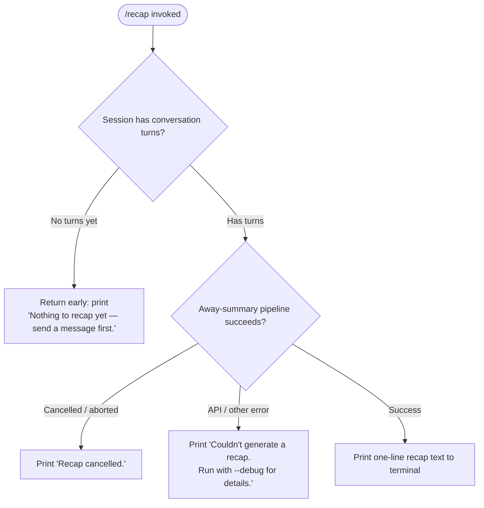

# `/recap`

> Analysis basis: CC v2.1.183 bundle.js (AST extraction + Claude interpretation)
> Minimum version: v2.1.183

---

## Overview

`/recap` triggers an immediate, on-demand generation of a one-line session summary (the "away summary") for the current Claude Code session. It invokes the same away-summary pipeline used for automatic session recaps, but forces it to run right now rather than waiting for a natural trigger. The result is printed as a single line of text to the terminal.

---

## Registration

| Field | Value |
|---|---|
| type | `local` |
| name | `recap` |
| description | `Generate a one-line session recap now` |
| loc_byte | `13234729` |
| loc_byte_end | `13234945` |
| loc_line | `8702` |
| supportsNonInteractive | `false` |
| thinClientDispatch | `post-text` |
| load_inline | `true` |
| load_ident | `Omf` |
| arbor_handler.name | `Omf` |
| arbor_handler.fqn | `claude-2.1.183::Omf` |
| arbor_handler.kind | `AsyncFunction` |
| arbor_handler.resolution_path | `load_ident` (handler resolved via inline `Promise.resolve({call: Omf})`) |
| arbor_handler.n_hits | `0` |

Analysis basis: CC v2.1.183 bundle.js:+13234729

---

## Input Branching

The command itself takes no user-supplied arguments. All branching is determined by the internal state of the session at call time. Three clearly distinct outcomes are possible:



Analysis basis: CC v2.1.183 bundle.js:+13234479, +13234571, +13234629

---

## Behavioral Spec

### 1. Handler entry — `recapCommandHandler` (`Omf`)

The handler is registered as an async function loaded inline via `Promise.resolve({call: Omf})`.

```
async function recapCommandHandler(commandContext):
    # Check precondition: there must be at least one conversation turn
    if no conversation turns exist:
        display("Nothing to recap yet — send a message first.")
        return

    # Delegate to the away-summary runner
    result = await runAwaySummary(commandContext)

    match result.status:
        "ok":
            display(result.recapText)
        "cancelled" | "abort":
            display("Recap cancelled.")
        error / other:
            display("Couldn't generate a recap. Run with --debug for details.")
```

Analysis basis: CC v2.1.183 bundle.js:+13234337, +13234479, +13234571, +13234629

---

### 2. Away-summary runner — `awaySummaryRunner` (`F1t`)

This is the core pipeline shared with automatic recap generation. Key behaviors observed:

```
async function awaySummaryRunner(context):
    # Guard: require saved CacheSafeParams from a prior turn
    if no CacheSafeParams saved:
        log("[awaySummary] no CacheSafeParams saved, skipping")
        return {status: "no-turn"}

    # Set up an AbortController; listen for 'abort' on the context signal
    abortController = new AbortController()
    context.signal.addEventListener("abort", () => abortController.abort())

    # Build a lightweight, tool-free query context
    # (tools are explicitly disabled — "Away summary cannot use tools")
    queryParams = buildAwaySummaryQuery(context, {
        threadType: "away_summary",
        allowTools: false
    })

    # Execute the model query through the standard streaming pipeline
    outcome = await executeQuery(queryParams, abortController.signal)

    # Collect and return the text output
    return {status: "ok", recapText: outcome.text}
```

Analysis basis: CC v2.1.183 bundle.js:+7046871, +7046890, +7046950, +7047006, +7047198, +7047266

---

### 3. Model-name resolution — `resolveModelAlias` (`_s` via `js`)

Before the query is dispatched, the model name string is normalized through an alias resolver. The resolver applies `.trim()` and `.toLowerCase()` then maps well-known short aliases:

| Input alias | Resolved tier |
|---|---|
| `fable` | Fable 5 class |
| `opusplan` | Opus plan tier |
| `sonnet` | Sonnet class |
| `haiku` | Haiku class |
| `opus` | Opus class |
| `best` | Best available |
| `[1m]` | (internal 1-million-token flag) |

```
function resolveModelAlias(rawName):
    normalized = rawName.trim().toLowerCase()
    switch normalized:
        case "fable":   return fableModel
        case "sonnet":  return sonnetModel
        case "haiku":   return haikuModel
        case "opus":    return opusModel
        case "best":    return bestModel
        case "opusplan":return opusPlanModel
        default:        return applyRegexReplacement(normalized)
```

Analysis basis: CC v2.1.183 bundle.js:+2291812, +2291823, +2291889, +2291936, +2291951, +2291992, +2292031, +2292070, +2292104

---

### 4. Session-transcript logging — `transcriptLogger` (`n_c`)

The away-summary pipeline writes an entry to the on-disk transcript log so that the generated recap is persisted alongside the session history:

```
async function transcriptLogger(entry, logDir):
    dir  = path.dirname(logDir)
    size = Buffer.byteLength(entry)
    await ensureLogDir(dir)           # mkdir -p
    await fs.appendFile(logPath, entry)
    await rotateIfNeeded(logPath)     # rename / unlink old segments
    registerCleanupHandler()
```

Analysis basis: CC v2.1.183 bundle.js:+213192, +213217, +213255, +213345, +213394, +213400, +213433, +213459

---

### 5. Main query executor — `mainQueryExecutor` (`R3p`)

The streaming query loop that powers the away summary is the same general-purpose agent loop used for all model calls. When invoked for `/recap`, key constraints are enforced:

- **No tools are registered** for the away-summary turn (`Oe.addTool` is not called; tools are filtered out).
- The thread type is tagged `"away_summary"` (Analysis basis: CC v2.1.183 bundle.js:+7047266).
- The call flows through the standard streaming pipeline: `query_api_streaming_start` → token accumulation → `query_api_streaming_end`.
- Autocompact and fallback logic (refusal fallback, model fallback) are present in the shared executor but are not expected to trigger for this lightweight single-turn call.

Analysis basis: CC v2.1.183 bundle.js:+10789409, +10790447, +10798827

---

### 6. Fork-agent sub-executor — `forkAgentQueryRunner` (`Y3p`)

For the away-summary turn, the query may be issued through a forked-agent path (`Y3p`) which runs in an isolated turn context. The forked agent inherits the conversation state but operates without interactive tool permissions.

```
async function forkAgentQueryRunner(params):
    emit telemetry("tengu_fork_agent_query")
    response = await runQuery(params)
    if defaultTurnsExceeded:
        emit telemetry("tengu_forked_agent_default_turns_exceeded")
    return formatOutput(response)
```

Analysis basis: CC v2.1.183 bundle.js:+10851831, +10852180, +10852182

---

## State & Side Effects

| Item | Detail |
|---|---|
| Telemetry (in-scope query pipeline) | `tengu_auto_compact_rapid_refill_breaker`, `tengu_auto_compact_succeeded`, `tengu_ptl_surfaced_to_user`, `tengu_refusal_fallback_suppressed`, `tengu_rotunda_pennant_applied`, `tengu_rotunda_pennant_tools`, `tengu_refusal_fallback_dialog_suppressed`, `tengu_refusal_fallback_prompt_shown`, `tengu_refusal_fallback_prompt_choice`, `tengu_fallback_credit_forfeited`, `tengu_refusal_fallback_triggered`, `tengu_orphaned_messages_tombstoned`, `tengu_refusal_fallback_supersedes`, `tengu_model_fallback_triggered`, `tengu_query_error`, `tengu_model_response_keyword_detected`, `tengu_malformed_tool_use_retry_outcome`, `tengu_malformed_tool_use_response`, `tengu_stop_hook_block_count`, `tengu_mcp_tool_result_ended_turn`, `tengu_loop_dynamic_wakeup_ends_turn`, `tengu_post_autocompact_turn`, `tengu_query_before_attachments`, `tengu_query_after_attachments`, `tengu_mcp_tools_refreshed_mid_turn` |
| Telemetry (fork-agent / feature) | `tengu_fork_agent_query`, `tengu_forked_agent_default_turns_exceeded`, `tengu_feature_ok`, `tengu_feature_bad` |
| Telemetry (background / daemon) | `tengu_bg_dispatch_sigkill_escalate`, `tengu_scheduled_task_missed`, `tengu_bg_low_mem_mb`, `tengu_bg_dispatch_low_mem`, `tengu_bg_spare_enable`, `tengu_bg_sendclaim_failed`, `tengu_bg_spare_claim`, `tengu_bg_spare_claim_fail`, `tengu_bg_proto_mismatch`, `tengu_bg_dispatch_stale_drop`, `tengu_bg_attach_legacy_autorespawn`, `tengu_bg_attach`, `tengu_bg_attach_stall_gave_up`, `tengu_bg_attach_stall_respawn`, `tengu_bg_attach_kick` |
| Transcript log write | Appends recap result to session transcript file on disk via `fs.appendFile`; rotates log if size limit is reached (Analysis basis: CC v2.1.183 bundle.js:+213005) |
| AbortController | Registers an `"abort"` listener on the command context's signal; forwards abort to the inner query (Analysis basis: CC v2.1.183 bundle.js:+7046987, +7047006, +7047018) |
| Tools | Explicitly **disabled** for this turn: `"Away summary cannot use tools"` (Analysis basis: CC v2.1.183 bundle.js:+7047198) |
| appState changes | The away-summary runner reads appState (`e.getAppState`) and may write back via `e.setAppState` after the turn completes (Analysis basis: CC v2.1.183 bundle.js:+10847048, +10848212) |
| Sound | <!-- TODO: not found in depth-2 traversal; needs --depth 4 --> |
| thinClientDispatch | `post-text` — output is posted as plain text in thin-client mode |
| supportsNonInteractive | `false` — command cannot run in non-interactive (headless) mode |

---

## Version History

| Version | Change |
|---|---|
| v2.1.183 | Initial analysis |

---

## Common Mistakes

1. **Running `/recap` before any conversation turn.** The guard check fires immediately and prints `"Nothing to recap yet — send a message first."` — no model call is made. Users expecting a recap of an empty session will receive this message and must send at least one message first.

2. **Expecting tool use within the recap.** The away-summary pipeline explicitly disallows tools. Any assumption that `/recap` will execute file reads or shell commands to gather context is incorrect; it works solely from the cached conversation transcript.

3. **Running in non-interactive mode.** `supportsNonInteractive: false` means invoking `/recap` from a script or CI pipeline will not function as intended. Use the programmatic API or a different summarization approach in headless contexts.

4. **Interpreting a failure message as a crash.** The output `"Couldn't generate a recap. Run with --debug for details."` is a handled error path, not an unhandled exception. Re-run with `--debug` to inspect the underlying API or parsing error.

5. **Assuming the recap is a multi-line summary.** The command description ("Generate a **one-line** session recap") is literal; the model is prompted to produce a single-line output. Multi-line summaries are not the intended contract of this command.

---

## Appendix — Identifier Mapping

> For bundle debugging only. Identifiers change across versions.

| Identifier | Role |
|---|---|
| `Omf` | `recapCommandHandler` — top-level async handler for `/recap`; Arbor-resolved entry point |
| `F1t` | `awaySummaryRunner` — orchestrates the away-summary pipeline; checks CacheSafeParams, sets up abort, delegates to query |
| `tle` | `awaySummaryQueryBuilder` — constructs the lightweight query parameters for the away-summary turn |
| `js` | `modelNameNormalizer` — normalizes model name strings before dispatch |
| `jK` | `modelNameParseHelper` — helper used by model name normalization |
| `_s` | `modelAliasResolver` — resolves short model alias strings (fable, sonnet, haiku, opus, best, opusplan) to canonical model identifiers |
| `Pg` | `modelStringProcessor` — applies additional string processing to the resolved model name |
| `T` | `transcriptEntryFormatter` — formats a conversation entry for transcript writing |
| `QHc` | `conversationHistoryAccessor` — reads conversation history entries |
| `j2o` | `historyEntryHelper` — helper for history entry access |
| `Pe` | `jsonStringifyWrapper` — wraps `JSON.stringify` for serialization |
| `Kc` | `modelStringCanonicalizer` — applies regex replacements and slicing to canonicalize model strings |
| `g9o` | `modelMapEnumerator` — maps over a model registry array |
| `Hqe` | `transcriptWriteDispatcher` — dispatches transcript writes via a streaming writer |
| `s9o` | `streamWriter` — low-level `e.write` wrapper for stream output |
| `n_c` | `transcriptLogger` — manages on-disk transcript append, rotation, and cleanup registration |
| `YWe` | `logBatcher` — batches log entries with `setTimeout`/`setImmediate` for coalesced writes |
| `rpe` | `logRotator` — handles transcript file rotation (join, rename, unlink) |
| `Pre` | `logErrorHandler` — handles EISDIR and related filesystem errors during log writes |
| `y9o` | `logPathBuilder` — constructs log file paths via `path.join` |
| `csr` | `logSegmentRotator` — stats, renames, and unlinks `.txt` log segments when size threshold is reached |
| `t_c` | `logAppendWorker` — bound worker that performs `mkdir`, `appendFile`, rotation, and byte-length checks |
| `qi` | `cleanupRegistrar` — registers cleanup handlers via `B2o.register` |
| `Jx` | `sessionQueryOrchestrator` — outer orchestrator that calls `Date.now`, dispatches to `v2n`, manages forked agents, and handles post-query bookkeeping |
| `v2n` | `streamingQueryDispatcher` — reads/writes appState, resolves UUIDs, and drives the streaming model call |
| `rN` | `appStateReader` — reads current app state |
| `QAe` | `appStateLoadDump` — loads and dumps app state snapshots |
| `nwe` | `queryContextBuilder` — builds the per-query context object |
| `ZQi` | `queryParamsMerger` — merges query parameters before dispatch |
| `S6n` | `queryStreamSetup` — sets up the streaming connection parameters |
| `fR` | `requestIdGenerator` — generates hex request IDs using `crypto.randomBytes` (63 bytes, 8-char output) |
| `w2n` | `queryWrapperHelper` — wraps the query for streaming dispatch |
| `bce` | `postQueryProcessor` — processes results after the streaming query completes |
| `Au` | `cleanupCoordinator` — coordinates post-query cleanup via `qi` |
| `Y6e` | `messageFilterer` — filters, counts, and processes messages from the streaming response |
| `v6` | `agentSessionManager` — manages agent session lifecycle (ready/subagent_exit transitions) |
| `R3p` | `mainQueryExecutor` — large stateful function implementing the full agentic query loop (tool dispatch, compaction, fallback, streaming) |
| `x5n` | `agentSessionCleaner` — cleans up session maps (`$6`, `DAo`, `h4t`, `MAo`) on exit |
| `ke` | `featureOkReporter` — emits `tengu_feature_ok` telemetry |
| `Re` | `featureBadReporter` — emits `tengu_feature_bad` telemetry |
| `B0` | `queryLoopController` — controls iteration of the agentic query loop |
| `D4e` | `toolUseSummaryChecker` — checks `J_p` set for tool-use summary presence |
| `ine` | `interruptChecker` — checks for user-initiated interrupt during query |
| `I6n` | `queryIterationAdvancer` — advances the query loop iteration counter |
| `HRa` | `postTurnSummaryHandler` — handles post-turn summary dispatch |
| `f` | `backgroundSessionDispatcher` — dispatches background session operations (spawn, kill, memory check, retire) |
| `j` | `loggerOrEventEmitter` — general-purpose logger / event emitter used throughout |
| `M` | `scheduledTaskRunner` — runs scheduled tasks with deduplication, tracking, and `Jnc`/`fae` callbacks |
| `Bn` | `retryWithTimeout` — implements retry logic with `setTimeout`/`clearTimeout` and unref |
| `YKn` | `macosMemoryReporter` — reads macOS free memory and emits `tengu_bg_low_mem_mb` |
| `B$e` | `cacheFileManager` — lstats, reads, filters, and removes cache files |
| `De` | `errorLogger` — logs errors via `QJ.logError`, handles `EISDIR`/`ra`/`Bzc` paths |
| `$` | `settledRetirer` — retires settled promises (`zlt`, `R6`) |
| `ct` | `connectionTracker` — tracks connections via `pIe`, `Cxt`, `u8` sets/maps |
| `NNo` | `daemonConnector` — connects to the daemon socket, handles auth, ping, and kill messages |
| `jNo` | `jobLifecycleManager` — manages full job lifecycle: claim, run, status updates, cleanup, roster |
| `s` | `jobLifecycleManagerAlias` — alias/partial for `jNo` in the background dispatch path |
| `p` | `forcedShutdownHandler` — calls `process.exit` after `WT` and `u.abort` on forced shutdown |
| `dn` | `daemonPathResolver` — resolves daemon socket path |
| `Ue` | `ogtWrapper` — wraps `ogt` utility (terminal/output helper) |
| `cce` | `activeSessionCollector` — collects active session entries filtering via sets |
| `wb` | `sessionRegistryReader` — reads the session registry |
| `d_p` | `sessionFinder` — finds a session entry by predicate |
| `Y3p` | `forkAgentQueryRunner` — runs a forked agent query with turn-count tracking and telemetry |
| `Ur` | `outputFormatter` — formats output using `ey`/`Qe` helpers; handles `nonconforming` case |
| `Pn` | `outputStreamManager` — manages a UUID-keyed output stream, buffers, and subarray operations |
| `g` | `outputBufferProcessor` — processes output buffer chunks using `Buffer.concat` and `indexOf` |
| `h` | `socketTimeoutManager` — manages socket `setTimeout` for connection keepalive |
| `m` | `sessionKillManager` — iterates `n.values()` and sends `k.kill()` to terminate sessions |
| `Qp` | `streamEndHandler` — calls `e.end()` and `Pe` (JSON serializer) to finalize stream |
| `T6f` | `daemonProtocolHandler` — large handler implementing the full daemon IPC protocol (ping, nudge, yield, lease, dispatch, reply, attach, resize, snapshot, subscribe, etc.) |
| `Ee` | `stringCoercer` — wraps `String()` for type coercion |
| `Aaa` | `commandResultFlattener` — flattens command results via `e.flatMap` |

---

Note: index built via Arbor fallback; some signals (telemetry, literals) may be missing — see arbor-fallback.js.