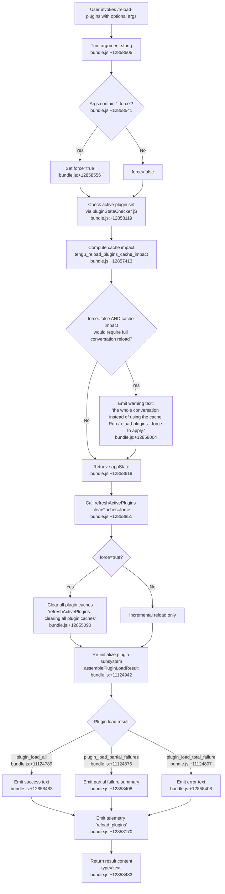

# `/reload-plugins`

> Analysis basis: CC v2.1.183 bundle.js (AST extraction + Claude interpretation)
> Minimum version: v2.1.183

---

## Overview

The `/reload-plugins` command hot-reloads all plugin extensions (skill plugins, agent plugins, and plugin MCP servers) within the current session without requiring a full session restart. It inspects the argument string for a `--force` flag, calculates cache impact, and then orchestrates a coordinated teardown and re-initialization of the active plugin subsystem, optionally clearing all plugin caches when forced.

---

## Registration

| Field | Value |
|---|---|
| type | `local` |
| name | `reload-plugins` |
| description | `Activate pending plugin changes in the current session` |
| argumentHint | `[--force]` |
| supportsNonInteractive | `false` |
| thinClientDispatch | `control-request` |
| module_id | `Zvl` |
| load_inline | `true` |
| loc_byte | `12859421` |
| loc_byte_end | `12859665` |
| loc_line | `8535` |
| arbor_handler.name | `glf` |
| arbor_handler.fqn | `claude-2.1.183::glf` |
| arbor_handler.kind | `AsyncFunction` |
| arbor_handler.resolution_path | `module_id` |
| arbor_handler.n_hits | `0` |

Analysis basis: CC v2.1.183 bundle.js:+12859421

---

## Input Branching

The command handler has 4+ distinct branches based on the presence of `--force`, cache impact assessment, plugin type classification, and error state during reload. A Mermaid flowchart is used.



---

## Behavioral Spec

### 1. Handler Entry — `reloadPluginsHandler` (`glf`)

The Arbor-resolved handler is `glf` (AsyncFunction, `claude-2.1.183::glf`, reached via `module_id` → `Zvl`).

```
async function reloadPluginsHandler(context):
    rawArg = context.args          # full argument string
    trimmedArg = rawArg.trim()     # bundle.js:+12858505
    isForced = trimmedArg.includes("--force")  # bundle.js:+12858541

    pluginState = checkPluginState(context)    # jS → dd → aPe; bundle.js:+12858119
    currentConfig = loadMcpConfig(context)     # dd; bundle.js:+12858137
    mcpServerList = listMcpServers(context)    # LX → Tn; bundle.js:+12858215

    cacheImpact = computeCacheImpact(pluginState, isForced)
    # fires tengu_reload_plugins_cache_impact; bundle.js:+12857413

    appState = context.getAppState()           # bundle.js:+12858619

    result = await refreshActivePlugins(appState, isForced)  # I_e; bundle.js:+12858851

    outputLines = buildResultSummary(result, isForced)  # jie; bundle.js:+12858926

    return { type: "text", content: outputLines }  # bundle.js:+12858483
```

Analysis basis: CC v2.1.183 bundle.js:+12858119

---

### 2. Force-Flag Parse and Cache Impact Check (`cacheImpactChecker`, `Jvl` → `Qvl`)

```
function computeCacheImpact(pluginState, isForced):
    pluginSet = pluginState.activePlugins    # Jvl; bundle.js:+12858573
    hasCachedState = pluginSet.has(...)     # bundle.js:+12857187
    serverHasCached = serverRegistry.has(...) # bundle.js:+12857226

    if not isForced and hasCachedState:
        warnUser("the whole conversation instead of using the cache. "
                 "Run /reload-plugins --force to apply.")  # bundle.js:+12858004
        # note: warning is advisory; reload still proceeds

    cacheImpactScore = estimateCacheImpact(pluginSet)  # Qvl → j; bundle.js:+12858725
    emit telemetry "tengu_reload_plugins_cache_impact" with score  # bundle.js:+12857413

    return cacheImpactScore
```

Analysis basis: CC v2.1.183 bundle.js:+12857413

---

### 3. Active Plugin Refresh (`refreshActivePlugins`, `I_e`)

This is the core reload orchestrator. It is called with a `clearCaches` boolean derived from the `--force` flag.

```
async function refreshActivePlugins(appState, clearCaches):
    if clearCaches:
        log("refreshActivePlugins: clearing all plugin caches")  # bundle.js:+12855090
        clearPluginCacheSubsystem()   # Bh → A5 → s5t.clear; bundle.js:+11011210
        log("Cleared installed plugins cache")  # bundle.js:+11047919

    # Parallel reload of plugin subsystems
    [
        skillPluginResult,   # plugin type: "skill"; bundle.js:+12858266
        agentPluginResult,   # plugin type: "agent"; bundle.js:+12858294
        mcpPluginResult      # plugin type: "plugin MCP server"; bundle.js:+12858326
    ] = await Promise.all([
        loadPluginsByType("skill"),
        loadPluginsByType("agent"),
        loadMcpPluginServers("plugin MCP server")
    ])

    combinedResult = assemblePluginLoadResult(
        skillPluginResult, agentPluginResult, mcpPluginResult
    )
    # emits PF event; bundle.js:+12856197

    return combinedResult
```

Analysis basis: CC v2.1.183 bundle.js:+12855088

---

### 4. Plugin Load Assembly (`assemblePluginLoadResult`, `sHo`)

```
function assemblePluginLoadResult(skillResult, agentResult, mcpResult):
    allResults = [skillResult, agentResult, mcpResult]

    # Check for stale early-kick (cwd changed mid-scan)
    if originalCwd != currentCwd:
        log("assemblePluginLoadResult: originalCwd changed mid-scan; "
            "skipping side-effects (stale early-kick)")  # bundle.js:+11124942
        return earlyKickResult

    # Classify load outcomes
    totalCount = countAll(allResults)             # "plugin_load_all"; bundle.js:+11124789
    failedEntries = collectFailures(allResults)

    if len(failedEntries) == totalCount:
        category = "plugin_load_total_failure"    # bundle.js:+11124807
    elif len(failedEntries) > 0:
        category = "plugin_load_partial_failures" # bundle.js:+11124876
    else:
        category = "plugin_load_all"

    return { category, total: totalCount, failed: failedEntries, separator: " · " }
    # separator literal; bundle.js:+12858353
```

Analysis basis: CC v2.1.183 bundle.js:+11124789

---

### 5. MCP Config Load (`loadMcpConfig`, `W7`)

Reads MCP configuration from the layered settings hierarchy (project → user → local → enterprise/policy). Each layer is tried in order. Relevant source scopes and lookup keys:

| Scope constant | Literal value | loc_byte |
|---|---|---|
| projectSettings | `"projectSettings"` | 6561768 |
| userSettings | `"userSettings"` | 6561791 |
| localSettings | `"localSettings"` | 6561812 |
| policySettings | `"policySettings"` | 3393976 |
| Config file name | `".mcp.json"` | 6562028 |

```
async function loadMcpConfig(context):
    configLayers = [
        readMcpLayer("project", ".mcp.json"),   # bundle.js:+6562028
        readMcpLayer("user"),
        readMcpLayer("local"),
        readMcpLayer("enterprise")
    ]
    merged = mergeConfigLayers(configLayers)
    serverEntries = Object.entries(merged.mcpServers)
    return validateMcpEntries(serverEntries)   # Nhn; bundle.js:+6563895
```

Analysis basis: CC v2.1.183 bundle.js:+6561719

---

### 6. MCP Server Connection Refresh (`reloadMcpConnections`, `wKr` → `sHo` / `oHo`)

```
async function reloadMcpConnections(serverList):
    # Teardown phase
    activeConnections = getActiveConnections()   # oHo; bundle.js:+11123476
    for conn in activeConnections:
        await teardownConnection(conn)

    # Re-init phase: parallel with Promise.allSettled
    results = await Promise.allSettled(
        serverList.map(server => connectMcpServer(server))  # sHo; bundle.js:+11124049
    )

    # Process results
    for result in results:
        if result.status == "fulfilled":   # bundle.js:+11105782
            registerServer(result.value)
        elif result.status == "rejected":  # bundle.js:+11105838
            classifyFailure(result.reason) # categories: "generic-error", etc.

    return buildConnectionSummary(results)
```

Failure categories observed in literals:
- `"marketplace-blocked-by-policy"` (bundle.js:+11104474)
- `"marketplace-not-found"` (bundle.js:+11105027)
- `"marketplace-load-failed"` (bundle.js:+11105219)
- `"cache-miss"` (bundle.js:+11105275)
- `"plugin-not-found"` (bundle.js:+11105313)
- `"generic-error"` (bundle.js:+11105954)
- `"ineffective-disable"` (bundle.js:+11124674)

Analysis basis: CC v2.1.183 bundle.js:+11123468

---

### 7. Result Summary Builder (`buildResultSummary`, `jie`)

```
function buildResultSummary(loadResult, isForced):
    lines = []
    for entry in loadResult.entries:
        pluginName = formatPluginName(entry)   # gs; bundle.js:+4340677
        statusParts = [pluginName]
        if entry.error:
            statusParts.append("error: " + entry.error)  # bundle.js:+12858408
        lines.append(statusParts.join(", "))
    return lines.join("\n")
```

The separator `" · "` (bundle.js:+12858353) is used between status segments. Output type is always `"text"` (bundle.js:+12858483).

Analysis basis: CC v2.1.183 bundle.js:+12858926

---

### 8. Safe Mode Guard (`lhe`)

If Claude Code is started with `--safe-mode`, plugin hook registration is skipped:

```
function registerPluginHooks(hooks):
    if safeMode:
        log("Safe mode: skipping plugin hook registration")  # bundle.js:+5208499
        return
    registerAll(hooks)
```

Analysis basis: CC v2.1.183 bundle.js:+5208491

---

## State & Side Effects

| Item | Detail |
|---|---|
| Telemetry — `tengu_reload_plugins_cache_impact` | Fired during cache impact estimation; bundle.js:+12857413 |
| Telemetry — `tengu_feature_ok` | Fired on successful feature gate check; bundle.js:+1021887 |
| Telemetry — `tengu_feature_bad` | Fired on failed feature gate check; bundle.js:+1021954 |
| Telemetry — `tengu_feature_sad` | Fired on sad-path feature check; bundle.js:+1022035 |
| Telemetry — `tengu_plugin_state_file_error` | Fired if plugin state file cannot be read; bundle.js:+11048098 |
| Telemetry — `tengu_mcp_list_changed` | Fired when MCP server list changes after reload; bundle.js:+17035866 |
| Telemetry — `tengu_mcp_auth_config_clear` | May fire if MCP auth config is cleared during reload; bundle.js:+11967787 |
| Plugin cache cleared | When `--force` is used, `s5t.clear()` clears the installed-plugins cache; bundle.js:+10980079 |
| appState mutation | `getAppState()` is called; plugin registry within appState is updated with new plugin set; bundle.js:+12858619 |
| PF event emitted | Internal event bus (`PF.emit`) fires after refresh completes; bundle.js:+12856197 |
| Hook registration | Plugin hooks are re-registered after load (skipped in `--safe-mode`); bundle.js:+5208499 |
| Sound | None observed in call graph |
| thinClientDispatch | `"control-request"` — command is forwarded to the controlling daemon in thin-client mode; bundle.js:+12859421 |
| MCP server reconnection | `wra` (MCP connection manager) re-negotiates connections, including `c.connect`, `c.getServerCapabilities`, `c.getInstructions`; fires `tengu_mcp_sdk_connect` / `tengu_mcp_sdk_connect_failed`; bundle.js:+6848621 |
| LSP extension conflict detection | `g0n` checks for conflicting LSP extensions across plugin set; bundle.js:+6885638 |

---

## Version History

| Version | Change |
|---|---|
| v2.1.183 | Initial analysis |

---

## Common Mistakes

1. **Omitting `--force` when caches are stale.** Without `--force`, the handler will warn that a full conversation reload would be needed to propagate certain cache-backed plugin changes. The reload still proceeds, but cached state is not purged. Use `/reload-plugins --force` to guarantee a clean slate.
2. **Expecting non-interactive support.** The `supportsNonInteractive` field is `false` (bundle.js:+12859421). Invoking this command in a non-interactive pipeline or scripted context will not work as expected.
3. **Assuming instant MCP reconnection.** MCP server connections are re-established with `Promise.allSettled`, meaning partial failures are silently collected rather than aborting the entire reload. Check the returned text output for `"error"` segments to detect partial failures.
4. **Running in `--safe-mode`.** Plugin hook registration is suppressed in safe mode (bundle.js:+5208499). The command will still run but hooks will not be re-registered.
5. **Confusing plugin types.** The command reloads three distinct plugin classes — `"skill"`, `"agent"`, and `"plugin MCP server"` (bundle.js:+12858266–12858326). Errors in one class do not prevent reload of the others (partial-failure path).

---

## Appendix — Identifier Mapping

> For bundle debugging only. Identifiers change across versions.

| Identifier | Role |
|---|---|
| `glf` | Main handler (`reloadPluginsHandler`), AsyncFunction, entry point for `/reload-plugins` |
| `jS` | Plugin state checker (reads current active plugin state) |
| `dd` | MCP config loader (shared utility) |
| `aPe` | Config access helper called by plugin state checker |
| `LX` | MCP server list enumerator |
| `Tn` | Server list data accessor |
| `Jvl` | Cache impact computation orchestrator |
| `CKr` | MCP connection refresh coordinator |
| `eEe` | Helper called at start of MCP refresh |
| `wKr` | MCP reload sub-orchestrator |
| `sHo` | Plugin load result assembler (`assemblePluginLoadResult`) |
| `oHo` | MCP connection teardown / re-init manager |
| `W7` | MCP config multi-layer reader |
| `hc` | Config read utility |
| `Hb` | Settings file locator (walks project/user/local/enterprise layers) |
| `Dee` | Config entry downloader/validator |
| `iE` | Policy settings filter |
| `Nhn` | MCP entry validator |
| `DLn` | MCP config diff/merge utility |
| `SQi` | Connection state tracker (Map-based) |
| `Qvl` | Cache impact estimator (calls `j`) |
| `Hlf` | Result string splitter |
| `I_e` | `refreshActivePlugins` core implementation |
| `Bh` | Plugin subsystem initializer |
| `f5p` | Plugin loader factory |
| `aw` | Plugin activation helper |
| `AM` | Skill index cache manager |
| `Y5` | Skill index cache clearer |
| `A5` | Plugin cache clear entry point (`s5t.clear`) |
| `s_e` | Plugin state file reader/writer |
| `NM` | Known-marketplace registry loader |
| `Im` | Marketplace index file reader |
| `V6` | Plugin marketplace.json reader |
| `$k` | Plugin config reader (combines `qgo`, `Im`) |
| `qgo` | Plugin config read+resolve |
| `I5t` | Plugin load orchestrator (large central function) |
| `xee` | Plugin directory scanner (`.mcpb`, `.dxt` formats) |
| `fKr` | Plugin manifest reader (reads `manifest.json`, `utf-8`) |
| `oOt` | Plugin archive extractor / cache manager |
| `iQi` | Plugin entry classifier |
| `o3e` | LSP plugin config reader (`.lsp.json`) |
| `J5d` | LSP plugin sub-file loader |
| `g0n` | LSP extension conflict detector |
| `n3e` | MCP server connector (per-entry) |
| `uZn` | MCP connection result applier |
| `B1o` | MCP server update batch applier |
| `wra` | MCP SDK connection manager (`c.connect`, `c.getServerCapabilities`, etc.) |
| `Alf` | LSP manager plugin filter |
| `hlf` | Plugin filter (secondary) |
| `lhe` | Hook registration entry (safe-mode guarded) |
| `Ae` | MCP reconnection batch processor |
| `xr` | MCP cleanup tracker |
| `le` | Plugin state Map accessor |
| `fOt` | OAuth token revocation handler (MCP auth) |
| `fw` | MCP connection cleanup |
| `T` | Shared logging/tracing utility (used throughout) |
| `jie` | Result summary builder (`buildResultSummary`) |
| `gs` | Scope classifier (parses scope strings like `"managed"`) |
| `hP` | Tool-search / context-token helper |
| `MMt` | Token budget parser |
| `lGr` | `auto:` token budget resolver |
| `co` | Settings write/persist utility |
| `se` | Main session orchestrator (called by plugin reload for session-state refresh) |
| `ece` | Session reload handler |
| `I4e` | Teammate mailbox / session message marker |
| `T6f` | Daemon protocol frame handler |
| `Tpt` | Plugin installation worker |
| `T5t` | Plugin fetch/unpack orchestrator |
| `LGn` | Git-source plugin resolver |
| `Jgo` | Plugin git-subdir resolver |
| `S5t` | Plugin source normalizer |
| `mGn` | npm/package plugin build helper |
| `zgo` | Plugin slot updater |
| `W` | Scheduled-task / daemon worker manager |
| `M` | Daemon job manager |
| `Dtt` | Daemon config file reader |
| `CMt` | Daemon config file writer |
| `HDt` | Semver range validator |
| `sTn` | Semver satisfies checker |
| `nDi` | Dependency resolution checker |
| `vGn` | Plugin version checker |
| `wGn` | Plugin source replacer |
| `UN` | Plugin binary path resolver |
| `IGn` | Plugin install dir scanner |
| `eue` | Plugin content hasher |
| `Ftt` | Plugin install timing cache |
| `Ye` | Tool/plugin list renderer |
| `Ite` | Tool list classifier |
| `sje` | Tool sort comparator |
| `He` | Plugin variable expander (`${CLAUDE_PROJECT_DIR}`, etc.) |
| `The` | Plugin variable substitution helper |
| `me` | MCP tools/list change handler |
| `ee` | MCP update applicator |
| `ge` | Plugin tool list builder |
| `plc` | CCD session plugin filter |
| `Z_l` | MCP log entry formatter |
| `$Bi` | VS Code extension gate checker |
| `FCn` | Feature flag resolver |
| `Ru` | OTEL metrics attribute builder |
| `V$e` | OTEL resource attribute populator |
| `se` | Main session state machine |
| `ro` | Module interop bootstrapper |
| `Pe` | JSON stringify wrapper |
| `Gt` | JSON parse wrapper |
| `Mn` | Error classifier |
| `Ee` | String coercer |
| `st` | Boolean string parser (`"yes"`/`"on"`/`"no"`/`"off"`) |
| `Hl` | String type helper |
| `wr` | Provider type resolver (`"bedrock"`, `"vertex"`, etc.) |
| `Mu` | Credential chain builder |
| `ry` | Output token counter |
| `ci` | AsyncLocalStorage store accessor |
| `k0l` | Daemon status file writer |
| `Mjt` | Daemon status path builder |
| `CQ` | Async context helper |
| `Ar` | Log/trace emit helper |
| `gx` | Core logging sink |