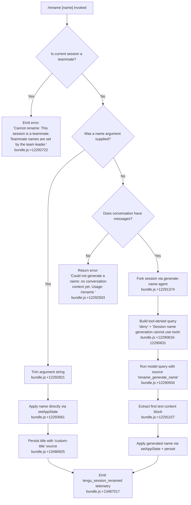

# `/rename`

> Analysis basis: CC v2.1.183 bundle.js (AST extraction + Claude interpretation)
> Minimum version: v2.1.183

---

## Overview

The `/rename` command sets or auto-generates a display name for the current conversation session. When called with an explicit `[name]` argument it applies that string immediately; when called without an argument it invokes the model to synthesize a short name from the conversation history. The alias `/name` is also registered and behaves identically.

---

## Registration

| Field | Value |
|---|---|
| type | `local-jsx` |
| name | `rename` |
| description | `Rename the current conversation` |
| argumentHint | `[name]` |
| immediate | `true` |
| aliases | `["name"]` |
| module_id | `Bgl` |
| load_inline | `true` |
| loc_byte | `12293558` |
| loc_byte_end | `12293757` |
| loc_line | `7957` |
| arbor_handler.name | `GZp` |
| arbor_handler.fqn | `claude-2.1.183::GZp` |
| arbor_handler.kind | `AsyncFunction` |
| arbor_handler.resolution_path | `module_id` |
| arbor_handler.n_hits | `0` |

Analysis basis: CC v2.1.183 bundle.js:+12293558

---

## Input Branching

There are four distinct execution paths determined by session state and whether a name argument was provided. A Mermaid flowchart is used.



---

## Behavioral Spec

### Top-level handler (GZp)

The async function `GZp` is the command's entry point, resolved via the `module_id` path by Arbor. It dispatches to the argument-present branch or the no-argument branch.

Analysis basis: CC v2.1.183 bundle.js:+12293254

```
async function handleRenameCommand(context, args):
    if isTeammateSession(context):
        displayError("Cannot rename: This session is a teammate. ...")
        return

    if args is provided and non-empty:
        applyExplicitRename(context, args.trim())
    else:
        await generateAndApplyName(context)
```

### Teammate guard (KWn)

Checks whether the active session is a "teammate" (a subordinate session in a multi-agent team). When true, the command terminates immediately with a hard-coded error message.

Analysis basis: CC v2.1.183 bundle.js:+12292702

```
function checkTeammateGuard(sessionState):
    store = getAsyncStore()      // via em → Rx → Xvr.getStore
    if store.isTeammate:
        return ERROR("Cannot rename: This session is a teammate. ...")
    return OK
```

### Explicit rename path (VWn → applyExplicitRename)

When the user supplies a literal name, the implementation:
1. Sanitizes the input via an HTML-entity replacement helper (`XGn`, which replaces `&`, `<`, `>`, `&#13;`, `&#10;`). Analysis basis: CC v2.1.183 bundle.js:+12292570
2. Trims whitespace. Analysis basis: CC v2.1.183 bundle.js:+12292821
3. Calls `setAppState` to update the in-memory session title. Analysis basis: CC v2.1.183 bundle.js:+12293061
4. Persists to disk with source tag `"custom-title"` (via the logging/persistence layer `B6e → YK → _Ct`). Analysis basis: CC v2.1.183 bundle.js:+13486925
5. Emits `tengu_session_renamed` telemetry. Analysis basis: CC v2.1.183 bundle.js:+13487017

```
function applyExplicitRename(context, rawName):
    sanitized = htmlEntityReplace(rawName)    // XGn
    trimmed   = sanitized.trim()
    context.setAppState({ title: trimmed })
    persistTitle(trimmed, source="custom-title")
    emitTelemetry("tengu_session_renamed")
```

### Auto-generate name path (Uft → generateAndApplyName)

When no argument is given, the implementation:

1. **Context check**: Verifies that there is at least one conversation message. If not, returns the "no conversation context yet" message. Analysis basis: CC v2.1.183 bundle.js:+12292933
2. **Session fork**: Fires `tengu_rename_full_session_fork` telemetry and forks a lightweight sub-agent session (`$ho`). Analysis basis: CC v2.1.183 bundle.js:+12291374
3. **Tool restriction**: Constructs the sub-agent query with tool permission set to `"deny"` and an explicit reason string `"Session name generation cannot use tools"`. Analysis basis: CC v2.1.183 bundle.js:+12290816
4. **Query type**: Uses the `"rename_generate_name"` query source label. Analysis basis: CC v2.1.183 bundle.js:+12290934
5. **Result extraction**: Extracts the first `"text"` content block from the assistant response. Analysis basis: CC v2.1.183 bundle.js:+12291157
6. **Application**: Applies the result as the session name with source tag `"ai-title"`. Analysis basis: CC v2.1.183 bundle.js:+13487094
7. **Persistence**: Persists via the same title-write path used by the explicit rename.
8. **Telemetry**: Emits `tengu_session_renamed`.

```
async function generateAndApplyName(context):
    messages = getConversationMessages(context)

    if messages is empty:
        displayError("Could not generate a name: no conversation context yet. ...")
        return

    emitTelemetry("tengu_rename_full_session_fork")

    subAgentResult = await runSubAgentQuery(
        messages    = buildNameGenerationPrompt(messages),   // WWn
        toolPolicy  = "deny",
        querySource = "rename_generate_name",
        allowTools  = false
    )

    generatedName = extractFirstTextBlock(subAgentResult)   // content type "text"

    context.setAppState({ title: generatedName })
    persistTitle(generatedName, source="ai-title")
    emitTelemetry("tengu_session_renamed")
```

### HTML entity sanitizer (XGn)

A small utility called before any user-supplied name is stored. It performs `String.replaceAll` in sequence for the five HTML entities found in literals.

Analysis basis: CC v2.1.183 bundle.js:+13883924

```
function sanitizeNameHtml(input):
    s = input.replaceAll("&",    "&amp;")
    s = s.replaceAll("<",    "&lt;")
    s = s.replaceAll(">",    "&gt;")
    s = s.replaceAll("\r",   "&#13;")
    s = s.replaceAll("\n",   "&#10;")
    return s
```

Constants: `"&amp;"` (bundle.js:+13883941), `"&lt;"` (bundle.js:+13883965), `"&gt;"` (bundle.js:+13883988), `"&#13;"` (bundle.js:+13884012), `"&#10;"` (bundle.js:+13884036).

### Conversation history builder (WWn)

Assembles the message array forwarded to the name-generation sub-agent. It filters to only include non-meta messages of `origin: "human"` type, joins them, and applies a content-length limit via slicing. Analysis basis: CC v2.1.183 bundle.js:+12287824

```
function buildNameGenerationContext(messages):
    filtered = messages.filter(m => !m.isMeta)
    parts    = []
    for msg in filtered:
        if Array.isArray(msg.content):
            parts.push(msg.content.join(...))
        else:
            parts.push(msg.content)
    return parts.slice(0, CONTEXT_LIMIT)   // n.slice, bundle.js:+12288042
```

### Title persistence (B6e / YK / _Ct)

The title write path reads then rewrites the session's on-disk JSONL config file. It is called with either `"custom-title"` (user-supplied) or `"ai-title"` (model-generated) as a source discriminator. Analysis basis: CC v2.1.183 bundle.js:+13490435 / +13490504 / +2304832

```
async function persistTitle(title, source):
    configPath = deriveConfigPath()   // YK path helpers
    data = await readFile(configPath, "utf-8")
    parsed = JSON.parse(data)
    parsed.title  = title
    parsed.source = source           // "custom-title" or "ai-title"
    await writeFile(configPath, JSON.stringify(parsed))
    emitTelemetry("tengu_session_renamed")   // via B6.O8t.emit
```

---

## State & Side Effects

| Item | Detail |
|---|---|
| Telemetry: `tengu_rename_full_session_fork` | Fired when name auto-generation is triggered (no argument path). bundle.js:+12291374 |
| Telemetry: `tengu_session_renamed` | Fired after every successful rename (both explicit and auto-generated). bundle.js:+13487017 |
| Telemetry: `tengu_config_parse_error` | Fired if the on-disk session config file cannot be parsed during persistence. bundle.js:+13969320 |
| Telemetry: `tengu_agent_name_set` | Fired when an agent (sub-session) name is set via the agent-name path. bundle.js:+13490554 |
| appState changes | `setAppState({ title: <name> })` is called to update the live in-memory session title. bundle.js:+12293061 |
| Disk persistence | Rewrites the session's on-disk config via `VU.writeFile` / `_Ct`. Title source tagged as `"custom-title"` or `"ai-title"`. bundle.js:+2304832 / +13486925 / +13487094 |
| Sub-agent fork | When auto-generating, a forked sub-agent query is created with tool access denied. The query source is tagged `"rename_generate_name"`. bundle.js:+12290934 |
| Hook registration | None observed in depth-2 traversal |
| Sound | None observed in depth-2 traversal |
| `immediate: true` | Command executes without waiting for an ongoing assistant turn to finish |

---

## Version History

| Version | Change |
|---|---|
| v2.1.183 | Initial analysis |

---

## Common Mistakes

1. **Using `/rename` in a teammate session** — The command will be rejected with a hard-coded error. Only the team-leader session can set session names for teammates.
2. **Calling `/rename` with no argument before the first message** — The auto-generation path requires at least one conversation turn to exist; otherwise it returns the "no conversation context yet" error and does nothing.
3. **Including raw HTML or control characters in the name** — The sanitizer (`XGn`) will silently encode `&`, `<`, `>`, CR, and LF. The stored name will contain the escaped entities rather than the raw characters, which may not render as expected in all contexts.
4. **Assuming the alias `/name` behaves differently** — `/name` is a registered alias for `/rename` and is functionally identical.
5. **Expecting tool-use in generated names** — The auto-generation sub-agent is explicitly launched with tool access set to `"deny"`, so no MCP or built-in tools are available during name generation.

---

## Appendix — Identifier Mapping

> For bundle debugging only. Identifiers change across versions.

| Identifier | Role |
|---|---|
| `GZp` | Top-level async handler for `/rename` (arbor_handler) |
| `KWn` | Teammate guard + explicit-rename branch dispatcher |
| `VWn` | Explicit name application sub-routine |
| `XGn` | HTML entity sanitizer applied to user-supplied name |
| `Uft` | Auto-generate name orchestrator |
| `em` | Async-store accessor (reads current session context) |
| `Rx` | Inner store resolver (`Xvr.getStore` wrapper) |
| `$ho` | Sub-agent session fork for name generation |
| `BZp` | Model query executor for name generation sub-agent |
| `tle` | Conversation message assembler passed to sub-agent |
| `Jx` | Core query runner / streaming layer |
| `v2n` | App-state reader/writer used during query lifecycle |
| `WWn` | Conversation history builder (filters and slices messages) |
| `Aee` | Message filter helper inside history builder |
| `i$` | Tool schema / permission builder for sub-agent |
| `F6n` | Tool schema serializer |
| `LL` | Full API query normalizer (depth-2 heavy callee) |
| `BNl` | Core streaming API loop |
| `CC` | Context/config assembler for model queries |
| `UHe` | Session persistence orchestrator (read + write title) |
| `B6` | Title-write helper (calls `O8t.emit` after write) |
| `B6e` | Agent-name write helper (source `"agent-name"`) |
| `YK` | Async title file read/write wrapper (`_Ct` caller) |
| `_Ct` | Low-level JSONL config read-modify-write |
| `rne` | Alternate title-write path (source `"ai-title"`) |
| `$_e` | File append/mkdir helper used during persistence |
| `mq` | Config schema builder |
| `Au` | File-write audit logger |
| `FCe` | File-change event dispatcher |
| `fa` | File watcher / stat helper |
| `Ic` | Path resolution helper for session config |
| `wk` | Config path joiner |
| `Pp` | Atomic file writer (temp-rename pattern) |
| `vh` | Low-level atomic write (randomBytes temp name) |
| `mT` | Cache-invalidation helper on file delete |
| `LA` | Permission check before file write |
| `De` | Error logger for file write failures |
| `AT` | Basename resolver for session config filename |
| `njn` | App-state key enumerator |
| `ct` | Tool/config store accessor (shared across commands) |
| `OHn` | Store initializer with dedup guard |
| `RNr` | Store entry constructor |
| `$Nr` | Store registration finalizer |
| `Ct` | Config file watcher setup |
| `q_e` | Config file reader with migration logic |
| `Ebf` | File-watch event emitter |
| `T4` | Config schema validator |
| `I4` | Config field type coercer |
| `wxt` | Config field whitelist checker |
| `Lxt` | Config default applier |
| `js` | Model identifier resolver |
| `jK` | Model name normalizer |
| `_s` | Model string tokenizer/classifier |
| `Pg` | Model lookup helper |
| `Mgt` | Model metadata fetcher |
| `Pn` | IPC/pipe channel builder |
| `g` | Buffer-concat stream reader |
| `h` | Stream timeout wrapper |
| `Fs` | Fatal-error reporter (`process.exit`) |
| `$gl` | Whitespace normalizer for display strings |
| `U2` | String trim utility |
| `Ee` | String coercion utility (`String(...)`) |
| `wr` | Provider-type resolver |
| `st` | String formatter utility |
| `Mu` | Region/endpoint resolver |
| `Gvr` | Managed-key prefix checker |
| `Tfe` | Token/credential formatter |
| `Am` | React-style UI atom accessor |
| `Lt` | Ink/React render helper |
| `Cc` | Message content filter |
| `R1` | Request cancellation token |
| `Hx` | Hash utility |
| `gx` | Base hash primitive |
| `eO` | Output encoding selector |
| `Gm` | Formatted output builder |
| `p2` | Padding/alignment helper |
| `Ar` | Argument serializer |
| `tD` | Structured log entry builder |
| `mq` | Config schema compiler |
| `Ho` | Error-to-string converter |
| `ra` | Error categorizer |
| `Bzc` | Error queue (shift/push ring buffer) |
| `bE` | Background event emitter |
| `$ce` | Promise adapter for sync config |
| `Bce` | Config change broadcaster |
| `dd` | Debug-mode flag reader |
| `aPe` | Debug predicate |
| `DC` | Display config accessor |
| `ogt` | Output renderer primitive |
| `fR` | Filesystem path sanitizer / random-hex generator |
| `bce` | Conversation-branch context builder |
| `T` | Text content formatter / truncator |
| `v6` | Sub-agent lifecycle tracker |
| `B0` | Cancellation-signal builder |
| `D4e` | Message-type membership checker |
| `ine` | Inline content extractor |
| `I6n` | Iteration counter |
| `HRa` | Deferred-tool type checker |
| `f` | Process/job manager |
| `cce` | Content-block collector / deduplicator |
| `j` | JSON serializer utility |
| `Y3p` | Sub-agent result finalizer |
| `w2n` | Watermark / turn-count helper |
| `FCe` | <!-- duplicate row; see file-change dispatcher above --> |
| `njn` | App-state key lister |
| `Szr` | MCP server config normalizer |
| `l` | Lazy-init wrapper |
| `k0l` | Connection-quality monitor |
| `B1o` | MCP server-pool synchronizer |
| `jLn` | MCP server permission checker |
| `Bn` | Retry-with-timeout utility |
| `hot` | MCP server health checker |
| `uZn` | MCP connection result applier |
| `t3e` | MCP reconnect scheduler |
| `fw` | MCP cleanup orchestrator |
| `mta` | MCP metrics aggregator |
| `n3e` | MCP server initializer |
| `dW` | MCP transport builder |
| `Nk` | MCP auth handler |
| `pra` | MCP connection attempt runner |
| `Ohn` | MCP connection health poller |
| `Mhn` | MCP diagnostic collector |
| `on` | MCP debug logger |
| `oxn` | MCP error classifier |
| `Sra` | MCP reconnect policy evaluator |
| `OKr` | MCP error emitter |
| `Cu` | MCP error logger |
| `gra` | MCP stats aggregator |
| `Hot` | MCP port parser |
| `p0n` | MCP timeout parser |
| `yKr` | MCP capability filter |
| `GZp` | <!-- canonical entry; see top row --> |

---

Note: index built via Arbor fallback; some signals (telemetry, literals) may be missing — see arbor-fallback.js.