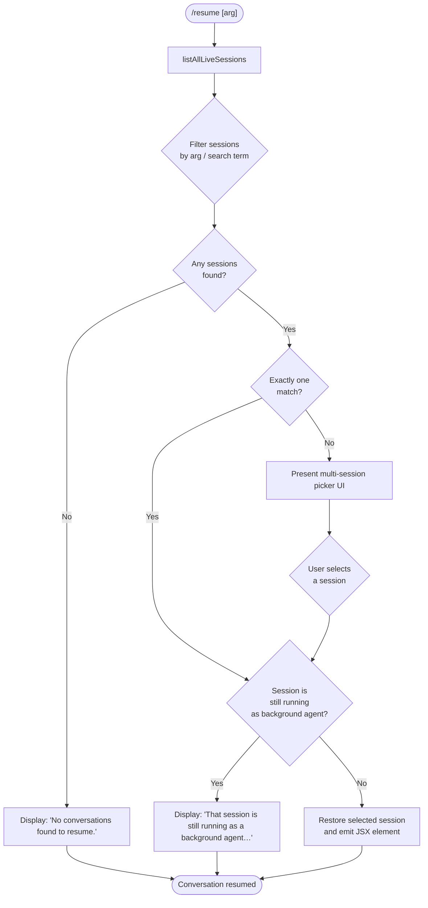

# `/resume`

> Analysis basis: CC v2.1.183 bundle.js (AST extraction + Claude interpretation)
> Minimum version: v2.1.183

---

## Overview

`/resume` (alias `/continue`) allows the user to resume a previous Claude Code conversation by selecting from a list of available sessions. The command queries all live and stored sessions, filters and ranks them by search term or conversation ID, and then either restores the selected session directly or presents a picker UI. Background-running sessions are blocked from resumption until they are stopped.

---

## Registration

| Field | Value |
|---|---|
| type | `local-jsx` |
| name | `resume` |
| description | `Resume a previous conversation` |
| aliases | `["continue"]` |
| argumentHint | `[conversation id or search term]` |
| module_id | `HEl` |
| load_inline | `true` |
| loc_byte | `12461214` |
| loc_byte_end | `12461411` |
| loc_line | `7995` |
| arbor_handler.name | `Trf` |
| arbor_handler.fqn | `claude-2.1.183::Trf` |
| arbor_handler.kind | `AsyncFunction` |
| arbor_handler.resolution_path | `module_id` |
| arbor_handler.n_hits | `0` |

Analysis basis: CC v2.1.183 bundle.js:+12461214

---

## Input Branching

The command has 4+ distinct branches based on session-list state and user input:



---

## Behavioral Spec

### 1. Session Listing (`sessionLister` / `Oge`)

The handler begins by resolving all available sessions.

```
async function listSessions(query):
    sessions = await listAllLiveSessions()     // includes stored + live
    filtered = sessions.filter(sessionTypeIsInteractive)
    return filtered
```

`listAllLiveSessions` is called at `bundle.js:+8540500`. Session type filtering checks for the string `"interactive"` (bundle.js:+8540591).

Analysis basis: CC v2.1.183 bundle.js:+8540448

---

### 2. Background-Agent Guard (`Trf` main handler)

If the resolved session is currently running as a background agent, resumption is blocked and an informational message is surfaced:

```
if sessionIsLiveBackgroundAgent(selectedSession):
    return errorMessage(
        "That session is still running as a background agent. " +
        "Open `claude agents` to attach to it, or stop it there first to resume here."
    )
```

The literal message is found at bundle.js:+12459814.

Analysis basis: CC v2.1.183 bundle.js:+12459812

---

### 3. Empty-Result Path

When no sessions survive the filter step:

```
if sessionList.length === 0:
    displayMessage("No conversations found to resume.")
    return
```

The literal `"No conversations found to resume."` is found at bundle.js:+12460249.

Analysis basis: CC v2.1.183 bundle.js:+12460035

---

### 4. Session Matching and Ranking (`worktreeScorer` / `Rge`)

When sessions exist, the argument (conversation ID or search term) is used to rank candidates:

```
function rankSessions(sessions, arg):
    worktrees = runGitWorktreeListPorcelain()   // "worktree list --porcelain"
    for session in sessions:
        if session.path.startsWith("worktree "):
            normalizedPath = normalizePath(session.path.slice(9))
        score = computeLocaleCompare(session, arg)
    return sessions.sortedByScore
```

Git worktree detection emits `tengu_worktree_detection` telemetry (bundle.js:+8529697). The strings `"worktree list"`, `"--porcelain"`, and the prefix `"worktree "` (9 chars, hence the `slice(9)` offset) are confirmed literals at bundle.js:+8529608, +8529615, +8529816, +8529850.

Analysis basis: CC v2.1.183 bundle.js:+8529553

---

### 5. Session Restoration and JSX Render (`Trf`)

After a session is chosen (either unambiguously or via the picker), the handler creates a JSX element via `Pb.createElement` and stamps a `Date.now()` timestamp:

```
async function resumeHandler(arg, appState):
    sessions = await listSessions()
    sessions = filterByArg(sessions, arg)

    if sessions.length === 0:
        return renderMessage("No conversations found to resume.")

    if sessions.length > 1:
        selectedSession = await showSessionPicker(sessions)
    else:
        selectedSession = sessions[0]

    if isBackgroundAgent(selectedSession):
        return renderMessage(BACKGROUND_AGENT_BLOCKED_MSG)

    sessionId = selectedSession.id
    title    = deriveTitle(selectedSession)

    emitTelemetry("slash_command_session_id", sessionId)   // literal +12460511
    emitTelemetry("slash_command_title",      title)       // literal +12460736

    jsxNode = Pb.createElement(...)                         // +12460100
    timestamp = Date.now()                                  // +12460126
    return restoreSession(jsxNode, sessionId, timestamp)
```

Analysis basis: CC v2.1.183 bundle.js:+12460100

---

### 6. Context Projection (`projectContextLoader` / `Pqn` → `U8t` → `IOl`)

The restored session's file context is rebuilt: directory trees are walked, CLAUDE.md files are located, and system prompt segments are concatenated. This mirrors the full context-loading pipeline used when starting a fresh session.

```
function loadProjectContext(workingDir):
    files  = readdir(workingDir)
    mds    = files.filter(isClaudeMd)
    tokens = mds.map(readAndTokenize)
    ctx    = concat(tokens)
    return ctx
```

`Buffer.byteLength` (bundle.js:+213400) and `Rl.readdir` (bundle.js:+13507733) are used during this phase.

Analysis basis: CC v2.1.183 bundle.js:+13506768

---

### 7. Session-State Store Rebuild (`appStateLoader` / `llt` → `nce`)

The full session state — transcript, tool histories, MCP connections, worktree snapshots, and many keyed metadata fields — is reconstructed from on-disk data:

```
function rebuildSessionState(sessionId):
    state = loadFromDisk(sessionId)
    applyFields([
        "summary", "last-prompt", "custom-title", "ai-title",
        "tag", "agent-name", "agent-color", "agent-setting",
        "mode", "permission-mode", "isolation-latch",
        "worktree-state", "pr-link", "bridge-session",
        "file-history-snapshot", "attribution-snapshot",
        "content-replacement", "fork-context-ref",
        "marble-origami-commit", "marble-origami-snapshot",
        "marble-origami-reset"
    ], state)
    return state
```

The field-name literals are confirmed in the bundle; representative ones: `"summary"` (+13499998), `"last-prompt"` (+13500065), `"custom-title"` (+13500161), `"ai-title"` (+13500239).

Analysis basis: CC v2.1.183 bundle.js:+13504946

---

### 8. UI State Tokens (`sessionNotFound` / `multipleMatches`)

Two UI-state sentinel strings drive the picker component's display logic:

- `"sessionNotFound"` (bundle.js:+12457457) — rendered when the provided ID matches no stored session.
- `"multipleMatches"` (bundle.js:+12457528) — rendered when the search term is ambiguous and the picker must be shown.

The bold-styled UI element is produced by `AEl` via `Ht.bold` (bundle.js:+12457492).

Analysis basis: CC v2.1.183 bundle.js:+12460786

---

## State & Side Effects

| Item | Detail |
|---|---|
| Telemetry — `tengu_worktree_detection` | Fired when git worktree list is evaluated for session path mapping (bundle.js:+8529697) |
| Telemetry — `tengu_bg_attach` | Fired when a background-agent attach is attempted (bundle.js:+17266238) |
| Telemetry — `tengu_bg_attach_kick` | Fired when an existing attacher is kicked to allow the new session (bundle.js:+17268435) |
| Telemetry — `tengu_bg_attach_stall_respawn` | Fired when a stalled attach triggers a respawn (bundle.js:+17267438) |
| Telemetry — `tengu_bg_attach_stall_gave_up` | Fired when the stall timeout expires without resolution (bundle.js:+17267168) |
| Telemetry — `tengu_daemon_control` | Fired on daemon control operations during restoration (bundle.js:+17311864) |
| Telemetry — `tengu_transcript_phantom_parent` | Fired when a transcript node references a missing parent (bundle.js:+13498763) |
| Telemetry — `tengu_chain_parent_cycle` | Fired when a cycle is detected in the conversation chain (bundle.js:+13479573) |
| Telemetry — `tengu_chain_timestamp_fallback` | Fired when chain ordering falls back to timestamps (bundle.js:+13479722) |
| Telemetry — `slash_command_session_id` | Records the ID of the resumed session (literal at +12460511) |
| Telemetry — `slash_command_title` | Records the title of the resumed session (literal at +12460736) |
| appState changes | Full session state reconstructed: transcript, tool histories, MCP connections, worktree snapshots, metadata fields |
| Background-agent guard | If the target session is a live background agent, resumption is blocked with a user-facing message |
| Sound | None identified in depth-2 traversal |
| Hook registration | None identified in depth-2 traversal |

---

## Version History

| Version | Change |
|---|---|
| v2.1.183 | Initial analysis |

---

## Common Mistakes

1. **Trying to resume a running background session** — `/resume` will refuse with the blocked-agent message. Use `/agents` to attach, or stop the agent first.
2. **Ambiguous search term** — Providing a partial term that matches multiple sessions shows a picker; providing a unique session UUID skips the picker entirely.
3. **No argument provided with many sessions** — Without a search term, all `interactive`-type sessions are listed; very old or numerous sessions can make the picker unwieldy. Use a UUID or title fragment to narrow results.
4. **Expecting instant context restoration** — The command rebuilds the full project context (directory walk, CLAUDE.md loading, transcript replay) which may take a noticeable moment for large projects.
5. **Confusing `/resume` with daemon re-attach** — `/resume` restores a _stored conversation_ in the current window; it does not re-attach to a live PTY session the way `/agents` does.

---

## Appendix — Identifier Mapping

> For bundle debugging only. Identifiers change across versions.

| Identifier | Role |
|---|---|
| `Trf` | Main async handler for `/resume` (arbor-resolved entry point) |
| `gEl` | Pre-handler filter; removes non-interactive session entries |
| `Oge` | Session lister — calls `listAllLiveSessions`, filters to interactive type |
| `Rge` | Session ranker / worktree scorer — runs `git worktree list --porcelain`, scores sessions by arg |
| `qr` | Process-launcher / subprocess orchestrator called by the ranker |
| `zOe` | Low-level child-process spawner (wraps Node `spawn`) |
| `De` | Error formatter / structured-error builder |
| `Ho` | Error class constructor wrapper |
| `st` | String coercion utility |
| `Ee` | String identity / toString helper |
| `Ar` | Path-resolution helper (cwd / absolute path) |
| `AH` | Unicode NFC normalizer for paths |
| `Pqn` | Project-context loader (top-level entry) |
| `U8t` | Context assembler — joins paths, calls `IOl` and `Ije` |
| `IOl` | Directory walker / CLAUDE.md aggregator |
| `zLo` | Recursive directory reader (readdir + recurse) |
| `EMe` | File content slicer / token accumulator |
| `L8t` | File-metadata cache manager |
| `Ije` | Buffer-level file reader for context assembly |
| `gHf` | Low-level file-chunk processor |
| `llt` | Session-state loader (top-level) |
| `TOl` | State deserialiser — calls `nce` and `Object.assign` |
| `nce` | Full session-state hydrator (applies all metadata fields) |
| `aHf` | On-disk conversation-file parser (binary/JSONL reader) |
| `lHf` | Lightweight file-header reader |
| `iHf` | Incremental buffer parser for transcript records |
| `YPl` | Transcript chain builder — orders messages by parent UUID |
| `Vgf` | Chain link resolver — walks parent references |
| `Nge` | Conversation-graph builder |
| `Ygf` | NaN-guard for message timestamps |
| `Xgf` | Parallel-chain merger and sorter |
| `Kgf` | BFS queue processor for chain walking |
| `yOl` | Message-dedup accumulator |
| `Uge` | App-state projector — exposes getters for all state slices |
| `dX` | Full session-restore compositor (calls ranker + walker + context loader) |
| `pR` | Regex validator for session ID format |
| `Ah` | Session-list display helper |
| `Ate` | App-state mutation helper |
| `AEl` | Bold-text UI element builder |
| `oxo` | Compact-summary text formatter |
| `JGt` | Message-content extractor / text normaliser |
| `Dl` | Markdown/diff block parser |
| `ixo` | Content-type classifier (image / document guard) |
| `Jgf` | Text-block validator |
| `Qgf` | Array-type content checker |
| `xzn` | ISO-date parser for session timestamps (`Date.parse`) |
| `alt` | Simple entry mapper |
| `kzn` | State-slice key getter/setter |
| `Dzn` | Array-from-map-values helper |
| `VLo` | Version-aware session-entry adapter |
| `cHf` | Config-directory locator |
| `p2` | Platform path helper (calls `gx`) |
| `sL` | Directory lister with depth limit |
| `A_e` | Session-metadata accessor |
| `gEl` | Pre-handler session type filter |
| `HXc` | Daemon-node helper (calls `dn`) |
| `dn` | Daemon address/socket resolver |
| `n_c` | Workspace-root detector |
| `k0l` | Daemon status-file reader (`daemon.status.json`) |
| `Mjt` | Status-file path builder |
| `CQ` | Config-value accessor |
| `ci` | AsyncLocalStorage store reader |
| `gSe` | Stream-framing parser (NDJSON/binary) |
| `lJc` | Line-delimited JSON parser |
| `uJc` | JSON-object extractor |
| `cJc` | Raw-buffer-to-JSON converter |
| `jNo` | Session-lifecycle manager (spawn/retire/cleanup) |
| `NNo` | Daemon socket connector |
| `f` | Daemon worker manager (main loop) |
| `M` | Worker-slot allocator |
| `T6f` | Daemon server message dispatcher |
| `Qp` | Wire-protocol response serialiser |
| `g` | Daemon client connection handler |
| `L` | Daemon sweep / GC scheduler |
| `W` | Session-loop runner (scheduled tasks) |
| `B` | TTY write helper |
| `x` | Terminal output writer |
| `p8t` | Memory-pressure checker |
| `ERl` | Context-window retire check |
| `XKn` | Upgrade-gate checker |
| `YKn` | Background-worker telemetry helper |
| `B$e` | Conversation-file lstat/rm helper |
| `ct` | Feature-flag evaluator |
| `Re` | Feature-ok reporter |
| `ke` | Feature-bad reporter |
| `Ue` | Output-gate helper |
| `Bn` | Timed retry helper |
| `vMt` | Token-count estimator |
| `ZIn` | Token-budget calculator |
| `fae` | Scheduled-task registry helper |
| `Dre` | Task-set membership checker |
| `ds` | Debug-node helper |
| `wb` | Metadata write-back helper |
| `S6` | State-change signaller |
| `pYt` | Content-block serialiser |
| `uYt` | Block-type validator |
| `dYt` | Escape processor |
| `os` | Output-stream helper |
| `Wn` | Notification emitter |
| `n3e` | MCP connection initialiser |
| `uZn` | MCP connection result applier |
| `B1o` | MCP client roster builder |
| `mta` | MCP transport selector |
| `v_e` | Permission-mode filter |
| `Rgf` | State-record formatter |

---

Note: index built via Arbor fallback; some signals (telemetry, literals) may be missing — see arbor-fallback.js.