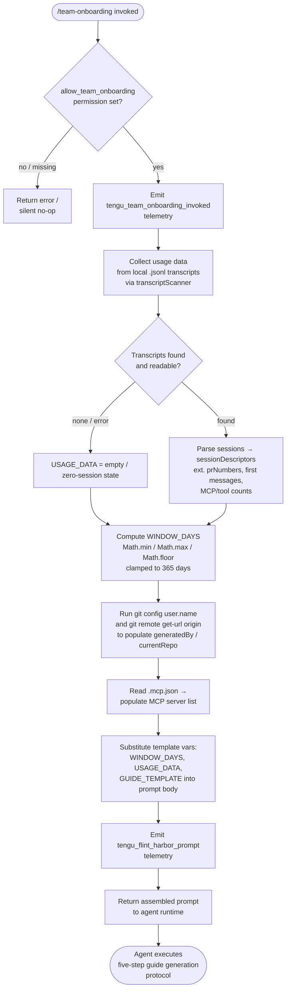

# `/team-onboarding`

> Analysis basis: CC v2.1.183 bundle.js (AST extraction + Claude interpretation)
> Minimum version: v2.1.183

---

## Overview

`/team-onboarding` is a `prompt`-type slash command that scans the invoking user's local Claude Code conversation transcripts and co-authors a structured `ONBOARDING.md` guide for teammates who are new to Claude Code. The command injects a 4 539-character prompt (plus runtime data) into the agent, which immediately produces a concrete draft guide, then iterates on it through a collaborative review dialogue before saving the final file.

---

## Registration

| Field | Value |
|---|---|
| type | `prompt` |
| name | `team-onboarding` |
| description | `Help teammates ramp on Claude Code with a guide from your usage` |
| isHidden | `false` |
| handler_method | `getPromptForCommand` |
| handler_method_start | `13268443` |
| handler_method_end | `13269153` |
| loc_byte | `13268080` |
| loc_byte_end | `13269154` |
| loc_line | `8844` |
| prompt_body.length | `4539` |
| prompt_body.trace | `identifier→l (local→1 ext vars)` |
| arbor_handler.name | `getPromptForCommand` |
| arbor_handler.fqn | `claude-2.1.183::getPromptForCommand` |
| arbor_handler.kind | `Method` |
| arbor_handler.resolution_path | `direct` |
| arbor_handler.n_hits | `2` |

Analysis basis: CC v2.1.183 bundle.js:+13268080

---

## Input Branching

The handler evaluates at least four distinct runtime paths before producing the final prompt string: (1) feature-flag guard, (2) usage-data collection from transcripts, (3) template variable substitution with bounded numeric clamping, and (4) permission check for `allow_team_onboarding`. The Mermaid chart below captures these branches.



Analysis basis: CC v2.1.183 bundle.js:+13268443 (handler), +13268646 (Math.min/max/floor), +13268692 (365-day constant), +13268703 (telemetry), +13268881 (vAf / usage data), +13268890 (replaceAll substitution)

---

## Behavioral Spec

### 1. Permission Guard

Before any data collection, the handler checks the `allow_team_onboarding` permission flag on the current session/enterprise context.

```
function permissionGuard(sessionContext):
    if not sessionContext.hasPermission("allow_team_onboarding"):
        return earlyExit()   // no prompt emitted
    proceed to usageDataCollection()
```

Analysis basis: CC v2.1.183 bundle.js:+10258335 (`"allow_team_onboarding"` literal), +10258373 (`ab` permission-check call), +10258394 (`ct` harborShare event)

---

### 2. Usage Data Collection (`transcriptScanner`)

The handler delegates to the transcript-scanning subsystem (`JMl`) to read local `.jsonl` files from the Claude Code projects directory. Each file is parsed line-by-line; assistant messages are filtered for `"name":"mcp__` prefixes to detect MCP tool usage, and `"content":[` patterns to extract first user messages. Pull-request numbers (`prNumbers`) are scraped via regex exec (`EAf`, `SAf`, `bAf`). Session timestamps are derived from file modification times and content. Sessions older than the computed `WINDOW_DAYS` cutoff are excluded.

```
function transcriptScanner(projectsDir, windowDays):
    files = fs.readdir(projectsDir)
    jsonlFiles = files.filter(f => f.endsWith(".jsonl"))
    sessions = []
    for file in jsonlFiles:
        stat = fs.stat(joinPath(projectsDir, file))
        if not stat.isFile(): continue
        raw = fs.readFile(joinPath(projectsDir, file), "utf8")
        lines = raw.split("\n")
        descriptor = extractSessionDescriptor(lines)
        if descriptor.ageInDays <= windowDays:
            sessions.push(descriptor)
    return sessions

function extractSessionDescriptor(lines):
    firstUserMessage = null
    prNumbers = []
    mcpCallCount = 0
    toolCallCount = 0
    for line in lines:
        if line.includes('"name":"mcp__'):   mcpCallCount++
        if line.includes('"content":['):
            msg = tryParseJson(line)
            if msg and msg.role == "user" and firstUserMessage == null:
                firstUserMessage = extractText(msg)
        prNumbers += runPrRegexes(line)   // EAf, SAf, bAf exec
    return { firstUserMessage, prNumbers, mcpCallCount, toolCallCount }
```

Analysis basis: CC v2.1.183 bundle.js:+13257038 (`Bmt.readdir`), +13257108 (`BKn.extname`), +13257381 (`Bmt.readFile`), +13257495 (`l.split`), +13257536 (`u.includes`), +13257582 (`u.matchAll`), +13257845 (`EAf.exec`), +13257901 (`SAf.exec`), +13258076 (`bAf.exec`), +13257125 (`".jsonl"` literal), +13257704 (`'"name":"mcp__"'` literal), +13258054 (`'"content":['` literal)

---

### 3. Window Computation and Constant Clamping

The lookback window is computed from `Date.now()` minus the earliest session timestamp, then clamped to a maximum of **365 days** using `Math.min`, `Math.max`, and `Math.floor`.

```
function computeWindowDays(sessions, nowMs):
    if sessions.isEmpty():
        return 30   // default
    earliestMs = min(sessions.map(s => s.timestampMs))
    rawDays = (nowMs - earliestMs) / MS_PER_DAY
    return Math.floor(Math.min(Math.max(rawDays, 1), 365))
```

Maximum lookback: **365 days** (CC v2.1.183 bundle.js:+13268692)

Analysis basis: CC v2.1.183 bundle.js:+13268646 (`Math.min`), +13268655 (`Math.max`), +13268664 (`Math.floor`), +13268692 (`365` constant), +13268792 (`Date.now`)

---

### 4. Environment Enrichment (`envEnricher`)

After session collection, the handler gathers two additional signals via child-process execution (`qr` → `zOe` spawn pipeline):

- **`generatedBy`**: resolved from `git config user.name` in the current working directory.
- **`currentRepo`**: resolved from `git remote get-url origin`.
- **MCP server list**: read from `.mcp.json` in the workspace root; the `mcpServers` object keys and optional `urlOrigin` fields are extracted.

```
function envEnricher(cwd):
    generatedBy = runGit(cwd, ["config", "user.name"]).trim()
    currentRepo  = runGit(cwd, ["remote", "get-url", "origin"]).trim()
    mcpServers   = readMcpJson(cwd)   // reads ".mcp.json", key "mcpServers"
    return { generatedBy, currentRepo, mcpServers }
```

Analysis basis: CC v2.1.183 bundle.js:+13259778 (`"git"`), +13259785 (`"config"`), +13259794 (`"user.name"`), +13259850 (`"remote"`), +13259859 (`"get-url"`), +13259869 (`"origin"`), +13259155 (`".mcp.json"`), +13259211 (`"mcpServers"`)

---

### 5. Template Variable Substitution

The handler calls `String.replaceAll` three times to replace template placeholders in the prompt body before returning it. The three placeholder tokens are:

| Placeholder | Replaced with |
|---|---|
| `{{WINDOW_DAYS}}` | computed integer (1–365) |
| `{{USAGE_DATA}}` | JSON-serialised `sessionDescriptors` array |
| `{{GUIDE_TEMPLATE}}` | embedded guide Markdown template |

```
function buildPrompt(templateText, windowDays, usageData, guideTemplate):
    s = templateText.replaceAll("{{WINDOW_DAYS}}", String(windowDays))
    s = s.replaceAll("{{USAGE_DATA}}", JSON.stringify(usageData))
    s = s.replaceAll("{{GUIDE_TEMPLATE}}", guideTemplate)
    return s
```

Analysis basis: CC v2.1.183 bundle.js:+13268890 (`t.replaceAll`), +13268903 (`"{{WINDOW_DAYS}}"` literal), +13268943 (`"{{GUIDE_TEMPLATE}}"` literal), +13268978 (`"{{USAGE_DATA}}"` literal), +13268921 (`String`)

---

### 6. Agent-Side Guide Generation Protocol (five steps)

Once the assembled prompt reaches the agent, the agent executes a fixed five-step protocol. The steps are mandated by the prompt body (length 4 539 chars; CC v2.1.183 bundle.js:+13268080):

**Step 1 — Immediate acknowledgment line.**
The agent's very first visible output must be a blockquote summarising how many days of usage it is examining. No classification, no tool calls, no thinking blocks may appear before this line.

**Step 2 — Work-type breakdown.**
The agent reads `sessionDescriptors` and classifies each session into one of seven canonical task types: `build_feature`, `debug_fix`, `improve_quality`, `analyze_data`, `plan_design`, `prototype`, `write_docs`. It selects the top 3–5 by frequency with approximate percentages. Review sessions are classified by their subject matter (code review → Improve Quality; doc review → Write Docs; design review → Plan Design). A new category may only be invented if none of the seven fits. If the session count is approximately zero the breakdown is left as a TODO placeholder. Display names use title case with spaces (e.g. "Build Feature").

**Step 3 — Gather remaining pieces.**
The agent determines the team/repo name from `currentRepo`, discovers sibling repo directories in the workspace, and describes each MCP server using its `name` and `urlOrigin`. Team Tips and Get Started sections are left as TODO placeholders pending the review questions.

**Step 4 — Write `ONBOARDING.md`.**
The agent fills the embedded guide template with real numeric values (not placeholders). ASCII bar charts use `█` (filled) and `░` (empty) at 20 characters wide. The `generatedBy` field provides the author name; if absent, the name is omitted. The HTML comment at the bottom of the template is preserved verbatim.

**Step 5 — Render, review, and save.**
The agent outputs the completed guide inside a fenced code block. It then adds a horizontal rule and a `**Review**` heading with exactly three numbered questions: (1) team-name confirmation, (2) starter task link, (3) team tips not already in `CLAUDE.md`. After the guide creator responds, the agent updates `ONBOARDING.md` with the answers and closes with the exact fixed sentence: *"Saved to `ONBOARDING.md`. Drop it in your team docs and channels — when a new teammate pastes it into Claude Code, they get a guided onboarding tour from there."* Subsequent edits from the user are applied to the file.

Analysis basis: CC v2.1.183 bundle.js:+13268080 (prompt body registration), +13268443 (handler method start), +13269137 (`"text"` return type literal), +13269022 (telemetry `tengu_team_onboarding_generated`)

---

### 7. Config Persistence Sub-path (`saveConfigWithLock`)

The handler internally reaches the config-lock subsystem (`W7n` / `saveConfigWithLock`) when persisting state, which carries its own safety logic:

```
function saveConfigWithLock(configPath, updater):
    acquireLock(configPath)     // may emit tengu_config_lock_contention
    cached = readCurrentConfig()
    reread = readConfigFromDisk()
    if cached.hasAuth and not reread.hasAuth:
        log("tengu_config_auth_loss_prevented")
        releaseLock()
        return   // refuse write to avoid wiping auth
    merged = applyUpdater(reread, updater)
    writeFileSyncAndFlush(configPath, merged)
    releaseLock()
```

Maximum config backup retention: **5 files** (CC v2.1.183 bundle.js:+13967675)
File mode used for new config files: **384** (octal 0600) (CC v2.1.183 bundle.js:+13967957)

Analysis basis: CC v2.1.183 bundle.js:+13966745 (`tengu_config_lock_contention`), +13966881 (`tengu_config_stale_write`), +13967072 (auth-loss-prevented message literal), +13967224 (`tengu_config_auth_loss_prevented`), +13967542 (`".backup."` literal), +13967675 (`5` backup count)

---

## State & Side Effects

| Item | Detail |
|---|---|
| Telemetry — invocation | `tengu_team_onboarding_invoked` (bundle.js:+13268703) — fired immediately after permission check passes |
| Telemetry — prompt dispatched | `tengu_flint_harbor_prompt` (bundle.js:+13268480) — fired when prompt is handed to agent |
| Telemetry — guide generated | `tengu_team_onboarding_generated` (bundle.js:+13269022) — fired after agent completes guide draft |
| Telemetry — harbor share | `tengu_flint_harbor_share` (bundle.js:+10258397) — fired on share/save action |
| Telemetry — config lock contention | `tengu_config_lock_contention` (bundle.js:+13966745) |
| Telemetry — config stale write | `tengu_config_stale_write` (bundle.js:+13966881) |
| Telemetry — config auth loss prevented | `tengu_config_auth_loss_prevented` (bundle.js:+13967224) |
| Telemetry — config parse error | `tengu_config_parse_error` (bundle.js:+13969320) |
| Telemetry — config fallback write | `tengu_config_fallback_write` (bundle.js:+13966361) |
| File written | `ONBOARDING.md` in the current working directory (agent tool call) |
| File read | `~/.claude/projects/**/*.jsonl` (transcript scan) |
| File read | `.mcp.json` in workspace root |
| Child processes spawned | `git config user.name`, `git remote get-url origin` |
| Permission required | `allow_team_onboarding` literal (bundle.js:+10258335) |
| appState changes | None directly; config lock path may update persisted config |
| Hook registration | File-watch hook registered via `B2o.register` (bundle.js:+69538) through `qi` for config change detection |
| Sound | None observed in depth-2 traversal |

---

## Version History

| Version | Change |
|---|---|
| v2.1.183 | Initial analysis — command registered at bundle.js:+13268080; five-step guide generation protocol; `allow_team_onboarding` permission gate; 365-day lookback cap |

---

## Common Mistakes

1. **Invoking without `allow_team_onboarding` permission.** The command silently exits if the permission flag is not set on the enterprise or team context. Ensure the flag is enabled before expecting any output.
2. **No local transcripts present.** If the user has no `.jsonl` transcript files under the Claude Code projects directory the usage data will be empty and the work-type breakdown will be left as a TODO placeholder. Run at least a few sessions before invoking for a meaningful guide.
3. **Skipping the review round.** The command deliberately leaves Team Tips and Get Started as TODOs in the first draft. These sections are filled in only after the three review questions are answered. Closing the session before responding leaves an incomplete `ONBOARDING.md`.
4. **Misreading the 365-day cap as a configuration option.** The lookback window is computed dynamically from transcript timestamps but is hard-capped at 365 days in the bundle (bundle.js:+13268692). There is no CLI flag to extend it.
5. **Expecting the guide template to be user-configurable.** The `{{GUIDE_TEMPLATE}}` placeholder is resolved entirely within the handler; the template text is embedded in the bundle and cannot be overridden from the CLI.
6. **Running outside a git repository.** If `git config user.name` or `git remote get-url origin` fail (no git repo), `generatedBy` and `currentRepo` will be absent. The prompt instructs the agent to omit the name if `generatedBy` is missing, but the repo section of the guide will be incomplete.

---

## Appendix — Identifier Mapping

> For bundle debugging only. Identifiers change across versions.

| Identifier | Role |
|---|---|
| `__handler_team-onboarding` | Synthetic BFS entry point for the command handler (maps to `getPromptForCommand`) |
| `ct` | Prompt-dispatch / harbor coordinator (routes assembled prompt to agent runtime) |
| `wxt` | Sub-utility called by harbor coordinator (exact role unclear at depth-2) |
| `Lxt` | Sub-utility called by harbor coordinator (exact role unclear at depth-2) |
| `I4` | Intermediate call within harbor coordinator chain |
| `T4` | Inner dispatch helper within harbor chain |
| `uB` | Low-level harbor/prompt emission helper |
| `OHn` | Deduplication / cache-check wrapper in prompt dispatch |
| `RNr` | Session-record builder (calls randomUUID, emits `eZ.emit`) |
| `gFe` | Sub-helper of session-record builder |
| `o8` | Random-bytes / hex-token generator (uses `Eko.randomBytes`, 32 bytes) |
| `Pe` | JSON serialisation helper (wraps `JSON.stringify`) |
| `KXu` | Post-record-creation hook in harbor flow |
| `$Nr` | Duplicate-suppression finaliser in prompt dispatch |
| `Hni` | Sub-step of duplicate suppression |
| `Gr` | Utility called by duplicate suppression |
| `Pmi` | Sub-step of duplicate suppression |
| `L2` | Cache-set lookup used by duplicate suppression |
| `Ct` | Config accessor / session state loader |
| `jt` | Config file path resolver |
| `Hko` | Config sub-helper |
| `q_e` | Config reader / parser (reads file, parses JSON, handles `ENOENT`) |
| `r` | Node `fs` module alias |
| `Gt` | `JSON.parse` wrapper |
| `V9` | String prefix-strip utility |
| `t` | Generic parameter / local alias (context-dependent) |
| `dn` | Logging / debug utility |
| `RFl` | Backup-directory scanner / manager |
| `T` | Template string / tagged-template helper |
| `j` | General-purpose async utility / Promise helper |
| `Sko` | Path join + filesystem-check helper |
| `f` | Daemon/background-session manager |
| `Ebf` | File-watch registration and config cache invalidation |
| `Kq` | Sub-helper of file-watcher |
| `qi` | File-watch hook registrar (calls `B2o.register`) |
| `pn` | Global config save coordinator (`saveGlobalConfig`) |
| `W7n` | Config save with lock (`saveConfigWithLock`) |
| `s` | Secondary `fs`-like module alias or set/lock helper |
| `i` | Async finaliser / stream close helper |
| `C3s` | Config object merge helper |
| `_wr` | Config initialisation helper |
| `AAt` | Config auth-presence validator |
| `n` | Generic local variable alias (context-dependent) |
| `I` | UI scroll / viewport helper |
| `k` | Keyboard event handler (UI layer) |
| `E` | Scroll-position calculation utility |
| `g` | IPC/pipe buffer handler |
| `h` | Read-stream / timeout helper |
| `m` | Worker/session kill manager |
| `Qp` | Stream end / serialiser |
| `T6f` | Daemon IPC message dispatcher (large handler covering ping, nudge, dispatch, attach, etc.) |
| `Ee` | String coercion helper |
| `MSt` | Atomic file write helper (`writeFileSyncAndFlush`) |
| `jp` | Realpath resolution helper |
| `u` | OS/process stat helper |
| `Mn` | Error-code normaliser |
| `vKe` | Extended attribute / fsync error suppressor |
| `e` | Random delay / retry utility |
| `LMe` | Sub-helper in global config save path |
| `_ko` | Object-entries iterator in config save |
| `oWt` | Timestamp helper (`Date.now` wrapper) |
| `j7n` | Per-project config writer |
| `Ue` | Async task queue / error aggregator |
| `ogt` | Error aggregation primitive |
| `vAf` | Usage-data collection orchestrator (transcripts + git + MCP config) |
| `Ar` | Sub-helper of usage-data orchestrator |
| `gx` | Low-level utility called by `Ar` |
| `N2` | Project-path resolver |
| `KO` | Project directory path builder |
| `UE` | Relative-path normaliser |
| `v7c` | Absolute-path distance calculator |
| `JMl` | Transcript file scanner (reads `.jsonl` files, extracts session descriptors) |
| `ds` | Error-logging helper in transcript scanner |
| `o` | Array map/pad utility |
| `c` | File-stat type checker |
| `Tn` | Stat result type |
| `l` | Line-split / session-parsing local variable |
| `k0l` | JSONL line parser |
| `p` | Process/abort controller |
| `WT` | Forced-shutdown handler |
| `CAf` | `.mcp.json` reader / MCP server list extractor |
| `IAf` | Additional usage-data enricher |
| `qr` | Child-process spawner for git commands |
| `zOe` | Child-process execution core (spawn, stdio, timeout) |
| `des` | Platform-specific command builder (handles win32 `.exe`/`cmd`) |
| `Gmr` | Process-spawn low-level helper |
| `jmr` | Spawn with stdio setup |
| `qmr` | Spawn option builder |
| `_Zo` | Numeric timeout validator |
| `PSt` | Child-process result collector |
| `Bmr` | `Reflect.apply` wrapper for spawn |
| `YZo` | Process-exit event listener |
| `HZo` | Timeout-with-race helper |
| `yZo` | Process kill + finalise helper |
| `hZo` | Bound error-event handler |
| `gZo` | Bound kill handler |
| `KZo` | Pipe/stdio close coordinator |
| `FSt` | Error mapper for child processes |
| `qZo` | Stdin pipe setup |
| `VZo` | Stdout/stderr stream setup |
| `TZo` | Stream reader binder |
| `_Xc` | Output buffer to string converter |
| `Gp` | Generic logging call |
| `HXc` | Output-limit error formatter |
| `De` | Telemetry dispatcher |
| `Ho` | Error string normaliser |
| `st` | String coercion primitive |
| `ra` | Traffic-queue / essential-traffic helper |
| `Bzc` | Queue rotation helper (shift + push) |
| `QOe` | Git remote URL parser |
| `XXc` | URL host extractor |
| `Di` | String index/slice utility |
| `hdt` | Permission-flag checker for team features (`allow_team_onboarding`) |
| `di` | Enterprise/team context resolver |
| `oAi` | Context-switch helper |
| `Cz` | Plan-tier context builder |
| `pB` | Auth/profile resolution helper |
| `wr` | Auth-header builder |
| `Mu` | Token/credential holder |
| `Ug` | API client bootstrap |
| `ib` | OAuth / API-key credential selector |
| `Eme` | Enterprise-context flag reader |
| `ab` | Permission assertion helper |

---

Note: index built via Arbor fallback; some signals (telemetry, literals) may be missing — see arbor-fallback.js.