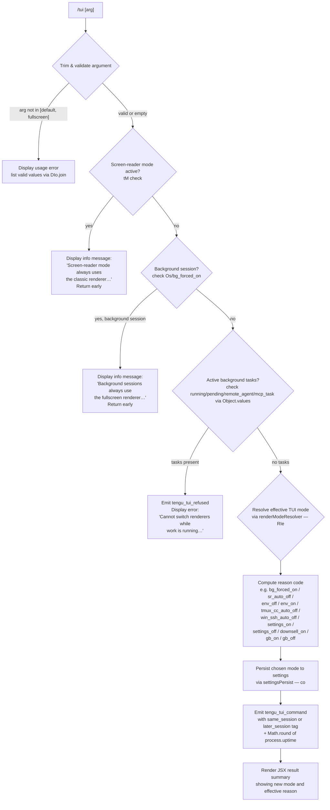

# `/tui`

> Analysis basis: CC v2.1.183 bundle.js (AST extraction + Claude interpretation)
> Minimum version: v2.1.183

---

## Overview

The `/tui` command switches the terminal UI renderer between `default` and `fullscreen` modes for the current Claude Code session. It inspects runtime environment constraints (screen-reader mode, background session state, active background tasks) before applying or refusing the change, and persists the chosen mode to user settings. The command reports the effective renderer reason code via telemetry on every invocation.

---

## Registration

| Field | Value |
|---|---|
| type | `local-jsx` |
| name | `tui` |
| description | Set the terminal UI renderer (default \| fullscreen) |
| argumentHint | `[default\|fullscreen]` |
| module_id | `LTl` |
| load_inline | `true` |
| loc_byte | `12670425` |
| loc_byte_end | `12670607` |
| loc_line | `8320` |
| arbor_handler.name | `Ysf` |
| arbor_handler.fqn | `claude-2.1.183::Ysf` |
| arbor_handler.kind | `AsyncFunction` |
| arbor_handler.resolution_path | `module_id` |
| arbor_handler.n_hits | `0` |

Analysis basis: CC v2.1.183 bundle.js:+12670425

---

## Input Branching

Six or more distinct guard paths exist before the renderer mode is applied; a Mermaid flowchart is used below.



Analysis basis: CC v2.1.183 bundle.js:+12668040

---

## Behavioral Spec

### Argument Parsing and Validation

```
async function tuiCommandHandler(rawArg, context):
    arg = rawArg.trim()                          // n.trim — loc +12668040

    validModes = ["default", "fullscreen"]       // DIo array — loc +12668152
    if arg is non-empty AND not in validModes:
        display usage error listing valid values  // DIo.join — loc +12668152
        return

    targetMode = arg OR null (toggle/query)
```

Analysis basis: CC v2.1.183 bundle.js:+12668040, +12668152, +12668198

---

### Screen-Reader Guard

```
    if screenReaderEnabled(tM):                  // tM — loc +12668546
        display notice:
            // literal fragment: "Screen-reader mode always uses…"
            // loc +12668560
        return                                   // no-op; renderer locked to classic
```

The literal message (loc +12668560) informs the user that while screen-reader mode is active the `tui` setting has no effect.

Analysis basis: CC v2.1.183 bundle.js:+12668546, +12668560

---

### Background Session Guard

```
    appState = getAppState(Fr / Fh)              // Fr — loc +12668320; Fh — loc +12668326
    if isBackgroundSession(appState):
        display notice:
            // literal fragment: "Background sessions always use…"
            // loc +12668350
        return
```

Background sessions are always forced to fullscreen (reason code `bg_forced_on`, loc +3545773); the `/tui` command cannot override this.

Analysis basis: CC v2.1.183 bundle.js:+12668320, +12668326, +12668350

---

### Active-Tasks Guard

```
    tasks = Object.values(appState.tasks)        // loc +12668857
    activeStates = ["running", "pending",        // loc +12668896, +12668918
                    "remote_agent", "mcp_task"]  // loc +12668939, +12668964

    if any task.state in activeStates:
        emit telemetry("tengu_tui_refused")      // loc +12668985
        display error:
            // literal fragment: "Cannot switch renderers while…"
            // loc +12669026
        return
```

Analysis basis: CC v2.1.183 bundle.js:+12668857, +12668985, +12669026

---

### Effective Renderer Mode Resolution (renderModeResolver)

The function `RIe` (renderModeResolver) evaluates the following priority chain and returns a `{mode, reason}` pair. Each reason code is a string constant found in the bundle.

```
function renderModeResolver(targetMode, appState, envFlags):
    if bg_forced_on condition:
        return {mode: "fullscreen", reason: "bg_forced_on"}   // loc +3545773
    if screenReader auto-off:
        return {mode: "default",    reason: "sr_auto_off"}    // loc +3545802
    if CLAUDE_CODE_DISABLE_ALTERNATE_SCREEN env set:
        return {mode: "default",    reason: "env_off"}        // loc +3545831
    if CLAUDE_CODE_NO_FLICKER env set:
        return {mode: "fullscreen", reason: "env_on"}         // loc +3545881
    if tmux -CC integration detected:
        return {mode: "default",    reason: "tmux_cc_auto_off"}// loc +3545905
    if Windows-over-SSH (ConPTY) detected:
        return {mode: "default",    reason: "win_ssh_auto_off"}// loc +3545939
    if settings explicitly enable fullscreen:
        return {mode: "fullscreen", reason: "settings_on"}    // loc +3545998
    if settings explicitly disable fullscreen:
        return {mode: "default",    reason: "settings_off"}   // loc +3546032
    if downsell override active:
        return {mode: "fullscreen", reason: "downsell_on"}    // loc +3546105
    if gradual-rollout gate ON:
        return {mode: "fullscreen", reason: "gb_on"}          // loc +3546170
    return {mode: "default",        reason: "gb_off"}         // loc +3546178
```

The `RIe` call is also reachable from `Ysf` directly (loc +12669198) to display the current effective state as part of the command output.

Analysis basis: CC v2.1.183 bundle.js:+3545773–+3546178, +12669198

---

### Fullscreen Auto-Disable Warning Messages

Two environment-specific warning strings are emitted at resolution time (inside `Os`, the renderer-state resolver):

- tmux -CC mode detected (iTerm2 integration): `"fullscreen disabled: tmux -CC (iTerm2 integration mode) detected · set CLAUDE_CODE_NO_FLICKER=1 to override"` — loc +3545011
- Windows over SSH (ConPTY): `"fullscreen disabled: Windows over SSH (ConPTY re-rendering) detected · set CLAUDE_CODE_NO_FLICKER=1 to override"` — loc +3545197

Analysis basis: CC v2.1.183 bundle.js:+3545011, +3545197

---

### Settings Persistence and Telemetry Emission

```
function persistAndReport(targetMode, resolvedMode, reason, context):
    settingsPersist(co, targetMode)              // co — loc +12669214
        // writes "tui" key to user settings (settings.json)

    sessionTag = determineTiming(appState):
        // "same_session"  if renderer can switch without restart — loc +12669922
        // "later_session" if restart required                    — loc +12669937

    emit telemetry("tengu_tui_command", {        // loc +12669458
        mode:         resolvedMode,
        reason:       reason,
        sessionTag:   sessionTag,
        uptimeRounded: Math.round(process.uptime()) // loc +12669549, +12669560
    })

    renderJsxSummary(T4, di, resolvedMode, reason) // T4 — loc +12669799; di — loc +12669805
```

Analysis basis: CC v2.1.183 bundle.js:+12669214, +12669325, +12669458, +12669549

---

### Terminal Capability Detection (used by resolver)

The function `U1` (terminalCapabilityProbe, loc +12669325) inspects terminal identity to inform whether fullscreen is safe:

```
function terminalCapabilityProbe(env):
    if env includes JetBrains IDE terminal:      // die.isJetBrainsIdeTerminal — loc +3615669
        return limited capability profile
    probe = R_(b_)                               // R_ — loc +3615741
    if platform is "darwin" or "win32":          // loc +3615879, +3615926
        apply platform-specific limit
    if TERM_PROGRAM is "cursor" or "vscode":     // loc +3616346, +3616395
        apply IDE-terminal limit
    version = God(parseFloat, Number.isNaN,      // God — loc +3615966
                  Math.min, 20)                  // max score 20 — loc +3616853
        // checks against known version thresholds:
        // 1092000 (loc +3616471), 1105000 (loc +3616482)
        // for xterm.js-based terminals (loc +3616515)
    return capability score
```

Analysis basis: CC v2.1.183 bundle.js:+12669325, +3615641, +3615669, +3616395

---

### Relaunch / Process-Swap Sub-Flow (zDe)

When the renderer switch requires a full process restart (e.g., `later_session`), the relaunch coordinator `zDe` (processRelaunchCoordinator) is invoked (loc +12665297):

```
function processRelaunchCoordinator(config):
    configPath = resolveConfigPath(s$)           // s$ — loc +12663218
    stat(ITl.stat, configPath)                   // loc +12663312
    passResumeFlag("--resume", ...)              // literal loc +12663364
    flushTuiDisplay(k3e)                         // k3e — loc +12663392
        // writes ESC-7/ESC-8 save/restore sequences — loc +3886257/+3886268
        // unmounts Ink renderer (e.unmount)
    await Promise.all([
        flush(uu, timeout=30000),                // loc +12663410, +12663431
            // timeout label: "flush timeout (relaunch)" — loc +12663437
        drainAnalytics(XWe, timeout=2000),       // loc +12663482, +12663488
            // timeout label: "cleanup timeout" — loc +12663493
        analyticsFlush(M3e)                      // label: "analytics flush timeout" — loc +12663549
    ])
    registerExitHandlers(nD / Au / qi)           // B2o.register — loc +69538
    removeAllListeners(process)                  // loc +12663933
    attachSignalHandlers(SIGINT, SIGHUP)         // loc +12663904, +12663923
    spawnSync(TTl.spawnSync, newProcess,         // loc +12663990
              {stdio: "inherit"})                // loc +12664025
    writeResumeMarker(eI)                        // Nre.writeFileSync — loc +199359
    process.exit(exitCode)                       // loc +12664239
    process.kill(process.pid, signal)            // loc +12664304
```

The relaunch uses `execve`-style replacement (via `STl` / nativeExecve, loc +12663866) on macOS/Linux, loading `bun:ffi` (loc +12662468) to call `/usr/lib/libSystem.B.dylib` (macOS, loc +12662512) or `libc.so.6` (Linux, loc +12662541).

Analysis basis: CC v2.1.183 bundle.js:+12663297, +12663364, +12663431, +12663866

---

## State & Side Effects

| Item | Detail |
|---|---|
| Telemetry: `tengu_tui_command` | Emitted on every successful mode change; carries mode, reason code, session-timing tag, and rounded uptime. loc +12669458 |
| Telemetry: `tengu_tui_refused` | Emitted when active background tasks block the switch. loc +12668985 |
| Telemetry: `tengu_amber_creek` | Emitted inside renderer-state resolver `Os`. loc +3545528 |
| Telemetry: `tengu_pewter_brook` | Emitted inside renderer-state resolver `Os`. loc +3545436 |
| Telemetry: `tengu_scroll_summary` | Emitted in scroll-management flow reachable from `dDn`. loc +7195497 |
| Telemetry: `tengu_disable_bypass_permissions_mode` | Emitted from `mB` (settings mutator) when bypass permissions is disabled as a side effect. loc +3386136 |
| Settings write | `co` (settingsPersist) writes `"tui"` key (`"default"` or `"fullscreen"`) to `settings.json`. loc +12669214 |
| Process relaunch | When `later_session` path is taken, `zDe` tears down the current process and exec-replaces it with a `--resume` flag. loc +12663297 |
| Hook registration | `nD` / `Au` / `qi` register `B2o` exit hooks before relaunch. loc +69538 |
| Ink renderer teardown | `k3e` (flushTuiDisplay) calls `e.unmount()` and writes terminal save/restore escape sequences (`ESC 7` / `ESC 8`). loc +12663392 |
| Signal handler reset | `process.removeAllListeners()` followed by fresh SIGINT/SIGHUP handlers before relaunch. loc +12663933, +12663963 |
| Environment variables observed | `CLAUDE_CODE_NO_FLICKER`, `CLAUDE_CODE_DISABLE_ALTERNATE_SCREEN`, `CLAUDE_CODE_FORCE_FULLSCREEN_UPSELL`. loc +12665393, +12665418, +12665457 |
| Sound | None detected |

---

## Version History

| Version | Change |
|---|---|
| v2.1.183 | Initial analysis |

---

## Common Mistakes

1. **Running `/tui fullscreen` while background tasks are active** — the command refuses with a clear error and emits `tengu_tui_refused`. Wait for all background tasks to finish (or cancel them via `/tasks`) before switching the renderer.
2. **Expecting `/tui` to affect background sessions** — background sessions are hard-wired to fullscreen (`bg_forced_on`). The setting only governs sessions started directly with the `claude` CLI.
3. **Expecting an immediate switch in all environments** — on some terminal configurations (tmux -CC, Windows over SSH) the resolver overrides the user choice automatically. Setting `CLAUDE_CODE_NO_FLICKER=1` bypasses these auto-disable paths.
4. **Expecting `/tui` to work in screen-reader mode** — screen-reader mode locks the renderer to classic/default unconditionally; the command returns early with an informational message and makes no settings change.
5. **Forgetting that a `later_session` switch triggers a full process relaunch** — unsaved in-memory state not yet flushed to disk may be lost. The relaunch passes `--resume` to restore the session.

---

## Appendix — Identifier Mapping

> For bundle debugging only. Identifiers change across versions.

| Identifier | Role |
|---|---|
| `Ysf` | Main handler for `/tui` command (AsyncFunction, arbor-resolved) |
| `ujt` | Entry-point wrapper calling `zDe` and `eIe` |
| `zDe` | Process relaunch coordinator |
| `s$` | Config path resolver |
| `BUn` | Version directory path builder |
| `HA` | Array type check helper |
| `Whe` | Local-share path joiner |
| `Jae` | User-bin path resolver |
| `ekn` | Home directory resolver |
| `eO` | Environment reader |
| `Lt` | Logger / trace helper |
| `gx` | Core logger |
| `HNt` | Interval clear helper |
| `hJr` | clearInterval wrapper |
| `k3e` | Flush / unmount TUI display (writes ESC-7/ESC-8, calls `e.unmount`) |
| `fF` | Post-unmount cleanup |
| `MEn` | Terminal write synchronizer |
| `o$e` | Terminal feature probe (ghostty, iTerm versioning) |
| `EL` | tmux/screen escape rewriter |
| `Gp` | Render formatter |
| `T` | Log formatting / level handler |
| `dDn` | Scroll / display-update dispatcher |
| `zw` | Scroll state initializer |
| `_ca` | Scroll accumulator |
| `j` | React/Ink JSX factory |
| `Hca` | Frame timing calculator (Date.now, Math.max, Math.round, Object.assign) |
| `hca` | Frame commit |
| `Os` | Renderer state resolver (fullscreen eligibility logic) |
| `L2` | Feature-flag lookup |
| `tM` | Screen-reader / accessibility mode checker (`Ani.isEnabled`) |
| `PFr` | Platform guard |
| `_Z` | Environment variable reader for renderer overrides |
| `RFr` | Windows/SSH detection helper |
| `Gr` | Settings getter |
| `_j` | Settings loader helper |
| `ved` | Renderer preference reader |
| `ct` | React hook / render scheduler |
| `uu` | Promise race with timeout |
| `nD` | Exit hook registrar |
| `Au` | Hook chain assembler |
| `qi` | `B2o.register` caller |
| `XWe` | Analytics drain (`B2o.drain`) |
| `M3e` | Analytics flush with timeout |
| `cDn` | Flush callback |
| `xIo` | Binary path resolver |
| `Ar` | Process argument builder |
| `Ec` | Executable locator |
| `STl` | Native execve wrapper (bun:ffi, libSystem / libc) |
| `i` | FFI library handle |
| `n` | FFI symbol handle |
| `r` | Native resource handle |
| `s` | Async resource tracker |
| `l` | Child-process list |
| `k0l` | Child-process record constructor |
| `f` | Background worker / daemon session manager |
| `M` | Scheduled-task runner |
| `Bn` | Promise-based timeout helper |
| `Re` | `tengu_feature_ok` emitter |
| `ke` | `tengu_feature_bad` emitter |
| `YKn` | Low-memory monitor |
| `B$e` | Checkpoint file manager |
| `De` | Error reporter / logError wrapper |
| `$` | Permission state machine (allow/deny/classify/ask) |
| `NNo` | IPC socket connection manager |
| `jNo` | Session lifecycle manager (done/killed/stopped/failed/crashed states) |
| `p` | Forced-shutdown handler (`process.exit`) |
| `dn` | Error formatter |
| `Ue` | `ogt` initializer |
| `R` | Disposable resource |
| `c` | Bun worker wrapper |
| `Tn` | Worker message handler |
| `a` | MCP / daemon session coordinator |
| `n3e` | MCP server connection builder |
| `uZn` | MCP update applier |
| `mta` | MCP retry scheduler |
| `B1o` | MCP client roster updater |
| `u` | Daemon stop orchestrator |
| `rF` | First-party server registration |
| `SG` | Daemon shutdown race handler |
| `Ee` | String coercer |
| `eI` | Resume marker writer |
| `eIe` | Alternate-screen / flicker env reader |
| `pVn` | CLI argument assembler for relaunch |
| `XRe` | Argument sanitizer |
| `r_n` | Boolean coercer for arg assembly |
| `Ct` | Bun-native bundle loader |
| `jt` | Path normalizer |
| `Hko` | Bundle hash checker |
| `q_e` | Bun snapshot / install handler |
| `Ebf` | File watcher for bundle updates |
| `Fr` | App-state session inspector (working_directory, allowed_tools, etc.) |
| `b6n` | App-state `ms` extractor (path A) |
| `ms` | App-state field accessor |
| `T6n` | App-state `ms` extractor (path B) |
| `mB` | Settings mutator (disables bypass permissions) |
| `Fh` | Lightweight app-state reader |
| `Hi` | Daemon-worker guard |
| `uNe` | Worker-mode check |
| `RIe` | Renderer mode resolver (returns mode + reason code) |
| `co` | Settings persist / config writer |
| `QA` | Settings read entry point |
| `LSe` | Settings file path builder |
| `knn` | Path resolver (userSettings / projectSettings) |
| `IQc` | Settings cache checker |
| `J9` | `.claude` directory path builder |
| `TQc` | Managed-settings path builder |
| `B2` | Settings object assembler (all layers) |
| `Qgt` | Policy-settings layer |
| `Mnr` | Flag-settings layer |
| `Ygt` | User-settings layer |
| `ZRe` | Project-settings layer |
| `ePe` | Local-settings layer |
| `eHt` | Cowork-settings layer |
| `Ioe` | SDK inline-settings layer |
| `kSe` | Settings merger |
| `$nn` | Settings validator |
| `lrs` | Settings schema checker |
| `iQ` | Settings post-processor |
| `kbt` | WSL settings path fixer |
| `Thr` | Settings disk reader |
| `Vns` | JSON settings parser |
| `bhr` | Single-file settings loader |
| `Hj` | Settings cache read |
| `H2o` | `ctr.get` settings cache |
| `cU` | `structuredClone` wrapper |
| `yhr` | Settings merger with warning/fatal handling |
| `_2o` | `ctr.set` settings cache writer |
| `Wns` | SDK inline settings merger |
| `$pe` | Settings coercion helpers |
| `cze` | Settings serializer |
| `bv` | Claude config file reader |
| `eQ` | Config file parser (BOM detection, encoding) |
| `jp` | Real-path resolver |
| `Zen` | Config file existence checker |
| `etn` | Config encoding helper |
| `Mn` | `dn` error wrapper |
| `RAr` | Settings timestamp recorder |
| `c1e` | Settings cache invalidator |
| `MSt` | Atomic file write (temp → rename) |
| `vKe` | fsync error handler |
| `Pe` | JSON stringifier |
| `mH` | Settings cache clear (`Szt.clear`, `ctr.clear`) |
| `Ves` | File write orchestrator (mkdir, readFile, writeFile, appendFile) |
| `Mt` | Async-local-store context getter |
| `Qen` | `Jen.getStore` / `xV` accessor |
| `hAr` | `Du` file helper |
| `Btn` | Write-path builder |
| `qr` | Gitignore / file-exclusion checker |
| `QXc` | Path absolutizer with homedir expansion |
| `Wes` | `git ls-files` tracker |
| `qes` | Write-effective checker |
| `Pt` | `tengu_feature_sad` emitter |
| `hx` | Settings perf-mark start |
| `ha` | Memory-usage sampler (`process.memoryUsage`) |
| `v9` | `require("perf_hooks")` wrapper |
| `Ihr` | Settings load orchestrator |
| `Ln` | Settings log appender |
| `Tzt` | Settings load timer |
| `xbt` | Visited-path dedup set |
| `o` | Output formatter (padEnd) |
| `bzt` | Settings load finalizer |
| `U1` | Terminal capability probe |
| `k0t` | Capability constants |
| `b_` | Terminal env reader |
| `L$r` | Capability score calculator |
| `Bod` | Base capability scorer |
| `R_` | Platform capability reader |
| `God` | Version-based capability adjuster |
| `x$r` | Version string extractor |
| `T4` | Ink render root |
| `uB` | JSX layout builder |
| `JYu` | JSX component: styled text |
| `st` | String → styled primitive |
| `Ac` | Text styling helper (`wr`) |
| `VH` | Box layout component |
| `OOe` | Output line component |
| `eJo` | Primitive text component |
| `di` | Display theme / color resolver |
| `oAi` | Theme provider |
| `Cz` | Color scheme resolver |
| `pB` | Palette builder (`wr`, `Mu`, `Ug`, `ib`, `mi`) |
| `Oxt` | Theme file reader (`nAi.readFileSync`) |
| `Mme` | Terminal color-support detector |
| `ra` | `eJo` fallback renderer |
| `Eme` | Styled string emitter |

---

Note: index built via Arbor fallback; some signals (telemetry, literals) may be missing — see arbor-fallback.js.