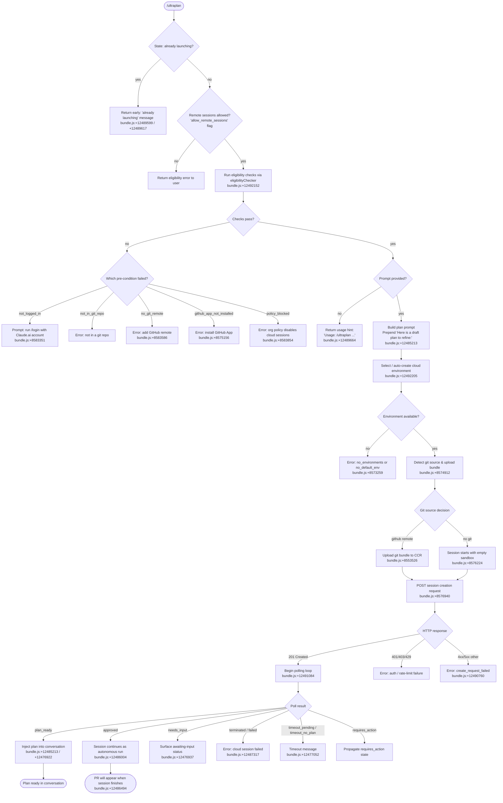

# `/ultraplan`

> Analysis basis: CC v2.1.183 bundle.js (AST extraction + Claude interpretation)
> Minimum version: v2.1.183

---

## Overview

`/ultraplan` launches a cloud-backed remote planning session from the Claude Code CLI. It sends the user's prompt to a remote cloud environment, waits for a draft plan to be produced by a background agent, then delivers that plan back into the local conversation as an editable document. The entire lifecycle — eligibility checks, environment selection, git bundle upload, session creation, polling, plan ingestion, and error surfacing — is handled asynchronously by the `zrf` handler.

---

## Registration

| Field | Value |
|---|---|
| type | `local-jsx` |
| name | `ultraplan` |
| description | `Draft an editable plan in Claude Code on the web ( ... ) · See ...` |
| argumentHint | `<prompt>` |
| load_inline | `true` |
| load_ident | `zrf` |
| loc_byte | `12494017` |
| loc_byte_end | `12494249` |
| loc_line | `8086` |
| arbor_handler.name | `zrf` |
| arbor_handler.fqn | `claude-2.1.183::zrf` |
| arbor_handler.kind | `AsyncFunction` |
| arbor_handler.resolution_path | `load_ident` |
| arbor_handler.n_hits | `1` |

Analysis basis: CC v2.1.183 bundle.js:+12494017

The handler is inlined via a `load:()=>Promise.resolve({call: zrf})` shape; there is no separate module ID. Arbor resolved the handler to `zrf` via the `load_ident` path.

---

## Input Branching

The command has more than three distinct branches (already-launching guard, missing-prompt guard, pre-condition failures, plan-ready path, approved/execution path, and multiple error paths). A Mermaid flowchart is used.



---

## Behavioral Spec

### 1. Top-level handler (`zrf`)

```
async function ultraplanHandler(commandContext):
    appState = commandContext.getAppState()               // +12492487

    // Guard: prevent duplicate launches
    if appState contains "already_polling" or "already_launching":
        emit "ultraplan: already launching. Please wait..."  // +12488152
        return

    // Check org-level remote-session policy
    if not flag("allow_remote_sessions"):                  // +12492173
        return eligibilityError()

    // Run full eligibility check pipeline
    eligibilityResult = runEligibilityChecks(commandContext)   // via tGn, +12492152
    if eligibilityResult.failed:
        return eligibilityResult.errorMessage

    // Require a non-empty prompt
    userPrompt = parsePromptArgument(commandContext)       // via tGn, +12492170
    if not userPrompt:
        emit usageHint()                                   // +12489664
        return

    // Mark state as launching
    commandContext.setAppState("already_launching")        // +12492709

    // Execute the full teleport workflow
    result = await launchTeleportWorkflow(userPrompt, commandContext)   // via ejt, +12492280

    commandContext.setAppState(result.finalState)
```

Analysis basis: CC v2.1.183 bundle.js:+12492152

---

### 2. Eligibility checker (`tGn` / `eGn` / `Hgo`)

The eligibility pipeline inspects multiple pre-conditions in sequence. Each condition has a short error code and a human-readable message.

```
function runEligibilityChecks(context):
    conditions = [
        checkLoggedIn,            // "not_logged_in"    +8583329
        checkInGitRepo,           // "not_in_git_repo"  +8583430
        checkGitRemote,           // "no_git_remote"    +8583564
        checkGithubAppInstalled,  // "github_app_not_installed" +8583677
        checkOrgPolicy,           // "policy_blocked"   +8583831
    ]
    for condition in conditions:
        result = condition(context)
        if result.failed:
            return { failed: true, code: result.code, message: result.message }
    return { failed: false }
```

The string `"ultraplan"` is referenced inside the eligibility check at +10950191 to tag the command type. The regex flag `"gi"` is used for case-insensitive pattern matching of the prompt at +10949839. The substring scan uses `String.prototype.startsWith` at +10949441 and `String.prototype.matchAll` at +10949847.

Analysis basis: CC v2.1.183 bundle.js:+10950185

---

### 3. Eligibility pre-condition: login check (`xhp`)

```
function checkLoggedIn(context):
    if no access token present:
        return error("not_logged_in",
            "Please run /login and sign in with your Claude.ai account (not Console).")
                                                           // +8583329, +8583351
    if token refreshed but unavailable:
        return error("no_access_token", ...)               // +8569398
    return ok()
```

Analysis basis: CC v2.1.183 bundle.js:+8582964

---

### 4. Eligibility pre-condition: GitHub App check (`T3e`)

```
async function checkGithubAppInstalled(context):
    accessToken = getAccessToken(context)
    if not accessToken:
        log("checkGithubAppInstalled: No access token found, assuming app not installed")
                                                           // +7178599
        return assumed_not_installed()

    orgUUID = getOrgUUID(context)
    if not orgUUID:
        log("checkGithubAppInstalled: No org UUID found, assuming app not installed")
                                                           // +7178712
        return assumed_not_installed()

    response = GET /github/app-installed (timeout: 15000ms)  // +7176863
    if response.status == 400:                             // +7179370
        return not_installed()
    if mo.isAxiosError(response):                          // +7179316
        return optimistic_pass()   // GHES: fail open
    return installed()
```

Analysis basis: CC v2.1.183 bundle.js:+7178566

---

### 5. Cloud environment selection (`qee` / `mst`)

```
async function selectOrCreateEnvironment(context):
    // List available teleport environments
    envList = GET /teleport/environments                   // "teleport_environments_list" +7176228

    if envList is empty:
        // Auto-create a default environment
        defaultEnv = POST /teleport/environments  {
            name: "Default",                               // +7177123
            kind: "anthropic_cloud",                       // +7177563
            home: "/home/user",                            // +7177669
            runtimes: { python: "3.11", node: "20" }      // +7177748, +7177777
        }
        log("[teleportToRemote] Auto-created default cloud env")  // +8572079
        if creation failed:
            warn("Could not create a cloud environment. Set one up at https://claude.ai/code/onboarding?magic=env-setup")
                                                           // +8572237
            return error("env_create")                     // +8572341

    preferredEnv = find env where kind == "bridge" or select default
    if none found:
        return error("no_default_env")                     // +8573151
    return preferredEnv
```

Analysis basis: CC v2.1.183 bundle.js:+7176225

---

### 6. Git bundle upload (`Goo`)

```
async function uploadGitBundle(context):
    // Confirm git repo exists
    if not in git repo:
        return error("empty_repo", "Not in a git repository")   // +8553294

    // Clean up any previous seed refs
    git update-ref -d refs/seed/stash                     // +8553398
    git update-ref -d refs/seed/root                      // +8553398

    // Check for commits
    commitCount = git for-each-ref --count=1 refs/        // +8553451
    if commitCount == 0:
        return error("empty_repo", "Repository has no commits yet")  // +8553644

    // Create a stash bundle
    stashRef = git stash create                           // +8553730
    bundlePath = "<tmpdir>/ccr-seed.bundle"               // +8554529

    // Upload bundle
    uploadResult = POST bundle to CCR API                 // "teleport_git_bundle_upload" +8553233
    if uploadResult.status != 200:                        // +8554050
        return error("upload_failed")                     // +8554985
    return { strategy: "head" | "fallback_head" | "squashed" | "fallback_squashed" }
                                                           // +8555206, +8555245, +8555280, +8555323
```

Analysis basis: CC v2.1.183 bundle.js:+8553204

---

### 7. Session creation POST (`y6` / `E6`)

```
async function createCloudSession(env, bundleInfo, prompt, context):
    orgUUID = resolveOrgUUID(context)
    if not orgUUID:
        return error("no_org_uuid",
            "Unable to get organization UUID for cloud session creation")  // +8569452

    headers = {
        "anthropic-beta":       "ccr-byoc-2025-07-29",    // +8569871
        "x-organization-uuid":  orgUUID,                  // +8569893
        "Content-Type":         "application/json",       // +3287366
        "anthropic-version":    "2023-06-01",             // +3287405
    }

    payload = {
        environment_id: env.id,
        source:         bundleInfo,
        prompt:         prompt,
        agent_type:     "Ultraplan",                       // +12491248
        origin:         "slash",                           // +12492298
    }

    response = POST /sessions  (timeout: 10000ms)         // +8579303
    if response.status == 201:                            // +8571186
        return { sessionId: response.data.id }
    if response.status in [401, 403, 429]:               // +8571255, +8571259, +8571263
        return error("github_repo_access_denied")          // +8571308
    if response.status == 409:                            // +8579592
        return error("create_request_failed")
    if no session id in response:
        return error("malformed_response",
            "Server returned a malformed session response (no session id)")  // +8571760
    return error("create_request_failed")                 // +8571609
```

Analysis basis: CC v2.1.183 bundle.js:+8568784

---

### 8. Session polling loop (`FEl` / `jrf`)

```
async function pollSession(sessionId, context):
    // Timeout: 5400 seconds (90 minutes)               // +12484906
    startTime = Date.now()
    maxTimeout = 5400 * 1000

    loop:
        if elapsed > maxTimeout:
            emit error("timeout_pending" or "timeout_no_plan")  // +12477275, +12477293
            return

        // Poll interval: 1000ms, up to 1800000ms total  // +8589971, +8589978
        response = GET /sessions/{sessionId}
        status = response.status

        if status == "plan_ready":                        // +12476922
            emit tengu_ultraplan_plan_ready               // +12485584
            plan = extractPlanFromResponse(response)
            injectPlanIntoConversation(plan)
            return plan_ready

        if status == "approved":                          // +12476545
            emit tengu_ultraplan_approved                 // +12486004
            emit "Results will land as a pull request when the cloud session finishes. There is nothing to do here."
                                                          // +12486494
            return approved

        if status == "needs_input":                       // +12476937
            emit tengu_ultraplan_awaiting_input           // +12485516
            return needs_input

        if status == "terminated" or "failed":           // +12476732
            emit tengu_ultraplan_failed                   // +12486893
            emit "Cloud ultraplan session failed. Wait for the user's next instructions."
                                                          // +12487317
            return failed

        if status == "requires_action":                  // +12476870
            return requires_action

        wait(pollIntervalMs)
        // On network error: retry with backoff up to retry limit
        // After exhausted: error("network_or_unknown")   // +12476158
        // "Lost connection to the cloud session after repeated retries..." // +12476232
```

Timeout is reported in minutes: `Math.round(elapsed / 60000)` with singular/plural label `"minute"` / `"minutes"` at +12477052, +12477067, +12477076.

Analysis basis: CC v2.1.183 bundle.js:+12475734

---

### 9. Plan draft injection (`Grf` / `Brf`)

```
function buildPlanMessage(rawPlanText):
    parts = []
    parts.push("Here is a draft plan to refine:")        // +12485213
    parts.push(rawPlanText)
    return parts.join("\n")                              // +12485296
```

The plan is placed into the local conversation so the user can edit it interactively before approving the remote run.

Analysis basis: CC v2.1.183 bundle.js:+12485087

---

### 10. Prompt identifier telemetry (`Fqn` / `ct`)

```
function recordPromptIdentifier(prompt):
    // Deterministic hash/token of the prompt for deduplication
    emit tengu_ultraplan_prompt_identifier  // +12485039
    // Uses ct (session-tracker Set) to detect already-seen prompts
    // pIe.has / Cxt.add / u8.has / u8.get    +3325279, +3325302, +3325316, +3325333
```

Analysis basis: CC v2.1.183 bundle.js:+12485036

---

### 11. Orphan session cleanup

```
function archiveOrphanedSession(sessionId):
    try:
        PATCH /sessions/{sessionId}  { status: "archived" }
    catch:
        log("ultraplan: failed to archive orphaned session")  // +12491837
```

Called when a session is abandoned (e.g., the local process restarts with an `already_polling` state that never resolved).

Analysis basis: CC v2.1.183 bundle.js:+12491355

---

### 12. Usage hint (missing prompt)

```
function usageHint():
    return (
        'Usage: /ultraplan <prompt>, or include "ultraplan" anywhere'  // +12489664
        + ' in your prompt'                                             // +12489730
    )
```

Analysis basis: CC v2.1.183 bundle.js:+12489664

---

## State & Side Effects

| Item | Detail |
|---|---|
| Telemetry: `tengu_ultraplan_create_failed` | Fired when session POST fails (bundle.js:+12489377) |
| Telemetry: `tengu_ultraplan_prompt_identifier` | Fired to record prompt token for deduplication (bundle.js:+12485039) |
| Telemetry: `tengu_ultraplan_launched` | Fired on successful session creation (bundle.js:+12491084) |
| Telemetry: `tengu_ultraplan_timeout_seconds` | Fired on poll timeout, reports elapsed seconds (bundle.js:+12484872) |
| Telemetry: `tengu_ultraplan_awaiting_input` | Fired when session reaches `needs_input` state (bundle.js:+12485516) |
| Telemetry: `tengu_ultraplan_plan_ready` | Fired when plan is delivered (bundle.js:+12485584) |
| Telemetry: `tengu_ultraplan_approved` | Fired when the user approves the plan for remote execution (bundle.js:+12486004) |
| Telemetry: `tengu_ultraplan_failed` | Fired when the remote session terminates with failure (bundle.js:+12486893) |
| Telemetry: `tengu_ccr_bundle_seed_enabled` | Fired when CCR seed bundle strategy is active (bundle.js:+7181095) |
| Telemetry: `tengu_ccr_bundle_upload` | Fired on git bundle upload attempt (bundle.js:+8553526) |
| Telemetry: `tengu_teleport_bundle_mode` | Records which bundle strategy was chosen (bundle.js:+8570221) |
| Telemetry: `tengu_ccr_session_link` | Records the URL of the created remote session (bundle.js:+8563535) |
| Telemetry: `tengu_teleport_source_decision` | Records source-detection outcome (bundle.js:+8575822) |
| Telemetry: `tengu_teleport_generate_title` | Fired when a branch/title is generated for the task (bundle.js:+8556915) |
| appState changes | Sets `"already_launching"` on entry (bundle.js:+12492709); sets `"already_polling"` once polling starts; clears / sets final state on completion |
| `t.getAppState` / `t.setAppState` | Used to persist launch status across re-renders (bundle.js:+12492487, +12492709) |
| File I/O | Writes a temporary git bundle to disk (`ccr-seed.bundle`, `_source_seed.bundle`); deletes it after upload via `dlt.unlink` (bundle.js:+8555481) |
| Network | POST to CCR session API; GET polls; optional GitHub preflight; git bundle multipart upload |
| Hook registration | `qi` → `B2o.register` (bundle.js:+69538) — registers a task-notification hook for the `"task-notification"` channel (bundle.js:+12490368) |
| Sound | <!-- TODO: not found in depth-2 traversal; needs --depth 4 --> |
| Background daemon interaction | Spawns or claims a background session slot via `NNo` / `zq.claim` / `zq.spawn` (bundle.js:+17251354, +17276778) |

---

## Version History

| Version | Change |
|---|---|
| v2.1.183 | Initial analysis |

---

## Common Mistakes

1. **Not logged in to Claude.ai**: `/ultraplan` requires a claude.ai account session, not just an API key. Run `/login` first. The error code is `not_logged_in` (bundle.js:+8583329).
2. **No GitHub remote configured**: The command needs a GitHub remote (`git remote add origin REPO_URL`) for cloud sessions to clone and push results as a PR. Error code: `no_git_remote` (bundle.js:+8583564).
3. **GitHub App not installed**: Even with a remote, the Anthropic GitHub App must be installed on the repository owner's account. Error code: `github_app_not_installed` (bundle.js:+8583677).
4. **Organization policy blocking cloud sessions**: Some enterprise accounts disable remote sessions. The error message directs to the org admin. Error code: `policy_blocked` (bundle.js:+8583831).
5. **Omitting the prompt**: Invoking `/ultraplan` with no argument returns only the usage hint; it does not start a session.
6. **Invoking while a session is already launching**: A second invocation before the first session is created returns the `"already launching"` guard message (bundle.js:+12488152) and is a no-op. Wait for the session to start.
7. **Expecting instant results**: The remote session polls over a window of up to 90 minutes (5400 s, bundle.js:+12484906). The PR appears asynchronously after the cloud agent finishes.
8. **No commits in the repository**: The git bundle upload requires at least one commit. An empty repository results in error `"empty_repo"` (bundle.js:+8553644). Run `git add . && git commit -m "initial"` first.

---

## Appendix — Identifier Mapping

> For bundle debugging only. Identifiers change across versions.

| Identifier | Role |
|---|---|
| `zrf` | Top-level ultraplan command handler (AsyncFunction) |
| `tGn` | Prompt parsing and eligibility dispatch |
| `eGn` | Eligibility check chain executor |
| `Hgo` | Individual eligibility condition evaluator |
| `di` | Remote-session eligibility pre-condition checker |
| `oAi` | Outer eligibility wrapper |
| `Cz` | Auth/token resolution for eligibility |
| `pB` | Provider/account-type classifier (firstParty, enterprise, team) |
| `Oxt` | File-based config reader (readFileSync, utf-8) |
| `Mme` | Config inclusion/exclusion filter |
| `ra` | Traffic-mode resolver (essential-traffic, no-telemetry) |
| `eJo` | String coercion helper |
| `st` | String primitive wrapper |
| `Eme` | Error-string formatter |
| `hte` | UI notification/toast emitter |
| `ejt` | Teleport workflow orchestrator (outer) |
| `j` | JSX rendering helper |
| `Qe` | React/JSX component factory |
| `ogt` | Component registry |
| `KEl` | Key event listener registration |
| `$qn` | Prompt-identifier hashing entry point |
| `Fqn` | Prompt-identifier recorder |
| `ct` | Session-tracker (Set operations: has, get, add) |
| `Frf` | Secondary session-tracker helper |
| `Krf` | Teleport inner workflow (environment select → bundle → POST → poll) |
| `rce` | Remote context / repo-context collector |
| `oca` | Background eligibility / repo-context resolver |
| `ks` | Shell command runner |
| `gx` | stdout capture |
| `wf` | stderr capture |
| `Grf` | Plan message builder |
| `Brf` | Plan text assembler |
| `y6` | Full teleport-to-remote orchestrator |
| `Mt` | Message/conversation-turn builder |
| `Ac` | Access-token retriever |
| `Lh` | Token-refresh helper |
| `lFn` | Auth-header builder |
| `De` | Error logging and display helper |
| `X2` | HTTP response handler |
| `Ps` | OAuth endpoint resolver (local/staging/prod) |
| `YE` | HTTP request builder (Content-Type, anthropic-version) |
| `Goo` | Git bundle upload orchestrator |
| `Lt` | stdout reader for git commands |
| `T` | Message-type classifier |
| `Ue` | UI element renderer |
| `XO` | Git remote URL resolver (`git config --get remote.origin.url`) |
| `fDa` | Session record creator (randomUUID) |
| `oNt` | Session payload builder |
| `Pe` | JSON serializer (JSON.stringify) |
| `ne` | Stream event emitter |
| `pDa` | Session-link display renderer |
| `zkn` | Session status poller (inner) |
| `qee` | Environment lister (`teleport_environments_list`) |
| `mst` | Default environment creator (`teleport_default_environment_create`) |
| `Ee` | String coercion (String()) |
| `c` | Environment list mapper |
| `Ehp` | Task title/branch generator (`teleport_generate_title`) |
| `oF` | Tool-permission checker |
| `T3e` | GitHub App installation checker |
| `CR` | Default branch detector (`symbolic-ref`, `show-ref`) |
| `js` | Process-info collector |
| `goe` | Git remote URL normalizer (https/http, trim, match) |
| `K` | Stream writer |
| `re` | Output line parser |
| `Ho` | Error constructor helper |
| `hH` | Cancel-detection helper |
| `KH` | Status-code error extractor |
| `Sy` | Claude.ai base-URL resolver (local/staging/prod) |
| `ro` | HTTP client initializer |
| `CWr` | HTTP client config builder |
| `qrf` | Poll-state machine step |
| `Bge` | Background remote-agent session launcher |
| `d3` | Random-bytes token generator |
| `mlt` | Temp-file manager (open) |
| `u0` | Pending-session record writer |
| `xhp` | Login-state checker |
| `gDa` | Remote session lifecycle manager / poller (inner) |
| `PM` | Task state-machine manager |
| `T1p` | Task-started state handler |
| `S1p` | Task-updated state handler |
| `Hkn` | App state setter (`zhe.setState`) |
| `Jfo` | Task-notification dispatcher |
| `I1p` | Incremental task update handler |
| `C1p` | Batch task update handler |
| `Wce` | Task-activity watcher |
| `jrf` | Poll loop with timeout / retry logic |
| `FEl` | Poll single-iteration executor |
| `Nrf` | Session-tracker lookup |
| `Vrf` | Poll result extractor |
| `j$t` | Orphan session archiver |
| `E6` | Session POST with retry |
| `qi` | Hook registration invoker (`B2o.register`) |
| `Wrf` | Workflow final-step handler |
| `Ct` | Config accessor |
| `jt` | Config file path resolver |
| `Hko` | Config schema validator |
| `q_e` | Config read-and-parse (readFileSync, mkdirSync, copyFileSync) |
| `Gt` | JSON parser wrapper |
| `V9` | Path prefix stripper |
| `dn` | ENOENT handler |
| `RFl` | Config backup/migration helper |
| `Sko` | Config directory joiner |
| `l` | Config path helper |
| `f` | Background daemon subprocess manager |
| `M` | Subprocess record manager |
| `Bn` | Async timeout wrapper |
| `Re` | Feature-ok telemetry emitter |
| `ke` | Feature-bad telemetry emitter |
| `YKn` | Low-memory checker (macOS) |
| `B$e` | File-existence/cleanup helper |
| `$` | Permission-decision classifier (allow/deny/ask/classify) |
| `NNo` | Unix-socket session claimer |
| `jNo` | Background session lifecycle manager (daemon) |
| `p` | Forced-shutdown handler (process.exit) |
| `R` | Disposable resource manager |
| `Ebf` | Config file watcher (watchFile/unwatchFile) |
| `Kq` | Config watcher debounce helper |
| `Zft` | Parallel pre-flight runner (Promise.all over XO, oF, Du, Mt, T3e) |

---

Note: index built via Arbor fallback; some signals (telemetry, literals) may be missing — see arbor-fallback.js.