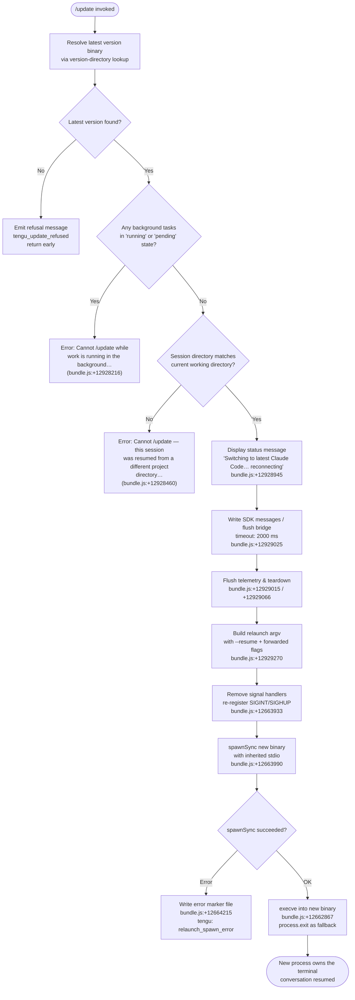

# `/update`

> Analysis basis: CC v2.1.183 bundle.js (AST extraction + Claude interpretation)
> Minimum version: v2.1.183

---

## Overview

The `/update` command performs an in-process upgrade of Claude Code to the latest installed version while preserving the current conversation. It locates the newest available version binary, validates that no background work is actively running and that the current session directory is compatible, then executes a clean teardown of the running process and relaunches via `execve` into the newer binary — handing off all session state so the conversation continues uninterrupted.

---

## Registration

| Field | Value |
|---|---|
| type | `local` |
| name | `update` |
| description | `Switch to the latest version (conversation continues)` |
| isHidden | `true` |
| supportsNonInteractive | `false` |
| module_id | `PLl` |
| load_inline | `true` |
| loc_byte | `12929956` |
| loc_byte_end | `12930197` |
| loc_line | `8550` |
| arbor_handler.name | `Fcf` |
| arbor_handler.fqn | `claude-2.1.183::Fcf` |
| arbor_handler.kind | `AsyncFunction` |
| arbor_handler.resolution_path | `module_id` |
| arbor_handler.n_hits | `0` |

Analysis basis: CC v2.1.183 bundle.js:+12929956

---

## Input Branching

The handler has four distinct guard paths before it commits to the update, plus a multi-stage teardown sequence — Mermaid is used.



---

## Behavioral Spec

### 1. Version Resolution

The handler first determines whether a newer version is available by querying the local version store.

```
async function resolveLatestVersion():
    claudeExecutable = which("claude")           # bundle.js:+12927752
    versionRootDir   = buildVersionDir()          # ~/.local/share/versions  bundle.js:+8493186
    entries          = listVersionEntries(versionRootDir)
    latestEntry      = selectMaxVersion(entries)  # bundle.js:+8493288
    return latestEntry                            # null if no newer version
```

`buildVersionDir` joins the home directory (`os.homedir()`, bundle.js:+7011604) with `.local`, `share`, and `versions` (bundle.js:+7011877, +7011886, +8493186). The `bin` subdirectory path is also resolved (bundle.js:+7011957).

Analysis basis: CC v2.1.183 bundle.js:+12927752 – +12927838

### 2. Pre-flight Guard: Background Task Check

```
function checkNoRunningTasks(appState):
    tasks = Object.values(appState.tasks)        # bundle.js:+12928075
    for task in tasks:
        if task.status == "running" or task.status == "pending":
            emit tengu_update_refused             # bundle.js:+12927852
            raise UserFacingError(
                "Cannot /update while work is running…"
            )                                    # bundle.js:+12928216
```

Analysis basis: CC v2.1.183 bundle.js:+12928113, +12928135, +12928216

### 3. Pre-flight Guard: Session Directory Compatibility

```
function checkSessionDirCompatible(appState, latestBinary):
    sessionWorkDir = appState.workingDirectory
    if sessionWorkDir != process.cwd():
        raise UserFacingError(
            "Cannot /update — this session was resumed from a different project directory…"
        )                                        # bundle.js:+12928460
```

Analysis basis: CC v2.1.183 bundle.js:+12928460

### 4. Status Notification

Before tearing down, the handler appends a user-visible assistant message to the conversation transcript:

```
function notifyUser(conversationIO):
    conversationIO.appendEntry({
        role: "assistant",
        content: [{ type: "text",
                    value: "Switching to latest Claude Code… reconnecting" }]
    })                                           # bundle.js:+12928945
```

The string `"text"` (bundle.js:+12927898) and `"assistant"` (bundle.js:+12926796) are used as content-block type and role values respectively.

Analysis basis: CC v2.1.183 bundle.js:+12928945

### 5. Bridge Flush

```
async function flushBridge(bridgeHandle):
    messageId = generateUUID()                   # MLl / Sjt.randomUUID, bundle.js:+12926820
    writeSdkMessages(bridgeHandle, messageId)    # bundle.js:+12928921
    await timeout(
        Promise.race([bridgeHandle.flush(), delay(2000)]),
        2000,
        "bridge flush"
    )                                            # bundle.js:+12929025, +12929030
```

Timeout value: **2000 ms** (bundle.js:+12929025).

Analysis basis: CC v2.1.183 bundle.js:+12928921 – +12929030

### 6. Teardown Sequence

```
async function teardown(bridgeHandle):
    await bridgeHandle.flush()                   # bundle.js:+12929015
    await bridgeHandle.teardown()                # bundle.js:+12929066
    checkAnimationEnabled()                      # eIe / Ani.isEnabled, bundle.js:+12929172
    buildNewEnv()                                # UCe / String coerce, bundle.js:+12929195
```

Analysis basis: CC v2.1.183 bundle.js:+12929066

### 7. Relaunch Argument Construction

```
function buildRelaunchArgv(originalArgv, sessionId, appState):
    args = Array.from(originalArgv)              # bundle.js:+12664713

    # Always forward session resume
    args.push("--resume", sessionId)             # bundle.js:+12663364

    # Forward optional flags if set in original invocation
    if "cliArg" in originalArgv:                # bundle.js:+12664788
        # include --add-dir entries             # bundle.js:+12664888
        pass
    if originalArgv includes "--allow-dangerously-skip-permissions":
        args.push("--allow-dangerously-skip-permissions")  # bundle.js:+12665003
    if originalArgv includes "--effort":
        args.push("--effort", effortValue)       # bundle.js:+12665145
    if originalArgv includes "--permission-mode":
        args.push("--permission-mode", modeValue)# bundle.js:+12665162

    return args
```

Analysis basis: CC v2.1.183 bundle.js:+12929270, +12664713 – +12665162

### 8. Signal Handler Reset and Exec

```
async function relaunchIntoNewBinary(newBinaryPath, argv, env):
    process.removeAllListeners()                 # bundle.js:+12663933
    process.on("SIGINT",  noopHandler)
    process.on("SIGHUP",  noopHandler)           # bundle.js:+12663923

    result = spawnSync(newBinaryPath, argv,
                 { stdio: "inherit" })           # bundle.js:+12663990, +12664025

    if result.error:
        writeErrorMarkerFile("relaunch_spawn_error")  # bundle.js:+12664215
        process.exit(128)                        # bundle.js:+12664352

    # Preferred: replace this process image
    execve(newBinaryPath, argv, env)             # bundle.js:+12662867
    # Fallback: hard exit
    process.exit(0)                              # bundle.js:+12664239
```

The exec path loads `bun:ffi` (bundle.js:+12662468) and dlopen's the platform libc — `/usr/lib/libSystem.B.dylib` on macOS (bundle.js:+12662512) or `libc.so.6` on Linux (bundle.js:+12662541) — to call the native `execve` syscall, which atomically replaces the process image. Argument encoding uses `utf8` (bundle.js:+12662644) and `Buffer.from` (bundle.js:+12662623).

Analysis basis: CC v2.1.183 bundle.js:+12662468 – +12662878

### 9. Session State Serialised Into the New Process

The relaunch reconstructs the prior session via `Fr` (app-state reader, bundle.js:+12929274) and `Fh` (a secondary state accessor, bundle.js:+12929280), which read back `working_directory`, `allowed_tools`, `disallowed_tools`, `avoid_prompts`, `permission_mode`, `bypassPermissions`, `effort`, `model`, `max_thinking_tokens`, and `flag_settings` (bundle.js:+10852993 – +10853672) before building the forwarded argv.

Analysis basis: CC v2.1.183 bundle.js:+12929274, +10852993 – +10853672

---

## State & Side Effects

| Item | Detail |
|---|---|
| Telemetry: `tengu_update_refused` | Fired when a pre-flight guard rejects the update (background tasks running or no newer version) — bundle.js:+12927852 |
| Telemetry: `tengu_scroll_summary` | Fired during the terminal-scroll/cleanup path (`dDn`) — bundle.js:+7195497 |
| Telemetry: `tengu_amber_creek` | Fired in the fullscreen rendering path (`ved`) — bundle.js:+3545528 |
| Telemetry: `tengu_pewter_brook` | Fired in the output-render path (`Os`) — bundle.js:+3545436 |
| Telemetry: `tengu_bg_dispatch_sigkill_escalate` | Background session escalation during worker teardown — bundle.js:+17275023 |
| Telemetry: `tengu_daemon_control` | Daemon start/stop control events — bundle.js:+17311864 |
| Telemetry: `tengu_config_parse_error` | Config file parse error during version backup — bundle.js:+13969320 |
| Telemetry: `tengu_disable_bypass_permissions_mode` | Recorded if bypass-permissions flag is dropped on relaunch — bundle.js:+3386136 |
| appState changes | `t.getAppState` / `t.setAppState` called to snapshot and restore session context — bundle.js:+12928720, +12928835 |
| Bridge / SDK I/O | `l.writeSdkMessages`, `l.flush`, `l.teardown` drain all in-flight SDK traffic before exec — bundle.js:+12928921, +12929015, +12929066 |
| Signal handlers | All listeners removed via `process.removeAllListeners()`; SIGINT and SIGHUP re-wired to no-ops during handoff — bundle.js:+12663933, +12663963 |
| Process replacement | `execve` syscall replaces the process image (macOS: libSystem.B.dylib; Linux: libc.so.6) — bundle.js:+12662512, +12662541 |
| Error marker file | On `spawnSync` failure, an error marker is written via `Nre.writeFileSync` before `process.exit(128)` — bundle.js:+12664215, +12664352 |
| Hook registration | `qi` / `B2o.register` hook is registered as part of conversation entry append — bundle.js:+69538 |
| Sound | None observed in depth-2 traversal |
| isHidden | Command is hidden from the slash-command menu (registration field) |

---

## Version History

| Version | Change |
|---|---|
| v2.1.183 | Initial analysis |

---

## Common Mistakes

1. **Running `/update` while background tasks are active**: The command immediately refuses with a clear error message if any task is in `"running"` or `"pending"` state. Wait for all background work to finish before retrying.

2. **Using `/update` inside a session resumed from a different project directory**: If the session was started with `--resume` but the working directory has changed since the original session, the command refuses. In this case, restart Claude Code manually with the `--resume` flag pointing to the correct directory.

3. **Expecting `/update` in the command menu**: The command is registered as `isHidden: true`, so it does not appear in autocomplete or help listings; it must be typed in full.

4. **Assuming the update downloads a new version**: `/update` only switches among already-installed local versions under `~/.local/share/versions`. It does not fetch from the network. Use your package manager (`npm`, `brew`, etc.) to install a newer version first.

5. **Confusing the 2-second bridge-flush timeout with a hang**: The command deliberately pauses for up to **2000 ms** (bundle.js:+12929025) to drain in-flight SDK messages before exec. This is expected behavior, not a freeze.

---

## Appendix — Identifier Mapping

> For bundle debugging only. Identifiers change across versions.

| Identifier | Role |
|---|---|
| `Fcf` | Main async handler for `/update` (arbor_handler; resolves via `module_id` from `PLl`) |
| `$Vn` | Version binary locator — finds the latest installed `claude` executable |
| `_A` | Checks for `claude` on PATH via `Bun.which` |
| `Fqo` | Inner `which` wrapper (calls `Bun.which`) |
| `s$` | Builds the version directory path under `~/.local/share/versions` |
| `BUn` | Lists and ranks installed version entries |
| `HA` | Array check utility (`Array.isArray`) |
| `Whe` | Constructs the home-relative path (`.local/share`) |
| `ekn` | Calls `os.homedir()` |
| `Jae` | Constructs the `bin` sub-path within a version entry |
| `Hi` | Determines process role (`bg`, `daemon`, `daemon-worker`) |
| `uNe` | Inner role-classification helper |
| `j` | General logging / debug utility |
| `AT` | Path basename resolver wrapping `path.basename` |
| `Lt` | Logging / trace utility (calls `gx`) |
| `gx` | Low-level logger sink |
| `eO` | Current working directory helper |
| `xIo` | Path-relative helper using `vTl.dirname` |
| `Ar` | Inner path helper (calls `gx`) |
| `Ec` | Another path utility (calls `gx`) |
| `Rue` | Reads original CLI invocation argv |
| `Nne` | Checks for `ant` in an exclusion set (`dHf.has`) |
| `Czn` | Provides the exclusion-set reference for `Nne` |
| `GCo` | Appends a conversation entry (`"last-prompt"`) via `t.appendEntry` |
| `Au` | Conversation-log append helper |
| `qi` | Hook registration helper (`B2o.register`) |
| `De` | Telemetry / error logging pipeline |
| `Ho` | Error construction helper |
| `st` | String coercion primitive |
| `ra` | Log record formatter |
| `eJo` | Inner log-record helper (calls `st`) |
| `Bzc` | Ring-buffer rotate (shift/push on `Ven`) |
| `em` | Async-store reader wrapper |
| `Rx` | Inner store reader (`Xvr.getStore`) |
| `bE` | App-state field extractor used pre-exec |
| `MLl` | UUID generator (`Sjt.randomUUID`) |
| `uu` | Timeout-race helper (`Promise.race` + `setTimeout` + `clearTimeout`) |
| `eIe` | Animation-enabled check (`Ani.isEnabled`) |
| `UCe` | Environment-string coercion for relaunch env block |
| `zDe` | Full relaunch orchestrator — teardown, signal reset, spawnSync, execve |
| `HNt` | Interval canceller (`clearInterval`) |
| `hJr` | Inner interval-clear helper |
| `k3e` | Terminal unmount / cleanup helper |
| `fF` | Supplementary terminal cleanup step |
| `MEn` | Terminal write/restore using ANSI escape codes (`\x1b7`, `\x1b8`) |
| `o$e` | Terminal-capability detector (Ghostty ≥ 1.2.0, iTerm2 ≥ 3.6.6) |
| `JFe` | Terminal feature flag helper |
| `EL` | tmux/screen escape-code filter (`replaceAll`) |
| `Gp` | Terminal geometry helper |
| `T` | General-purpose text/log formatter |
| `dDn` | Scroll-summary writer (fires `tengu_scroll_summary`) |
| `zw` | Scroll-state reader |
| `_ca` | Scroll-position calculator |
| `Hca` | Scroll-animation frame calculator (`Date.now`, `Math.max`, `Math.round`) |
| `hca` | Inner scroll frame helper |
| `Os` | Output-render coordinator (fires `tengu_pewter_brook`) |
| `L2` | Feature-flag set checker (`zqc.has`) |
| `tM` | Animation-enabled branch (`Ani.isEnabled`) |
| `PFr` | String-format utility (`st`) |
| `_Z` | Renderer resolver (`Ced`) |
| `RFr` | Boolean-coerce render helper |
| `Gr` | Render dispatch (`_j`) |
| `ved` | Fullscreen render path (fires `tengu_amber_creek`) |
| `ct` | Core render function (`wxt`, `Lxt`, `I4`, `OHn`, etc.) |
| `nD` | Post-teardown notification helper (`Au`) |
| `XWe` | Telemetry drain (`B2o.drain`) |
| `M3e` | Cleanup-promise factory (`Promise.resolve`, `cDn`) |
| `cDn` | Inner cleanup promise helper |
| `STl` | Binary loader — dlopen libc, call execve via FFI |
| `pVn` | Argument array builder for relaunch |
| `XRe` | Argv-entry filter helper |
| `r_n` | Arg-reconstruction helper (`Ct`, `Boolean`) |
| `Ct` | Config-file backup/migration helper |
| `jt` | Config path resolver |
| `Hko` | Config-file backup utility |
| `q_e` | Config file reader/writer (reads, migrates, copies) |
| `Ebf` | File-watch setup (`B7n.watchFile`) |
| `Fr` | App-state reader for session fields |
| `b6n` | Last-message finder (`ms`) |
| `ms` | Message-store helper |
| `T6n` | Session metadata extractor (`ms`) |
| `mB` | Permission-mode state reader (`ct`, `ts`) |
| `Fh` | Secondary app-state accessor (`e.getAppState`) |
| `f` | Background worker / session manager (broad helper) |
| `M` | Background task executor / scheduler |
| `Bn` | Promise timeout helper (`setTimeout`, `clearTimeout`) |
| `Re` | Feature-ok telemetry emitter (`tengu_feature_ok`) |
| `ke` | Feature-bad telemetry emitter (`tengu_feature_bad`) |
| `YKn` | Low-memory guard helper (fires `tengu_bg_low_mem_mb`) |
| `B$e` | Temp-file cleanup helper (`fT.lstat`, `fT.rm`) |
| `$` | Permission-classifier (`zlt`, `R6`) |
| `NNo` | IPC socket connector (`xZn.connect`, socket auth) |
| `jNo` | Background session lifecycle manager |
| `p` | Forced-shutdown handler (`process.exit`) |
| `dn` | General error formatter |
| `Ue` | Low-level output helper (`ogt`) |
| `R` | Disposable resource wrapper |
| `c` | Async task helper (`Tn`) |
| `Tn` | Inner task helper |
| `a` | MCP client / execve wrapper |
| `n3e` | MCP connection builder |
| `uZn` | MCP connection result applier (`e.applyMcpUpdate`) |
| `mta` | MCP server-info helper (`Szr`) |
| `B1o` | MCP client roster manager |
| `u` | Daemon start/stop controller (`ke`, `Re`, `SG`) |
| `rF` | Daemon start helper (`T4`, `yz.push`) |
| `SG` | Daemon race/shutdown coordinator (`Promise.race`, `process.exit`) |
| `Ee` | String-coerce error helper |
| `eI` | Error-marker file writer (`Nre.writeFileSync`) |
| `n` | Stream / connection name helper |
| `r` | File-system or connection resource |
| `s` | Connection lifecycle helper (`r.add`, `r.delete`) |
| `i` | FFI or connection object |
| `e` | Generic event emitter / component |