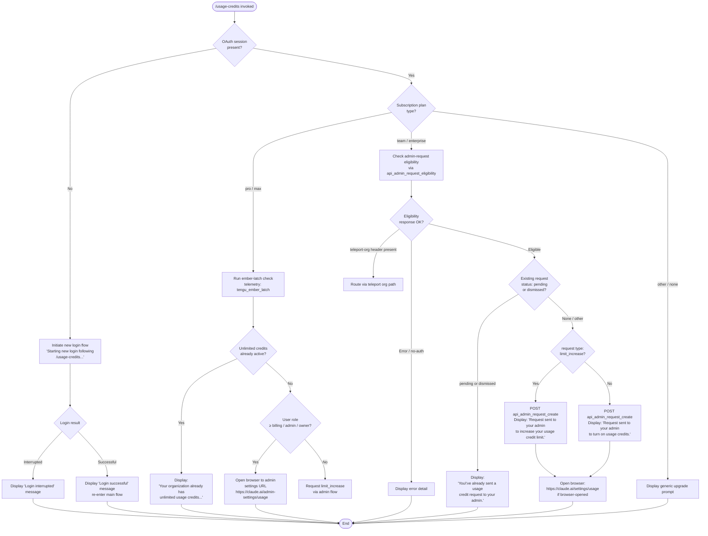

# `/usage-credits`

> Analysis basis: CC v2.1.178 bundle.js (AST extraction + Claude interpretation)
> Minimum version: v2.1.178

---

## Overview

The `/usage-credits` command allows users to configure usage credits when they hit a usage limit under an Anthropic-managed subscription. It determines the user's eligibility to request additional credits, checks whether a request is already pending, submits a new admin request if appropriate, and optionally opens a browser to the relevant usage-settings page. Non-OAuth and non-eligible accounts are handled with dedicated messaging paths.

---

## Registration

| Field | Value |
|---|---|
| type | `local-jsx` |
| name | `usage-credits` |
| description | `Configure usage credits to keep working when you hit a limit` |
| loc_byte | `8779189` |
| loc_byte_end | `8779399` |
| loc_line | `3122` |
| module_id | `d_A` |
| load_inline | `true` |
| arbor_handler.name | `wC6` |
| arbor_handler.fqn | `claude-2.1.178::wC6` |
| arbor_handler.kind | `AsyncFunction` |
| arbor_handler.resolution_path | `module_id` |
| arbor_handler.n_hits | `0` |

Analysis basis: CC v2.1.178 bundle.js:+8779189

---

## Input Branching

The command has more than three distinct runtime paths depending on the account type, subscription plan, admin-request eligibility, and existing pending request state. A Mermaid flowchart is used.



Analysis basis: CC v2.1.178 bundle.js:+8777364, +8730724, +8731155, +8731367, +8731611, +8731697, +8731763, +8732064, +8732105

---

## Behavioral Spec

### Top-level handler (`wC6`)

The main async handler resolves the active session state, determines whether to branch into a login sub-flow or proceed with credit management, then delegates to the UI-rendering component.

```
async function handleUsageCredits(appContext):
    sessionInfo = getSessionContext(appContext)          // calls Yq

    if not sessionInfo.hasOAuthToken:
        log("Starting new login following /usage-credits. Exit with Ctrl-C to use existing account.")
        loginResult = await runLoginFlow(appContext)     // calls Z4
        if loginResult == INTERRUPTED:
            display("Login interrupted")
            return
        display("Login successful")

    planType = getPlanType(sessionInfo)                  // literals: "pro","max","team","enterprise"
    renderUsageCreditsUI(appContext, planType)           // calls gq6
```

Analysis basis: CC v2.1.178 bundle.js:+8777364, +8777431, +8777466, +8777488, +8777700, +8777828, +8778029, +8778048

---

### Auth and session resolution (`$S8`)

Assembles the session context used by the handler: resolves OAuth state, checks subscription-plan identifiers, and initialises the configuration watcher.

```
function resolveSessionContext(appContext):
    oauthState    = getOAuthContext(appContext)          // calls Yq
    credentialSet = loadCredentials(appContext)          // calls lV
    planContext   = resolvePlanContext(oauthState)       // calls O6
    configWatcher = initConfigWatcher(appContext)        // calls xXH
    telemetryCtx  = buildTelemetryContext(appContext)    // calls qq
    return { oauthState, credentialSet, planContext,
             configWatcher, telemetryCtx }
```

Subscription plan values discriminated at runtime: `"pro"`, `"max"`, `"team"`, `"enterprise"` (bundle.js:+8730705, +8730716, +8730816, +8730828).

Analysis basis: CC v2.1.178 bundle.js:+8730644, +8730651, +8730665, +8730724, +8730732

---

### Ember-latch check (`O6`)

Determines whether the organisation already holds unlimited usage credits. Emits `tengu_ember_latch` telemetry on completion.

```
function checkEmberLatch(planContext):
    hasUnlimited = queryEmberLatch(planContext)          // calls vG6, NG6, Xp
    trackEmberLatch(hasUnlimited)                       // telemetry: tengu_ember_latch (loc +8730668)

    if hasUnlimited:
        return { unlimited: true }

    seen = deduplicationSet()                           // uXH.has / uXH.get
    if not seen.has(orgId):
        registerWatcher(orgId, onLatchChange)           // calls o$8, ZG6.add
    return { unlimited: false }
```

Analysis basis: CC v2.1.178 bundle.js:+8730665, +8730668, +3325253, +3325290, +3325325, +3325342, +3325353, +3325365

---

### UI rendering and request orchestration (`gq6`)

Renders the JSX component and coordinates API calls for eligibility, existing requests, and new request creation.

```
async function renderCreditUI(sessionCtx):
    oauthState = getOAuthState(sessionCtx)              // calls Yq
    roleCheck  = checkAdminRole(sessionCtx)             // calls bN
                                                        // roles: "admin","billing","owner","primary_owner"
    usageData  = await fetchUsageData(sessionCtx)       // calls QKH → GET /api/oauth/usage (timeout 5000 ms)
    httpClient = buildHttpClient(sessionCtx)            // calls N
    eligCheck  = await fetchEligibility(sessionCtx)     // calls SEq → api_admin_request_eligibility
    requestList= await fetchAdminRequests(sessionCtx)   // calls IEq → api_admin_request_list
    createFn   = buildCreateRequest(sessionCtx)         // calls kEq → POST api_admin_request_create
    errorHandler= buildErrorHandler(sessionCtx)         // calls CEq
    browserOpen = getBrowserOpener(sessionCtx)          // calls gz
    stringFmt   = getStringFormatter(sessionCtx)        // calls TH
    messageCtx  = buildMessageContext(sessionCtx)       // calls RH
    openBrowser = buildBrowserLauncher(sessionCtx)      // calls h4
    return renderJSX(...)
```

Analysis basis: CC v2.1.178 bundle.js:+8730805, +8730845, +8730873, +8730902, +8731155, +8731367, +8731611, +8731834, +8731844, +8731901, +8731931, +8732222

---

### Usage data fetch (`QKH`)

Fetches current usage figures from the Anthropic API. Handles 401 token-refresh and retry.

```
async function fetchUsageData(sessionCtx):
    authHeaders = buildAuthHeaders(sessionCtx)          // calls sq
    response    = await GET("/api/oauth/usage",
                            timeout=5000,
                            headers={"Content-Type": "application/json"})
    if response.status == 401:
        refreshToken()                                  // calls EZ → iS
        response = retry()
        appendSuffix(" (401→refresh→retry succeeded)")
    if response.status >= 500:
        throw Error(response.data.detail)
    return parseUsageResponse(response)                 // calls ZA, bT
```

API endpoint: `"/api/oauth/usage"` (bundle.js:+8729892).
Timeout: 5000 ms (bundle.js:+8729920).
Auth error strings observed: `"no-auth"` (bundle.js:+8730034), `" (401→refresh→retry succeeded)"` (bundle.js:+8730135).

Analysis basis: CC v2.1.178 bundle.js:+8729725, +8729760, +8729767, +8729797, +8729814, +8729885, +8730002

---

### Admin-request eligibility check (`SEq`)

Calls the eligibility endpoint; routes teleport-org accounts through a separate path.

```
async function checkEligibility(sessionCtx):
    authHeaders = buildAuthHeaders(sessionCtx)          // calls sq
    response    = await GET("api_admin_request_eligibility",
                            headers=authHeaders)
    if response.headers["teleport-org"]:
        return handleTeleportOrg(response)
    if not response.ok:
        throw Error(response.error)
    return response.data
```

Analysis basis: CC v2.1.178 bundle.js:+8729392, +8729395, +8729449, +8729543, +8729575

---

### Existing admin request list (`IEq`)

Retrieves existing admin requests filtered by `statuses` parameter; short-circuits if a `pending` or `dismissed` request is found.

```
async function listAdminRequests(sessionCtx):
    authHeaders = buildAuthHeaders(sessionCtx)          // calls sq
    response    = await GET("api_admin_request_list",
                            params={statuses: ["pending","dismissed"]})
    if response.data contains pending or dismissed:
        displayMessage("You've already sent a usage credit request to your admin.")
        return ALREADY_SENT
    return response.data
```

Status values: `"pending"` (bundle.js:+8731389), `"dismissed"` (bundle.js:+8731399).
Already-sent message text prefix: `"You've already sent"` (bundle.js:+8731458).

Analysis basis: CC v2.1.178 bundle.js:+8729041, +8729044, +8729138, +8729147, +8729173, +8729277

---

### Admin request creation (`kEq`)

POSTs a new admin request with the resolved request type; displays a confirmation message.

```
async function createAdminRequest(sessionCtx, requestType):
    authHeaders = buildAuthHeaders(sessionCtx)          // calls sq
    response    = await POST("/api/oauth/organizations/:orgUUID/admin_requests",
                             body={type: requestType})
    if not response.ok:
        throw Error(response.error)

    if requestType == "limit_increase":
        displayMessage("Request sent to your admin to increase your usage credit limit.")
    else:
        displayMessage("Request sent to your admin to turn on usage credits.")
```

POST endpoint pattern: `"/api/oauth/organizations/:orgUUID/admin_requests"` (bundle.js:+8728836).
Request type values: `"limit_increase"` (bundle.js:+8731159).
Confirmation message prefix for increase: `"Request sent to your admin to increase"` (bundle.js:+8731697).
Confirmation message prefix for enable: `"Request sent to your admin to turn on"` (bundle.js:+8731763).

Analysis basis: CC v2.1.178 bundle.js:+8728776, +8728779, +8728828, +8728927

---

### Error classification (`CEq`)

Wraps Axios error inspection to produce structured error details surfaced in the UI.

```
function classifyError(error):
    if isAxiosError(error):
        if error.response.status >= 500:
            return { kind: "server", detail: error.response.data.detail }
        if error.response.status == 429:
            return { kind: "rate_limit" }
        if error.response.status == 401:
            return { kind: "auth" }
        return { kind: "http_error", status: error.response.status }
    return { kind: "unknown", message: error.message }
```

Analysis basis: CC v2.1.178 bundle.js:+8730255, +8730338, +8730544

---

### Browser launcher (`h4`)

Validates the URL scheme and opens the settings URL in the system browser.

```
async function launchBrowser(url):
    if not url.startsWith("http:") and not url.startsWith("https:"):
        throw Error("Invalid URL scheme")             // calls KV7

    if platform == "darwin":
        spawn("open", [url])                          // calls Dg9 → Iw
    else:
        spawn(platformBrowserCommand, [url])

    return "browser-opened"
```

Admin settings URL: `"https://claude.ai/admin-settings/usage"` (bundle.js:+8732064).
Personal settings URL: `"https://claude.ai/settings/usage"` (bundle.js:+8732105).
Return sentinel: `"browser-opened"` (bundle.js:+8732172).
Scheme literals checked: `"http:"` (bundle.js:+6311178), `"https:"` (bundle.js:+6311200).
macOS command: `"open"` (bundle.js:+6311885).

Analysis basis: CC v2.1.178 bundle.js:+8732222, +6311736, +6311749

---

### Login sub-flow (`jTH`)

Handles the case where no OAuth token is present when the command is invoked: triggers an auth session, applies the resulting token, and reconciles app state.

```
async function runLoginSubflow(appContext):
    onChangeAPIKey(appContext)                          // H.onChangeAPIKey
    applyMessageOp(appContext)                          // H.applyMessageOp

    timestamp = Date.now()                             // calls FQH
    remoteSettings = loadRemoteSettings(appContext)    // calls VA6
    policyLimits   = loadPolicyLimits(appContext)      // calls dy6
    sessionState   = initSessionState(appContext)      // calls kJH
    cleanupHandler = registerCleanupHandler(appContext)// calls N1H
    latchState     = computeLatchState(appContext)     // calls Z4

    prevState = H.getAppState()
    H.setAppState(newState)

    trustedDevice  = enrollTrustedDevice(appContext)   // calls DE6, AGH
    remoteCtrl     = initRemoteControl(appContext)     // calls Lo_, sy6
    permissionMode = resolvePermissionMode(appContext) // calls KC6
    sessionFlags   = resolveSessionFlags(appContext)   // calls b_
    featureFlags   = resolveFeatureFlags(appContext)   // calls u_A, fC6

    log("[bridge:repl] Account changed via /login — disconnecting Remote Control session")
```

Analysis basis: CC v2.1.178 bundle.js:+8725808, +8725827, +8725906, +8725912, +8725918, +8725924, +8725930, +8725963, +8726133, +8726216, +8726306, +8726438, +8726477, +8726580, +8726592, +8726628, +8726663, +8726667, +8726701, +8726707

---

### Unlimited-credits short-circuit message

When the organisation already has unlimited credits active, the command displays a specific terminal message and exits without making any API calls.

```
function handleUnlimitedCredits():
    displayMessage("Your organization already has unlimited usage credits. No request needed.")
    return
```

Full message text prefix: `"Your organization already has unlimited"` (bundle.js:+8731064).

Analysis basis: CC v2.1.178 bundle.js:+8731048, +8731064

---

### Non-admin redirect

When the current user role is not sufficient to manage credits directly, the user is directed to contact their administrator.

```
function handleNonAdminUser():
    displayMessage("Contact your admin to manage usage credit settings.")
```

Message text: `"Contact your admin to manage usage credit settings."` (bundle.js:+8731223).

Analysis basis: CC v2.1.178 bundle.js:+8731223

---

## State & Side Effects

| Item | Detail |
|---|---|
| Telemetry | `tengu_ember_latch` (bundle.js:+8730668) — fired after ember-latch unlimited-credit check |
| Telemetry | `tengu_config_parse_error` (bundle.js:+3351487) — fired on config parse failure in config subsystem |
| Telemetry | `tengu_feature_ok` / `tengu_feature_bad` (bundle.js:+1020153, +1020220) — fired by feature-flag evaluation |
| Telemetry | `tengu_managed_settings_security_dialog_shown/accepted/rejected` (bundle.js:+7208525, +7208906, +7209065) — managed-settings security gate |
| Telemetry | `tengu_policy_limits_fetch` (bundle.js:+7149707) — policy limits fetch result |
| Telemetry | `tengu_disable_bypass_permissions_mode` (bundle.js:+11251918) — bypass-permissions mode change |
| Telemetry | `tengu_auto_mode_config` (bundle.js:+11249807) — auto-mode configuration resolution |
| Telemetry | `tengu_daemon_config_reload` (bundle.js:+17081946) — daemon config reload signal |
| appState changes | `H.getAppState()` / `H.setAppState()` called during login sub-flow to update account and session state |
| Hook registration | Process `"exit"` and `"beforeExit"` listeners registered/cleared by cleanup handler (`$sH`) |
| Hook registration | File watcher registered via `$O8.watchFile` / unregistered via `$O8.unwatchFile` (config watcher `wnf`) |
| Hook registration | `XSA.register` called by `F9` during session initialisation |
| Browser side effect | `open` (macOS) or platform equivalent spawned for settings URLs when credit action completes |
| Credential storage | `KC1` (secure-storage abstraction) read/write/delete operations on credential store during login sub-flow |
| Network I/O | GET `/api/oauth/usage` (5 s timeout), GET `api_admin_request_eligibility`, GET `api_admin_request_list`, POST `/api/oauth/organizations/:orgUUID/admin_requests` |
| Sound | <!-- TODO: not found in depth-2 traversal; needs --depth 4 --> |

---

## Version History

| Version | Change |
|---|---|
| v2.1.178 | Initial analysis |

---

## Common Mistakes

1. **Invoking without an active OAuth session**: The command auto-triggers a login flow, but if that flow is cancelled (Ctrl-C), the command exits without making any credit requests. Ensure an active OAuth session exists before invoking.
2. **Expecting credit requests on non-Claude.ai plans**: Only `pro`, `max`, `team`, and `enterprise` subscription types are handled. Other plans fall through to a generic upgrade prompt without creating an admin request.
3. **Re-invoking after already sending a request**: If a `pending` or `dismissed` request already exists, the command displays an informational message and does not create a duplicate request. This is by design, not a bug.
4. **Assuming browser opens immediately**: The browser launch is conditional — it only fires after a successful POST or when the user holds an admin role. If the user is a non-admin, no browser is opened.
5. **Using on AWS Bedrock / Vertex / Foundry sessions**: The command relies on first-party OAuth (`firstParty` literal at bundle.js:+2121033). Third-party provider sessions (`bedrock`, `vertex`, `foundry`, `mantle`, `anthropicAws`) are not expected to have the `/api/oauth/usage` endpoint available.

---

## Appendix — Identifier Mapping

> For bundle debugging only. Identifiers change across versions.

| Identifier | Role |
|---|---|
| `wC6` | Top-level async handler for `/usage-credits` (arbor_handler) |
| `$S8` | Session-context resolution / auth assembly |
| `Yq` | OAuth state accessor |
| `ZJ_` | OAuth sub-resolver A |
| `EJ_` | OAuth sub-resolver B |
| `Hw` | Auth configuration builder |
| `vL` | Credential loader |
| `Qj` | Profile/auth-type classifier |
| `E4` | App-state updater |
| `tP` | Token provider |
| `SO` | Auth-token orchestrator (handles ANTHROPIC_API_KEY, apiKeyHelper, WIF, etc.) |
| `wG6` | Auth-header builder wrapper |
| `eaH` | HTTP auth-header constructor |
| `lV` | Credential set loader |
| `O6` | Ember-latch / unlimited-credits checker |
| `vG6` | Latch status reader A |
| `NG6` | Latch status reader B |
| `Xp` | Org-context resolver |
| `qp` | Deduplication key builder |
| `o$8` | Per-org watcher registrar |
| `p0_` | Growthbook experiment event emitter |
| `ay_` | Watcher callback dispatcher |
| `S6` | Config file accessor / watcher initiator |
| `n6` | Config path resolver |
| `$k_` | Config serialiser |
| `_MH` | Config read/write/backup implementation |
| `wnf` | File-watch registration handler |
| `xXH` | Config-watcher factory |
| `Z4` | Latch-state / login-status combiner |
| `ZA` | Subscription-plan type checker |
| `cb` | Array/type inclusion utility |
| `qq` | Telemetry context builder |
| `biA` | Telemetry essential-traffic gate |
| `L6` | String normaliser / identity function |
| `gq6` | Usage-credits UI rendering orchestrator |
| `bN` | Admin-role checker (admin/billing/owner/primary_owner) |
| `QKH` | Usage data fetcher (GET /api/oauth/usage) |
| `sq` | Auth header builder |
| `SH` | Feature flag "ok" evaluator |
| `bH` | Feature flag "bad" evaluator |
| `bT` | Plan-type array inclusion checker |
| `H` | Core app-state / context object |
| `EZ` | Axios error handler with token-refresh retry |
| `iS` | Token refresh executor |
| `N` | HTTP client factory / request dispatcher |
| `AM4` | HTTP request method resolver |
| `xH` | JSON serialiser wrapper |
| `d4` | URL path builder |
| `VdH` | URL formatter |
| `LM4` | Chunked HTTP body sender |
| `SEq` | Admin-request eligibility fetcher |
| `IEq` | Admin-request list fetcher |
| `A` | Axios response wrapper |
| `L` | Axios instance |
| `kEq` | Admin-request creator (POST) |
| `CEq` | Axios error classifier |
| `gz` | Browser-open state accessor |
| `TH` | String formatter |
| `RH` | Message context builder / logger |
| `jA` | Error message extractor |
| `RQ4` | Message ring-buffer manager |
| `h4` | Browser launcher (validates URL scheme, spawns OS command) |
| `KV7` | URL scheme validator |
| `Dg9` | OS browser spawn executor |
| `Iw` | Child-process spawner |
| `g8` | Process command builder |
| `jTH` | Login sub-flow orchestrator |
| `FQH` | Timestamp recorder |
| `VA6` | Remote-settings loader |
| `l9q` | Remote-settings initialiser |
| `Ok6` | Remote-settings boot helper |
| `ftA` | Remote-settings fetch initiator |
| `sr` | Remote-settings HTTP fetcher |
| `a7H` | Remote-settings cache reader |
| `_AH` | Remote-settings cache writer |
| `S_` | First-party auth filter |
| `LNH` | Remote-settings logging helper |
| `Fz` | Remote-settings URL builder |
| `Y7` | Remote-settings response parser |
| `FW` | Plan subscription-type guard A |
| `JG6` | Plan subscription-type guard B |
| `tE8` | Remote-settings notify-change dispatcher |
| `LtA` | Change notification payload builder |
| `Qo_` | Remote-settings polling scheduler |
| `x9q` | Polling interval helper |
| `co_` | Remote-settings fetch-and-apply handler |
| `s7H` | Cache-hit evaluator |
| `q9q` | SHA-256 hash builder for settings payload |
| `$F7` | Remote-settings diff applier |
| `alH` | Stale-cache fallback handler |
| `B9q` | Remote-managed-settings security checker |
| `u9q` | Security check dispatcher |
| `m9q` | Settings-apply confirmation handler |
| `F9q` | Atomic settings file writer |
| `d9q` | Deferred-load resolver |
| `c9q` | Remote-settings background-poll controller |
| `YE8` | Interval manager (set/clear) |
| `zF7` | Background-poll cycle executor |
| `F9` | Hook registrar (XSA.register) |
| `dy6` | Policy-limits loader |
| `ur_` | Policy-limits resolver |
| `Ur_` | Policy-limits cache reader |
| `M5H` | Policy-limits applicability checker |
| `JE8` | Policy-limits timeout handler |
| `ab` | Policy-limits response parser |
| `xJH` | Policy-limits path joiner |
| `PE8` | Policy-limits fetch-and-apply handler |
| `j1q` | Policy-limits HTTP fetcher |
| `J1q` | Policy-limits background-poll controller |
| `kJH` | Session-state initialiser |
| `N1H` | Cleanup handler registrar |
| `$sH` | Cleanup executor (clears watchers, sets, process listeners) |
| `ty_` | Interval/listener teardown helper |
| `DE6` | Trusted-device enrolment eligibility checker |
| `Lo_` | Remote-control session initialiser |
| `x_` | Module initialiser (ES module shim) |
| `ec6` | Module export binder |
| `_GH` | Remote-control org-context resolver |
| `tK` | Credential-store facade |
| `KC1` | Credential read/write/delete implementation |
| `sy6` | Trusted-device enrolment executor |
| `zR` | Org-subscription state reader |
| `a79` | Feature-value resolver with org context |
| `bB7` | Remote-control enabled-state reader |
| `_o_` | Remote-control permission-gate checker |
| `K` | Policy enforcement checker |
| `f` | Async task set manager |
| `q` | Process stdio writer |
| `F1` | Fatal-error exit handler |
| `k1` | OAuth endpoint URL builder |
| `JgA` | OAuth base-URL selector |
| `ON4` | OAuth URL validator |
| `Ee6` | Trusted-device enrolment request builder |
| `ZEq` | Remote-control command dispatcher |
| `KC6` | Permission-mode resolver |
| `MS8` | Bypass-permissions mode gate |
| `sy_` | Org-subscription permission mapper |
| `$k6` | Permission-mode dispatcher |
| `dO` | Permission operation applier |
| `b_` | Session flags resolver |
| `tp8` | Allowed-tools flag reader |
| `K1` | Tool-list parser |
| `ep8` | Disallowed-tools flag reader |
| `Nx` | Session-level access-control resolver |
| `u_A` | Feature-flag loader |
| `fC6` | Feature-flag context builder |
| `LC6` | Full feature-context orchestrator |
| `gn` | Feature-gate accessor |
| `C$A` | Feature-gate initialiser |
| `R$A` | Remote-settings feature bridge |
| `d1` | Feature-flag value resolver |
| `BJH` | Model-family membership checker |
| `k76` | Usage-mode resolver |
| `Y` | Terminal output renderer |
| `KG6` | Model-string canonicaliser |
| `e6H` | Provider-capability resolver |
| `jb` | Flag-settings merger |
| `oMH` | Permission-mode change emitter |
| `WzH` | Feature-map serialiser |

---

Note: index built via Arbor fallback; some signals (telemetry, literals) may be missing — see arbor-fallback.js.