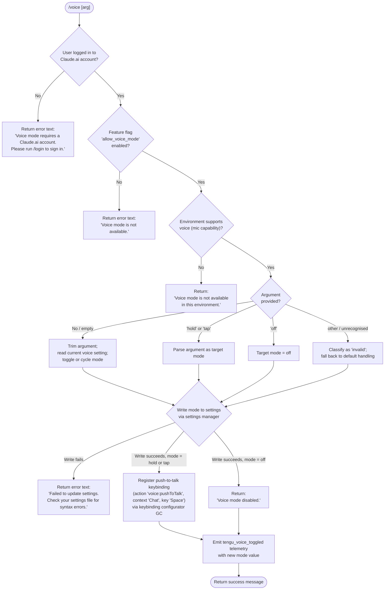

# `/voice`

> Analysis basis: CC v2.1.183 bundle.js (AST extraction + Claude interpretation)
> Minimum version: v2.1.183

---

## Overview

The `/voice` command toggles voice mode in Claude Code, allowing users to switch between **hold**, **tap**, and **off** interaction modes for microphone-driven input. It enforces account, feature-flag, and environment prerequisites before writing the chosen mode to persistent settings, and wires up a push-to-talk keybinding (`Space` in the `Chat` context) when voice is enabled.

---

## Registration

| Field | Value |
|---|---|
| type | `local` |
| name | `voice` |
| description | `Toggle voice mode` |
| argumentHint | `[hold\|tap\|off]` |
| supportsNonInteractive | `false` |
| isHidden | `null` |
| module_id | `yMl` |
| load_inline | `true` |
| loc_byte | `13234014` |
| loc_byte_end | `13234256` |
| loc_line | `8702` |
| arbor_handler.name | `Mmf` |
| arbor_handler.fqn | `claude-2.1.183::Mmf` |
| arbor_handler.kind | `AsyncFunction` |
| arbor_handler.resolution_path | `module_id` |
| arbor_handler.n_hits | `1` |

Analysis basis: CC v2.1.183 bundle.js:+13234014

---

## Input Branching

The command has five or more distinct outcome branches depending on authentication state, feature-flag availability, environment capability, argument value, and settings write success. A Mermaid flowchart is required.



Analysis basis: CC v2.1.183 bundle.js:+13231416 (mode literals), +13231499 (auth check), +13231639 (feature-flag rejection), +13231927 (settings failure), +13232065 (disabled message), +13232309 (environment unavailable), +13233278 (keybinding action literal), +13232010 (telemetry)

---

## Behavioral Spec

### 1. Top-level handler (`Mmf`)

The Arbor-resolved entry point is the async function `Mmf`.

```
async function voiceCommandHandler(args, appContext):

    # Step 1 — authentication gate
    authState = getAuthenticationState(appContext)   # calls Nmt → RKn → hy
    if authState does not include a Claude.ai account:
        return { type: "text",
                 text: "Voice mode requires a Claude.ai account. Please run /login to sign in." }

    # Step 2 — feature-flag gate (flag name: "allow_voice_mode")
    featureFlags = resolveFeatureFlags(authState)    # calls PKn → di
    if "allow_voice_mode" not in featureFlags:
        return { type: "text",
                 text: "Voice mode is not available." }

    # Step 3 — parse and validate argument
    rawArg = args.trim()                             # calls Dmf → e.trim
    mode = parseVoiceMode(rawArg)                    # valid values: "hold", "tap", "off"
    # unrecognised input produces mode = "invalid"

    # Step 4 — environment capability check
    if voice not available in current environment:
        return { type: "text",
                 text: "Voice mode is not available in this environment." }

    # Step 5 — settings write
    success = await writeVoiceSetting(mode, appContext)   # calls co (settings writer)
    if not success:
        return { type: "text",
                 text: "Failed to update settings. Check your settings file for syntax errors." }

    # Step 6 — post-write side effects
    if mode == "off":
        message = "Voice mode disabled."
    else:
        registerKeybinding(action="voice:pushToTalk", context="Chat", key="Space")   # calls GC
        message = buildVoiceEnabledMessage(mode)

    # Step 7 — telemetry
    emit("tengu_voice_toggled", { mode: mode })     # loc_byte 13232010

    return { type: "text", text: message }
```

Analysis basis: CC v2.1.183 bundle.js:+13231499, +13231510, +13231684, +13231693, +13231760, +13231829, +13232008, +13232155, +13233275, +13233409, +13233736

---

### 2. Authentication and account resolution (`Nmt`, `RKn`, `hy`)

```
function resolveAccountState(appContext):
    # hy aggregates multiple sub-systems:
    #   - credential store (dp): reads env vars including ANTHROPIC_API_KEY, oauth tokens
    #   - session store (ib): reads profile-implicit session, user_oauth credential kind
    #   - auth client (Ac): classifies credential as "firstParty" vs third-party
    #   - token source (YT, Ug): validates token; errors if none of
    #       ANTHROPIC_API_KEY, ANTHROPIC_AUTH_TOKEN, CLAUDE_CODE_OAUTH_TOKEN,
    #       or WIF env vars are present
    credentials = loadCredentials()          # dp
    session     = loadSessionProfile()       # ib  (profile-implicit, user_oauth)
    authClass   = classifyAuth(credentials)  # Ac → "firstParty"
    return AccountState{ credentials, session, authClass }
```

Analysis basis: CC v2.1.183 bundle.js:+13220782 (`RKn→hy`), +3048750 (`hy→dp`), +3048848 (`hy→ib`), +3048869 (`hy→Ac`), +3051000 (env var literal), +3047701 (profile-implicit literal), +3047774 (user_oauth literal), +2126844 (firstParty literal)

---

### 3. Feature-flag resolution (`PKn`, `di`)

```
function resolveFeatureFlags(accountState):
    # di checks two flag sets (yJu and EJu membership maps),
    # consults an "allow_product_feedback" flag,
    # and specifically tests for "allow_voice_mode".
    # If the account belongs to "enterprise" or "team" plan tiers,
    # plan-specific flag overrides may apply.
    flags = readPolicyFlagSets(accountState)   # oAi → Cz → pB
    if "allow_voice_mode" not in flags:
        return UNAVAILABLE
    return flags
```

Analysis basis: CC v2.1.183 bundle.js:+13220737 (`PKn→di`), +13220740 (`allow_voice_mode` literal), +3344080 (`allow_product_feedback`), +3344008 (`di→oAi`), +3343779 (enterprise literal), +3343814 (team literal)

---

### 4. Argument parsing (`Dmf`)

```
function parseVoiceMode(rawArg):
    trimmed = rawArg.trim()
    if trimmed == "hold":   return "hold"
    if trimmed == "tap":    return "tap"
    if trimmed == "off":    return "off"
    if trimmed == "":       return <current-mode-toggle>
    return "invalid"
```

Valid mode string constants and their byte offsets:
- `"hold"` — bundle.js:+13231416
- `"tap"` — bundle.js:+13231428
- `"off"` — bundle.js:+13231439
- `"invalid"` — bundle.js:+13231460

---

### 5. Settings write (`co` — settings manager)

```
async function writeVoiceSetting(mode, context):
    # co orchestrates:
    #   1. Resolve settings paths (J9 → ".claude/settings.json",
    #                              ".claude/settings.local.json")
    #   2. Read current settings from disk (eQ → readFileSync with UTF-8/UTF-16 BOM detection)
    #   3. Merge voice mode into settings object
    #   4. Atomic write: write to temp file → fsync → rename (MSt)
    #   5. Check gitignore to avoid accidental commits (Ves → qr)
    #   6. Clear caches (mH → Szt.clear, ctr.clear)
    paths    = resolveSettingsPaths()       # J9
    current  = readSettingsFromDisk(paths)  # eQ
    merged   = mergeVoiceMode(current, mode)
    ok       = atomicWriteSettings(paths, merged)   # MSt
    clearSettingsCache()                    # mH
    return ok
```

Settings file paths (bundle.js:+1313104, +1313114, +1313176):
- `.claude/settings.json` (user settings)
- `.claude/settings.local.json` (local settings)

Analysis basis: CC v2.1.183 bundle.js:+13231829, +1332446, +1332573, +1333049, +1333191, +1333216

---

### 6. Keybinding registration (`GC`)

When voice mode is set to `hold` or `tap`, the handler invokes the keybinding configurator.

```
function registerVoiceKeybinding():
    # GC loads keybindings.json via _kt,
    # validates the "bindings" array structure,
    # then registers:
    #   action  = "voice:pushToTalk"
    #   context = "Chat"
    #   key     = "Space"
    # Duplicate entries are deduplicated (zBr tracks duplicates).
    loadKeybindingConfig()      # _kt → UCi.readFileSync("keybindings.json")
    validateBindingsArray()     # aSn, YBr
    upsertBinding(action="voice:pushToTalk", context="Chat", key="Space")
    persistKeybindingConfig()   # dSn → kCi → Uld
```

Literal constants:
- Action: `"voice:pushToTalk"` — bundle.js:+13233278
- Context: `"Chat"` — bundle.js:+13233297
- Key: `"Space"` — bundle.js:+13233304
- Config file: `"keybindings.json"` — bundle.js:+3974067
- Required top-level key: `"bindings"` — bundle.js:+3976137

Analysis basis: CC v2.1.183 bundle.js:+13233275, +3975833, +3976065, +3977079

---

### 7. Environment availability check

```
function checkVoiceEnvironmentAvailability(appContext):
    # pWe checks the runtime locale/environment set:
    # - converts environment identifier to lowercase
    # - tests membership in EUo (known-capable environment set)
    # - may split on "." for sub-environment tags
    # Default language hint: "en" (bundle.js:+5196)
    envId = getEnvironmentIdentifier().toLowerCase()
    if envId not in VOICE_CAPABLE_ENVIRONMENTS:
        return false
    return true
```

Analysis basis: CC v2.1.183 bundle.js:+13233409, +5208, +5258, +5323, +5196

---

### 8. Microphone permission guidance

When voice mode is enabled on macOS, the system surfaces a permission hint pointing users to:

`"System Settings → Privacy & Security → Microphone"` — bundle.js:+13232816

---

## State & Side Effects

| Item | Detail |
|---|---|
| Telemetry: `tengu_voice_toggled` | Fired on every successful mode change (loc_byte: +13232010). Payload includes the new mode value. |
| Telemetry: `tengu_feature_ok` | Fired by the feature-gate helper when a flag check succeeds (loc_byte: +1021887). |
| Telemetry: `tengu_feature_bad` | Fired by the feature-gate helper on flag check failure (loc_byte: +1021954). |
| Telemetry: `tengu_feature_sad` | Fired by the feature-gate helper on unexpected error (loc_byte: +1022035). |
| Telemetry: `tengu_keybinding_fallback_used` | Fired when a keybinding action name cannot be resolved (loc_byte: +3983071). |
| Telemetry: `tengu_custom_keybindings_loaded` | Fired after keybindings.json is successfully loaded (loc_byte: +3973973). |
| Telemetry: `tengu_keybinding_customization_release` | Fired during keybinding config processing (loc_byte: +3973553). |
| Telemetry: `tengu_config_parse_error` | Fired if settings JSON cannot be parsed (loc_byte: +13969320). |
| Settings write | Atomically updates `.claude/settings.json` with the new voice mode. Uses temp-file + fsync + rename pattern via `MSt`. |
| Settings cache clear | `mH` clears `Szt` and `ctr` caches after write (loc_byte: +34016, +34028). |
| Keybinding registration | Writes `"voice:pushToTalk"` binding to `keybindings.json` when mode is `hold` or `tap`. |
| appState changes | Voice mode field updated in application state; MCP servers re-evaluated via `a → n3e → B1o` pathway when settings change. |
| Sound | No audio playback triggered by the command itself; microphone access is subsequently mediated by the voice subsystem (`pn`). |

---

## Version History

| Version | Change |
|---|---|
| v2.1.183 | Initial analysis |

---

## Common Mistakes

1. **Running `/voice` without a Claude.ai account**: The command requires an authenticated Claude.ai session (`user_oauth` credential kind). Using only an `ANTHROPIC_API_KEY` without a linked account will produce the login prompt rather than toggling voice mode.
2. **Passing an unrecognised argument**: Only `hold`, `tap`, and `off` are valid. Any other string is classified as `"invalid"` and may not produce the expected toggle behaviour.
3. **Running in a non-interactive or unsupported environment**: `supportsNonInteractive` is `false`; attempting to use `/voice` in a non-interactive pipeline will be rejected before the handler is called.
4. **Settings file with syntax errors**: If `.claude/settings.json` contains invalid JSON, the write step will fail with the message `"Failed to update settings. Check your settings file for syntax errors."` — fix the file manually before retrying.
5. **Missing microphone permission on macOS**: After enabling voice mode, if the OS has not granted microphone access, the user must navigate to `System Settings → Privacy & Security → Microphone` to grant permission to the terminal application.
6. **Assuming voice is available in all plans**: The `allow_voice_mode` feature flag must be present for the account. Enterprise and team plan users may have different flag states; the command reports `"Voice mode is not available."` if the flag is absent.

---

## Appendix — Identifier Mapping

> For bundle debugging only. Identifiers change across versions.

| Identifier | Role |
|---|---|
| `Mmf` | Top-level async voice command handler (Arbor-resolved entry point) |
| `Nmt` | Authentication state orchestrator |
| `RKn` | Account resolver sub-step |
| `hy` | Credential and session aggregator |
| `dp` | Credential/environment variable reader |
| `ib` | Session profile loader (profile-implicit, user_oauth) |
| `Ac` | Auth classifier ("firstParty" / third-party) |
| `YT` | Token source resolver |
| `Ug` | Token validator; throws if no valid auth env var present |
| `vLt` | Auxiliary auth helper |
| `AJe` | Auth sub-utility |
| `ab` | Account state reader |
| `Zjt` | Auth state transition helper |
| `PKn` | Feature-flag resolution entry |
| `di` | Feature-flag set evaluator (checks `allow_voice_mode`, `allow_product_feedback`) |
| `oAi` | Flag set loader (feeds into `Cz`) |
| `pB` | Policy flag reader |
| `ra` | Essential-traffic flag helper |
| `Eme` | Flag merge utility |
| `Cz` | Flag cache / flag set combiner |
| `Gr` | Performance/telemetry tracing entry |
| `_j` | Settings loader dispatcher |
| `hx` | Settings file path helper (sub-routine of `_j`) |
| `ha` | Memory-usage sampler (perf_hooks) |
| `v9` | Requires `perf_hooks` module |
| `Ihr` | Settings-load main body (emits `settings_load_started` / `settings_load_completed`) |
| `Ln` | File-append logger |
| `Tzt` | Settings timestamp helper |
| `xbt` | Flag-settings set manager |
| `Vns` | Policy-settings loader |
| `LSe` | Settings path resolver (userSettings, projectSettings, localSettings) |
| `Hj` | Settings merge step 1 |
| `Wns` | SDK inline settings applicator |
| `B2` | Settings bundle assembler |
| `Ar` | Generic utility (used by settings and logger) |
| `Qgt` | Settings sub-loader A |
| `Mnr` | Settings sub-loader B |
| `Ygt` | Settings sub-loader C |
| `ZRe` | Settings sub-loader D |
| `ePe` | Settings sub-loader E |
| `eHt` | Settings sub-loader F |
| `Ioe` | Settings sub-loader G |
| `kSe` | Settings sub-loader H |
| `$nn` | Settings sub-loader I |
| `lrs` | Settings sub-loader J |
| `iQ` | Settings sub-loader K |
| `kbt` | WSL environment detector |
| `bzt` | Settings-load finaliser |
| `e8t` | Voice environment capability resolver (used immediately after auth check) |
| `Dmf` | Argument parser — trims and classifies `hold`/`tap`/`off`/`invalid` |
| `co` | Settings manager — reads, merges, and atomically writes settings files |
| `QA` | Settings read helper (calls `LSe`, `B2`) |
| `jt` | Path utilities wrapper |
| `Thr` | Settings write orchestrator |
| `bv` | Settings file I/O helper |
| `eQ` | File reader with BOM detection (UTF-8 / UTF-16) |
| `jp` | File canonicalisation (realpathSync) |
| `T` | String/path normaliser |
| `Zen` | File encoding helper |
| `etn` | Encoding detection helper |
| `Mn` | Directory utilities |
| `dn` | Directory-name utility |
| `RAr` | Settings-write timestamp recorder |
| `c1e` | Settings cache invalidator |
| `knn` | Settings path builder |
| `MSt` | Atomic file writer (temp → fsync → rename) |
| `vKe` | File permission helper (EINVAL/ENOTSUP/EPERM/ENOSYS guard) |
| `Pe` | JSON serialiser |
| `mH` | Settings cache clearer (clears `Szt` and `ctr`) |
| `Ves` | Gitignore checker |
| `Mt` | Async-local store reader |
| `Qen` | Store getter (`Jen.getStore`) |
| `hAr` | Git helper (check-ignore, ls-files) |
| `Btn` | Git-ignore rule evaluator |
| `qr` | Git command runner |
| `QXc` | Global gitignore path resolver |
| `Wes` | Git ls-files runner |
| `qes` | Git ignore-rule result classifier |
| `J9` | Settings path joiner (`.claude/settings.json`) |
| `Pt` | Feature-ok telemetry emitter |
| `j` | Base render / UI primitive |
| `Ue` | UI element constructor |
| `ogt` | Root UI component |
| `De` | Error logger / display |
| `Ho` | Error formatter |
| `st` | String coercer |
| `Bzc` | Rolling-window log buffer |
| `GC` | Keybinding configurator (registers `voice:pushToTalk` in `Chat` context) |
| `uSn` | Keybinding loader entry |
| `_kt` | Keybinding config main loader |
| `XBr` | Keybinding schema validator |
| `D8` | Keybinding persistence helper |
| `hc` | Keybinding context registry |
| `aAe` | Keybinding file path resolver (`keybindings.json`) |
| `Gt` | JSON parser |
| `aSn` | Array-structure validator |
| `oSn` | Keybinding entry serialiser |
| `FCi` | Keybinding render helper |
| `zBr` | Duplicate keybinding detector |
| `YBr` | Keybinding block builder |
| `dSn` | Keybinding config writer |
| `t3r` | Keybinding file writer sub-step |
| `e3r` | Keybinding file write finaliser |
| `kCi` | Keybinding list formatter |
| `Uld` | Keybinding entry formatter |
| `Qe` | Keybinding UI component |
| `pWe` | Environment/locale capability checker |
| `Ct` | Config state reader (reads global config via `q_e`) |
| `Hko` | Config accessor guard |
| `q_e` | Global config loader (reads config file, applies migrations) |
| `V9` | Config version prefix stripper |
| `RFl` | Config backup reader |
| `Sko` | Config backup path builder |
| `Ebf` | Config file watcher |
| `Kq` | Config watch debouncer |
| `qi` | Signal/interrupt registration helper |
| `pn` | Voice/audio subsystem controller |
| `a` | MCP manager — coordinates server state after settings changes |
| `n3e` | MCP server collection manager |
| `dW` | MCP server discovery orchestrator |
| `Ort` | MCP server capability resolver |
| `W7` | MCP server connection builder |
| `k5` | SDK MCP source reader |
| `NLn` | MCP error colourer |
| `Mrt` | SSE/HTTP MCP connection handler |
| `Nk` | MCP server capability mapper |
| `P_` | MCP capability output formatter |
| `EKr` | MCP capability auxiliary formatter |
| `Wn` | Timeout/scheduler utility |
| `l1t` | MCP server list sorter |
| `pra` | MCP connection attempt executor |
| `w7r` | MCP connection state preparator |
| `Vwe` | MCP server fingerprint / hash builder |
| `Phn` | MCP capabilities hash helper |
| `Ohn` | MCP tool schema hasher |
| `EI` | MCP hash formatter |
| `Mhn` | MCP descriptor hasher |
| `dc` | Hash digest helper |
| `on` | MCP debug logger |
| `oxn` | MCP OAuth connection handler |
| `Lr` | MCP connection limiter |
| `CBd` | MCP OAuth flow driver |
| `vBd` | MCP OAuth callback handler |
| `Sra` | MCP reconnection scheduler |
| `ci` | Async-local context reader |
| `d0n` | MCP needs-auth cache path builder |
| `OKr` | MCP tool schema applier |
| `Ee` | Error stringifier |
| `m` | Worker kill iterator |
| `k` | Background worker controller |
| `Uk` | MCP skills telemetry emitter |
| `ct` | MCP skill set builder |
| `yKr` | Voice/platform capability inclusion checker |
| `w` | Background worker lifecycle manager |
| `kz` | Worker blur/focus state tracker |
| `L` | Background worker sweep scheduler |
| `v` | Worker state machine |
| `Dec` | Worker state history reader |
| `Cu` | MCP error logger |
| `gra` | MCP async iterator (JSON-RPC stream) |
| `U8` | JSON-RPC stream reader |
| `Hot` | MCP server port parser |
| `p0n` | MCP port parser variant |
| `uZn` | MCP connection result applier |
| `t3e` | MCP tool schema re-hasher |
| `fw` | MCP cleanup orchestrator |
| `hot` | MCP server fingerprint re-hasher |
| `mta` | MCP server restart scheduler |
| `Szr` | MCP retry strategy |
| `l` | Daemon status poller |
| `k0l` | Daemon status file reader |
| `CQ` | Config version reader |
| `Mjt` | Daemon status path builder |
| `B1o` | MCP full-refresh orchestrator |
| `jLn` | MCP tool permission checker |
| `Bn` | Abort-signal timeout helper |
| `c` | Termination signal wrapper |

Note: index built via Arbor fallback; some signals (telemetry, literals) may be missing — see arbor-fallback.js.