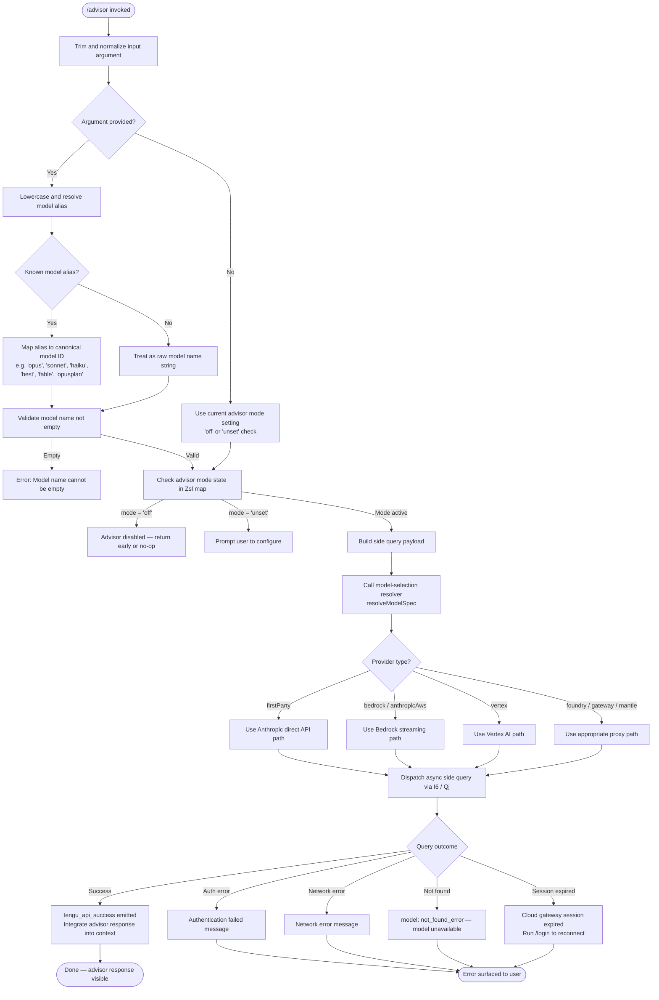

# `/advisor`

> Analysis basis: CC v2.1.185 bundle.js (AST extraction + Claude interpretation)
> Minimum version: v2.1.185

---

## Overview

The `/advisor` command allows the active Claude session to consult a stronger or more capable model at designated decision points within a task. Rather than replacing the current model, it routes a side query to a peer model (a "side query" call) and integrates the response back into the current agent context. The command operates as a local JSX-rendered UI component that drives model selection, argument parsing, and asynchronous query dispatch.

---

## Registration

| Field | Value |
|---|---|
| type | `local-jsx` |
| name | `advisor` |
| description | `Let Claude consult a stronger model at key moments` |
| argumentHint | `[ ... ]` |
| isHidden | `null` (not hidden) |
| module_id | `iLl` |
| load_inline | `true` |
| loc_byte | `12903747` |
| loc_byte_end | `12904003` |
| loc_line | `8544` |
| arbor_handler.name | `mcf` |
| arbor_handler.fqn | `claude-2.1.185::mcf` |
| arbor_handler.kind | `AsyncFunction` |
| arbor_handler.resolution_path | `module_id` |
| arbor_handler.n_hits | `2` |

Analysis basis: CC v2.1.185 bundle.js:+12903747

---

## Input Branching

The command involves more than three distinct code paths based on argument parsing, model tier matching, advisor mode state, and query dispatch outcomes. A Mermaid flowchart is used.



Analysis basis: CC v2.1.185 bundle.js:+12903195 (handler entry), +12903271 (mode literals), +11282870 (empty-name guard), +11283606 (auth error string), +11283708 (network error string), +3017035 (session expired string)

---

## Behavioral Spec

### 1. Handler Entry and Argument Normalization (`mcf`)

The primary handler (`mcf`) is an `AsyncFunction` resolved via module `iLl`.

```
async function advisorHandler(rawInput, context):
    trimmedInput = rawInput.trim()                        // +12903195
    // Render JSX shell for command UI                    // +12903231
    renderAdvisorComponent(context)

    if trimmedInput is empty:
        advisorAlias = null
    else:
        advisorAlias = trimmedInput
    
    // Delegate to model-resolution and arg-processing pipeline
    result = await resolveAndDispatch(advisorAlias, context)  // +12903349, +12903363
    return result
```

Analysis basis: CC v2.1.185 bundle.js:+12903195

---

### 2. Model Alias Resolution (`_s` / modelAliasResolver)

The alias resolver (`_s`) normalizes user-supplied strings into canonical model IDs. It checks lowercase aliases and a set of known provider prefixes.

```
function resolveModelAlias(rawAlias, context):
    trimmed = rawAlias.trim()                         // +2291812
    lower   = trimmed.toLowerCase()                  // +2291823

    // Check if alias matches a known tier keyword
    switch lower:
        case "fable":     return "claude-fable-5"    // +2291889, +2276625
        case "opusplan":  return <opusplan model>    // +2291951
        case "sonnet":    return <sonnet model>      // +2291992
        case "haiku":     return <haiku model>       // +2292031
        case "opus":      return <opus model>        // +2292070
        case "best":      return <best/highest model> // +2292104
        case "off":       advisor mode = off          // +12903271
        case "unset":     advisor mode = unset        // +12903282

    // Apply provider-specific prefix rules
    providerPrefix = resolveProviderPrefix(lower)   // +2291841 (yH)
    
    // Strip or rewrite model name per platform conventions
    canonical = applyModelNameRewrite(lower)        // +2291851 (Bl), +2291869 (PR)

    return canonical
```

Known canonical model IDs referenced at depth ≤ 2 include (among others):
- `claude-fable-5` (+2276625), `claude-mythos-5` (+2288479), `claude-opus-4-8` through `claude-opus-4-0` (+2288536–+2288853), `claude-sonnet-4-6` (+2288885), `claude-sonnet-4-5` (+2288946), `claude-sonnet-4-0` (+2289041), `claude-haiku-4-5` (+2289075), `claude-3-7-sonnet` (+2289134), `claude-3-5-sonnet` (+2289195), `claude-3-5-haiku` (+2289256), `claude-3-opus` (+2289315), `claude-3-sonnet` (+2289368), `claude-3-haiku` (+2289425).
- The preview alias `claude-mythos-preview` is also referenced (+3028940).

Analysis basis: CC v2.1.185 bundle.js:+2291812

---

### 3. Advisor Mode State Management (`t6t` / advisorModeManager)

Mode state is tracked in a `Zsl` map (a `Map<modelName, modeValue>`).

```
async function advisorModeManager(input, context):
    trimmed = input.trim()                          // +11282833
    
    // Validate non-empty model name
    if trimmed is empty:
        throw Error("Model name cannot be empty")  // +11282870

    // Resolve model list for the session
    modelList = buildModelList(context)            // +11282904 (ul)
    
    lower = trimmed.toLowerCase()                  // +11283018
    
    // Validate model against known supported set
    if lower not in supportedModelsSet:            // +11283037 (Sfe.includes)
        handleUnsupportedModel(lower)
    
    // Check current advisor state for this model
    existingMode = Zsl.has(lower)                  // +11283139

    // Invoke side-query infrastructure
    sideQueryResult = await runSideQuery(lower, context)  // +11283184 (I6)

    // Persist new mode into Zsl map
    Zsl.set(lower, newMode)                        // +11283347

    // Resolve alias for display label
    displayLabel = resolveAliasForLabel(lower)     // +11283388 (Ajp)

    // Cache control annotation: "ephemeral" cache type used   // +11283328
    // Validation purpose: "model_validation"                  // +11283234
    // Priority hint set to "Hi"                               // +11283303
```

Analysis basis: CC v2.1.185 bundle.js:+11282833

---

### 4. Side Query Dispatch (`I6` / sideQueryDispatcher)

The side query is the core mechanism through which the advisor model is consulted. This is a substantial async pipeline.

```
async function sideQueryDispatcher(modelSpec, userMessage, context):
    // Build user message payload
    userPayload = { role: "user", content: [{ type: "text", text: userMessage }] }
    // +8781172 ("user"), +8781270 ("text")

    // Hash model name for deduplication
    modelHash = createHash("sha256", modelName).slice(0, 3)  // +8780612, +8780639, +8780654
    // Hash truncation uses first 4, 7, or 20 chars          // +8780534, +8780536, +8780538

    // Determine if provider supports structured_outputs
    if supportsStructuredOutputs(modelSpec):                 // +8781735
        enableStructuredOutputs = true

    // Resolve provider: firstParty, bedrock, vertex, foundry, mantle, gateway
    provider = resolveProvider(modelSpec)

    // Build auth token and headers
    token = await getAuthToken(context)                      // Qj → I.getToken +3020432
    headers = buildHeaders(token, sessionId, agentId)
    // Headers include: "User-Agent", "X-Claude-Code-Session-Id",
    //   "x-claude-remote-container-id", "x-client-app",
    //   "x-claude-code-agent-id", "x-claude-code-parent-agent-id"
    //   "x-app": "cli-bg" or "cli"
    // +3015871, +3015884, +3015893, +3015899, +3015917, +3015961, +3016002, +3016041, +3016075

    // Set timeout: 600000 ms (10 minutes), with retry limit 10
    // +3016826, +3016834

    // Dispatch streaming request
    stream = await dispatchAPICall(modelSpec, userPayload, headers, {
        timeout: 600000,
        maxRetries: 10
    })

    // Annotate as side_query type                          // +8781607
    stream.queryType = "side_query"

    // Handle streaming response
    for chunk in stream:
        processChunk(chunk)                                  // MWu branch

    // On success: emit telemetry
    emit("tengu_api_success")                               // +8783278

    // Integrate response back into agent context
    return collectedResponse
```

Analysis basis: CC v2.1.185 bundle.js:+8781607

---

### 5. Provider-Specific Routing (`Qj` / apiRequestOrchestrator)

The orchestrator selects and configures the transport layer based on the resolved provider.

```
function routeByProvider(provider, payload, headers):
    switch provider:
        case "firstParty":
            // Direct Anthropic API: https://api.anthropic.com   // +2340618
            // AbortSignal.timeout: 10000 ms                     // +2340741
            return anthropicDirectCall(payload, headers)

        case "bedrock" / "anthropicAws":
            // Bedrock-specific header: "X-Amzn-Bedrock-Service-Tier"  // +3017529
            // Streaming endpoint: /invoke-with-response-stream         // +3025273
            // Event stream content-type: vnd.amazon.eventstream        // +3025949
            return bedrockStreamCall(payload, headers)

        case "vertex":
            // streamRawPredict path                              // +3025317
            return vertexCall(payload, headers)

        case "foundry":
            // Resource: unknown-foundry-resource if unresolved  // +2344157
            return foundryCall(payload, headers)

        case "gateway" / "mantle":
            // Azure Cognitive Services default scope             // +3018344
            return gatewayCall(payload, headers)

    // Session expiry guard:
    if sessionExpired:
        throw Error("Cloud gateway session expired — run /login to reconnect.")
        // +3017035
```

Analysis basis: CC v2.1.185 bundle.js:+3016878

---

### 6. Model Name Validation Guard (`hjp` / modelAliasValidator)

Before side-query dispatch, alias strings are validated against known tier tokens.

```
function validateModelAlias(rawAlias, supportedList):
    lower = rawAlias.toLowerCase()                          // +11284158
    
    // Check hyphen and underscore variants for each tier
    knownTokens = [
        "fable-5", "fable_5",                              // +11284188, +11284211
        "opus-4-8", "opus_4_8",                            // +11284288, +11284312
        "opus-4-7", "opus_4_7",                            // +11284357, +11284381
        "opus-4-6", "opus_4_6",                            // +11284426, +11284450
        "opus-4-5", "opus_4_5",                            // +11284495, +11284519
        "sonnet-4-6", "sonnet_4_6",                        // +11284564, +11284590
        "sonnet-4-5", "sonnet_4_5",                        // +11284639, +11284665
        ...
    ]
    
    matched = lower in knownTokens                          // +11284177 (t.includes)
    if not matched:
        // Surface error: model tier not recognized
        raiseModelNotFoundError(lower)                      // +11283827 ("not_found_error")
    
    return matched
```

Analysis basis: CC v2.1.185 bundle.js:+11284140

---

### 7. Context Formatter and Prompt Builder (`s0e` / contextFormatter)

Before dispatching, the context message is formatted to match the advisor model's expected input structure.

```
function buildAdvisorContext(conversationContext, modelSpec):
    // Build model-specific context block
    modelBlock = resolveModelContext(modelSpec)              // +8916538 (ul)
    
    // Retrieve provider-specific flags
    providerFlags = resolveProviderFlags(modelSpec)         // +8916619 (Fo)
    
    // Apply window/context shaping
    shapedContext = shapeContext(conversationContext, providerFlags)
    // +8916627 (wio) → Fo, _s, Lr, Yoe, WK, SYe, Nun

    return { modelBlock, shapedContext }
```

Analysis basis: CC v2.1.185 bundle.js:+8916538

---

## State & Side Effects

| Item | Detail |
|---|---|
| Telemetry: `tengu_api_success` | Emitted on successful side-query API response (+8783278) |
| Telemetry: `tengu_lone_surrogate_sanitized` | Emitted when surrogate characters are sanitized in response (+8782974) |
| Telemetry: `tengu_prompt_cache_1h_config` | Emitted when `1h` prompt-cache configuration is applied (+13722282) |
| Telemetry: `tengu_bg_retire_pinned_low_mem` | Emitted when background workers are retired under memory pressure (+17279714) |
| Telemetry: `tengu_bg_prewarm_per_sweep` | Emitted during background worker pre-warm sweeps (+17279835) |
| Telemetry: `tengu_bg_attach_upgrade` | Emitted on background-worker attach/upgrade (+13292391) |
| Telemetry: `tengu_bg_retire_grace_bridged_min` | Emitted on grace-period worker retirement (+13292319) |
| Telemetry: `tengu_scheduled_task_fire` | Emitted when a scheduled task fires (+16743073) |
| Telemetry: `tengu_scheduled_task_missed` | Emitted when a scheduled task is missed (+16742322) |
| Telemetry: `tengu_scheduled_task_expired` | Emitted when a scheduled task expires (+16743416) |
| Telemetry: `tengu_daemon_yield` | Emitted when the daemon yields to a foreground process (+17295300) |
| `Zsl` map (advisor mode state) | Stores per-model advisor mode values; read via `Zsl.has` (+11283139) and written via `Zsl.set` (+11283347) |
| Cache control | Side-query requests annotate cache blocks as `ephemeral` (+11283328); `1h` cache configuration also supported (+8782496) |
| `appState` changes | Advisor mode toggle modifies session-level advisor state tracked in the `Zsl` map; model-level state is persisted for the duration of the session |
| Side-query token | Auth token is retrieved and validated before dispatch; OAuth token check emits log markers `[API:auth] OAuth token check starting` / `complete` (+3016454, +3016508) |
| Network request | `fetch` call to Anthropic API or cloud provider endpoint; subject to 600 s timeout (+3016826) and 10 retry maximum (+3016834) |
| Sound | <!-- TODO: not found in depth-2 traversal; needs --depth 4 --> |
| Hook registration | <!-- TODO: not found in depth-2 traversal; needs --depth 4 --> |

---

## Version History

| Version | Change |
|---|---|
| v2.1.185 | Initial analysis |

---

## Common Mistakes

1. **Supplying an unrecognized model name** — The handler validates input against a known model list (`Sfe.includes`, +11283037). An unrecognized string that doesn't match any alias or canonical model ID results in a `not_found_error` (type: `not_found_error`, +11283827). Use the documented aliases (`opus`, `sonnet`, `haiku`, `fable`, `best`) or exact canonical IDs.

2. **Setting advisor to `off` and expecting it to fire** — When the advisor mode is `off` (+12903271), the command is effectively a no-op. The mode must be set to an active model to enable consultation.

3. **Relying on advisor in environments with session expiry** — If the cloud gateway session has expired, the command will surface the message "Cloud gateway session expired — run /login to reconnect." (+3017035). Run `/login` first.

4. **Providing a model string with leading/trailing spaces** — The handler calls `.trim()` on input (+12903195, +11282833), so whitespace is stripped, but callers should not assume partial model names (e.g., `opus-4`) are auto-completed — they are validated literally after normalization.

5. **Assuming the advisor runs on the same provider as the primary model** — The advisor performs its own provider resolution (`resolveProvider`). The consulting model may use a different API path (firstParty vs. Bedrock vs. Vertex) than the current session model.

---

## Appendix — Identifier Mapping

> For bundle debugging only. Identifiers change across versions.

| Identifier | Role |
|---|---|
| `mcf` | Primary async handler for `/advisor` command |
| `_s` | Model alias resolver (maps tier keywords to canonical IDs) |
| `t6t` | Advisor mode manager (validates, reads, and writes Zsl mode map) |
| `I6` | Side-query dispatcher (builds payload, calls API, collects streaming response) |
| `Qj` | API request orchestrator (provider routing, header construction, retry logic) |
| `s0e` | Context formatter (builds advisor context block from conversation state) |
| `wio` | Context shaping utility (applies provider-specific windowing) |
| `oct` | Filter/collector for advisor UI component rendering |
| `g$n` | Sub-formatter helper used by advisor context collector |
| `hjp` | Model alias validator (checks hyphen/underscore tier token variants) |
| `Ajp` | Alias-to-display-label resolver |
| `ul` | Model list builder (enumerates available models for session) |
| `Fo` | Provider flags resolver |
| `yH` | Provider prefix lookup |
| `Bl` | Model name rewrite utility |
| `PR` | Supported-model set check |
| `bQ` | Model spec builder |
| `Uvr` | Model spec sub-builder |
| `NK` | Provider type classifier |
| `pCt` | Model name sanitizer (replace pass) |
| `fL` | Model resolution helper |
| `Oun` | Model/provider pairing |
| `pd` | Provider discriminator |
| `Tfe` | Model tier formatter |
| `Fvr` | Tier-to-spec mapper |
| `Rj` | Name rewrite pass |
| `w_` | Name windowing helper |
| `Jbe` | Model-spec finalizer |
| `wr` | Low-level string/state writer |
| `NBs` | Full model-resolution pipeline entry |
| `WK` | Model list resolver with provider awareness |
| `Mu` | Model utilities aggregator |
| `bfe` | Array/model-type branch handler |
| `Yoe` | Model inclusion check |
| `nNe` | Supported-model membership test |
| `Run` | Model name runner/chain |
| `PBs` | Policy settings builder |
| `xn` | Model spec object constructor |
| `K7e` | Model entry builder (with provider entries) |
| `RBs` | Model name index lookup |
| `ZMu` | Model chain resolver |
| `oCt` | Canonical model ID constructor |
| `eRu` | Model name start-check helper |
| `zoe` | Model compatibility check |
| `rNe` | Model name formatter |
| `nRu` | Lowercase normalizer for model names |
| `jU` | Model spec + provider metadata assembler |
| `e_` | Model name case/inclusion normalizer |
| `dHt` | Model detail helper |
| `Af` | Model name replace pass |
| `_H` | Auth/provider header assembler |
| `SIt` | Auth state inspector |
| `H0u` | Auth prefix check (`startsWith`) |
| `W1e` | Model value enumerator (Object.values on model registry) |
| `MWu` | Streaming API call executor (AbortSignal, timeout, chunk loop) |
| `VAn` | Request variant assembler (provider/model/flags) |
| `oTe` | Timing and promise resolution wrapper for API calls |
| `$nr` | Timestamp utility (Date.now wrapper) |
| `fLt` | Header field lowercaser |
| `zTe` | SDK error logger |
| `Jsn` | Trust/auth token orchestrator (proxyAuthHelper, timeout 30000 ms) |
| `Lh` | OAuth token refresher |
| `WBs` | Boolean coercion wrapper |
| `hy` | Streaming chunk processor |
| `TWu` | Token yield handler |
| `DWu` | Streaming metadata dispatcher |
| `IWu` | Input variant assembler |
| `M2` | Config reader |
| `dy` | Session/retry state manager |
| `RYe` | WIF credential resolver (fetch, AbortSignal.timeout 10000 ms) |
| `sTe` | Provider-augmented model spec builder |
| `GUe` | Model generation guard (claude-3- prefix check) |
| `d1` | Provider write helper |
| `nse` | Foundry resource name resolver |
| `xwr` | Foundry resource name rewriter |
| `M4e` | Prompt-cache 1h annotator |
| `vo` | Cache annotation helper |
| `ct` | Cache block constructor |
| `UR` | HIPAA mode guard |
| `LPr` | HIPAA state writer |
| `BUe` | HIPAA mode state builder |
| `L` | Background worker sweep manager |
| `W` | Grace-clock scheduler for background workers |
| `p8t` | Memory usage checker (os.freemem) |
| `ERl` | Memory-aware worker retirement trigger |
| `B$e` | File-based cache cleanup utility |
| `XKn` | Background attach/upgrade helper |
| `Mv` | Utility aggregator (Ug) |
| `ib` | Token/auth identity builder |
| `_re` | Provider prefix finder (Bpc.find, startsWith) |
| `Qve` | Tool/model capability enumerator |
| `o8` | Random bytes / tool ID generator |
| `Mc` | Model-with-cache builder |
| `Pe` | JSON.stringify wrapper |
| `c9o` | Message array pop/push normalizer |
| `uYt` | Message type validator |
| `cU` | Structured clone utility |
| `pYt` | Message content normalizer |
| `dYt` | Content item rewriter |
| `Qe` | Output logger (ogt) |
| `Dwr` | Header/response validator |
| `n9s` | Response body parser |
| `kwr` | Header set/get manager |
| `Ur` | Response collector |
| `ey` | Output event emitter |
| `os` | Operation status logger |
| `dDt` | Tool dispatcher |
| `Nki` | Tool invocation handler |
| `Pet` | Tool event emitter |
| `uDt` | Tool chain runner |
| `CF` | Agent-type classifier |
| `shd` | Agent name parser (startsWith "agent:builtin:", "agent:custom:", "agent:") |
| `x1` | Agent prefix validator |
| `Rgt` | Request gate/validator |
| `Kso` | SHA-256 hash builder for model name |
| `Kun` | API call result aggregator |
| `Hl` | String coercion helper |
| `qun` | Async-local-storage store getter |
| `jvr` | Result enricher |
| `d_n` | Low-level state writer |
| `nyp` | Provider/model finder (e.find, n.find) |
| `Fs` | Process exit handler (cli_error, exit code 1) |
| `De` | Error logger with logError |
| `Ho` | Error constructor wrapper |
| `xht` | Transport type classifier (http/sse/dynamic) |
| `rhn` | Temperature-zero side-query builder |
| `Uv` | Message mapper |
| `SYe` | Model include-check helper |
| `Nun` | Model/provider bundle resolver |