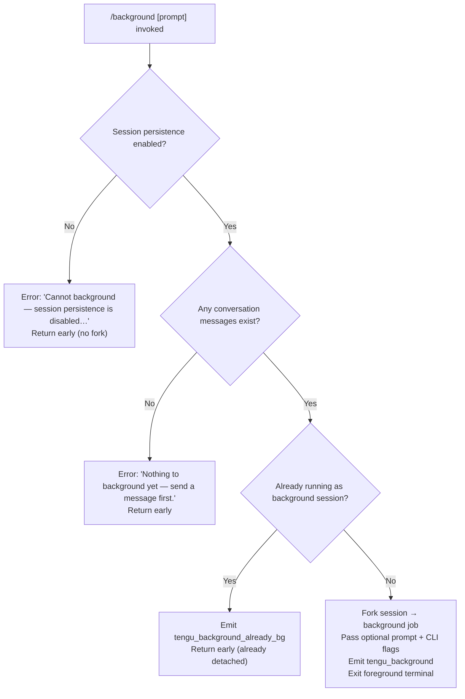

# `/background`

> Analysis basis: CC v2.1.185 bundle.js (AST extraction + Claude interpretation)
> Minimum version: v2.1.185

---

## Overview

`/background` (alias `/bg`) detaches the current interactive REPL session from the terminal, handing it off to the Claude Code background daemon so the task continues running without occupying the terminal. The command forks the session's conversation state into a new background job, passes an optional follow-up prompt, and exits the foreground process cleanly while the daemon worker carries on autonomously.

---

## Registration

| Field | Value |
|---|---|
| type | `local-jsx` |
| name | `background` |
| description | `Send this session to the background and free the terminal` |
| aliases | `["bg"]` |
| argumentHint | `[prompt]` |
| immediate | `null` |
| module_id | `lPl` |
| load_inline | `true` |
| loc_byte | `13353635` |
| loc_byte_end | `13353875` |
| loc_line | `8930` |
| arbor_handler.name | `Thf` |
| arbor_handler.fqn | `claude-2.1.185::Thf` |
| arbor_handler.kind | `AsyncFunction` |
| arbor_handler.resolution_path | `module_id` |
| arbor_handler.n_hits | `0` |

Analysis basis: CC v2.1.185 bundle.js:+13353635

---

## Input Branching

The handler (`Thf`) presents four distinct branches before dispatching, warranting a Mermaid flowchart.



Analysis basis: CC v2.1.185 bundle.js:+13352989, +13353165, +13352923, +13349885

---

## Behavioral Spec

### Guard: Session Persistence Check

When `/background` is invoked the handler first confirms that session persistence is active. If the current session has persistence disabled (e.g., the daemon is not reachable or persistence was explicitly suppressed), the command refuses with a user-facing error message and returns without spawning any background job.

Analysis basis: CC v2.1.185 bundle.js:+13352989

---

### Guard: Conversation History Check

After confirming persistence, the handler verifies that at least one conversation message already exists. If the conversation is still empty the command refuses with a message directing the user to send a message first.

Analysis basis: CC v2.1.185 bundle.js:+13353165

---

### Guard: Already-Backgrounded Detection

The handler checks whether the current process is already executing as a daemon background worker (identified by the `"background session"` session type literal at bundle.js:+17311742). If so, it emits the `tengu_background_already_bg` telemetry event and returns without further action.

Analysis basis: CC v2.1.185 bundle.js:+13352923

---

### Core: Session Fork and Daemon Dispatch (`Thf` → `pzn`)

When all guards pass, the handler delegates to the session-fork dispatch path (`pzn`). The pseudocode below describes what occurs:

```
async function backgroundCommandHandler(context, promptArg):
    if not sessionPersistenceEnabled(context):
        return showError("Cannot background — session persistence is disabled…")

    if conversationHistory(context).length == 0:
        return showError("Nothing to background yet — send a message first.")

    if currentSessionType(context) == "background session":
        emit("tengu_background_already_bg")
        return

    # Build CLI argument list for the forked background job
    cliArgs = []
    cliArgs.append("--resume", sessionId)          # resume the existing conversation
    cliArgs.append("--fork-session")               # fork rather than clobber
    if promptArg:
        cliArgs.append("--reply-on-resume", promptArg)

    # Propagate inherited flags (pass-through)
    for flag in ["--add-dir", "--allowed-tools", "--disallowed-tools",
                 "--model", "--effort", "--permission-mode"]:
        if flag present in currentFlags(context):
            cliArgs.append(flag, currentFlagValue(context, flag))

    # Flush pending output before handing off
    await flushWithTimeout(2000)                   # "flush timeout" literal

    # Ensure daemon is running; auto-spawn transient daemon if needed
    daemonHandle = await ensureDaemonRunning()

    # Dispatch the forked job to the daemon
    result = await dispatchToDaemon(daemonHandle, cliArgs)

    if result.status in ["not running", "timed out", "spawn_failed", …]:
        emit("tengu_background_spawn_failed")
        showError("couldn't start in the background — press Enter to retry")
        return

    # Annotate REPL transcript with "(backgrounded)" marker
    appendTranscriptMarker("(backgrounded)")

    # Emit success telemetry and record outcome
    emit("tengu_background", {
        status: result.status,   # e.g. "queued_for_later", "repl_background_fork"
        …
    })

    # Exit the foreground terminal cleanly
    exitForegroundProcess()
```

Analysis basis: CC v2.1.185 bundle.js:+13353126, +13348440, +13348453, +13348495, +13348384, +13349885, +13349084, +13349447, +13350620

---

### Sub-feature: Daemon Ensure-Running (`lG`, `ALo`)

`ensureDaemonRunning` is the path that checks whether a Claude Code daemon is already alive and, if not, attempts to spawn one. On macOS/Linux it may install a persistent launchd/systemd service or fall back to a transient in-process spawn. Relevant telemetry events emitted along this path include `tengu_bg_daemon_cold_start_ask`, `tengu_bg_daemon_install`, and `tengu_bg_daemon_spawn_failed`.

Analysis basis: CC v2.1.185 bundle.js:+13281512, +13282535, +13281970, +13283106

---

### Sub-feature: Background Dispatch (`ALo`)

The dispatch function (`ALo`) writes a job-description file to the daemon's socket directory, connects to the daemon's Unix-domain control socket, sends the fork request (including the `--resume`, `--fork-session`, and optional `--reply-on-resume` flags), and waits for an acknowledgement within a configurable timeout (6000 ms literal at bundle.js:+13321915). Outcome codes observed in literals: `"repl_background_fork"`, `"queued_for_later"`, `"spawn_failed"`, `"short_alive"`, `"stale_short"`, `"daemon_unavailable"`.

Flush timeout before dispatch: **2000 ms** (bundle.js:+13348384).
Dispatch connect timeout: **6000 ms** (bundle.js:+13321915).

Analysis basis: CC v2.1.185 bundle.js:+13321407, +13321657, +13349737, +13349760, +13349811

---

### Sub-feature: Pre-flight Validation for Flags (`Shf`, `mhf`)

Before forking, the handler validates that certain flag combinations are safe to carry into the background:

- If `bypassPermissions` is in effect but the user has not yet accepted the disclaimer interactively (confirmed by running `claude --dangerously-skip-permissions` at least once), the command blocks with the message beginning `"--bg with bypassPermissions requires…"` (bundle.js:+13346545).
- If `auto` permission mode is requested but not yet opted in, the command blocks with the message beginning `"--bg with auto mode requires…"` (bundle.js:+13346707).
- If `--cloud` / `--remote` flags are present, the command rejects with the message beginning `"--bg and --cloud are different backends…"` (bundle.js:+13291625).

Analysis basis: CC v2.1.185 bundle.js:+13346545, +13346707, +13291625

---

### Sub-feature: Detach-Request Signal to Worker (`KHe`)

When the command is invoked from inside an already-attached background session (re-entering `/background` to detach), the handler sends a `"detach-request"` message over the daemon IPC channel and waits for the worker to acknowledge the detach, then closes the foreground stream.

Analysis basis: CC v2.1.185 bundle.js:+11259679

---

## State & Side Effects

| Item | Detail |
|---|---|
| Telemetry — primary | `tengu_background` (success path) emitted at bundle.js:+13349885 |
| Telemetry — already detached | `tengu_background_already_bg` emitted at bundle.js:+13352923 |
| Telemetry — spawn failed | `tengu_background_spawn_failed` emitted at bundle.js:+13349084 |
| Telemetry — daemon events | `tengu_bg_dispatch`, `tengu_bg_dispatch_fallback`, `tengu_bg_daemon_cold_start_ask`, `tengu_bg_daemon_install`, `tengu_bg_daemon_spawn_failed`, `tengu_bg_daemon_cold_start_ask_answer` |
| Telemetry — daemon control | `tengu_daemon_control` at bundle.js:+17311865 |
| Transcript annotation | The string `"(backgrounded)"` is appended to the REPL transcript (bundle.js:+13350620) |
| Session fork flags written | `--resume <id>`, `--fork-session`, optionally `--reply-on-resume <prompt>` |
| Pass-through flags | `--add-dir`, `--allowed-tools`, `--disallowed-tools`, `--model`, `--effort`, `--permission-mode` |
| Output flush | Pending output flushed with a 2000 ms timeout before dispatch (bundle.js:+13348384) |
| Process exit | Foreground terminal process exits after successful dispatch |
| Daemon spawn | May start a transient or service daemon if none is running |
| appState changes | `setAppState` called via `v2n` to record backgrounded state (bundle.js:+10848211) |
| Sound / UI | A JSX component (`N_e.createElement`) is rendered for the status UI (bundle.js:+13353235) |
| Hook registration | Registers `AbortSignal.timeout` for dispatch operations (bundle.js:+13350058) |

---

## Version History

| Version | Change |
|---|---|
| v2.1.185 | Initial analysis |

---

## Common Mistakes

1. **Running `/background` before sending any message.** The guard at bundle.js:+13353165 will reject with "Nothing to background yet — send a message first." Always send at least one turn before invoking `/background`.
2. **Using `/background` when the daemon is not installed and persistence is disabled.** Without a reachable daemon the fork cannot persist; the command will fail with `tengu_background_spawn_failed`. Run `claude daemon install` to set up the persistent service first.
3. **Combining `--bg` with `--cloud` / `--remote` flags.** These are incompatible backends; the command will reject with an explicit error. Use `claude --cloud '<task>'` independently.
4. **Expecting `/background` to work with `bypassPermissions` before the one-time interactive disclaimer.** The disclaimer must be accepted by running `claude --dangerously-skip-permissions` at least once interactively before `/background` will forward that flag to the daemon.
5. **Invoking `/background` from inside an already-background session.** The `tengu_background_already_bg` guard exits immediately; the command is a no-op in that context.

---

## Appendix — Identifier Mapping

> For bundle debugging only. Identifiers change across versions.

| Identifier | Role |
|---|---|
| `Thf` | Main handler for `/background` command (AsyncFunction, arbor-resolved) |
| `dzn` | Background dispatch orchestrator (builds CLI arg list, coordinates fork) |
| `pzn` | Session fork / REPL background fork dispatcher |
| `ALo` | Daemon dispatch function (socket connect, job write, ack wait) |
| `lG` | Daemon ensure-running / startup coordinator |
| `d8t` | Daemon service poll / install sequence |
| `mhf` | Background session configuration and flag assembly |
| `UX` | Background job creation entry point (UUID, temp dir, subprocess spawn) |
| `Shf` | Pre-flight flag validation (bypassPermissions, auto-mode, cloud checks) |
| `Gq` | Context/flag lookup helper used during flag validation |
| `azn` | Argument parsing helper for background mode flags |
| `lzn` | Session-ID and resume argument builder |
| `nPl` | `--resume=` prefix argument resolver |
| `oPl` | `--session-id` argument resolver |
| `rPl` | Start-of-argument-list position resolver |
| `bhf` | Bypass-permissions gate check |
| `gMe` | Permission/flag set membership helper |
| `Gne` | Starts-with check helper for flag strings |
| `fhf` | Shell command runner for background spawn |
| `otn` | Sub-shell environment setup (cmd.exe / /bin/sh) |
| `uu` | Flush-with-timeout (2000 ms) utility |
| `BZp` | Full-session fork execution (rename + dispatch) |
| `Jx` | Forked agent query runner |
| `v2n` | App-state update function (setAppState) |
| `KHe` | Detach-request sender (inside-worker detach path) |
| `bsl` | Worker IPC stream helper |
| `G6` | Control-socket write helper |
| `Hi` | Daemon-worker session initializer |
| `mq` | Environment / production-mode gate |
| `lNe` | Tmux child-session detector |
| `HRu` | Tmux `show-environment` spawner |
| `_Ru` | VBs.spawnSync wrapper for tmux queries |
| `Fs` | CLI error emitter (emits `"cli_error"`, exits with code 1) |
| `S_` | Session-state reader |
| `iA` | Session-type identifier |
| `ILo` | App-state initializer |
| `Au` | App-state accessor |
| `qi` | B2o signal registrar |
| `nD` | Secondary app-state accessor |
| `XRe` | Context flag passthrough collector |
| `r_n` | Config-reload watcher |
| `Ct` | Configuration reader / file-system config |
| `q_e` | Config file parser |
| `Ebf` | Config file watcher |
| `vH` | compact-boundary check |
| `VGn` | Compact-boundary reader |
| `FCe` | File-cache invalidation on background |
| `LA` | Log-and-error reporting helper |
| `SG` | Graceful shutdown coordinator |
| `Lme` | MCP server shutdown helper |
| `Nme` | Timeout-clear helper |
| `Bn` | Promise-race abort helper |
| `WT` | "forced shutdown" literal emitter |
| `Uft` | Full forked-session lifecycle manager |
| `$ho` | Fork dispatch wrapper |
| `js` | Command-line argument parser entry |
| `jK` | Argument tokenizer |
| `_s` | Model-name/flag normalizer |
| `Pg` | Parsed-argument processor |
| `tle` | Fork-job launcher wrapper |
| `T6f` | Background daemon worker session loop |
| `b6f` | Worker crash/respawn handler |
| `S6f` | Terminal resize helper |
| `L` | Background daemon sweep / grace-clock manager |
| `W` | Worker grace-clock adjuster |
| `f` | Worker lifecycle manager (spawn, kill, retire) |
| `p` | Forced-shutdown sequence |
| `u` | Worker abort / stop sequence |
| `rF` | First-party request emitter |
| `MNr` | Event emitter for daemon requests |
| `n3e` | MCP server connection manager |
| `B1o` | MCP state sync / applyMcpUpdate caller |
| `uZn` | MCP connection-result applier |
| `dW` | MCP server slot initializer |
| `Uk` | MCP skills telemetry emitter |
| `I4e` | Teammate-mailbox mark-as-read handler |
| `H` | UI repaint trigger |
| `fa` | File-cache read/write helper |
| `Ic` | Jobs-directory path resolver |
| `wk` | Job-file path builder |
| `doe` | JSONL conversation-file scanner |
| `C7c` | JSONL file reader with binary-type check |
| `sL` | Directory recursive scanner |
| `BS` | Realpath resolver |
| `Xy` | Path-format test helper |
| `N2` | Normalized path builder |
| `ct` | Telemetry counter/timer |
| `XKn` | Attach-upgrade telemetry |
| `ERl` | Retire-grace-bridge telemetry |
| `p8t` | Memory / free-mem poller |
| `B$e` | Stale-file cleaner |
| `d` | Supervisor config-update handler |
| `LL` | Full conversation-state renderer / query runner |
| `BNl` | Main REPL agent query loop |
| `i$` | Conversation context assembler |
| `F6n` | Context-file reader and hash builder |
| `k9p` | Message-content normalizer |
| `ije` | Sub-agent invocation wrapper |
| `tgo` | Sub-agent turn runner |
| `CC` | Auth credential resolver |
| `Gvr` | API-key prefix stripper |
| `Tfe` | Backend credential formatter |
| `Am` | Auth store lookup |
| `Lt` | Keychain / store getter |
| `Hx` | Global-state accessor |
| `gx` | Global store object |
| `Mu` | Locale/string formatter |
| `wr` | String/format utility |
| `Wc` | Conversation window builder |
| `Cc` | Message filter helper |
| `vH` | Compact-boundary slice helper |
| `Xmt` | Tool-some predicate |
| `GP` | Tool-group classifier |
| `GY` | Tool-array normalizer |
| `zce` | Starts-with permission checker |
| `mh` | Auth + app-state bridge |
| `Sq` | Auth + app-state bridge (secondary) |
| `rW` | Array-type guard |
| `Pn` | UUID + metadata builder |
| `$gl` | Whitespace trim wrapper |
| `U2` | String trim helper |
| `WWn` | Meta-message assembler |
| `Aee` | Meta-message type classifier |
| `oy` | Rescued-dispatch handler |
| `hhf` | Post-fork cleanup helper |
| `Yse` | Amber-anchor telemetry emitter |
| `kme` | GR (amber-anchor) recorder |
| `IJ` | Socket cleanup helper |
| `f2` | Foreground-exit helper |
| `Hst` | History-state persister |
| `NLe` | Notification / left-arrow UI element |
| `Pt` | Feature-ok/bad telemetry emitter |
| `Re` | Feature-bad telemetry emitter |
| `ke` | Feature-ok telemetry emitter |
| `Ue` | ogt (telemetry sink) caller |
| `E9` | Environment classifier (production/test) |
| `aOl` | Stage name resolver |

---

Note: index built via Arbor fallback; some signals (telemetry, literals) may be missing — see arbor-fallback.js.