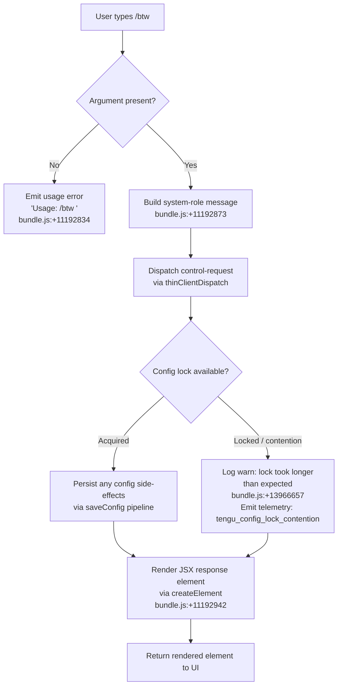

# `/btw`

> Analysis basis: CC v2.1.185 bundle.js (AST extraction + Claude interpretation)
> Minimum version: v2.1.185

---

## Overview

The `/btw` ("by the way") command lets users pose a quick side question to the agent without disrupting the main conversation thread. It is implemented as a `local-jsx` command that dispatches a `control-request` to the thin-client layer immediately upon invocation, injecting a system-role message into the turn context and then constructing a React-based UI response element.

---

## Registration

| Field | Value |
|---|---|
| type | `local-jsx` |
| name | `btw` |
| description | Ask a quick side question without interrupting the main conversation |
| argumentHint | `<question>` |
| immediate | `true` |
| thinClientDispatch | `control-request` |
| module_id | `nol` |
| load_inline | `true` |
| loc_byte | `11193241` |
| loc_byte_end | `11193480` |
| loc_line | `6919` |
| arbor_handler.name | `$6p` |
| arbor_handler.fqn | `claude-2.1.185::$6p` |
| arbor_handler.kind | `AsyncFunction` |
| arbor_handler.resolution_path | `module_id` |
| arbor_handler.n_hits | `0` |

Analysis basis: CC v2.1.185 bundle.js:+11193241

---

## Input Branching

Three distinct paths exist based on input validation and dispatch outcome:



---

## Behavioral Spec

### 1. Entry point — async handler (`$6p`)

The Arbor-resolved handler is the `AsyncFunction` registered as `$6p` inside module `nol`, reached via the `module_id` resolution path.

```
async function btwHandler(context):
    userInput = context.args.trim()

    if userInput is empty:
        emit usageError("Usage: /btw <your question>")   // bundle.js:+11192834
        return

    systemMessage = buildMessage(role="system", content=userInput)  // bundle.js:+11192873

    configResult = await saveGlobalConfig(systemMessage)  // pn → W7n pipeline

    jsxElement = renderElement(systemMessage, configResult)  // bundle.js:+11192942
    return jsxElement
```

Analysis basis: CC v2.1.185 bundle.js:+11192832

---

### 2. Usage guard

When the user invokes `/btw` with no argument text, the handler short-circuits and surfaces the literal usage string `"Usage: /btw <your question>"` as an error/hint message.

```
function validateArgs(rawArgs):
    if rawArgs is null or rawArgs.trim() == "":
        return { ok: false, hint: "Usage: /btw <your question>" }
    return { ok: true, value: rawArgs.trim() }
```

Analysis basis: CC v2.1.185 bundle.js:+11192834

---

### 3. System message construction

The validated question text is wrapped in a message object with `role = "system"`. This message is injected into the turn context ahead of the normal user turn, allowing the agent to answer the side question without treating it as a primary conversation turn.

```
function buildSystemMessage(questionText):
    return {
        role: "system",           // bundle.js:+11192873
        content: questionText
    }
```

Analysis basis: CC v2.1.185 bundle.js:+11192873

---

### 4. Config persistence pipeline (`saveGlobalConfig` → `pn` → `W7n`)

The `pn` function orchestrates global config saving. It delegates to `W7n` (the file-write worker), which:

1. Resolves the config directory via `vS.dirname` (bundle.js:+13966452).
2. Creates the directory with `s.mkdirSync` if absent (bundle.js:+13966473).
3. Attempts to acquire a file-system lock. If lock acquisition exceeds the expected threshold, it logs `"error"` with the message `"Lock acquisition took longer than expected - another Claude instance may be running"` (bundle.js:+13966657) and emits `tengu_config_lock_contention` (bundle.js:+13966746).
4. Writes config atomically via the `MSt` (atomic-write) helper, which uses `randomBytes`-named temp files, `fchmodSync`, `fsyncSync`, and `renameSync`.
5. Detects auth-loss conditions: if the re-read config is missing auth that the cache holds, it refuses the write and emits `tengu_config_auth_loss_prevented` (bundle.js:+13967225) with the sentinel message referencing GH #3117 (bundle.js:+13967073).
6. On stale-write detection, emits `tengu_config_stale_write` (bundle.js:+13966882).
7. On fallback write path, emits `tengu_config_fallback_write` (bundle.js:+13966362).

```
async function saveGlobalConfig(payload):
    dir = path.dirname(configFilePath)
    fs.mkdirSync(dir, { recursive: true })

    acquired = await acquireFileLock(configFilePath)
    if not acquired within threshold:
        log("error", "Lock acquisition took longer than expected...")
        emit("tengu_config_lock_contention")

    existingConfig = readAndParseConfig(configFilePath)

    if existingConfig missing auth AND cache has auth:
        emit("tengu_config_auth_loss_prevented")
        throw Error("refusing to write — auth loss guard")

    atomicWrite(configFilePath, merge(existingConfig, payload))
    releaseLock()
```

Analysis basis: CC v2.1.185 bundle.js:+13963319 (pn), +13966446 (W7n entry)

---

### 5. Backup rotation (`q_e` / `RFl`)

During config writes, `q_e` manages backup rotation inside a `backups/` subdirectory (bundle.js:+13968258). Up to **5** backup copies are retained (bundle.js:+13967676); older copies are pruned via `copyFileSync` and `unlinkSync`. Files matching `.backup.` in their name are identified as backup candidates (bundle.js:+13967543).

```
function rotateBackups(configPath):
    backupDir = path.join(path.dirname(configPath), "backups")
    fs.mkdirSync(backupDir, { recursive: true })

    existing = fs.readdirStringSync(backupDir)
                 .filter(name => name.startsWith(".backup."))
                 .sortedByMtime()

    while existing.length >= 5:           // bundle.js:+13967676
        fs.unlinkSync(oldest)
        existing.shift()

    timestamp = Date.now()
    dest = path.join(backupDir, ".backup." + timestamp)
    fs.copyFileSync(configPath, dest)
```

Analysis basis: CC v2.1.185 bundle.js:+13967035 (q_e), +13968258, +13967676

---

### 6. Jitter delay helper (`e` → `Math.random` / `setTimeout`)

A small utility reached from `$6p` introduces a bounded random delay, likely for lock-retry back-off. The delay is computed as a value in `[1, 2]` relative units (bundle.js:+14290350, +14290366), then scheduled via `setTimeout` (bundle.js:+14290389).

```
function jitteredDelay(baseMs):
    factor = 1 + Math.random()   // range [1, 2]  bundle.js:+14290350/+14290366
    await sleep(baseMs * factor) // via setTimeout bundle.js:+14290389
```

Analysis basis: CC v2.1.185 bundle.js:+14290352

---

### 7. JSX response rendering

After the side question is dispatched and any config writes complete, the handler calls `ru.createElement` (bundle.js:+11192942) to produce a React element that the `local-jsx` host renders in the CLI UI. The element represents the agent's response surface for the `/btw` turn.

```
function renderBtwResponse(message, agentResult):
    return createElement(BtwResponseComponent, {
        message: message,
        result:  agentResult
    })
```

Analysis basis: CC v2.1.185 bundle.js:+11192942

---

## State & Side Effects

| Item | Detail |
|---|---|
| Telemetry — `tengu_config_lock_contention` | Emitted when file-lock acquisition is slower than expected (bundle.js:+13966746) |
| Telemetry — `tengu_config_stale_write` | Emitted when a stale-write condition is detected during config save (bundle.js:+13966882) |
| Telemetry — `tengu_config_parse_error` | Emitted when the on-disk config JSON cannot be parsed (bundle.js:+13969321) |
| Telemetry — `tengu_config_auth_loss_prevented` | Emitted when a write that would erase auth credentials is blocked (bundle.js:+13967225) |
| Telemetry — `tengu_config_fallback_write` | Emitted when the atomic-write path falls back to a secondary write strategy (bundle.js:+13966362) |
| Telemetry — `tengu_bg_dispatch_sigkill_escalate` | Emitted by background-dispatch machinery when SIGKILL escalation occurs (bundle.js:+17275024) |
| Telemetry — `tengu_bg_dispatch_low_mem` | Emitted by background-dispatch machinery when free memory is low (bundle.js:+17275625) |
| Telemetry — `tengu_bg_spare_enable` | Emitted when a spare background session is enabled (bundle.js:+17276322) |
| Telemetry — `tengu_bg_spare_claim` | Emitted when a spare session is successfully claimed (bundle.js:+17276450) |
| Telemetry — `tengu_bg_spare_claim_fail` | Emitted when spare-session claim fails (bundle.js:+17276716) |
| Telemetry — `tengu_bg_proto_mismatch` | Emitted on background-protocol version mismatch (bundle.js:+17260791) |
| Telemetry — `tengu_bg_dispatch_stale_drop` | Emitted when a stale dispatch is dropped (bundle.js:+17262190) |
| Telemetry — `tengu_bg_attach_legacy_autorespawn` | Emitted during legacy-client auto-respawn on attach (bundle.js:+17265080) |
| Telemetry — `tengu_bg_attach` | Emitted on background session attach (bundle.js:+17266239) |
| Telemetry — `tengu_bg_attach_stall_gave_up` | Emitted when attach stall detection gives up (bundle.js:+17267169) |
| Telemetry — `tengu_bg_attach_stall_respawn` | Emitted when attach stall triggers a respawn (bundle.js:+17267439) |
| Telemetry — `tengu_bg_attach_kick` | Emitted when a competing attachment is kicked (bundle.js:+17268436) |
| Telemetry — `tengu_daemon_control` | Emitted on daemon control-plane events (bundle.js:+17311865) |
| thinClientDispatch | Sends a `control-request` message to the thin-client layer immediately (`immediate: true`) |
| Config file | May write / rotate `~/.claude.json` and backup copies under `backups/` |
| Auth-loss guard | Refuses writes that would erase existing auth tokens; see GH #3117 reference (bundle.js:+13967073) |
| Backup retention | Maximum **5** backup copies; oldest pruned on overflow (bundle.js:+13967676) |
| JSX element | Produces a React element via `ru.createElement` for the `local-jsx` host (bundle.js:+11192942) |
| Sound | <!-- TODO: not found in depth-2 traversal; needs --depth 4 --> |

---

## Version History

| Version | Change |
|---|---|
| v2.1.185 | Initial analysis |

---

## Common Mistakes

1. **Omitting the argument** — invoking `/btw` with no text causes an immediate usage-error response (`"Usage: /btw <your question>"`); the question is not passed to the agent.
2. **Expecting a full conversation turn** — `/btw` is a _side_ question. It is flagged `immediate: true` and dispatched as a `control-request`, so it does not replace or interrupt the current primary turn context.
3. **Confusing the role** — the question is injected as a `"system"`-role message, not a `"user"`-role message. Tools or tests that inspect turn history by role may miss it.
4. **Concurrent Claude instances** — if another Claude Code process holds the config lock, the handler will delay and emit `tengu_config_lock_contention` but will still proceed; users should not treat this warning as a fatal error.
5. **Auth-loss writes** — any external tooling that manipulates `~/.claude.json` between `/btw` invocations risks triggering the auth-loss guard (GH #3117 path), causing the config write to be silently dropped.

---

## Appendix — Identifier Mapping

> For bundle debugging only. Identifiers change across versions.

| Identifier | Role |
|---|---|
| `$6p` | Main async handler for `/btw` (Arbor-resolved entry point) |
| `pn` | Global-config save orchestrator (calls `W7n`) |
| `W7n` | File-write worker: lock acquisition, directory creation, atomic write, backup rotation |
| `q_e` | Backup rotation and config-read helper |
| `RFl` | Backup directory scanner / oldest-backup finder |
| `Sko` | Path-join utility for backup filenames |
| `MSt` | Atomic file-write helper (temp file, fchmod, fsync, rename) |
| `C3s` | Config object merge / patch helper |
| `_wr` | Inner config-record builder called by `C3s` |
| `T` | Message/turn formatter (role normalisation, JSON serialisation) |
| `QHc` | Turn-type classifier |
| `Pe` | JSON serialiser wrapper |
| `Kc` | String sanitiser / redaction helper (emits `[REDACTED]`) |
| `Hqe` | Supplementary string-transform helper |
| `n_c` | File-content reader with byte-length accounting |
| `j7n` | Config-path resolver and pre-write validator |
| `oWt` | Timestamp / mtime helper (`Date.now`-based) |
| `_ko` | Object-entries iterator for config merging |
| `AAt` | Auth-presence checker used by stale-write guard |
| `LMe` | Logging / metric emission helper |
| `Ue` | UI event emitter / notification helper |
| `Gt` | Safe `JSON.parse` wrapper |
| `V9` | String prefix-stripper (`startsWith` / `slice`) |
| `vKe` | Fallback-write error classifier |
| `Mn` | Generic error normaliser |
| `jp` | Symlink-aware `realpath` resolver |
| `Ee` | String coercion helper (`String(...)`) |
| `Qp` | Stream-end / flush helper |
| `T6f` | Background-session IPC message dispatcher |
| `g` | Buffer-chunking / stream-split helper |
| `h` | Socket timeout wrapper |
| `m` | Background-worker kill coordinator |
| `f` | Background-session spawn / lifecycle manager |
| `jt` | Filesystem try-catch wrapper |
| `dn` | General error logger |
| `j` | Generic async utility / promise wrapper |
| `E` | Scroll / viewport math helper |
| `I` | Keyboard-event and layout calculation handler |
| `k` | Terminal supervisor write helper |
| `ogt` | UI notification sink |
| `sI` | Config serialiser (stringification step) |

---

Note: index built via Arbor fallback; some signals (telemetry, literals) may be missing — see arbor-fallback.js.