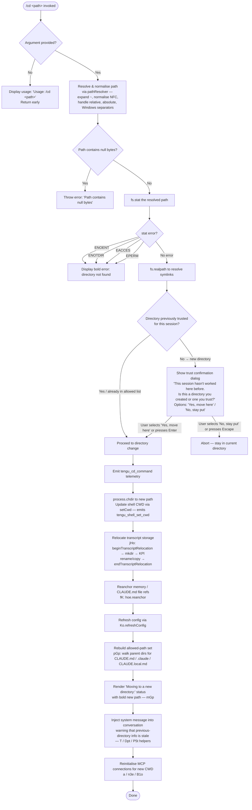

# `/cd`

> Analysis basis: CC v2.1.185 bundle.js (AST extraction + Claude interpretation)
> Minimum version: v2.1.185

---

## Overview

The `/cd` command moves the current Claude Code session to a new working directory specified by the user. It validates the target path, confirms trust for previously-unseen directories, and then atomically updates the process working directory, session state, transcript storage, configuration, and memory file references. The command emits a `tengu_cd_command` telemetry event upon completion.

---

## Registration

| Field | Value |
|---|---|
| type | `local-jsx` |
| name | `cd` |
| description | Move this session to a new working directory |
| argumentHint | `<path>` |
| module_id | `kol` |
| load_inline | `true` |
| loc_byte | `11227521` |
| loc_byte_end | `11227681` |
| loc_line | `6940` |
| arbor_handler.name | `AGp` |
| arbor_handler.fqn | `claude-2.1.185::AGp` |
| arbor_handler.kind | `AsyncFunction` |
| arbor_handler.resolution_path | `module_id` |
| arbor_handler.n_hits | `0` |

Analysis basis: CC v2.1.185 bundle.js:+11227521

---

## Input Branching

The handler `AGp` exhibits more than three distinct decision paths (no argument, invalid path, filesystem errors, untrusted directory, and the full success path with sub-steps), so a Mermaid flowchart is used.



---

## Behavioral Spec

### 1 — Handler entry point (`AGp`)

`AGp` is the top-level async handler registered for `/cd`.

```
async function handleCdCommand(args, context):
    if args is empty or blank:
        print "Usage: /cd <path>"
        return

    resolvedPath = resolvePath(args.trim())   // calls pathResolver (Ds)
    statResult   = await fs.stat(resolvedPath) // YGn.stat
    if statResult is error:
        print bold(errorMessage)              // Ht.bold
        return

    realPath = await fs.realpath(resolvedPath) // YGn.realpath

    if not isTrustedDirectory(realPath):       // Mt / session trust store
        confirmed = await showTrustDialog(realPath)
        if not confirmed:
            return                             // user chose "No, stay put"

    emit("tengu_cd_command")                   // j — telemetry

    applyDirectoryChange(realPath, context)    // fGp
    renderStatusMessage(realPath)              // mGp
    injectStaleWarningSystemMessage(context)   // T / Dpt / P5t
    await reinitMcpConnections(context)        // a / n3e / B1o
```

Analysis basis: CC v2.1.185 bundle.js:+11225998

---

### 2 — Path resolution (`Ds` — pathResolver)

Converts the raw user-supplied string into an absolute, normalised filesystem path.

```
function resolvePath(rawInput):
    if rawInput contains null bytes:
        throw Error("Path contains null bytes")   // loc +1091832

    normalised = unicodeNormalise(rawInput, "NFC") // AH / +68376

    // Tilde expansion
    if normalised starts with "~/":
        home = os.homedir()                       // ptn.homedir / +1091929
        normalised = join(home, normalised[2:])

    // On Windows: normalise backslash separators
    if platform is "windows":                     // +1092029
        normalised = normalised.replace("\\", "/")

    if path.isAbsolute(normalised):
        return path.resolve(normalised)           // zO.resolve / +1092143
    else:
        return path.resolve(currentCwd, normalised)
```

Analysis basis: CC v2.1.185 bundle.js:+1091579

---

### 3 — Filesystem error mapping (`dn` / `AGp` error branch)

After `fs.stat`, the handler maps POSIX error codes to user-facing messages.

```
function mapFsError(err):
    switch err.code:
        case "ENOENT":   return "directory not found"     // +11226262
        case "ENOTDIR":  return "path is not a directory" // +11226276
        case "EACCES":   return "permission denied"       // +11226291
        case "EPERM":    return "operation not permitted"  // +11226305
        default:         return err.message
```

Analysis basis: CC v2.1.185 bundle.js:+11226249

---

### 4 — Directory trust dialog (`xol` / JSX component)

When the resolved real path has not been seen by this session before, a confirmation dialog is rendered.

```
function showTrustDialog(newPath):
    // Strings found in literals:
    // "This session hasn't worked here before. Is this a directory you created or one you trust?"
    // "Claude Code" (title)
    // "Yes, move here"  (+11223579)
    // "No, stay put"    (+11223608)
    // Links: "Security guide" → "https://code.claude.com/docs/en/security" (+11223425)

    display interactive prompt with two options
    bind "enter" / "confirm" key → accept   // +11223848, +11223863
    bind "escape" / "cancel"  key → reject  // +11223910, +11223926

    return userChose("Yes, move here")
```

Analysis basis: CC v2.1.185 bundle.js:+11222833

---

### 5 — Apply directory change (`fGp`)

Performs all side-effecting mutations once the change is approved.

```
async function applyDirectoryChange(newPath, context):
    // 1. Change Node.js process CWD
    process.chdir(newPath)                      // +11224529

    // 2. Update shell CWD tracker (emits tengu_shell_set_cwd)
    setCwd(newPath)                             // wH / +11224546

    // 3. Emit change event to internal event bus
    emitCwdChange(newPath)                      // DD / Igt / Atr.emit / +11224552

    // 4. Relocate transcript files
    await relocateTranscript(newPath, context)  // jHo / +11224571

    // 5. Reanchor CLAUDE.md / memory file references
    reanchorFileRefs(context)                   // fK / hoe.reanchor / +11224799

    // 6. Refresh project/user configuration
    Ko.refreshConfig()                          // +11224850

    // 7. Rebuild ancestor allowed-path set
    rebuildAllowedPaths(newPath)                // pGp / +11224906

    // 8. Escape XML special characters for display
    displayPath = escapeXml(newPath)            // XGn / +11224915

    // 9. Update React view state
    updateViewState(displayPath)                // vw / +11224924
```

Analysis basis: CC v2.1.185 bundle.js:+11224517

---

### 6 — Transcript relocation (`jHo`)

Moves the session's on-disk transcript directory to match the new working directory.

```
async function relocateTranscript(newPath, context):
    newTranscriptDir = path.join(newPath, "cd")  // zh.join / literal "cd" +13468904
    context.beginTranscriptRelocation()           // +13468979
    context.flush()                               // +13469019
    await fs.mkdir(newTranscriptDir, { mode: 0o700 })  // Rl.mkdir / 448 decimal = 0o700 / +13469035

    await moveOrCopyFiles(oldDir, newTranscriptDir)    // KPl / +13469081
    // KPl: prefer fs.rename; on EEXIST/EBUSY/ENOTEMPTY falls back to fs.copyFile + fs.rm
    // EXDEV (cross-device): copies recursively via fOl

    context.endTranscriptRelocation()             // +13469297

    // Write new transcript path to config store
    writeConfig(newTranscriptDir)                 // T / n_c + qi / +13469108
```

Analysis basis: CC v2.1.185 bundle.js:+13468841

---

### 7 — Allowed-path rebuild (`pGp`)

Walks the directory hierarchy from the new path upward to locate CLAUDE.md and `.claude` configuration files.

```
function rebuildAllowedPaths(newPath):
    segments = []
    current  = newPath

    loop:                                          // R5t.parse / R5t.dirname / +11224368
        segments.push(current)
        parent = path.dirname(current)
        if parent == current: break
        current = parent

    segments.reverse()                             // +11224435

    allowedPaths = Set()
    for each segment:
        normSegment = normalisePathSegment(segment)  // aI / +11224333
        allowedPaths.add(normSegment)

        // Scan for CLAUDE.md, CLAUDE.local.md, .claude/
        scanProjectFiles(normSegment, allowedPaths)  // sRt / +11224463
        // Also evaluates .md files under .claude/rules/ (literal +5059919)

    return allowedPaths
```

Analysis basis: CC v2.1.185 bundle.js:+11224322

---

### 8 — Status message rendering (`mGp`)

Renders a brief visual notification inside the Claude Code UI.

```
function renderStatusMessage(displayPath):
    sanitisedPath = sanitiseForDisplay(displayPath)  // Zf / iQc / +11225260
    commandLabel  = formatCommandLabel()             // Qke / its / +11225283
    render bold("Moving to a new directory:")        // Ht.bold / +11225366
           + ", " + bold(sanitisedPath)              // literal ", " +11225791
```

Analysis basis: CC v2.1.185 bundle.js:+11225260

---

### 9 — Stale-context system message injection (`AGp` → `T` / `Dpt` / `P5t`)

A system-role message is appended to the conversation context warning the model that prior tool calls referencing the old directory are stale.

```
function injectStaleWarningMessage(context):
    // Literal fragment found at +11225065:
    // "previous directory — that information is stale. All tool calls and …"
    message = buildSystemMessage(role="system", content=staleWarningText)  // literal "system" +11226849
    context.appendMessage(message)   // Dpt / Ct / +11226693, +11227079
    context.resolvePromises()        // P5t / vS.resolve / +11227172
```

Analysis basis: CC v2.1.185 bundle.js:+11226849

---

### 10 — MCP connection reinitialisation (`a` / `n3e` / `B1o`)

After the working directory changes, MCP server connections are rebuilt so that server configurations scoped to the new directory take effect.

```
async function reinitMcpConnections(context):
    currentClients = context.s.values()   // +16919862
    for each client:
        await teardownAndReconnect(client)  // uZn / fw / n3e

    newConfig = computeMcpConfig(newCwd)   // n3e / dW / W7
    await B1o(context, newConfig)          // applies updates, fires n3e
```

Analysis basis: CC v2.1.185 bundle.js:+11227099

---

## State & Side Effects

| Item | Detail |
|---|---|
| Telemetry | `tengu_cd_command` (+11224871); `tengu_shell_set_cwd` (+7031160, fired by `wH`); `tengu_daemon_config_reload` (+17290895, fired via config refresh path); `tengu_mcp_skills` (+6624964, fired during MCP reinit); `tengu_paper_halyard` (+5061586, fired during CLAUDE.md scan); `tengu_claude_rules_md_permission_error` (+5058848, fired on CLAUDE.md read permission failure) |
| process.chdir | Moves the Node.js process working directory to the resolved real path (+11224529) |
| Shell CWD tracker | `wH` / `setCwd` updates the internal CWD state and emits via `Atr.emit` / `Izt.emit` (+11224546, +49146, +48202) |
| Transcript storage | `jHo` relocates transcript files on disk using `fs.rename` / `fs.copyFile` / `fs.rm`; directory created with mode `0o700` (decimal 448, +13469065) |
| Config refresh | `Ko.refreshConfig()` re-reads project and user settings after directory change (+11224850) |
| Memory file anchors | `fK` / `hoe.reanchor` updates all in-memory references to CLAUDE.md and related files (+11224799) |
| Allowed-path set | `pGp` rebuilds the session's set of trusted paths by walking ancestor directories (+11224322) |
| Conversation context | A system-role stale-context message is appended to the conversation (+11226849) |
| MCP connections | All MCP server connections are torn down and re-established for the new CWD (+16919734) |
| Trust dialog | Shown when the target directory has not previously been approved in this session (+11222833) |
| Sound | <!-- TODO: not found in depth-2 traversal; needs --depth 4 --> |

---

## Version History

| Version | Change |
|---|---|
| v2.1.185 | Initial analysis |

---

## Common Mistakes

1. **Omitting the path argument** — `/cd` with no argument prints `Usage: /cd <path>` and returns immediately; no directory change occurs. Analysis basis: CC v2.1.185 bundle.js:+11225959
2. **Supplying a file path instead of a directory** — `fs.stat` will succeed but if the path is not a directory an `ENOTDIR`-equivalent error is shown. Ensure the argument resolves to a directory.
3. **Passing a path with null bytes** — the path resolver rejects any input containing null bytes with an explicit error before touching the filesystem. Analysis basis: CC v2.1.185 bundle.js:+1091832
4. **Expecting instant MCP reconnection** — MCP servers are torn down and re-established asynchronously after the directory change; tool calls immediately after `/cd` may briefly see a transitional state.
5. **Dismissing the trust dialog** — if the target directory is new to the session, pressing Escape or choosing "No, stay put" aborts the command entirely. The working directory remains unchanged.
6. **Using relative paths that escape the current directory** — paths beginning with `..` or `../` are accepted and resolved, but the resulting absolute path must still be a reachable directory; permission errors (`EACCES`, `EPERM`) are surfaced as bold error messages.

---

## Appendix — Identifier Mapping

> For bundle debugging only. Identifiers change across versions.

| Identifier | Role |
|---|---|
| `AGp` | Main `/cd` command async handler (handler entry point) |
| `Ds` | Path resolver — normalisation, tilde expansion, null-byte check |
| `Mt` | Session trust-store accessor |
| `Qen` | Trust-store getter (calls `Jen.getStore`) |
| `xV` | Trust-store value extractor |
| `Ar` | Allowed-paths set utility |
| `gx` | Internal set/map helper |
| `jt` | Async sleep / delay utility (uses `Math.random` + `setTimeout`) |
| `AH` | Unicode NFC normalisation helper |
| `dn` | Error code classifier / filesystem error helper |
| `wol` | Allowed-path rule evaluator (checks against session allow-list) |
| `OD` | Computes directory completion candidates / path traversal helper |
| `Yor` | Symlink-aware path resolution utility |
| `Zde` | Deep symlink resolver |
| `jp` | Real-path resolver with symlink following |
| `D5t` | Home-directory prefix stripper |
| `uGp` | Permission-rule matcher for `..` / `../` patterns |
| `k5t` | Pattern-to-regex compiler for path rules |
| `xHf` | Rule evaluation dispatcher (calls `Ds`, `Ar`, `c1e`) |
| `sGe` | Blocked-rule evaluator |
| `dGp` | Denied-path rule result builder |
| `_q` | Deny-rule list builder |
| `SA` | Rule string serialiser |
| `lQc` | Rule part formatter |
| `nk` | Object own-property checker helper |
| `cQc` | Rule conjunction formatter |
| `aQc` | Special-character escape helper for rule strings |
| `VHe` | Allow-rule list builder |
| `AUl` | Rule list initialiser |
| `j5e` | Shell-detection / dangerous-command checker |
| `w3t` | Shell type lookup helper |
| `x3t` | Dangerous-command pattern matcher |
| `zuo` | Object own-property guard for command checks |
| `Fr` | App-state reader for session configuration |
| `b6n` | Working-directory state extractor |
| `T6n` | Allowed-tools state extractor |
| `mB` | Permission-mode state extractor |
| `ct` | Permission mode change helper |
| `wxt` | Permission mode validator |
| `Lxt` | Permission mode display helper |
| `I4` | Permission mode transition handler |
| `OHn` | Bypass-permissions mode helper |
| `Ct` | Telemetry event emitter |
| `mGp` | Status message renderer ("Moving to a new directory:") |
| `Zf` | Path sanitiser for display output |
| `iQc` | String replacement helper (display sanitisation) |
| `Qke` | Command label formatter |
| `its` | Label string helper |
| `fGp` | Directory-change applicator (process.chdir + all side effects) |
| `wH` | Shell CWD setter (emits `tengu_shell_set_cwd`) |
| `Mn` | Error message formatter |
| `emr` | CWD environment updater |
| `wre` | Path normaliser for environment |
| `DD` | CWD change event emitter (`Atr.emit`) |
| `Igt` | Path normaliser used by `DD` |
| `jHo` | Transcript relocator (mkdir, rename, copy, flush) |
| `Lt` | Transcript path helper |
| `Au` | Config registration helper |
| `qi` | Hook registration helper (`B2o.register`) |
| `mq` | Environment/mode detector |
| `st` | String coercion helper |
| `aOl` | Mode label helper |
| `E9` | Config environment helper |
| `lNe` | Config writer helper |
| `Yb` | Event emitter helper (`Izt.emit`) |
| `L2o` | Event channel initialiser |
| `w2o` | Emit-to-channel helper |
| `KPl` | File move/copy orchestrator (rename → copyFile → rm) |
| `fOl` | Recursive directory copy helper |
| `T` | System message / transcript entry builder |
| `QHc` | Message formatter |
| `Pe` | JSON serialiser wrapper |
| `Kc` | Content text extractor |
| `Hqe` | Message sanitiser |
| `n_c` | Config file writer (uses `qi` for hook registration) |
| `De` | Error logger / queue manager |
| `Ho` | Error constructor wrapper |
| `ra` | Queue flush helper |
| `Bzc` | Queue rotation helper |
| `fK` | Memory / CLAUDE.md file reanchorer |
| `bE` | View state update helper |
| `pGp` | Allowed-path set rebuilder (walks ancestor dirs) |
| `aI` | Path normalisation for allowed-path entries |
| `sRt` | Project-file scanner (CLAUDE.md / .claude / rules) |
| `wh` | Config reader helper |
| `u5` | Individual path trust checker |
| `Nve` | Recursive directory scanner for project files |
| `tRt` | Relative-path validator for project file scanner |
| `oRt` | System-prompt builder from project files |
| `XGn` | XML special-character escaper |
| `vw` | React view-state setter |
| `Dpt` | System-message appender (post-cd stale warning) |
| `uK` | Path normaliser used by message appender |
| `a` | MCP reinitialisation coordinator |
| `n3e` | MCP server connection builder |
| `dW` | MCP config diff/apply helper |
| `Ort` | MCP server option builder |
| `W7` | MCP server connection lifecycle manager |
| `k5` | MCP SDK config builder |
| `NLn` | MCP warning/error colour formatter |
| `Mrt` | MCP transport type handler |
| `Nk` | MCP server state normaliser |
| `P_` | MCP capability resolver |
| `EKr` | MCP error kind classifier |
| `Wn` | MCP result accumulator |
| `l1t` | MCP list filter |
| `pra` | MCP connection runner |
| `w7r` | MCP timestamp helper |
| `Vwe` | MCP config hasher |
| `Phn` | MCP schema validator |
| `Ohn` | MCP schema diff helper |
| `EI` | MCP hash builder |
| `Mhn` | MCP metadata extractor |
| `dc` | MCP data converter |
| `on` | MCP debug logger |
| `oxn` | MCP OAuth handler |
| `Lr` | OAuth URL builder |
| `CBd` | OAuth connect flow |
| `vBd` | OAuth callback handler |
| `Sra` | MCP async runner |
| `ci` | MCP store accessor (`L0u.getStore`) |
| `d0n` | MCP cache path builder |
| `OKr` | MCP reconnect handler |
| `Ee` | Error string converter |
| `m` | Worker kill helper |
| `k` | Background worker controller |
| `Uk` | MCP skills telemetry emitter (`tengu_mcp_skills`) |
| `yKr` | MCP filter helper |
| `pn` | Config persistence helper (save global config) |
| `w` | Background session sweep helper |
| `kz` | Session blur/focus state tracker |
| `L` | Background worker sweep loop |
| `v` | Worker sweep state |
| `Dec` | Away-summary handler |
| `Cu` | MCP error logger |
| `gra` | MCP async mapper (U8 — requires mapper function) |
| `U8` | Async concurrency mapper |
| `Hot` | MCP connection slot parser (parseInt) |
| `p0n` | MCP slot count parser (parseInt) |
| `uZn` | MCP apply-connection-result handler |
| `t3e` | MCP config hash verifier |
| `fw` | MCP cleanup and reconnect helper |
| `hot` | MCP config version comparator |
| `mta` | MCP server type router |
| `Szr` | Specific server-type handler |
| `B1o` | MCP client list reconciler |
| `jLn` | MCP tool/resource permission checker |
| `Bn` | Timeout-with-abort helper |
| `P5t` | Promise resolver for system message injection |
| `xol` | Trust confirmation dialog JSX component |

---

Note: index built via Arbor fallback; some signals (telemetry, literals) may be missing — see arbor-fallback.js.