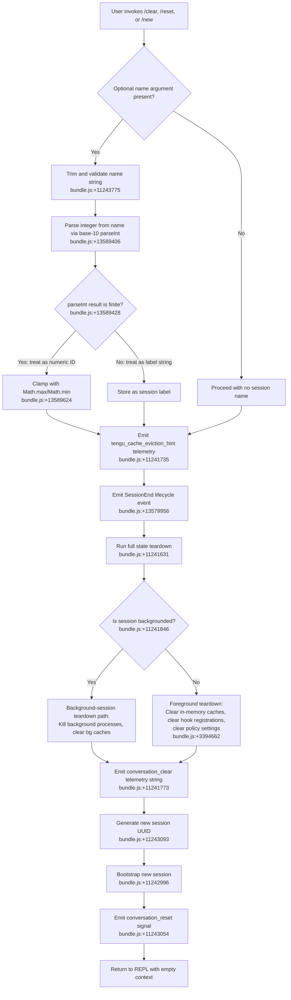

# `/clear`

> Analysis basis: CC v2.1.185 bundle.js (AST extraction + Claude interpretation)
> Minimum version: v2.1.185

---

## Overview

The `/clear` command starts a fresh conversation session with an empty context window while preserving the previous session on disk for later resumption via `/resume`. It is also aliased as `/reset` and `/new`, and accepts an optional name argument to label the new session. The command triggers a comprehensive state teardown — clearing in-memory caches, terminating background processes, emitting a `SessionEnd` lifecycle event, and then bootstrapping a new session — before returning control to the user.

---

## Registration

| Field | Value |
|---|---|
| type | `local` |
| name | `clear` |
| description | `Start a new session with empty context; previous session stays on disk (resumable with /resume)` |
| aliases | `reset`, `new` |
| argumentHint | `[name]` |
| supportsNonInteractive | `true` |
| thinClientDispatch | `post-text` |
| module_id | `Xol` |
| load_inline | `true` |
| loc_byte | `11243949` |
| loc_byte_end | `11244240` |
| loc_line | `6942` |
| arbor_handler.name | `RGp` |
| arbor_handler.fqn | `claude-2.1.185::RGp` |
| arbor_handler.kind | `AsyncFunction` |
| arbor_handler.resolution_path | `module_id` |
| arbor_handler.n_hits | `0` |

Analysis basis: CC v2.1.185 bundle.js:+11243949

---

## Input Branching

The handler has 3+ distinct paths depending on whether an optional session name is supplied, whether the session is backgrounded, and whether the full session teardown succeeds or produces errors. A Mermaid flowchart is used.



---

## Behavioral Spec

### Top-Level Handler: sessionClearHandler

The Arbor-resolved handler is `RGp` (AsyncFunction, resolved via `module_id` path).

```
async function sessionClearHandler(userInput, appContext):
    rawName = userInput.trim()                       # bundle.js:+11243775
    if rawName is not empty:
        parsedNumber = parseInt(rawName, 10)         # bundle.js:+13589406
        if Number.isFinite(parsedNumber):
            sessionId = clamp(parsedNumber, Math.max, Math.min)   # bundle.js:+13589624
        else:
            sessionLabel = rawName
    emit telemetry("tengu_cache_eviction_hint")      # bundle.js:+11241735
    runFullStateTeardown(appContext)
    generateNewSessionUUID()                         # bundle.js:+11243093
    bootstrapNewSession(appContext)
    emit "conversation_reset"                        # bundle.js:+11243054
    return newSession
```

Analysis basis: CC v2.1.185 bundle.js:+11243775

---

### Sub-feature: Full State Teardown (sessionTeardown)

`sessionTeardown` (bundle identifier: `G5t`) is the core reset routine. It performs a sequenced teardown of all live session state.

```
function sessionTeardown(appContext):
    # 1. Emit SessionEnd lifecycle hook event (triggers external hooks)
    emitLifecycleEvent("SessionEnd")                 # bundle.js:+13579956

    # 2. Clear in-memory caches
    clearPolicySettings()                            # bundle.js:+3394662
    clearHooks()                                     # bundle.js:+3394500
    clearSztCache()                                  # bundle.js:+34016
    clearCtrCache()                                  # bundle.js:+34028

    # 3. Abort and remove all running abort controllers
    for each runningAbortController in appContext:   # bundle.js:+11242395
        controller.abort()
    clearTimeout(pendingTimers)                      # bundle.js:+11242359

    # 4. Kill background processes if backgrounded
    if appContext.isBackgrounded:                    # bundle.js:+11241846
        kill all child processes (SIGKILL)
        emit "tengu_bg_dispatch_sigkill_escalate"

    # 5. Clear object-key maps and in-process state
    clearObjectKeys(appContext.stateMap)             # bundle.js:+11242084
    Object.entries(appContext).forEach(resetEntry)  # bundle.js:+11242198

    # 6. Flush pending I/O and stop active worktrees
    flushPendingIO()                                 # bundle.js:+13549393
    stopWorktrees()

    # 7. Clear skill index and MCP caches
    clearSkillIndexCache()                           # bundle.js:+13436797
    clearMCPCaches()                                 # pka, ZDa, dAr, fRa, tAr etc.

    # 8. Emit conversation_clear signal
    emit "conversation_clear"                        # bundle.js:+11241773
```

Analysis basis: CC v2.1.185 bundle.js:+11241631

---

### Sub-feature: Name Argument Parsing (nameParser)

The optional `[name]` argument is parsed by `W5t` (reached via `G5t` → `W5t`).

```
function nameParser(rawInput):
    trimmed = rawInput.trim()
    parsed = parseInt(trimmed, 10)                   # bundle.js:+13589406; base 10
    if Number.isFinite(parsed):                      # bundle.js:+13589428
        # Numeric: treated as a session slot ID; clamped to safe range
        result = clamp(parsed, lowerBound, upperBound)   # bundle.js:+13589624, +13589637
        # Note: lowerBound computed via Math.max, upperBound via Math.min
        # Step increment: 1000 ms (bundle.js:+13589593), offset: 10 (bundle.js:+13589417)
    else:
        # Non-numeric: stored as a human-readable session label
        result = trimmed
    return result
```

Analysis basis: CC v2.1.185 bundle.js:+13589406

---

### Sub-feature: SessionEnd Event Emission (sessionEndEvent)

Before any state is cleared, a `SessionEnd` hook event is fired, allowing external hooks to respond before the session context is destroyed.

```
function emitSessionEndEvent(appContext):
    event = buildLifecycleEvent("SessionEnd")        # bundle.js:+13579956
    dispatchToHookSystem(event, appContext)
    await hooksComplete()
```

The hook dispatch system (`lGe` → `Id` → `cx`) is the full REPL hook executor and fires all registered `SessionEnd` listeners including `PreToolUse`, `PostToolUse`, and plugin hooks before teardown continues.

Analysis basis: CC v2.1.185 bundle.js:+13579929

---

### Sub-feature: New Session Bootstrap (newSessionBootstrap)

After teardown, a new session is started.

```
function newSessionBootstrap(appContext, sessionLabel):
    newUUID = crypto.randomUUID()                    # bundle.js:+11243093
    initSession(newUUID, sessionLabel)               # bundle.js:+11242996
    startLogging()                                   # bundle.js:+11243362
    registerHooks(appContext)                        # bundle.js:+11243396
    emit "conversation_reset"                        # bundle.js:+11243054
    if sessionLabel is not null:
        applySessionLabel(newUUID, sessionLabel)
    return newSessionHandle
```

Analysis basis: CC v2.1.185 bundle.js:+11243093

---

### Sub-feature: Background Session Handling

When a session is backgrounded (`isBackgrounded` flag is set, bundle.js:+11241846), the teardown path invokes the background process manager (`f` → `M` → sub-functions) which:

- Sends `SIGKILL` to child processes after grace period (literals: `30`, `15` seconds — bundle.js:+17274979, +17274990)
- Emits `tengu_bg_dispatch_sigkill_escalate` telemetry (bundle.js:+17275024)
- Clears the background session roster
- Emits `tengu_daemon_control` for daemon coordination (bundle.js:+17311865)

The random jitter (literals: `2`, `1`, `0` — bundle.js:+14290350, +14290366, +11243790) is applied to `setTimeout` calls during background-process teardown to avoid thundering-herd on simultaneous clears.

Analysis basis: CC v2.1.185 bundle.js:+11241846

---

## State & Side Effects

| Item | Detail |
|---|---|
| Telemetry: `tengu_cache_eviction_hint` | Fired immediately when the clear command is invoked (bundle.js:+11241735) |
| Telemetry: `tengu_run_hook` | Fired for each hook dispatched during `SessionEnd` (bundle.js:+13629572) |
| Telemetry: `tengu_repl_hook_finished` | Fired after the `SessionEnd` hook cycle completes (bundle.js:+13613283) |
| Telemetry: `tengu_feature_ok` | Fired on successful hook execution path (bundle.js:+1021887) |
| Telemetry: `tengu_feature_bad` | Fired on failed hook execution path (bundle.js:+1021954) |
| Telemetry: `tengu_hook_plugin_metrics` | Fired for plugin hook timing data (bundle.js:+13607656) |
| Telemetry: `tengu_bg_dispatch_sigkill_escalate` | Fired if background process requires SIGKILL escalation (bundle.js:+17275024) |
| Telemetry: `tengu_daemon_control` | Fired for daemon coordination during teardown (bundle.js:+17311865) |
| Telemetry: `tengu_bg_spare_enable` | May fire if spare background session logic triggers (bundle.js:+17276322) |
| Telemetry: `tengu_session_renamed` | Fired if a session label is applied to the new session (bundle.js:+13487016) |
| Telemetry: `tengu_shell_set_cwd` | May fire if working directory is reset (bundle.js:+7031160) |
| Telemetry: `tengu_mcp_skills` | Fired during MCP cache/skill index clear (bundle.js:+6624964) |
| Hook registration | All hooks cleared during teardown (bundle.js:+3394500); re-registered during `newSessionBootstrap` |
| appState changes | `conversation_clear` emitted (bundle.js:+11241773); `conversation_reset` emitted (bundle.js:+11243054); new UUID assigned (bundle.js:+11243093) |
| Disk | Previous session left intact on disk; new session file started |
| Caches cleared | `Szt`, `ctr`, `pka` (u4e/Ioo), `ZDa` (Olt/y2t), `dAr` (mSe), `tAr` (UKe), `fRa` (GFn), `Ura` (Bee/iLe), `A5` (s5t), `T5n` (eQa), `gea` (COt/izr), MCP skill index, hook policy settings |
| Background processes | Killed if `isBackgrounded` is true; SIGKILL escalation after 30 s / 15 s grace (bundle.js:+17274979, +17274990) |
| Sound | <!-- TODO: not found in depth-2 traversal; needs --depth 4 --> |

---

## Version History

| Version | Change |
|---|---|
| v2.1.185 | Initial analysis |

---

## Common Mistakes

1. **Expecting immediate alias parity**: `/reset` and `/new` are registered aliases and behave identically to `/clear`; there is no behavioral difference between them.
2. **Assuming the previous session is lost**: The old session is preserved on disk and is recoverable with `/resume`. `/clear` does not delete conversation history.
3. **Providing a numeric name argument as a label**: A numeric-looking argument (e.g., `/clear 42`) is parsed via `parseInt` and treated as a session slot ID rather than a human-readable label. Use a non-numeric string for a readable session name.
4. **Invoking `/clear` during an active tool call**: The `SessionEnd` hook fires before teardown, but background processes may still be running. SIGKILL escalation applies only when `isBackgrounded` is true; in foreground sessions, active tool calls should be allowed to complete or cancelled separately before clearing.
5. **Expecting hooks to still run after the clear**: Hook registrations are cleared as part of teardown. Hooks fire for `SessionEnd` first, but any hooks that depend on the session context will not be available in the new session until re-registered during bootstrap.

---

## Appendix — Identifier Mapping

> For bundle debugging only. Identifiers change across versions.

| Identifier | Role |
|---|---|
| `RGp` | Top-level async handler for `/clear` (sessionClearHandler) |
| `G5t` | Full session state teardown function (sessionTeardown) |
| `W5t` | Optional name argument parser (nameParser) |
| `ub` | Policy settings accessor/mutator |
| `Ul` | Low-level settings store utility |
| `eie` | Hook registration store accessor |
| `KG` | Cache invalidation utility |
| `gx` | App state getter |
| `m8` | In-memory session cache manager |
| `CUr` | Cache read/write helper (chi.get / chi.set) |
| `mH` | Dual-cache clear (Szt.clear / ctr.clear) |
| `vUr` | Hook config store updater |
| `lGe` | SessionEnd event dispatcher |
| `Id` | Lifecycle event builder and dispatcher |
| `Lt` | App state reader |
| `NO` | App state alternate reader |
| `PC` | Model capability/effort resolver |
| `jR` | Reasoning effort resolver |
| `tD` | Session metadata builder |
| `Mt` | Message context builder |
| `cx` | REPL hook executor (main hook dispatch loop) |
| `hB` | Hook config loader |
| `T` | Hook type classifier |
| `G_e` | Hook type validator |
| `Pxo` | Plugin hook loader |
| `Rxo` | Third-party hook filter |
| `Wn` | Hook name resolver |
| `Pe` | JSON stringifier wrapper |
| `De` | Hook error logger |
| `Re` | Hook success recorder (tengu_feature_ok path) |
| `TOe` | Hook token counter |
| `wM` | Abort controller manager |
| `uce` | Hook use-counter |
| `FP` | Hook result finalizer |
| `a7n` | Hook worktree create handler |
| `xxo` | MCP tool hook executor |
| `u7n` | Hook JSON output parser |
| `Qce` | Hook plugin metrics aggregator |
| `Lxo` | HTTP hook executor |
| `F1l` | HTTP hook response parser |
| `b_e` | Hook block-type checker |
| `d7n` | Shell/spawn hook executor |
| `u3e` | Hook additional context injector |
| `ke` | Hook success path emitter |
| `F8` | Telemetry event emitter (uhd.emit) |
| `H5e` | Session bootstrapper (post-clear) |
| `Dgt` | Cache eviction hint emitter |
| `Qe` | Non-conforming signal handler |
| `Ur` | Async signal handler |
| `s` | Background session roster manager |
| `r` | Background session set |
| `Fs` | Process exit handler |
| `i` | Background session lifecycle manager |
| `n` | Session name normalizer |
| `f` | Background process manager (main) |
| `M` | Background session process host |
| `Dtt` | Daemon session reader |
| `d` | Daemon config writer |
| `CQ` | Background session config helper |
| `CMt` | Daemon file writer |
| `J1i` | Session filter utility |
| `g` | Buffer stream processor |
| `u` | Background session state manager |
| `k` | Daemon write handler |
| `h` | Socket timeout handler |
| `Jnc` | Session roster formatter |
| `fae` | Daemon session loader |
| `Bn` | IPC connection helper |
| `o` | Session padding formatter |
| `YKn` | Low-memory check (macOS) |
| `ct` | Memory threshold checker |
| `B$e` | Pin file manager (pins.json) |
| `nDt` | Pin file path builder |
| `Gt` | JSON.parse wrapper |
| `Mn` | ENOENT error handler |
| `zAd` | Directory recursive file lister |
| `$` | Permission classifier (allow/deny/classify) |
| `zlt` | Permission rule evaluator |
| `R6` | Permission decision maker |
| `NNo` | Background session claim sender |
| `Nko` | Session roster file writer |
| `f6f` | Claim send timeout handler |
| `p6f` | Claim frame builder |
| `wp` | Log writer (dn wrapper) |
| `Ee` | String coercion helper |
| `FM` | IPC frame builder |
| `jNo` | Background session lifecycle runner |
| `Ic` | Session socket path builder |
| `fa` | Session file state reader |
| `pg` | Session active-state checker |
| `OCe` | Hook path parser |
| `Pp` | Session persistence helper |
| `rft` | Session roster flush trigger |
| `P6t` | Roster path builder |
| `e_e` | Session extended data path builder |
| `iD` | Late session cleanup handler |
| `BN` | Background session state writer |
| `WM` | Late cleanup dispatcher |
| `R6t` | Roster entry path builder |
| `p` | Forced shutdown handler |
| `WT` | Forced shutdown signal emitter |
| `dn` | Debug logger |
| `Ue` | Non-conforming path handler |
| `od` | Object descriptor helper |
| `_E` | Session running-state setter |
| `QHo` | Comprehensive cache/state reset (clear all caches) |
| `AM` | Skill index cache clear coordinator |
| `Y5` | Skill index cache reset |
| `nBi` | Hook timer cache clear (tW.clear) |
| `V2e` | Session file writer |
| `nne` | Multi-subsystem cache reset |
| `mFe` | Main agent state resetter |
| `x5n` | Subagent cache cleaner |
| `nRt` | Session start event emitter |
| `pHt` | Post-compact cleanup trigger |
| `T5n` | eQa cache clearer |
| `gea` | COt/izr cache clearer |
| `zUa` | zUa cache clearer |
| `f0e` | f0e cache clearer |
| `ry` | Output token counter resetter |
| `A5` | s5t cache clearer |
| `pka` | u4e/Ioo cache clearer |
| `ZDa` | Olt/y2t cache clearer |
| `dAr` | mSe cache clearer |
| `Vol` | Vol state resetter |
| `fRa` | GFn cache clearer |
| `mrr` | Module cache presence checker |
| `tAr` | UKe cache clearer |
| `bYa` | bYa state resetter |
| `o4t` | J4n store accessor |
| `Ura` | Bee/iLe cache clearer |
| `wH` | Working-directory resolver and setter |
| `emr` | Async store context accessor |
| `AH` | Path normalizer |
| `wre` | Working-directory update helper |
| `Ar` | App state setter |
| `B2e` | Session state diff helper |
| `o0` | Session object initializer |
| `i_` | Pending I/O flush coordinator |
| `Yzn` | jOl pending set manager |
| `Xot` | waa worktree accessor |
| `fw` | MCP connection cleanup |
| `hot` | MCP plugin state builder |
| `Vwe` | MCP config hash builder |
| `Uk` | MCP skill loader |
| `Yol` | sEe skill loader accessor |
| `mh` | Session metadata emitter |
| `Au` | Session event emitter |
| `qi` | Hook registry entrypoint |
| `eO` | Session info builder |
| `Gm` | Session path builder |
| `j5t` | Session metadata event re-emitter |
| `ftr` | Session UUID generator with emission |
| `w2o` | Izt event emitter |
| `Rca` | Session config reloader |
| `fX` | Session extended metadata emitter |
| `B6` | Session rename handler |
| `$_e` | Session log appender |
| `mq` | Log file path resolver |
| `m6e` | Worktree symlink manager |
| `bxo` | Worktree directory creator |
| `Got` | Worktree path resolver |
| `fh` | Worktree file path builder |
| `mlt` | Worktree open helper |
| `hM` | Subagent path builder |
| `wf` | wf state resetter |
| `ro` | Module initializer / __esModule setter |
| `_` | SDK/SSE connection manager |
| `xht` | SSE connection state tracker |
| `pcc` | SSE object key inspector |
| `Ho` | Error/String coercion helper |
| `y` | Connection retry handler |
| `iA` | iA state resetter |
| `M6` | worktree-state event emitter |
| `sue` | isolation-latch session helper |
| `SOl` | Isolation log appender |
| `nW` | Plugin hook loader (main entry) |
| `hc` | Plugin settings reader |
| `dp` | Plugin settings path helper |
| `aZ` | Plugin allowlist checker |
| `xn` | Plugin module loader |
| `NKe` | Plugin hook install helper |
| `Ln` | Plugin log appender |
| `lhe` | Safe-mode plugin skip handler |
| `NRt` | New session full bootstrap |
| `Gy` | Session geometry helper |
| `sv` | Full REPL turn executor (session loop) |
| `a` | MCP server connection manager |
| `n3e` | MCP server connection builder |
| `uZn` | MCP connection result applier |
| `mta` | MCP retry scheduler |
| `l` | k0l MCP slot accessor |
| `B1o` | MCP client roster builder |
| `gi` | Session UUID/timestamp stamper |

---

Note: index built via Arbor fallback; some signals (telemetry, literals) may be missing — see arbor-fallback.js.