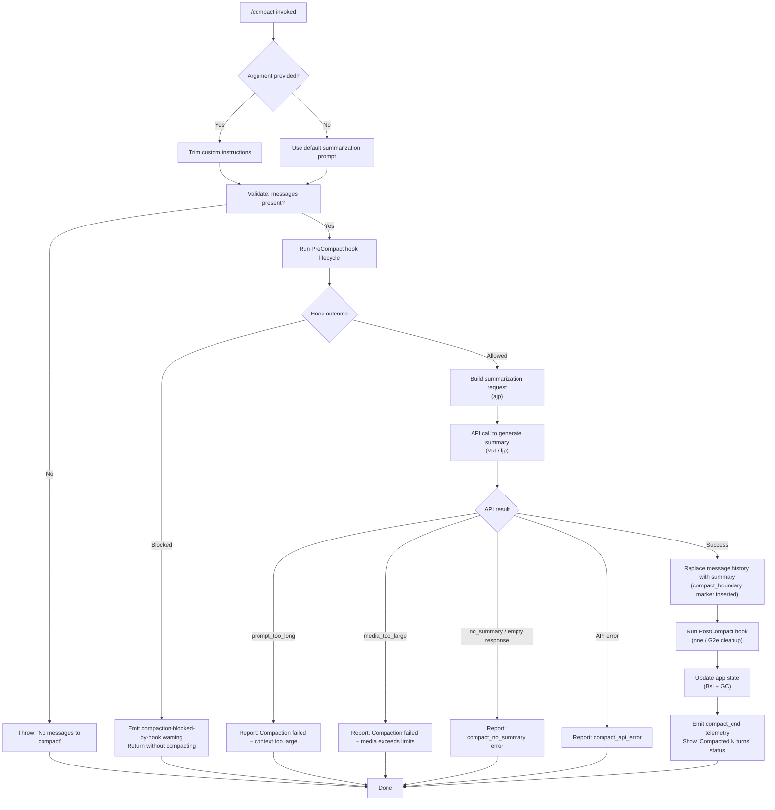

# `/compact`

> Analysis basis: CC v2.1.185 bundle.js (AST extraction + Claude interpretation)
> Minimum version: v2.1.185

---

## Overview

`/compact` frees up context window space by summarizing the conversation history into a condensed representation. The command invokes an async handler (`ijp`) that executes a `PreCompact` hook lifecycle, generates a summary via the API, replaces old messages with that summary, and then runs a `PostCompact` hook. An optional argument lets users provide custom summarization instructions.

---

## Registration

| Field | Value |
|---|---|
| type | `local` |
| name | `compact` |
| description | Free up context by summarizing the conversation so far |
| argumentHint | `<optional custom summarization instructions>` |
| supportsNonInteractive | `true` |
| thinClientDispatch | `post-text` |
| module_id | `jsl` |
| load_inline | `true` |
| loc_byte | 11274970 |
| loc_byte_end | 11275270 |
| loc_line | 7028 |
| arbor_handler.name | `ijp` |
| arbor_handler.fqn | `claude-2.1.185::ijp` |
| arbor_handler.kind | `AsyncFunction` |
| arbor_handler.resolution_path | `module_id` |
| arbor_handler.n_hits | 0 |

Analysis basis: CC v2.1.185 bundle.js:+11274970

---

## Input Branching

The handler has more than 3 distinct paths depending on argument presence, message availability, hook outcomes, and API results.



---

## Behavioral Spec

### 1. Entry validation (`ijp`)

```
async function handleCompact(context, argument):
    rawArg = argument ?? ""
    customInstructions = rawArg.trim()

    // Guard: must have messages
    messages = getConversationMessages(context)
    if messages is empty:
        throw Error("No messages to compact")

    // Collect context state for summarization
    appState = getAppState(context)
    systemPrompt = getSystemPrompt(context)
    ...proceed to hook phase
```

Analysis basis: CC v2.1.185 bundle.js:+11273971, +11274002, +11274034

---

### 2. Pre-compact hook phase (`ajp` → `Gsl` / `b6`)

```
async function runPreCompactHooks(context, appState):
    startTime = performance.now()

    // Fire PreCompact hook type
    hookResult = await runHookLifecycle("PreCompact", context)

    if hookResult.blocked:
        emitWarning("compaction-blocked-by-hook",
                    "compaction blocked by PreCompact hook")
        return { blocked: true }

    // Gather full conversation context
    conversationSnapshot = await gatherContextSnapshot(appState)
    // includes: messages, system prompt, custom instructions,
    //           allowed/disallowed tools, session metadata
    return { blocked: false, snapshot: conversationSnapshot }
```

Analysis basis: CC v2.1.185 bundle.js:+11270060, +11270082, +11270199, +10858162, +10858196

The literal `"compaction-blocked-by-hook"` (bundle.js:+10858162) and `"compaction blocked by PreCompact hook"` (bundle.js:+10858196) identify the exact warning emitted when a hook blocks compaction.

---

### 3. Summarization request dispatch (`Vut`)

```
async function requestSummary(snapshot, customInstructions):
    startTimer = performance.now()

    // Build prompt for summarization agent
    summaryPrompt = buildSummarizationPrompt(snapshot, customInstructions)
    // summaryPrompt uses a compact-aware system instruction:
    //   "You are a helpful AI assistant tasked with summarizing conversations."
    // (bundle.js:+10872771)

    // Tool use is blocked during compaction (deny mode)
    // "Tool use is not allowed during compaction" (bundle.js:+10869890)

    traceSpan = openTracingSpan("claude_code.compaction")

    result = await callAPI(summaryPrompt, {
        toolsAllowed: false,
        model: selectCompactionModel(context),
        spanType: "summary"
    })

    switch result.errorKind:
        case "prompt_too_long":
            reportError("compact_prompt_too_long")
            displayMessage("Compaction failed · conversation could not be reduced below the context limit")
            return { ok: false }
        case "media_too_large":
            reportError("compact_api_error")
            displayMessage("Compaction failed · attached media exceeds size limits")
            return { ok: false }
        case none:
            summaryText = extractTextContent(result)
            if summaryText is empty:
                reportError("compact_no_summary")
                displayMessage("Failed to generate conversation summary - response did not contain valid text content")
                return { ok: false }

    return { ok: true, summary: summaryText }
```

Analysis basis: CC v2.1.185 bundle.js:+10859009, +10859013, +10872771, +10869890, +10860225, +10860609, +10860638, +11271014, +11271136

The literal `"You are a helpful AI assistant tasked with summarizing conversations."` at bundle.js:+10872771 is the fixed system instruction passed to the compaction model. The `compact_boundary` marker literal at bundle.js:+13908935 is inserted as a boundary in the replacement message sequence.

---

### 4. Message replacement and state update

```
function replaceConversationWithSummary(appState, summaryText):
    // Insert compact_boundary sentinel message (role: "system")
    // literals: "system" (bundle.js:+13908913), "compact_boundary" (bundle.js:+13908935)
    boundaryMessage = {
        role: "system",
        type: "compact_boundary",
        index: 1,   // bundle.js:+13908989
        subindex: 0 // bundle.js:+13908994
    }

    // Replace all prior messages with summary block
    // Summary is wrapped: "<summary>" prefix (bundle.js:+5218357)
    newHistory = [boundaryMessage, assistantSummaryMessage(summaryText)]

    appState.messages = newHistory
    appState.compactMetadata = buildCompactMetadata(summaryText)
    // literal: "compactMetadata" (bundle.js:+11271344)

    setState(appState)
```

Analysis basis: CC v2.1.185 bundle.js:+13908913, +13908935, +13908989, +13908994, +5218357, +11271344

---

### 5. Post-compact cleanup (`nne` → `G2e`)

```
async function runPostCompactCleanup(context):
    // Reset cached state
    clearPrecomputedCompactions()      // T5n: eQa.clear
    clearCompactionCaches()            // gea: COt.clear, izr.clear
    resetAutonomousLoopDelivered()     // K2p.resetAutonomousLoopDelivered
    clearSubagentExit()                // subagent_exit handling
    // literal: "post_compact_cleanup" (bundle.js:+10686382)

    // Update UI state / conversation marker
    G2e(LRt.setState, ...)             // setState for LRt

    // Run PostCompact hooks if registered
    await runHookLifecycle("PostCompact", context)
```

Analysis basis: CC v2.1.185 bundle.js:+10686382, +10686509, +10686477, +10686483, +11274261

---

### 6. Status display and telemetry (`Bsl`)

```
function showCompactionStatus(context, summaryText, turnCount):
    // Display keybinding tip: app:toggleTranscript (ctrl+o)
    // literal: "app:toggleTranscript" (bundle.js:+11273263)
    // literal: "ctrl+o" (bundle.js:+11273295)

    statusLine = "Compacted " + formatTurnCount(turnCount)
    // literal: "Compacted " (bundle.js:+11273402)

    // dim display via Ht.dim
    displayStatus(Ht.dim(statusLine))

    // Emit telemetry
    emitTelemetry("tengu_compact", { ... })
    emitTelemetry("compact_end", { result: "success" })
    // literal: "compact_end" (bundle.js:+11271889)
    // literal: "Conversation compacted" (bundle.js:+13908491)
```

Analysis basis: CC v2.1.185 bundle.js:+11273263, +11273295, +11273395, +11273402, +11271889, +13908491

---

### 7. Cancellation path

```
// If user cancels during API call:
onAbort():
    displayMessage("Compaction canceled.")
    // literal: "Compaction canceled." (bundle.js:+11274543)
    emitTelemetry("compact_reactive_aborted", ...)
    return
```

Analysis basis: CC v2.1.185 bundle.js:+11274543

---

### 8. Reactive (automatic) compaction path (`jAo` → `Rvn`)

The reactive compaction path is separate from the manual `/compact` command but shares core summarization infrastructure (`M5n`, `Vut`):

```
async function reactiveCompact(context):
    // Guards
    if groupCount < 2:
        log("Reactive compact: fewer than 2 groups, nothing to compact")
        // literal: bundle.js:+5235638
        recordOutcome("too_few_groups")
        return

    if noAssistantMessages:
        log("Reactive compact: no assistant messages in summarize set, bailing")
        // literal: bundle.js:+5236202
        return

    // Attempt summarization
    result = await summarize(messagesToCompact, context)

    switch result:
        case "media_too_large":
            log("Reactive compact: summarize hit media-size error, retrying stripped")
            // literal: bundle.js:+5237329
            result = await summarize(messagesToCompact_stripped, context)
            if still failing: recordOutcome("media_unstrippable"); return

        case "ok":
            emitTelemetry("tengu_reactive_compact_succeeded")
            replaceConversationWithSummary(appState, result.summary)
```

Analysis basis: CC v2.1.185 bundle.js:+5235638, +5236202, +5237329, +10692885

---

## State & Side Effects

| Item | Detail |
|---|---|
| Telemetry | `tengu_compact` (bundle.js:+10862204), `tengu_compact_failed` (bundle.js:+10874108), `tengu_compact_cache_prefix` (bundle.js:+10859789), `tengu_compact_cache_sharing_success` (bundle.js:+10870834), `tengu_compact_cache_sharing_fallback` (bundle.js:+10871464), `tengu_reactive_compact_succeeded` (bundle.js:+10692885), `tengu_reactive_compact_attempt` (bundle.js:+5236447), `tengu_reactive_compact_failed` (bundle.js:+10690416), `tengu_compact_credits_clamp_rescue` (bundle.js:+5236290), `tengu_compact_ptl_retry` (bundle.js:+10860265), `tengu_model_fallback_triggered` (bundle.js:+10874447), `tengu_precomputed_compact_consumed` (bundle.js:+10685056), `tengu_precomputed_compact_discarded` (bundle.js:+10685695), `tengu_post_compact_file_restore_success` (bundle.js:+10875360), `tengu_post_compact_file_restore_error` (bundle.js:+10875402) |
| Hook registration | Fires `PreCompact` hook before summarization; fires `PostCompact` hook after message replacement. Hook type literals at bundle.js:+13575115 (`PreCompact`) and +13608882 (`PostCompact`). |
| appState changes | Conversation messages array replaced with `[compact_boundary sentinel, summary message]`. `compactMetadata` field set. LRt state updated via `G2e`. |
| Caches cleared | `eQa`, `COt`, `izr` cleared on post-compact cleanup (bundle.js:+10664532, +6675395, +6675407). `K2p.resetAutonomousLoopDelivered` called (bundle.js:+10686509). |
| Tracing span | Opens `claude_code.compaction` OTEL span (bundle.js:+10859013). |
| Sound | <!-- TODO: not found in depth-2 traversal; needs --depth 4 --> |
| Context window effect | Old messages replaced; only the summary text and boundary marker remain in the API context. The literal `"The system will automatically compress prior messages..."` at bundle.js:+13678206 reflects this design principle in the system prompt. |
| Non-interactive support | `supportsNonInteractive: true` — command is safe to invoke without a TTY (e.g. in pipeline or SDK mode via `thinClientDispatch: "post-text"`). |

---

## Version History

| Version | Change |
|---|---|
| v2.1.185 | Initial analysis |

---

## Common Mistakes

1. **Expecting compaction when no messages exist**: The handler immediately throws `"No messages to compact"` (bundle.js:+11274002) if the conversation history is empty. Run `/compact` only after some turns.
2. **Assuming all tools remain available during compaction**: Tool use is explicitly denied (`"Tool use is not allowed during compaction"`, bundle.js:+10869890). Hooks or subagent calls attempting tool calls during the summarization API request will be blocked.
3. **Forgetting that a PreCompact hook can cancel compaction**: A registered `PreCompact` hook returning a block signal causes the command to exit silently with a `"compaction blocked by PreCompact hook"` warning (bundle.js:+10858196) rather than producing a summary.
4. **Passing very long custom instructions**: The argument is trimmed (bundle.js:+11274034) but no length cap is enforced at the command layer; overly long instructions that push the summarization request over the context limit will trigger `compact_prompt_too_long`.
5. **Confusing reactive compaction with manual `/compact`**: Reactive compaction (`jAo` / `Rvn`) is triggered automatically by the runtime when context fills up; it uses the same core summarization machinery but has its own guards (minimum group count, etc.) and emits different telemetry events.

---

## Appendix — Identifier Mapping

> For bundle debugging only. Identifiers change across versions.

| Identifier | Role |
|---|---|
| `ijp` | Main `/compact` handler (AsyncFunction entry point) |
| `ajp` | Pre-compact orchestrator: fires hooks, gathers context, dispatches summarization |
| `Vut` | Summarization executor: calls API, handles errors, replaces message history |
| `ljp` | Compaction request builder / precomputed compact consumer |
| `jAo` | Reactive compaction orchestrator |
| `Rvn` | Reactive compaction summarization loop (handles retries, group slicing) |
| `M5n` | Core compaction pipeline (tool setup, token accounting, state mutations) |
| `Gsl` | Context snapshot collector (gathers appState, messages, system prompt) |
| `Xk` | System prompt assembly function (builds full prompt context) |
| `lX` | Context normalization and hook runner loader |
| `cx` | Hook executor (runs PreCompact / PostCompact lifecycle) |
| `nne` | Post-compact cleanup (clears caches, resets state) |
| `G2e` | App state setter (LRt.setState wrapper) |
| `Bsl` | Status display builder (shows "Compacted N turns", toggle hint) |
| `GC` | Action dispatcher (keybinding registration, toggleTranscript) |
| `Sel` | Main conversation loop / turn runner reached during compaction |
| `BNl` | Full API query pipeline (streaming, tool dispatch, fallback logic) |
| `d7n` | Hook spawn/execution engine (process spawning for shell hooks) |
| `Lxo` | HTTP hook executor |
| `xxo` | MCP tool hook executor |
| `vH` | Message sequence slicer (produces compact_boundary-terminated slice) |
| `VGn` | Compact boundary inserter |
| `wb` | Message boundary marker writer |
| `f5` | Session config loader |
| `ct` | Session state accessor / tool permission resolver |
| `Fr` | Last-assistant-message finder (used to locate summary anchor) |
| `v2n` | Turn state updater (sets compacted messages in appState) |
| `Jx` | Turn runner with compaction awareness |
| `_Ld` | Reactive compact inner retry loop |
| `TBi` | Token budget helper (Math.max/floor) |
| `FRt` | Compact boundary / summary splitter |
| `bnt` | Message part pusher (t.push / n.push) |
| `sN` | Prefix checker for compaction sentinel detection |
| `Pn` | Pipe / stream processor (IPC layer) |
| `T6f` | PTY/IPC message dispatcher |
| `LL` | Message normalization pipeline (serializes conversation to API format) |
| `$6n` | Prompt block assembler (builds API message array) |
| `O9p` | Conversation serializer entry point |
| `Tve` | Token budget monitor |
| `Sel` | Streaming response handler during compaction API call |
| `qho` | Compact-progress status renderer |
| `DOt` | OpenTelemetry span factory for compaction |
| `V$e` | OTEL resource attribute builder |
| `KCe` | Token counting / rounding utility |
| `NEp` | Model selector for compaction (opus/sonnet picker) |
| `Z4e` | Model availability checker |
| `b6` | System prompt + memory loader |
| `Gho` | Notification emitter during compaction progress |
| `w6n` | Stream mode / response-length config builder |
| `ehe` | Output token limit calculator |
| `YTe` | Context window size lookup by model |
| `yae` | Max-output-tokens parser (parseInt / isNaN) |
| `Dvn` | Last-summary-text finder |
| `kvn` | findLast wrapper for message search |
| `odt` | Tool-call denier during compaction |
| `Qbe` | Tool-deny response builder |
| `P5n` | Post-compact file restore orchestrator |
| `F5n` | Post-compact file restore from appState |
| `O5n` | Post-compact diagnostics collector |
| `U5n` | Post-compact plan file restorer |
| `N5n` | Post-compact memory restorer |
| `dHe` | Post-compact hook runners init |
| `Cke` | Post-compact tool permission reconciler |
| `O6e` | Post-compact MCP resource restorer |
| `gi` | Message ID/UUID generator |
| `nW` | Plugin hook loader |
| `vke` | Context assembly for compaction summary request |
| `WAo` | Worktree-aware message mapper |
| `Y6e` | Anti-hallucination message filter |
| `mvn` | Token count rounder |
| `fvn` | Token usage tracker (forEach aggregator) |
| `gwd` | Per-message token usage mapper |
| `Bm` | Token rounding helper (Math.round) |
| `bk` | Tool schema builder (PC + jR) |
| `Fh` | AppState getter shorthand |
| `mFe` | Agent type prefix checker |
| `Eae` | Extended thinking capability checker |
| `C7` | Extended thinking / uee wrapper |
| `Eel` | Error handler for compaction API failures |
| `FI` | Fallback credit shift handler |
| `VBe` | Status setter (e.setStatus) |
| `xOt` | Compaction span attribute recorder |
| `rW` | Message array type guard |
| `_el` | Message truncation slicer (for precomputed compact) |
| `ant` | Summary sentinel detector |
| `she` | Array-based sentinel checker |
| `bRt` | Sentinel parser (match / parseInt) |
| `HLd` | Summary text cleaner (replace / match / trim) |
| `$Rt` | Summary wrapper builder (`<summary>` tag) |
| `Gm` | Git/env info builder |
| `ow` | Permission mode string builder |
| `Hl` | String coercer |
| `OMt` | REPL context getter |
| `iw` | Session file writer |
| `ro` | Module loader (DKt.call / MKt.bind) |
| `Ue` | User message formatter |
| `Qe` | Query message formatter |
| `os` | Output stats builder |
| `Fg` | Formatting helper |
| `Pe` | JSON serializer (JSON.stringify) |
| `Ee` | String coercer (String) |
| `Re` | Result renderer |
| `De` | Error dispatcher |
| `ke` | Message key builder |
| `Pt` | Result formatter |
| `TJ` | Turn journal writer |

---

Note: index built via Arbor fallback; some signals (telemetry, literals) may be missing — see arbor-fallback.js.