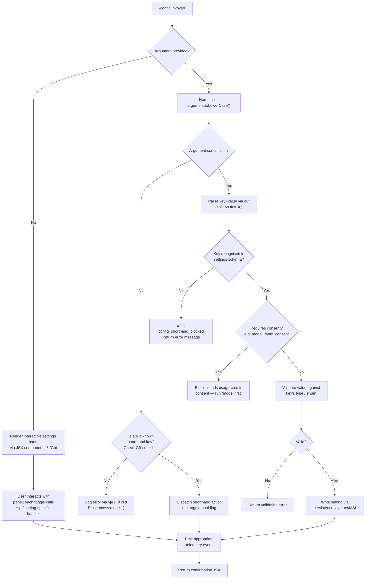

# `/config`

> Analysis basis: CC v2.1.185 bundle.js (AST extraction + Claude interpretation)
> Minimum version: v2.1.185

---

## Overview

`/config` (also aliased as `/settings`) opens the interactive settings panel inside Claude Code, allowing the user to inspect and toggle a broad set of preferences — from model selection and notification channels to UI behavior, editor mode, and feature flags. When invoked with a `key=value` shorthand argument, it can set individual settings directly from the command line without opening the full panel. The command is implemented as an async JSX-returning handler (`Cqp`) that renders a local-jsx component backed by the shared settings-persistence layer.

---

## Registration

| Field | Value |
|---|---|
| type | `local-jsx` |
| name | `config` |
| description | `Open settings` |
| argumentHint | `[key=value]` |
| aliases | `["settings"]` |
| module_id | `sll` |
| load_inline | `true` |
| loc_byte | `11673843` |
| loc_byte_end | `11674121` |
| arbor_handler.name | `Cqp` |
| arbor_handler.fqn | `claude-2.1.185::Cqp` |
| arbor_handler.kind | `AsyncFunction` |
| arbor_handler.resolution_path | `module_id` |
| arbor_handler.n_hits | `0` |

Analysis basis: CC v2.1.185 bundle.js:+11673843

---

## Input Branching

The handler `Cqp` has four or more distinct paths depending on whether an argument is provided, whether it is a shorthand `key=value` pair, whether the key is a known setting, and whether the target requires consent. A Mermaid flowchart is used.



Analysis basis: CC v2.1.185 bundle.js:+11672895, +11672966, +11672985, +11673095, +11673137

---

## Behavioral Spec

### 1. Handler entry point (`Cqp`)

`Cqp` is an `AsyncFunction` resolved via module `sll` (Arbor path: `module_id`).

```
async function configCommandHandler(options, context):
    rawArg = options.args ?? ""
    normArg = rawArg.toLowerCase()

    if normArg is empty:
        return renderSettingsPanel(context)   // JSX via createElement

    if isShorthandOnlyKey(normArg, knownShorthands):
        // e.g. bare flag names in G9 or uoe lists
        dispatchShorthandToggle(normArg, context)
        return renderConfirmation()

    parsed = parseKeyValueArg(normArg)        // a6t
    if parsed.key not in settingsSchema:
        emitTelemetry("config_shorthand_blocked")
        return errorMessage("Unknown setting key")

    if requiresConsent(parsed.key):
        return errorMessage("needs usage-credits consent — run /model first")

    validationError = validateValue(parsed.key, parsed.value)
    if validationError:
        return errorMessage(validationError)

    writeSetting(parsed.key, parsed.value)    // co / MSt persistence
    emitSettingChangedTelemetry(parsed.key)
    return renderConfirmation()
```

Analysis basis: CC v2.1.185 bundle.js:+11672895, +11672966, +11672985, +11673001, +11673018, +11673095, +11673137

---

### 2. Argument parser (`a6t`)

Parses a raw `key=value` string into its components.

```
function parseKeyValueArg(raw):
    trimmed = raw.trim()
    if not trimmed.includes("="):
        return { key: trimmed, value: null }
    eqIndex = trimmed.indexOf("=")
    key   = trimmed.slice(0, eqIndex)
    value = trimmed.slice(eqIndex + 1)
    // further split on commas for array-valued keys
    if value.includes(","):
        value = value.split(",").map(trim)
    return { key, value }
```

Analysis basis: CC v2.1.185 bundle.js:+11313214, +11313231, +11313265, +11313321, +11313338, +11313447, +11313482, +11313494

---

### 3. Interactive settings panel component (`c6t` / `Gpt` / `M_o`)

When no argument is provided the command renders a JSX-based interactive panel. The call chain is:

```
renderSettingsPanel(context):
    appState = context.getAppState()
    // Build ordered list of setting rows via Gpt
    sections = buildSettingsSections(appState)
    // Each section item is a SettingRow rendered by M_o
    for each item in sections:
        row = buildSettingRow(item, appState)
        attach onChange handler: Hjp (patch + persist)
    return JSXElement(<SettingsPanel rows=rows>)
```

`Gpt` constructs the full list of configurable items. The sections observed in literals are (in order):

| Key (internal) | Display label |
|---|---|
| `model` | Model |
| `verbose` | Verbose output |
| `preferredNotifChannel` | Notifications |
| `inputNeededNotifEnabled` | (push notification toggle) |
| `agentPushNotifEnabled` | Push when Claude decides |
| `autoCompact` / `autoCompactEnabled` | Auto-compact |
| `switchModelsOnFlag` | (refusal fallback) |
| `tips` | Show tips |
| `reduceMotion` | Reduce motion |
| `thinking` | Thinking mode |
| `fast` | Fast mode |
| `promptSuggestionEnabled` | Prompt suggestions |
| `recap` | Session recap |
| `checkpoints` / `fileCheckpointingEnabled` | Rewind code (checkpoints) |
| `workflows` / `workflowKeywordTriggerEnabled` | Dynamic workflows / Ultracode keyword trigger |
| `progressBar` / `terminalProgressBarEnabled` | Terminal progress bar |
| `showStatusInTerminalTab` | Show status in terminal tab |
| `turnDuration` / `showTurnDuration` | Show turn duration |
| `precomputeCompactionEnabled` | Precompute compaction |
| `timestamps` / `showMessageTimestamps` | Show message timestamps |
| `permissionMode` | Default permission mode |
| `worktreeBaseRef` | Worktree base ref |
| `useAutoModeDuringPlan` | Use auto mode during plan |
| `gitignore` | Respect .gitignore in file picker |
| `copyFullResponse` | Skip the /copy picker |
| `copyOnSelect` | Copy on select |
| `autoScroll` / `autoScrollEnabled` | Auto-scroll |
| `agentsView` / `defaultToAgentsView` / `leftArrowOpensAgents` | Agents view |
| `autoUpdatesChannel` | Auto-update channel |
| `theme` | Theme |
| `notifChannel` | Notifications (local) |
| `outputStyle` | Output style |
| `defaultView` | Default view |
| `language` | Language |
| `editor` / `editorMode` | Editor mode |
| `externalEditorContext` | Show last response in external editor |
| `prStatus` | Show PR status footer |
| `diffTool` | Diff tool |
| `autoConnectIde` | Auto-connect to IDE |
| `autoInstallIdeExtension` | Auto-install IDE extension |
| `chrome` | Claude in Chrome |
| `teammateMode` | Teammate mode |
| `teammateDefaultModel` | Default teammate model |
| `remoteControl` / `remoteControlAtStartup` | Enable Remote Control |
| `showExternalIncludesDialog` | External CLAUDE.md includes |
| `apiKey` | Use custom API key |
| `fullscreen` | Fullscreen |

Analysis basis: CC v2.1.185 bundle.js:+11297229, +11297354, +11297520, +11297605, +11297787, +11297967, +11298189, +11298425, +11298640, +11298947, +11299192, +11299586, +11299817, +11300042, +11300305, +11301030, +11301320, +11301601, +11301850, +11302177, +11302464, +11303079, +11303518, +11303903, +11304145, +11304334, +11304495, +11304701, +11305291, +11305554, +11305737, +11306256, +11306592, +11307047, +11307375, +11307635, +11307939, +11308602, +11308849, +11309130, +11309435, +11309772, +11310096, +11310577, +11311158, +11311360

---

### 4. Per-setting change handler (`Hjp`)

When the user changes a value in the panel, `Hjp` orchestrates persistence and telemetry.

```
async function applySettingChange(settingKey, newValue, appState):
    // Apply json-patch or direct mutation via si.patch
    patchedSettings = applyPatch(currentSettings, settingKey, newValue)

    // Persist: write to appropriate config tier
    if settingKey targets userSettings:
        persistUserSettings(patchedSettings)     // co / MSt
    else if settingKey targets projectSettings:
        persistProjectSettings(patchedSettings)  // co / MSt
    // (localSettings, policySettings, flagSettings follow same pattern)

    // Update in-memory appState
    appState.settings = patchedSettings

    // Emit key-specific telemetry (see State & Side Effects)
    emitTelemetry(telemetryEventForKey(settingKey))

    // Some keys additionally call external APIs:
    if settingKey in ["preferredNotifChannel", "inputNeededNotifEnabled",
                      "agentPushNotifEnabled"]:
        await patchNotifPrefsRemote()   // Hjp → PS → Ln → ke / Re / Pt
```

Analysis basis: CC v2.1.185 bundle.js:+11289309, +11289337, +11289372, +11289413, +11289450, +11289495, +11289548, +11289375

---

### 5. Settings persistence layer (`co` / `MSt` / `pn` / `q_e`)

Settings are stored in up to five JSON tiers: `policySettings`, `flagSettings`, `userSettings`, `projectSettings`, `localSettings`.

```
function loadSettings():
    // Trace: loadSettingsFromDisk_start → loadSettingsFromDisk_end
    for tier in [policy, flag, user, project, local]:
        raw = readFileSync(resolveTierPath(tier))   // q_e
        parsed = JSON.parse(raw)
        merge(accumulator, parsed)
    return accumulator

function writeSettings(tier, data):
    path = resolveTierPath(tier)
    // Atomic write via MSt:
    //   1. Write to temp file with random hex suffix (6 bytes → 12 hex chars)
    //   2. fchmodSync to apply original permissions
    //   3. fsyncSync to flush
    //   4. renameSync temp → target (atomic on POSIX)
    //   5. On EACCES: in-place fallback write (logged)
    atomicWriteFileSync(path, JSON.stringify(data))
```

Config file paths (relative to project root):

- Project settings: `.claude/settings.json` (bundle.js:+1313104, +1313114)
- Local settings: `.claude/settings.local.json` (bundle.js:+1313176)

Config lock contention guard: if lock acquisition exceeds 100 ms, emits `tengu_config_lock_contention` (bundle.js:+13966651, +13966746).

Auth-loss prevention: if a re-read of the config file is missing auth data that the in-memory cache has, the write is refused and `tengu_config_auth_loss_prevented` is emitted (bundle.js:+13967225). Fallback message: `"saveConfigWithLock: re-read config is missing auth that cache has; refusing to write..."` (bundle.js:+13967073).

Analysis basis: CC v2.1.185 bundle.js:+1332384, +1332406, +1333030, +1333145, +1333168, +1329958, +1330014

---

### 6. Model setting specifics

When `model` is changed via the panel the change path is:

```
function onModelChange(newModelValue, appState):
    // Validate against known model aliases:
    //   "fable", "opusplan", "sonnet", "haiku", "opus", "best",
    //   "opus-4-6", "sonnet-4-6", "opus-4-7", "opus-4-8"
    if newModelValue requires usage-credits consent:
        emitTelemetry("model_fable_consent")
        return blocked("needs usage-credits consent — run /model first")
    updateModelInSettings(newModelValue)
    emitTelemetry("tengu_config_model_changed")
```

Display suffix notes from literals:
- `" · Draws from usage credits"` — shown for credit-based models (bundle.js:+11297132)
- `" · this session only — /model to set up"` — shown for session-scoped models (bundle.js:+11297172)
- `"For a specific model ID, use /model."` — shown as panel hint (bundle.js:+11308362)

Analysis basis: CC v2.1.185 bundle.js:+11296908, +11296910, +11297229

---

### 7. Fast mode (`fast` / `dL` / `Woe`)

Fast mode availability is checked at render time through a state machine:

```
function resolveFastModeState(authKind, orgStatus, platform):
    if platform is not direct Anthropic API:
        return UNAVAILABLE("Fast mode is only available when using the Anthropic API directly")
    if platform is Agent SDK:
        return UNAVAILABLE("Fast mode is not available in the Agent SDK")
    if orgStatus == "pending":
        return CHECKING("Checking fast mode availability (org status pending)")
    if orgStatus == "disabled" or "network_error" or "unknown":
        return UNAVAILABLE(...)
    if authKind == "oauth" or "api-key":
        return AVAILABLE(currentValue)
    return UNAVAILABLE(...)
```

Panel label: `"Fast mode"` with `ON` / `OFF` display (bundle.js:+11299451, +11299463, +11299531).

Analysis basis: CC v2.1.185 bundle.js:+11299192, +11299451, +2260208, +2260276, +2260623, +2260693, +2260785, +2260864, +2260913

---

### 8. Notification preference remote patch (`Hjp` → notification sub-path)

For push-notification settings, `Hjp` performs a remote PATCH API call:

```
async function patchRemoteNotifPrefs(key, value, authToken):
    emitTelemetry("notif_prefs_patch")
    if no auth:
        emitTelemetry("notif_prefs_patch") with status "no_auth"
        return
    try:
        response = await httpPatch(notifPrefsEndpoint, {key: value}, authToken)
        emitTelemetry("notif_prefs_patch_ok")
    catch httpError:
        emitTelemetry("notif_prefs_patch_failed") with reason "http_error"
```

Analysis basis: CC v2.1.185 bundle.js:+11289375, +11289395, +11289416, +11289423, +11289511, +11289571

---

### 9. Error handling and CLI error path (`yje` / `Fs`)

For fatal argument errors (unrecognised shorthand), the error path:

```
function reportCliError(message):
    console.error(Ht.red(message))       // red-coloured stderr output
    // error kind literal: "cli_error"
    writeErrorRecord("cli_error", message)  // eI → Nre.writeFileSync
    process.exit(1)
```

Analysis basis: CC v2.1.185 bundle.js:+13324698, +13324712, +13324743, +13324753, +13324766, +13324779

---

## State & Side Effects

| Item | Detail |
|---|---|
| Telemetry: model changed | `tengu_config_model_changed` (bundle.js:+11296910) |
| Telemetry: feature toggle ok/sad/bad | `tengu_feature_ok`, `tengu_feature_sad`, `tengu_feature_bad` (bundle.js:+1021887, +1022035, +1021954) |
| Telemetry: push notif pref | `tengu_push_notif_pref_changed` (bundle.js:+11297685) |
| Telemetry: auto-compact | `tengu_auto_compact_setting_changed` (bundle.js:+11298123) |
| Telemetry: refusal fallback | `tengu_refusal_fallback_setting_changed` (bundle.js:+11298361) |
| Telemetry: tips | `tengu_tips_setting_changed` (bundle.js:+11298592) |
| Telemetry: reduce motion | `tengu_reduce_motion_setting_changed` (bundle.js:+11298890) |
| Telemetry: thinking toggled | `tengu_thinking_toggled` (bundle.js:+11299111) |
| Telemetry: fast mode (penguins) | `tengu_penguins_off` (bundle.js:+2260314) |
| Telemetry: fast mode chomp | `tengu_chomp_inflection` (bundle.js:+11299552) |
| Telemetry: sedge lantern | `tengu_sedge_lantern` (bundle.js:+11299786) |
| Telemetry: file history snapshots | `tengu_file_history_snapshots_setting_changed` (bundle.js:+11300229) |
| Telemetry: maple sundial | `tengu_maple_sundial` (bundle.js:+11294778) |
| Telemetry: terminal progress bar | `tengu_terminal_progress_bar_setting_changed` (bundle.js:+11301219) |
| Telemetry: terminal sidebar | `tengu_terminal_sidebar` (bundle.js:+11301286) |
| Telemetry: terminal tab status | `tengu_terminal_tab_status_setting_changed` (bundle.js:+11301534) |
| Telemetry: turn duration | `tengu_show_turn_duration_setting_changed` (bundle.js:+11301758) |
| Telemetry: sepia moth | `tengu_sepia_moth` (bundle.js:+11301822) |
| Telemetry: precompute compaction | `tengu_precompute_compaction_setting_changed` (bundle.js:+11302078) |
| Telemetry: silk hinge | `tengu_silk_hinge` (bundle.js:+11302149) |
| Telemetry: message timestamps | `tengu_show_message_timestamps_setting_changed` (bundle.js:+11302393) |
| Telemetry: respect gitignore | `tengu_respect_gitignore_setting_changed` (bundle.js:+11304084) |
| Telemetry: fullscreen (amber creek / pewter brook) | `tengu_amber_creek`, `tengu_pewter_brook` (bundle.js:+3545521, +3545429) |
| Telemetry: default view | `tengu_default_view_setting_changed` (bundle.js:+11306976) |
| Telemetry: editor mode | `tengu_editor_mode_changed` (bundle.js:+11307565) |
| Telemetry: external editor context | `tengu_external_editor_context_changed` (bundle.js:+11307880) |
| Telemetry: PR status footer | `tengu_pr_status_footer_setting_changed` (bundle.js:+11308194) |
| Telemetry: diff tool | `tengu_diff_tool_changed` (bundle.js:+11308767) |
| Telemetry: auto-connect IDE | `tengu_auto_connect_ide_changed` (bundle.js:+11309039) |
| Telemetry: auto-install IDE extension | `tengu_auto_install_ide_extension_changed` (bundle.js:+11309343) |
| Telemetry: Claude in Chrome | `tengu_claude_in_chrome_setting_changed` (bundle.js:+11309679) |
| Telemetry: teammate mode | `tengu_teammate_mode_changed` (bundle.js:+11310046) |
| Telemetry: notif prefs patch | `tengu_push_notif_pref_changed`, `notif_prefs_patch`, `notif_prefs_patch_ok`, `notif_prefs_patch_failed` |
| Telemetry: config I/O events | `tengu_config_lock_contention`, `tengu_config_stale_write`, `tengu_config_auth_loss_prevented`, `tengu_config_parse_error`, `tengu_config_fallback_write` |
| Telemetry: kairos push | `tengu_kairos_push_notifications`, `tengu_kairos_input_needed_push` |
| Telemetry: CCR bridge | `tengu_ccr_bridge` |
| Telemetry: auto mode config | `tengu_auto_mode_config` |
| Telemetry: amber flint | `tengu_amber_flint` (bundle.js:+7049324) |
| appState changes | `e.setAppState` called from `M_o` after each toggle (bundle.js:+11317268); fields updated depend on changed key |
| File writes | Atomic write to `.claude/settings.json` or `.claude/settings.local.json` via `MSt`; `~/.claude.json` for global config via `pn`/`q_e` |
| Cache invalidation | `mH` clears two internal caches (`Szt.clear`, `ctr.clear`) after settings write (bundle.js:+34016, +34028) |
| Remote API call | PATCH to notification preference endpoint when push notification settings change (`Hjp` → `PS`) |
| Error output | `console.error` with red ANSI colour on unknown shorthand; `process.exit(1)` (bundle.js:+13324766) |
| Gitignore side-effect | `Ves` may call `hSe.appendFile` / `hSe.writeFile` on `.gitignore` for the `.claude/settings.local.json` path (bundle.js:+1167118, +1167180) |
| Event emitter | `pze.emit` fires after a config write in `co` (bundle.js:+1333602) |

---

## Version History

| Version | Change |
|---|---|
| v2.1.185 | Initial analysis |

---

## Common Mistakes

1. **Using `/config` to set a `fable`/usage-credits model without prior consent.** The command blocks and instructs the user to run `/model` first. Use `/model` to complete consent flow before setting the model via `/config`.
2. **Expecting `/config key=value` to work with arbitrary model IDs.** Only alias names (e.g. `sonnet`, `opus`, `haiku`, `best`) are accepted as shorthands; full model IDs require `/model` or direct JSON editing. The panel hints `"For a specific model ID, use /model."` (bundle.js:+11308362).
3. **Omitting the `=` when trying to set a value.** Without `=`, the argument is interpreted as a bare shorthand toggle, not a key-value assignment. Unknown bare shorthands cause an immediate `process.exit(1)`.
4. **Editing `.claude/settings.local.json` manually while Claude Code is running.** The atomic write path uses rename-based replacement; concurrent external edits may be silently overwritten. The lock contention guard only applies to Claude Code processes, not external editors.
5. **Assuming `/settings` and `/config` behave differently.** `settings` is a registered alias for `config` and invokes the identical handler.
6. **Toggling Fast mode on non-Anthropic-API deployments.** Fast mode is gated to direct Anthropic API auth; Bedrock, Vertex, Foundry, and Agent SDK sessions will see the unavailability message regardless of the toggle state.

---

## Appendix — Identifier Mapping

> For bundle debugging only. Identifiers change across versions.

| Identifier | Role |
|---|---|
| `Cqp` | Main async handler for `/config` command (arbor handler) |
| `Fs` | CLI error reporter (writes error record, exits) |
| `yje` | Error formatter (console.error + red colour) |
| `eI` | Error record file writer (Nre.writeFileSync) |
| `c6t` | Settings panel JSX component factory |
| `Gpt` | Settings item list builder (constructs all setting rows) |
| `mX` | Inner component helper for settings panel |
| `Ajn` | Setting row renderer sub-component |
| `co` | Core settings read/write orchestrator |
| `QA` | Settings loader (reads policy/flag tiers) |
| `jt` | File existence / stat utility |
| `Thr` | Settings file path resolver |
| `B2` | Multi-tier settings merger |
| `bv` | Settings cache accessor |
| `Mn` | ENOENT-safe file reader |
| `RAr` | Cache timestamp updater (Vtn.set + Date.now) |
| `c1e` | Settings reload helper |
| `MSt` | Atomic file writer (temp + fsync + rename) |
| `Pe` | JSON serialiser (JSON.stringify) |
| `mH` | Settings cache invalidator (clears Szt and ctr) |
| `Ves` | Gitignore updater for settings.local.json |
| `J9` | Config directory path joiner (.claude) |
| `Ar` | Generic utility (gx) |
| `ke` | Feature-ok telemetry emitter |
| `Pt` | Feature-sad telemetry emitter |
| `Re` | Feature-bad telemetry emitter |
| `_j` | Settings-from-disk loader (loadSettingsFromDisk_start/end) |
| `De` | Async operation dispatcher / error boundary |
| `E` | Token / rate limit math helper (Math.max, Math.min) |
| `_` | Background worker / connection manager |
| `w` | Background worker sweep scheduler |
| `kz` | Blur-state tracker |
| `L` | Worker lifecycle manager (respawn, retire, prewarm) |
| `v` | Miscellaneous state value |
| `Dec` | Decay/history helper (e.at) |
| `c4` | Model selection component |
| `vo` | Model list / provider resolver |
| `$un` | Model metadata aggregator |
| `Pg` | Model display-name formatter |
| `_s` | Model alias normaliser (fable, opusplan, sonnet, haiku, opus, best) |
| `eDe` | Model alias–to–ID expander |
| `o` | Padding/alignment helper (padEnd) |
| `IA` | Model list filter (includes check) |
| `Oj` | Boolean flag display helper |
| `Dk` | Model tier classifier (firstParty, default_claude_zero) |
| `JB` | Model pricing/tier helper |
| `yH` | Provider-aware model helper |
| `sT` | Auth/provider type resolver (bedrock, foundry, vertex, mantle…) |
| `Ife` | Internal provider flag getter |
| `Cfe` | Pro-plan check helper |
| `wr` | Base provider/auth accessor |
| `sa` | Model family resolver (Opus, Sonnet) |
| `Kv` | Settings context provider (wraps co) |
| `T_o` | Setting-row interactive component |
| `lil` | Row component (Gr + Ct) |
| `Hjp` | Per-setting change handler (patch + persist + telemetry + optional remote call) |
| `Qe` | Rendering utility (ogt) |
| `ogt` | JSX element factory alias |
| `FCn` | v7-based helper (feature flag client) |
| `v7` | Feature flag lookup |
| `uc` | Auth credential accessor |
| `st` | String/value primitive helper |
| `dL` | Fast mode state resolver |
| `Woe` | Fast mode availability checker (org status, auth kind) |
| `l4` | Async feature state hook |
| `zbe` | Thinking mode helper |
| `eNe` | Provider-aware fast mode resolver |
| `ct` | Setting persistence hook (read/write single key) |
| `wxt` | Setting key decoder |
| `Lxt` | Setting schema validator |
| `I4` | Type descriptor resolver (T4) |
| `OHn` | Cache-aware setting getter |
| `Ct` | Disk-backed setting accessor (jt + vx + Date.now) |
| `iUr` | Notification preferences client |
| `aUr` | Notification pref PATCH caller (NJu) |
| `$pt` | Checkpoint-settings helper |
| `tDe` | Checkpoint toggle persistence |
| `pn` | Global config save orchestrator |
| `W7n` | Config-with-lock writer (lock acquisition, backup, atomic rename) |
| `LMe` | Config migration helper |
| `_ko` | Config entries iterator |
| `oWt` | Config lock timestamp checker |
| `q_e` | Global config reader (readFileSync, parse, validate) |
| `AAt` | Auth presence validator |
| `j7n` | Config save-with-fallback helper |
| `$` | Permission rules array |
| `zlt` | Permission rule parser |
| `R6` | Permission rule evaluator (allow/deny/classify/ask) |
| `B` | Output stream write-and-debounce helper |
| `R` | Pending write tracker |
| `d` | Daemon worker instance |
| `P` | Timer reference (unref) |
| `t1` | Notification channel validator (vR.includes) |
| `eze` | Enum value normaliser |
| `wR` | Notification label helper (lnn) |
| `lnn` | Notification label map |
| `xn` | Settings merge helper (Mnn + B2) |
| `Mnn` | Settings tier merger (i2o, Thr, a2o) |
| `CNt` | Config diagnostics builder (dG, N0o, W_e) |
| `dG` | Config entry enumerator |
| `N0o` | Config node builder (Q9, Sw, qhr) |
| `h2` | Config section header renderer |
| `W_e` | Config rule mapper (Yg) |
| `Os` | Fullscreen availability checker |
| `L2` | Fullscreen state cache (zqc.has) |
| `tM` | Animation-enabled checker |
| `PFr` | Fullscreen-disabled static message renderer |
| `_Z` | Fullscreen environment detector (Ced) |
| `RFr` | Fullscreen runtime resolver (zt + Boolean) |
| `Gr` | Settings context reader (_j) |
| `ved` | Fullscreen event subscriber (ct) |
| `GR` | Notification gateway client (uQe) |
| `uQe` | Notification API caller (KNr) |
| `AX` | Notification + auth combined helper |
| `_a` | Auth token extractor |
| `hc` | UI component: safe-mode / bare-mode flag renderer |
| `Ul` | Safe-mode flag renderer (GKt) |
| `dp` | Bare-mode flag renderer (GKt) |
| `L4` | Setting value prefix stripper (startsWith/slice) |
| `C_o` | Config shorthand description builder |
| `eCn` | Input-needed push notification handler |
| `Ude` | Unset/reset setting helper |
| `Ue` | Rendering primitive (ogt) |
| `pil` | Model picker component (WK + filters) |
| `WK` | Model list fetcher (wr + Mu + bfe + Yoe) |
| `y_o` | Model alias filter (dee, sT) |
| `E_o` | Extended alias filter (nhe) |
| `ul` | Model display-name builder (full label, tier, tokens) |
| `x` | Daemon yield writer |
| `El` | Agent-teams mode helper |
| `kjd` | Teams mode flag |
| `ZYr` | Teammate default model helper |
| `eXr` | Teammate model label renderer |
| `gjn` | Model search/select component |
| `t9t` | Model search sub-component |
| `rx` | Remote control settings component |
| `O7n` | Remote control state accessor |
| `tWt` | Remote control persistence (hx) |
| `WW` | Remote control render helper (_a) |
| `V4e` | Remote control toggle (Ac, fAt, ct) |
| `lue` | Update-channel component (hx + Ct + VL + ro) |
| `hx` | Per-key atomic setting read/write |
| `ro` | Setting observable factory (ORe, ker, DKt, MKt, ydc, mUo) |
| `D_o` | External-includes dialog component |
| `YT` | External-includes toggle |
| `OU` | API key display truncator (slice to 20 chars) |
| `Bpt` | Settings panel header/footer (Ct + Gr) |
| `M_o` | Full settings panel orchestrator (getAppState, setAppState, Kv) |
| `Sc` | Legacy global config migrator |
| `BD` | Tracked-file set updater |
| `n` | Lowercase comparison helper |
| `Fhr` | Config path resolver (QA + voe.resolve) |
| `e_n` | Workflow enable/disable handler (AAi, st, aUr) |
| `AAi` | Workflow API caller (di) |
| `nDe` | Auto-mode config node reader (Q9) |
| `mGe` | Auto-mode config writer (ct + M0o) |
| `Aae` | Kairos push notification enabler (ct) |
| `ra` | Network traffic policy handler (eJo) |
| `eJo` | Traffic policy applier |
| `ab` | Model family display helper (mi) |
| `jBe` | IDE connection checker (e.some) |
| `Ige` | Auto-updater availability checker (AKe + Ct) |
| `AKe` | Update environment validator |
| `a6t` | key=value argument parser |
| `Wn` | Value token extractor |