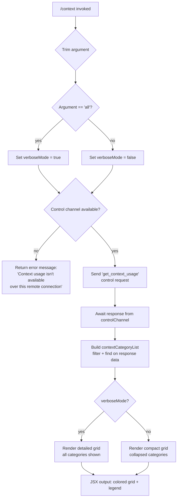

# `/context`

> Analysis basis: CC v2.1.185 bundle.js (AST extraction + Claude interpretation)
> Minimum version: v2.1.185

---

## Overview

The `/context` command visualizes the current conversation's context window usage as a colored grid, broken down by category (system prompt, tools, memory files, messages, etc.). When invoked with the optional `[all]` argument, it switches to a more detailed display. The command operates over a control-request channel to retrieve live token-usage data from the active session, then renders a JSX component inline in the terminal.

---

## Registration

| Field | Value |
|---|---|
| type | `local-jsx` |
| name | `context` |
| description | `Visualize current context usage as a colored grid` |
| argumentHint | `[all]` |
| thinClientDispatch | `control-request` |
| module_id | `wll` |
| load_inline | `true` |
| loc_byte | `11693243` |
| loc_byte_end | `11693469` |
| loc_line | `7089` |
| arbor_handler.name | `mVp` |
| arbor_handler.fqn | `claude-2.1.185::mVp` |
| arbor_handler.kind | `AsyncFunction` |
| arbor_handler.resolution_path | `module_id` |
| arbor_handler.n_hits | `0` |

Analysis basis: CC v2.1.185 bundle.js:+11693243

---

## Input Branching

Four distinct paths exist based on (a) presence of the `[all]` argument and (b) availability of the control channel.



Analysis basis: CC v2.1.185 bundle.js:+11691837 (handler entry), +11691868 (`all` literal), +11691921 (error string), +11692003 (`sendControlRequest`), +11692033 (`get_context_usage` literal)

---

## Behavioral Spec

### Handler Entry — `mVp` (AsyncFunction)

```
async function contextCommandHandler(input, options):
    rawArg = trim(input)
    isVerbose = (rawArg == "all")

    controlChannel = options.controlChannel
    if not controlChannel:
        return errorDisplay("Context usage isn't available over this remote connection")

    usageData = await controlChannel.sendControlRequest("get_context_usage")

    categoryList = buildCategoryList(usageData, isVerbose)
    legendData   = buildLegend(categoryList)

    return createElement(ContextGridComponent, {
        categories: categoryList,
        legend:     legendData,
        verbose:    isVerbose,
        threshold:  80          // percentage threshold for color change
    })
```

Analysis basis: CC v2.1.185 bundle.js:+11691837, +11691843, +11691876, +11691891, +11692003, +11692067, +11692379 (`80` threshold literal)

---

### Category List Builder — `buildCategoryDisplayList` (mapped from `E6t`)

```
function buildCategoryDisplayList(usageData, isVerbose):
    allCategories = [
        { key: "promptBorder",   label: "System prompt",       colorKey: "promptBorder" },
        { key: "system",         label: "System tools",        colorKey: "system" },
        { key: "mcpTools",       label: "MCP tools",           colorKey: "cyan_FOR_SUBAGENTS_ONLY" },
        { key: "memory",         label: "Memory files",        colorKey: "claude" },
        { key: "permission",     label: "Custom agents",       colorKey: "permission" },
        { key: "messages",       label: "Messages",            colorKey: "purple_FOR_SUBAGENTS_ONLY" },
    ]

    filtered = filter(allCategories, category =>
        isVerbose OR category.tokenCount > 0
    )

    found = find(usageData.sections, s => s.type == "system")

    return filtered.map(cat => ({
        ...cat,
        tokenCount:  usageData[cat.key] ?? 0,
        percentage:  computePercentage(usageData[cat.key], usageData.total),
    }))
```

Analysis basis: CC v2.1.185 bundle.js:+11689940, +11690258, +11689975 (`Free space` literal), +11689998 (`Autocompact buffer`), +11691176, +11692150 (`system`), +10891681 (`System prompt`), +10891762 (`System tools`), +10891827 (`MCP tools`), +10892145 (`Memory files`), +10892689 (`Messages`)

---

### Percentage Formatter — `formatPercentage` (mapped from `Gre`)

```
function formatPercentage(usedTokens, totalTokens):
    ratio = usedTokens / totalTokens
    rounded = Math.round(ratio * 100)
    return formatLocale(rounded, "en-US", "compact") + ".0"
```

Constants: locale `"en-US"` (bundle.js:+222444), notation `"compact"` (bundle.js:+222462), suffix `".0"` appended (bundle.js:+220432).

Compact boundary threshold: 20 (bundle.js:+220462) and `"< 20"` label (bundle.js:+220471). A second numeric threshold of 10 exists (bundle.js:+220504).

Analysis basis: CC v2.1.185 bundle.js:+220491, +220418

---

### Context Grid Renderer — `renderContextGrid` (mapped from `fVp` → `vH`)

```
function renderContextGrid(categories, threshold):
    // threshold is 80 (percentage) — cells above this are rendered in warning color
    cells = categories.map(cat => {
        color = cat.percentage >= threshold ? "warning" : cat.colorKey
        return renderCell(cat.label, cat.percentage, color)
    })
    return renderGrid(cells)
```

Analysis basis: CC v2.1.185 bundle.js:+11692346, +11691799, +11692379 (literal `80`)

---

### Control Request Dispatcher — `sessionControlRequest` (mapped from `Os`)

Invoked at the start of handler execution. Checks:

1. Whether the session context is a `"local-agent"` kind (literal at bundle.js:+3544784).
2. Whether the thin-client fullscreen/control channel is enabled — gated by feature-flag check (`tM` → `Ani.isEnabled`).
3. Terminal environment probes (iTerm detection, tmux control-mode, Windows SSH) that may suppress fullscreen but are orthogonal to context data availability.
4. Settings retrieval via `_Z` → `Ced`, which calls `spawnSync` on tmux (literal `"display-message"`, `"-p"`, `"#{client_control_mode}"` at bundle.js:+3544231–3544254) with a 2000 ms timeout (bundle.js:+3544305).

Analysis basis: CC v2.1.185 bundle.js:+3544777, +3544866, +3544883, +3544944, +3545002, +3545130

---

### Token Bucket Computation — `computeContextBreakdown` (mapped from `k6n`)

The central orchestration function collecting all context segments:

```
async function computeContextBreakdown(session, options):
    systemPromptTokens  = await countSystemPromptTokens(session)      // YC
    mcpToolTokens       = await countMcpToolTokens(session)           // XB
    builtinToolTokens   = countBuiltinToolTokens(session)             // Xk
    memoryFileTokens    = countMemoryTokens(session)                   // p9p, f9p
    messageTokens       = await countMessageTokens(session)           // m9p, g9p, h9p
    permissionTokens    = countPermissionTokens(session)               // S9p
    agentTokens         = countAgentTokens(session)                    // A9p

    total = sum(all buckets)
    freeSpace = modelContextWindow - total

    return {
        systemPrompt: systemPromptTokens,
        mcpTools:     mcpToolTokens,
        builtinTools: builtinToolTokens,
        memory:       memoryFileTokens,
        messages:     messageTokens,
        permissions:  permissionTokens,
        agents:       agentTokens,
        total:        total,
        free:         freeSpace,
    }
```

Math operations used: `Math.max`, `Math.min`, `Math.round`, `Math.floor` (bundle.js:+10892500, +10892511, +10893108, +10893270).

Analysis basis: CC v2.1.185 bundle.js:+10890530, +10890556, +10890586, +10890620, +10890636, +10890680, +10891382–+10891525

---

### System Prompt Token Counter — `countSystemPromptTokens` (mapped from `YC`)

```
async function countSystemPromptTokens(session):
    rawPrompt = session.getSystemPrompt()
    tokens = await countTokens(rawPrompt)         // Sc → BD
    if legacyGlobalConfig:
        mergeGlobalConfigTokens(tokens)           // literal "legacyGlobalConfig" at +3531442
    return tokens
```

Analysis basis: CC v2.1.185 bundle.js:+5077320, +3531181

---

### MCP Tool Token Counter — `countMcpToolTokens` (mapped from `XB`)

```
async function countMcpToolTokens(session):
    windowSetting = parseWindowEnv("CLAUDE_CODE_AUTO_COMPACT_WINDOW")   // literal at +5080245
    validated = validateWindow(windowSetting)       // yae: "valid" | "invalid" | "capped"
    capped = Math.min(windowMax, Math.max(windowMin, window))

    mcpTools = session.getMcpTools()
    tokens = await countToolTokens(mcpTools)

    source = determineSource(windowSetting)         // "env" | "settings" | "clientdata" | "auto"
    return { tokens, window: capped, source }
```

Literals: `"valid"` (bundle.js:+5077751), `"invalid"` (bundle.js:+5077826), `"capped"` (bundle.js:+5077956), `"CLAUDE_CODE_AUTO_COMPACT_WINDOW"` (bundle.js:+5080245), `"env"` (bundle.js:+5080437), `"settings"` (bundle.js:+5080507), `"clientdata"` (bundle.js:+5080592), `"auto"` (bundle.js:+5079492).

Analysis basis: CC v2.1.185 bundle.js:+5080163, +5080241, +5080363, +5080403

---

### Message Token Counter — `countAllMessageTokens` (mapped from `g9p`)

```
async function countAllMessageTokens(session):
    messages = session.getMessages()
    filtered = messages.filter(m => isCountableMessage(m))
    
    batches = chunk(filtered, batchSize)
    results = await Promise.all(batches.map(batch => countTokensBatch(batch)))  // Dke
    
    total = results.reduce(sum, 0)
    rounded = Math.round(total)
    
    // also produce per-message breakdown if verbose
    return { total: rounded, perMessage: results }
```

Analysis basis: CC v2.1.185 bundle.js:+10887581, +10887617, +10887632, +10887663, +10887883

---

### Context Usage Labels (from literals)

The following category labels are rendered in the grid:

| Category key | Display label | bundle.js location |
|---|---|---|
| `promptBorder` | `System prompt` | +10891681 |
| `system` | `System tools` | +10891762 |
| MCP tools | `MCP tools` | +10891827 |
| MCP tools (deferred) | `MCP tools (deferred)` | +10891903 |
| System tools (deferred) | `System tools (deferred)` | +10891989 |
| agents | `Custom agents` | +10892078 |
| permission | `permission` | +10892109 |
| memory | `Memory files` | +10892145 |
| claude | `claude` | +10892175 |
| skills | `Skills` | +10892207 |
| messages | `Messages` | +10892689 |

---

## State & Side Effects

| Item | Detail |
|---|---|
| Telemetry | `tengu_amber_creek` (bundle.js:+3545521), `tengu_pewter_brook` (+3545429), `tengu_marlin_porch` (+3916673), `tengu_native_cursor` (+3917023), `tengu_amber_redwood2` (+5079808), `tengu_silent_harbor` (+13694227), `tengu_slate_harrier` (+13703925), `tengu_orchid_mantis_v2` (+13688902), `tengu_orchid_mantis` (+13689751), `tengu_amber_redwood3` (+5077245) |
| Control request | Sends `"get_context_usage"` over `thinClientDispatch: "control-request"` channel |
| Hook registration | `qi` → `B2o.register` (bundle.js:+69538); hooks registered during session context assembly |
| appState changes | None — read-only display command |
| Sound | None |
| File I/O | Memory file directory stat/read via `csr`, `uU.stat`, `uU.rename`, `uU.unlink` during token counting |
| Terminal detection | Probes `$TERM`, iTerm, tmux control mode, Windows SSH to determine fullscreen availability |

---

## Common Mistakes

1. **Expecting live streaming data**: `/context` is a snapshot command; it reads token counts at invocation time and does not update as the conversation continues.
2. **Running over a remote thin-client connection without control channel**: The command will return `"Context usage isn't available over this remote connection"` rather than an error code; this is expected behavior (bundle.js:+11691921).
3. **Omitting `all` for full detail**: Without the `all` argument, categories with zero tokens are filtered out; pass `/context all` to see the complete breakdown including empty slots.
4. **Misinterpreting the 80% threshold color**: Cells rendered in warning color indicate the category alone exceeds 80% of the total context window, not 80% of that category's allocation (bundle.js:+11692379).
5. **Assuming token counts match API billing**: The counts are computed locally via `Buffer.byteLength` and internal token estimators; they are approximate and may differ slightly from server-side counts.

---

## Version History

| Version | Change |
|---|---|
| v2.1.185 | Initial analysis |

---

## Appendix — Identifier Mapping

> For bundle debugging only. Identifiers change across versions.

| Identifier | Role |
|---|---|
| `mVp` | Main async handler for `/context` command |
| `Os` | Session control-request dispatcher |
| `L2` | Feature/capability check helper (uses `zqc.has`) |
| `tM` | Feature flag check (`Ani.isEnabled`) |
| `PFr` | Terminal/fullscreen probe (platform check) |
| `st` | String coercion utility |
| `_Z` | Terminal environment detector (iTerm/tmux/Windows) |
| `Ced` | iTerm/tmux mode sub-detector |
| `Ied` | `startsWith` check for terminal env strings |
| `bKe` | tmux client-control-mode probe |
| `T` | Fullscreen renderer / display manager |
| `QHc` | Display-channel setup |
| `j2o` | Stdio channel helpers (`ohc`, `shc`) |
| `Pe` | JSON serializer |
| `Kc` | String normalization (replace, slice, lastIndexOf) |
| `g9o` | YHc map helper |
| `Hqe` | Output writer (`s9o.write`) |
| `n_c` | Session/log file manager |
| `YWe` | Debounced batch writer (clearTimeout/setTimeout/setImmediate) |
| `rpe` | Log entry formatter |
| `Pre` | Directory utility (`dn`) |
| `y9o` | Path join helper |
| `csr` | File rotation helper (stat/endsWith/rename/unlink) |
| `t_c` | Append-file writer (mkdir/appendFile) |
| `qi` | Hook/event registrar (`B2o.register`) |
| `RFr` | Boolean-gate for fullscreen mode |
| `Gr` | Settings loader |
| `_j` | Settings load orchestrator |
| `ha` | Memory usage sampler (`process.memoryUsage`) |
| `Ihr` | Settings-from-disk loader (policy, flag settings) |
| `B2` | Settings aggregator (policy/flag/project/user/local) |
| `ved` | Context-display builder |
| `ct` | Context-cache manager (pIe/u8 maps) |
| `Ct` | Cache entry recorder (`Date.now`, `Ebf`) |
| `dd` | Token-usage data accessor (`aPe`) |
| `YO` | Token-usage wrapper |
| `hat` | Event listener setup (`o.on`, `i.toString`) |
| `x8` | JSX render dispatcher (`SBr`, `PBr`, `NZ`) |
| `PBr` | React element creator |
| `NZ` | Thin-client display component |
| `aCe` | Thin-client display inner component |
| `bBr` | Fallback display component |
| `E6t` | Category list builder (filter/find on usage data) |
| `_l` | Locale number formatter (`au`) |
| `au` | Number format helper (`c_c`) |
| `zKe` | Category label mapper |
| `Gre` | Percentage computer (`Math.round`) |
| `Ee` | String coercion wrapper |
| `fVp` | Grid render entry point → `vH` |
| `vH` | Cell-color selector (`VGn`, `e.slice`) |
| `VGn` | Color lookup (`wb`) |
| `k6n` | Token-breakdown orchestrator |
| `ck` | Model/configuration resolver |
| `jK` | Model resolution sub-steps (`S_`, `VG`, `ts`, `ul`) |
| `ul` | Model name parser/normalizer |
| `sT` | Rendering style selector |
| `Ife` | Style component (`st`) |
| `Cfe` | Provider-style selector (`sa`) |
| `wr` | Provider key resolver |
| `vo` | Provider variant (hy, Y2, mi) |
| `sa` | Auth style selector |
| `Rj` | String replacer |
| `w_` | Jailbreak/override parser (`Jbe`) |
| `GU` | Model enforcement checker (`UBs`, `ul`) |
| `UBs` | Admin-policy model allowlist enforcer |
| `Bl` | Text replacer |
| `PR` | Provider string matcher |
| `pd` | Provider-key writer |
| `zoe` | cRu includes check |
| `Run` | Model resolution runner |
| `_s` | Model alias resolver |
| `yH` | Style lookup (`Ife`) |
| `bQ` | Alias-match helper |
| `NK` | Provider writer |
| `fL` | Override loader |
| `Tfe` | Feature version check |
| `NBs` | Batch alias lookup |
| `rNe` | Rendering fallback |
| `nRu` | toLowerCase normalizer |
| `jU` | Model capability checker |
| `YC` | System-prompt token counter |
| `Sc` | Token-count helper with legacy-config merge |
| `BD` | Token-count aggregator |
| `Fhr` | Token-count sub-routine |
| `xn` | Token-count with B2 settings |
| `XB` | MCP tool token counter |
| `Fo` | Tool spec normalizer |
| `K7e` | Object entries iterator |
| `e_` | String normalizer (toLowerCase/includes/replace) |
| `Af` | String replacer for tool specs |
| `Wy` | Sort/group helper |
| `nb` | Window-token parser (Tti/bPr/Iti) |
| `Tti` | parseInt/isNaN validator |
| `bPr` | Window-token boundary applier |
| `Iti` | Window-token object builder |
| `yae` | Auto-compact window parser (parseInt/isNaN) |
| `DCd` | Auto-compact settings decoder |
| `Cti` | Settings-decoded token counter |
| `vti` | Token counter variant |
| `yjr` | Compact-window token resolver |
| `_jr` | Float/int parser with rounding |
| `Xk` | Built-in tool token counter + system-prompt assembler |
| `Zxo` | Built-in context segment assembler |
| `Mt` | Context-store reader |
| `Qen` | Store getter (`Jen.getStore`) |
| `Ar` | Context resolver |
| `lGn` | Prompt block list builder |
| `XTe` | System-prompt injector |
| `TPr` | pewter_owl_tool injector |
| `ZL` | send_user_msg injector |
| `T_f` | Brief-mode system prompt builder |
| `b_f` | Brief-mode check (`Jxo.isBriefEnabled`) |
| `I_f` | Confirm-action prompt injector |
| `C_f` | xti/Qxo prompt injector |
| `JAn` | Prefix checker (`startsWith`) |
| `Oj` | Tool-list normalizer |
| `Jmi` | Schema validator (`Dxt`) |
| `r0o` | Prompt section builder |
| `ryf` | Prompt section relay |
| `aq` | Permission/Gr context merger |
| `$_f` | System-prompt section assembly (main) |
| `PV` | Prompt variable accessor |
| `ZC` | Context string builder |
| `F_f` | S7-based section builder |
| `S7` | BNi-based section stringifier |
| `zu` | Token-budget enforcer |
| `jW` | ect/V4e context block |
| `Aq` | flatMap/map context assembler |
| `e0t` | Memory-file token reader/counter |
| `wu` | Context-window utility |
| `oie` | mkdir helper |
| `A8` | File-type checker |
| `Qe` | ogt utility |
| `ke` | Utility (j, Ue) |
| `ghi` | Memory-load parallel resolver |
| `nZu` | tie helper |
| `Zxt` | Trim/split/slice path helper |
| `lb` | ct wrapper |
| `Fx` | wu/ct composite |
| `db` | rM.join / gm helper |
| `Dhi` | RUr.join / l.push/join |
| `khi` | CIe helper |
| `xhi` | CIe helper variant |
| `Ihi` | Memory-section builder (db, b_n, map) |
| `Thi` | gm/db/CIe composite |
| `VUr` | CIe token counter |
| `Y_f` | ZA/e0o/Aq context merger |
| `ZA` | Provider normalizer (wr/toLowerCase/Fo) |
| `e0o` | Fo-based context combiner |
| `z_f` | Environment context assembler (Promise.all) |
| `n0o` | OS info collector (xje.version/release/type) |
| `t0o` | Shell info builder |
| `D_f` | Deferred-tool section builder |
| `M_f` | Model-section builder |
| `J_f` | Mlo/rNl.join section |
| `Mlo` | Gr-based section |
| `x2n` | FX/B_e context pair |
| `FX` | ct/gae/ro/e tuple |
| `B_e` | CHf/Lt tuple |
| `Z_f` | Brief-mode gate |
| `nyf` | Lr/xn/bQe/Dh section |
| `bQe` | Gr/Ct section |
| `j_f` | st/ct/T section |
| `x_f` | Ct/trim/j/ct/t.trim section |
| `k_f` | ct/zQ section |
| `zWa` | Cached context-segment fetcher |
| `G_f` | Qxo wrapper |
| `P_f` | L_f/Aq section |
| `O_f` | ct/Aq section |
| `N_f` | r0o relay |
| `U_f` | e.has/ow/Aq/ZC section |
| `ow` | F9/Hl/st/ct option handler |
| `B_f` | Aq relay |
| `Nhi` | Ohi/VUr composite |
| `Ohi` | wu/lb/Fx/Dh composite |
| `QTe` | UR/Mu/wr token writer |
| `UR` | LPr/BUe token-result builder |
| `Mu` | Zln token metric |
| `oNl` | nGn/nb/Wy/rGn context-block |
| `rGn` | Math.max accumulator |
| `b6` | Main session/agent runner |
| `Wc` | Session worker |
| `iw` | st/zw/_a worker initializer |
| `aH` | Session agent helper |
| `Jtt` | Eae check |
| `Eae` | Qtt.has gating |
| `p9p` | Prompt/memory file token scanner |
| `d9p` | match/split/trim/slice text processor |
| `M6n` | Multi-segment context token builder |
| `X_f` | Promise.all/I_/n0o/Mt/iA/t0o/Aq chain |
| `Uhi` | Ohi/e0t/gm/oie/A8/Qe memory file processor |
| `Yxo` | indexOf/slice/startsWith/Error segment validator |
| `dpt` | Token batch dispatcher |
| `uBe` | sgo/ngo/js/e8/kel/_H token detail builder |
| `De` | Ho/st/ra/Bzc error reporter |
| `Iel` | sgo/ngo/kel/st/_re/CC/fL token counter |
| `f9p` | Zse/rRt/OI memory token counter |
| `Zse` | Boolean/hc/W0 memory gate |
| `hc` | Ul/dp context window helper |
| `rRt` | ct/e.filter residual filter |
| `m9p` | Message token scanner |
| `Dke` | Promise.all/e.map/R6n/dpt batch counter |
| `R6n` | Full message token processor |
| `u` | ke/Re/rF/SG session runner |
| `Re` | j/Ue utility |
| `rF` | T4/yz.push/gFe/MNr render frame |
| `SG` | Promise.race/all/Lme/Nme/Bn/process.exit exit handler |
| `H` | I4e context session manager |
| `I4e` | b4e/T/Og/Wge/Wn/n.map mailbox processor |
| `h` | a/r.setTimeout session timer |
| `g9p` | Message batch token counter with rounding |
| `Bm` | Math.round metric |
| `Tn` | Message-type resolver |
| `p` | WT/process.exit/u.abort exit controller |
| `H9p` | Tool-result token counter |
| `A9p` | z6r/Mt/Tel/Dke agent token counter |
| `z6r` | _T/pae/PV context filter |
| `pae` | e.filter/t.some/WPl permission filter |
| `Tel` | Tl-based token entry |
| `Tl` | Object.hasOwn/YAi.get/XAi.has/tQu/YAi.set token lookup |
| `S9p` | r.set/_9p/y9p/E9p/dpt/LL token-per-section computer |
| `_9p` | Pe/Bm sub-section |
| `y9p` | Bm/Pe/n.get token retriever |
| `E9p` | Pe/Bm sub-section variant |
| `LL` | Full context-block assembler (large, many sub-functions) |
| `MEf` | W4t/o.push/Array.isArray/r.push block builder |
| `nFl` | U$i helper |
| `UEf` | e8r/t8r/n8r/zCn/r8r/cnt section types |
| `GEf` | $6n/Array.isArray/t.has/n.add section gate |
| `F0o` | Array.isArray/n.some/t.has filter |
| `FEf` | Array.isArray/t.some filter |
| `$Ef` | Array.isArray/t.get/o.startsWith/n.add filter |
| `Xmt` | t.some checker |
| `R` | clearTimeout/setTimeout/d.write/Math.round/j/P.unref renderer |
| `rSf` | HO.randomUUID block ID generator |
| `Pn` | g/HO.randomUUID/h message ID generator |
| `vw` | View-state holder |
| `nlo` | No-op / slot |
| `C7n` | v7n/iFl/VEf context-update handler |
| `hP` | MMt/T/wr/Mu display helper |
| `c0o` | Array.isArray/t.some/t.map/ane section filter |
| `REf` | Array.isArray/n.some/ane/t.has/nk/n.map/T section builder |
| `jUl` | Array.isArray/n.flatMap/t.has flattener |
| `PEf` | e.some/Array.isArray section filter |
| `nSf` | Array.isArray/t.get/Di/a.slice/eSf.has section slicer |
| `pNl` | Sub-section relay |
| `WEf` | T/n.filter/r.some/oFl section builder |
| `oFl` | SUr/t/j/e.filter output formatter |
| `$6n` | Large system-context block assembler |
| `oSf` | t.push/G0o/t.join/n.trim output formatter |
| `jEf` | v7n/iFl/KEf block handler |
| `h4e` | Array.isArray/o.some/t.add/s.every/t.has section gater |
| `fSf` | e.at/n.at/X4t/j/Ur/n.slice section slicer |
| `A4e` | Array.isArray/YUl/i.some/n.add/e.filter/n.has section builder |
| `mSf` | Array.isArray/j/Ur/e.slice section slicer |
| `qEf` | t.at/e.slice/t.push/Pn/vw/sFl section builder |
| `tFl` | e.map/Array.isArray/n.some/o.push/s.push/s.findLastIndex/$0o/s.slice section builder |
| `sFl` | n.at/C7n/n.push push-down helper |
| `NEf` | Array.isArray/l.every/l.filter/c.join/o.slice/e.slice section trimmer |
| `h9p` | Ctt/Mt/Tel/Dke/vC/o.map/zu/e4t/_T/De/Ho per-round token counter |
| `Ctt` | pae/_T/PV context gater |
| `vC` | _s/Bl/Fo/lRu.has model-context checker |
| `e4t` | Bm/Cmo token estimator |
| `Ho` | Error/String error builder |
| `cee` | Math.min/ehe/YC/XB compact-window gater |
| `ehe` | YTe/yae compact helper |
| `YTe` | Fo/FWu/Math.min/Sti token-budget computer |
| `ne` | ee/te/E/v session-loop container |
| `ee` | Promise.all/U8/g.filter/Hot/y/p0n/De/Y.applyMcpUpdate/ne.has/t3e/Ee/q/B1o event loop |
| `U8` | TypeError/Number.isSafeInteger/o.addEventListener/A.next/AggregateError stream reader |
| `Hot` | parseInt hex parser |
| `y` | l1t/xht event handler |
| `p0n` | parseInt packet parser |
| `Y` | _.current/W.setTimeout/T/Q MCP update applier |
| `t3e` | Vwe session-state updater |
| `B1o` | Object.entries/n.filter/t.getClients/jLn/r/Bn/T/hot/n3e/uZn/Object.fromEntries MCP state builder |
| `te` | A context builder |
| `E` | _/Math.max/Math.min context bounds checker |
| `v` | context reader |
| `f5` | Lr/ct token counter entry |
| `TFi` | bFi/e.slice/NI/LL token-frame integrator |
| `bFi` | Eae/SFi feature gater |
| `NI` | O9p/$6n context normalizer |
| `O9p` | Tve/$6n context output builder |
| `vt` | xy/Nn/un.createComment/it._appendChild rendering root |
| `Nn` | Full session renderer (hft/yft/Eft/Wfl/Iw/P1i/a_e/Sft/Bh/Ke/ts/Ft.join/by/ae) |
| `hft` | fD.includes filter |
| `yft` | nSo session formatter |
| `Eft` | nSo error formatter |
| `Wfl` | xn/XZ/Object.keys context window |
| `Iw` | H5t/Vgo/Ibt/T/Object.keys/Tbt/Kgo/Ee/Gp/De/Ho/_5t renderer |
| `P1i` | EMt/btt.readdir/Ttt.join/s.isDirectory/r/btt.stat/ds/Oa directory scanner |
| `a_e` | Full environment probe (tSo/gs/qx/eSo/RT/qfl/cM/xn/Object.keys) |
| `Sft` | gs/qx/eSo/OM/XZ/Object.keys/Im/$I/fne/Ee/T/$k/gft/l.filter/m.find/OYp session formatter |
| `Bh` | f5p/AM/GHe/Y6r/A5 branch selector |
| `Ft` | dW/spe/Object.keys/hVt/Object.entries/Bt/Zye/Ae/T MCP config reader |
| `by` | L2d/Trt session-log reader |
| `ae` | nu/Hte/js/R.push/x.enqueue/Lt stream enqueuer |
| `un` | po/kt/On/bo/_n/en/el renderer |
| `kt` | a/fE/en.map/se.map/To.has/Oae/In.isReadOnly/_He/Juo/Object.keys session-context reader |
| `On` | M8e.realpath/Mt/vk/Error/l/Yg/W0/mr.includes/iEe/Ko.refreshConfig/Xx/MVt.join/Q.includes/Q.push/AM/GHe/A5/PF.emit/Promise.race/Promise.allSettled/mNo/Bn/LVt/I_e/Object.keys/a/is.has/Ft/ho/En/Ee directory-change handler |
| `bo` | T/j/Ue/vme/Qe/x1/B$i/vre/dt/Xt/$$i/IRt/Cr session view |
| `_n` | Y.push/Be background push |
| `en` | xt/De event dispatcher |
| `el` | it.replace/Gi/ne._appendChild/ne.createComment/We/ff element patcher |
| `it` | Dm HTML renderer |
| `Dm` | rxp.test/it.replace/bt/vt/po/D.pop/f4a/m4a/Xe/h4a/sxp/A4a/yuo/Zt/D.popElement/k HTML parser |
| `Ae` | Full session manager (Object.keys/se.map/Array.from/en.has/_n.has/se.some/xr.cleanup/wra/e.sendMcpMessage/ms/l/In.some/z9/$Bi/FCn/v7/Z_l/plc) |
| `se` | Full main-loop session controller |
| `Rqn` | Ar/n.some/Ah/Ja/kTo request queue |
| `zv` | d0t/SHi/ged/LFr/T/p0t/EL/aE terminal-output writer |
| `V` | K.preventDefault/$ key handler |
| `Ah` | Auth handler |
| `Oge` | Promise.resolve/rlt/n.listAllLiveSessions session lister |
| `W` | u/R.add/H.has/h.get/vMt/ZIn/h.set/T/j/s3f.isLoopDefaultSentinel/o/t/Xnc/Math.floor/B.push/Dre/h.delete/H.add/fae/H.delete scheduler |
| `ece` | tFn/Promise.resolve/rlt/A/h.flatMap/Ah/f.has/Xka/llt/chp/Pt/Ate/Uge/nFn/Gy/JUn/Foo/U$t/Yka/$oo/Ooo/performance.now/nW/mh/Lt/tu/Ent/m4e/o.push/ilt/ke/Re/De session-resume handler |
| `xe` | x8t/Math.max/Promise.resolve/we.slice/Nne/Rue/ene tombstone handler |
| `qe` | we.findLastIndex/we.splice/j/Ue/M8t history trimmer |
| `nu` | HO.randomUUID ID generator |
| `Yb` | L2o/w2o boot helpers |
| `Gy` | State helper |
| `Iqt` | Z3.join/tr/UE/Ar/Lt/Z3.basename/fJn.rename/T transcript saver |
| `fX` | Au session loader |
| `U2n` | dlo/Fgt session store accessor |
| `V6e` | Au loader variant |
| `sye` | RV/KMe/T/S_/_s/oE/ul/jy session startup configurer |
| `mDn` | TJr model-downgrade notifier |
| `p8e` | o/cPo/IWl/r/j/Ue/os/dme/Af session config applier |
| `f8e` | $Mf/jy/AJn/j/Ue/BMf/Af/OWe/VG fork handler |
| `Oe` | Nae/Ye/Grt/Promise.race/ot.then/Xe.then session timeout |
| `YK` | _Ct/Date.now timestamp helper |
| `Wue` | Au session loader variant |
| `xqt` | iA/M6/Mt/process.chdir/wH/DD/Xx/ake/fK/bE/m7n session initializer |
| `jue` | Au/Gm/Rl.utimes/e.reAppendSessionMetadata session metadata writer |
| `w` | kz/Date.now/Math.min/L/v/Dec activity tracker |
| `xr` | In.includes/p.includes/p.push/p.filter permission tracker |
| `In` | p initializer |
| `wra` | Promise.allSettled/Object.entries/c.connect/c.getServerCapabilities/c.getInstructions/ND/on/c.close/vP/m.push/ke/Re/Cu/n.push/r.push/n.some/r.some/Pc MCP connector |
| `ND` | e.slice/n.charCodeAt/n.slice UTF-16 surrogate handler |
| `on` | hKe.push/QJ.logMCPDebug debug logger |
| `Cu` | hKe.push/QJ.logMCPError error logger |
| `z9` | oc URL normalizer |
| `oc` | e.replace/e.startsWith/t.replace URL rewriter |
| `$Bi` | e.find/X8r/j/ct/kLd/T experiment gate checker |
| `kLd` | ct experiment resolver |
| `FCn` | v7 feature-flag relay |
| `Z_l` | oTo/JSON.stringify/the/wr/JB/Dk tool-use serializer |
| `oTo` | wr/WK/ul/bQ/the tool-call normalizer |
| `the` | ct/WCd tool executor |
| `JB` | the/qCd/Jtr tool-result builder |
| `Dk` | wr/vo/eTe/E4 tool-error handler |
| `plc` | e.find/X8r/$4f.has/di/j/yG/dNo permission checker |
| `di` | oAi/yJu.has/pB/EJu.has/ra/Eme/Cz/r.includes permission gate |
| `yG` | String coercer |
| `dNo` | di/Sme/j/yG/Ru/Eme permission display |
| `ge` | Sq/Lt/Boolean/ee.has session-list filter |
| `Sq` | Lt/Au session locator |
| `Au` | qi registrar |
| `Lt` | gx logger |
| `Te` | mh/Lt/ge session-entry builder |
| `mh` | Lt/Au session metadata holder |
| `Ye` | ZY/fE/sje/NO/Ke.find/Ite/nt.filter/Pc/Xzt/Ftt session-entry processor |
| `ZY` | XP/Gce/o.concat/o.sort/fE tool-list builder |
| `XP` | ow/d.push/wfo/RC/Gce/Lfo/Eu/u.push/R6/n.has/o.some/Pc/vl.isEnabled/o.filter/Btt.has/o.map/c.isEnabled/ZC/l.includes tool picker |
| `Gce` | e.filter/U9t tool filter |
| `sje` | dOe/fE/o.sort/r.sort/eCo.isCoordinatorMode/yCl session-entry sorter |
| `yCl` | s.trim/e.some/ML/gCl/ke/e.filter/vGr.has/_Cl/uFn/saf.has/r.has coordinator filter |
| `NO` | gx no-op |
| `Ite` | uio/dio/u.filter/f/cio/g.set/t.map/ow/d.has/g.get/SA/M.split/B.trim/g.has/y.push/kx/i1e/L.has/v.push/L.add/Btt.has/p.has/m/H.has/I.push/E.push/ZC/v.some/Pc/k.push/E.splice tool-invocation tracker |
| `uio` | e.filter/ML/Pc/Dve.has/CGr.has/BMt.has/El/PNi.has tool filter |
| `dio` | SA/t.add/n.add/kx/r.add/r.has/i1e/t.has/s tool-use recorder |
| `cio` | e.includes/SA/t.push/o.split/s.trim content splitter |
| `SA` | lQc/nk/cQc/e.substring/aQc string segmenter |
| `kx` | e.split/o.join key formatter |
| `i1e` | Y9 key helper |
| `nt` | Y.push/Be message push handler |
| `Be` | T/ot.abort message aborter |
| `Ftt` | INi.get/TTd/INi.set schema validator |
| `TTd` | t.validateSchema/t.errorsText/t.compile/r/String schema compiler |