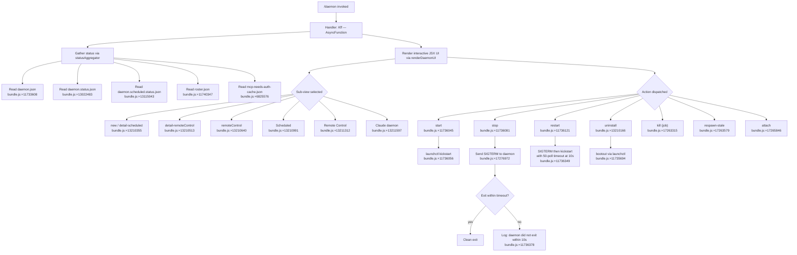

# `/daemon`

> Analysis basis: CC v2.1.185 bundle.js (AST extraction + Claude interpretation)
> Minimum version: v2.1.185

---

## Overview

The `/daemon` command provides a management interface for Claude Code's background service infrastructure. It allows users to inspect, start, stop, restart, and uninstall the long-running daemon process that underpins background sessions, scheduled tasks, and remote control functionality. The command renders an interactive JSX-based UI that aggregates status from multiple daemon-related JSON state files and dispatches lifecycle actions to the running background service.

---

## Registration

| Field | Value |
|---|---|
| type | `local-jsx` |
| name | `daemon` |
| description | `Manage background services and routines` |
| loc_byte | `13220384` |
| loc_byte_end | `13220552` |
| loc_line | `8691` |
| immediate | `true` |
| module_id | `vwo` |
| load_inline | `true` |
| arbor_handler.name | `Kff` |
| arbor_handler.fqn | `claude-2.1.185::Kff` |
| arbor_handler.kind | `AsyncFunction` |
| arbor_handler.resolution_path | `module_id` |
| arbor_handler.n_hits | `0` |

Analysis basis: CC v2.1.185 bundle.js:+13220384

---

## Input Branching

The command branches across many distinct lifecycle sub-commands and UI states. A Mermaid flowchart is used.



---

## Behavioral Spec

### Handler Entry — `Kff` (AsyncFunction)

The Arbor-resolved handler `Kff` is the top-level async function for `/daemon`.

Analysis basis: CC v2.1.185 bundle.js:+13209585

```
async function daemonCommandHandler(context):
    statusData = await gatherDaemonStatus()   // Iwo
    uiComponent = buildDaemonUI(statusData)    // sMl / tnt
    render(uiComponent)
    await awaitUnmount()
```

---

### Status Aggregation — `gatherDaemonStatus` (Iwo)

Collects daemon state from multiple sources in parallel.

Analysis basis: CC v2.1.185 bundle.js:+13209144

```
async function gatherDaemonStatus():
    results = await Promise.all([
        readDaemonConfigFile(),           // ZDl -> Cvo
        readDaemonPidFile(),              // M0l -> Mjt -> daemon.status.json
        readScheduledStatusFile(),        // iDl -> sDl -> daemon.scheduled.status.json
        readRosterFile(),                 // Iq  -> Ene -> roster.json
        queryLaunchctlStatus(),           // yX  -> Un -> launchctl print
    ])
    return mergeStatusResults(results)
```

---

### Daemon Config File Reader — `readDaemonConfigFile` (ZDl → Cvo)

Reads and validates `daemon.json`.

- File size limit: 1,048,576 bytes (Analysis basis: CC v2.1.185 bundle.js:+13023303)
- Encoding: `utf8` (Analysis basis: CC v2.1.185 bundle.js:+13023422)
- Parses JSON; validates it is an array via `Array.isArray` (Analysis basis: CC v2.1.185 bundle.js:+13023605)

```
async function readDaemonConfigFile(basePath):
    filePath = joinPath(basePath, "daemon.json")
    stat = await fs.stat(filePath)
    if not stat.isFile():
        throw Error
    if stat.size > 1048576:
        throw Error("file too large")
    raw = await fs.readFile(filePath, "utf8")
    trimmed = raw.trim()
    parsed = JSON.parse(trimmed)
    if not Array.isArray(parsed):
        throw Error("unexpected format")
    return parsed
```

Analysis basis: CC v2.1.185 bundle.js:+13023245

---

### Scheduled Task Status Reader — `readScheduledStatusFile` (iDl → sDl)

Reads `daemon.scheduled.status.json` from the daemon's runtime directory and, if it contains a PID, sends `process.kill` to check liveness.

- Status file name: `"daemon.scheduled.status.json"` (Analysis basis: CC v2.1.185 bundle.js:+13115043)

```
async function readScheduledStatusFile(runtimeDir):
    filePath = joinPaths(runtimeDir, "daemon.scheduled.status.json")
    raw = await fs.readFile(filePath, encoding)
    parsed = decodeStatusPayload(raw)
    if parsed.pid:
        try:
            process.kill(parsed.pid, 0)   // liveness probe
            parsed.alive = true
        catch:
            parsed.alive = false
    return parsed
```

Analysis basis: CC v2.1.185 bundle.js:+13115250

---

### Roster File Reader — `readRosterFile` (Iq → Ene → ZHe)

Reads `roster.json`, which records live background session entries. Handles stale entries and corrupt files.

- File name: `"roster.json"` (Analysis basis: CC v2.1.185 bundle.js:+11740347)
- Invalid file type triggers removal with message `"is not a regular file — removing"` (Analysis basis: CC v2.1.185 bundle.js:+11744523)
- Error codes `"E2BIG"` and `"EFTYPE"` are treated as corrupt-file signals (Analysis basis: CC v2.1.185 bundle.js:+11744649)
- On corruption, the roster is rotated via `rotateRosterFile` (`d8n`) using `Date.now()` as a timestamp suffix (Analysis basis: CC v2.1.185 bundle.js:+11745628)

```
async function readRosterFile(runtimeDir):
    rosterPath = joinPaths(runtimeDir, "roster.json")
    stat = await fs.lstat(rosterPath)
    if not stat.isFile():
        log("is not a regular file — removing")
        await fs.rm(rosterPath)
        return emptyRoster()
    raw = await fs.readFile(rosterPath)
    decoded = decodeUtf8(raw)
    try:
        parsed = jsonParse(decoded)
        validateRosterSchema(parsed)   // Dcl: Array.isArray + Object.keys
        return parsed
    catch err if err.code in ["E2BIG", "EFTYPE"]:
        rotateRosterFile(rosterPath)   // d8n: rename with Date.now suffix
        return emptyRoster()
    catch:
        logTelemetry("tengu_bg_roster_parse_failed")
        return emptyRoster()
```

Analysis basis: CC v2.1.185 bundle.js:+11744376

---

### launchctl Status Query — `queryLaunchctlStatus` (yX → Un → qr)

Invokes `launchctl print` to check the macOS service status. Only runs on `darwin` (Analysis basis: CC v2.1.185 bundle.js:+11736704).

- Binary: `"launchctl"`, sub-command: `"print"` (Analysis basis: CC v2.1.185 bundle.js:+11737196, +11737209)
- Timeout: 5000 ms (Analysis basis: CC v2.1.185 bundle.js:+11737243)
- UID retrieved via `process.getuid()` (Analysis basis: CC v2.1.185 bundle.js:+11733992)

```
async function queryLaunchctlStatus():
    if platform != "darwin":
        return null
    uid = process.getuid()
    result = await spawnWithTimeout(
        "launchctl", ["print", "gui/" + uid + "/com.anthropic.claude-code"],
        timeout=5000
    )
    return parseServiceState(result)
```

Analysis basis: CC v2.1.185 bundle.js:+11737193

---

### Daemon PID / Status File Reader — `readDaemonPidFile` (M0l → Mjt)

Reads `daemon.status.json` and probes the PID for liveness, then optionally issues `process.kill` and falls back to `Fv`.

- Status file: `"daemon.status.json"` (Analysis basis: CC v2.1.185 bundle.js:+13022483)

```
async function readDaemonStatusFile(runtimeDir):
    filePath = joinPaths(runtimeDir, "daemon.status.json")
    storeCtx = asyncStore.getStore()    // ci
    raw = await readFileUtf8(filePath)  // Fa
    parsed = decodePayload(raw)
    if parsed.pid:
        try:
            process.kill(parsed.pid, 0)
            parsed.alive = true
        catch:
            parsed.alive = false
            handleDeadPid(parsed.pid)   // Fv
    return parsed
```

Analysis basis: CC v2.1.185 bundle.js:+13022769

---

### Stale PID File Cleanup — `cleanupStalePidFile` (w6t)

Removes a PID file that refers to a dead process.

- Max file size before treating as invalid: 65,536 bytes (Analysis basis: CC v2.1.185 bundle.js:+11732108)
- Reads process title to confirm it matches `"claude daemon"` (Analysis basis: CC v2.1.185 bundle.js:+11733033)
- Confirms match within first 4 bytes of title (Analysis basis: CC v2.1.185 bundle.js:+11733060)
- Expected process name: `"daemon"` (Analysis basis: CC v2.1.185 bundle.js:+11733072)

```
async function cleanupStalePidFile(pidFilePath):
    stat = await fs.lstat(pidFilePath)
    if not stat.isFile() or stat.size > 65536:
        await fs.rm(pidFilePath)
        return
    raw = await fs.readFile(pidFilePath)
    decoded = decodeUtf8(raw)
    title = readProcessTitle(decoded)   // xyo: split + slice
    if not title.startsWith("daemon"):
        await fs.rm(pidFilePath)
    // else leave in place
```

Analysis basis: CC v2.1.185 bundle.js:+11732069

---

### Process Title Reader — `readProcessTitle` (xyo)

Reads a proc/status file and extracts the process title from its content by splitting on newlines and slicing.

Analysis basis: CC v2.1.185 bundle.js:+11732941

---

### Lifecycle Actions — start / stop / restart / uninstall

These actions are available from the rendered UI and dispatched through the underlying daemon protocol.

#### start (`kickstart`)
Uses `launchctl kickstart` on macOS. (Analysis basis: CC v2.1.185 bundle.js:+11736056)

#### stop
Sends SIGTERM to the daemon PID. The string `"SIGTERM"` is used as the signal name. (Analysis basis: CC v2.1.185 bundle.js:+17276972)

#### restart
Sends SIGTERM, polls up to 50 times (Analysis basis: CC v2.1.185 bundle.js:+11736349) and aborts if daemon hasn't exited within 10 seconds, logging: `"daemon did not exit within 10s of SIGTERM; restart aborted before kickstart"` (Analysis basis: CC v2.1.185 bundle.js:+11736378). If clean exit is observed, calls `kickstart`.

#### uninstall
Calls `launchctl bootout` (Analysis basis: CC v2.1.185 bundle.js:+11735694). Not available on darwin for the service variant — logs `"service uninstall not available on darwin"` (Analysis basis: CC v2.1.185 bundle.js:+11735825).

---

### Background Session Management — Background Supervisor Loop (L)

The daemon runs a continuous supervisor sweep.

Analysis basis: CC v2.1.185 bundle.js:+17279100

Key behaviors observed in the sweep:
- Calls `shiftGraceClocksForward` on worker pool (Analysis basis: CC v2.1.185 bundle.js:+17279159)
- Low-memory condition triggers retiring pinned-but-settled workers as last resort, with log message: `"bg: low memory persists after shedding non-pinned — retiring pinned settled workers as a last resort"` (Analysis basis: CC v2.1.185 bundle.js:+17279603)
- Prewarming budget tracked per sweep via telemetry `tengu_bg_prewarm_per_sweep` (Analysis basis: CC v2.1.185 bundle.js:+17279835)
- Calls `respawnIfIdleStale`, `retireIfSettled` on individual workers (Analysis basis: CC v2.1.185 bundle.js:+17279330, +17279421)
- Grace period calculation uses a factor of 12 (Analysis basis: CC v2.1.185 bundle.js:+17279869)

```
async function supervisorSweep(workerPool, state):
    now = Date.now()
    workerPool.shiftGraceClocksForward()
    for worker in workerPool.values():
        if state.lowMemory and worker.isPinned and worker.isSettled:
            logTelemetry("tengu_bg_retire_pinned_low_mem")
            worker.retireIfSettled()
        else:
            worker.respawnIfIdleStale()
    preWarmCount = calculatePrewarm(workerPool, now)
    logTelemetry("tengu_bg_prewarm_per_sweep", preWarmCount)
    await Promise.all(retireSettled(workerPool))
```

---

### MCP Integration — `mcpConnectionManager` (n3e)

The daemon also manages MCP (Model Context Protocol) server connections.

Analysis basis: CC v2.1.185 bundle.js:+6835321

- Iterates server entries via `Object.entries` (Analysis basis: CC v2.1.185 bundle.js:+6835321)
- Server types recognized: `"stdio"`, `"sse"`, `"sse-ide"`, `"ws-ide"`, `"claudeai-proxy"` (Analysis basis: CC v2.1.185 bundle.js:+6835521, +6835620, +6835656, +6835928)
- Servers with status `"disabled"` are skipped (Analysis basis: CC v2.1.185 bundle.js:+6835419)
- Failed servers are cached for approximately 15 minutes before retry (string: `"Skipping connection (recent failure cached; retries automatically in 15 min, or edit the plugin config to retry now)"`) (Analysis basis: CC v2.1.185 bundle.js:+6836367)
- Auth-required servers are skipped with `"Skipping connection (cached needs-auth)"` (Analysis basis: CC v2.1.185 bundle.js:+6836114)
- OAuth flow: tool named `"authenticate"` is injected; timeout 10,000 ms (Analysis basis: CC v2.1.185 bundle.js:+6619926, +6620152)
- OAuth callback URL instruction provided for remote sessions (Analysis basis: CC v2.1.185 bundle.js:+6622837)
- On complete auth: status becomes `"connected"` (Analysis basis: CC v2.1.185 bundle.js:+6836551)

---

### Daemon Protocol Messages (T6f — background service protocol handler)

The daemon protocol supports the following message types observed in literals:

| Message type | Purpose | loc_byte |
|---|---|---|
| `ping` | Heartbeat | +17259465 |
| `nudge` | Wake idle worker | +17259890 |
| `yield` | Worker yields CPU | +17260329 |
| `lease` / `leases` | Resource lease management | +17260389 / +17260467 |
| `shutdown` | Graceful shutdown request | +17260528 |
| `dispatch` | Dispatch job to worker | +17262247 |
| `reply` | Worker reply to dispatched job | +17263082 |
| `exec` | Execute a command in worker | +17263250 |
| `kill` | Kill a worker job | +17263315 |
| `respawn-stale` | Force respawn of stale worker | +17263579 |
| `resize` | Terminal resize | +17263811 |
| `attach` | Attach client to worker | +17265846 |
| `permission-response` | Grant/deny tool permission | +17270079 |
| `snapshot` | Request terminal snapshot | +17270263 |
| `subscribe` | Subscribe to worker events | +17270107 |
| `stream` | Stream data | +17270450 |
| `state` | Query worker state | +17270506 |
| `ensure-spare` | Ensure spare worker pre-warmed | +17269874 |
| `list` | List workers | +17261685 |
| `has` | Check worker existence | +17261844 |

Error codes used in protocol:

| Code | Meaning | loc_byte |
|---|---|---|
| `ETOOLARGE` | Payload exceeds size limit | +17257506 |
| `ESTARTING` | Worker not yet ready | +17260696 |
| `EPROTO` | Protocol error | +17260997 |
| `ESTALE` | Request references stale state | +17259134 |
| `ETIMEOUT` | Operation timed out | +17259225 |
| `EAUTH` | Missing or invalid control key | +17262133 |
| `ENOJOB` | Job not found / already exited | +17262906 |
| `ENOREPLY` | Job not in interactive state | +17263047 |
| `EUNVERIFIED` | Worker identity unverifiable | +17264624 |
| `ERESPAWNING` | Worker currently respawning | +17264718 |
| `EUNKNOWN` | Unknown error | +17259347 |

Analysis basis: CC v2.1.185 bundle.js:+17259294

---

### Daemon Control Key Authentication

Dispatch and reply messages require a daemon control key presented by the client.

- Dispatch without key: `"dispatch rejected: this client didn't present the daemon control key"` (Analysis basis: CC v2.1.185 bundle.js:+17262057)
- Mismatched key on dispatch: `"reply rejected: the presented daemon control key doesn't match — retry, and restart the Claude Code daemon if this persists"` (Analysis basis: CC v2.1.185 bundle.js:+17262608)
- Attach with mismatched key: `"attach rejected: the presented daemon control key doesn't match — retry, and restart the Claude Code daemon if this persists"` (Analysis basis: CC v2.1.185 bundle.js:+17264136)
- Legacy clients (no control key) are allowed via peer UID check: `"[bg-attach] legacy client (no control key) — allowed via peerUid"` (Analysis basis: CC v2.1.185 bundle.js:+17264000)
- Key comparison uses timing-safe equality (`nZa.timingSafeEqual`) (Analysis basis: CC v2.1.185 bundle.js:+10753374)

---

### Daemon Stop via UI — `daemonStopHandler` (u → Re)

When the user selects stop from the UI:

- Emits telemetry `tengu_daemon_control` (Analysis basis: CC v2.1.185 bundle.js:+17311865)
- Logs event as `"daemon_stop"` (Analysis basis: CC v2.1.185 bundle.js:+17311790)
- On failure: `"daemon_stop_failed"` (Analysis basis: CC v2.1.185 bundle.js:+17311827)
- Background session label: `"background session"` (Analysis basis: CC v2.1.185 bundle.js:+17311742)

---

### Worker Lifecycle States

Observed state strings for background workers:

| State | loc_byte |
|---|---|
| `starting` | +17266730 |
| `resuming` | +17266747 |
| `adopted` | +17266764 |
| `crashed` | +17266780 |
| `running` | +17256424 |
| `in-progress` | +17265883 |
| `done` | +17268932 |
| `killed` | +17268965 |
| `closed` | +17258604 |
| `settled` | +17270353 |
| `dropped` | +17258509 |

---

### Attach Stall Detection

When attaching to a worker that stalls during startup:

- Message: `"Session is starting — it will appear once ready. Ctrl+Z to detach"` (Analysis basis: CC v2.1.185 bundle.js:+17266790)
- After prolonged stall: `"Waiting for session to redraw… Ctrl+Z to detach"` (Analysis basis: CC v2.1.185 bundle.js:+17266863)
- Gave-up message: `"Session keeps stalling at startup."` (Analysis basis: CC v2.1.185 bundle.js:+17267215)
- On stall timeout: sends SIGKILL (Analysis basis: CC v2.1.185 bundle.js:+17267374) and logs `"session keeps stalling at startup"` (Analysis basis: CC v2.1.185 bundle.js:+17267393)
- Stall-respawn message: `"Session not responding — restarting it…"` (Analysis basis: CC v2.1.185 bundle.js:+17267485)
- Telemetry: `tengu_bg_attach_stall_ms`, `tengu_bg_attach_stall_gave_up`, `tengu_bg_attach_stall_respawn` (Analysis basis: CC v2.1.185 bundle.js:+17256113, +17267169, +17267439)

---

### Config Reload

Daemon config reloads are triggered when the config file's mtime changes (Analysis basis: CC v2.1.185 bundle.js:+17295700), logged as telemetry `tengu_daemon_config_reload` (Analysis basis: CC v2.1.185 bundle.js:+17290895).

---

### Config Auth Loss Prevention

When re-reading global config during save, if re-read config is missing auth that the cache has, the write is refused with: `"saveGlobalConfig fallback: re-read config is missing auth that cache has; refusing to write. See GH #3117."` (Analysis basis: CC v2.1.185 bundle.js:+13963526). Emits telemetry `tengu_config_auth_loss_prevented` (Analysis basis: CC v2.1.185 bundle.js:+13963654).

---

## State & Side Effects

| Item | Detail |
|---|---|
| Telemetry | `tengu_bg_roster_parse_failed` (+11744569), `tengu_mcp_skills` (+6624964), `tengu_config_auth_loss_prevented` (+13963654), `tengu_bg_retire_pinned_low_mem` (+17279714), `tengu_bg_prewarm_per_sweep` (+17279835), `tengu_feature_ok` (+1021887), `tengu_feature_bad` (+1021954), `tengu_daemon_control` (+17311865), `tengu_amber_anchor` (+3342080), `tengu_bg_proto_mismatch` (+17260791), `tengu_bg_dispatch_stale_drop` (+17262190), `tengu_daemon_config_reload` (+17290895), `tengu_bg_state_read_transient` (+4286662), `tengu_bg_attach_legacy_autorespawn` (+17265080), `tengu_bg_attach_upgrade` (+13292391), `tengu_bg_attach` (+17266239), `tengu_bg_attach_stall_ms` (+17256113), `tengu_bg_attach_stall_gave_up` (+17267169), `tengu_bg_attach_stall_respawn` (+17267439), `tengu_bg_attach_kick` (+17268436), `tengu_daemon_idle_exit` (+17296330) |
| State files read | `daemon.json`, `daemon.status.json`, `daemon.scheduled.status.json`, `roster.json`, `mcp-needs-auth-cache.json` |
| State files written | `daemon.status.json` (PID updates), roster rotation files (timestamped), `mcp-needs-auth-cache.json` |
| Process signals sent | `SIGTERM` (stop/restart), `SIGKILL` (stall kill) |
| External process invoked | `launchctl` (macOS only): `print`, `kickstart`, `bootout` sub-commands |
| MCP connections managed | Starts, stops, and monitors stdio/sse/ws/proxy MCP server connections |
| UI render | JSX component rendered via `i.render`; unmounted via `i.unmount` on exit |
| Hook registration | Async store context via `L0u.getStore` / `ci`; React context (`QIi.useContext`, `L8.useContext`) |
| appState changes | Background session worker lifecycle states tracked; MCP slot state updated via `applyMcpUpdate` |
| Timing | Idle-exit timer managed; supervisor sweep interval set/cleared |
| Sound | None observed |

---

## Version History

| Version | Change |
|---|---|
| v2.1.185 | Initial analysis |

---

## Common Mistakes

1. **Assuming `/daemon` is only for start/stop.** The command is a full management UI covering status inspection, scheduled task monitoring, remote-control views, MCP connection health, and per-worker lifecycle actions.
2. **Running lifecycle commands on non-macOS.** `launchctl`-based actions (`start`, `restart`, `uninstall` via `kickstart`/`bootout`) only work on `darwin`. Other platforms require platform-specific launchers.
3. **Ignoring the daemon control key.** All dispatch, reply, and attach operations require a matching daemon control key. If the key has rotated, restart both the daemon and the client.
4. **Manually deleting `roster.json`.** The daemon auto-detects and rotates corrupt roster files. Manual deletion may race with a live write; prefer `/daemon stop` first.
5. **Expecting instant restart.** The restart path polls up to 50 times and hard-aborts if the daemon hasn't exited within 10 seconds, leaving the daemon in an unknown state — check status after a failed restart.
6. **Confusing MCP failure caching.** A failed MCP connection is suppressed for ~15 minutes. Editing the plugin config is the intended way to force an immediate retry.

---

## Appendix — Identifier Mapping

> For bundle debugging only. Identifiers change across versions.

| Identifier | Role |
|---|---|
| `Kff` | Top-level daemon command async handler (arbor_handler) |
| `tmf` | Daemon UI render orchestrator |
| `Iwo` | Status aggregation coordinator |
| `hDe` | Status helper initializer |
| `ZDl` | Daemon config/PID file dispatcher |
| `Dmt` | Daemon config reader wrapper |
| `Cvo` | daemon.json file reader (stat + readFile + JSON.parse) |
| `two` | Config array validation helper |
| `Zvo` | Config merge helper |
| `De` | Error logging / queue manager |
| `Ho` | Error string formatter |
| `st` | String coercer |
| `ra` | Essential-traffic queue dispatcher |
| `Bzc` | Rotating buffer manager (shift/push) |
| `_0` | PID file lifecycle manager (lstat, kill, cleanup) |
| `w6t` | Stale PID file cleanup (lstat + rm + readFile) |
| `xyo` | Process title extractor (readFile + split + slice) |
| `Fv` | Post-dead-PID fallback handler |
| `VDl` | Same-dir status file multi-reader |
| `Aje` | Status file stat + read + validate |
| `dn` | Decoder utility |
| `ci` | Async context store accessor |
| `Swo` | Status file helper |
| `Ee` | String builder |
| `J6` | Path join utility wrapper |
| `M0l` | daemon.status.json reader + PID liveness probe |
| `Mjt` | Path constructor for daemon.status.json |
| `iDl` | daemon.scheduled.status.json reader |
| `sDl` | Path constructor for daemon.scheduled.status.json |
| `Iq` | roster.json reader + corruption handler |
| `Ene` | Path helper for roster.json |
| `ZHe` | Roster directory path builder |
| `Qe` | Async primitive wrapper |
| `ogt` | Core async/event primitive |
| `d8n` | Roster file rotator (rename with timestamp) |
| `O6t` | Timestamp generator (Date.now wrapper) |
| `Gt` | JSON.parse wrapper |
| `Mn` | UTF-8 decoder |
| `wp` | Decode helper |
| `IJ` | Schema field extractor |
| `Dcl` | Roster schema validator (Array.isArray + Object.keys) |
| `J7t` | Field extraction + assertion helper |
| `ey` | Assertion primitive |
| `os` | Async sentinel helper |
| `yX` | launchctl status dispatcher |
| `Un` | launchctl spawn + parse |
| `qr` | launchctl process spawner |
| `Mt` | launchctl output parser |
| `o8n` | UID-based path builder |
| `ycl` | UID getter (process.getuid) |
| `sMl` | UI component factory |
| `tnt` | Daemon UI root component |
| `mRt` | Model/token router component |
| `ivd` | Model selection logic |
| `T` | Telemetry-gated logger / model key normalizer |
| `lvd` | Model display list builder |
| `RFi` | Model provider config builder |
| `Fo` | Application inference profile handler |
| `Pg` | Model preference store accessor |
| `_s` | Model alias resolver (sonnet/haiku/opus/fable/best) |
| `a` | MCP + session orchestration root |
| `n3e` | MCP connection manager |
| `dW` | MCP server connector |
| `Ort` | MCP server option builder |
| `W7` | MCP server connection driver |
| `k5` | MCP SDK server enumerator |
| `NLn` | MCP error colorizer (red/yellow) |
| `Mrt` | MCP server state tracker (sse/http) |
| `Nk` | MCP skill/tool aggregator |
| `P_` | MCP capability publisher |
| `EKr` | MCP capability extension helper |
| `Wn` | Notification/event wrapper |
| `l1t` | Server list filter helper |
| `pra` | MCP connection attempt executor |
| `w7r` | MCP connect-with-cache helper |
| `Vwe` | MCP connection fingerprint hasher (sha256) |
| `Phn` | MCP connection payload hasher |
| `Ohn` | MCP auth state checker |
| `EI` | Auth fingerprint hasher (createHash) |
| `Mhn` | MCP slot descriptor builder |
| `dc` | Descriptor serializer |
| `on` | MCP debug logger |
| `oxn` | OAuth connection dispatcher |
| `Lr` | OAuth server URL builder |
| `CBd` | OAuth token exchange driver |
| `vBd` | OAuth callback URL handler |
| `Sra` | Post-connect state applicator |
| `d0n` | MCP needs-auth cache path builder |
| `Pe` | JSON.stringify wrapper |
| `OKr` | MCP error recovery handler |
| `m` | Worker kill dispatcher |
| `n` | Worker name normalizer |
| `k` | Worker supervisor entity |
| `Uk` | MCP tool registration |
| `ct` | Tool capability registry |
| `yKr` | MCP feature flag checker |
| `pn` | Global config reader/writer |
| `w` | Background worker pool |
| `kz` | Worker pool key generator |
| `L` | Background supervisor sweep loop |
| `v` | Worker state accessor |
| `Dec` | Worker at-index accessor |
| `Cu` | MCP error logger |
| `gra` | MCP transport mapper |
| `U8` | Async stream/iterable mapper |
| `Hot` | parseInt wrapper (port parsing) |
| `p0n` | parseInt wrapper (secondary) |
| `uZn` | MCP update applicator |
| `t3e` | MCP tool fingerprint validator |
| `fw` | MCP connection cleanup + re-register |
| `hot` | MCP slot fingerprint validator |
| `mta` | MCP state machine transition |
| `Szr` | State transition helper |
| `s` | Pending operation tracker (add/delete) |
| `l` | Background session lease tracker |
| `k0l` | Lease heartbeat sender |
| `CQ` | Lease channel writer |
| `B1o` | MCP server reconnect orchestrator |
| `jLn` | MCP server filter (approved/pending) |
| `Bn` | Timeout-with-abort wrapper |
| `c` | Timeout token tracker |
| `Cwo` | Daemon UI state machine component |
| `Ns` | Clock context consumer |
| `du` | Debounced timer hook |
| `u` | UI event handler bundle |
| `ke` | Feature-ok telemetry emitter |
| `Ue` | Async gate primitive |
| `Re` | Feature-bad / stop telemetry emitter |
| `rF` | Request factory |
| `T4` | Request base builder |
| `gFe` | Request type validator |
| `MNr` | Request UUID emitter |
| `SG` | Graceful shutdown sequence |
| `Lme` | Shutdown propagator |
| `Nme` | Shutdown timer clearer |
| `g` | IPC stream handler |
| `h` | Input stream with timeout |
| `Qp` | Stream end writer |
| `T6f` | Background service protocol message router |
| `I6f` | Protocol field extractor |
| `x_` | Amber anchor anchor-point checker |
| `AIe` | Background service anchor validator |
| `$No` | Peer UID checker |
| `Auc` | Connection timeout manager |
| `one` | Timing-safe key comparator |
| `H` | Teammate mailbox repaint handler |
| `I4e` | Teammate mailbox mark-read handler |
| `fa` | Background session state file reader |
| `d` | Worker lifecycle update handler |
| `Ic` | Jobs directory path builder |
| `wk` | Jobs base path helper |
| `doe` | Resume-link scanner |
| `BS` | Real-path resolver |
| `Xy` | Path validator (regex test) |
| `N2` | Canonical job path builder |
| `sL` | Directory scanner for resume links |
| `C7c` | File line scanner (lstat + open + readline) |
| `XKn` | Upgrade-attach handler |
| `S6f` | Stall timer calculator |
| `D` | Deferred write helper |
| `P` | Repaint timer holder |
| `aue` | Resize acknowledgement handler |
| `b6f` | Worker phase inspector |
| `X` | MCP update + connection handler wrapper |
| `_` | MCP server list initializer |
| `Y` | Config write-back debouncer |
| `V` | Keyboard event interceptor |
| `Q` | PID-file queue handler |
| `R` | Connection state flag holder |
| `y` | Session list initializer |
| `xht` | Session list builder |
| `B` | Heartbeat writer with timeout |
| `$` | Permission classifier (deny/classify/ask) |
| `zlt` | Permission router |
| `R6` | Permission decision renderer |
| `q` | Close event handler |
| `v6f` | Output transform (includes + replace) |
| `K` | Write-with-transform helper |
| `NVt` | Stream destroy + write helper |
| `Zpt` | Darwin daemon uninstall handler |
| `Ryo` | LaunchAgents path builder |
| `D6t` | Darwin start/restart handler |
| `Pyo` | macOS kickstart orchestrator |
| `Ar` | Generic async runner |
| `gx` | Core async utility |
| `E` | Column width calculator |
| `p` | Forced shutdown handler (process.exit + abort) |
| `WT` | Exit reason classifier |

---

Note: index built via Arbor fallback; some signals (telemetry, literals) may be missing — see arbor-fallback.js.