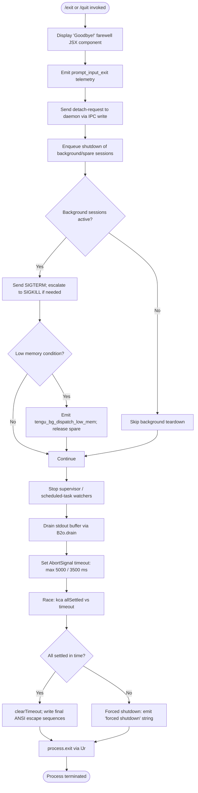

# `/exit`

> Analysis basis: CC v2.1.185 bundle.js (AST extraction + Claude interpretation)
> Minimum version: v2.1.185

---

## Overview

The `/exit` command (also aliased as `/quit`) initiates a graceful shutdown of the Claude Code CLI session. When invoked, it performs an ordered teardown sequence: displaying a farewell message, flushing pending output, terminating background processes, draining I/O buffers, and finally calling `process.exit`. The command is typed `local-jsx`, meaning it renders a JSX component during its execution, and it triggers immediately upon invocation (`immediate: true`).

---

## Registration

| Field | Value |
|---|---|
| type | `local-jsx` |
| name | `exit` |
| description | `null` |
| aliases | `["quit"]` |
| loc_byte | `12917945` |
| loc_byte_end | `12918141` |
| loc_line | `8547` |
| immediate | `true` |
| module_id | `bLl` |
| load_inline | `true` |
| arbor_handler.name | `Mcf` |
| arbor_handler.fqn | `claude-2.1.185::Mcf` |
| arbor_handler.kind | `AsyncFunction` |
| arbor_handler.resolution_path | `module_id` |
| arbor_handler.n_hits | `1` |

Analysis basis: CC v2.1.185 bundle.js:+12917945

---

## Input Branching

The `/exit` command executes a linear teardown flow with several ordered sub-phases. There are more than 3 distinct branching points during shutdown (background-process path, spare-session path, daemon-config path, forced-shutdown timeout path), so a Mermaid flowchart is used.



---

## Behavioral Spec

### 1. Handler Entry — Farewell Display and Immediate Setup

Analysis basis: CC v2.1.185 bundle.js:+12917194

The async handler `Mcf` (resolved via `module_id → bLl`) is the true entry point for `/exit`.

```
async function exitCommandHandler(context):
    // Display the farewell JSX component
    renderJSXComponent(GoodbyeComponent)        // "Goodbye!" literal at +12917158
    // Emit session_end telemetry
    emitTelemetry("prompt_input_exit")          // literal at +12917382
    // Invoke the UI unmount helper
    unmountUI(context)                          // via Dcf -> Gk at +12917149
    // Begin the ordered shutdown sequence
    await performOrderedShutdown(context)       // via Oi at +12917377
```

The string `"Goodbye!"` is displayed to the user immediately.
Analysis basis: CC v2.1.185 bundle.js:+12917158

### 2. Background-Process Teardown (via `KHe`)

Analysis basis: CC v2.1.185 bundle.js:+12917210

`KHe` coordinates the background-session teardown path.

```
function backgroundTeardown(sessions):
    // Iterate open daemon/bg sessions
    for session in sessions:                    // ndn at +11259642
        // Write a detach-request IPC message
        writeIPCMessage(session, "detach-request")  // literal at +11259679
        // via G6 -> sne.write at +10754896
        // Serialize message via JSON.stringify (Pe at +10754906)
        // Wait for acknowledgement
        await waitAck(session)                  // aue at +11259755
```

The string `"detach-request"` is the IPC message type sent to the daemon.
Analysis basis: CC v2.1.185 bundle.js:+11259679

### 3. Spare / Background Session Kill Sequence (via `f`)

Analysis basis: CC v2.1.185 bundle.js:+17275065

```
function killBackgroundWorker(worker):
    state = worker.get("closed")               // literal "closed" at +17274886
    if state != "closed":
        // First attempt: SIGTERM with 30s / 15s grace windows
        // Numeric constants: 30 at +17274979, 15 at +17274990
        sendSignal(worker, "SIGTERM")
        wait(30_seconds)
        if still_running:
            sendSignal(worker, "SIGKILL")       // literal at +17275072
            emitTelemetry("tengu_bg_dispatch_sigkill_escalate")  // +17275024
    // Check free memory: WNo.freemem at +17275455
    if lowMemory():
        emitTelemetry("tengu_bg_dispatch_low_mem")  // +17275625
    // Handle spare-session lifecycle
    if session.status == "spare":               // literal at +17275809
        emitTelemetry("tengu_bg_spare_enable")  // +17276322
    if claimResult == "claimed":                // literal at +17276588
        emitTelemetry("tengu_bg_spare_claim")   // +17276450
    else:
        emitTelemetry("tengu_bg_spare_claim_fail")  // +17276716
```

SIGKILL escalation constant: 100 ms retry interval (bundle.js:+17275099).
Analysis basis: CC v2.1.185 bundle.js:+17275065

### 4. Scheduled-Task / Supervisor Cleanup (via `sjn`)

Analysis basis: CC v2.1.185 bundle.js:+12917241

```
function cleanupScheduledTasks(taskRegistry):
    // Collect pending "scheduled task" entries
    tasks = taskRegistry.collect("scheduled task")   // literal at +11252685
    for task in tasks:
        // Parse task timing using XGp (getNextRunTime logic)
        nextRun = computeNextRunTime(task)       // XGp at +11252712
        // Format duration using ea (floor/round helpers)
        duration = formatDuration(nextRun - Date.now())  // ea at +11252947
    // Stop supervisor watchers
    supervisorStop()                             // d.y.stop family at +17290370
```

The string `"scheduled task"` identifies the task type in the registry.
Analysis basis: CC v2.1.185 bundle.js:+11252685

### 5. Ordered Shutdown Sequence — `Oi` (performOrderedShutdown)

Analysis basis: CC v2.1.185 bundle.js:+12917377

This is the main orchestration function for the shutdown sequence.

```
async function performOrderedShutdown(context):
    // Step 1: Write terminal save/restore escape sequences
    writeSync(stdout, ESC_SAVE)                 // "\x1b7" at +3886250
    writeSync(stdout, ESC_RESTORE)              // "\x1b8" at +3886261
    // Step 2: Unmount Ink/React TUI components
    inkInstance = Gu.get(instanceKey)           // k3e at +7193683
    if inkInstance:
        inkInstance.unmount()                   // k3e -> e.unmount at +7193734
    // Step 3: Write exit banner / session summary
    writeExitBanner(context)                    // aJr at +7193951
    // Step 4: Drain stdout
    await drainStdout()                         // XWe -> B2o.drain at +69581

    // Step 5: Set up race between allSettled and timeout
    timeout_ms = Math.max(5000, 3500)           // literals at +7196074, +7196081
    timer = setTimeout(forcedShutdown, timeout_ms)  // via ULe.unref
    try:
        await Promise.race([
            kca(),                              // kca -> Promise.allSettled at +13551801
            AbortSignal.timeout(timeout_ms)     // at +7196359
        ])
    finally:
        clearTimeout(timer)                     // at +7196271

    // Step 6: Flush telemetry
    flushTelemetry()                            // Dgt at +7196420
    emitTelemetry("tengu_cache_eviction_hint")  // at +7196433
    emitTelemetry("session_end")                // literal at +7196471
    emitTelemetry("tengu_scroll_summary")       // at +7195490

    // Step 7: Resolve pending render promises (M3e)
    await resolvePendingRenders()               // M3e -> Promise.resolve at +7195607

    // Step 8: Final stdout write and process exit
    writeSync(stdout, finalBytes)               // nge.writeSync at +7196545
    process.exit()                              // via lJr at +7194321
```

Timeout constants: 5000 ms and 3500 ms (bundle.js:+7196074, +7196081).
Drain timeout ceiling: 2000 ms (bundle.js:+7196259).
Analysis basis: CC v2.1.185 bundle.js:+7195977

### 6. Forced Shutdown Path (via `lJr`)

Analysis basis: CC v2.1.185 bundle.js:+7194240

```
function forcedShutdown():
    clearTimeout(pendingTimer)                  // at +7194240
    instance = Gu.get(instanceKey)             // at +7194273
    // Log "forced shutdown" to stderr          // literal at +17308187
    process.exit(1)                             // at +7194321
    // Fallback: send SIGKILL to own PID
    process.kill(process.pid, "SIGKILL")        // at +7194346
    // Should be unreachable
    throw new Error("unreachable")              // literal "unreachable" at +7194394
```

Analysis basis: CC v2.1.185 bundle.js:+7194240

### 7. Exit Banner / Session Summary (via `aJr`)

Analysis basis: CC v2.1.185 bundle.js:+7193944

```
function writeExitBanner(context):
    // Resolve working directory paths
    cwd = resolvePaths()                        // yNt at +7193975
    // statSync to verify file paths            // r.statSync at +13451699
    // Format path display
    formattedPath = formatPath(cwd)             // mh at +7193995 -> Au -> qi
    // Replace special characters in path
    safePath = path.replaceAll("\\\\", "/")     // literal at +7194032
                   .replaceAll('\\"', '"')       // literal at +7194055
    // Write dimmed text summary to stdout
    writeSync(stdout, Ht.dim(safePath))         // at +7194129
    // Write session stats line
    writeStats(sessionStats)                    // yca at +7194081
```

Analysis basis: CC v2.1.185 bundle.js:+7193944

### 8. Daemon Config / Supervisor Stop (via `d`)

Analysis basis: CC v2.1.185 bundle.js:+17290370

```
function supervisorTeardown(supervisorMap):
    for entry in supervisorMap.values():        // entry labeled "supervisor" at +17290102
        // Stop the supervisor spinner/watcher
        entry.stop()                            // d -> y.stop at +17290370
        supervisorMap.delete(entry.key)         // i.delete at +17290379
        // Stop associated E-type runner
        entry.runner.stop()                     // E.stop at +17290490
        // Update config then restart (if live reload)
        entry.runner.updateConfig(newConfig)    // at +17290499
        entry.runner.start()                    // at +17290517
    emitTelemetry("tengu_daemon_config_reload") // at +17290895
```

Analysis basis: CC v2.1.185 bundle.js:+17290077

### 9. Startup Performance Flush (via `C_t`)

Analysis basis: CC v2.1.185 bundle.js:+7196395

On exit, any startup profiling data collected earlier is flushed and written to disk.

```
function flushStartupPerf():
    if not profilingEnabled:
        log("Startup profiling not enabled")    // literal at +223435
        return
    if checkpoints.length == 0:
        log("No profiling checkpoints recorded") // literal at +223525
        return
    // Build report using bsr -> B9o
    report = buildPerfReport(checkpoints)       // B9o at +225580
    // Write to disk via _Ee -> Qde.openSync etc.
    writePerfReport(report, "startup-perf")     // literal at +224413
    // Write final O9o -> JSON.stringify
    writeSync(file, JSON.stringify(report))     // at +224148
    // Emit telemetry
    emitTelemetry("tengu_startup_perf")         // at +225615
```

Analysis basis: CC v2.1.185 bundle.js:+223929

---

## State & Side Effects

| Item | Detail |
|---|---|
| Telemetry — tengu_bg_dispatch_sigkill_escalate | Fired when a background worker requires SIGKILL escalation (bundle.js:+17275024) |
| Telemetry — tengu_bg_dispatch_low_mem | Fired when free memory is low during background teardown (bundle.js:+17275625) |
| Telemetry — tengu_bg_spare_enable | Fired when a spare session is enabled during shutdown (bundle.js:+17276322) |
| Telemetry — tengu_bg_spare_claim | Fired when a spare session is successfully claimed (bundle.js:+17276450) |
| Telemetry — tengu_bg_spare_claim_fail | Fired when spare session claim fails (bundle.js:+17276716) |
| Telemetry — tengu_daemon_config_reload | Fired during supervisor teardown/config flush (bundle.js:+17290895) |
| Telemetry — tengu_startup_perf | Fired when startup profiling data is flushed on exit (bundle.js:+225615) |
| Telemetry — tengu_scroll_summary | Fired during the shutdown sequence (bundle.js:+7195490) |
| Telemetry — tengu_amber_creek | Fired via `Os` display-mode helper path (bundle.js:+3545521) |
| Telemetry — tengu_pewter_brook | Fired via `Os` display-mode helper path (bundle.js:+3545429) |
| Telemetry — tengu_cache_eviction_hint | Fired during final telemetry flush (bundle.js:+7196433) |
| Telemetry — session_end | Fired as the last named event before process exit (bundle.js:+7196471; literal at +7196471) |
| prompt_input_exit literal | Emitted as a named event at the very start of the handler (bundle.js:+12917382) |
| IPC / Daemon write | Sends `"detach-request"` message to the daemon over the IPC channel (bundle.js:+11259679) |
| JSX render | Renders the `GoodbyeComponent` (string `"Goodbye!"` at bundle.js:+12917158) via `OCo.createElement` |
| ANSI escape sequences | Writes `\x1b7` (save cursor) and `\x1b8` (restore cursor) to stdout (bundle.js:+3886250, +3886261) |
| stdout drain | Calls `B2o.drain()` to flush pending output before exit (bundle.js:+69581) |
| Timer | `setTimeout` set to `Math.max(5000, 3500)` ms; unreffed via `ULe.unref` (bundle.js:+7196074, +7196081, +7196090) |
| Forced shutdown | `process.exit` then `process.kill(pid, SIGKILL)` fallback if grace period exceeded (bundle.js:+7194321, +7194346) |
| appState changes | Supervisor map entries removed (`i.delete` at +17290379); task watchers stopped |
| Startup perf file | Profiling report written to disk via `Qde.openSync` / `Qde.writeFileSync` / `Qde.fsyncSync` / `Qde.closeSync` (bundle.js:+191837–191942) |

---

## Version History

| Version | Change |
|---|---|
| v2.1.185 | Initial analysis |

---

## Common Mistakes

1. **Confusing `/exit` and `/quit`**: Both names invoke the same handler (`Mcf`). They are fully equivalent — `quit` is a registered alias. Using either is correct.
2. **Expecting instant termination**: The command is `immediate: true` at the registration level, but the actual process exit is deferred through an async teardown chain with a maximum grace period of `Math.max(5000, 3500)` ms. The process does not exit the moment the command is typed.
3. **Assuming no background effects**: `/exit` actively sends `"detach-request"` IPC messages to daemon workers and may emit SIGTERM/SIGKILL to background sessions before exiting. It is not a passive no-op shutdown.
4. **Ignoring the forced-shutdown fallback**: If the grace period is exceeded, the code calls `process.exit` followed by `process.kill(process.pid, "SIGKILL")` — unsaved state may be lost.
5. **Expecting a description string**: The `description` field is `null` for this command; it will not appear in `/help` command listings that rely on the description field.
6. **Not accounting for startup-perf flush**: If Claude Code was launched with startup profiling enabled, `/exit` will synchronously write a profiling report to disk before terminating, which may add a small delay.

---

## Appendix — Identifier Mapping

> For bundle debugging only. Identifiers change across versions.

| Identifier | Role |
|---|---|
| `Mcf` | Main async handler for `/exit` (arbor_handler; AsyncFunction resolved via module_id `bLl`) |
| `Hi` | Session / context accessor called at handler entry |
| `uNe` | Sub-helper called by `Hi`; context store retrieval |
| `KHe` | Background-session teardown coordinator; sends detach-request IPC |
| `ndn` | Session iterator used by `KHe` |
| `bsl` | Sub-helper within `KHe`; process state checker |
| `r6n` | Sub-helper within `bsl`; numeric status evaluator |
| `Tn` | Sub-helper within `bsl` and `c`; timing/state utility |
| `G6` | IPC write dispatcher; routes detach-request to daemon |
| `Pe` | JSON serializer helper (wraps `JSON.stringify`) |
| `aue` | Acknowledgement waiter within `KHe` |
| `iA` | Unknown utility called during handler setup |
| `sjn` | Scheduled-task cleanup coordinator |
| `j0` | Sub-helper in `sjn`; task-registry accessor |
| `gx` | Low-level getter utility (used by multiple callers) |
| `XGp` | Next-run-time computation for scheduled tasks |
| `AP` | Cron/schedule expression parser |
| `J1` | Schedule string tokenizer |
| `Bbd` | Cron-field parser (splits, matches, parses integers) |
| `Ltt` | Time-resolution helper; adjusts calendar fields |
| `ea` | Duration formatter (floor/round math) |
| `Va` | String width / substring utility |
| `tn` | Terminal string-width measurer (wraps `Bun.stringWidth`) |
| `Qs` | String-padding / display helper |
| `Ky` | Sub-helper within `Qs`; unknown formatting role |
| `Dcf` | Goodbye JSX component factory |
| `Oi` | Ordered shutdown orchestrator (main teardown async function) |
| `k3e` | Ink TUI instance unmounter and stdout writer |
| `fF` | Sub-helper within `k3e`; unknown UI cleanup role |
| `MEn` | ANSI escape / terminal restore writer |
| `o$e` | Terminal type detector (ghostty, iTerm, tmux) |
| `JFe` | Sub-helper within `MEn`; unknown role |
| `EL` | tmux / screen escape sequence replacer |
| `Gp` | Unknown helper called by `MEn` and `k` |
| `T` | Log/debug writer; formats messages, calls `Pe` for serialization |
| `aJr` | Exit banner / session summary writer |
| `zw` | Unknown utility called by `aJr` and `dDn` |
| `E9` | Unknown sub-helper within `aJr` |
| `Lt` | Path / file utility (used by `aJr`, `F9o`, `$9o`) |
| `yNt` | Working-directory path resolver |
| `p2` | Sub-helper within `yNt`; path getter |
| `Ar` | Sub-helper within `yNt`; path getter variant |
| `jt` | File-join/path utility |
| `mh` | Session/path formatter (calls `Lt`, `Au`) |
| `Au` | Path composition helper (calls `qi`) |
| `yca` | Session statistics formatter/writer |
| `lJr` | Forced-shutdown executor (calls `process.exit`, `process.kill`) |
| `XWe` | stdout drain wrapper (calls `B2o.drain`) |
| `d` | Supervisor map / agent-runner manager |
| `Aje` | File stat checker and content reader |
| `dn` | Unknown utility called by `Aje` |
| `ci` | AsyncLocalStorage store getter |
| `Swo` | Sub-helper within `Aje` |
| `Ee` | String coercion helper |
| `qDl` | Object-key width formatter (uses `Math.max`) |
| `y` | Supervisor watcher (has `.stop()` method) |
| `l1t` | Sub-helper within `y` |
| `xht` | Watcher implementation helper (calls `pcc`) |
| `E` | Agent runner (has `.stop()`, `.updateConfig()`, `.start()`) |
| `_` | Runner implementation (coordinates promises and connection states) |
| `Puc` | Sub-helper within `d`; invokes `zse` |
| `zse` | Heartbeat or polling helper |
| `I` | Input handler / keypress dispatcher |
| `k` | Keypress event object / handler (calls `De`, `j6f`, `d.write`) |
| `j` | Unknown utility called by `d`, `dDn`, and `bsr` |
| `kca` | Async all-settled collector for teardown promises |
| `C_t` | Startup performance data flusher |
| `bsr` | Performance report builder (calls `B9o`) |
| `B9o` | Performance checkpoint aggregator |
| `O9o` | Performance report file writer orchestrator |
| `F9o` | File write helper (joins path, calls `Lt`) |
| `_Ee` | Synchronous file write helper (open/write/fsync/close) |
| `D9o` | Profiling data serializer |
| `v9` | Node `require` wrapper / module resolver |
| `$9o` | Alternative file write helper |
| `dDn` | Telemetry flush coordinator (calls `Hca`, `Os`) |
| `_ca` | Unknown sub-helper within `dDn` |
| `Hca` | Telemetry batch finalizer (timestamps, rounding, assign) |
| `hca` | Sub-helper within `Hca` |
| `Os` | Display-mode renderer (handles fullscreen, local-agent modes) |
| `L2` | Display mode checker |
| `tM` | Animation/color enablement checker |
| `PFr` | Display helper calling `st` |
| `_Z` | Sub-helper calling `Ced` |
| `RFr` | Windows/fullscreen mode detector |
| `Gr` | Sub-helper calling `_j` |
| `ved` | Helper calling `ct` (display state) |
| `ct` | Core display state manager |
| `Dgt` | Cache eviction hint emitter |
| `Qe` | Promise/event helper (calls `ogt`) |
| `ogt` | Low-level event primitive |
| `Ur` | Nonconforming terminal handler |
| `ey` | Sub-helper within `Ur` (calls `ogt`) |
| `M3e` | Pending render resolver (wraps `Promise.resolve`) |
| `cDn` | Sub-helper within `M3e` |

---

Note: index built via Arbor fallback; some signals (telemetry, literals) may be missing — see arbor-fallback.js.