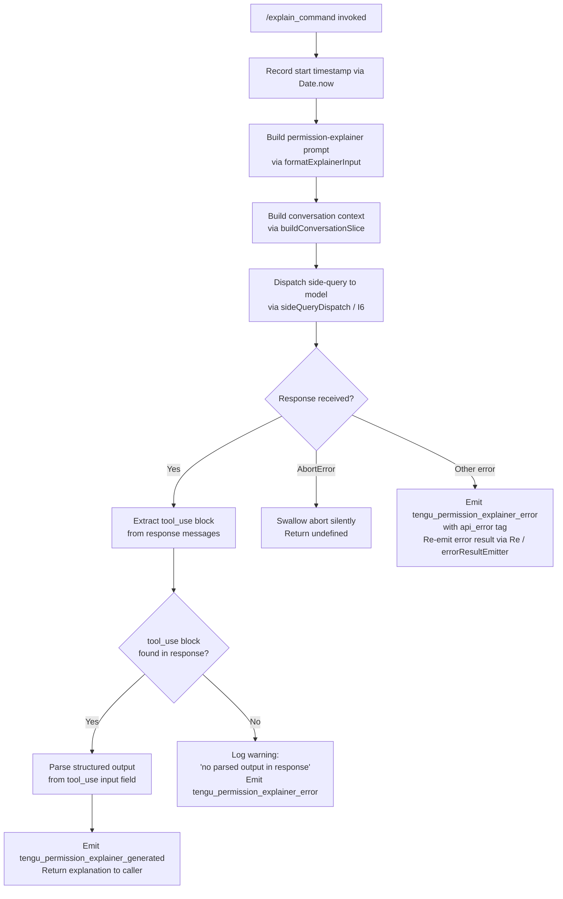

# `/explain_command`

> Analysis basis: CC v2.1.185 bundle.js (AST extraction + Claude interpretation)
> Minimum version: v2.1.185

---

## Overview

`/explain_command` is an internal `tool`-type command that invokes a dedicated "permission explainer" sub-agent to generate a natural-language explanation of why a given tool or MCP tool call requires the permissions it does. It issues a side-query to the model, parses the structured response, and emits telemetry for both success and failure cases.

---

## Registration

| Field | Value |
|---|---|
| type | `tool` |
| name | `explain_command` |
| description | `null` |
| loc_byte | `14798939` |
| loc_byte_end | `14798975` |
| loc_line | `10975` |
| arbor_handler.name | `Bql` |
| arbor_handler.fqn | `claude-2.1.185::Bql` |
| arbor_handler.kind | `AsyncFunction` |
| arbor_handler.resolution_path | `direct` |
| arbor_handler.n_hits | `1` |

Analysis basis: CC v2.1.185 bundle.js:+14798939

---

## Input Branching

The handler (`Bql`) exhibits four or more distinct execution paths depending on API response shape and error type, so a Mermaid flowchart is used.



Analysis basis: CC v2.1.185 bundle.js:+14798634 (entry `Bql → EPo`), +14798697 (context slice), +14798844 (side-query call), +14799037 (response parsing), +14799420 (success telemetry), +14799634 (error telemetry), +14800092 (AbortError check), +14800163 (api_error tag)

---

## Behavioral Spec

### 1. Handler Entry — `permissionExplainerHandler` (`Bql`)

```
async function permissionExplainerHandler(toolCallContext):
    startTime = Date.now()

    # Step 1: Format input for the explainer sub-agent
    explainerInput = formatExplainerInput(toolCallContext)   # EPo → Pe / String

    # Step 2: Build a trimmed conversation slice for context
    conversationSlice = buildConversationSlice(toolCallContext.messages)  # sPf

    # Step 3: Issue side-query to the model
    response = await sideQueryDispatch(explainerInput, conversationSlice)  # js / I6

    # Step 4: Parse the tool_use block from the response
    toolUseBlock = extractToolUseBlock(response)  # scan for type == "tool_use"

    if toolUseBlock is null:
        emitTelemetry("tengu_permission_explainer_error",
                       reason="no parsed output in response")
        return undefined

    # Step 5: Emit success telemetry and return
    emitTelemetry("tengu_permission_explainer_generated",
                   durationMs = Date.now() - startTime)
    return toolUseBlock.input
```

Analysis basis: CC v2.1.185 bundle.js:+14798634, +14798657, +14798697, +14798844, +14799037, +14799230, +14799420, +14799472, +14799769

---

### 2. Input Formatter — `formatExplainerInput` (`EPo`)

```
function formatExplainerInput(toolCallContext):
    # Serialise the tool call descriptor to a compact JSON string
    serialised = stringify(toolCallContext)      # Pe → JSON.stringify
    # Coerce to plain string for prompt injection
    return String(serialised)                   # String coercion
```

Analysis basis: CC v2.1.185 bundle.js:+14798149 (`EPo → Pe`), +14798175 (`EPo → String`)

---

### 3. Conversation Slice Builder — `buildConversationSlice` (`sPf`)

```
function buildConversationSlice(messages):
    # 1. Keep only assistant-role messages (filter by role == "assistant")
    assistantMsgs = messages.filter(m => m.role == "assistant")
    # 2. Reverse chronological order
    assistantMsgs.reverse()
    # 3. Take at most 3 most-recent assistant messages
    #    (literal 3 at bundle.js:+14798258)
    recent = assistantMsgs.slice(0, 3)
    # 4. For each message, extract text content blocks,
    #    truncating each to at most 1000 chars (literal 1000 at +14798203),
    #    and collapse surrogates (ND — unicode surrogate normalization)
    textParts = []
    for msg in recent:
        for block in msg.content:
            if block.type == "text":
                text = truncateAndNormalize(block.text, maxLen=1000)
                textParts.unshift(text)    # prepend to maintain original order
    # 5. Join with ellipsis separator "..." (literal at +14798434)
    return textParts.join("...")
```

Analysis basis: CC v2.1.185 bundle.js:+14798215 (`sPf → e.filter`), +14798238 (literal `"assistant"`), +14798258 (literal `3`), +14798283 (`sPf → n.reverse`), +14798341 (literal `"text"`), +14798426 (`sPf → ND` — surrogate normalizer), +14798434 (literal `"..."`), +14798442 (`sPf → r.unshift`), +14798475 (`sPf → r.join`), +14798203 (literal `1000`)

---

### 4. Side-Query Dispatch — `sideQueryDispatch` (`js` → `I6`)

```
async function sideQueryDispatch(prompt, context):
    # Resolve model config for a "side_query" (label literal at +8781607)
    modelConfig = resolveModelForSideQuery()  # jK / ul / _s
    # Build request headers (session-id, agent-id, user-agent, etc.)
    headers = buildRequestHeaders()           # Qj sub-routines
    # Dispatch via the main API client
    response = await apiClient.send({
        model: modelConfig,
        system: [permissionExplainerSystemPrompt],  # role "permission_explainer" (+14798997)
        messages: [{ role: "user", content: prompt + "\n" + context }],
        tools: [permissionExplainerTool],           # type "tool_use" (+14799152)
        max_tokens: <!-- TODO: not found in depth-2 traversal; needs --depth 4 -->
    })
    return response
```

The sub-call chain is: `js → jK → ul` (model resolution), `js → Pg` (prompt assembly), `js → I6` (actual HTTP dispatch via `Qj`).

Analysis basis: CC v2.1.185 bundle.js:+14798844 (`Bql → js`), +14798857 (`Bql → I6`), +8781607 (literal `"side_query"`), +14798997 (literal `"permission_explainer"`), +14799152 (literal `"tool_use"`)

---

### 5. Response Parsing and Telemetry — inside `permissionExplainerHandler` (`Bql`)

```
function parseExplainerResponse(response):
    for msg in response.messages:
        for block in msg.content:
            if block.type == "tool_use":
                return block.input   # structured JSON explanation object
    return null   # triggers "no parsed output" warning path

function handleError(err, startTime):
    if err.name == "AbortError":   # literal at +14800092
        return undefined           # silent abort
    emitTelemetry("tengu_permission_explainer_error",
                   tag="api_error")   # literal at +14800163
    emitErrorResult(err)              # Re / errorResultEmitter
```

Analysis basis: CC v2.1.185 bundle.js:+14799230 (`Bql → Pe`), +14799264 (`Bql → rPf`), +14799420 (`Bql → j` — telemetry emit), +14799472 (`Bql → Qi`), +14799521 (`Bql → ke`), +14799716 (`Bql → Pt`), +14799769 (literal `"Permission explainer: no parsed output in response"`), +14800092 (literal `"AbortError"`), +14800163 (literal `"api_error"`), +14800128 (`Bql → Re`)

---

### 6. Config Access and File System Sub-routines (`q_e`, `Ct`)

The handler indirectly relies on the configuration subsystem (`Ct → q_e`) to determine the active project config before dispatching the side-query. Key behaviors observed:

- Config must be initialised before use; accessing it prematurely throws `"Config accessed before allowed."` (literal at bundle.js:+13968690).
- Config files are read with `utf-8` encoding (literal at +13968773).
- Filesystem errors with code `ENOENT` are handled gracefully (literal at +13968920).
- Backup directory is named `"backups"` (literal at +13968258); `EEXIST` on `mkdirSync` is suppressed (literal at +13969535).
- File watch registration goes through `Ebf` (config watcher), which calls `watchFile` / `unwatchFile` and emits change events via `qi → B2o.register`.

Analysis basis: CC v2.1.185 bundle.js:+13968690, +13968773, +13968920, +13968258, +13969535, +13964841, +13965174, +69538

---

## State & Side Effects

| Item | Detail |
|---|---|
| Telemetry — success | `tengu_permission_explainer_generated` (emitted with elapsed duration; loc: +14799422) |
| Telemetry — error | `tengu_permission_explainer_error` (emitted on missing output or API error; loc: +14799634) |
| Telemetry — abort | No telemetry emitted on `AbortError`; error is swallowed silently |
| Telemetry — API stream | `tengu_api_success` (loc: +8783278), `tengu_lone_surrogate_sanitized` (loc: +8782974) via `I6` |
| Telemetry — config | `tengu_config_parse_error` (loc: +13969321), `tengu_config_auth_loss_prevented` (loc: +13963654) |
| Telemetry — feature flags | `tengu_feature_ok` (loc: +1021887), `tengu_feature_bad` (loc: +1021954), `tengu_feature_sad` (loc: +1022035) |
| Hook registration | Config file watcher registered via `qi → B2o.register` (loc: +69538) |
| appState changes | None directly observed in depth-2 traversal |
| Sound | None observed |
| Side-query label | Dispatched with label `"side_query"` (loc: +8781607); not a user-visible conversation turn |
| Tool role | Registered as type `"tool"` with sub-role identifier `"permission_explainer"` (loc: +14798997) |
| MCP tool detection | `Qi` helper checks for `"mcp__"` prefix (loc: +3296563) to distinguish MCP tool calls from built-in tool calls |

---

## Version History

| Version | Change |
|---|---|
| v2.1.185 | Initial analysis |

---

## Common Mistakes

1. **Assuming `/explain_command` is a user-facing prompt command.** It is registered as type `"tool"`, not `"prompt"`, meaning it does not appear in the slash-command autocomplete list for end users; it is invoked programmatically by the permission subsystem.
2. **Expecting a plain-text response.** The command requires a `tool_use` block in the model response. If the model returns only text, the handler logs a warning and returns `undefined` rather than an explanation string.
3. **Calling it before config is initialised.** The underlying config accessor (`q_e`) throws `"Config accessed before allowed."` if invoked before the configuration subsystem has been set up. Ensure the config lifecycle has completed before triggering this command.
4. **Treating an `AbortError` as a failure.** The handler explicitly silences abort errors and returns `undefined`. Callers must check for `undefined` return values rather than relying on thrown exceptions to detect cancellation.
5. **Confusing `"permission_explainer"` with a tool name.** The string `"permission_explainer"` is the system-prompt role identifier passed to the model, not the registered command name (`explain_command`). These are different identifiers for different layers of the stack.

---

## Appendix — Identifier Mapping

> For bundle debugging only. Identifiers change across versions.

| Identifier | Role |
|---|---|
| `Bql` | Main async handler for `explain_command` (permissionExplainerHandler) |
| `EPo` | Input formatter — serialises tool call descriptor to string |
| `Ct` | Config accessor — reads and watches project/global config |
| `jt` | Path utility helper (used by config and file system routines) |
| `Hko` | Config hook / observer registration |
| `q_e` | Config file reader and parser (low-level) |
| `Gt` | JSON.parse wrapper |
| `V9` | String prefix stripper |
| `dn` | Logging / debug emitter |
| `RFl` | Directory listing and backup path resolver |
| `T` | Debug-level log router |
| `Sko` | Path join helper for backup subdirectory |
| `Ebf` | Config file watcher (watchFile/unwatchFile lifecycle) |
| `Kq` | Change event debouncer for config watcher |
| `qi` | Event registrar (wraps `B2o.register`) |
| `oPf` | Explainer input serialiser (JSON.stringify + String coerce) |
| `Pe` | JSON stringify wrapper |
| `sPf` | Conversation slice builder (filter/reverse/truncate/join) |
| `ND` | Unicode surrogate-pair normaliser (charCodeAt / slice) |
| `js` | Side-query orchestrator (model resolution + prompt assembly) |
| `jK` | Model config resolver entry point |
| `S_` | Model string builder helper |
| `VG` | Model version gate |
| `ul` | Model tier and alias resolver |
| `Ubt` | Upstream model binding (drs/urs) |
| `Fbt` | Full model spec builder (Object.keys / entries) |
| `Bl` | String replacement utility |
| `nNe` | Model name inclusion check |
| `PR` | Provider resolution helper |
| `Run` | Recursive model alias resolver |
| `PBs` | Policy binding serialiser |
| `xn` | Model name normaliser |
| `K7e` | Model entry lookup by key |
| `RBs` | Model name index-of searcher |
| `ZMu` | Model zone/domain matcher |
| `_s` | Model string tokeniser and classifier |
| `oCt` | Model option parser (startsWith / toLowerCase) |
| `eRu` | Extended model resolver with provider prefix |
| `Pg` | Prompt assembly for side-query |
| `pL` | Prompt layer composer |
| `$vr` | Prompt variant selector |
| `Uun` | Unified prompt builder (large multi-path function) |
| `I6` | API dispatch orchestrator (main HTTP + streaming path) |
| `Am` | Auth module entry |
| `Lt` | Logger / tracer entry |
| `gx` | Low-level logger sink |
| `Qj` | Core API request builder and sender |
| `VK` | Vendor key resolver |
| `APr` | API path parser (split/trim/indexOf/slice) |
| `Hi` | Header injector |
| `uNe` | Unknown-header normaliser |
| `pz` | Proxy / gateway resolver |
| `qun` | AsyncLocalStorage store getter |
| `qvr` | URL encoder (replace + encodeURIComponent) |
| `st` | Status code helper |
| `Lh` | OAuth token lifecycle manager |
| `uhn` | Token refresh helper (`UPr`) |
| `WBs` | Boolean flag wrapper |
| `hy` | Auth profile selector |
| `dp` | Auth profile data accessor |
| `ib` | Identity/bearer token builder |
| `Ac` | Auth credential formatter |
| `YT` | Token type discriminator |
| `Ug` | Auth upgrade and retry orchestrator |
| `vLt` | Variant auth loader |
| `AJe` | API key / JWT injector |
| `VH` | Versioned-header builder |
| `TWu` | Token watchdog / expiry checker |
| `aJe` | Auth JWT expiry monitor |
| `Lr` | Request logger |
| `Jsn` | JWT session manager (proxyAuthHelper) |
| `k1e` | JWT claim extractor |
| `sSs` | Session state serialiser |
| `whu` | Integer parser with NaN guard |
| `RU` | Request UUID generator |
| `Cv` | Credential vault accessor |
| `MWu` | Main HTTP request executor (fetch + streaming) |
| `wr` | Request wrapper / enricher |
| `Ati` | Attempt tracker |
| `_Pr` | Pre-request config patcher |
| `RWu` | Response header redactor |
| `xWu` | Numeric parameter validator |
| `h` | AbortController wrapper |
| `hti` | HTTP timeout initialiser |
| `mti` | Metrics timer initialiser |
| `gPr` | Backoff / retry parameter calculator |
| `kWu` | Byte-stream watchdog (idle timeout, enqueue, cancel) |
| `_H` | Header sanitiser |
| `SIt` | Stream iterator helper |
| `H0u` | Header prefix checker |
| `W1e` | Header value normaliser (toLowerCase / Object.values) |
| `M2` | Model metadata accessor |
| `wOe` | Model option extractor |
| `dy` | Domain / URL validator |
| `Hl` | String coercion helper |
| `RK` | URL component parser (split/toLowerCase/includes/startsWith) |
| `hze` | Hostname zone extractor |
| `iSs` | IP subnet checker |
| `NEr` | Network endpoint resolver |
| `$Er` | Endpoint string builder |
| `DWu` | Dispatch wrapper (mti + pti + wr) |
| `pti` | Per-attempt timer initialiser |
| `IWu` | Instance-level request wrapper |
| `VAn` | Vendor API normaliser |
| `_We` | Wildcard endpoint matcher |
| `_re` | Runtime endpoint resolver (Bpc.find) |
| `Lwr` | Low-level request writer |
| `Ps` | Path sanitiser (replace / $Zt.includes) |
| `oTe` | OAuth token exchanger |
| `Bnr` | Bearer-token normaliser |
| `aPu` | Auth POST utility (NS.post) |
| `Wzt` | Token write-through cache |
| `$nr` | Nonce / timestamp generator |
| `fLt` | Field-level transformer (toLowerCase on keys) |
| `zTe` | SDK error logger (console.error) |
| `M` | Session manager / main REPL state object |
| `Dtt` | Disk transcript reader |
| `d` | Terminal writer / daemon write channel |
| `CQ` | Config queue accessor |
| `CMt` | Config migration tool (mkdir + writeFile) |
| `J1i` | Job-list filter (filter + ktt) |
| `g` | Buffer accumulator (concat/indexOf/subarray) |
| `u` | Utility bundle (ke/Re/rF/SG) |
| `k` | Keyboard input handler (Uuc/Gp/d.write) |
| `Jnc` | Job name composer (e.map / Math.max / r.join) |
| `fae` | File-access executor (Dre/Dtt/CMt) |
| `x` | Raw output writer (d.write) |
| `w` | Window / focus state tracker (kz/Date.now/Math.min) |
| `kz` | Focus state key |
| `L` | Lifecycle / sweep manager (Date.now / Promise.all / retire) |
| `v` | View state |
| `Dec` | Decrement-at helper (e.at) |
| `Mv` | Model view bridge (→ Ug) |
| `sTe` | Streaming token emitter (RYe / ke / Re) |
| `RYe` | Raw yield emitter (fetch / AbortSignal) |
| `ke` | Key event emitter |
| `Re` | Error result emitter |
| `fPu` | Feature-provision utility (t.includes) |
| `I` | Input controller (Math.max/floor/preventDefault) |
| `E` | Event dispatcher |
| `GUe` | Global URL enricher |
| `Fo` | Foundry URL formatter (K7e / e_ / dHt / Af) |
| `e_` | URL encode helper (toLowerCase / includes / replace) |
| `dHt` | Domain-host transformer |
| `Af` | URL path affix (e.replace) |
| `d1` | Secondary request writer (wr) |
| `nse` | Namespace extractor (jgt / n.get / xwr) |
| `jgt` | JWT getter |
| `xwr` | Extended writer (e.replace / Lwr) |
| `_` | Global middleware list (xht / GF / vP / Promise.all) |
| `xht` | Extension host tracker (pcc) |
| `pcc` | Plugin config collector (Object.keys) |
| `De` | Debug error emitter (Ho / st / ra / Bzc) |
| `Ho` | Error / string hoister |
| `ra` | Rate-limiter accessor (eJo) |
| `Bzc` | Circular buffer manager (Ven.shift / Ven.push) |
| `nyp` | Name-yield-path resolver (e.find / n.find) |
| `Kso` | Key/secret hash generator (wRa.createHash sha256) |
| `Kun` | Key union builder (Hl / wr / Mu / qun / jvr) |
| `Mu` | Mutex / lock holder (Zln) |
| `Zln` | Zone-local namespace holder (V7e) |
| `jvr` | JWT version resolver |
| `d_n` | Deep-clone / normaliser (wr) |
| `M4e` | Main-thread model executor (st / wr / vo / ct) |
| `vo` | View orchestrator (hy / Y2 / mi) |
| `Y2` | Array-type checker (Array.isArray / e.includes) |
| `_rr` | Raw request recorder |
| `ct` | Cache tracker (wxt / Lxt / I4 / OHn / Ct) |
| `wxt` | Cache write tracker |
| `Lxt` | Cache lookup tracker |
| `I4` | Cache index (T4) |
| `OHn` | Cache-hit observer (ONr.has / pIe.get / RNr / $Nr) |
| `yrr` | Error rate recorder |
| `UR` | URL resolver (LPr / BUe) |
| `LPr` | Low-level path resolver (wr) |
| `BUe` | Base URL evaluator (st / Z1e) |
| `Z1e` | Zone-list evaluator (Cvr.includes) |
| `xRa` | Cross-region adapter |
| `rhn` | Region hostname normaliser (YQ / Fo / n.includes) |
| `Uv` | URL variant mapper (e.map) |
| `Qve` | Query-variant executor (Fa / Array.isArray / o8 / Mc) |
| `o8` | Operator-8 session builder (Ct / Eko.randomBytes / pn) |
| `pn` | Process namespace initialiser (W7n / vx / q_e / AAt) |
| `Mc` | Model context builder (hy / Ct) |
| `c9o` | Context-9 object builder (t.pop / Array.isArray / uYt) |
| `uYt` | User-yield tracker (cYt / VHc.test) |
| `cU` | Clone-utility (structuredClone) |
| `pYt` | Prompt-yield tracker (n.pop / Array.isArray / dYt) |
| `dYt` | Deferred-yield transformer (i9o / e.replace) |
| `Qe` | Queue entry (ogt) |
| `ogt` | Output gate |
| `Dwr` | Debug writer (wr / n9s) |
| `n9s` | Normalised-9 string parser (e.match / t.split / r.every / HPu.test) |
| `kwr` | Key-writer / header builder (xwr / jgt / r.get / t.every / o.has) |
| `nEe` | Name-event emitter |
| `Ur` | URL router (ey / Qe) |
| `ey` | Event yielder (ogt) |
| `os` | Output sink (ogt) |
| `dDt` | Data-dispatch tracker (Nki / Pet / uDt) |
| `Nki` | Notification key index (ihd / De) |
| `ihd` | ID-hash dispatcher (Rki.has / oc / zbn.has) |
| `Pet` | Pending-event tracker (ey) |
| `uDt` | Update-dispatch tracker (Pet / cDt) |
| `cDt` | Content-digest tracker (Dki.createHash) |
| `CF` | Cache-fetch executor (shd / x1 / De) |
| `shd` | SHA-digest helper (e.startsWith / e.slice / Kbn / lNr / x1) |
| `Kbn` | Key binding normaliser (lNr) |
| `lNr` | Line-number resolver (e.indexOf / e.slice) |
| `x1` | Exact-match line resolver (e.startsWith) |
| `Rgt` | Rate-gate tracker |
| `Qi` | Query identifier (Object.hasOwn / ey / e.startsWith — detects mcp__ prefix) |
| `Pt` | Permission tracker (j / Ue) |
| `Ue` | Update emitter (ogt) |
| `Ee` | Error emitter (String) |