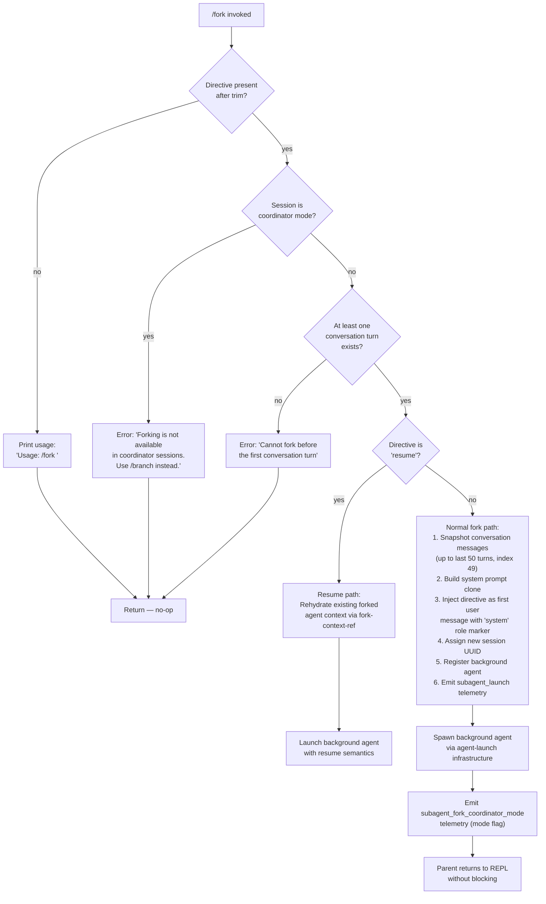

# `/fork`

> Analysis basis: CC v2.1.185 bundle.js (AST extraction + Claude interpretation)
> Minimum version: v2.1.185

---

## Overview

`/fork` spawns a background agent that inherits the full current conversation as its starting context, then runs a user-supplied directive independently. The parent session continues uninterrupted while the forked agent executes asynchronously, communicating results back through the background-session machinery.

---

## Registration

| Field | Value |
|---|---|
| type | `local-jsx` |
| name | `fork` |
| description | `Spawn a background agent that inherits the full conversation` |
| argumentHint | `<directive>` |
| module_id | `fCl` |
| load_inline | `true` |
| loc_byte | `12764228` |
| loc_byte_end | `12764431` |
| loc_line | `8420` |
| arbor_handler.name | `raf` |
| arbor_handler.fqn | `claude-2.1.185::raf` |
| arbor_handler.kind | `AsyncFunction` |
| arbor_handler.resolution_path | `module_id` |
| arbor_handler.n_hits | `0` |

Analysis basis: CC v2.1.185 bundle.js:+12764228

---

## Input Branching

Five distinct decision branches are present (missing directive, coordinator-mode block, pre-first-turn block, "resume" path, and normal fork path), so a Mermaid flowchart is used.



Analysis basis: CC v2.1.185 bundle.js:+12763787 (handler entry), +12763811 (usage literal), +12763925 (coordinator error), +12763998 (pre-turn error), +11181129 (resume literal), +11180819 (subagent_launch event)

---

## Behavioral Spec

### 1. Entry validation (`raf`)

The primary async handler `raf` (Arbor-resolved, `claude-2.1.185::raf`) performs three guard checks before any fork work begins.

```
async function forkCommandHandler(userInput, sessionContext):
    directive = userInput.trim()                         // +12763787
    if directive is empty:
        print "Usage: /fork <directive>"                 // +12763811
        return

    if sessionContext.mode == "coordinator":
        print "Forking is not available in coordinator sessions. Use /branch instead."
        return                                           // +12763925

    if sessionContext.conversationTurnCount == 0:
        print "Cannot fork before the first conversation turn"
        return                                           // +12763998
```

Analysis basis: CC v2.1.185 bundle.js:+12763787

### 2. Resume detection (`hHo`)

After guards pass, the handler delegates to the subagent-launch helper (`hHo`). That function checks whether the directive is the special token `"resume"`.

```
function prepareForkedAgentLaunch(directive, sessionContext):
    if directive.toLowerCase() == "resume":             // +11181129
        return resumeExistingFork(sessionContext)
    else:
        return buildNewForkPayload(directive, sessionContext)
```

Analysis basis: CC v2.1.185 bundle.js:+11181129, +11181145

### 3. Context snapshot (`hHo` → conversation slice)

For a normal (non-resume) fork the function slices the current message history.

```
function buildNewForkPayload(directive, sessionContext):
    messages = sessionContext.messages.slice(0, 50)     // limit constant +11181195 / +11181208
    contexts = sessionContext.getReplContexts()

    // Generate a session ID for the fork
    sessionId = generateSessionId(randomBytes)           // +32806, fR helper
    timestamp = Date.now()                               // +11181252

    // Attach directive as a synthetic "system" turn
    systemMessage = buildSystemPromptClone(sessionContext)   // via b6 → e.getSystemPrompt
    userDirectiveMessage = { role: "system", content: directive }   // "system" +12763851

    payload = {
        messages: messages,
        systemPrompt: systemMessage,
        directive: userDirectiveMessage,
        sessionId: sessionId,
        timestamp: timestamp,
    }
    return payload
```

Analysis basis: CC v2.1.185 bundle.js:+11181177 (`Vrl` trim), +11181198 (slice), +11181225 (`fR` ID generation), +11181252 (timestamp)

### 4. Background agent registration (`Yut`)

The payload is handed to the background-agent scheduler (`Yut` → `m6e`), which:

1. Creates or reuses the subagents directory on disk (via `mkdir` at `bxo` / `Wne.mkdir`, +13547848).
2. Creates a symlink pointing to the fork-context file (`fork-context-ref` literal, +13467572), linking the forked session to the parent transcript.
3. Registers the new session with the agent registry (`a.register`, +10529119).
4. Sets initial agent status to `"pending"` → `"running"` → `"local_agent"` (literals at +13551351, +10528799, +10528754).

```
async function registerBackgroundAgent(payload, agentRegistry):
    agentDir = ensureSubagentDir(payload.sessionId)      // bxo +13547848
    contextLink = createForkContextSymlink(agentDir)     // Wne.symlink +13550329
    agentHandle = agentRegistry.register({
        id: payload.sessionId,
        status: "pending",
        type: "local_agent",
        category: "general-purpose",                     // +10528917
    })
    return agentHandle
```

Analysis basis: CC v2.1.185 bundle.js:+10528707 (`m6e`), +13547848, +13550329, +10529119

### 5. Coordinator-mode forking block

When the parent session is running as a coordinator (multi-agent orchestrator), `raf` blocks the fork entirely and emits the `subagent_fork_coordinator_mode` telemetry event before returning an error string.

```
function handleCoordinatorModeGuard(sessionContext):
    emit telemetry "subagent_launch"                     // +11180819
    emit telemetry "subagent_fork_coordinator_mode"      // +11180837
    return errorMessage("Forking is not available in coordinator sessions. Use /branch instead.")
```

Analysis basis: CC v2.1.185 bundle.js:+11180819, +11180837, +12763925

### 6. Missing-directive fallback (`raf` → `e` helper)

When no directive is provided after trimming, a randomised jitter delay helper (`e`) using `Math.random` and `setTimeout` is NOT involved (that lives in a different branch). The command immediately prints usage and returns.

Literal usage message: `"Usage: /fork \<directive\>"` (+12763811).

### 7. Fork-context persistence (`$ct`)

After agent registration, the fork persists its snapshot to disk in JSONL format:

```
async function persistForkContext(agentDir, payload):
    metaPath  = path.join(agentDir, sessionId + ".meta.json")   // ".meta.json" +13449851
    dataPath  = path.join(agentDir, sessionId + ".jsonl")        // ".jsonl" +13450007
    await fs.mkdir(path.dirname(metaPath), { recursive: true })  // Rl.mkdir +13449908
    await fs.writeFile(metaPath, JSON.stringify(metaRecord))     // Rl.writeFile +13449953
    await persistMessagesToJSONL(dataPath, payload.messages)
```

Analysis basis: CC v2.1.185 bundle.js:+13449895 (`sOl`), +13449908, +13449953, +13467572

### 8. Async agent lifecycle (`j4e` → `R3p`)

Once launched the forked agent runs the standard background-agent execution loop (`j4e` / `R3p`), which includes:

- Setting agent mode to `"subagent"` and `"spawn"` (+11181732, +11181797).
- Running the full query/tool-execution loop with its own abort controller.
- Posting progress events (`subagent_complete`, `subagent_stall_timeout`) back to the parent.
- Emitting `subagent_completed` / `subagent_end` when finished (+8877155, +8877455).

---

## State & Side Effects

| Item | Detail |
|---|---|
| Telemetry | `tengu_silent_harbor` (+13694227), `tengu_slate_harrier` (+13703925), `tengu_async_agent_stall_timeout` (+8880949), `tengu_agent_tool_completed` (+8876860), `tengu_agent_tool_terminated` (+8884527), `tengu_auto_mode_decision` (+8878559) |
| Subagent events | `subagent_launch` (+11180819), `subagent_fork_coordinator_mode` (+11180837), `subagent_fork_prompt_missing` (+11180961), `subagent_completed` (+8877155), `subagent_end` (+8877455), `subagent_complete` (+8881189), `subagent_stall_timeout` (+8881209) |
| Filesystem | Creates `~/.claude/subagents/<session-id>/` directory; writes `.meta.json` and `.jsonl` transcript files; creates `fork-context-ref` symlink |
| Agent registry | Adds a new entry with `status: "pending"` → `"running"`, `type: "local_agent"`, `category: "general-purpose"` |
| appState changes | New background-agent entry added via `agentRegistry.register`; parent `appState` is read (not mutated) to clone the system prompt |
| Stall watchdog | 600 000 ms (10 min) stall timeout applied to forked agent (+8879889) |
| Sound | None detected |
| Coordinator-mode guard | Hard blocks `/fork` when session `mode == "coordinator"`; redirects to `/branch` |
| Pre-turn guard | Hard blocks if no conversation messages exist yet |

---

## Version History

| Version | Change |
|---|---|
| v2.1.185 | Initial analysis |

---

## Common Mistakes

1. **Omitting the directive** — `/fork` with no argument prints the usage string `Usage: /fork <directive>` and does nothing. Always supply a directive describing what the background agent should do.
2. **Using `/fork` in a coordinator session** — Multi-agent coordinator sessions block `/fork` entirely. Use `/branch` instead.
3. **Forking before any conversation exists** — The command requires at least one completed turn. Run `/fork` only after the first exchange with Claude.
4. **Expecting synchronous results** — The forked agent runs asynchronously. The parent REPL returns immediately; monitor the background-agent panel for output.
5. **Confusing `resume` with a real directive** — The string `resume` is a reserved keyword that rehydrates an existing fork context rather than creating a new one. Avoid it as a task description.
6. **Expecting forked agents to share the live conversation** — The fork receives a snapshot of the conversation at the moment of the `/fork` call (up to the last 50 messages). Subsequent parent-session messages are not visible to the forked agent.

---

## Appendix — Identifier Mapping

> For bundle debugging only. Identifiers change across versions.

| Identifier | Role |
|---|---|
| `raf` | Primary async handler for `/fork` (Arbor-resolved) |
| `hHo` | Subagent-launch orchestrator; builds fork payload, detects `resume` |
| `L6p` | System-prompt cloning helper |
| `Fr` | Fetches working-directory / tool-allow/disallow lists from appState |
| `b6n` | Extracts `working_directory` from appState |
| `T6n` | Extracts `allowed_tools` / `disallowed_tools` from appState |
| `mB` | Extracts `permission_mode` / `bypassPermissions` |
| `Xk` | System-prompt assembly (full prompt builder) |
| `b6` | Constructs main-thread system prompt, reads `getSystemPrompt` |
| `Yut` | Background-agent launcher entry point |
| `m6e` | Agent directory/filesystem setup (mkdir, symlink, unlink) |
| `bxo` | Creates subagent working directory |
| `fh` | Builds paths for JSONL / log files |
| `Yzn` | Agent set bookkeeping (add/delete with finally) |
| `hM` | Agent ID and metadata helper |
| `rN` | Signal / abort controller setup |
| `Xl` | Sets max-listeners on abort event emitter |
| `HFi` | Binds abort handlers |
| `u0` | Timestamps agent creation, links transcript file |
| `ks` | Low-level logging helper |
| `wf` | Write helper used across agent infrastructure |
| `fR` | Session-ID generator (random bytes → hex) |
| `Vrl` | Trims REPL context strings |
| `Y9n` | Conversation message slicer / type-checker |
| `VMp` | Filters assistant messages |
| `KMp` | Filters tool-use messages |
| `qMp` | Filters tool-result messages |
| `zMp` | Checks for tool-result "error" markers |
| `KK` | Constant or config-key helper |
| `j4e` | Background-agent execution loop (run turns, handle events) |
| `R3p` | Core query/tool loop for a running agent |
| `raf` (also `__handler_fork`) | Synthetic BFS entry — resolved to real handler `raf` by Arbor |
| `e` | Random-jitter / setTimeout helper (used in other branches, not the fork path) |
| `iw` | Context-window helper called at end of `raf` |
| `Re` | Feature-flag / telemetry emit helper |
| `Ue` | Inner telemetry helper |
| `ogt` | Low-level telemetry logger |
| `Gr` | UUID / unique-reference helper |
| `gte` | Model-selection / session-config builder |
| `L3` | Main REPL session runner |
| `sv` | Subagent session object (full lifecycle) |
| `fHe` | Fork-context hydration and session builder |
| `$ct` | Persists fork context to disk (`.meta.json`, `.jsonl`) |
| `sOl` | Path helper for fork context directory |
| `Au` | Conversation-context reference builder |
| `bce` | Fork-context reference lookup |
| `Y6e` | Context-snapshot filter |
| `ilo` | Fork-response streaming and token estimation |
| `sao` | Cache-layer for fork context records |
| `oao` | Clears fork context cache |
| `gRa` | Guard: checks `Y_p` set for duplicate fork IDs |
| `D4e` | Guard: checks `J_p` set |
| `pio` | Agent-completion handler (emits `subagent_completed`) |
| `mio` | Handoff-classifier checker |
| `R2t` | Sub-agent result processor |
| `rPa` | Pre-completion cleanup |
| `ERa` | Turn-summary and transcript finalization |
| `Jx` | Streaming event processor for sub-agent turns |
| `Pn` | UUID generator wrapper |
| `bRa` | Session-update helper |
| `IPa` | Agent-status updater (marks `completed`) |
| `t$n` | Agent flush and finalization |
| `Wmo` | In-progress agent watcher |
| `G4e` | Agent-notification dispatch |
| `Fut` | Agent registry delete / completion |
| `s$n` | Agent status string builder (`agent:` prefix) |
| `Zlt` | Quick status-check on an agent handle |
| `zFa` | Agent state reader |
| `hRa` | Parallel agent awaiter |
| `zge` | Individual agent update-and-wait loop |
| `ARa` | Waits for all agent handles to settle |
| `BFn` | Builds fork-specific tool-inclusion list |
| `Ct` | Telemetry flush / session-record writer |
| `v2n` | Conversation-state updater (reads/writes `appState`) |
| `Jge` | REPL-context guard and `quartz_heron` telemetry emitter |
| `sEp` | Serialises REPL context slice |
| `L2n` | Tool-set builder for forked agents |
| `KY` | Bundled-tool filter |
| `a5t` | Tool-permission deduplicator |
| `i5t` | Tool-availability filter |
| `Dtl` | Tool-cache (s5t map) |
| `K6r` | Full tool-list assembler |
| `y5e` | Retry-backoff calculator for agent errors |
| `vC` | Tool-call validator |
| `nb` | Output-style helper |
| `Wy` | Low-level graphics/render utility |
| `HBi` | Stores subagent ID in `$8r` map |
| `_Bi` | Deletes subagent ID from `$8r` map |
| `DIp` | Retrieves fork system prompt |
| `xBt` | Combines fork-specific prompt parts |
| `RIp` | Validates fork system prompt contents |
| `kBt` | Builds `SubagentStart` event and launches `sv` |
| `Id` | Agent-session initialiser |
| `WP` | Session wrapper (m8/ub/KG/S9) |
| `b1l` | Builds initial agent message list |
| `T1l` | Transforms agent messages |
| `PIp` | Permission-mode resolver |
| `Uct` | Hard-permission checker (`hS`) |
| `Di` | Directive parser (indexOf / slice) |
| `I5e` | Tool-sort / locale-compare helper |
| `hS` | Permission-set finder |
| `GMt` | Session-metadata updater called at fork end |
| `DLe` | Cleanup handler called at fork end |
| `oNl` | Output-node layout helper (nGn/nb/Wy/rGn) |
| `Nhi` | Non-blocking UI notification helper |
| `QTe` | Queue-type evaluator (firstParty / anthropicAws) |
| `dn` | Directory-name utility |
| `st` | String-conversion utility |
| `zw` | Context-window token counter |
| `_a` | Alternate context helper |
| `Zxo` | System-prompt section marker (`:L`) |
| `Mt` | Model-string normaliser |
| `Fo` | Model-profile prefix checker (`application-inference-profile`) |
| `lGn` | Plugin-list assembler |
| `XTe` | `pewter_owl_tool` feature flag |
| `ZL` | Send-user-message marker (`:send_user_msg`) |
| `T_f` | Output-style section builder |
| `I_f` | Confirmation-before-action injector |
| `C_f` | Extended confirmation injector |
| `JAn` | `claude-fable-` prefix checker |
| `Oj` | Token-boundary builder |
| `Jmi` | Tool-parameter JSON section |
| `zQ` | SDK-section marker (`:sdk`) |
| `r0o` | Model-version gate (`claude-opus-4-7`) |
| `ryf` | Delegates to `r0o` |
| `aq` | Alternate UUID helper |
| `$_f` | Schedule/routine section injector |
| `e0t` | Memory-load prompt assembler |
| `Y_f` | Static environment-info section |
| `z_f` | Worktree / working-directory section |
| `D_f` | Language section |
| `M_f` | Output-style section |
| `J_f` | Background-session section (worktree/tmp paths) |
| `x2n` | FX / B_e context helpers |
| `Z_f` | Brief-mode section |
| `nyf` | Flag-settings section |
| `j_f` | Sparrow-ledger section (st/ct/T) |
| `x_f` | Heron-brook-applied section |
| `k_f` | Amber-sextant section |
| `zWa` | Deferred-tool pool helper |
| `G_f` | Autonomy-append section |
| `R_f` | Act-dont-rederive section |
| `P_f` | Heron-brook outer section |
| `O_f` | Verified-vs-assumed section |
| `N_f` | Delegates to `r0o` |
| `U_f` | Orchid-mantis section |
| `B_f` | Reproduce-verify-workflow section |