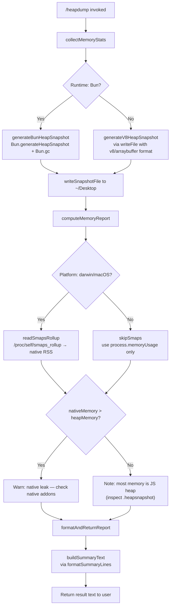

# `/heapdump`

> Analysis basis: CC v2.1.185 bundle.js (AST extraction + Claude interpretation)
> Minimum version: v2.1.185

---

## Overview

`/heapdump` is a hidden diagnostic command that captures a full JavaScript heap snapshot and writes it to `~/Desktop`, alongside a structured memory-statistics report. It is intended for developers investigating memory leaks in the Claude Code process and is hidden from the normal command listing. The command is non-interactive and may be invoked without a TTY.

---

## Registration

| Field | Value |
|---|---|
| type | `local` |
| name | `heapdump` |
| description | `Dump the JS heap to ~/Desktop` |
| supportsNonInteractive | `true` |
| isHidden | `true` |
| module_id | `dwl` |
| load_inline | `true` |
| loc_byte | `12865946` |
| loc_byte_end | `12866374` |
| loc_line | `8542` |
| arbor_handler.name | `Ilf` |
| arbor_handler.fqn | `claude-2.1.185::Ilf` |
| arbor_handler.kind | `AsyncFunction` |
| arbor_handler.resolution_path | `module_id` |
| arbor_handler.n_hits | `0` |

Analysis basis: CC v2.1.185 bundle.js:+12865946

---

## Input Branching

The command has four distinct execution paths based on runtime environment detection and the ratio of native memory to heap memory. A Mermaid flowchart is used.



Analysis basis: CC v2.1.185 bundle.js:+12864016, +12862595, +12863021, +12861748

---

## Behavioral Spec

### Top-Level Handler (`heapDumpCommandHandler`)

The main handler (`Ilf`) is an `AsyncFunction` resolved via `module_id` path.

```
async function heapDumpCommandHandler(context):
    statsReport = await collectMemoryAndWrite()
    summaryLines = formatSummaryLines(statsReport)
    summaryLines.push(
        "Open the .heapsnapshot in Chrome DevTools → Memory → Load to inspect retainers."
    )
    return summaryLines.join(newline)
```

Analysis basis: CC v2.1.185 bundle.js:+12864815, +12864934, +12864961, +12865083

---

### Heap Snapshot Writer (`writeHeapSnapshot`)

Determines the JS runtime (Bun vs. Node/V8) and writes the `.heapsnapshot` file accordingly.

```
function writeHeapSnapshot(outputPath):
    if runtime is Bun:
        snapshot = Bun.generateHeapSnapshot("v8", "arraybuffer")
        Bun.gc(true)                          // force GC after snapshot
        writeFileSync(outputPath, snapshot)
    else:
        // V8 path — writeFile with mode 0o600 (octal 384)
        writeFile(outputPath, v8HeapData, { mode: 384 })
```

Analysis basis: CC v2.1.185 bundle.js:+12864495, +12864515, +12864572, +12864540, +12864545, +12863960

---

### Memory Statistics Collector (`collectMemoryStats`)

Gathers all available memory metrics from the Node/Bun process APIs, then reads Linux `/proc` files when available.

```
async function collectMemoryStats():
    mem     = process.memoryUsage()
    heap    = v8.getHeapStatistics()
    res     = process.resourceUsage()
    up      = process.uptime()
    spaces  = v8.getHeapSpaceStatistics()
    handles = process._getActiveHandles().length
    requests= process._getActiveRequests().length

    // Linux-only supplementary data
    try:
        fds  = readdir("/proc/self/fd").length
    catch:
        fds  = null

    try:
        smaps = readFile("/proc/self/smaps_rollup", "utf8")
        // parse native RSS from smaps
    catch:
        smaps = null

    // Load bun:jsc module if available for JSC-specific stats
    try:
        jsc = require("bun:jsc")
    catch:
        jsc = null

    // Compute ratio: native memory vs heap
    // Threshold constants: 3600 and 1048576
    nativeRatio = (rss - heapUsed) / 1048576   // in MB
    if nativeRatio > threshold:
        warning = "Native memory > heap - leak may be in native addons (node-pty, sharp, etc.)"

    return { mem, heap, res, up, spaces, handles, requests, fds, smaps, warning }
```

Analysis basis: CC v2.1.185 bundle.js:+12860978, +12861002, +12861028, +12861054, +12861079, +12861121, +12861158, +12861209, +12861271, +12861310, +12861369, +12861510, +12861515, +12861748

---

### Desktop Path Resolver (`resolveDesktopPath`)

Determines the correct `~/Desktop` path, with special handling for WSL environments.

```
function resolveDesktopPath():
    home = os.homedir()
    desktopPath = path.join(home, "Desktop")

    // WSL detection: check if path starts with /mnt/c/Users
    if home.startsWith("/mnt/c/Users"):
        // Skip Public, Default, Default User, All Users profiles
        // Attempt to use Windows user's Desktop instead
        windowsDesktop = path.join("/mnt/c/Users", windowsUser, "Desktop")
        return windowsDesktop
    else:
        return desktopPath
```

Analysis basis: CC v2.1.185 bundle.js:+1101765, +1101801, +1101811, +1102033, +1102077, +1102096, +1102116, +1102141

---

### Summary Formatter (`formatSummaryLines`)

Builds the human-readable text report returned to the user, including a memory-origin determination.

```
function formatSummaryLines(stats):
    lines = []

    // Determine primary memory origin
    if heapMemoryDominant:
        lines.push("— most memory is JS heap (inspect the .heapsnapshot)")
    else:
        lines.push("— most memory is native (NOT in the .heapsnapshot)")

    // Append leak indicators if any
    if noLeakIndicators:
        lines.push("  (no obvious leak indicators)")
    else:
        // append specific warning strings

    // Table: heap spaces, padded with two spaces per column
    for space in heapSpaces:
        lines.push(formatSpaceLine(space))

    // Maximum column width computed via Math.max
    maxColWidth = Math.max(...columnWidths)

    return lines
```

Analysis basis: CC v2.1.185 bundle.js:+12865190, +12865258, +12865318, +12865455, +12865502, +12865590

---

### Main Orchestrator (`heapDumpOrchestrator`)

Coordinates snapshot writing, memory collection, telemetry emission, and file logging.

```
async function heapDumpOrchestrator():
    emit telemetry("tengu_heap_dump")

    desktopDir = resolveDesktopPath()
    timestamp  = currentTimestamp()
    snapshotFilename = path.join(desktopDir, "claude-" + timestamp + ".heapsnapshot")

    // Write heap snapshot (Bun or V8 branch)
    writeHeapSnapshot(snapshotFilename)

    // Collect stats (may read /proc on Linux)
    stats = await collectMemoryStats()

    // Log to file via the structured logger
    logToFile(stats)

    // Handle errors — convert to string via errorToString, log via logError
    try:
        ...
    catch err:
        errorMessage = errorToString(err)
        logError(errorMessage)

    // Return formatted report
    return formatReport(stats, snapshotFilename)
```

Analysis basis: CC v2.1.185 bundle.js:+12863453, +12863464, +12863477, +12863490, +12863536, +12863578, +12863773, +12863785, +12863882, +12863925, +12863941, +12864016, +12864065, +12864067, +12864236, +12864245, +12864323

---

### macOS Memory Check (`macOSMemoryCheck`)

On macOS (`darwin`), the command uses `smaps_rollup` data and a 1 024-unit divisor to compute native memory in macOS-compatible units.

```
function macOSMemoryCheck(stats):
    if platform == "darwin":
        nativeMB = stats.rss / 1024
        // Compare with heap figures, emit "macos"-tagged path
        return { platform: "macos", nativeMB }
    else:
        return { platform: "other" }
```

Analysis basis: CC v2.1.185 bundle.js:+12862595, +12862602, +12862612

---

### Leak Indicator Check

After computing memory ratios, the command evaluates a threshold constant and produces a diagnostic label.

```
function checkLeakIndicators(nativeRatio, heapRatio):
    // Threshold: 100 percentage points difference (bundle constant)
    if nativeRatio - heapRatio > 100:
        return "Native memory > heap - leak may be in native addons (node-pty, sharp, etc.)"
    else:
        return "No obvious leak indicators. Check heap snapshot for retained objects."
```

Analysis basis: CC v2.1.185 bundle.js:+12861662, +12861748, +12862867

---

### Auto-GC Size Guard (`autoGCSizeGuard`)

A size guard labeled `"auto-1.5GB"` is present, suggesting a threshold (1 073 741 824 bytes = 1 GiB) beyond which the command may trigger GC automatically before dumping.

```
function autoGCSizeGuard(heapUsed):
    GC_THRESHOLD = 1073741824   // 1 GiB
    if heapUsed > GC_THRESHOLD:
        forceGarbageCollection()
    // label: "auto-1.5GB"
```

Analysis basis: CC v2.1.185 bundle.js:+12864133, +12865864

---

## State & Side Effects

| Item | Detail |
|---|---|
| Telemetry | `tengu_heap_dump` (emitted once per invocation, bundle.js:+12864067) |
| Telemetry (background protocol, reached transitively) | `tengu_bg_proto_mismatch`, `tengu_bg_dispatch_stale_drop`, `tengu_bg_attach_legacy_autorespawn`, `tengu_bg_attach`, `tengu_bg_attach_stall_gave_up`, `tengu_bg_attach_stall_respawn`, `tengu_bg_attach_kick` |
| File written — heap snapshot | `~/Desktop/claude-<timestamp>.heapsnapshot` (mode `0o600`, 384 decimal) |
| File written — memory report | Written via `Hmt.writeFile` to Desktop directory |
| GC side effect | `Bun.gc(true)` called after Bun snapshot; optional pre-dump GC when heap > 1 GiB |
| `/proc` reads (Linux only) | `/proc/self/fd` (fd count), `/proc/self/smaps_rollup` (native RSS) |
| Module loaded | `bun:jsc` (optional, for JSC heap statistics) |
| Active handles/requests | `process._getActiveHandles()`, `process._getActiveRequests()` queried |
| Error logging | Errors serialised via `errorToString` and forwarded to `QJ.logError` |
| appState changes | None observed in depth-2 traversal |
| Sound | None observed |
| Hook registration | None observed |

---

## Version History

| Version | Change |
|---|---|
| v2.1.185 | Initial analysis |

---

## Common Mistakes

1. **Running outside a desktop environment** — the command writes to `~/Desktop`. On headless servers or CI systems this directory may not exist, causing a write failure.
2. **Expecting output in the working directory** — the snapshot always targets `~/Desktop`, not the current project directory. Use the reported path printed by the command.
3. **Forgetting the command is hidden** — `/heapdump` does not appear in `/help` output. Users must type it explicitly.
4. **Opening the snapshot in the wrong tool** — the file is a V8/Bun `.heapsnapshot`. It must be loaded in Chrome DevTools → Memory → Load profile, not in a text editor (the command itself reminds the user of this).
5. **Interpreting the "native leak" warning incorrectly** — the warning `"Native memory > heap"` is heuristic. It flags `node-pty`, `sharp`, or other native addons as _possible_ sources, not confirmed leaks.
6. **WSL users missing the file** — on WSL the command rewrites the Desktop path to the Windows user profile under `/mnt/c/Users`. If the Windows username contains spaces or the profile is non-standard (`Default`, `Public`, `All Users`), path resolution may silently fall back.

---

## Appendix — Identifier Mapping

> For bundle debugging only. Identifiers change across versions.

| Identifier | Role |
|---|---|
| `Ilf` | Top-level heap-dump command handler (`AsyncFunction`; Arbor handler) |
| `HCo` | Main heap-dump orchestrator (coordinates snapshot + stats + output) |
| `cwl` | Memory statistics collector (calls process/v8/proc APIs) |
| `Lt` | File-path utility (used for Desktop path construction and logging) |
| `gx` | Low-level path helper called by `Lt` |
| `H` | Structured file logger / write helper |
| `I4e` | TeammateMailbox message-read helper (reached transitively) |
| `g` | Subprocess / stream buffer manager (reached transitively via `H`) |
| `h` | Stream reader with timeout (reached transitively) |
| `m` | Process/worker map manager (reached transitively) |
| `Qp` | Stream-end / promise resolver (reached transitively) |
| `T6f` | Background daemon protocol handler (reached transitively) |
| `Ee` | String coercion utility |
| `T` | Log-message formatter / level dispatcher |
| `QHc` | Log transport / sink selector |
| `j2o` | Log sink initialiser |
| `e` | Random-delay / retry helper (reached transitively) |
| `Pe` | JSON stringify wrapper |
| `t` | Generic string/token argument (context-dependent) |
| `Kc` | Log-line formatter (truncates / redacts sensitive fields) |
| `g9o` | Log-level map builder |
| `r` | Module-level variable: file system abstraction or path array |
| `n` | Module-level variable: lowercase string transformer or array |
| `Hqe` | Terminal write helper |
| `s9o` | Raw stream write wrapper |
| `n_c` | Append-log writer (mkdir + appendFile + rotation) |
| `YWe` | Batch-join log flusher with debounce |
| `rpe` | Log-rotation helper (stat + rename + unlink) |
| `jt` | Timestamp / date formatter |
| `Pre` | Directory-name resolver |
| `y9o` | Log-file path builder |
| `csr` | Log-file rotation checker (stat + endsWith + rename) |
| `t_c` | Log-file append-and-rotate executor |
| `qi` | Signal / event bus registration helper |
| `o` | Column-padding / table formatter |
| `s` | Promise-set tracker with finally cleanup |
| `i` | File-handle pair closer |
| `rQo` | Desktop path resolver (homedir + WSL detection) |
| `Tlf` | Bun-specific heap snapshot writer (`Bun.generateHeapSnapshot` + `Bun.gc`) |
| `j` | Generic counter or index variable |
| `Ho` | Error-to-string converter (`Error` + `String`) |
| `Gp` | Error metadata extractor / formatter |
| `De` | Structured error logger (uses `Ho`, `st`, `ra`, `Bzc`, `hKe`, `QJ`) |
| `st` | String coercion shim |
| `ra` | Error-record builder |
| `eJo` | Error-record serialiser |
| `Bzc` | Bounded error-history queue (shift + push) |
| `Clf` | Summary-line formatter / column-width calculator (`Math.max`) |
| `_mt` | Column-width lookup table or pad helper used by `Clf` |