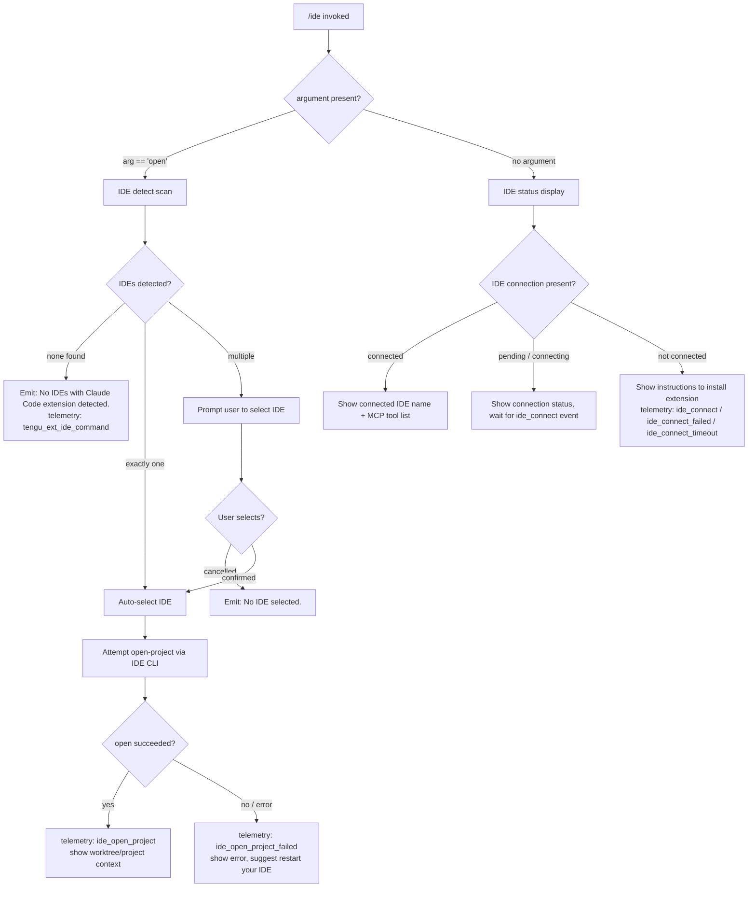

# `/ide`

> Analysis basis: CC v2.1.185 bundle.js (AST extraction + Claude interpretation)
> Minimum version: v2.1.185

---

## Overview

The `/ide` command manages IDE integrations for Claude Code, allowing users to detect connected IDEs, open projects in a detected IDE, and establish or monitor the IDE extension connection. It operates as an async command that scans for running IDE processes, prompts for selection when multiple candidates are found, and orchestrates the MCP-based IDE extension channel (`sse-ide` / `ws-ide`).

---

## Registration

| Field | Value |
|---|---|
| type | `local-jsx` |
| name | `ide` |
| description | `Manage IDE integrations and show status` |
| argumentHint | `[open]` |
| module_id | `odl` |
| load_inline | `true` |
| loc_byte | `11820762` |
| loc_byte_end | `11820918` |
| loc_line | `7146` |
| arbor_handler.name | `e7p` |
| arbor_handler.fqn | `claude-2.1.185::e7p` |
| arbor_handler.kind | `AsyncFunction` |
| arbor_handler.resolution_path | `module_id` |
| arbor_handler.n_hits | `0` |

Analysis basis: CC v2.1.185 bundle.js:+11820762

---

## Input Branching

The command has four distinct branches based on argument and IDE detection state:



Analysis basis: CC v2.1.185 bundle.js:+11816877 (handler entry `e7p`), +11816985 (`"open"` literal), +11817094 (no-IDE message literal)

---

## Behavioral Spec

### 1. Entry Point — `ideCommandHandler` (bundle: `e7p`)

```
async function ideCommandHandler(args, context):
    emit telemetry("tengu_ext_ide_command", ...)       // bundle.js:+11816879

    subcommand = args[0] ?? null

    if subcommand == "open":
        return openProjectInIDE(context)
    else:
        return showIDEStatus(context)
```

Analysis basis: CC v2.1.185 bundle.js:+11816877

---

### 2. IDE Detection — `detectRunningIDEs` (bundle: `_xn`)

Scans the host OS for running IDE processes that have the Claude Code extension installed.

```
async function detectRunningIDEs():
    platform = detectPlatform()           // parseInt, Ar, xV

    if platform == "linux":
        // Run shell command via sh -c:
        // "ps aux | grep -E 'code|cursor|windsurf|...' | grep -v grep"
        // bundle.js:+6665444
        rawLines = shellExec(PS_AUX_GREP_COMMAND)
    else:
        // macOS: query running application list via Hxn
        // Collects IDE install paths via D3d (homedir scan)
        rawLines = macOSRunningApps()

    candidates = []
    for each line in rawLines:
        normalizedName = normalizeName(line)   // toLowerCase, replace
        ideKind = classifyIDEName(normalizedName, IDE_NAME_MAP)
        if ideKind != null:
            candidates.push({ kind: ideKind, path: resolvedPath })

    // Deduplicate, resolve realpaths
    return uniqueByRealpath(candidates)
```

Known IDE name tokens checked (bundle literals):
- `"windsurf"` (+6663544), `"devin"` (+6663568), `"cursor"` (+6663608)
- `"insiders"` (+6663648), `"vscode"` (+6663673), `"vs code"` (+6663695)
- `"visual studio code"` (+6663718), `"vscodium"` (+6663752), `"code - oss"` (+6663776)
- `"codium"` (+6663995), `"jetbrains"` (+6656859), `"appcode"` (+6665832)
- `"Devin Desktop"` (+6663864)

Platform string `"linux"` (+6665418); `"wsl"` (+6658523); WSL path prefix `/mnt/c/Users` (+6658685).

Analysis basis: CC v2.1.185 bundle.js:+6660679 (`_xn` entry), +6665444 (ps-aux command literal)

Telemetry fired on success: `"ide_detect"` (+6662034); on failure: `"ide_detect_failed"` (+6662098).

---

### 3. IDE Name Normalisation — `resolveIDELabel` (bundle: `RL`)

```
function resolveIDELabel(rawPath):
    lower = rawPath.toLowerCase()
    baseName = path.basename(rawPath)     // IP.basename at +6666396
    // Strip .cmd suffix on Windows       // ".cmd" literal at +6664127
    // Return human label: e.g. "IDE" for generic, specific brand otherwise
    return humanLabel
```

Falls back to `"IDE"` (+6666283) when brand cannot be determined.

Analysis basis: CC v2.1.185 bundle.js:+6666338

---

### 4. Open Project Sub-command — (called from `ideCommandHandler` when arg is `"open"`)

```
async function openProjectInIDE(context):
    detectedIDEs = await detectRunningIDEs()

    if detectedIDEs.length == 0:
        print("No IDEs with Claude Code extension detected.")  // +11817094
        return

    if detectedIDEs.length == 1:
        selectedIDE = detectedIDEs[0]
    else:
        selectedIDE = await promptUserSelection(detectedIDEs)
        if selectedIDE == null:
            print("No IDE selected.")    // +11817232
            return

    projectPath = resolveWorktreeOrProjectPath(context)   // "worktree" +11817464, "project" +11817475

    try:
        emit telemetry("ide_open_project", { type: worktreeOrProject })  // +11817430
        await invokeIDECLI(selectedIDE, projectPath)
    catch error:
        emit telemetry("ide_open_project_failed", ...)   // +11817537
        print(error message)
        print("restart your IDE")   // hint literal +11818096
```

Analysis basis: CC v2.1.185 bundle.js:+11817287 (`yxn` path resolution), +11817427 (`ke`/telemetry call), +11817515 (`Re` error path)

---

### 5. IDE Status / Connection Display — `ideStatusComponent` (bundle: `rdl`)

This is a JSX React component rendered when no sub-command is given.

```
function IDEStatusComponent(props):
    [connectionState, setConnectionState] = useState()    // +11818764
    appState = useAppState()                              // ft/So at +11818784/+11818835
    ref = useRef()                                        // +11818842

    useEffect(() => {
        // Subscribe to IDE MCP connection events
        // Channels: "sse-ide" (+11814864), "ws-ide" (+11814884)
        // Filter tools prefixed "mcp__ide__" (+11819571)

        if connectionState == "pending":
            startConnectionTimer()
        if connectionState == "connected":
            emit telemetry("ide_connect", ...)            // +11818981
        if connectionState == "failed":
            emit telemetry("ide_connect_failed", ...)     // +11819068
        if connectionState == "timeout":
            emit telemetry("ide_connect_timeout", ...)    // +11819175
    }, [deps])

    useCallback(() => {
        // Handle disconnect
        emit telemetry("ide_disconnect", ...)             // +11819674
    })

    if connectionState == "connected":
        render connected IDE name + list of mcp__ide__ tools
    else if connectionState == "pending":
        render "Connecting to ..."    // +11820011
    else:
        render error: "Error connecting to IDE."  // +11819293
        render installation instructions
```

Analysis basis: CC v2.1.185 bundle.js:+11818764, +11818856, +11819137

---

### 6. IDE Process List Formatting — `formatIDEProcessList` (bundle: `dEo`)

Used when rendering multiple IDE candidates for the user selection prompt.

```
function formatIDEProcessList(processList, maxDisplay):
    // maxDisplay default derived from literal 100 at +11820220
    // Normalise strings to NFC (+11820361 "NFC" literal, n.normalize call)
    // Math.floor used for truncation (+11820324)
    // Separator ", " (+11820518); overflow indicator ", …" (+11820532)
    // Slice to limit: processList.slice(0, maxDisplay)

    lines = processList
        .map(entry => normalizeName(entry))
        .slice(0, maxDisplay)

    if processList.length > maxDisplay:
        return lines.join(", ") + ", …"
    else:
        return lines.join(", ")
```

Analysis basis: CC v2.1.185 bundle.js:+11820256 (`dEo` entry), +11820324, +11820361, +11820518, +11820532

---

### 7. IDE Extension Socket Authentication — `socketAuthenticator` (bundle: `NNo`)

Handles the MCP daemon connection used by the IDE extension.

```
async function socketAuthenticator(socketPath, claimToken):
    // Connect via Unix socket: xZn.connect  (+17251703)
    // Build claim frame: zq.buildClaimFrame (+17251861)
    // Send auth frame: FM (Buffer encoding) (+17251777)
    // On socket error: emit telemetry("tengu_bg_sendclaim_failed") (+17251556)
    // Retry logic via f6f with 5000ms timeout (+17251990)
    //   - Error code "ECONNREFUSED" (+17252138)
    //   - Error label "send-claim timeout" (+17252046)
    // Install event listeners: i.on, i.once (+17251726, +17251747)
    // Write claim: i.write (+17251769)
    // End connection: i.end (+17251807)
```

Analysis basis: CC v2.1.185 bundle.js:+11251355 (`NNo` entry via `zq.claim`), +17251703

---

## State & Side Effects

| Item | Detail |
|---|---|
| Telemetry: `tengu_ext_ide_command` | Fired on every `/ide` invocation (bundle.js:+11816879) |
| Telemetry: `ide_detect` | Fired when IDE detection completes successfully (bundle.js:+6662034) |
| Telemetry: `ide_detect_failed` | Fired when IDE detection throws (bundle.js:+6662098) |
| Telemetry: `ide_open_project` | Fired when project open is attempted; carries `worktree`/`project` context (bundle.js:+11817430) |
| Telemetry: `ide_open_project_failed` | Fired on CLI invocation failure (bundle.js:+11817537) |
| Telemetry: `ide_connect` | Fired when IDE MCP channel reaches connected state (bundle.js:+11818981) |
| Telemetry: `ide_connect_failed` | Fired on connection error (bundle.js:+11819068) |
| Telemetry: `ide_connect_timeout` | Fired when connection times out (bundle.js:+11819175) |
| Telemetry: `ide_disconnect` | Fired when IDE MCP channel disconnects (bundle.js:+11819674) |
| Telemetry: `tengu_bg_sendclaim_failed` | Fired when daemon socket claim fails (bundle.js:+17251556) |
| Telemetry: `tengu_feature_ok` / `tengu_feature_bad` / `tengu_feature_sad` | Feature gate reporting (bundle.js:+1021887, +1021954, +1022035) |
| MCP channel registration | Registers `sse-ide` (SSE transport) and `ws-ide` (WebSocket transport) channels for IDE extension tools (literals +11814864, +11814884) |
| Tool prefix filtering | Tools with prefix `mcp__ide__` (+11819571) are filtered and displayed in status view |
| appState changes | IDE connection state is written to appState via `useSetAppState` (accessed through `ft`/`So` context hooks at +11818784) |
| Socket I/O | Unix socket connection to daemon for IDE extension auth claim (xZn.connect at +17251703); 5000 ms send-claim timeout (+17251990) |
| Process scanning | Spawns `sh -c` with ps-aux grep command on Linux (+6665444); uses OS API on macOS via home-directory scan |
| Sound | None observed in depth-2 traversal |

---

## Version History

| Version | Change |
|---|---|
| v2.1.185 | Initial analysis — `open` sub-command, IDE detection across Linux/macOS/WSL, `sse-ide`/`ws-ide` dual-transport MCP channel, JSX status component |

---

## Common Mistakes

1. **Running `/ide open` without an IDE that has the Claude Code extension installed** — the command will report "No IDEs with Claude Code extension detected." even if an IDE process is running, because detection checks for the extension presence, not just the process name.
2. **Expecting `/ide` (no argument) to open a project** — the bare `/ide` command shows connection status only; use `/ide open` to open the current project in a detected IDE.
3. **IDE selection cancelled mid-flow** — if the user dismisses the IDE selection prompt when multiple IDEs are detected, the command silently exits with "No IDE selected." and no project is opened.
4. **WSL path confusion** — on WSL, the IDE scanner expects paths under `/mnt/c/Users` (+6658685); IDEs installed only in the Windows host but not WSL-accessible may not be detected.
5. **Stale MCP connection shown as connected** — the `ide_disconnect` telemetry fires on channel teardown, but the UI state may lag; re-running `/ide` after an IDE restart is recommended.
6. **`.cmd` suffix not stripped on non-Windows hosts** — the label resolver strips `.cmd` (+6664127) for Windows IDE launcher scripts; on Linux/macOS this suffix would produce an unexpected display label if a symlink with that suffix is present.

---

## Appendix — Identifier Mapping

> For bundle debugging only. Identifiers change across versions.

| Identifier | Role |
|---|---|
| `e7p` | Main async handler for `/ide` command (`ideCommandHandler`) |
| `dEo` | IDE process list formatting / truncation helper |
| `_xn` | IDE detection scan (platform-aware, calls `D3d`/`Hxn`) |
| `D3d` | macOS IDE install path discovery (home-directory scan) |
| `Hxn` | macOS running-app enumeration and lock-file check |
| `x3d` | Per-IDE candidate resolution wrapper |
| `Vvr` | IDE entry normalisation / version parsing |
| `nea` | IDE name classification (lowercase + includes check) |
| `yxn` | Worktree/project path resolver for `open` sub-command |
| `RL` | IDE human label resolver (basename + brand mapping) |
| `$3d` | IDE CLI invocation builder (OS × brand matrix) |
| `tzr` | Wrapper dispatching to `$3d` for open-project call |
| `rea` | String replacement helper for IDE display name |
| `QZi` | Process kill helper (`process.kill`) |
| `rdl` | JSX React component for IDE status display |
| `e7p` → `Oee` | IDE extension installation-instructions renderer |
| `zzp` | IDE tool list filtering helper (mcp__ide__ prefix) |
| `ft` | App-state hook accessor (`BBr` / `useSyncExternalStore`) |
| `So` | Secondary app-state hook (`BBr`) |
| `Rd` | Theme/context hook (`sAe.useContext`, `useSyncExternalStore`) |
| `fw` | MCP server lifecycle helper (wraps `hot`, `Uk`) |
| `hot` | MCP tool hash/config builder (`Vwe`) |
| `Vwe` | MCP tool descriptor hasher (`IQi.createHash`, sha256) |
| `Uk` | MCP skills telemetry hook (`ct`) |
| `NNo` | IDE extension socket authenticator (daemon claim) |
| `f6f` | Send-claim retry loop with 5000 ms timeout |
| `m6f` | Raw socket connection helper (`xZn.connect`) |
| `p6f` | Claim-frame builder (`zq.buildClaimFrame`) |
| `FM` | Binary frame encoder (`Buffer.allocUnsafe`, `writeUInt32BE`) |
| `dEo` | IDE candidate list display formatter |
| `Mt` | Store accessor / state getter |
| `Qen` | State store reader (`Jen.getStore`) |
| `Ar` | Utility called from `Mt` (wraps `gx`) |
| `Un` | Composite state reader (calls `qr`, `Mt`) |
| `qr` | Low-level state query |
| `iA` | Argument pre-processor for handler |
| `gLi` | Regex match helper for IDE detection |
| `Di` | String slice/index helper |
| `Pt` | Feature-gate result emitter (`j`, `Ue`) |
| `Ho` | Error/String coercion helper |
| `xht` | Transport config key reader (`pcc`) |
| `pcc` | Object.keys-based config enumerator |
| `_` | Multi-IDE connection orchestrator (`GF`, `vP`, `Promise.all`) |

---

Note: index built via Arbor fallback; some signals (telemetry, literals) may be missing — see arbor-fallback.js.