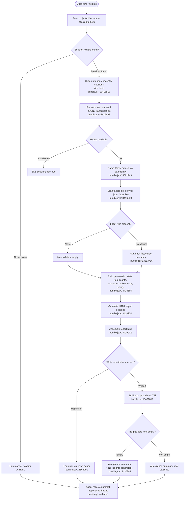

# `/insights`

> Analysis basis: CC v2.1.185 bundle.js (AST extraction + Claude interpretation)
> Minimum version: v2.1.185

---

## Overview

The `/insights` command generates a shareable HTML usage-analytics report from the user's accumulated Claude Code session data. It reads local session logs and facet files, aggregates statistics across multiple dimensions (tools, timings, token usage, error rates, etc.), writes a self-contained `report.html` to disk, and instructs the agent to respond with a fixed confirmation message containing the report URL and a follow-up prompt.

---

## Registration

| Field | Value |
|---|---|
| type | `prompt` |
| name | `insights` |
| description | `Generate a report analyzing your Claude Code sessions` |
| loc_byte | `13429813` |
| loc_byte_end | `13431117` |
| loc_line | `9828` |
| handler_method | `getPromptForCommand` |
| handler_method_start | `13429987` |
| handler_method_end | `13431116` |
| prompt_body.length | `513` characters |
| prompt_body.trace | `call→TPl(...) (1 literals)` |
| arbor_handler.name | `getPromptForCommand` |
| arbor_handler.fqn | `claude-2.1.185::getPromptForCommand` |
| arbor_handler.kind | `Method` |
| arbor_handler.resolution_path | `direct` |
| arbor_handler.n_hits | `1` |

Analysis basis: CC v2.1.185 bundle.js:+13429813

---

## Input Branching

The command has several distinct paths depending on whether existing session data is found, whether facets can be read and processed, whether the HTML output file can be written, and whether any insight data was generated at all. A Mermaid flowchart is used because there are more than three meaningful branches.



---

## Behavioral Spec

### 1. Handler Dispatch — `getPromptForCommand`

The registered handler method is `getPromptForCommand`, resolved directly within the registration byte range (Arbor resolution path: `direct`).

Analysis basis: CC v2.1.185 bundle.js:+13429987

```
async function getPromptForCommand(commandArgs):
    sessionData    = await collectSessionData()
    facetData      = await collectFacetFiles()
    statsBundle    = await buildStatsBundle(sessionData, facetData)
    htmlContent    = await generateHTMLReport(statsBundle)
    reportPath     = await writeReportFile(htmlContent)
    promptText     = buildPromptText(statsBundle, reportPath)
    return { prompt: promptText }
```

### 2. Session Discovery — `collectSessionData` (maps to `bPl`)

Enumerates the local `projects` directory (literal `"projects"` at bundle.js:+5216933), reads subdirectories, and selects the most-recent sessions up to a configured slice limit.

Analysis basis: CC v2.1.185 bundle.js:+13430086

```
async function collectSessionData():
    projectsDir = path.join(dataRoot, "projects")   // "projects" literal +5216933
    allDirs     = await fs.readdir(projectsDir)
    sessionDirs = allDirs.filter(entry => entry.isDirectory())
    sessionDirs = sessionDirs.sort()                // chronological order +13416676
    // Slice limit seen in call graph at +13416818; yields recent N sessions
    recent      = sessionDirs.slice(-RECENT_LIMIT)
    results     = await Promise.all(recent.map(dir => loadSession(dir)))
    return results
```

### 3. Session File Loading — `loadSession` (maps to `egf`)

For each session directory, constructs the path to the session metadata (`session-meta`) and usage-data (`usage-data`) sub-paths, reads JSONL files encoded as UTF-8 (`"utf-8"` literal at bundle.js:+13361728), and parses each line via a JSON parser.

Analysis basis: CC v2.1.185 bundle.js:+13416898

```
async function loadSession(sessionDir):
    usagePath   = buildPath(sessionDir, "usage-data")   // literal +13355579
    metaPath    = buildPath(sessionDir, "session-meta")  // literal +13355675
    raw         = await fs.readFile(usagePath, "utf-8")
    parsed      = parseJsonlLines(raw)                   // via Gt→JSON.parse +192069
    return { dir: sessionDir, entries: parsed }
```

### 4. Facet File Discovery — `collectFacetFiles` (maps to `Qmt`)

Reads the `facets` subdirectory (literal `"facets"` at bundle.js:+13355629), filters for `.jsonl` files (literal `".jsonl"` at bundle.js:+13513563), stat-checks each for size and modification time, and returns a structured map of facet metadata.

Analysis basis: CC v2.1.185 bundle.js:+13416530

```
async function collectFacetFiles():
    facetsDir = buildPath(dataRoot, "facets")    // "facets" literal +13355629
    entries   = await fs.readdir(facetsDir)
    jsonlFiles = entries.filter(e => e.isFile() && isJsonlFile(e))
    // isJsonlFile checks extension ".jsonl" +13513563
    metadata  = await Promise.all(
        jsonlFiles.map(async f => {
            stat = await fs.stat(path.join(facetsDir, f))
            return { name: basename(f), size: stat.size, mtime: stat.mtime }
        })
    )
    return buildFacetMap(metadata)
```

### 5. Statistics Aggregation — `buildStatsBundle` (maps to `SPl`)

Iterates over all parsed session entries, accumulates tool-use counts, error tallies, token totals, response-time buckets, and time-of-day distributions. Numeric limits observed in the call graph:

- Session slice recent limit: between 50 and 200 sessions (literals at bundle.js:+13416764 and +13416769)
- Maximum facet data age threshold: 1 800 000 ms (30 minutes) (bundle.js:+13364152)
- Quantile and distribution math via `Math.floor`, `Math.round`, `Math.round` (bundle.js:+13367517, +13367696)

Analysis basis: CC v2.1.185 bundle.js:+13418665

```
function buildStatsBundle(sessionData, facetData):
    toolCounts   = {}
    errorCounts  = {}
    timeBuckets  = { morning: 0, afternoon: 0, evening: 0, night: 0 }
    responseTimes = { "2-10s": 0, "10-30s": 0, "30s-1m": 0, ... }

    for entry in allEntries(sessionData):
        recordToolUse(entry, toolCounts)
        recordErrors(entry, errorCounts)
        recordTimeBucket(entry.timestamp, timeBuckets)
        recordResponseTime(entry.duration, responseTimes)

    return {
        toolCounts,
        errorCounts,
        timeBuckets,
        responseTimes,
        facetSummary: summariseFacets(facetData)
    }
```

Time-of-day bucket boundaries (literals in `ugf` / HTML generation):

| Bucket | Hours |
|---|---|
| Morning (6–12) | 7, 11 (bundle.js:+13373789, +13373798) |
| Afternoon (12–18) | 13, 14, 16, 17 (bundle.js:+13373840–+13373852) |
| Evening (18–24) | 18, 19, 21, 22, 23 (bundle.js:+13373889–+13373904) |
| Night (0–6) | remainder (bundle.js:+13373916) |

Response-time buckets (literals at bundle.js:+13372915–+13372975):
`2-10s`, `10-30s`, `30s-1m`, `1-2m`, `2-5m`, `5-15m`, `>15m`

### 6. HTML Report Generation — `generateHTMLReport` (maps to `ugf` and subordinates)

Builds a self-contained HTML document containing multiple analytics sections. Each section is generated from the stats bundle and serialised to HTML strings. Key sub-functions:

- `buildChartSection` (maps to `U_e`): constructs per-tool bar charts using hex colour constants (`"#2563eb"` +13410580, `"#0891b2"` +13410718, `"#10b981"` +13410890, `"#8b5cf6"` +13411033, `"#dc2626"` +13414296, `"#16a34a"` +13414545, `"#eab308"` +13415038).
- `buildResponseTimeSection` (maps to `agf`): computes max value and renders response-time distribution.
- `buildTimeOfDaySection` (maps to `lgf`): renders time-of-day activity chart.
- `escapeHtml` (maps to `yp`/`Np`): sanitises strings using HTML entity replacements (`&amp;`, `&lt;`, `&gt;`, `&quot;`, `&apos;` at bundle.js:+5254668–+5254791).
- `formatMarkdown` (maps to `cgf`): converts simple markdown bold (`**text**` → `<strong>$1</strong>`, literal at bundle.js:+13374621), bullet characters (`• ` at +13374664), and line breaks (`<br>` at +13374694).
- Empty-state placeholders: `"<p class=\"empty\">No data</p>"` (+13372406), `"<p class=\"empty\">No response time data</p>"` (+13372863), `"<p class=\"empty\">No tool errors</p>"` (+13414307), `"<p class=\"empty\">No time data</p>"` (+13373713).

HTML content size limit: 8192 characters per section (bundle.js:+13372084).

Analysis basis: CC v2.1.185 bundle.js:+13418724

```
function generateHTMLReport(statsBundle):
    sections = []
    sections.append(buildChartSection(statsBundle.toolCounts))
    sections.append(buildResponseTimeSection(statsBundle.responseTimes))
    sections.append(buildTimeOfDaySection(statsBundle.timeBuckets))
    sections.append(buildErrorSection(statsBundle.errorCounts))
    html = assembleDocument(sections)   // produces report.html +13419002
    return html
```

### 7. Report File Writing — `writeReportFile` (maps to `tgf`, `Zhf`)

Creates the output directory if absent (via `fs.mkdir`), then writes the assembled HTML to `report.html` (literal at bundle.js:+13419002). The output filename is stamped with a datetime string built from `Date` components (year, month, date, hours, minutes, seconds) observed at bundle.js:+13418834–+13418932. The facets sub-directory path is derived from the `"facets"` literal (+13355629). Buffer size for JSON serialisation: 384 bytes (bundle.js:+13362377).

Analysis basis: CC v2.1.185 bundle.js:+13418743

```
async function writeReportFile(html):
    timestamp = formatDateTime(new Date())   // components +13418834–13418932
    outputDir = path.join(dataRoot, "insights", timestamp)  // "insights" literal +13363501
    await fs.mkdir(outputDir, { recursive: true })
    outputPath = path.join(outputDir, "report.html")         // "report.html" +13419002
    await fs.writeFile(outputPath, html)
    return outputPath
```

### 8. Prompt Construction — `buildPromptText` (maps to `TPl` via `__handler_insights`)

Constructs the 513-character prompt sent to the agent (bundle.js:+13431019). The prompt body:

1. States the context: the user ran `/insights` to generate a usage report.
2. Embeds the full insights data payload.
3. Provides the report URL, HTML file path, and facets directory path.
4. Includes an at-a-glance summary for the agent's context only (user has not yet seen output).
5. When no insights were generated, the at-a-glance summary is the literal `"_No insights generated_"` (bundle.js:+13430884).
6. Instructs the agent to output the text between `<message>` tags verbatim — the agent must not omit any line. The message confirms the report is ready, states the shareable path, and asks whether the user wants to explore a section or try a suggestion.

Separator literal used in the at-a-glance summary construction: `" · "` (bundle.js:+13430445).

Analysis basis: CC v2.1.185 bundle.js:+13431019

```
function buildPromptText(statsBundle, reportPath, facetsDir):
    atAGlance = buildAtAGlanceSummary(statsBundle)
    // atAGlance = "_No insights generated_" when statsBundle is empty +13430884
    prompt = interpolateTemplate(
        contextLine,
        insightsDataSection,
        reportUrl,
        htmlFilePath,
        facetsDirectory = facetsDir,
        atAGlanceSummary = atAGlance,
        fixedMessageBlock   // agent must reproduce verbatim
    )
    return prompt
```

### 9. Per-Session Facet Building — `buildSessionFacets` (maps to `ngf` → `Jhf` → `zhf` / `edt`)

For each qualifying session, the system builds a facet record by processing the conversation transcript into structured data. Key numerical bounds:

- Facet record maximum JSON size: 4096 bytes (bundle.js:+13363610).
- Parallel processing batch: `Promise.all` over session map.
- Transcript entry chunk size: 8 lines (literal `8` at bundle.js:+13359860).
- Maximum token count per chunk: 300 (literal at bundle.js:+13360414).
- Write timeout: 30 000 ms (bundle.js:+13360917); short timeout: 25 000 ms (bundle.js:+13360938).

Analysis basis: CC v2.1.185 bundle.js:+13418282

### 10. "Add to CLAUDE.md" Suggestions — embedded in HTML

The insights report HTML includes an "Add to CLAUDE.md" action label (literal at bundle.js:+13378259), surfaced as a suggestion item within the generated report. This is a static string embedded in the HTML output, not an executable action performed by the command itself.

Analysis basis: CC v2.1.185 bundle.js:+13378259

---

## State & Side Effects

| Item | Detail |
|---|---|
| Telemetry — `tengu_transcript_phantom_parent` | Fired when a transcript entry references a parent UUID that does not exist in the loaded chain (bundle.js:+13498762) |
| Telemetry — `tengu_relink_walk_broken` | Fired when a transcript relink walk encounters a broken parent link (bundle.js:+13477795) |
| Telemetry — `tengu_transcript_parent_cycle` | Fired when a cycle is detected in the parent UUID chain (bundle.js:+13502682) |
| Telemetry — `tengu_chain_parent_cycle` | Fired when chain-level parent cycle is detected (bundle.js:+13479572) |
| Telemetry — `tengu_chain_timestamp_fallback` | Fired when chain ordering falls back to timestamps (bundle.js:+13479721) |
| Telemetry — `tengu_chain_parallel_tr_recovered` | Fired when parallel transcript records are recovered (bundle.js:+13481587) |
| Telemetry — `tengu_mcp_skills` | Fired during MCP skill enumeration reached transitively (bundle.js:+6624964) |
| Telemetry — `tengu_daemon_config_reload` | Fired by daemon config-reload path reached transitively (bundle.js:+17290895) |
| File I/O — report.html | Written to `<dataRoot>/insights/<timestamp>/report.html` |
| File I/O — facet files | Reads `.jsonl` facets from `<dataRoot>/facets/` |
| File I/O — session JSONL | Reads JSONL transcripts from `<dataRoot>/projects/<sessionDir>/` |
| File I/O — mkdir | Creates output directory with `recursive: true` |
| appState changes | None directly observed at depth ≤ 2 |
| Hook registration | None directly observed at depth ≤ 2 |
| Sound | None observed |
| Agent response constraint | Agent is instructed to output the `<message>` block **verbatim** with no omissions |

---

## Version History

| Version | Change |
|---|---|
| v2.1.185 | Initial analysis |

---

## Common Mistakes

1. **Running `/insights` in a workspace with no prior sessions**: the command will complete but the at-a-glance summary will read `_No insights generated_` and the report file will contain empty-state placeholders (`<p class="empty">No data</p>`, etc.). The agent will still respond with the fixed confirmation message.
2. **Expecting interactive output before the report is ready**: the agent is explicitly instructed not to produce any output until it emits the fixed `<message>` block. Any intermediate streaming text from the model is not specified by the prompt.
3. **Assuming the report path is a URL**: the `Report URL` field in the prompt is a local file path; shareability depends on the user's environment exposing a web server or sharing mechanism separately.
4. **Editing facet files while `/insights` runs**: the command stat-checks files at the start; files modified during processing may reflect stale metadata.
5. **Expecting the agent to append extra commentary**: the prompt body explicitly instructs the agent to output the `<message>` block as its **entire** response. The follow-up question ("Want to dig into any section…") is part of that fixed block, not an agent-generated addition.

---

## Appendix — Identifier Mapping

> For bundle debugging only. Identifiers change across versions.

| Identifier | Role |
|---|---|
| `__handler_insights` | Synthetic BFS entry point for the `/insights` command handler |
| `bPl` | Main insights data-collection and orchestration function |
| `pgf` | Session directory discovery and enumeration |
| `D7` | Path join utility (uses `"projects"` literal) |
| `Qmt` | Facet file discovery and stat collection |
| `pR` | JSONL file extension filter (tests against `.jsonl`) |
| `egf` | Per-session JSONL file reader |
| `vLo` | Usage-data path builder |
| `C8t` | Base data-directory path builder |
| `yPl` | Session metadata key constant resolver |
| `Gt` | JSON parse wrapper |
| `n3e` | MCP connection/server manager (reached transitively) |
| `dW` | MCP server slot processor |
| `Nk` | MCP capability negotiation |
| `pra` | MCP server connection initiator |
| `Ohn` | MCP auth-state handler |
| `Mhn` | MCP cleanup handler |
| `on` | MCP debug log emitter |
| `oxn` | MCP error state recorder |
| `Sra` | MCP connection result applier |
| `OKr` | MCP connection event dispatcher |
| `Uk` | MCP skill telemetry emitter (fires `tengu_mcp_skills`) |
| `yKr` | MCP include-filter checker |
| `Cu` | MCP error logger |
| `Ee` | Error string coercer |
| `gra` | MCP server utility accessor |
| `Hot` | Integer parser (radix 3 variant) |
| `p0n` | Integer parser (radix 20 variant) |
| `uZn` | MCP update applier |
| `t3e` | MCP connection state transition helper |
| `fw` | MCP cleanup/teardown |
| `mta` | MCP server sync helper |
| `Szr` | MCP state serialiser |
| `k0l` | Connection slot timeout manager |
| `B1o` | MCP server reconnection loop |
| `jLn` | Server slot filter (checks known-server sets) |
| `Bn` | Timeout-with-abort utility |
| `hot` | Connection health state checker |
| `B` | Terminal/stream write throttler (daemon side) |
| `d` | Daemon supervisor write handler |
| `Aje` | File stat and read guard |
| `qDl` | Column-width formatter |
| `Puc` | Supervisor heartbeat scheduler |
| `hzn` | Insights facet aggregator and stats builder |
| `nce` | Transcript loader and session-chain builder |
| `Rgf` | Transcript record parser |
| `D` | Write-stream multiplexer (daemon) |
| `S6` | Session-chain entry sorter |
| `pYt` | JSON-line entry normaliser |
| `wb` | Session-chain walk helper |
| `aHf` | Binary/JSONL transcript reader (low-level) |
| `lHf` | Lock-file reader |
| `YPl` | Conversation relink walker |
| `iHf` | Binary transcript index reader |
| `gSe` | File-system abstraction initialiser |
| `ds` | Error category mapper |
| `De` | Error logger/dispatcher |
| `yOl` | Session ordering helper |
| `Nge` | Chain parent-cycle detector |
| `Ygf` | Chain timestamp NaN guard |
| `Xgf` | Chain parallel-transcript resolver |
| `Kgf` | Chain breadth-first-search runner |
| `alt` | Entry mapper |
| `oxo` | Text content extractor |
| `JGt` | Message content formatter |
| `ixo` | Attachment-type checker |
| `Jgf` | Image/document type tester |
| `Qgf` | Array content type filter |
| `kzn` | Per-session stats accumulator |
| `Dzn` | Stats-map exporter |
| `Vhf` | NaN guard for numeric facet values |
| `LLo` | Facet record builder and normaliser |
| `_Pl` | Per-entry classification and categorisation |
| `I8t` | Tool-name prefix tester |
| `qhf` | File extension extractor |
| `rwe` | Diff computation wrapper |
| `$u` | Index-of utility |
| `Ah` | Facet aggregation helper |
| `wLo` | Warmup-mode checker |
| `$` | Permission classifier and rule evaluator |
| `zlt` | Permission rule loader |
| `R2t` | Permission decision engine |
| `R6` | Permission policy manager |
| `Eu` | Platform detection utility |
| `Bot` | Permission store accessor |
| `yb` | Permission rule formatter |
| `cdt` | Permission context builder |
| `wfo` | Permission scope evaluator |
| `Lfo` | Permission list formatter |
| `hP` | API provider selector |
| `tgf` | Facet JSON writer |
| `Pe` | JSON stringify wrapper |
| `Qhf` | Facet file reader and cleaner |
| `Azn` | Session-meta path builder |
| `IPl` | Facet integrity checker |
| `ngf` | Per-session facet record builder |
| `Jhf` | Chunked transcript processor |
| `zhf` | Transcript chunk splitter |
| `edt` | Facet record generator and persister |
| `Wc` | Worker context builder |
| `F6n` | Agent listing delta processor |
| `Pn` | Random UUID generator wrapper |
| `ije` | Background agent job dispatcher |
| `B0` | Facet record finaliser |
| `Hx` | Global context accessor |
| `R1` | Result accumulator |
| `HPl` | HTML template loader |
| `w_` | Template file reader |
| `Am` | HTML asset path resolver |
| `Lt` | Asset path helper |
| `Cc` | Content filter |
| `Ho` | Error string formatter |
| `Zhf` | HTML report output writer |
| `fgf` | Facet key enumerator |
| `SPl` | Statistics aggregation pipeline |
| `Jmt` | Tool-category entry mapper |
| `Di` | Entry index slicer |
| `EPl` | Time-series aggregator |
| `ogf` | Full report assembler |
| `gPl` | Per-session HTML section builder |
| `Bhf` | Section template loader |
| `ugf` | HTML content generator (all chart sections) |
| `yp` | HTML escape / markdown formatter |
| `Np` | HTML entity replacer |
| `mzn` | Markdown-to-HTML inline converter |
| `cgf` | JSON-to-string serialiser for prompt injection |
| `U_e` | Tool-usage bar-chart builder |
| `agf` | Response-time distribution chart builder |
| `lgf` | Time-of-day chart builder |
| `TPl` | Prompt body template interpolator |

---

Note: index built via Arbor fallback; some signals (telemetry, literals) may be missing — see arbor-fallback.js.