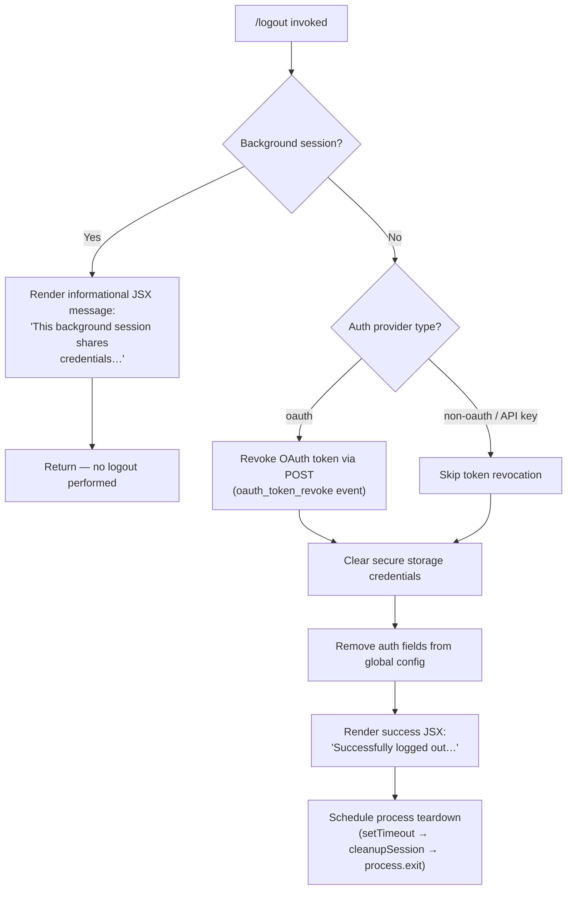

# `/logout`

> Analysis basis: CC v2.1.185 bundle.js (AST extraction + Claude interpretation)
> Minimum version: v2.1.185

---

## Overview

The `/logout` command signs the user out of their Anthropic account by revoking the OAuth token, clearing all persisted credentials from secure storage and config, and then tearing down the current session. It is a `local-jsx` command that runs its handler synchronously within the CLI process — no agent turn is sent to the model.

---

## Registration

| Field | Value |
|---|---|
| type | `local-jsx` |
| name | `logout` |
| description | Sign out from your Anthropic account |
| loc_byte | `11863055` |
| loc_byte_end | `11863339` |
| loc_line | `7630` |
| module_id | `Vno` |
| load_inline | `true` |
| arbor_handler.name | `Kup` |
| arbor_handler.fqn | `claude-2.1.185::Kup` |
| arbor_handler.kind | `AsyncFunction` |
| arbor_handler.resolution_path | `module_id` |
| arbor_handler.n_hits | `0` |

Analysis basis: CC v2.1.185 bundle.js:+11863055

The registration block spans bytes `11863055`–`11863339`. The handler is resolved via `module_id → Vno → Kup` (Arbor `module_id` resolution path). The `load_inline: true` flag means no separate dynamic `import()` call is emitted; the module is already available in the bundle at registration time.

---

## Input Branching

Three distinct branches exist based on the session context at invocation time:



Analysis basis: CC v2.1.185 bundle.js:+8134428 (handler entry `Kup`), +8134465 (background-session guard), +8134882 (auth-type branch), +8134664 (success message), +8134727 (setTimeout teardown)

---

## Behavioral Spec

### Top-level handler (`Kup`)

```
async function logoutCommandHandler(context):
    sessionInfo = readCurrentSessionInfo()          // Hi → uNe

    if sessionInfo.isBackgroundSession:
        renderJSX(InformationalMessage(
            "This background session shares credentials…"
        ))
        return                                      // early exit, no-op

    authType = resolveAuthType(context)             // wr → st

    if authType == "oauth":
        revokeOAuthToken(context)                   // p1 → mo.post (refresh_token body)
        // Telemetry: "oauth_token_revoke" literal at +2138678

    clearSecureStorageCredentials()                 // DFt subtree
    removeAuthFromGlobalConfig(context)             // pn subtree
    logTelemetryEvent("oauth_logout")              // ke (+8134132)

    renderJSX(SuccessMessage(
        "Successfully logged out from your Anthropic account."
    ))                                              // qno.createElement (+8134639)

    setTimeout(teardownSession, delay)              // +8134727
```

Analysis basis: CC v2.1.185 bundle.js:+8134355 (`Kup → Hi`), +8134366 (`Kup → K$e`), +8134428 (`Kup → mat`), +8134639, +8134727

---

### Background-session guard

```
function isBackgroundSession(sessionInfo):
    // Checks process role literals: "bg", "daemon", "daemon-worker"
    // (+2302957, +2302967, +2302981)
    return sessionInfo.role in {"bg", "daemon", "daemon-worker"}
```

When the guard fires, the rendered message (literal at +8134465) advises the user to run `/logout` from their main terminal instead. No credentials are touched.

Analysis basis: CC v2.1.185 bundle.js:+8134463 (`Kup → e` branch check), +2302957–+2302981 (role literals)

---

### OAuth token revocation (`p1`)

```
async function revokeOAuthToken(context):
    endpoint = resolveOAuthEndpoint(context)        // Ps → Oqo / uUc
    payload  = { grant_type: "refresh_token", … }
    headers  = { "Content-Type": "application/json" }
    timeout  = 5000                                 // +2138668

    try:
        response = httpClient.post(endpoint, payload, { headers, timeout })
        // mo.post (+2138510)
    except AxiosError:                              // mo.isAxiosError (+2138715)
        classifyNetworkError(error)                 // T (+2138760) → error category
        // continues — revocation failure is non-fatal
```

The `"oauth_token_revoke"` string at +2138678 is emitted as a telemetry/log label for this call. The `"refresh_token"` literal (+2138570) is sent as a body field.

Analysis basis: CC v2.1.185 bundle.js:+2138510, +2138570, +2138625, +2138640, +2138668, +2138678, +2138715

---

### Credential clearing (`DFt` subtree)

```
function clearAllCredentials():
    clearKeychain()                                 // nDn
    clearPlaintextFallback()                        // pme
    clearCredentialCache()                          // fme → $ti.clear (+3043374)
    clearTransientTokenStore()                      // tIe
    teardownSessionEventListeners()                 // Vse subtree:
        //   I4 → T4 → uB       (internal store reset)
        //   aQe → GNr           (clearInterval, process.removeListener)
        //   aQe → process.off   (+3326087)
        //   aQe clears: pIe, RHn, Cxt, ONr, u8
        //   sQe.emit(…)         (broadcast logout event)
        //   Ek, De, Ho          (error-log flush)
    removeSocketOrPidFile()                         // Dua → wst.unlink (+7232660)
    removeIpcSocket()                               // Kno → Pje.unlink (+13948786)
```

Analysis basis: CC v2.1.185 bundle.js:+8134212 (`DFt → nDn`), +8134218 (`DFt → pme`), +8134224 (`DFt → fme`), +8134230 (`DFt → tIe`), +8134255 (`DFt → Vse`), +8134309 (`DFt → Dua`), +8134321 (`DFt → Kno`)

---

### Global config auth removal (`pn` subtree)

```
async function removeAuthFromGlobalConfig():
    acquireConfigLock()                             // W7n (lock + timestamp)
    currentConfig = readConfigFile()                // q_e → r.readFileSync
    if currentConfig.hasAuth and cachedConfig.hasAuth:
        // Safety check: refuse to write if re-read is missing auth
        // that the cache still holds → logs
        // "saveGlobalConfig fallback: re-read config is missing auth…" (+13963526)
        return                                      // abort to prevent data loss
    delete currentConfig.auth
    writeConfigFileWithFlush(currentConfig)         // j7n → MSt (atomic write)
    // Telemetry: "save_global" literal at +13963772
    releaseConfigLock()
```

The write is performed atomically via a temp-file + rename pattern (`MSt → r.renameSync` at +1097813). A backup is kept under the `"backups"` subdirectory (+13968258). Lock contention emits `tengu_config_lock_contention` (+13966746).

Analysis basis: CC v2.1.185 bundle.js:+8133646 (`mat → pn`), +13963319 (`pn → W7n`), +13963526, +13963772, +13966746

---

### Session teardown (post-logout)

```
function teardownSession():
    // Invoked via setTimeout after JSX renders (+8134727)
    unmountInkUI()                                  // jc → k3e → e.unmount (+7193734)
    flushOutputBuffers()                            // MEn → OZ.writeSync
    waitForPendingWrites()                          // Oi → XWe → B2o.drain (+69581)
    exitProcess(0)                                  // lJr → process.exit (+7194321)
```

A `200` ms delay constant is present at +8134759, suggesting the JSX success message is given time to render before teardown begins.

Analysis basis: CC v2.1.185 bundle.js:+8134727, +8134743 (`Kup → jc`), +7194461 (`jc → Oi`), +7194321 (`lJr → process.exit`), +8134759 (200 literal)

---

### Error path during config write (`Fs`)

```
function handleConfigWriteError(error):
    logToStderr(redColorize(error.message))         // yje → console.error + Ht.red
    writeErrorRecord(configPath)                    // eI → Nre.writeFileSync + Xor.join
    // Literal: "cli_error" category at +13324753
    process.exit(1)                                 // +13324766
```

Analysis basis: CC v2.1.185 bundle.js:+17173784, +13324743 (`Fs → yje`), +13324750 (`Fs → eI`), +13324766 (`Fs → process.exit`), +13324753

---

## State & Side Effects

| Item | Detail |
|---|---|
| Telemetry: `oauth_logout` | Emitted after credentials are cleared; literal at +8134135 |
| Telemetry: `tengu_feature_ok` | Emitted on success path by feature-tracking helper (`ke → j` at +1021887) |
| Telemetry: `tengu_feature_bad` | Emitted on error path (`Re → j` at +1021954) |
| Telemetry: `tengu_feature_sad` | Emitted on partial/sad path (`Pt → j` at +1022035) |
| Telemetry: `tengu_config_lock_contention` | Emitted when config lock is contested (+13966746) |
| Telemetry: `tengu_config_stale_write` | Emitted when a stale config write is detected (+13966882) |
| Telemetry: `tengu_config_auth_loss_prevented` | Emitted when the safety guard aborts a write that would erase auth (+13967225) |
| Telemetry: `tengu_config_fallback_write` | Emitted when the plaintext fallback path is used (+13966362) |
| Telemetry: `tengu_scroll_summary` | Emitted during UI teardown scroll accounting (+7195490) |
| Telemetry: `tengu_cache_eviction_hint` | Emitted during session-end cache bookkeeping (+7196433) |
| Secure storage | Credential entry `"claude-code-user"` (+2151755) is deleted from keychain |
| Plaintext fallback | Fallback credential file unlinked via `wst.unlink` (+7232660) |
| IPC socket / PID file | Removed via `Pje.unlink` (+13948786) |
| Global config (`~/.claude.json`) | `auth` field stripped; file written atomically with flush and backup |
| Event listeners | `process` `exit` and `beforeExit` listeners removed (+3326145, +3326905); intervals cleared |
| In-memory caches | `$ti`, `pIe`, `RHn`, `Cxt`, `ONr`, `u8` — all `.clear()`ed |
| UI | Ink component unmounted; stdout flushed; process exits with code `0` |
| Background-session no-op | If role is `"bg"`, `"daemon"`, or `"daemon-worker"`, none of the above side effects occur |

---

## Version History

| Version | Change |
|---|---|
| v2.1.185 | Initial analysis |

---

## Common Mistakes

1. **Running `/logout` inside a background or daemon session.** The command detects the `"bg"` / `"daemon"` / `"daemon-worker"` process role and renders an informational message without performing any logout. Users must run `/logout` from their primary interactive terminal session.

2. **Expecting an immediate prompt return.** The command schedules teardown via `setTimeout` and then calls `process.exit`. There is no return to the interactive prompt; the entire Claude Code process terminates.

3. **Assuming the OAuth revocation must succeed.** Token revocation (`oauth_token_revoke`) is best-effort. A network failure (5 000 ms timeout) is classified and logged but does not block the local credential removal or process exit.

4. **Confusing `/logout` with API-key deactivation.** The command only revokes the OAuth session token and clears local credential storage. If the user authenticates via API key (`"bedrock"`, `"vertex"`, `"anthropicAws"`, etc.) the token-revocation step is skipped, but local config is still cleared.

5. **Expecting config to be writable during lock contention.** If another Claude instance holds the config lock, the command emits `tengu_config_lock_contention` and may abort the auth-removal step rather than corrupt the file.

---

## Appendix — Identifier Mapping

> For bundle debugging only. Identifiers change across versions.

| Identifier | Role |
|---|---|
| `Kup` | Top-level async logout handler (Arbor-resolved entry point) |
| `mat` | Core logout logic orchestrator (calls all sub-operations) |
| `zup` | JSX wrapper / render coordinator that calls `mat` |
| `r` | Data-stream / channel read utility |
| `Fs` | Config write error handler (logs + exits) |
| `yje` | Stderr error formatter (wraps `console.error` + `Ht.red`) |
| `eI` | Error record file writer (`Nre.writeFileSync`) |
| `Hi` | Session-info reader (checks background role) |
| `uNe` | Session-info accessor |
| `DFt` | Credential & listener cleanup orchestrator |
| `nDn` | Keychain credential deletion |
| `pme` | Plaintext credential fallback clearer |
| `fme` | In-memory credential cache clearer (`$ti.clear`) |
| `tIe` | Transient token store clearer |
| `Vse` | Session event-listener teardown |
| `I4` | Internal store reset (calls `T4`) |
| `T4` | Store reset helper (calls `uB`) |
| `aQe` | Process-listener and interval cleaner |
| `GNr` | Interval canceller + `process.removeListener` |
| `De` | Error-log flusher / appender |
| `Ho` | Error constructor wrapper |
| `st` | String coercion utility |
| `ra` | Essential-traffic queue accessor |
| `Bzc` | Queue rotation helper (`Ven.shift` / `Ven.push`) |
| `Dua` | Socket / PID file remover (`wst.unlink`) |
| `Pua` | Socket path resolver |
| `vNt` | Socket path helper (`xts`) |
| `Qtn` | Path join + stringify helper |
| `Kno` | IPC socket remover (`Pje.unlink`) |
| `sko` | IPC socket teardown (calls `ako`, `Mme`) |
| `ako` | IPC socket cleanup step |
| `Mme` | MCP connection check helper (`pme`) |
| `gIe` | Socket path builder (`rAi.join`) |
| `wr` | Auth-provider type resolver |
| `dc` | Credential-store accessor |
| `D3s` | Credential read/write/delete dispatcher |
| `hNe` | Async credential read helper |
| `QRu` | Async storage context runner |
| `ke` | Feature-telemetry recorder (ok path → `tengu_feature_ok`) |
| `Pt` | Feature-telemetry recorder (sad path → `tengu_feature_sad`) |
| `Re` | Feature-telemetry recorder (bad path → `tengu_feature_bad`) |
| `Ue` | Telemetry event emitter |
| `p1` | OAuth token revocation HTTP caller |
| `Ps` | OAuth endpoint URL builder |
| `Oqo` | Endpoint environment selector |
| `uUc` | OAuth base URL helper |
| `T` | HTTP error classifier / logger |
| `QHc` | Log transport selector |
| `j2o` | Log sink router |
| `Pe` | JSON-stringify log formatter |
| `Kc` | Log file path builder |
| `g9o` | Log path map builder |
| `Hqe` | Log output writer (`s9o → e.write`) |
| `n_c` | Log file write manager (rotate + append) |
| `YWe` | Output batch/debounce scheduler |
| `rpe` | Log line formatter |
| `Pre` | Log directory creator |
| `y9o` | Log path joiner |
| `csr` | Log file rotator (stat → rename → unlink) |
| `t_c` | Log file append + rotate worker |
| `qi` | Telemetry sink registrar (`B2o.register`) |
| `_J` | Session-state cleanup helper |
| `ZPr` | Config persistence coordinator |
| `eni` | Config file path builder (`BRs`) |
| `BRs` | Config path normalizer + hasher |
| `f1` | Path normalizer + SHA-256 hasher |
| `Cv` | Config serializer |
| `RR` | OS user-info reader (`hcn.userInfo`) |
| `Ee` | String coercion helper |
| `pn` | Global config read-modify-write orchestrator |
| `W7n` | Config lock acquirer + file writer |
| `C3s` | Config store factory |
| `q_e` | Config file reader with backup support |
| `AAt` | Config accessor helper |
| `Sko` | Backup directory path builder |
| `MSt` | Atomic file writer (temp + rename + fsync) |
| `LMe` | Config migration helper |
| `_ko` | Config key enumerator |
| `oWt` | Config timestamp recorder |
| `j7n` | Config write executor (calls `MSt`) |
| `Edn` | Config event emitter |
| `o` | UI state reader (async) |
| `rPe` | Post-logout render helper |
| `K$e` | App-state updater |
| `PS` | String coercion for state keys |
| `Ru` | State-change event broadcaster |
| `V$e` | Full app-state reader / resolver |
| `o8` | Session ID generator (`Eko.randomBytes`) |
| `Lt` | TTY/terminal accessor |
| `Zbn` | OTEL attribute builder |
| `mDt` | State string coercer |
| `L2` | Known-key set checker (`zqc.has`) |
| `Mc` | Metrics context builder |
| `ghd` | JWT / base64url decoder |
| `Wki` | Token field extractor |
| `fHt` | State diff emitter |
| `cnr` | Change-notification router |
| `a` | MCP manager / orchestrator |
| `n3e` | MCP server connection initializer |
| `uZn` | MCP connection result applier |
| `mta` | MCP status summarizer |
| `l` | MCP client list helper |
| `B1o` | MCP reconnect / refresh orchestrator |
| `unr` | MCP update notifier |
| `jc` | UI session runner (wraps `Oi`) |
| `Oi` | Main UI render + teardown loop |
| `k3e` | Ink UI unmounter + stdout flusher |
| `fF` | Final output formatter |
| `MEn` | Terminal restore writer (`OZ.writeSync`) |
| `aJr` | Pre-exit transcript writer |
| `zw` | Transcript line formatter |
| `E9` | Transcript content accessor |
| `yNt` | Transcript file path resolver |
| `mh` | Transcript metadata writer |
| `yca` | Transcript finalizer |
| `lJr` | Process exit executor (`process.exit` / `process.kill`) |
| `XWe` | Output drain flusher (`B2o.drain`) |
| `d` | MCP/supervisor process manager |
| `Aje` | File existence / type checker |
| `qDl` | Column-width calculator |
| `y` | Spinner / animation controller |
| `Puc` | Supervisor heartbeat handler |
| `kca` | Graceful-shutdown awaiter (`Promise.allSettled`) |
| `C_t` | Startup profiling reporter |
| `bsr` | Perf report formatter |
| `O9o` | Perf mark recorder |
| `dDn` | Scroll-summary emitter |
| `_ca` | Scroll metrics collector |
| `Hca` | Scroll stats calculator |
| `Os` | Terminal mode selector (fullscreen vs default) |
| `Dgt` | Display garbage collector |
| `Qe` | React/Ink render caller |
| `ogt` | React createElement alias |
| `Ur` | Non-conforming render path |
| `ey` | Fallback render helper |
| `M3e` | Render promise resolver |
| `cDn` | Render completion callback |

---

Note: index built via Arbor fallback; some signals (telemetry, literals) may be missing — see arbor-fallback.js.