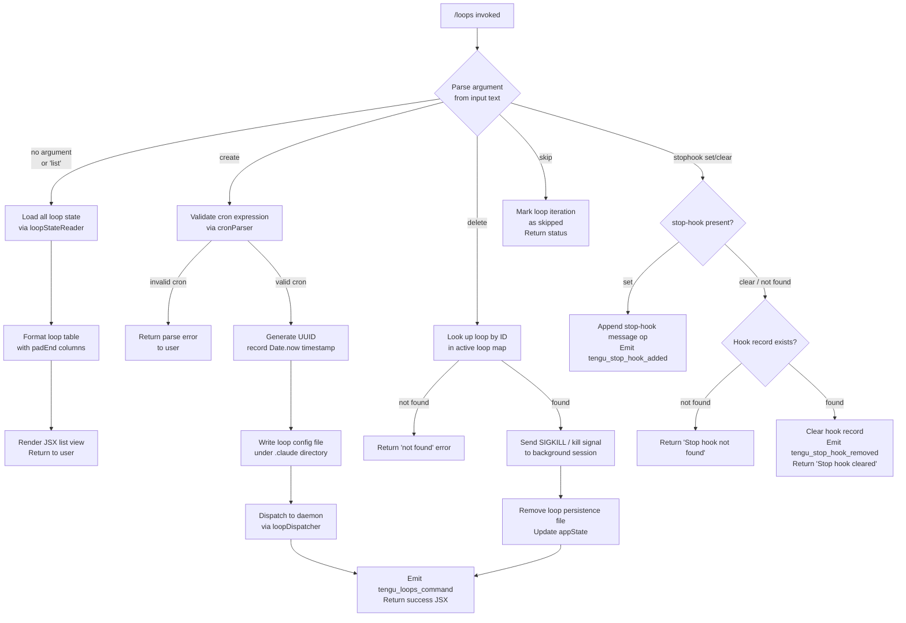

# `/loops`

> Analysis basis: CC v2.1.185 bundle.js (AST extraction + Claude interpretation)
> Minimum version: v2.1.185

---

## Overview

The `/loops` command provides a management interface for Claude Code's background loop (scheduled/autonomous agent) system. It allows users to list all active and known loops, create new loops with configurable cron schedules and prompts, and delete existing loops. Internally it is handled by an async function (`eaf`) that queries live loop state, renders a JSX-based interactive UI, and dispatches create/delete operations against the daemon and loop-persistence layer.

---

## Registration

| Field | Value |
|---|---|
| type | `local-jsx` |
| name | `loops` |
| description | `List, create, and delete loops` |
| loc_byte | `12763337` |
| loc_byte_end | `12763494` |
| loc_line | `8420` |
| immediate | `true` |
| module_id | `aCl` |
| load_inline | `true` |
| arbor_handler.name | `eaf` |
| arbor_handler.fqn | `claude-2.1.185::eaf` |
| arbor_handler.kind | `AsyncFunction` |
| arbor_handler.resolution_path | `module_id` |
| arbor_handler.n_hits | `0` |

Analysis basis: CC v2.1.185 bundle.js:+12763337

---

## Input Branching

The handler processes five conceptually distinct paths based on the subcommand/argument provided and the current state of the loop system: list (no argument), create (with cron + prompt), delete (with loop ID), set/clear stop-hook, and skip. This exceeds the three-branch threshold, so a flowchart is used.



Analysis basis: CC v2.1.185 bundle.js:+12762292 (handler entry), +12762340 (loop state fetch), +12762579 (create path), +12762718 (stop-hook path), +12763030 (delete/JSX render path)

---

## Behavioral Spec

### Top-Level Handler — `loopsCommandHandler` (`eaf`)

The handler is an `AsyncFunction` registered under module `aCl` and resolved via the `module_id` path by Arbor.

```
async function loopsCommandHandler(context):
    // 1. Emit primary telemetry event
    emit("tengu_loops_command")

    // 2. Load live loop roster from daemon state
    loopMap = await readLoopState(context)           // calls loopStateReader (mae → Dtt)
    appState = context.getAppState()

    // 3. Build display table for existing loops
    displayRows = buildLoopTable(loopMap)            // calls tableFormatter (Xdt → g0e, IFa)

    // 4. Parse the user's subcommand text
    subcommand = parseSubcommand(context.input)      // calls inputParser (AP)

    switch subcommand.kind:
        case LIST:
            return renderLoopList(displayRows)

        case CREATE:
            return await createLoop(subcommand, appState, context)

        case DELETE:
            return await deleteLoop(subcommand, appState, context)

        case SET_STOP_HOOK:
            return await setStopHook(subcommand, context)   // calls stopHookSetter (Jdt)

        case CLEAR_STOP_HOOK:
            return await clearStopHook(subcommand, context) // calls stopHookSetter (Jdt)

        case SKIP:
            return skipIteration(subcommand, context)
```

Analysis basis: CC v2.1.185 bundle.js:+12762292

---

### Loop State Reader — `loopStateReader` (`mae` → `Dtt`)

Reads the persisted loop configuration files and merges them with live daemon state.

```
async function readLoopState(context):
    configDir = joinPath(getConfigRoot(), ".claude")  // literal ".claude" at +4906687
    entries = await readdir(configDir)
    loops = []
    for entry in entries:
        raw = await readFile(entry, encoding="utf-8")  // literal "utf-8" at +4905546
        parsed = parseLoopRecord(raw)
        loops.push(parsed)
    return loops
```

Analysis basis: CC v2.1.185 bundle.js:+4907507 (`mae`→`Dtt`), +4905518 (`t.readFile`), +4905546 (encoding literal)

---

### Input Parser — `inputParser` (`AP`)

Parses the free-text argument supplied after `/loops` into a structured subcommand object. Handles cron schedule strings (e.g., `"Every minute"` at +4903410, `"Every hour"` at +4903627) and numeric day-of-week fields.

```
function parseSubcommand(rawInput):
    trimmed = rawInput.trim()
    if trimmed is empty:
        return { kind: LIST }

    match = trimmed.match(SUBCOMMAND_PATTERN)
    if match[1] == "create":
        cronExpr = match[2]
        promptText = match[3]
        scheduleId = parseInt(match[4]) if numeric else parseCronString(cronExpr)
        // Day-of-week arithmetic uses UTC helpers:
        //   getUTCDay, setUTCDate, getUTCDate, setUTCHours, getDay
        return { kind: CREATE, schedule: scheduleId, prompt: promptText }

    if match[1] == "delete":
        loopId = match[2]
        return { kind: DELETE, id: loopId }

    if match[1] == "stophook":      // literal "stophook" at +12762476
        return { kind: SET_STOP_HOOK or CLEAR_STOP_HOOK, ... }

    if match[1] == "skip":          // literal "skip" at +12763203
        return { kind: SKIP }

    return { kind: LIST }
```

Recognized schedule labels (bundle.js:+4903410, +4903627):
- `"Every minute"` — resolves to minute-level cron interval
- `"Every hour"` — resolves to hourly cron interval
- Range string `"1-5"` (bundle.js:+4904334) — weekday range

Analysis basis: CC v2.1.185 bundle.js:+4903290 (`AP` entry), +4903431, +4903466, +4904069

---

### Cron Expression Parser — `cronExpressionParser` (`Zif`)

Converts a human-readable or raw cron string into an internal schedule descriptor. Uses boundary constants: minute max 59 (bundle.js:+12762059), hour max 23 (bundle.js:+12762130), day-of-month max 31 (bundle.js:+12762183), and a 60-unit cycle base (bundle.js:+12762025).

```
function parseCronExpression(expr):
    parts = expr.match(CRON_REGEX)
    minute  = parseInt(parts.minute)
    minute  = Math.max(0, minute)           // clamp lower bound
    second  = Math.ceil(secondFraction)
    rounded = Math.round(normalised)
    // Converts to internal interval schedule; used by loop scheduler
    lines   = tokeniseCronBody(parts)       // calls tokenizer (J1 → Bbd)
    return { minute, hour, dayOfMonth, month, dayOfWeek, lines }
```

Integer parsing uses `parseInt` with a base-10 radix of `10` (bundle.js:+4901604). The tokenizer (`Bbd`) splits on whitespace, matches field patterns, and builds a `Set` via `o.add`.

Analysis basis: CC v2.1.185 bundle.js:+12761880 (`Zif` entry), +12762002, +12762013, +12762086, +12762250

---

### Loop Creator — `loopCreator` (`Mtt`)

Creates a new loop record and registers it with the daemon.

```
async function createLoop(subcommand, appState, context):
    id   = crypto.randomUUID()              // K1i.randomUUID at +4906846
    now  = Date.now()                       // +4906908
    meta = buildLoopMeta(id, now, subcommand.schedule, subcommand.prompt)

    // Persist to .claude directory
    dir  = joinPath(configRoot, ".claude") // literal ".claude" at +4906687
    await mkdir(dir, { recursive: true })
    path = joinPath(dir, id + ".json")     // 8-char id prefix (literal 8 at +4906871)
    await writeFile(path, JSON.stringify(meta))

    // Register with active session
    await sessionDispatcher(meta, context) // CQ at +4907092
    await configWriter(meta)               // CMt at +4907105

    // Update appState and reflect in UI
    await loopTableBuilder(appState)       // Lt at +4907043
    return successJSX(id)
```

Analysis basis: CC v2.1.185 bundle.js:+4906846 (UUID), +4906908 (timestamp), +4906998 (`Dtt` call), +4907011 (push to collection)

---

### Loop Deleter / Kill Dispatcher — `loopKillDispatcher` (`fae` → `M` → process kill)

Locates a loop by ID, terminates the background session, and removes persisted state.

```
async function deleteLoop(subcommand, appState, context):
    roster = await readLoopState(context)           // Dtt at +4907226
    target = roster.filter(l => l.id == subcommand.id)
    if target not in activeSet:                     // n.has at +4907250
        return errorJSX("not found")

    // Write updated config without the deleted entry
    await configWriter(remaining)                   // CMt at +4907299

    // Kill the background process
    process = processMap.get(subcommand.id)         // n.get at +17274906
    if process.state != "closed":                   // literal "closed" at +17274886
        process.kill("SIGKILL")                     // literal "SIGKILL" at +17275072
        // Escalation telemetry emitted: tengu_bg_dispatch_sigkill_escalate

    // Clean up state
    removeLoopFiles(subcommand.id)                  // jNo path
    return successJSX("deleted")
```

Session state values encountered during delete traversal (bundle.js):
- `"done"` (+17281216), `"killed"` (+17281234), `"failed"` (+17281253)
- `"crashed"` (+17281400), `"blocked"` (+17281454), `"working"` (+17281561)
- `"bg"` (+17281725), `"daemon"` (+17282050), `"idle"` (+17282165)
- `"active"` (+4293828)

Timeout for stale daemon entries: 300 000 ms (5 minutes) (bundle.js:+17282929).

Analysis basis: CC v2.1.185 bundle.js:+4907176 (`fae` entry), +16742075, +17275065

---

### Stop-Hook Manager — `stopHookManager` (`Jdt`)

Handles `/loops stophook set <cmd>` and `/loops stophook clear` variants.

```
async function manageStopHook(subcommand, context):
    appState = context.getAppState()
    now      = Date.now()                        // +10716385

    if subcommand.action == "set":
        // Build message op of type "append" (literal at +10716860)
        // with category "goal" (literal at +10716928)
        // and role "system" (literal "system" at +12762625)
        uuid = crypto.randomUUID()               // wQa → IQa.randomUUID at +10716988
        op   = buildMessageOp("append", uuid, subcommand.hookCmd)
        context.applyMessageOp(op)
        context.setAppState({ ...appState, goal_status: "goal_set" })
        emit("tengu_stop_hook_added")            // +10716522
        return successJSX("Stop hook set")       // literal at +12763054

    if subcommand.action == "clear":
        existing = findStopHook(appState)
        if not existing:
            return errorJSX("Stop hook not found")  // literal at +12762736
        clearStopHookRecord(appState)
        emit("tengu_stop_hook_removed")             // +10716894
        return successJSX("Stop hook cleared")      // literal at +12762758
```

Gates checked before hook mutation: `hooks_gate` (literal at +10716032) and `trust_gate` (literal at +10716086).

Analysis basis: CC v2.1.185 bundle.js:+10716136 (`Jdt` entry), +10716423, +10716465, +10716507, +10716520

---

### Loop Table Formatter — `loopTableFormatter` (`Xdt` → `g0e`, `IFa`)

Builds the columnar display shown in list view, using `padEnd` for alignment (bundle.js:+17300746) and `"  "` (two-space separator literal at +17300767).

```
function buildLoopTable(loopMap):
    rows = loopMap.map(entry => {
        idCol     = entry.id.padEnd(columnWidth)
        statusCol = entry.status.padEnd(columnWidth)
        cronCol   = entry.cron.padEnd(columnWidth)
        promptCol = entry.prompt
        return [idCol, statusCol, cronCol, promptCol].join("  ")
    })
    tableState.set(loopMap)           // o.set at +9146942
    return rows
```

Analysis basis: CC v2.1.185 bundle.js:+10715835 (`Xdt` entry), +9146942, +9146950, +10715959

---

## State & Side Effects

| Item | Detail |
|---|---|
| Telemetry: `tengu_loops_command` | Fired once on every invocation of `/loops` (bundle.js:+12762294) |
| Telemetry: `tengu_bg_dispatch_sigkill_escalate` | Fired when a background session requires SIGKILL escalation during delete (+17275024) |
| Telemetry: `tengu_daemon_config_reload` | Fired when daemon config is reloaded after loop mutation (+17290895) |
| Telemetry: `tengu_daemon_control` | Fired on daemon start/stop operations (+17311865) |
| Telemetry: `tengu_scheduled_task_missed` | Fired when a scheduled loop iteration is detected as missed (+16742322) |
| Telemetry: `tengu_stop_hook_added` | Fired when a stop-hook is successfully registered (+10716522) |
| Telemetry: `tengu_stop_hook_removed` | Fired when a stop-hook is cleared (+10716894) |
| Telemetry: `tengu_bg_spare_claim` | Fired during spare background session claim (+17276450) |
| Telemetry: `tengu_bg_spare_claim_fail` | Fired on spare claim failure (+17276716) |
| Telemetry: `tengu_bg_spare_enable` | Fired when spare mode is enabled (+17276322) |
| Telemetry: `tengu_bg_sendclaim_failed` | Fired when daemon claim message fails (+17251556) |
| Telemetry: `tengu_bg_state_read_transient` | Fired on transient state-read errors (+4286662) |
| Telemetry: `tengu_bg_low_mem_mb` | Fired on macOS when memory falls below threshold (+13292201) |
| Telemetry: `tengu_bg_dispatch_low_mem` | Fired when dispatch is suppressed due to low memory (+17275625) |
| Telemetry: `tengu_feature_ok` / `tengu_feature_bad` / `tengu_feature_sad` | Feature flag evaluation events (+1021887, +1021954, +1022035) |
| Telemetry: `tengu_mcp_skills` | Fired during MCP skills resolution reached transitively (+6624964) |
| File writes | Loop config JSON written under `<configRoot>/.claude/<uuid>.json`; `daemon.status.json` updated |
| Process signals | `SIGKILL` (+17275072) sent to background session on delete; `SIGTERM` (+17251794) used for graceful stop |
| appState changes | `goal_status` set to `"goal_set"` on stop-hook registration; loop roster updated on create/delete |
| Hook registration | `stophook` entries appended as `"append"` message ops of role `"system"` |
| Daemon socket | IPC socket claimed via `zq.claim`; frames built with `zq.buildClaimFrame`; 5 000 ms send-claim timeout (+17251990) |
| Background session state machine | States: `active`, `working`, `blocked`, `crashed`, `bg`, `daemon`, `idle`, `done`, `killed`, `failed` |
| Stale session GC | Sessions not updated within 300 000 ms are collected (+17282929) |

---

## Version History

| Version | Change |
|---|---|
| v2.1.185 | Initial analysis |

---

## Common Mistakes

1. **Passing an invalid cron expression**: The cron parser (`Zif`) clamps and rounds fields but will surface a parse error if the pattern does not match `CRON_REGEX`. Use the named labels `"Every minute"` or `"Every hour"` when in doubt.
2. **Attempting to delete a loop by partial ID**: The delete path performs an exact match against the persisted UUID. Short/prefix IDs are not supported — retrieve the full ID from `/loops` (list view) first.
3. **Running `/loops` when the daemon is not running**: `loopStateReader` reads files from `.claude` directly, but `createLoop` and `deleteLoop` both call the daemon IPC socket. If the daemon is unavailable the socket claim will time out after 5 000 ms and return a connection error.
4. **Setting a stop-hook without adequate trust level**: The `trust_gate` check (bundle.js:+10716086) must pass before a hook is written; running in a restricted or sandboxed project context will silently fail this gate.
5. **Expecting immediate loop execution on create**: The loop is scheduled by the cron expression; it does not execute immediately upon creation. Check loop status via the list view after the first scheduled interval.

---

## Appendix — Identifier Mapping

> For bundle debugging only. Identifiers change across versions.

| Identifier | Role |
|---|---|
| `eaf` | Top-level loops command handler (`AsyncFunction`, Arbor FQN `claude-2.1.185::eaf`) |
| `mae` | Loop state aggregator (calls `Dtt` to read config files) |
| `Dtt` | Loop config file reader (reads `.claude` directory, UTF-8 encoding) |
| `jt` | File-system utility (used within `Dtt`) |
| `WAe` | Config path builder (joins path segments via `JIn.join`) |
| `Ec` | Config root resolver (calls `gx`) |
| `ds` | Error code handler (calls `dn`) |
| `dn` | Error normaliser |
| `De` | Log/error dispatcher (calls `Ho`, `st`, `ra`, `Bzc`) |
| `Ho` | Error formatter (wraps `Error` + `String`) |
| `st` | String coercer |
| `ra` | Essential-traffic logger (`eJo`) |
| `Bzc` | Circular log buffer manager (`Ven.shift` / `Ven.push`) |
| `T` | Logging/debug utility (debug level, calls `QHc`, `Pe`, `Kc`, etc.) |
| `QHc` | Debug channel router (`FO`, `ssr`, `j2o`) |
| `Pe` | JSON serialiser (wraps `JSON.stringify`) |
| `Kc` | String redactor (replaces sensitive segments with `[REDACTED]`) |
| `Hqe` | Secondary string helper (`s9o`) |
| `n_c` | Large-content handler (byte-length check, file write, bind) |
| `J1` | Input line tokeniser (trim, calls `Bbd`) |
| `Bbd` | Cron field tokeniser (split, match, `parseInt`, Set operations) |
| `j0` | Secondary helper called from `mae` (uses `gx`) |
| `gx` | Core utility used by multiple log/path helpers |
| `Xdt` | Loop table formatter (calls `g0e`, `IFa`, `n.push`) |
| `g0e` | Table state writer (`o.set`, `IFa`) |
| `IFa` | Row mapper (`e.map`) |
| `Lt` | UI render helper (uses `gx`) |
| `AP` | Subcommand input parser (trim, match, `parseInt`, date UTC helpers) |
| `f` | Background session lifecycle manager (kill, spawn, state machine) |
| `M` | Background loop orchestrator (calls `Dtt`, `T`, `CQ`, `CMt`, `fae`, etc.) |
| `d` | Daemon write/control handler (`Aje`, `r.write`, `qDl`, stops/starts) |
| `CQ` | Session config/context accessor (`vfe`) |
| `CMt` | Loop config file writer (`XIn.mkdir`, `XIn.writeFile`, `JIn.join`) |
| `J1i` | Loop filter utility (`e.filter`, `ktt`) |
| `g` | Buffer/stream reader (`Buffer.concat`, timeout, `T6f`, `Ee`) |
| `u` | Daemon stop helper (`ke`, `Re`, `rF`, `SG`) |
| `k` | Process writer helper (`Uuc`, `Gp`, `T`, `De`, `j6f`, `d.write`) |
| `h` | Timer helper (`a`, `r.setTimeout`) |
| `Jnc` | Loop status formatter (maps entries, calls `AP`, `Math.max`, join) |
| `fae` | Loop create/delete coordinator (calls `Dtt`, `CMt`, filters roster) |
| `Bn` | Abort/timeout wrapper (`Error`, `setTimeout`, `clearTimeout`) |
| `Re` | Feature-ok reporter (`j`, `Ue`; emits `tengu_feature_ok`) |
| `ke` | Feature-bad reporter (`j`, `Ue`; emits `tengu_feature_bad`) |
| `Ue` | Feature event dispatcher (`ogt`) |
| `YKn` | macOS memory checker (`zt`, `ct`; emits `tengu_bg_low_mem_mb`) |
| `ct` | Platform/feature capability checker |
| `B$e` | Pins file handler (`fT.lstat`, `fT.rm`, `fT.readFile`, JSON parse) |
| `nDt` | Pins path builder (`fb.join`, `wk`) |
| `Gt` | Safe JSON parser (`JSON.parse`) |
| `Mn` | Error code mapper (`dn`) |
| `zAd` | Directory scanner for loop files (`fT.readdir`, `fT.lstat`, `Promise.all`) |
| `$` | Permission/rule resolver (`zlt`, `R6`) |
| `zlt` | Rule evaluator (`rio`, `R2t`, `T`) |
| `R6` | Permission classifier (`Eu`, `Bot`, `yb`, `st`, `cdt`, `wfo`, etc.) |
| `NNo` | Daemon socket claim handler (`zq.claim`, `Nko`, `f6f`, `p6f`) |
| `Nko` | Claim record writer (`zt`, `Yq.mkdir`, `Yq.writeFile`, `JSON.stringify`) |
| `f6f` | Claim timeout watcher (`Date.now`, `Error`, `dn`, `Bn`; 5 000 ms timeout) |
| `p6f` | Claim frame builder (`zq.buildClaimFrame`) |
| `wp` | Warning emitter (`dn`) |
| `Ee` | Error string coercer (`String`) |
| `FM` | IPC frame serialiser (`Buffer.from`, `Buffer.allocUnsafe`, `writeUInt32BE`, `writeUInt8`) |
| `jNo` | Background session state machine (manage session files, states, timeouts) |
| `Ic` | Session path resolver (`fb.join`, `wk`) |
| `fa` | Session file watcher / state reader (`fb.join`, `fT.lstat`, `fT.readFile`, etc.) |
| `pg` | Activity state checker (`Wx`) |
| `OCe` | Context path classifier (`startsWith`, `indexOf`, `slice`, Set lookups) |
| `Pp` | Session path formatter (`vh`, `fb.join`, `Pe`, `mT`) |
| `rft` | Session timing tracker (`Mcl.then`, `Iq`, `Date.now`, `TKp`) |
| `P6t` | Path joiner helper A (`qh.join`, `M6t`) |
| `e_e` | Path joiner helper B (`qh.join`, `xGe`) |
| `iD` | Late-state loader (`Lcl`; label `"err"`) |
| `BN` | Status file writer (`zt`, `Uyo`, `qh.join`, `nft`) |
| `WM` | Late-state writer (`Lcl`; label `"late"`) |
| `R6t` | Path joiner helper C (`qh.join`, `M6t`) |
| `p` | Forced-shutdown handler (`WT`, `process.exit`, `u.abort`) |
| `WT` | Shutdown notifier |
| `m` | Kill-all helper (`n.values`, `k.kill`) |
| `l` | Daemon status reader (`k0l`) |
| `k0l` | Status file reader (`CQ`, `Date.now`, `ci`, `Mjt`, `Pe`) |
| `ci` | AsyncLocalStorage store accessor (`L0u.getStore`) |
| `Mjt` | Status path builder (`x0l.join`, `tr`) |
| `A` | Date arithmetic context (UTC day/date/hours helpers) |
| `Qdt` | Stop-hook setter (v2 path: `Lt`, `Xdt`, `getAppState`, `setAppState`, `applyMessageOp`) |
| `wQa` | UUID generator wrapper (`IQa.randomUUID`) |
| `Qe` | React/Ink rendering helper (`ogt`) |
| `Zif` | Cron expression parser (minute/hour/day bounds, `Math.ceil`, `Math.round`) |
| `Mtt` | Loop record creator (`K1i.randomUUID`, `Date.now`, `sPe`, `Dtt`, `Lt`, `CQ`, `CMt`) |
| `sPe` | Loop metadata builder |
| `a` | MCP/loop session manager (`n3e`, `uZn`, `mta`, `B1o`) |
| `n3e` | MCP connection orchestrator (entries, connect, filter, skills, etc.) |
| `dW` | MCP server config processor (`Ort`, `W7`, `jwe`, `k5`, etc.) |
| `Nk` | Config key validator (`P_`, `EKr`) |
| `Wn` | Config wrapper (`t`) |
| `pra` | MCP connection initiator (`w7r`, `Vwe`, `Phn`, `Date.now`) |
| `Ohn` | Hook dispatcher (`Phn`, `EI`) |
| `Mhn` | MCP debug channel (`dc`) |
| `on` | MCP debug logger (`hKe.push`, `QJ.logMCPDebug`) |
| `oxn` | Connection result applier (`Lr`, `CBd`, `vBd`) |
| `Sra` | MCP session starter (`a0n.then`, `w7r`, `ci`, `d0n`, `Pe`) |
| `OKr` | MCP error handler (`EI`, `dc`, `on`, `Ee`) |
| `Uk` | MCP skills resolver (`ct`; emits `tengu_mcp_skills`) |
| `yKr` | Permission-node checker (`pn`, `n.includes`) |
| `w` | Retry/back-off scheduler (`kz`, `Date.now`, `Math.min`, `L`, `v`, `Dec`) |
| `Cu` | MCP error logger (`hKe.push`, `QJ.logMCPError`) |
| `gra` | MCP status helper (`U8`) |
| `Hot` | MCP version parser (`parseInt`) |
| `p0n` | MCP port parser (`parseInt`) |
| `uZn` | MCP update applier (`e.applyMcpUpdate`, `t3e`, `on`, `n.cleanup`, `fw`, `fE`) |
| `t3e` | MCP state transformer (`Vwe`) |
| `fw` | MCP cleanup coordinator (`hot`, `o.cleanup`, `Uk`) |
| `mta` | MCP transport selector (`Szr`) |
| `B1o` | MCP roster reconciler (`Object.entries`, `n.filter`, `t.getClients`, `n3e`, `uZn`) |
| `jLn` | Client set membership checker (`X2d.has`, `LKr.has`) |
| `hot` | MCP connection state checker (`Vwe`) |
| `Jdt` | Stop-hook manager (v1 path: `tho`, `Pt`, `Lt`, `Xdt`, `getAppState`/`setAppState`, `applyMessageOp`) |
| `tho` | Hook gate evaluator (`hB`, `eie`, `Lr`, `kp`) |
| `hB` | Policy settings reader (`xn`; key `"policySettings"`) |
| `xn` | Settings node accessor (`Mnn`, `B2`) |
| `eie` | Trust-gate evaluator (`xn`, `ts`) |
| `Lr` | Hook/trust logger |
| `kp` | Hook config resolver (`hbf`) |
| `hbf` | Hook config builder (`st`, `qWe`, `Hi`, `Ct`, `zue`, `uK`, `Mt`, `vS.resolve`) |
| `Pt` | Feature-sad reporter (`j`, `Ue`; emits `tengu_feature_sad`) |
| `ry` | Output-token counter (`RWe`, `Object.values`; key `"outputTokens"`) |