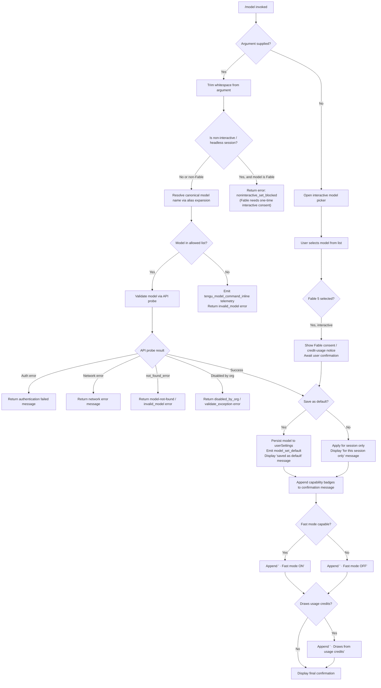

# `/model`

> Analysis basis: CC v2.1.185 bundle.js (AST extraction + Claude interpretation)
> Minimum version: v2.1.185

---

## Overview

The `/model` command allows users to change the active AI model for the current Claude Code session. It accepts an optional model identifier argument; when provided it immediately applies the new model after validation; when omitted it displays an interactive picker listing all available models. The command supports both interactive and non-interactive (headless) execution modes and persists the choice to user settings when requested.

---

## Registration

| Field | Value |
|---|---|
| type | `local` |
| name | `model` |
| description | Set the AI model for Claude Code |
| argumentHint | `<model>` |
| supportsNonInteractive | `true` |
| module_id | `VLl` |
| load_inline | `true` |
| loc_byte | 12972294 |
| loc_byte_end | 12972468 |
| loc_line | 8557 |
| arbor_handler.name | `Xcf` |
| arbor_handler.fqn | `claude-2.1.185::Xcf` |
| arbor_handler.kind | `AsyncFunction` |
| arbor_handler.resolution_path | `module_id` |
| arbor_handler.n_hits | 0 |

Analysis basis: CC v2.1.185 bundle.js:+12972294

---

## Input Branching

The command has 4+ distinct branches depending on whether an argument was supplied, whether the session is interactive, whether the model is Fable, and whether the model passes validation.



---

## Behavioral Spec

### Handler Entry Point — `modelCommandHandler` (bundle: `Xcf`)

Analysis basis: CC v2.1.185 bundle.js:+12935709

```
async function modelCommandHandler(argument, context):
    trimmedArg = argument.trim()

    if trimmedArg is in the set of unsupported/internal token strings (uoe):
        // guard against internal names leaking in
        return early

    appState = context.getAppState()

    // Resolve the full model list from current state
    availableModels = resolveModelList(appState)       // calls mjn → $M → cCt/pL/Uun

    if trimmedArg is in the known model identifiers list (G9):
        emit telemetry: tengu_model_command_inline      // bundle.js:+12935859

    if trimmedArg is empty:
        // Interactive picker path
        openInteractiveModelPicker(context)             // calls j (picker component)
        return

    // Non-interactive / direct-argument path
    canonicalName = resolveModelAlias(trimmedArg)      // calls Dp → sha256 hash prefix logic

    validationResult = validateAndProbeModel(           // calls n6t
        canonicalName,
        appState,
        availableModels
    )

    if validationResult indicates fable consent required AND session is non-interactive:
        return errorResult("noninteractive_set_blocked",
            "Fable 5 uses usage credits and needs a one-time consent…")
                                                       // bundle.js:+12936039

    applyModelAndRespond(canonicalName, validationResult, context)
                                                       // calls fjn
```

### Model Alias Resolution — `resolveModelAlias` (bundle: `Dp`)

Analysis basis: CC v2.1.185 bundle.js:+3369266

```
function resolveModelAlias(input):
    // Normalise shorthand tier aliases to canonical API model strings
    // Short aliases recognised (from literals):
    //   "sonnet"    → latest claude-sonnet-* series
    //   "haiku"     → latest claude-haiku-* series
    //   "opus"      → latest claude-opus-* series
    //   "fable"     → claude-fable-5 (newest)
    //   "best"      → tier-best alias
    //   "opusplan"  → Opus in plan mode, else Sonnet
    //   "sonnet[1m]", "[1m]" → 1M-context extended variants
    //
    // Implementation generates an SHA-256 hash prefix (12 chars, hex)
    // to identify the alias bucket, then maps to the full model string.
    hash = crypto.createHash("sha256")                 // bundle.js:+3369269
    // … selects canonical name from internal alias table
    return canonicalModelString
```

### Model List Construction — `buildModelList` (bundle: `Uun` via `pL` / `$M`)

Analysis basis: CC v2.1.185 bundle.js:+2280369

```
function buildModelList(appState):
    // 1. Gather built-in model catalogue (hard-coded entries)
    builtins = collectBuiltinModels()     // $vr

    // 2. Overlay with remotely managed settings fetched at startup
    //    (field key: "remote managed settings" — bundle.js:+1311236)
    remoteOverrides = appState.remoteSettings

    // 3. Merge policy/org settings
    policyModels = appState.policySettings  // literal "policySettings" — bundle.js:+2273179

    // 4. Apply tier/subscription status filters
    //    Status values: "active", "inactive", "refused", "disabled"
    //                   (bundle.js:+2280804–2280884)
    //    Provider types: "bedrock","vertex","firstParty","anthropicAws"
    //                   (bundle.js:+2126556–2126773)

    // 5. De-duplicate by canonical ID using a Set; log warns for duplicates
    //    (literal "warn" — bundle.js:+2281729)

    // 6. Identify "mantle" gateway models (literal "mantle" — bundle.js:+2280570)
    //    and "foundry" provider models (literal "foundry" — bundle.js:+2283171)

    // 7. Attach display names for each canonical ID, e.g.:
    //    "claude-opus-4-8"    → "Opus 4.8"   (bundle.js:+2290987)
    //    "claude-sonnet-4-6"  → "Sonnet 4.6" (bundle.js:+2291233)
    //    "claude-fable-5"     → "Fable 5"    (bundle.js:+2290910)
    //    … (full mapping in literals section)

    return mergedModelList
```

### Model Validation Probe — `validateAndProbeModel` (bundle: `n6t`)

Analysis basis: CC v2.1.185 bundle.js:+11284836

```
async function validateAndProbeModel(modelId, appState, availableModels):
    if modelId is empty string:
        return error("Model name cannot be empty")     // bundle.js:+11282870

    normalised = modelId.toLowerCase()

    if normalised not in builtinModelSet (Sfe):        // bundle.js:+11283037
        // Check whether it's a known gateway / custom model via Zsl map
        if not in Zsl:
            // Try API probe: send minimal inference request
            result = probeModelViaApi(modelId)         // I6 — deep call chain

            if result.type === "authentication_error":
                return error("Authentication failed…") // bundle.js:+11283606

            if result is network error:
                return error("Network error…")         // bundle.js:+11283708

            if result.type === "not_found_error"
               AND result.message contains "model:":
                return error("invalid_model")          // bundle.js:+11283827/11283909

            // Cache successful probe result in Zsl
            Zsl.set(modelId, probeResult)              // bundle.js:+11283347

    // Extended-context 1M checks
    if modelId contains "[1m]" or is "sonnet[1m]" / "sonnet-4-6[1m]":
        if account not eligible for Opus 1M:
            emit "opus_1m_unavailable"                 // bundle.js:+11285014
            return error("Opus with 1M context is not available…")
                                                       // bundle.js:+11285052
        if account not eligible for Sonnet 4.6 1M:
            emit "sonnet_1m_unavailable"               // bundle.js:+11285231
            return error("Sonnet 4.6 with 1M context is not available…")
                                                       // bundle.js:+11285271

    // Org-disabled check
    if model is flagged disabled_by_org:               // bundle.js:+11285499
        return error("disabled_by_org")

    // model_switch check (policy / quota guard)
    if model_switch is "not_allowed":                  // bundle.js:+11284867
        return error code "model_switch / not_allowed")

    // Fable probe availability
    if fable validation attempted and failed:
        emit "fable_unavailable" / "fable_probe_failed"  // bundle.js:+11285750,11285770

    return validationSuccess(resolvedModelInfo)
```

### Apply Model and Build Response — `applyModelAndRespond` (bundle: `fjn`)

Analysis basis: CC v2.1.185 bundle.js:+11286246

```
function applyModelAndRespond(canonicalModel, validationInfo, context):
    appState = context.getAppState()

    // Determine persistence intent (save as default vs session-only)
    saveAsDefault = userRequestedDefault(context)

    if saveAsDefault:
        // Write to userSettings on disk
        saveModelToUserConfig(canonicalModel)          // r6t → co (config write path)
        emit event "model_set_default"                 // bundle.js:+11286756
        suffix = " and saved as your default for new sessions"
                                                       // bundle.js:+11286398
    else:
        // Apply only for the current session
        appState.model = canonicalModel
        suffix = " for this session only"              // bundle.js:+11286444

    // Build display name
    displayName = getModelDisplayName(canonicalModel)  // bold formatted via Ht.bold

    // Compose capability badge suffix
    badge = ""
    if modelHasFastMode(canonicalModel):               // eDe → yH/sT logic
        badge += " · Fast mode ON"                     // bundle.js:+11286562
    else:
        badge += " · Fast mode OFF"                    // bundle.js:+11286659

    if modelDrawsUsageCredits(canonicalModel):         // Fable / usage-credit model
        badge += " · Draws from usage credits"         // bundle.js:+11286613

    // Show managed settings notice if org policy overrides model
    if appState.managedModelPolicy is set:
        display "Managed settings"                     // bundle.js:+11286965
        display current org-managed model info         // __o block

    return successMessage(displayName + suffix + badge)
```

### API Bootstrap / Model Probe — `apiBootstrapFetch` (bundle: `Xup` / `Aat`)

Analysis basis: CC v2.1.185 bundle.js:+8135697

```
async function apiBootstrapFetch(config):
    // Skip conditions (evaluated in order)
    if CLAUDE_CODE_ENABLE_GATEWAY_MODEL_DISCOVERY not set:
        log "[Bootstrap] Skipped gateway /v1/models…"  // bundle.js:+8135774
        return

    if non-essential traffic disabled:
        log "[Bootstrap] Skipped: Nonessential traffic disabled"
                                                       // bundle.js:+8135929
        return

    if provider is third-party (not firstParty/Anthropic):
        log "[Bootstrap] Skipped: 3P provider"         // bundle.js:+8136020
        return

    // Perform fetch
    log "[Bootstrap] Fetching"                         // bundle.js:+8136082
    response = await fetch(endpoint, {
        headers: {
            "Content-Type": "application/json",
            "anthropic-version": "2023-06-01",
            "anthropic-beta": <beta-flags>,
        },
        timeout: 5000,                                 // bundle.js:+8138434
    })

    if response.ok:
        // Parse and cache model list
        emit "api_bootstrap_fetch" telemetry (success)
        log "[Bootstrap] Fetch ok"                     // bundle.js:+8136455
        persistToCache(response.data)
    else:
        emit "api_bootstrap_fetch" telemetry (parse_failed / request_failed)
```

### Extended-Context (1M) Availability Check — `check1MContextAvailability` (bundle: `y_o` / `E_o`)

Analysis basis: CC v2.1.185 bundle.js:+11287144

```
function checkOpus1MAvailability(modelId, accountInfo):
    normalised = modelId.toLowerCase()
    if normalised includes "[1m]":
        eligible = queryLimitService(accountInfo)      // dee → Ife/vo/LFi
        if not eligible:
            return { available: false,
                     reason: "opus_1m_unavailable" }
    return { available: true }

function checkSonnet1MAvailability(modelId, accountInfo):
    normalised = modelId.toLowerCase()
    if normalised includes "[1m]":
        if "sonnet[1m]" or "sonnet-4-6[1m]" in modelId:
            eligible = queryLimitService(accountInfo)  // nhe → Ife/vo/LFi
            if not eligible:
                return { available: false,
                         reason: "sonnet_1m_unavailable" }
    return { available: true }
```

### Known Model Catalogue (literals summary)

The following canonical model IDs are hard-coded in the bundle (bundle.js:+2288424 – +2289425):

| Alias | Canonical ID | Display Name |
|---|---|---|
| fable | claude-fable-5 | Fable 5 |
| — | claude-mythos-5 | Mythos 5 |
| opus (4.8) | claude-opus-4-8 | Opus 4.8 |
| opus (4.7) | claude-opus-4-7 | Opus 4.7 |
| opus (4.6) | claude-opus-4-6 | Opus 4.6 |
| opus (4.5) | claude-opus-4-5 | Opus 4.5 |
| opus (4.1) | claude-opus-4-1 | Opus 4.1 |
| opus | claude-opus-4-0 | Opus 4 |
| sonnet (4.6) | claude-sonnet-4-6 | Sonnet 4.6 |
| sonnet (4.5) | claude-sonnet-4-5 | Sonnet 4.5 |
| sonnet | claude-sonnet-4-0 | Sonnet 4 |
| haiku | claude-haiku-4-5 | Haiku 4.5 |
| — | claude-3-7-sonnet | Sonnet 3.7 |
| — | claude-3-5-sonnet | Sonnet 3.5 |
| — | claude-3-5-haiku | Haiku 3.5 |
| — | claude-3-opus | — |
| — | claude-3-sonnet | — |
| — | claude-3-haiku | — |

Short aliases also recognised: `sonnet[1m]`, `[1m]` (1M-context extended variants). Aliases `opusplan` ("Opus in plan mode, else Sonnet" — bundle.js:+2290222) and `best` are also supported.

---

## State & Side Effects

| Item | Detail |
|---|---|
| Telemetry: `tengu_model_command_inline` | Fired when the argument matches a known model identifier (bundle.js:+12935859) |
| Telemetry: `tengu_feature_ok` | Fired on successful feature gate check (bundle.js:+1021887) |
| Telemetry: `tengu_feature_bad` | Fired on feature gate denial (bundle.js:+1021954) |
| Telemetry: `tengu_feature_sad` | Fired on feature gate soft failure (bundle.js:+1022035) |
| Telemetry: `tengu_api_success` | Fired after a successful API probe call (bundle.js:+8783278) |
| Telemetry: `tengu_lone_surrogate_sanitized` | Fired when response text contains lone Unicode surrogates (bundle.js:+8782974) |
| Telemetry: `tengu_config_lock_contention` | Fired when config file lock takes unexpectedly long (bundle.js:+13966746) |
| Telemetry: `tengu_config_stale_write` | Fired when a stale config write is detected (bundle.js:+13966882) |
| Telemetry: `tengu_config_auth_loss_prevented` | Fired when a write would have wiped auth credentials (bundle.js:+13967225) |
| Telemetry: `tengu_config_parse_error` | Fired when config JSON fails to parse (bundle.js:+13969321) |
| Telemetry: `tengu_config_fallback_write` | Fired when config falls back to alternate write path (bundle.js:+13966362) |
| Telemetry: `tengu_prompt_cache_1h_config` | Fired when 1h prompt cache config is applied (bundle.js:+13722282) |
| Telemetry: `tengu_bg_retire_pinned_low_mem` | Fired when background workers are retired due to low memory (bundle.js:+17279714) |
| Telemetry: `tengu_bg_prewarm_per_sweep` | Fired each background prewarm sweep (bundle.js:+17279835) |
| Telemetry: `tengu_saffron_lattice` | Fired from model credit / subscription status check (bundle.js:+5086816) |
| appState changes | `appState.model` updated to new canonical model ID for session; persisted to `userSettings` when saving as default |
| Config file writes | When "save as default" path is taken: writes to `~/.claude/settings.json` with lock/retry; guards against auth-stripping (GH #3117 safeguard — bundle.js:+13967073) |
| Interactive picker | Rendered when no argument is given; displays all available models with display names |
| Fable consent gate | Non-interactive sessions are blocked from setting Fable 5; interactive sessions see a credit-usage consent notice before applying |
| Org policy notice | When org-managed model policy is active, displays "Managed settings" notice alongside the current policy model |
| Sound | None observed in traversal |
| Hook registration | None observed in traversal |

---

## Version History

| Version | Change |
|---|---|
| v2.1.185 | Initial analysis |

---

## Common Mistakes

1. **Supplying a model alias in non-interactive mode for Fable 5** — The command blocks with `noninteractive_set_blocked` when `--model fable` (or equivalent) is used in a headless/CI invocation. Fable requires interactive one-time consent to acknowledge credit usage.

2. **Expecting an unknown model string to be passed through unchanged** — The handler validates every custom model ID against the API via an inference probe. A `not_found_error` whose message contains "model:" is treated as `invalid_model` and rejected; the model is never applied silently.

3. **Assuming session-only changes persist across sessions** — Without explicitly confirming "save as default" in the interactive flow (or using the appropriate flag in non-interactive mode), the model change applies only until the session ends.

4. **Using org-disabled model names** — Models that are disabled at the organisation level (`disabled_by_org`) are filtered and return a validation error regardless of whether the model ID is otherwise valid.

5. **Expecting the `[1m]` 1M-context suffix to work on all accounts** — Extended 1M context for Opus and Sonnet 4.6 is subject to account eligibility checks; ineligible accounts receive a descriptive error with a documentation link.

6. **Omitting the `claude-` prefix** — While short aliases (`sonnet`, `opus`, `haiku`, `fable`, `best`, `opusplan`) are expanded internally, arbitrary partial strings that don't match an alias or the `claude-` prefix pattern are sent to the API probe which will likely return `not_found_error`.

---

## Appendix — Identifier Mapping

> For bundle debugging only. Identifiers change across versions.

| Identifier | Role |
|---|---|
| `Xcf` | Main handler for `/model` command (`modelCommandHandler`) |
| `mjn` | Retrieve model list from app state |
| `$M` | Aggregate model list builder (calls `cCt` and `pL`) |
| `cCt` | Construct canonical model catalogue |
| `Jd` | Individual model entry constructor |
| `_s` | Model name normalisation / alias lookup |
| `pL` | Policy-aware model list merge |
| `$vr` | Base model registry (remote + built-in merge) |
| `Uun` | Full model list resolution with deduplication and tier filtering |
| `Dp` | Model alias hash-based resolver |
| `ey` | Hash utility helper |
| `ogt` | Low-level primitive utility |
| `n6t` | Model validation probe orchestrator |
| `ul` | Model catalogue loader |
| `Ubt` | Remote model settings fetcher |
| `drs` | Remote settings filter |
| `urs` | Settings reducer |
| `Fbt` | Built-in model table constructor |
| `wSe` | Remote managed settings applicator |
| `B2` | Base model capability descriptor |
| `Pbt` | Policy-bound model entry builder |
| `Fs` | Data-layer stream processor |
| `Bl` | String sanitiser / bracket normaliser |
| `k0l` | Date-stamped cache entry builder |
| `nNe` | Model name include-list checker |
| `PR` | Provider restriction checker |
| `Run` | Model alias runner |
| `oCt` | Canonical alias comparator |
| `PBs` | Policy settings extractor |
| `xn` | Settings cross-reference resolver |
| `Mnn` | Settings merge node |
| `K7e` | Settings key expander |
| `Gr` | Settings graph resolver |
| `RBs` | Remote settings base builder |
| `ZMu` | Settings zone merger |
| `DBs` | Settings delta builder |
| `eRu` | Settings entry resolver |
| `MBs` | Settings match builder |
| `Re` | Response entity processor |
| `Ue` | Update entity helper |
| `y_o` | Opus 1M context availability check |
| `dee` | Limit-service query for Opus 1M |
| `Ife` | Feature eligibility checker |
| `vo` | Voice/plan tier checker |
| `LFi` | Limit fetch initiator |
| `sT` | Subscription tier resolver |
| `Cfe` | Credit feature evaluator |
| `wr` | HTTP/wire request helper |
| `sa` | Subscription account helper |
| `E_o` | Sonnet 4.6 1M context availability check |
| `nhe` | Limit-service query for Sonnet 1M |
| `Xbe` | Model availability/status resolver |
| `Mu` | Managed-model utility |
| `Zln` | Model zone lookup |
| `e_` | Model entry normaliser |
| `bfe` | Base feature evaluator |
| `Ct` | Cached timestamp utility |
| `Fo` | Field-object extractor |
| `dHt` | Display hint transformer |
| `Af` | API field accessor |
| `WK` | "Gateway" model status resolver |
| `Yoe` | Inclusion-set checker |
| `Joe` | "1M context" label appender |
| `Nun` | "Absent" model status resolver |
| `SYe` | Status-set inclusion checker |
| `EYe` | Extended eligibility checker |
| `t6t` | Model validation logic entrypoint |
| `I6` | Full API inference call (model probe) |
| `Am` | Auth manager |
| `Qj` | HTTP request builder and sender |
| `h` | HTTP connection helper |
| `GUe` | Gateway URL evaluator |
| `nse` | Network session evaluator |
| `_` | Background SDK connection manager |
| `nyp` | Model-in-list finder |
| `Kso` | Key-hash generator (SHA-256) |
| `Kun` | Custom header builder |
| `d_n` | Downstream network utility |
| `M4e` | Memory-aware thread orchestrator |
| `UR` | Upstream request handler |
| `L` | Background worker lifecycle manager |
| `xRa` | Cross-request accumulator |
| `rhn` | Request header normaliser |
| `Uv` | User-value mapper |
| `Qve` | Queue value evaluator |
| `c9o` | Conversation-object mutator |
| `cU` | Clone/structured-clone utility |
| `pYt` | Pending-yield transformer |
| `Qe` | Queue entry helper |
| `Dwr` | Downstream wire request |
| `kwr` | Cache-keyed wire request |
| `nEe` | Network error evaluator |
| `Ur` | Upstream response handler |
| `os` | Output stream utility |
| `dDt` | Debug/diagnostics telemetry |
| `CF` | Cache/file state coordinator |
| `Rgt` | Rate/gauge tracker |
| `Ajp` | Alias-job processor |
| `hjp` | Hash-job processor |
| `eil` | Error-in-list checker |
| `Aat` | API bootstrap fetcher orchestrator |
| `Xup` | API bootstrap fetch core |
| `T` | Text/token utility |
| `Qup` | Queue-update processor |
| `ra` | Request authenticator |
| `tg` | Tag/header generator |
| `APr` | API parser (header split) |
| `L2` | Lookup-2 cache checker |
| `js` | JSON/settings serialiser |
| `Pt` | Profile token resolver |
| `Mv` | Model validator entry |
| `ib` | Implicit-bearer auth handler |
| `sTe` | Streaming token exchange |
| `RYe` | REST/auth token resolver |
| `Ps` | Provider settings |
| `Rv` | Response validator |
| `_k` | Auth-key error handler |
| `ke` | Key evaluator |
| `fCa` | File cache accessor |
| `pn` | Persistence node (config saver) |
| `W7n` | Write-7-node (rotated config writer) |
| `LMe` | Lock/mutex entry |
| `_ko` | Object-key iterator |
| `oWt` | On-write timestamp |
| `q_e` | Queue/config file read+write handler |
| `AAt` | Auth assertion tracker |
| `j7n` | JSON-7-node (config write node) |
| `KH` | Key-hash verifier |
| `De` | Debug event emitter |
| `Ho` | Error/string wrapper |
| `st` | String transformer |
| `Bzc` | Buffer-zone cache manager |
| `Ee` | Error entity wrapper |
| `mX` | Model-exchange initiator |
| `Ajn` | Alias-join normaliser |
| `fI` | Field inspector |
| `Oj` | Object joiner |
| `DCn` | Display-component node |
| `vjr` | View-join renderer |
| `fjn` | Final-join node (apply model + build response) |
| `HJ` | Header join |
| `r6t` | Response-6-transformer (session/config write path) |
| `co` | Config-object writer |
| `QA` | Queue-accumulator |
| `jt` | JSON transformer |
| `Thr` | Threaded config helper |
| `bv` | Buffer validator |
| `Mn` | Metadata node |
| `RAr` | Record-accumulator |
| `c1e` | Config-1 entry |
| `MSt` | Managed-state file writer (atomic write with lock) |
| `Pe` | Persistence entry (JSON.stringify path) |
| `mH` | Memory-cache invalidator |
| `Ves` | Version/event store |
| `J9` | JSON-9 path builder |
| `Ar` | Archive accessor |
| `_j` | Private-json loader |
| `uc` | UI component helper |
| `zbe` | Zone-based entry |
| `IA` | Inline-alias resolver |
| `eDe` | Extended display entry (model picker display builder) |
| `Pg` | Page/list generator |
| `Dk` | Display-kind resolver |
| `eTe` | Entry-type evaluator |
| `E4` | Extended-4 display node |
| `JB` | Job/badge builder |
| `the` | Thread/header entry |
| `qCd` | Queue-coded timestamper |
| `Jtr` | Job-tracker |
| `yH` | "Fast mode" capability checker |
| `__o` | Managed-settings overlay renderer |
| `jpe` | Job-persistence entry |
| `BD` | Badge descriptor |
| `qK` | Quick-key resolver |