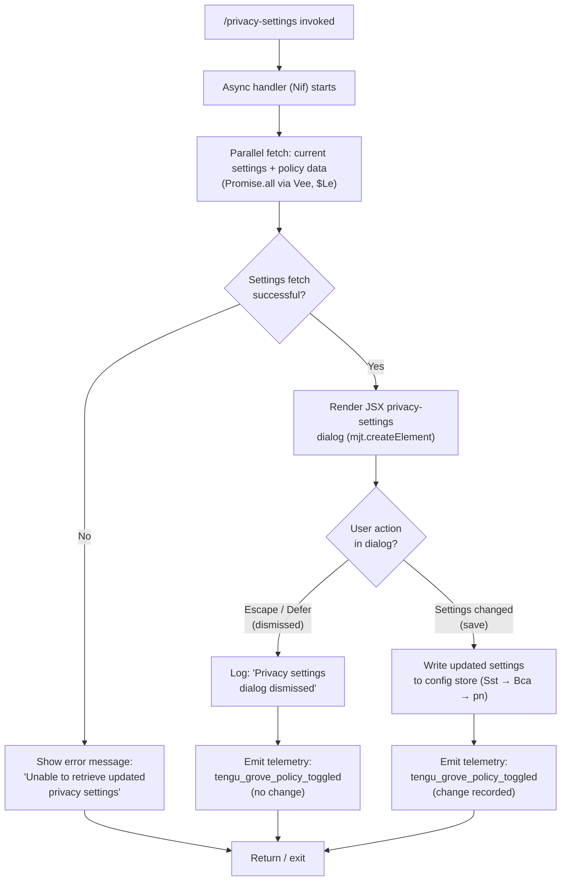

# `/privacy-settings`

> Analysis basis: CC v2.1.185 bundle.js (AST extraction + Claude interpretation)
> Minimum version: v2.1.185

---

## Overview

`/privacy-settings` opens an interactive JSX dialog that allows users to view and update their privacy-related configuration options (e.g., telemetry/data-sharing policies). The handler asynchronously fetches current settings from the configuration store, renders a settings panel, and persists any changes the user makes. When the dialog is dismissed without changes, the event is logged and the operation terminates cleanly.

---

## Registration

| Field | Value |
|---|---|
| type | `local-jsx` |
| name | `privacy-settings` |
| description | `View and update your privacy settings` |
| module_id | `CIl` |
| load_inline | `true` |
| loc_byte | `12722548` |
| loc_byte_end | `12722731` |
| loc_line | `8332` |
| arbor_handler.name | `Nif` |
| arbor_handler.fqn | `claude-2.1.185::Nif` |
| arbor_handler.kind | `AsyncFunction` |
| arbor_handler.resolution_path | `module_id` |
| arbor_handler.n_hits | `0` |

Analysis basis: CC v2.1.185 bundle.js:+12722548

---

## Input Branching

The handler exhibits three distinct behavioral paths based on dialog outcome and config availability:



Analysis basis: CC v2.1.185 bundle.js:+12721539 (handler entry), +12721703 (escape/defer literals), +12721728 (dismissal log literal), +12721855 (error literal), +12722084 (telemetry event)

---

## Behavioral Spec

### 1. Handler Entry and Parallel Initialization (`Nif`)

The top-level async handler is `Nif` (resolved by Arbor via `module_id` → `CIl`). On invocation it immediately spawns a `Promise.all` over two parallel tasks: fetching current privacy policy state (`Vee`) and retrieving the Grove/config layer (`$Le`). This pattern avoids sequential latency on command open.

```
async function privacySettingsHandler(context):
    [policyState, configLayer] = await Promise.all([
        fetchCurrentPrivacyPolicy(),   // Vee
        fetchGroveConfigLayer()        // $Le
    ])
    if policyState is null or unavailable:
        displayError("Unable to retrieve updated privacy settings")
        return
    renderPrivacyDialog(policyState, configLayer)
```

Analysis basis: CC v2.1.185 bundle.js:+12721539, +12721579, +12721592, +12721598, +12721855

### 2. Config Fetch Pipeline (`Sst` → Cache-or-Refresh)

The config subsystem (`Sst`) implements a Grove caching strategy with three internal states:

- **No cache**: Fetches fresh config in background; dialog proceeds with defaults. Log message: `"Grove: No cache, fetching config in background (dialog skipped this session)"` (bundle.js:+7202610).
- **Stale cache**: Returns cached data immediately, triggers background refresh. Log message: `"Grove: Cache stale, returning cached data and refreshing in background"` (bundle.js:+7202730).
- **Fresh cache**: Uses cached data directly. Log message: `"Grove: Using fresh cached config"` (bundle.js:+7202836).

```
function fetchConfigWithGroveCache(cacheKey):
    entry = readConfigCache(cacheKey)         // Ct (config reader)
    if entry is missing:
        scheduleBackgroundFetch()
        log("No cache, fetching in background")
        return defaultSettings
    if isStale(entry, Date.now()):
        scheduleBackgroundRefresh(entry)
        log("Cache stale, returning cached data")
        return entry.data
    log("Using fresh cached config")
    return entry.data
```

Analysis basis: CC v2.1.185 bundle.js:+7202516, +7202555, +7202584, +7202610, +7202730, +7202836

### 3. Config File I/O and Locking (`Ct` / `q_e` / `W7n`)

Reads and writes to the configuration file (`~/.claude.json`) go through a lock-protected subsystem. Key safety behaviors:

- **Lock contention**: If lock acquisition exceeds the expected window, the system emits `tengu_config_lock_contention` and logs `"Lock acquisition took longer than expected - another Claude instance may be running"` (bundle.js:+13966657).
- **Auth-loss prevention**: Before writing, the subsystem re-reads the config and checks that the cached auth credentials are still present. If auth has disappeared in the re-read, the write is refused, emitting `tengu_config_auth_loss_prevented` and logging a safety message referencing GH #3117 (bundle.js:+13967073, +13963526).
- **Backup rotation**: Up to 5 backup copies are kept (literal `5` at bundle.js:+13967676), named with a `.backup.` infix (bundle.js:+13967543). Lock timeout: 60 000 ms (bundle.js:+13967427).
- **Parse error**: If the config file cannot be parsed, `tengu_config_parse_error` is emitted (bundle.js:+13969321).

```
function writeConfigWithLock(newSettings):
    acquireLock(timeout=60000)           // 60s timeout
    reRead = readFileSync(configPath, "utf-8")
    parsed = parseJSON(reRead)
    if parsed missing auth AND cache has auth:
        emitTelemetry("tengu_config_auth_loss_prevented")
        log("Refusing write to avoid wiping auth — GH #3117")
        releaseLock()
        return
    rotateBackups(maxCount=5)
    writeFileSync(configPath, serialize(newSettings))
    releaseLock()
```

Analysis basis: CC v2.1.185 bundle.js:+13965338, +13968746, +13967427, +13967073, +13967676, +13966657, +13969321

### 4. Dialog Dismissal Handling

When the user dismisses the dialog via `escape` or `defer` (literals at bundle.js:+12721703, +12721717), the handler logs the string `"Privacy settings dialog dismissed"` (bundle.js:+12721728) and emits `tengu_grove_policy_toggled` without writing any state changes.

```
function onDialogDismissed(reason):
    // reason is "escape" or "defer"
    log("Privacy settings dialog dismissed")
    emitTelemetry("tengu_grove_policy_toggled", { changed: false })
    return
```

Analysis basis: CC v2.1.185 bundle.js:+12721703, +12721717, +12721728, +12722084

### 5. Settings Save Path (`Bca` → `pn`)

When the user confirms a change, the handler routes through `Bca` (settings-persist coordinator) which delegates to `pn` (global config writer). The writer calls `W7n`, which handles directory creation, timestamping, and backup rotation prior to the atomic write. `Date.now()` is used for backup filenames and freshness tracking (bundle.js:+7203034, +13966518).

```
async function savePrivacySettings(updatedPolicy):
    await configWriteCoordinator(updatedPolicy)  // Bca
    globalConfigWriter(updatedPolicy)            // pn → W7n
    emitTelemetry("tengu_grove_policy_toggled", { changed: true })
```

Analysis basis: CC v2.1.185 bundle.js:+7202690, +7202982, +7203034, +7203069, +13966518

### 6. JSX Rendering

The dialog is rendered via `mjt.createElement` (bundle.js:+12722195). The `Qe` helper (calls `ogt`, bundle.js:+3907) is invoked for UI component assembly. The `"settings"` literal (bundle.js:+12722148) is used as a key or mode identifier for the dialog component.

```
function renderPrivacyDialog(policyState, configLayer):
    component = createElement(PrivacySettingsPanel, {
        mode: "settings",
        policy: policyState,
        config: configLayer,
        onSave: savePrivacySettings,
        onDismiss: onDialogDismissed
    })
    mountDialog(component)
```

Analysis basis: CC v2.1.185 bundle.js:+12722145, +12722148, +12722195

### 7. API Key Handling in Config Layer

The config subsystem references the `ANTHROPIC_API_KEY` environment variable (bundle.js:+3049023) and the `apiKeyHelper` config key (bundle.js:+3049048) when reading authentication state. These are consulted during the auth-loss prevention check described in §3. The key is never logged; sensitive values are replaced with `"[REDACTED]"` in any debug output (bundle.js:+205121).

Analysis basis: CC v2.1.185 bundle.js:+3049023, +3049048, +205121

---

## State & Side Effects

| Item | Detail |
|---|---|
| Telemetry: `tengu_grove_policy_toggled` | Fired on both dialog dismiss and successful save; distinguishes changed vs. unchanged (bundle.js:+12722084) |
| Telemetry: `tengu_config_parse_error` | Fired when `~/.claude.json` cannot be parsed (bundle.js:+13969321) |
| Telemetry: `tengu_config_lock_contention` | Fired when config lock acquisition is slow (bundle.js:+13966746) |
| Telemetry: `tengu_config_stale_write` | Fired when a stale write is detected (bundle.js:+13966882) |
| Telemetry: `tengu_config_auth_loss_prevented` | Fired when a write is refused to protect auth credentials (bundle.js:+13967225) |
| Telemetry: `tengu_config_fallback_write` | Fired when the global-config fallback write path is taken (bundle.js:+13966362) |
| Telemetry: `tengu_mcp_skills` | Fired by the MCP sub-layer reached during parallel init (bundle.js:+6624964) |
| Telemetry: `tengu_bg_retire_pinned_low_mem` | Background worker memory pressure event (bundle.js:+17279714) |
| Telemetry: `tengu_bg_prewarm_per_sweep` | Background worker prewarm sweep event (bundle.js:+17279835) |
| Config file changes | Writes updated privacy policy to `~/.claude.json` on save; rotates up to 5 `.backup.` copies |
| Grove cache | May trigger background config refresh when cache is stale |
| File watcher | `Ebf` registers/deregisters a `B7n.watchFile` / `B7n.unwatchFile` watcher on the config file (bundle.js:+13964841, +13965174) |
| Log output | Dismissal and cache-state strings emitted to debug log (level `"debug"`, bundle.js:+213680) |
| Sound | None observed in depth-2 traversal |

---

## Version History

| Version | Change |
|---|---|
| v2.1.185 | Initial analysis |

---

## Common Mistakes

1. **Dismissing with Escape vs. saving**: Pressing `Escape` or choosing `defer` closes the dialog without writing any changes. Users who expect dismissal to auto-save will find their settings unchanged.
2. **Concurrent Claude instances**: The config file uses a 60-second file lock. Running a second Claude instance simultaneously may trigger `tengu_config_lock_contention` and cause the privacy-settings save to be delayed or skipped.
3. **Auth credential guard (GH #3117)**: If `~/.claude.json` is externally modified between the read and write phases (e.g., by a script), the write may be refused entirely to prevent erasing API keys. Users should not edit the config file while the dialog is open.
4. **Stale cache reads**: The dialog may open with slightly stale settings if the Grove cache is not yet refreshed. A background refresh is triggered automatically but the UI may not reflect it until the next open.
5. **`local-jsx` type requirement**: This command renders a JSX component and requires a terminal environment that supports Claude Code's interactive UI layer. It cannot be invoked in non-interactive or piped contexts.

---

## Appendix — Identifier Mapping

> For bundle debugging only. Identifiers change across versions.

| Identifier | Role |
|---|---|
| `Nif` | Top-level async handler for `/privacy-settings` (arbor_handler) |
| `Sst` | Grove-cached config fetch coordinator |
| `KUe` | Config-layer initializer / reader sub-routine |
| `sa` | Settings accessor helper |
| `yIr` | Settings field reader A |
| `_Ir` | Settings field reader B |
| `hy` | Auth/API-key resolution helper (reads `ANTHROPIC_API_KEY`, `apiKeyHelper`) |
| `vo` | Config value validator / normalizer |
| `Y2` | Array-inclusion checker used in validation |
| `oni` | Additional config option processor |
| `Mc` | Config merge/apply helper |
| `Ct` | Core config file reader (reads `~/.claude.json`) |
| `jt` | Config path resolver |
| `Hko` | Config schema validator |
| `q_e` | Config file I/O with backup rotation |
| `Ebf` | File watcher registration/deregistration |
| `T` | Telemetry dispatch / event logger |
| `QHc` | Log transport layer |
| `j2o` | Log sink (stdout/stderr writer) |
| `e` | Generic utility / event emitter |
| `Pe` | JSON serializer wrapper |
| `t` | Generic parameter / context object |
| `Kc` | String sanitizer (applies `[REDACTED]` masking) |
| `g9o` | Redaction map builder |
| `r` | File-system module reference |
| `n` | String / collection utility |
| `Hqe` | Stream writer helper |
| `s9o` | Raw write helper |
| `n_c` | Append-log writer (session transcript logger) |
| `YWe` | Debounce / batch-flush helper |
| `rpe` | Log rotation helper |
| `Pre` | Directory-error handler (EISDIR guard) |
| `y9o` | Log file path builder |
| `csr` | Log file rename/unlink helper |
| `t_c` | Async append-file writer |
| `qi` | Hook / callback registrar |
| `Bca` | Privacy settings persist coordinator |
| `pn` | Global config writer (delegates to `W7n`) |
| `W7n` | Low-level config file write with lock, backup, and safety checks |
| `LMe` | Lock manager / mutex helper |
| `_ko` | Object-entries iterator for config fields |
| `oWt` | Timestamp utility (`Date.now` wrapper) |
| `AAt` | Auth assertion helper |
| `j` | JSON utility / parse helper |
| `j7n` | Incremental config save helper |
| `a` | MCP state manager / app-state accessor |
| `n3e` | MCP server connection orchestrator |
| `dW` | MCP server slot diff/apply helper |
| `Ort` | MCP server permission checker |
| `W7` | MCP auto-discovery loader |
| `k5` | MCP SDK server builder |
| `NLn` | MCP status color resolver (red/yellow indicators) |
| `Mrt` | MCP server registry updater |
| `Nk` | MCP config normalizer |
| `P_` | MCP config persistence helper |
| `EKr` | MCP config error reporter |
| `o` | Generic array/map utility |
| `s` | Generic set/collection |
| `i` | Generic iterator / stream |
| `Wn` | Wait/sleep utility |
| `l1t` | MCP server list filter |
| `pra` | MCP connection attempt handler |
| `w7r` | MCP auth-cache reader |
| `Vwe` | MCP server identity hasher (SHA-256) |
| `Phn` | MCP permission schema validator |
| `Ohn` | MCP permission evaluator |
| `EI` | MCP permission hash generator |
| `Mhn` | MCP permission store accessor |
| `dc` | Permission data codec |
| `on` | MCP debug logger |
| `oxn` | MCP OAuth connection handler |
| `Lr` | OAuth URL builder |
| `CBd` | OAuth authorize flow handler |
| `vBd` | OAuth callback handler |
| `Sra` | MCP connection result applier |
| `ci` | Async-local-storage store accessor |
| `d0n` | MCP auth-cache path builder |
| `OKr` | MCP connection error handler |
| `Ee` | Error string formatter |
| `m` | Worker/process map |
| `k` | Worker process controller |
| `Uk` | MCP skill registration trigger |
| `ct` | Skill/tool registration helper |
| `yKr` | MCP server include-list checker |
| `w` | Background worker scheduler |
| `kz` | Worker state machine |
| `L` | Background worker sweep / lifecycle manager |
| `v` | Worker instance |
| `Dec` | Worker activity summarizer |
| `Cu` | MCP error logger |
| `gra` | Generic async mapper |
| `U8` | Async-iterable mapper / concurrency controller |
| `Hot` | MCP server port parser (parseInt) |
| `p0n` | MCP server timeout parser (parseInt) |
| `uZn` | MCP update applier |
| `t3e` | MCP tool-hash updater |
| `fw` | MCP connection cleanup handler |
| `hot` | MCP server reconnect helper |
| `mta` | MCP metadata transformer |
| `Szr` | MCP schema resolver |
| `l` | MCP session/client manager |
| `k0l` | Daemon status writer |
| `CQ` | Daemon config validator |
| `Mjt` | Daemon status file path builder |
| `B1o` | MCP global retry / reconnect loop |
| `jLn` | MCP server permission set checker |
| `Bn` | Timed abort controller |
| `c` | Background session tracker |
| `Qe` | UI component factory helper |
| `ogt` | Base UI component renderer |

---

Note: index built via Arbor fallback; some signals (telemetry, literals) may be missing — see arbor-fallback.js.