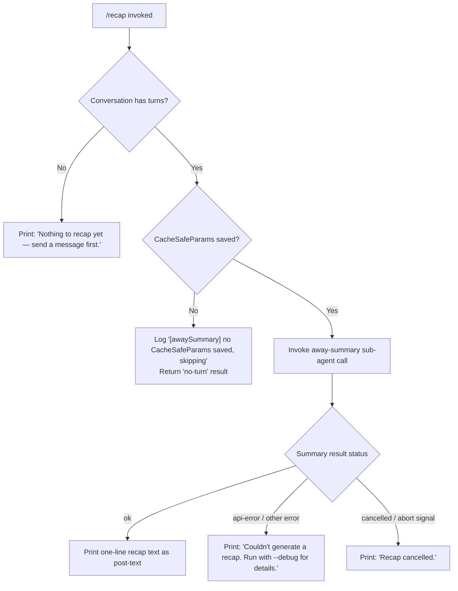

# `/recap`

> Analysis basis: CC v2.1.185 bundle.js (AST extraction + Claude interpretation)
> Minimum version: v2.1.185

---

## Overview

`/recap` is a local slash command that immediately generates a single-line summary of the current session's conversation history. It invokes a lightweight "away summary" sub-agent call (bypassing the normal interactive query loop) and prints the resulting one-liner back to the user. If no conversation turns exist yet, or if the summary call fails, it surfaces a short, descriptive status message instead of leaving the user with a silent failure.

---

## Registration

| Field | Value |
|---|---|
| type | `local` |
| name | `recap` |
| description | `Generate a one-line session recap now` |
| loc_byte | `13234728` |
| loc_byte_end | `13234944` |
| loc_line | `8702` |
| supportsNonInteractive | `false` |
| thinClientDispatch | `post-text` |
| load_inline | `true` |
| load_ident | `Omf` |
| arbor_handler.name | `Omf` |
| arbor_handler.fqn | `claude-2.1.185::Omf` |
| arbor_handler.kind | `AsyncFunction` |
| arbor_handler.resolution_path | `load_ident` (followed inline `Promise.resolve({call: Omf})`) |
| arbor_handler.n_hits | `0` |

Analysis basis: CC v2.1.185 bundle.js:+13234728

---

## Input Branching

The command has four distinct outcome branches based on session state and the result of the summary call:



Analysis basis: CC v2.1.185 bundle.js:+13234478, +13234570, +13234628, +7046885, +7046943

---

## Behavioral Spec

### Handler Entry Point — `recapCommandHandler` (`Omf`)

The handler is an `AsyncFunction` resolved via `load_ident` from an inline `Promise.resolve({call: Omf})` shape on the registration object.

```
async function recapCommandHandler(context):
    result = await awaySessionSummary(context)
    if result is "no-turn" or session has no turns:
        emit post-text: "Nothing to recap yet — send a message first."
        return
    if result.status is "ok":
        emit post-text: result.recapLine
        return
    if result.status is "cancelled":
        emit post-text: "Recap cancelled."
        return
    // api-error or other failure
    emit post-text: "Couldn't generate a recap. Run with --debug for details."
    return
```

Analysis basis: CC v2.1.185 bundle.js:+13234336, +13234478, +13234570, +13234628

---

### Away Summary Invocation — `awaySummaryOrchestrator` (`F1t`)

`F1t` is the core orchestrator called by the handler. It checks prerequisites, sets up an abort controller, registers an abort listener on the session signal, then delegates to the streaming query pipeline.

```
async function awaySummaryOrchestrator(context):
    // Guard: verify CacheSafeParams were previously saved
    if not context.hasCacheSafeParams():
        log("[awaySummary] no CacheSafeParams saved, skipping")
        return {status: "no-turn"}

    abortController = new AbortController()
    context.signal.addEventListener("abort", () => abortController.abort(), {once: true})

    // Invoke the streaming query pipeline with away_summary mode
    queryResult = await streamingQueryPipeline(context, {
        mode: "away_summary",
        signal: abortController.signal,
        toolsAllowed: false   // "Away summary cannot use tools"
    })

    // Flatten sub-agent results into a single recap line
    recapLine = flattenResultMessages(queryResult)
    return {status: queryResult.status, recapLine}
```

Analysis basis: CC v2.1.185 bundle.js:+7046864, +7046883, +7046980, +7047011, +7047058, +7047078, +7047191

---

### Model Selection and Normalisation — `modelNameNormaliser` (`_s`)

Before the summary call is placed, the model identifier is normalised. The normaliser trims whitespace, lower-cases the input, then maps short alias strings to canonical model identifiers:

```
function normaliseModelName(rawName):
    name = rawName.trim().toLowerCase()
    if name matches alias table:
        // Aliases include: "fable", "sonnet", "haiku", "opus", "opusplan", "best"
        // "[1m]" bracket notation is also recognised
        return canonicalModelId(name)
    return applyFallbackFormatting(name)
```

Recognised alias literals (bundle.js:+2291889, +2291951, +2291992, +2292031, +2292070, +2292104, +2291936):
- `"fable"` → Fable model family
- `"opusplan"` → Opus planning variant
- `"sonnet"` → Sonnet family
- `"haiku"` → Haiku family
- `"opus"` → Opus family
- `"best"` → best-available policy
- `"[1m]"` → bracket notation shorthand

Analysis basis: CC v2.1.185 bundle.js:+2291812

---

### Streaming Query Pipeline — `streamingQueryPipeline` (`Jx`)

The pipeline that backs `/recap`'s sub-agent call is the same pipeline used by the main agent loop, with `away_summary` mode suppressing tool use and limiting the turn budget.

```
async function streamingQueryPipeline(context, opts):
    startTime = Date.now()

    // Build request: read app state, compose messages, attach no tools
    appState = context.getAppState()
    messages = composeAwayMessages(appState, opts)

    // Assign a random UUID for this sub-request
    requestId = crypto.randomUUID()

    // Initiate streaming model call
    stream = await callModel(messages, {
        mode: opts.mode,       // "away_summary"
        signal: opts.signal,
        tools: [],             // tools forbidden in away_summary mode
        thread: "main"
    })

    // Consume streaming events; stop at end_turn or stop_sequence
    for each event in stream:
        handle(event)          // text deltas, message_delta, etc.
        if event.type is "end_turn" or "stop_sequence":
            break
        if opts.signal.aborted:
            return {status: "cancelled"}

    context.setAppState(updatedState)
    return {status: "ok", messages: collectedMessages}
```

Key literals observed along this path:
- Thread label: `"main"` (bundle.js:+10850448)
- Away mode tag: `"away_summary"` (bundle.js:+7047259)
- No-tool enforcement message: `"Away summary cannot use tools"` (bundle.js:+7047191)
- Abort event name: `"abort"` (bundle.js:+7046999)
- Fallback result tag: `"no-turn"` (bundle.js:+7046943)

Analysis basis: CC v2.1.185 bundle.js:+10850081, +10850204, +10850473, +10850491, +10850515, +10850535, +10850882

---

### Result Flattening — `resultFlatMapper` (`Aaa`)

After the stream completes, a flat-map pass over the collected assistant messages extracts the textual content.

```
function flattenResultMessages(queryResult):
    lines = queryResult.messages.flatMap(msg => extractTextContent(msg))
    return lines.join(", ")
```

Separator literal: `", "` (bundle.js:+10851538)

Analysis basis: CC v2.1.185 bundle.js:+7047509, +7047719

---

### Transcript / Session-Log Writer — `sessionLogWriter` (`n_c`)

During and after the recap call the session log writer persists the away-summary turn to disk. It creates the log directory if absent, appends to the session file, and rotates/truncates the file when it exceeds a threshold.

```
async function sessionLogWriter(context, messages):
    logDir = path.dirname(context.logPath)
    ensure directory exists: logDir          // uU.mkdir
    byteLength = Buffer.byteLength(serialised)
    append serialised messages to logFile    // uU.appendFile
    if logFile size exceeds rotation threshold:
        rename old file → backup (.txt → trimmed)
        rewrite file with compacted content  // uU.rename / uU.unlink
    register cleanup hook via hook-registry  // qi → B2o.register
```

Analysis basis: CC v2.1.185 bundle.js:+213192, +213217, +213225, +213255, +213345, +213394, +213400, +213433, +213450, +213459, +213555

---

## State & Side Effects

| Item | Detail |
|---|---|
| Telemetry (via main query pipeline) | `tengu_auto_compact_rapid_refill_breaker`, `tengu_auto_compact_succeeded`, `tengu_ptl_surfaced_to_user`, `tengu_refusal_fallback_suppressed`, `tengu_rotunda_pennant_applied`, `tengu_rotunda_pennant_tools`, `tengu_refusal_fallback_dialog_suppressed`, `tengu_refusal_fallback_prompt_shown`, `tengu_refusal_fallback_prompt_choice`, `tengu_fallback_credit_forfeited`, `tengu_refusal_fallback_triggered`, `tengu_orphaned_messages_tombstoned`, `tengu_refusal_fallback_supersedes`, `tengu_model_fallback_triggered`, `tengu_query_error`, `tengu_model_response_keyword_detected`, `tengu_malformed_tool_use_retry_outcome`, `tengu_malformed_tool_use_response`, `tengu_stop_hook_block_count`, `tengu_mcp_tool_result_ended_turn`, `tengu_loop_dynamic_wakeup_ends_turn`, `tengu_post_autocompact_turn`, `tengu_query_before_attachments`, `tengu_query_after_attachments`, `tengu_mcp_tools_refreshed_mid_turn`, `tengu_feature_ok`, `tengu_feature_bad`, `tengu_forked_agent_default_turns_exceeded`, `tengu_fork_agent_query` |
| Hook registration | Session-log cleanup hook registered via `B2o.register` (bundle.js:+69538, +213555) |
| appState changes | `setAppState` called on the shared context object after the away-summary stream completes (bundle.js:+10848211) |
| Session log | Away-summary turn appended to the on-disk session log file; file may be rotated (bundle.js:+213005, +212673) |
| Tool use | Explicitly forbidden during `/recap` — `"Away summary cannot use tools"` (bundle.js:+7047191) |
| Non-interactive support | `supportsNonInteractive: false` — command cannot be invoked in `--non-interactive` / headless mode |
| Output channel | `thinClientDispatch: "post-text"` — result is emitted as a post-turn text block |
| Sound | <!-- TODO: not found in depth-2 traversal; needs --depth 4 --> |

---

## Version History

| Version | Change |
|---|---|
| v2.1.185 | Initial analysis |

---

## Common Mistakes

1. **Running `/recap` before any conversation turn**: The command requires at least one prior message in the session. If invoked immediately after starting Claude Code, it will respond with `"Nothing to recap yet — send a message first."` (bundle.js:+13234478).
2. **Expecting tool execution**: `/recap` explicitly disallows tool use during its sub-agent call. Any assumption that it will trigger file reads, searches, or shell commands is incorrect (bundle.js:+7047191).
3. **Using in non-interactive / headless mode**: `supportsNonInteractive` is `false`; passing `/recap` as a flag-driven prompt in `--print` or `--non-interactive` mode is not supported by the registration (bundle.js:+13234728).
4. **Confusing the output channel**: The recap text is delivered as a `post-text` dispatch (`thinClientDispatch: "post-text"`), not as an ordinary assistant message turn. Thin-client integrations that only listen for standard assistant messages may miss it.
5. **Assuming the recap is always available after an API error**: When the underlying summary call fails (network outage, rate-limit, etc.), the command surfaces a generic failure string and does not retry. Run with `--debug` to inspect the underlying error.

---

## Appendix — Identifier Mapping

> For bundle debugging only. Identifiers change across versions.

| Identifier | Role |
|---|---|
| `Omf` | `recapCommandHandler` — async handler entry point for `/recap` (load_ident target) |
| `F1t` | `awaySummaryOrchestrator` — checks CacheSafeParams, sets up abort controller, calls streaming pipeline |
| `tle` | `awaySessionQueryEntry` — entry into the session query path for away-summary mode |
| `js` | `modelRequestBuilder` — assembles the model API request object |
| `jK` | `requestFieldsPopulator` — populates standard request fields |
| `_s` | `modelNameNormaliser` — trims/lowercases model name and maps aliases |
| `Pg` | `modelAliasResolver` — resolves aliases to canonical model IDs |
| `T` | `messageFormatter` — formats messages for the model API |
| `QHc` | `systemPromptBuilder` — constructs the system prompt block |
| `j2o` | `systemPromptHelpers` — helper utilities for system prompt construction |
| `Pe` | `jsonStringifyWrapper` — wraps JSON.stringify for safe serialisation |
| `Kc` | `modelIdNormaliser` — applies final model-ID formatting and slicing |
| `g9o` | `modelFamilyMapper` — maps model identifiers to family buckets |
| `Hqe` | `streamWriter` — writes streaming output |
| `s9o` | `outputWriter` — low-level write to output stream |
| `n_c` | `sessionLogWriter` — appends turn data to the on-disk session log |
| `YWe` | `batchFlushScheduler` — batches and schedules log flushes via setTimeout/setImmediate |
| `rpe` | `logRotationHandler` — handles log-file rotation and compaction |
| `Pre` | `errorCodeHandler` — handles EISDIR and related FS error codes |
| `y9o` | `logPathJoiner` — joins path segments for log file location |
| `csr` | `logFileRotator` — stat/rename/unlink logic for rotating .txt log files |
| `t_c` | `logAppendWorker` — mkdir + appendFile worker, bound and called via `.then` |
| `qi` | `hookRegistrar` — registers cleanup hooks via B2o.register |
| `Jx` | `streamingQueryPipeline` — main streaming query pipeline used for the away-summary call |
| `v2n` | `agentQueryCore` — core agent query: reads app state, composes messages, calls model |
| `rN` | `appStateReader` — reads fields from app state |
| `QAe` | `sessionDumpLoader` — load/dump session state |
| `nwe` | `messageListBuilder` — builds ordered message list for the API call |
| `ZQi` | `contextWindowPreparer` — prepares context window before model call |
| `S6n` | `systemPromptAssembler` — assembles final system prompt string |
| `fR` | `requestIdGenerator` — generates hex request IDs via randomBytes |
| `w2n` | `streamSetup` — sets up streaming infrastructure |
| `bce` | `toolRegistryAccessor` — accesses the registered tool registry |
| `Au` | `hookQueueAccessor` — accesses hook queue via qi |
| `Y6e` | `toolFilterPipeline` — filters/transforms available tools for the current call |
| `v6` | `turnDispatcher` — dispatches a completed turn to the result pipeline |
| `R3p` | `mainAgentQueryLoop` — the full agent API loop (also reused for away-summary, tools disabled) |
| `x5n` | `subagentExitHandler` — handles subagent exit and cleans up registries |
| `ke` | `featureOkReporter` — fires `tengu_feature_ok` telemetry |
| `Re` | `featureBadReporter` — fires `tengu_feature_bad` telemetry |
| `B0` | `turnStateManager` — manages per-turn state flags |
| `D4e` | `postTurnSummaryChecker` — checks J_p set for post-turn summary eligibility |
| `HRa` | `postTurnSummaryTrigger` — triggers post-turn summary when conditions met |
| `f` | `workerLifecycleManager` — manages background worker lifecycle (spawn, kill, SIGKILL) |
| `M` | `scheduledTaskRunner` — runs scheduled background tasks |
| `Bn` | `timeoutAbortHelper` — sets up timeout with abort and clearTimeout |
| `YKn` | `macosMemoryLogger` — logs macOS memory stats via `tengu_bg_low_mem_mb` |
| `B$e` | `tempFileCleanup` — lstat/rm/readFile pass for temp file cleanup |
| `De` | `errorLogger` — logs errors via QJ.logError and pushes to hKe |
| `$` | `settledRetirer` — retires settled promises via zlt/R6 |
| `ct` | `cacheKeyManager` — manages cache key sets (wxt, Lxt, pIe, u8) |
| `NNo` | `daemonSocketConnector` — connects to the daemon socket, handles auth |
| `jNo` | `daemonJobRunner` — manages daemon job lifecycle (claim, rm, unlink, roster) |
| `p` | `shutdownHandler` — handles forced shutdown via process.exit and u.abort |
| `dn` | `disposableCleanup` — general cleanup for disposable resources |
| `Ue` | `uiRepaintTrigger` — triggers a UI repaint (via ogt) |
| `cce` | `activeContextFilter` — filters and pushes active context entries |
| `wb` | `contextEntryLocator` — locates a context entry in the registry |
| `d_p` | `contextEntryFinder` — `e.find` wrapper for context entry lookup |
| `Y3p` | `forkedAgentRunner` — runs a forked sub-agent with turn limit enforcement |
| `Ur` | `nonconformingResultHandler` — handles nonconforming result shapes (ey, Qe) |
| `Pn` | `stdioProxySetup` — sets up stdio proxy with randomUUID for the summary call |
| `g` | `bufferFrameProcessor` — Buffer.concat + indexOf frame processor |
| `h` | `socketTimeoutWrapper` — wraps socket with setTimeout |
| `m` | `workerKillSweep` — iterates worker values and kills stale workers |
| `Qp` | `streamEndEmitter` — emits end event on the stream |
| `T6f` | `daemonProtocolHandler` — full daemon protocol message handler (ping, nudge, dispatch, reply, etc.) |
| `Ee` | `stringCaster` — String() cast utility |
| `Aaa` | `resultFlatMapper` — flatMap over result messages to extract recap text |

---

Note: index built via Arbor fallback; some signals (telemetry, literals) may be missing — see arbor-fallback.js.