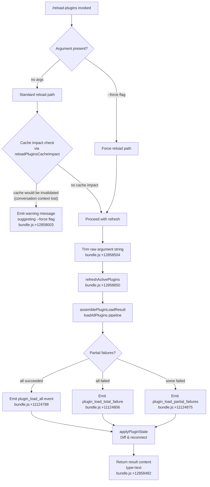

# `/reload-plugins`

> Analysis basis: CC v2.1.185 bundle.js (AST extraction + Claude interpretation)
> Minimum version: v2.1.185

---

## Overview

`/reload-plugins` activates pending plugin changes in the current Claude Code session without requiring a full restart. It orchestrates a multi-phase pipeline: diffing the current plugin state against freshly-loaded configuration, reconnecting MCP servers, re-registering hooks and LSP servers, and optionally bypassing the conversation-cache guard when `--force` is supplied.

---

## Registration

| Field | Value |
|---|---|
| type | `local` |
| name | `reload-plugins` |
| description | `Activate pending plugin changes in the current session` |
| argumentHint | `[--force]` |
| supportsNonInteractive | `false` |
| thinClientDispatch | `control-request` |
| module_id | `Zvl` |
| load_inline | `true` |
| loc_byte | `12859420` |
| loc_byte_end | `12859664` |
| loc_line | `8535` |
| arbor_handler.name | `glf` |
| arbor_handler.fqn | `claude-2.1.185::glf` |
| arbor_handler.kind | `AsyncFunction` |
| arbor_handler.resolution_path | `module_id` |
| arbor_handler.n_hits | `0` |

Analysis basis: CC v2.1.185 bundle.js:+12859420

---

## Input Branching

Four distinct paths exist based on argument presence and cache-impact state; a Mermaid flowchart is used.



---

## Behavioral Spec

### Top-Level Handler (`glf`)

The primary handler is the async function `glf` (FQN `claude-2.1.185::glf`), resolved via the `module_id` path through module `Zvl`.

```
async function reloadPluginsHandler(context, rawArgument):
    // Step 1: log telemetry for cache impact
    cacheImpact = computeCacheImpact(context)           // calls reloadPluginsCacheImpact (Qvl → j)
    emit_telemetry("tengu_reload_plugins_cache_impact", cacheImpact)
    // bundle.js:+12857412, +12858724

    // Step 2: parse --force flag
    trimmedArg = rawArgument.trim()                    // bundle.js:+12858504
    forceFlag = trimmedArg.includes("--force")         // literal "--force" at bundle.js:+12858540
                                                       // parsed key "force" at bundle.js:+12858555

    // Step 3: guard against cache invalidation unless --force
    if NOT forceFlag AND cacheImpact.wouldInvalidateCache:
        return textContent(
            "… the whole conversation instead of using the cache. "
            "Run /reload-plugins --force to apply."
        )
        // literal fragment at bundle.js:+12858003

    // Step 4: run the full plugin refresh pipeline
    appState = context.getAppState()                   // bundle.js:+12858618
    result   = await refreshActivePlugins(appState)    // I_e, bundle.js:+12858850

    // Step 5: convert plugin diff summary to display items
    displayItems = formatPluginResultItems(result)     // jie, bundle.js:+12858925
    sessionState = updateSessionPluginState(result)    // s_e, bundle.js:+12858882

    return { type: "text", content: displayItems }    // bundle.js:+12858482
```

Analysis basis: CC v2.1.185 bundle.js:+12858118 (entry edge `glf` → `jS`)

---

### Cache-Impact Check (`reloadPluginsCacheImpact`)

```
function reloadPluginsCacheImpact(context):
    // Consults current message history to determine whether reloading
    // would force re-processing the whole conversation (cache bust).
    // Returns an object with a boolean cache-impact indicator.
    // Internally delegates to utility j (bundle.js:+12857410).
    return j(context)
```

Analysis basis: CC v2.1.185 bundle.js:+12857410

---

### Full Plugin Refresh Pipeline (`refreshActivePlugins` / `I_e`)

This is the heaviest sub-operation. It clears caches, loads all plugin definitions, diffs against the active state, and applies changes.

```
async function refreshActivePlugins(appState):
    log("refreshActivePlugins: clearing all plugin caches")
    // literal at bundle.js:+12855089

    // 1. Clear installed-plugins cache
    clearInstalledPluginsCache()                       // Bh, bundle.js:+12855147
    //    → clearSkillIndexCache (Y5 → e.clearSkillIndexCache, bundle.js:+13436797)
    //    → A5 (s5t.clear, bundle.js:+10980078)

    // 2. Load all plugin sources in parallel
    [mcpServers, lspServers, hooks] =
        await Promise.all([
            loadMcpServers(appState),                  // xee, bundle.js:+12855393
            loadLspConfig(appState),                   // o3e, bundle.js:+12855555
            loadHooksConfig(appState),                 // g0n, bundle.js:+12855683
        ])
    // bundle.js:+12855196

    // 3. Diff current vs loaded
    addedMcp    = diffPluginSets(current.mcp,  mcpServers)   // Alf, bundle.js:+12855766
    addedLsp    = diffPluginSets(current.lsp,  lspServers)   // hlf, bundle.js:+12855799

    // 4. Emit lifecycle event
    PF.emit("pluginsReloaded", result)                 // bundle.js:+12856196

    // 5. Aggregate error/warning summary
    errors   = collectErrors([addedMcp, addedLsp])    // Ee, bundle.js:+12856027
    warnings = collectWarnings(result)                 // De, bundle.js:+12855970

    return { addedMcp, addedLsp, errors, warnings }
```

Analysis basis: CC v2.1.185 bundle.js:+12855087

---

### Plugin Load Assembly (`assemblePluginLoadResult` / `sHo`)

Handles the actual loading of marketplace and local plugins, tracking outcomes per plugin.

```
async function assemblePluginLoadResult(pluginList, options):
    results = []
    failures = []

    for each plugin in pluginList:
        try:
            outcome = await loadSinglePlugin(plugin)   // oHo per plugin
            results.push(outcome)
        catch err:
            failures.push({ plugin, err })

    // Classify outcomes
    if failures.length == 0:
        emit_metric("plugin_load_all")                 // bundle.js:+11124788
    else if results.length == 0:
        emit_metric("plugin_load_total_failure")       // bundle.js:+11124806
    else:
        emit_metric("plugin_load_partial_failures")    // bundle.js:+11124875

    // Guard: if originalCwd changed mid-scan, skip side-effects
    if cwdChangedDuringScan:
        log("assemblePluginLoadResult: originalCwd changed mid-scan; skipping side-effects (stale early-kick)")
        // literal at bundle.js:+11124941
        return earlyResult

    return { results, failures }
```

Analysis basis: CC v2.1.185 bundle.js:+11123799

---

### MCP Server Reload (`loadMcpServersFromConfig` / `W7`)

Reads MCP configuration from all settings scopes and reconciles active connections.

```
async function loadMcpServersFromConfig(appState):
    // Read from all config scopes (projectSettings, userSettings, localSettings)
    // literals at bundle.js:+6561761, +6561784, +6561805
    configs = [
        readProjectMcpConfig(),   // Hb → Ihe.parse, bundle.js:+6561933
        readUserMcpConfig(),
        readLocalMcpConfig(),
    ]

    // Merge, validate, and deduplicate (mcp-server-suppressed-duplicate)
    // literal at bundle.js:+6565231
    merged = mergeMcpConfigs(configs)   // SQi, bundle.js:+6565096

    // Kill any MCP processes whose config has been removed or changed
    for server in currentlyRunning:
        if server not in merged OR config changed:
            server.kill()              // m → k.kill, bundle.js:+17277038

    // Start / reconnect servers now approved or pending
    for server in merged:
        if server.status == "approved":   // literal at bundle.js:+6564461
            connectMcpServer(server)
        else if server.status == "pending":  // literal at bundle.js:+6564488
            queueForApproval(server)

    return merged
```

Analysis basis: CC v2.1.185 bundle.js:+6563487

---

### Session Plugin State Update (`s_e`)

Synchronises the in-memory plugin registry after a reload.

```
async function updateSessionPluginState(reloadResult):
    current = sessionState.get()                       // bundle.js:+11999605

    // Merge newly-loaded marketplace entries
    newMarketplaceEntries = lookupKnownMarketplaces()  // NM → Im, bundle.js:+11019300
    //   reads known_marketplaces.json (literal at bundle.js:+11017808)

    // Reconcile installed plugins vs current session
    for each plugin in reloadResult.installed:
        resolved = resolvePluginScope(plugin)          // X$e, bundle.js:+11999790
        if resolved.scope == "managed":
            throw Error("Cannot install plugins to managed scope")
            // literal at bundle.js:+4321442

        validatePermissions(resolved)                  // I5t subtree

    sessionState.set(mergedState)                      // bundle.js:+11999641
```

Analysis basis: CC v2.1.185 bundle.js:+11999605

---

### Result Formatting (`jie`)

Converts the raw reload result into display-ready text lines.

```
function formatPluginResultItems(result):
    lines = result.entries.map(entry =>
        formatEntry(entry)    // gs → e.includes / e.split, bundle.js:+4320965
    )
    joined = lines.join(", ")  // bundle.js:+4340696
    // Applies Tn (type-tag helper) per item  // bundle.js:+4340764
    return joined
```

Analysis basis: CC v2.1.185 bundle.js:+12858925

---

### Safe-Mode Guard (`lhe` / plugin hook registration)

```
function registerPluginHooks(appState):
    if appState.safeMode:
        log("Safe mode: skipping plugin hook registration")
        // literal at bundle.js:+5208492
        return

    registerHooks(appState)   // pBi subtree
```

Analysis basis: CC v2.1.185 bundle.js:+5208490

---

## State & Side Effects

| Item | Detail |
|---|---|
| Telemetry | `tengu_reload_plugins_cache_impact` (bundle.js:+12857412); `plugin_load_all` (bundle.js:+11124788); `plugin_load_total_failure` (bundle.js:+11124806); `plugin_load_partial_failures` (bundle.js:+11124875) |
| Cache cleared | Installed-plugins cache (`s5t.clear`) and skill-index cache (`e.clearSkillIndexCache`) are wiped on every invocation (with or without `--force`) |
| MCP processes | Running MCP server child processes are killed and restarted for any server whose configuration changed |
| Hook registration | Plugin hooks are re-registered unless `--safe-mode` is active |
| Session state | `sessionState` map updated in-place with merged plugin registry |
| Event emitted | `PF.emit("pluginsReloaded", …)` fires after diff is computed (bundle.js:+12856196) |
| appState changes | `appState.getAppState()` is read (bundle.js:+12858618); downstream maps `H`, `M`, `K`, `Y`, `le`, `pe`, `ee`, `X`, `W`, `se` are mutated via `I5t` subtree |
| Sound | None observed in traversal |
| thinClientDispatch | `control-request` — in thin-client mode the command is forwarded as a control request rather than executed locally |

---

## Version History

| Version | Change |
|---|---|
| v2.1.185 | Initial analysis |

---

## Common Mistakes

1. **Omitting `--force` when the conversation cache would be busted.** Without `--force`, if the reload would invalidate the conversation cache, the command aborts and prints a warning directing the user to re-run with `--force`. Users who see the cache warning must explicitly opt in.
2. **Expecting interactive output in non-interactive mode.** `supportsNonInteractive: false` means the command is not designed for scripted/piped invocations; running it in non-interactive pipelines will fail or produce no output.
3. **Assuming the command starts fresh MCP server processes unconditionally.** Only servers whose configuration actually changed (or that were not previously running) are restarted. Unchanged servers remain live.
4. **Using the command in safe mode and expecting hook changes to apply.** When Claude Code is launched with `--safe-mode`, plugin hook registration is explicitly skipped regardless of what the reload discovers.
5. **Running the command after changing the working directory.** If `originalCwd` changes between when the reload is initiated and when plugin scanning completes, side-effects are silently skipped (stale-early-kick guard, bundle.js:+11124941).

---

## Appendix — Identifier Mapping

> For bundle debugging only. Identifiers change across versions.

| Identifier | Role |
|---|---|
| `glf` | Primary handler (`AsyncFunction`) for `/reload-plugins` |
| `jS` | Log/trace helper called first in handler |
| `dd` | Dependency utility invoked by `jS` and `glf` |
| `aPe` | Sub-utility of `dd` |
| `LX` | Secondary setup helper called from `glf` |
| `Tn` | Type-tag / display formatting utility |
| `Jvl` | Cache-impact evaluation coordinator |
| `CKr` | MCP server orchestrator called from `Jvl` |
| `eEe` | Sub-helper of `CKr` |
| `wKr` | MCP plugin loader invoked by `CKr` |
| `sHo` | `assemblePluginLoadResult` — plugin load aggregator |
| `oHo` | Per-plugin load worker |
| `W7` | MCP server configuration reconciler |
| `hc` | Config file reader (project/user/local) |
| `Hb` | Settings-scope config parser |
| `Dee` | Plugin source downloader |
| `iE` | Policy/settings-type classifier |
| `Nhn` | MCP transport type validator (`http`, `dynamic`) |
| `yy` | Utility helper in MCP reconciler |
| `T` | Generic tagged-result constructor (debug/warn/error) |
| `DLn` | Plugin entry diff/merge helper |
| `Net` | Network error helper |
| `m` | Kill-all-running-servers utility |
| `f` | Per-server lifecycle manager (spawn/kill/memory) |
| `Nk` | Plugin scope resolver |
| `SQi` | MCP server deduplication map builder |
| `L` | Background worker lifecycle scheduler |
| `p` | Forced-shutdown helper |
| `x` | Write-to-client helper |
| `r` | Registered-connection tracker |
| `Fs` | CLI error emitter |
| `hP` | Argument hint / flag parser |
| `MMt` | Flag-string normaliser |
| `BUe` | HIPAA-mode flag reader |
| `lGr` | `auto:`-prefix numeric flag parser |
| `hTd` | `auto`-string sentinel checker |
| `st` | String coercion wrapper |
| `Hl` | Secondary string coercion |
| `wr` | Provider-type string normaliser |
| `Mu` | Provider enum helper |
| `Zln` | Provider value object |
| `g7` | Case-insensitive flag lookup |
| `HTd` | Tool-search flag decoder |
| `ct` | Capability-flag cache accessor |
| `ry` | Output-token stat helper |
| `Qvl` | `reloadPluginsCacheImpact` — cache-impact calculator |
| `j` | Inner cache-impact predicate |
| `Hlf` | Plugin name splitter |
| `I_e` | `refreshActivePlugins` — top-level plugin refresh orchestrator |
| `bnl` | Cache-clear log helper |
| `Bh` | Installed-plugins cache invalidator |
| `f5p` | Plugin subsystem initialiser |
| `aw` | Plugin activation broadcaster |
| `dGn` | Hook-discovery utility |
| `hGn` | LSP-discovery utility |
| `wvn` | Component-discovery utility |
| `P8r` | Plugin root path resolver |
| `De` | Error-collection reducer |
| `xLn` | Plugin extension loader |
| `Ugo` | Plugin upgrade handler |
| `anl` | Plugin announce helper |
| `AM` | Skill-index cache clearer |
| `Y5` | Promise-based cache clear wrapper |
| `Ytl` | Post-clear telemetry |
| `v6e` | Plugin output token tracker |
| `GHe` | LSP subsystem hook |
| `Y6r` | Plugin version reconciler |
| `A5` | Plugin set cache (`s5t`) clearer |
| `lPa` | Load-path accumulator |
| `Bia` | Plugin block-list checker |
| `Ar` | Generic async resolver |
| `gx` | Async scheduler base |
| `xee` | Plugin file scanner (`.mcpb`, `.dxt` sources) |
| `cW` | Extension-type detector |
| `poe` | Plugin warn emitter |
| `fKr` | MCPB archive file reader |
| `jt` | File-system join helper |
| `Mn` | Error normaliser |
| `Gt` | JSON.parse wrapper |
| `iQi` | Plugin metadata validator |
| `oOt` | Plugin on-disk installer |
| `Ee` | String coercion (to `String`) |
| `o3e` | LSP config file reader (`.lsp.json`) |
| `J5d` | LSP extension entry loader |
| `X5d` | LSP path relativiser |
| `l` | Background-job log emitter |
| `k0l` | Daemon status writer |
| `CQ` | Vitals/metric collector |
| `ci` | AsyncLocalStorage store reader |
| `Mjt` | `daemon.status.json` path builder |
| `Pe` | JSON.stringify wrapper |
| `c` | Daemon `Tn`-writer |
| `g0n` | Hook config loader / LSP-extension conflict detector |
| `a` | MCP-state applier (orchestrates `n3e`, `uZn`, `mta`) |
| `n3e` | MCP server connection initiator |
| `uZn` | `applyConnectionResult` — connection result applier |
| `mta` | MCP server status mapper |
| `B1o` | MCP client list reconciler |
| `Alf` | MCP server diff filter (added) |
| `Xvl` | MCP server set helper |
| `hlf` | LSP server diff filter (added) |
| `lhe` | Plugin hook registrar (safe-mode aware) |
| `Ul` | Hook registration helper |
| `GKt` | Safe-mode flag accessor |
| `s_e` | Session plugin state updater |
| `NM` | Known-marketplace catalogue reader |
| `Im` | Marketplace JSON file reader |
| `yGn` | Marketplace file path builder |
| `X$e` | Plugin scope resolver (managed vs user) |
| `xn` | Plugin metadata normaliser |
| `Mnn` | Plugin identity builder |
| `B2` | Plugin capability flag set |
| `cM` | Managed-scope error thrower |
| `gs` | Scope string classifier |
| `$I` | Git-source URL parser and policy checker |
| `wsa` | URL protocol extractor |
| `E1t` | Host/path pattern matcher |
| `B0n` | Host pattern normaliser |
| `Lsa` | Host pattern evaluator |
| `xsa` | Path pattern evaluator |
| `j6d` | npm/github source resolver |
| `HW` | Host-pattern normaliser |
| `Dsa` | Composite source-pattern matcher |
| `vsa` | Pattern predicate builder |
| `V6` | Plugin marketplace.json reader |
| `A5t` | `.claude-plugin` directory scanner |
| `jgo` | marketplace.json parser |
| `dn` | Debug logger |
| `$k` | Full plugin installation resolver |
| `qgo` | Plugin file-based config reader |
| `uYp` | Permission set checker |
| `I5t` | Plugin installation pipeline (dependency resolution, version check, hook wiring) |
| `PL` | Policy list builder |
| `xGn` | Plugin policy evaluator |
| `bbt` | Relative-path (`./`) checker |
| `u` | Plugin daemon start/stop controller |
| `ke` | Daemon-start telemetry emitter (`tengu_feature_ok`) |
| `Re` | Daemon-stop telemetry emitter (`tengu_feature_bad`) |
| `rF` | Plugin registration tracker |
| `SG` | Background-session shutdown coordinator |
| `Mt` | Async-context store accessor |
| `Qen` | Store-key resolver |
| `OM` | Plugin state-file loader |
| `Vgo` | Plugin state JSON reader |
| `Kgo` | Plugin-entry iterator |
| `_5t` | Plugin state writer |
| `A` | Background-process adopter |
| `H` | Active plugin map |
| `I4e` | Teammate-mailbox message marker |
| `iP` | Plugin namespace resolver |
| `qx` | Plugin namespace qualifier |
| `sTn` | SemVer satisfies checker |
| `y` | Plugin activation-state tracker |
| `l1t` | Plugin listed-state helper |
| `xht` | Plugin cache-hit tracker |
| `nDi` | Dependency graph cycle detector |
| `BD` | Flag-settings helper |
| `Qgt` | Capability flag accessor |
| `g` | MCP transport frame reader |
| `h` | MCP connection timer helper |
| `Qp` | MCP stream ender |
| `T6f` | MCP transport multiplexer (all protocol messages) |
| `k` | Supervisor socket writer |
| `Uuc` | Real-path resolver |
| `Gp` | Supervisor connection status |
| `j6f` | Supervisor command builder |
| `d` | Supervisor daemon writer |
| `M` | Plugin settings persister |
| `Dtt` | Settings-file reader |
| `CMt` | Settings-file writer |
| `J1i` | Settings entry filter |
| `q` | Plugin queue |
| `Jnc` | Plural-message formatter |
| `fae` | Settings save-and-reload helper |
| `P` | Unref timer wrapper |
| `knl` | Dependency-stack resolver |
| `D` | Deferred write scheduler |
| `N` | Plugin notification map |
| `co` | Settings-file read/write coordinator |
| `QA` | Settings schema loader |
| `Thr` | Settings schema validator |
| `bv` | Error message builder |
| `RAr` | Settings-change timestamp recorder |
| `c1e` | Settings default filler |
| `MSt` | Atomic file write helper |
| `mH` | Cache clear on settings write |
| `Ves` | `.gitignore` tracker writer |
| `J9` | Settings path builder |
| `Pt` | Sad-path telemetry emitter (`tengu_feature_sad`) |
| `_j` | Settings-load instrumentation |
| `kGn` | Plugin install path validator |
| `W` | Scheduled-task manager |
| `R` | Background task tracker |
| `vMt` | Task window calculator |
| `ZIn` | Task backoff calculator |
| `Xnc` | Boolean coercion helper |
| `B` | Idle-timeout writer |
| `Dre` | Set-has guard |
| `se` | Main session state container |
| `Rqn` | Session telemetry aggregator |
| `zv` | Terminal multiplexer detector |
| `V` | Keyboard-event interceptor |
| `Ah` | Async helper |
| `Oge` | Live-session lister |
| `ece` | Session event consumer |
| `Qe` | Process-exit trap |
| `ro` | Module init bootstrapper |
| `xe` | Message queue slice helper |
| `v` | Message store |
| `qe` | Message history trimmer |
| `nu` | UUID generator |
| `Yb` | Window-size tracker |
| `Gy` | Session state guard |
| `Iqt` | Project file renamer |
| `fX` | Audit logger |
| `U2n` | Session diagnostics |
| `V6e` | Secondary audit logger |
| `sye` | Session init orchestrator |
| `mDn` | Terminal-journal writer |
| `Lqt` | Late-init hook |
| `p8e` | Foreground session attacher |
| `f8e` | Fork/resume session handler |
| `Oe` | Race-with-timeout helper |
| `Ke` | Edge-case handler |
| `wqt` | Session idle monitor |
| `YK` | Session timing tracker |
| `Wue` | Secondary audit helper |
| `xqt` | Session startup runner |
| `jue` | Session metadata writer |
| `w` | Session focus state monitor |
| `Ue` | Process-exit trap (secondary) |
| `Ho` | Error/string coercer |
| `le` | MCP server live-connection store |
| `fOt` | MCP OAuth token revoker |
| `fw` | MCP server cleanup helper |
| `qLn` | MCP server filter (active) |
| `Urt` | MCP server filter (disconnected) |
| `Frt` | MCP connection finaliser |
| `ve` | Pending background task queue |
| `yxt` | Background task poster |
| `pe` | Plugin error accumulator |
| `dt` | Message window slicer |
| `HDt` | SemVer range validator |
| `o4r` | Range pre-checker |
| `vGn` | Plugin git subdir extractor |
| `Jgo` | Git checkout helper |
| `S5t` | Plugin source normaliser |
| `LGn` | Git tag resolver / npm version fetcher |
| `N5p` | Plugin protocol prefix checker |
| `Un` | Plugin resolve logger |
| `B8` | Numeric type enforcer |
| `wGn` | Plugin source string replacer |
| `T5t` | Plugin install/update runner |
| `Tpt` | Plugin package installer |
| `SGn` | Plugin install status builder |
| `Rnl` | Plugin rollback helper |
| `eue` | Plugin content hasher |
| `UN` | Plugin directory path builder |
| `IGn` | Plugin directory scanner |
| `gq` | Plugin string helper |
| `qke` | Plugin path re-resolver |
| `mGn` | Plugin clean-up runner |
| `zgo` | Plugin state updater (Added/Updated) |
| `$` | Permission policy evaluator |
| `zlt` | Permission rule parser |
| `R6` | Permission result renderer |
| `K` | Active PTY writer |
| `Q` | PTY output stream |
| `v6f` | PTY escape-sequence filter |
| `Y` | Voice-recording state machine |
| `_` | MCP reconnect broadcaster |
| `Ye` | Tool-list merger and renderer |
| `ZY` | Tool-list sorter |
| `sje` | Tool-list coordinator-mode sorter |
| `NO` | Tool display helper |
| `Ite` | Built-in tool registry |
| `nt` | Tool capability collector |
| `Pc` | Tool permission checker |
| `Xzt` | Tool filter helper |
| `Ftt` | Tool icon cache |
| `He` | Environment-variable expander (`${CLAUDE_PROJECT_DIR}`, `${CLAUDE_PLUGIN_ROOT}`, `${CLAUDE_PLUGIN_DATA}`) |
| `me` | MCP tools/list change handler |
| `uae` | Hook file reader |
| `The` | Hook path template resolver |
| `ge` | Tool-set concatenator |
| `Sq` | Tool audit logger |
| `Lt` | Generic logger |
| `ee` | MCP client state applier |
| `U5p` | Plugin load-result formatter |
| `Ae` | MCP active-server list manager |
| `en` | Extension error tracker |
| `_n` | Tool capability filter |
| `xr` | Extension cleanup tracker |
| `wra` | MCP server connection dialler |
| `ms` | MCP server status emitter |
| `In` | MCP include-list manager |
| `z9` | Orphan-cleanup helper |
| `$Bi` | VS Code extension gate |
| `FCn` | Tool feature-flag checker |
| `v7` | Generic feature-flag boolean |
| `Z_l` | MCP message serialiser |
| `plc` | CCD session gate |
| `we` | Background conversation history fetcher |
| `bjl` | Background fetch initiator |
| `Ijl` | Fetch result handler |
| `yjl` | Fetch worker |
| `Cjl` | Fetch result merger |
| `X` | MCP update applier |
| `t3e` | MCP connection slot cleaner |
| `te` | Tool-entry builder |
| `lM` | Scope lower-case normaliser |
| `CA` | String-to-type coercer |
| `Ru` | OTEL metrics attribute builder |
| `V$e` | OTEL attribute key mapper |
| `fHt` | OTEL attribute value formatter |
| `cnr` | OTEL counter emitter |
| `unr` | OTEL histogram emitter |
| `oe` | Session mode detector |
| `jie` | Plugin result item formatter |