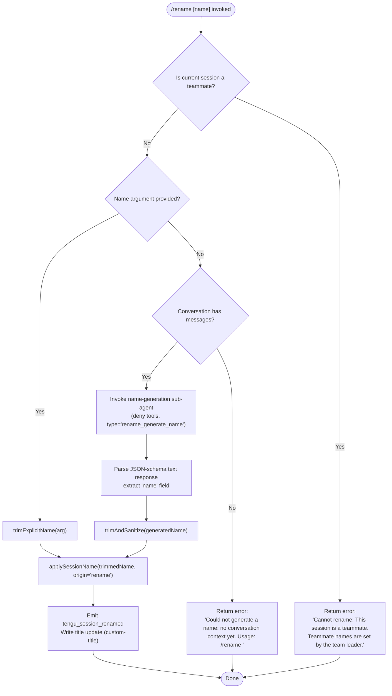

# `/rename`

> Analysis basis: CC v2.1.185 bundle.js (AST extraction + Claude interpretation)
> Minimum version: v2.1.185

---

## Overview

The `/rename` command sets or generates a display name for the current conversation session. When called with an explicit name argument it applies that name directly; when called with no argument it invokes a sub-agent to synthesize a name from the existing conversation context and applies the result. The command is also registered under the alias `/name`.

---

## Registration

| Field | Value |
|---|---|
| type | `local-jsx` |
| name | `rename` |
| description | `Rename the current conversation` |
| argumentHint | `[name]` |
| aliases | `["name"]` |
| immediate | `true` |
| module_id | `Bgl` |
| load_inline | `true` |
| loc_byte | `12293557` |
| loc_byte_end | `12293756` |
| loc_line | `7957` |
| arbor_handler.name | `GZp` |
| arbor_handler.fqn | `claude-2.1.185::GZp` |
| arbor_handler.kind | `AsyncFunction` |
| arbor_handler.resolution_path | `module_id` |
| arbor_handler.n_hits | `0` |

Analysis basis: CC v2.1.185 bundle.js:+12293557

---

## Input Branching

The command has four distinct execution paths depending on the presence of an explicit name argument, whether the session is a teammate, and whether any conversation context exists for auto-generation.



---

## Behavioral Spec

### Top-level handler — `conversationRenameHandler` (bundle identifier: `GZp`)

The main handler is an `AsyncFunction` resolved via `module_id → Bgl`. It receives the slash-command invocation object and orchestrates two secondary helpers.

```
async function conversationRenameHandler(invocation):
    result = renderRenameUI(invocation)          // VWn — renders JSX shell
    return result
```

Analysis basis: CC v2.1.185 bundle.js:+12293253

---

### Teammate guard — `teammateSessionGuard` (bundle identifier: `KWn`)

Called synchronously before any rename logic executes. Checks whether the current session role is a teammate (managed by a team leader).

```
function teammateSessionGuard(context):
    sessionStore = getSessionStore()             // em → Rx → Xvr.getStore
    if sessionStore indicates teammate role:
        return errorResponse(
            "Cannot rename: This session is a teammate. " +
            "Teammate names are set by the team leader."
        )
    // ... continue to rename logic
```

Analysis basis: CC v2.1.185 bundle.js:+12292701 (guard call), +12292721 (error literal)

---

### Explicit-name path — `applyExplicitName` (bundle identifier: `KWn`, continued)

When the user supplies an argument, the name is trimmed and applied directly.

```
function applyExplicitName(rawArg, appStateHandle):
    trimmed = rawArg.trim()                      // e.trim at +12292820
    applySessionTitle(trimmed, origin="rename")  // Uft → FCe path
    appStateHandle.setAppState(...)              // t.setAppState at +12293060
    notifyTitleChange(origin="custom-title")     // B6 → O8t.emit
    emitTelemetry("tengu_session_renamed")       // +13487016
```

Analysis basis: CC v2.1.185 bundle.js:+12292820

---

### Auto-generation path — `generateSessionName` (bundle identifier: `BZp`)

Triggered when no argument is supplied. Fires a restricted sub-agent query to synthesize a name from conversation history.

```
async function generateSessionName(conversationMessages, abortSignal):
    if conversationMessages is empty:
        return errorText(
            "Could not generate a name: no conversation context yet. " +
            "Usage: /rename <name>"
        )

    // Configure sub-agent: tools denied, type = "rename_generate_name"
    // Permission mode literal: "deny"  (+12290815)
    // Origin literal: "rename_generate_name"  (+12290933)

    abortController = new AbortController()
    abortSignal.addEventListener("abort", () => abortController.abort())  // +12290619

    agentResult = await runSubAgentQuery(
        messages      = buildContextWindow(conversationMessages),  // Jx
        toolPolicy    = "deny",
        queryType     = "rename_generate_name",
        schemaFormat  = "json_schema",                             // +12291745
        responseField = "name"                                     // +12290478
    )

    // agentResult must contain a text content block
    textBlock = agentResult.content.find(block => block.type === "text")  // +12291156
    if textBlock is absent:
        return errorText("Session name generation cannot use tools")       // +12290830

    sanitized = sanitizeHtml(textBlock.text)   // XGn → e.replaceAll (HTML entities)
    trimmed   = trimWhitespace(sanitized)      // U2 → e.trim (+1186063)
    applySessionTitle(trimmed, origin="rename")
    emitTelemetry("tengu_session_renamed")
```

Analysis basis: CC v2.1.185 bundle.js:+12290569 (`tle`/`BZp` entry), +12290697 (`Jx` sub-agent call), +12290815 (deny literal), +12290933 (type literal), +12292932 (no-context error literal)

---

### HTML entity sanitization — `sanitizeHtmlEntities` (bundle identifier: `XGn`)

Applied to the AI-generated name before it is stored.

```
function sanitizeHtmlEntities(text):
    result = text
        .replaceAll("&", "&amp;")    // +13883942
        .replaceAll("<", "&lt;")     // +13883966
        .replaceAll(">", "&gt;")     // +13883989
        .replaceAll("\r", "&#13;")   // +13884013
        .replaceAll("\n", "&#10;")   // +13884037
    return result
```

Analysis basis: CC v2.1.185 bundle.js:+13883925

---

### Session title persistence — `writeSessionTitle` (bundle identifier: `Uft` → `FCe` chain)

Persists the new session title and emits a file-change event. Two title-type labels are used in the underlying storage layer:

- `"custom-title"` — set when the user supplied the name explicitly (Analysis basis: CC v2.1.185 bundle.js:+13486924)
- `"ai-title"` — set when the name was AI-generated (Analysis basis: CC v2.1.185 bundle.js:+13487093)

```
async function writeSessionTitle(name, titleType):
    path   = buildSessionFilePath()          // Ic → fb.join
    writer = getAtomicWriter()               // Pp → vh (atomic write via temp file + rename)
    data   = Pe(JSON.stringify({name}))
    writer.write(path, data)
    emitter.emit("lxo", {titleType})         // lxo.emit at +13490540
    emitTelemetry("tengu_session_renamed")   // +13487016
```

Analysis basis: CC v2.1.185 bundle.js:+12291370 (`Uft` call), +12291411 (`$ho`), +12291430 (`BZp`)

---

### Full-session fork telemetry — `forkSessionTelemetryGuard` (bundle identifier: `Uft` entry)

Before the rename proceeds, a telemetry check determines whether this rename involves a full session fork.

```
function forkSessionTelemetryGuard():
    emitTelemetry("tengu_rename_full_session_fork")   // +12291373
```

Analysis basis: CC v2.1.185 bundle.js:+12291373

---

### Sub-agent query engine — `runSubAgentQuery` (bundle identifier: `Jx`)

The name-generation call routes through the standard forked-agent query pipeline. Relevant behaviour for `/rename`:

- Records `Date.now()` at query start (+10850081)
- Builds a message window via `buildAgentMessageWindow` (`v2n`) which calls `e.getAppState` (+10847047) and `e.setAppState` (+10848211)
- Applies `json_schema` output format so the model returns a structured `{"name": "..."}` object
- Writes result back through `applyExplicitName` after extraction

Analysis basis: CC v2.1.185 bundle.js:+10850081

---

## State & Side Effects

| Item | Detail |
|---|---|
| Telemetry — rename fork | `tengu_rename_full_session_fork` (emitted unconditionally on entry, +12291373) |
| Telemetry — session renamed | `tengu_session_renamed` (emitted after successful title write, +13487016) |
| Telemetry — agent name set | `tengu_agent_name_set` (emitted when agent-level name field is updated, +13490553) |
| Telemetry — config parse error | `tengu_config_parse_error` (emitted if session config file cannot be parsed, +13969321) |
| Telemetry — sub-agent fork query | `tengu_fork_agent_query` (emitted inside the name-generation sub-agent loop, +10852181) |
| appState changes | `e.setAppState` is called to reflect the new session name in in-memory state (+10848211, +12293060) |
| File I/O | Session metadata file is updated atomically (write to temp file → `aK.rename` → final path) via `vh` (+1057521) |
| Event emission | `lxo.emit` fires with title-type tag (`"custom-title"` or `"ai-title"`) after write (+13490540); `O8t.emit` also fires for logging (+13487003) |
| Abort handling | An `AbortController` is wired to the parent signal via `addEventListener("abort", ...)` (+12290619); the sub-agent query is aborted via `n.abort` (+12290650) |
| Hook registration | No hook registration detected within depth-2 traversal |
| Sound | No sound effects detected within depth-2 traversal |

---

## Version History

| Version | Change |
|---|---|
| v2.1.185 | Initial analysis |

---

## Common Mistakes

1. **Calling `/rename` with no argument in a fresh session** — if no messages exist yet, the command returns the error `"Could not generate a name: no conversation context yet. Usage: /rename <name>"` rather than silently succeeding. Supply an explicit name instead.
2. **Attempting to rename a teammate session** — teammate session names are controlled by the team leader; `/rename` will return a hard error and make no changes.
3. **Expecting immediate persistence without an event loop tick** — the title write is atomic but asynchronous; downstream code that reads the session name immediately after invoking `/rename` may observe the old value before the promise resolves.
4. **Using special HTML characters in the name** — characters `&`, `<`, `>`, carriage-return, and newline are replaced with their HTML entity equivalents when the name comes from AI generation; explicitly supplied names bypass this sanitization path.
5. **Confusing `/name` with a separate command** — `/name` is a registered alias for `/rename` and behaves identically.

---

## Appendix — Identifier Mapping

> For bundle debugging only. Identifiers change across versions.

| Identifier | Role |
|---|---|
| `GZp` | Top-level async handler for `/rename` (arbor_handler) |
| `VWn` | JSX UI shell renderer for the rename command |
| `XGn` | HTML entity sanitizer applied to AI-generated names |
| `KWn` | Core rename logic: teammate guard, explicit-name apply, state update |
| `em` | Session store accessor (calls `Rx`) |
| `Rx` | AsyncLocalStorage-based store retriever (`Xvr.getStore`) |
| `Uft` | Session title persistence orchestrator |
| `ct` | Config/store access layer (reads `pIe`, `u8`, invokes `OHn`) |
| `wxt` | Config sub-field accessor |
| `Lxt` | Config sub-field accessor (alternate path) |
| `I4` | Config reader wrapping `T4` |
| `T4` | Base config reader |
| `OHn` | Deduplication/cache gate for config reads |
| `RNr` | Config entry constructor (assigns UUID via `kNr.randomUUID`) |
| `$Nr` | Config entry post-processor |
| `Ct` | File-watching config loader |
| `jt` | Path resolution utility |
| `Hko` | Config file path helper |
| `q_e` | Config file reader (readFileSync, statSync, mkdirSync, readdirStringSync, copyFileSync) |
| `Ebf` | File-watcher setup (`B7n.watchFile` / `B7n.unwatchFile`) |
| `$ho` | Conversation history snapshot builder (`Date.now`, `js`) |
| `js` | Message list formatter (calls `jK`, `_s`, `Pg`) |
| `jK` | Individual message serializer |
| `_s` | Model-string normalizer (toLowerCase, trim, alias resolution) |
| `Pg` | Message-pair processor |
| `Mgt` | History truncation helper |
| `BZp` | Auto-name generation orchestrator (abort wiring, sub-agent invocation, result extraction) |
| `tle` | Context-window builder for name-generation query |
| `Jx` | Sub-agent query runner (Date.now, v2n, w2n, fR, bce, T, v6, B0, D4e, ine, I6n, HRa, f, cce, j, Y3p) |
| `v2n` | Agent state manager (getAppState, setAppState, QAe, nwe, ZQi, S6n, fR, ael.randomUUID) |
| `w2n` | Agent turn-count tracker |
| `fR` | Session-ID generator (random bytes, hex encoding) |
| `bce` | Stream result collector |
| `v6` | Sub-agent lifecycle handler (R3p, x5n, ke, Re) |
| `B0` | Agent message formatter |
| `D4e` | Tombstone / special-message type checker (`J_p.has`) |
| `HRa` | Tombstone check wrapper |
| `cce` | Context-window filter (`wb`, `d_p`, `e.filter`, `s.has`, `e.push`) |
| `Y3p` | Turn result processor (j, Ue, Ur) |
| `Pn` | IPC/socket framing layer |
| `Fs` | Fatal-error exit handler (`process.exit`) |
| `$gl` | Text-block extractor from agent response (`Fa`, `U2`) |
| `U2` | String trimmer (`e.trim`) |
| `Ee` | String-cast utility (`String()`) |
| `WWn` | Message-array builder for sub-agent prompt (Aee, t.push, Array.isArray, t.join, n.slice) |
| `Aee` | Message-array header builder |
| `i$` | Tool-schema builder for sub-agent call (Wc, F6n, Pn, e.map, ije, B0, Hx, CC, R1) |
| `Wc` | Tool-definition schema serializer |
| `F6n` | Full tool-schema assembler (readFile, writeFile, mkdir, createHash, randomUUID, dn, Error) |
| `LL` | Tool-listing and capability-map builder (large call fan-out) |
| `k9p` | Tool-schema per-tool mapper |
| `Mt` | Tool metadata resolver |
| `Pe` | JSON serializer (`JSON.stringify`) |
| `Gt` | JSON deserializer (`JSON.parse`) |
| `Lel` | Tool-schema file loader (`M9p`) |
| `dn` | Debug logger |
| `ije` | Tool invocation dispatcher (tgo, BNl, Error) |
| `tgo` | Fallback-request builder (U6n, t, F6n, n.push) |
| `BNl` | Main API query loop (large call fan-out — streaming, retries, fallbacks) |
| `Hx` | Hash utility (`gx`) |
| `gx` | Low-level hash function |
| `CC` | Credential/auth context builder (wr, Mu, Gvr, js, Tfe) |
| `wr` | Auth token formatter |
| `Mu` | Model-string builder |
| `Gvr` | Managed-key credential resolver |
| `Tfe` | Feature-flag/auth helper |
| `Am` | UI layout helper (`Lt`) |
| `Lt` | Ink/React layout primitive |
| `Cc` | Content-block filter |
| `UHe` | Session-rename persistence + hook layer (Gm, B6, rne, bE, $ce, a, Bce, B6e, dd, DC, YK) |
| `eO` | Session-object accessor |
| `Gm` | Display-name formatter (p2, Hg, Ar, cwe.join, Lt) |
| `p2` | Short-name hash renderer |
| `Ar` | Avatar/icon renderer |
| `B6` | Title-write + telemetry emit (tD, $_e, Lt, Au, O8t.emit, j, Ue) |
| `tD` | Display-title formatter (Lt, eO, Gm, Hg, Ar, zh.join) |
| `$_e` | Log appender for title changes (mq, jt, Pe, n.appendFileSync, n.mkdirSync, zh.dirname, Au) |
| `mq` | Log-line formatter |
| `Au` | Timestamp formatter |
| `Ue` | Error reporter (`ogt`) |
| `ogt` | Low-level error sink |
| `rne` | Alternate title-write path ($_e, tD, Lt, Au, O8t.emit) |
| `bE` | Session-role checker |
| `$ce` | Session-capability checker |
| `n3e` | MCP server orchestrator (large call fan-out) |
| `dW` | MCP slot diff applicator |
| `Nk` | MCP config normalizer |
| `pra` | MCP connection scheduler |
| `Ohn` | MCP connection health poller |
| `Mhn` | MCP connection diagnostics |
| `on` | MCP debug logger (`QJ.logMCPDebug`) |
| `oxn` | MCP tool-listing fetcher |
| `Sra` | MCP reconnect handler |
| `OKr` | MCP error handler |
| `Uk` | MCP capability gate |
| `yKr` | MCP include-filter checker |
| `Cu` | MCP error logger (`QJ.logMCPError`) |
| `gra` | MCP health-check helper |
| `Hot` | MCP timeout parser |
| `p0n` | MCP retry-interval parser |
| `uZn` | MCP connection result applier |
| `t3e` | MCP connection state updater |
| `fw` | MCP connection cleanup handler |
| `mta` | MCP metric aggregator |
| `Szr` | MCP stats builder |
| `k0l` | MCP slot state recorder |
| `B1o` | MCP per-server connection manager |
| `jLn` | MCP permission checker (X2d.has, LKr.has) |
| `Bn` | Retry-with-backoff helper |
| `hot` | MCP connection bootstrapper |
| `Bce` | Session capability broadcaster |
| `B6e` | Agent-name persistence (tD, $_e, Lt, Au, lxo.emit, j, Ue, YK) |
| `YK` | Session metadata reader/writer (_Ct, Date.now) |
| `_Ct` | Config file read/write pipeline (VU.readFile, VU.writeFile, Pe, T, Ee) |
| `dd` | Session-debug accessor |
| `aPe` | Debug payload builder |
| `njn` | App-state key enumerator (`Object.keys`) |
| `FCe` | File-based session-title writer (Ic, fa, mT, Pp, Mn, LA) |
| `Ic` | Session file path builder |
| `wk` | Session directory path builder |
| `fa` | Atomic session-file writer (lstat, readFile, writeFile, zZ cache, NCe set) |
| `mT` | Cache-entry deleter |
| `Pp` | Atomic write executor (vh, fb.join, Pe, mT) |
| `vh` | Low-level atomic file writer (randomBytes, writeFile, rename, chmod, copyFile, unlink) |
| `LA` | Session-lock acquirer (SPe.has, T, Ee, De) |
| `De` | Error logger with rolling buffer (Ho, st, ra, Bzc, hKe.push, QJ.logError) |
| `Ho` | Error-string formatter |
| `st` | String coercion helper |
| `ra` | Error classification helper |
| `Bzc` | Rolling-error-buffer manager (Ven.shift, Ven.push) |
| `AT` | Session basename resolver (fb.basename, Lt) |
| `Mn` | Null/undefined logger (`dn`) |
| `wp` | Warning logger (`dn`) |
| `SG` | Process-exit race handler (Promise.race, Promise.all, Lme, Nme, Bn, process.exit) |
| `rF` | Session-array push helper (T4, yz.push, gFe, MNr) |
| `ke` | Daemon-stop telemetry emitter (`tengu_feature_ok`) |
| `Re` | Daemon-stop-failure telemetry emitter (`tengu_feature_bad`) |
| `u` | Daemon control dispatcher (ke, Re, rF, SG) |

---

Note: index built via Arbor fallback; some signals (telemetry, literals) may be missing — see arbor-fallback.js.