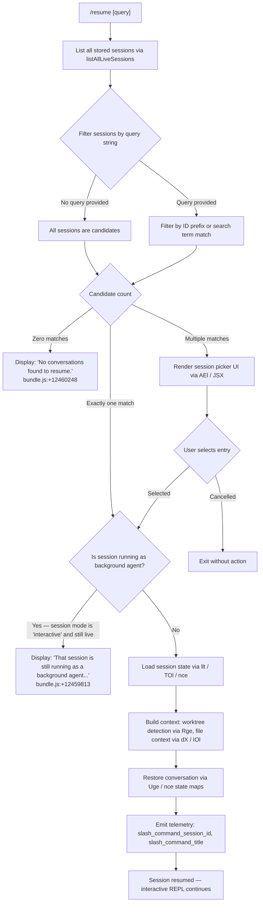

# `/resume`

> Analysis basis: CC v2.1.185 bundle.js (AST extraction + Claude interpretation)
> Minimum version: v2.1.185

---

## Overview

The `/resume` command (also accessible as `/continue`) allows the user to reopen and continue a previous Claude Code conversation session. It accepts an optional conversation ID or search term as input, searches through stored sessions, and either restores the selected session directly or presents the user with a selection interface when multiple candidates match. If the target session is currently running as a background agent, the command blocks resumption and instructs the user to interact with it through `/agents` instead.

---

## Registration

| Field | Value |
|---|---|
| type | `local-jsx` |
| name | `resume` |
| description | `Resume a previous conversation` |
| argumentHint | `[conversation id or search term]` |
| aliases | `["continue"]` |
| module_id | `HEl` |
| load_inline | `true` |
| loc_byte | `12461213` |
| loc_byte_end | `12461410` |
| loc_line | `7995` |
| arbor_handler.name | `Trf` |
| arbor_handler.fqn | `claude-2.1.185::Trf` |
| arbor_handler.kind | `AsyncFunction` |
| arbor_handler.resolution_path | `module_id` |
| arbor_handler.n_hits | `0` |

Analysis basis: CC v2.1.185 bundle.js:+12461213

---

## Input Branching

The handler exhibits 5+ distinct branches based on the session search result and session state. A Mermaid flowchart is used.



Analysis basis: CC v2.1.185 bundle.js:+12459699, +12459803, +12459813, +12460034, +12460248, +12460488, +12460785

---

## Behavioral Spec

### 1. Session Discovery

```
async function discoverSessions(query):
    rawSessions = await listAllLiveSessions()          // Oge → n.listAllLiveSessions
    if query is empty:
        candidates = rawSessions
    else:
        candidates = rawSessions.filter(s =>
            s.id.startsWith(query) OR
            searchableText(s).toLowerCase().includes(query.toLowerCase())
        )
    return candidates
```

Analysis basis: CC v2.1.185 bundle.js:+12459699, +8540447, +8540499

The session list call resolves a `Promise.resolve` then invokes `listAllLiveSessions` on the session store. Sessions are tagged with a mode field; the value `"interactive"` (bundle.js:+8540590) identifies foreground sessions.

### 2. Background-Agent Guard

```
function isBlockedByBackgroundAgent(session):
    if session.mode == "interactive" AND session.isLive:
        return true
    return false
```

When this guard triggers, the command renders the string: `"That session is still running as a background agent. Open \`claude agents\` to attach to it, or stop it there first to resume here."` (bundle.js:+12459813) and returns without loading the session.

Analysis basis: CC v2.1.185 bundle.js:+12459803, +12459811

### 3. No-Match Path

When `candidates` is empty, the command renders the static string `"No conversations found to resume."` (bundle.js:+12460248) and exits.

Analysis basis: CC v2.1.185 bundle.js:+12460248

### 4. Multi-Match Picker UI (JSX component)

```
function renderSessionPicker(candidates):
    element = Pb.createElement(...)               // JSX render via Pb.createElement
    for each candidate in candidates:
        display title, timestamp (via Date.now comparison), last-prompt snippet
    on selection:
        proceed to singleSessionResume(selected)
    on cancel:
        return without action
```

The picker is rendered through the `AEl` component which uses `Ht.bold` for formatting (bundle.js:+12457491, +12460785). The result includes telemetry strings `slash_command_title` (bundle.js:+12460735) and `slash_command_session_id` (bundle.js:+12460510).

UI outcome constants observed in literals:
- `"sessionNotFound"` (bundle.js:+12457456) — picker empty-state key
- `"multipleMatches"` (bundle.js:+12457527) — picker multi-result key

Analysis basis: CC v2.1.185 bundle.js:+12460099, +12460785, +12457491, +12457527

### 5. Session State Restoration

```
async function restoreSession(sessionId):
    // Load persisted state from disk
    sessionData = await loadSessionFromDisk(sessionId)   // llt → TOl → nce / cHf
    // Reconstruct conversation context
    context = buildConversationContext(sessionData)      // Uge
    // Detect and apply worktree / git context
    worktreeInfo = detectWorktree()                      // Rge → git worktree list --porcelain
    // Build file context (CLAUDE.md hierarchy, tools, etc.)
    fileContext = buildFileContext(worktreeInfo)         // dX → IOl, Ije
    // Replay conversation state maps
    applyStateToSession(context, fileContext)            // nce state-map setters
    // Return restored session handle
    return sessionHandle
```

The restoration pipeline involves reading transcript files from disk (via `nce` / `aHf` / `iHf`), re-linking message parent chains, and repopulating numerous internal Maps (keyed by string literals such as `"summary"`, `"last-prompt"`, `"custom-title"`, `"ai-title"`, `"tag"`, `"agent-name"`, `"agent-color"`, `"agent-setting"`, `"mode"`, `"permission-mode"`, `"isolation-latch"`, `"worktree-state"`, `"pr-link"`, `"bridge-session"`, `"file-history-snapshot"`, `"attribution-snapshot"`, `"content-replacement"`, `"fork-context-ref"`, `"marble-origami-commit"`, `"marble-origami-snapshot"`, `"marble-origami-reset"`).

Analysis basis: CC v2.1.185 bundle.js:+12460488, +13492211, +13499719, +13500064, +13500160, +13501252

### 6. Worktree Detection Sub-Routine

```
function detectWorktree(cwd):
    run: git worktree list --porcelain
    parse output lines starting with "worktree "   // bundle.js:+8529815
    normalize path via AH (Unicode NFC)            // bundle.js:+8529838
    match current cwd against worktree list
    emit telemetry: tengu_worktree_detection
    return matched worktree entry or null
```

The `"worktree "` prefix (9 characters, bundle.js:+8529815, +8529849) is used to split the porcelain output. The `"list"` and `"--porcelain"` arguments (bundle.js:+8529607, +8529614) are passed to the git subprocess.

Analysis basis: CC v2.1.185 bundle.js:+8529552, +8529587, +8529777, +8529802, +8529838

### 7. Conversation Filtering Detail

```
function filterByQuery(sessions, query):
    lowerQuery = query.toLowerCase()
    return sessions.filter(s =>
        s.id.toLowerCase().startsWith(lowerQuery) OR
        s.title.toLowerCase().includes(lowerQuery) OR
        s.lastPrompt.toLowerCase().includes(lowerQuery)
    )
```

The `"skip"` string (bundle.js:+12460016) and `"user"` role literal (bundle.js:+12459954) appear in the conversation reconstruction path, indicating that user-role messages are the primary indexing key for last-prompt display.

Analysis basis: CC v2.1.185 bundle.js:+12459699, +12459954, +12460016

---

## State & Side Effects

| Item | Detail |
|---|---|
| Telemetry: `tengu_worktree_detection` | Emitted during git worktree detection sub-routine (bundle.js:+8529696) |
| Telemetry: `tengu_daemon_control` | Emitted on daemon control operations during session attach (bundle.js:+17311865) |
| Telemetry: `tengu_bg_attach` | Emitted when attaching to a background session (bundle.js:+17266239) |
| Telemetry: `tengu_bg_attach_legacy_autorespawn` | Emitted when a legacy session requires auto-respawn (bundle.js:+17265080) |
| Telemetry: `tengu_bg_attach_stall_gave_up` | Emitted when attach stalls beyond threshold (bundle.js:+17267169) |
| Telemetry: `tengu_bg_attach_stall_respawn` | Emitted when attach stall triggers respawn (bundle.js:+17267439) |
| Telemetry: `tengu_bg_attach_kick` | Emitted when an existing client is kicked (bundle.js:+17268436) |
| Telemetry: `tengu_bg_attach_upgrade` | Emitted when session undergoes version upgrade during attach (bundle.js:+13292391) |
| Telemetry: `tengu_transcript_phantom_parent` | Emitted when a transcript message references a missing parent (bundle.js:+13498762) |
| Telemetry: `tengu_transcript_parent_cycle` | Emitted when a cycle is detected in the transcript parent chain (bundle.js:+13502682) |
| Telemetry: `tengu_chain_parent_cycle` | Emitted on parent cycle detection in conversation chain walk (bundle.js:+13479572) |
| Telemetry: `tengu_chain_timestamp_fallback` | Emitted when timestamp ordering falls back to heuristic (bundle.js:+13479721) |
| Telemetry: `tengu_chain_parallel_tr_recovered` | Emitted when a parallel transcript branch is recovered (bundle.js:+13481587) |
| Telemetry: `tengu_relink_walk_broken` | Emitted when relink walk encounters a broken reference (bundle.js:+13479078) |
| Telemetry: `tengu_bg_proto_mismatch` | Emitted when the background protocol version does not match (bundle.js:+17260791) |
| Telemetry: `tengu_bg_dispatch_stale_drop` | Emitted when a stale dispatch message is dropped (bundle.js:+17262190) |
| JSX render | Session picker component rendered via `Pb.createElement` (bundle.js:+12460099) |
| appState changes | Session state maps populated via `nce` setters for keys including `summary`, `last-prompt`, `custom-title`, `ai-title`, `tag`, `agent-name`, `mode`, `permission-mode`, and others |
| Disk I/O | Session transcript read via `Rl.readFile`, `Rl.stat`; worktree detection invokes git subprocess |
| Sound | None observed in depth-2 traversal |

---

## Version History

| Version | Change |
|---|---|
| v2.1.185 | Initial analysis |

---

## Common Mistakes

1. **Providing a non-unique search term**: If the supplied argument matches more than one stored session, the picker UI appears instead of an immediate resume. Use the full session UUID prefix for a deterministic single match.
2. **Attempting to resume an active background agent session**: The command refuses to resume a session that is currently live as a background agent (mode `"interactive"`). Use `/agents` to attach to it or stop it first.
3. **Using `/resume` after the session files have been deleted**: The session list is derived from persisted transcript files on disk. If those files are removed externally, the command will report `"No conversations found to resume."`.
4. **Confusing `/resume` with `/continue`**: Both are identical — `/continue` is a registered alias. The underlying handler `Trf` is invoked identically for both names.
5. **Expecting immediate context in a worktree mismatch**: If the current working directory does not match any recorded worktree, worktree-scoped state (such as `worktree-state`, `pr-link`) may not be restored, even though the conversation transcript is loaded.

---

## Appendix — Identifier Mapping

> For bundle debugging only. Identifiers change across versions.

| Identifier | Role |
|---|---|
| `Trf` | Main handler (AsyncFunction) for `/resume`; entry point resolved via Arbor `module_id` path |
| `gEl` | Pre-filter helper; filters session list before passing to handler |
| `Ah` | Session list sorting / presentation helper called from both `gEl` and `Trf` |
| `Oge` | Session store accessor; calls `listAllLiveSessions` |
| `De` | Error formatting / logging utility; called multiple times in restoration path |
| `Ho` | Low-level error constructor wrapper |
| `st` | String conversion utility |
| `ra` | Conversation chain traversal helper |
| `eJo` | Inner chain helper used by `ra` |
| `Bzc` | Queue shift/push utility (history buffer management) |
| `Ee` | String-to-display converter (used in session title rendering) |
| `Rge` | Worktree detection routine; runs `git worktree list --porcelain` |
| `qr` | Top-level subprocess / session runner; orchestrates daemon interactions |
| `zOe` | Daemon process spawner; wraps child process lifecycle |
| `des` | Process descriptor builder; constructs spawn arguments |
| `Gmr` | Stream reader for process stdout |
| `jmr` | Stream reader variant with encoding |
| `qmr` | Process exit code handler |
| `_Zo` | Numeric validation utility (Number.isFinite guard) |
| `PSt` | Process state machine / promise controller |
| `Bmr` | Reflect.apply wrapper for process dispatch |
| `YZo` | Event listener setup for process exit |
| `HZo` | Timeout race wrapper (Promise.race with clearTimeout) |
| `yZo` | Process kill helper |
| `hZo` | Process data handler (bound) |
| `gZo` | Process kill-on-error handler (bound) |
| `KZo` | Parallel process launch controller (Promise.all) |
| `FSt` | Process finalizer |
| `qZo` | Pipe setup helper |
| `VZo` | Stream add helper |
| `TZo` | Bound stream handler registrar |
| `p` | Forced-shutdown / process.exit handler |
| `WT` | Shutdown message emitter |
| `u` | Daemon connection object with abort |
| `_Xc` | String padding / formatting utility |
| `Gp` | Global process context reference |
| `T` | Command execution context builder |
| `QHc` | Command output formatter |
| `Pe` | JSON stringify wrapper |
| `Kc` | Path manipulation helper (replace, lastIndexOf, slice) |
| `Hqe` | Shell escaping utility |
| `n_c` | File context builder (CLAUDE.md loader, Buffer.byteLength) |
| `dn` | Diagnostic / debug logger |
| `HXc` | Debug logger wrapper around `dn` |
| `l` | Worktree entry object / session loader |
| `k0l` | Daemon status file reader (`daemon.status.json`) |
| `CQ` | Configuration reader |
| `ci` | Async local store accessor |
| `Mjt` | Path joiner for daemon status (`x0l.join`) |
| `AH` | Unicode path normalizer (NFC) |
| `Ar` | Path resolution utility |
| `gx` | Base path constant provider |
| `Pqn` | Session context assembler |
| `U8t` | Context builder top-level; joins tool lists, calls `IOl` and `Ije` |
| `IOl` | File context loader; reads project directories, CLAUDE.md files, tool manifests |
| `D7` | Project path builder |
| `y` | String replacement helpers (l1t, xht) |
| `o` | Column formatter (padEnd) |
| `ms` | MCP tool list helper |
| `EMe` | Message content formatter |
| `zLo` | Directory recursive reader for context |
| `L8t` | File context cache (Map get/set) |
| `UE` | Path relativizer |
| `E` | Math clamp utility (max/min) |
| `d` | Session supervisor object (stop/start/updateConfig) |
| `I` | Keyboard / scroll handler |
| `m` | Worker kill manager |
| `h` | Timer-based cache (setTimeout) |
| `H` | UI component renderer |
| `A` | File list flattener |
| `_` | SDK connection manager |
| `Ije` | Session snapshot builder |
| `gHf` | Session file reader / context hash builder |
| `pR` | Regex test for path validity |
| `Ate` | Session state initializer |
| `Uge` | Conversation state aggregator; retrieves all state-map values |
| `nce` | Central session state-map manager; handles all `.set`/`.get` for state keys |
| `Rgf` | State record formatter |
| `D` | TTY / write-stream object |
| `c` | Terminal writer (Tn) |
| `S6` | State snapshot serializer |
| `pYt` | Transcript message parser |
| `uYt` | UUID pattern tester |
| `dYt` | Text replacement helper in transcript parsing |
| `wb` | Write-back helper for state persistence |
| `a` | MCP / connection manager aggregate |
| `n3e` | MCP connection state builder |
| `uZn` | MCP update applicator |
| `mta` | MCP transport factory |
| `B1o` | MCP client roster manager |
| `g` | IPC buffer handler |
| `Qp` | IPC end/response writer |
| `T6f` | Daemon protocol message handler (full supervisor protocol) |
| `f` | Worker session lifecycle manager |
| `M` | Session scheduling / dispatch manager |
| `Bn` | Retry/timeout connection wrapper |
| `Re` | Feature flag checker (ok path) |
| `ke` | Feature flag checker (base path) |
| `YKn` | Memory-check utility |
| `B$e` | Lock-file / temp-file cleaner |
| `$` | Permission classifier (allow/deny/classify/ask) |
| `ct` | Session spawn coordinator |
| `NNo` | Socket connector (xZn.connect) |
| `jNo` | Session job lifecycle (spawn/retire/kill) |
| `Ue` | UI utility (ogt) |
| `R` | Disposable resource handle |
| `v_e` | Array filter for session state updates |
| `v` | Generic state value holder |
| `W` | Scheduled task runner |
| `vMt` | Task timing utility |
| `ZIn` | Task queue extension |
| `Xnc` | Boolean coercion utility |
| `B` | Output write-with-delay helper |
| `Dre` | Set membership checker |
| `fae` | Task filter (Dre + Dtt) |
| `L` | Session sweep / lifecycle ticker |
| `w` | Blurred/focused state tracker |
| `x` | TTY write wrapper |
| `p8t` | Memory sweep helper |
| `ERl` | Session retirement trigger |
| `Wn` | Simple thunk wrapper |
| `q` | Pending-reply queue |
| `XKn` | Session upgrade trigger |
| `V` | Keyboard event handler (backspace) |
| `aHf` | Transcript binary file parser (attribution snapshots, JSONL) |
| `K` | Write-stream passthrough |
| `bOl` | Binary offset accessor |
| `te` | Buffer comparison set |
| `Gt` | JSON.parse wrapper |
| `k` | PTY write dispatcher |
| `sHf` | Buffer compare helper |
| `Y` | Recording / voice input toggle |
| `Q` | Output stream pair |
| `re` | Token / line parser |
| `HEe` | JSON parse error handler |
| `ee` | MCP update batch handler |
| `lHf` | Lock-file sync reader |
| `YPl` | Conversation chain rebuilder (transcript relinking) |
| `Vgf` | Parent-chain walker |
| `os` | UI output helper (ogt) |
| `iHf` | JSONL incremental transcript reader |
| `gSe` | Stream protocol parser (lJc, uJc, cJc) |
| `aJc` | Stream header validator |
| `lJc` | Line-based protocol parser |
| `uJc` | JSON-within-stream extractor |
| `cJc` | Chunked stream to JSON converter |
| `N` | Session count / capacity guard |
| `ds` | Debug string formatter |
| `xzn` | Date.parse-based timestamp parser |
| `Nge` | Conversation chain assembler (top-level) |
| `Ygf` | Numeric NaN filter for chain values |
| `Xgf` | Parallel-chain merge and sort |
| `Kgf` | Chain shift/sort/dedup utility |
| `yOl` | Chain value accumulator |
| `alt` | Message array mapper |
| `oxo` | Message content normalizer (replaceAll) |
| `JGt` | Message structure builder |
| `Dl` | Diff/patch line parser |
| `ixo` | Attachment type filter |
| `Jgf` | Image/document attachment checker |
| `Qgf` | Array attachment checker |
| `kzn` | State-map key get/set helper |
| `Dzn` | State-map values-to-array converter |
| `llt` | Session data loader; reads state maps and reconstructs conversation |
| `TOl` | Session object builder (cHf + nce) |
| `cHf` | Session directory and file locator |
| `p2` | Base path resolver (gx) |
| `sL` | Directory listing helper (readdir + filter) |
| `VLo` | Conversation variant selector |
| `A_e` | Post-restore cleanup action |
| `dX` | File context assembler for resumed session |
| `AEl` | JSX session picker UI component (uses Ht.bold) |

---

Note: index built via Arbor fallback; some signals (telemetry, literals) may be missing — see arbor-fallback.js.