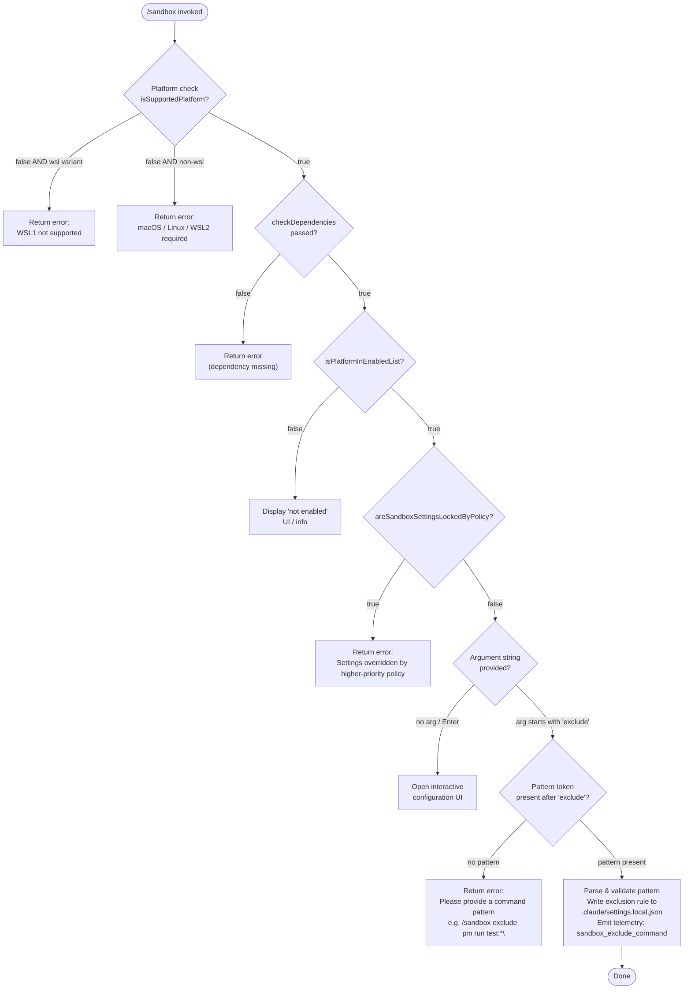

# `/sandbox`

> Analysis basis: CC v2.1.185 bundle.js (AST extraction + Claude interpretation)
> Minimum version: v2.1.185

---

## Overview

The `/sandbox` command configures and manages Claude Code's sandboxing subsystem, which controls which shell commands are permitted or restricted during an agentic session. It performs platform capability checks, enforces policy lock constraints, and — when given the `exclude` subcommand with a command pattern argument — writes an exclusion rule into the project-local settings file (`.claude/settings.local.json`). Pressing Enter with no argument opens the interactive sandbox configuration UI.

---

## Registration

| Field | Value |
|---|---|
| type | `local-jsx` |
| name | `sandbox` |
| description | ` ...   ...  (⏎ to configure)` |
| argumentHint | `exclude "command pattern"` |
| immediate | `true` |
| isHidden | `null` |
| module_id | `Fwl` |
| load_inline | `true` |
| loc_byte | `12887931` |
| loc_byte_end | `12888580` |
| loc_line | `8542` |
| arbor_handler.name | `Glf` |
| arbor_handler.fqn | `claude-2.1.185::Glf` |
| arbor_handler.kind | `AsyncFunction` |
| arbor_handler.resolution_path | `module_id` |
| arbor_handler.n_hits | `2` |

Analysis basis: CC v2.1.185 bundle.js:+12887931

---

## Input Branching

Four distinct branches exist based on platform support, policy lock state, and argument presence, so a Mermaid flowchart is used.



Analysis basis: CC v2.1.185 bundle.js:+12886550 (platform check), +12886581 (isSupportedPlatform), +12886798 (checkDependencies), +12886825 (isPlatformInEnabledList), +12886987 (areSandboxSettingsLockedByPolicy), +12887273 (argument split), +12887296 (exclude literal)

---

## Behavioral Spec

### Platform Validation

```
async function sandboxHandler(args, context):
    colorTheme = getColorTheme()             # "light" / dark selection
    version    = getZshVersion()             # zt() call

    if not platformSupport.isSupportedPlatform():
        wsVariant = platformSupport.detectWSLVariant()  # checks "wsl" string
        if wsVariant == "wsl1":
            return renderError("Error: Sandboxing requires WSL2. WSL1 is not supported.")
        else:
            return renderError("Error: Sandboxing is currently only supported on macOS, Linux, and WSL2.")

    depCheck = await platformSupport.checkDependencies()
    if depCheck.failed:
        return renderError(depCheck.message)

    if not platformSupport.isPlatformInEnabledList():
        return renderInfoPanel("sandbox not enabled on this platform")
```

Analysis basis: CC v2.1.185 bundle.js:+12886550 (`ts` = color-theme), +12886572 (`zt` = shell version), +12886581 (`Ko.isSupportedPlatform`), +12886617 (wsl literal), +12886623 (WSL1 error string), +12886681 (platform error string), +12886798 (`Ko.checkDependencies`), +12886825 (`Ko.isPlatformInEnabledList`)

### Policy Lock Check

```
    if platformSupport.areSandboxSettingsLockedByPolicy():
        return renderError(
            "Error: Sandbox settings are overridden by a higher-priority " +
            "configuration and cannot be changed locally."
        )
```

Analysis basis: CC v2.1.185 bundle.js:+12886987 (`Ko.areSandboxSettingsLockedByPolicy`), +12887046 (policy error string)

### Argument Dispatch — `exclude` Subcommand

```
    tokens = args.split(" ")          # split on whitespace
    subcommand = tokens[0]            # first token

    if subcommand == "exclude":
        pattern = tokens.slice(8)     # slice constant: 8 (byte-offset evidence)
        if pattern is empty:
            return renderError(
                'Error: Please provide a command pattern to exclude ' +
                '(e.g., /sandbox exclude "npm run test:*")'
            )
        sanitizedPattern = pattern.replace(...)     # via u.replace()
        settingsUpdater = loadLocalSettings()       # reads .claude/settings.local.json
        settingsUpdater.addRules([sanitizedPattern])
        persistLocalSettings(settingsUpdater)       # writes back to .claude/settings.local.json
        relativePath = path.relative(cwd, ".claude/settings.local.json")
        emitTelemetry("sandbox_exclude_command")
        renderSuccess(relativePath, sanitizedPattern)
        return
```

Analysis basis: CC v2.1.185 bundle.js:+12887273 (`a.split`), +12887296 (`"exclude"` literal), +12887313 (`a.slice`), +12887321 (slice constant `8`), +12887358 (missing-pattern error string), +12887477 (`u.replace`), +12887506 (`Z5r` — local settings loader), +12887519 (`QA` — settings writer), +12887543 (`Nwl.relative`), +12887556 (`xV`), +12887564 (`.claude/settings.local.json` path literal), +4746257 (`"sandbox_exclude_command"` telemetry literal)

### Interactive Configuration UI (no argument)

```
    else:
        # immediate=true means the JSX component is rendered directly
        renderSandboxConfigPanel()   # opens interactive TUI to configure sandbox policy
        return
```

Analysis basis: CC v2.1.185 bundle.js:+12887931 (`immediate: true` in registration), +12888580 (registration closing brace)

### Local Settings Layer — Exclude Rule Persistence

The settings subsystem involved (`Z5r` → `xn` → `co`) manages layered configuration (policySettings, flagSettings, localSettings, userSettings, projectSettings). Only the `localSettings` layer is written by `/sandbox exclude`.

```
function loadAndPatchLocalSettings(pattern):
    settings = loadSettingsFromDisk("localSettings")
    rules    = settings.addRules ?? []
    rules.append(pattern)
    settings.addRules = rules
    writeSettingsFile(".claude/settings.local.json", settings)
```

Analysis basis: CC v2.1.185 bundle.js:+4745877 (`xn` settings loader), +4745880 (`"localSettings"` literal), +4745971 (`"addRules"` literal), +1312850 (`"userSettings"`), +1312901 (`"projectSettings"`), +4746257 (`"sandbox_exclude_command"`)

---

## State & Side Effects

| Item | Detail |
|---|---|
| Telemetry | `sandbox_exclude_command` (bundle.js:+4746257) emitted on successful exclude-rule write; also in traversal scope: `tengu_feature_ok`, `tengu_feature_bad`, `tengu_feature_sad`, `tengu_daemon_control`, `tengu_mcp_skills`, `tengu_config_auth_loss_prevented`, `tengu_bg_retire_pinned_low_mem`, `tengu_bg_prewarm_per_sweep` (from shared subsystems) |
| File written | `.claude/settings.local.json` — exclusion rules appended under `addRules` key (bundle.js:+12887564) |
| appState changes | Sandbox policy state updated; MCP server connection map touched via shared settings layer (`n3e`, `uZn`) |
| Platform check | `Ko.isSupportedPlatform`, `Ko.checkDependencies`, `Ko.isPlatformInEnabledList`, `Ko.areSandboxSettingsLockedByPolicy` called on every invocation |
| Hook registration | `qi` → `B2o.register` (cleanup/FinalizationRegistry hook in settings subsystem, bundle.js:+69538) |
| Sound | None observed in depth-2 traversal |

---

## Version History

| Version | Change |
|---|---|
| v2.1.185 | Initial analysis |

---

## Common Mistakes

1. **Running `/sandbox exclude` without quoting glob patterns** — patterns containing `*` or spaces must be quoted (e.g., `/sandbox exclude "npm run test:*"`); unquoted patterns will be split by the shell before the command receives them.
2. **Using `/sandbox` on WSL1** — only WSL2 is supported; WSL1 users receive a hard error and must upgrade their WSL installation.
3. **Expecting `/sandbox` to work on Windows native** — the supported platforms are macOS, Linux, and WSL2 only; a clear error is shown on other platforms.
4. **Assuming exclude rules are written to the project-level settings** — rules are written to `.claude/settings.local.json` (local, git-ignored layer), not to `settings.json` (project-shared layer).
5. **Attempting to change sandbox settings under enterprise policy lock** — when `areSandboxSettingsLockedByPolicy()` returns true, all local changes are rejected with a policy error regardless of the arguments supplied.

---

## Appendix — Identifier Mapping

> For bundle debugging only. Identifiers change across versions.

| Identifier | Role |
|---|---|
| `Glf` | Main async handler for `/sandbox` command (arbor_handler) |
| `No` | ANSI/terminal color prefix router (foreground color dispatch) |
| `BIe` | Terminal color name → chalk/Ht style mapper |
| `Lz` | Color fallback / passthrough renderer |
| `n3e` | MCP server connection manager / settings synchronizer |
| `dW` | MCP server slot connection orchestrator |
| `Ort` | MCP server slot initializer |
| `W7` | MCP server configuration layer merger |
| `k5` | SDK-type MCP server entry builder |
| `NLn` | MCP error/warning color formatter |
| `Mrt` | SSE/HTTP MCP transport connector |
| `Nk` | Settings key normalizer |
| `P_` | Settings value resolver |
| `EKr` | Settings validation helper |
| `pra` | MCP connection hash/fingerprint generator |
| `w7r` | MCP cache path resolver |
| `Vwe` | MCP config hash builder (SHA-256) |
| `Phn` | MCP auth-needs cache reader |
| `Ohn` | MCP auth-needs cache checker |
| `EI` | MCP config entry hasher |
| `Mhn` | MCP config digest builder |
| `dc` | Digest utility |
| `on` | MCP debug logger |
| `oxn` | MCP OAuth connection handler |
| `Lr` | OAuth session loader |
| `CBd` | OAuth flow initiator |
| `vBd` | OAuth callback processor |
| `Sra` | MCP reconnect/resume handler |
| `ci` | Async local store accessor |
| `d0n` | MCP needs-auth cache path builder |
| `Pe` | JSON serializer wrapper |
| `OKr` | MCP connection error handler |
| `Ee` | String coercion utility |
| `Uk` | MCP tool skill registrar |
| `ct` | Tool capability checker |
| `yKr` | MCP server include-list checker |
| `pn` | Global config reader/writer |
| `kz` | Background worker activity tracker |
| `L` | Background worker sweep scheduler |
| `Dec` | Background worker decay selector |
| `Cu` | MCP error push logger |
| `gra` | MCP JSON-RPC message dispatcher |
| `U8` | JSON-RPC transport multiplexer |
| `Hot` | Port parser (parseInt wrapper, radix 10) |
| `p0n` | Port parser variant (parseInt wrapper, radix 20) |
| `uZn` | MCP connection result applier |
| `t3e` | MCP config hash differ |
| `fw` | MCP slot cleanup + reconnect orchestrator |
| `hot` | MCP slot cleanup helper |
| `mta` | MCP server status aggregator |
| `Szr` | MCP status label formatter |
| `T` | Settings serializer / log-level writer |
| `QHc` | Log formatter |
| `j2o` | Log sink router |
| `Kc` | Log path resolver |
| `g9o` | Log path segment mapper |
| `Hqe` | Log stream writer |
| `s9o` | Raw stream write wrapper |
| `n_c` | Settings file writer / log-rotate handler |
| `YWe` | Buffered stream flusher |
| `rpe` | Settings file write finalizer |
| `jt` | Filesystem stat helper |
| `Pre` | Directory existence checker |
| `y9o` | Settings path joiner |
| `csr` | Settings file safe-rename helper |
| `t_c` | Append-and-rotate file writer |
| `qi` | FinalizationRegistry / cleanup hook registrar |
| `l` | Background session manager |
| `k0l` | Daemon status file writer |
| `CQ` | Config persistence helper |
| `Mjt` | Daemon status path builder |
| `B1o` | MCP remote server retry orchestrator |
| `jLn` | MCP server suppression checker |
| `Bn` | Timer-backed async operation wrapper |
| `c` | Background thread handle |
| `u` | Daemon stop / worker shutdown coordinator |
| `ke` | Feature flag OK reporter |
| `j` | Feature flag event emitter |
| `Ue` | Feature flag telemetry sender |
| `ogt` | Feature flag payload builder |
| `Re` | Feature flag BAD reporter |
| `rF` | MCP server transport factory |
| `T4` | MCP transport selector |
| `uB` | First-party MCP transport builder |
| `gFe` | External MCP binary runner |
| `BR` | MCP subprocess launcher |
| `MNr` | MCP stdio transport initializer |
| `LHn` | MCP stdio message loop handler |
| `o8` | MCP session token generator |
| `SG` | Daemon stop coordinator (Promise.race over shutdown + timeout) |
| `Lme` | Graceful shutdown invoker |
| `Nme` | Forced shutdown invoker |
| `Cko` | Datadog metrics poster |
| `Z5r` | Local settings loader (sandbox rule source) |
| `xn` | Settings layer loader |
| `Mnn` | Settings cache reader |
| `i2o` | Settings in-memory cache accessor |
| `Thr` | Settings policy layer reader |
| `a2o` | Settings cache writer |
| `B2` | Settings object builder |
| `Ar` | Settings defaults applier |
| `Qgt` | Settings version checker |
| `Mnr` | Settings migration runner |
| `Ygt` | Settings schema validator |
| `ZRe` | Settings encryption handler |
| `ePe` | Settings feature-flag overlay |
| `eHt` | Settings hash verifier |
| `Ioe` | Settings integrity checker |
| `kSe` | Settings backup writer |
| `$nn` | Settings merge helper |
| `lrs` | Settings list resolver |
| `iQ` | Settings index builder |
| `kbt` | Settings store initializer |
| `QEd` | Command pattern matcher |
| `co` | Full settings load + write pipeline |
| `QA` | Settings write entry point |
| `LSe` | Settings path resolver |
| `bv` | Gitignore rule writer |
| `eQ` | File read helper (readFileSync + slice) |
| `Mn` | Error code classifier |
| `dn` | Generic error wrapper |
| `RAr` | Settings write timestamp recorder |
| `c1e` | Local settings writer |
| `knn` | Settings path normalizer |
| `MSt` | Atomic file write helper (temp + rename) |
| `jp` | Realpath resolver |
| `vKe` | Filesystem error filter |
| `mH` | Settings cache invalidator |
| `Ves` | Gitignore append helper |
| `Mt` | Git command runner |
| `hAr` | Git output parser |
| `Btn` | Git check-ignore runner |
| `QXc` | Gitignore path expander |
| `Wes` | Git ls-files runner |
| `qes` | Gitignore entry deduplicator |
| `J9` | Claude config directory path builder |
| `Pt` | Feature flag SAD reporter |
| `_j` | Settings disk load orchestrator |
| `hx` | Settings pre-load hook |
| `ha` | Memory usage sampler |
| `Ihr` | Settings load tracer / span recorder |
| `bzt` | Settings post-load hook |
| `De` | Error logger (pushes to hKe, calls QJ.logError) |
| `Ho` | Error string formatter |
| `st` | String coercer for error display |
| `ra` | Error event emitter |
| `Bzc` | Error ring-buffer manager |
| `xV` | Sandbox success renderer |

---

Note: index built via Arbor fallback; some signals (telemetry, literals) may be missing — see arbor-fallback.js.