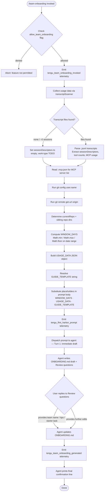

# `/team-onboarding`

> Analysis basis: CC v2.1.185 bundle.js (AST extraction + Claude interpretation)
> Minimum version: v2.1.185

---

## Overview

`/team-onboarding` is a `prompt`-type slash command that scans the invoking user's local Claude Code transcript history and co-authors a ready-to-ship `ONBOARDING.md` guide for teammates who are new to Claude Code. The command injects a structured prompt into the active agent session, supplying usage statistics (session count, tool usage, MCP server inventory, and session descriptors) as context, and guides the agent through a two-turn collaborative workflow: an immediate draft followed by a targeted review conversation. The resulting file can be pasted directly into Claude Code by a new teammate for an interactive guided tour.

---

## Registration

| Field | Value |
|---|---|
| type | `prompt` |
| name | `team-onboarding` |
| description | `Help teammates ramp on Claude Code with a guide from your usage` |
| isHidden | `false` |
| loc_byte | `13268079` |
| loc_byte_end | `13269153` |
| loc_line | `8844` |
| handler_method | `getPromptForCommand` |
| handler_method_start | `13268442` |
| handler_method_end | `13269152` |
| prompt_body.length | `4539` characters |
| prompt_body.trace | `identifier→l (local→1 ext vars)` |
| arbor_handler.name | `getPromptForCommand` |
| arbor_handler.fqn | `claude-2.1.185::getPromptForCommand` |
| arbor_handler.kind | `Method` |
| arbor_handler.resolution_path | `direct` |
| arbor_handler.n_hits | `2` |

Analysis basis: CC v2.1.185 bundle.js:+13268079

---

## Input Branching

The handler involves 4+ distinct branches: permission gating, data-collection paths (transcript scan, config read, git query), template substitution, and prompt dispatch. A Mermaid flowchart is used.



Analysis basis: CC v2.1.185 bundle.js:+13268442

---

## Behavioral Spec

### 1. Permission Gate

Before any data collection, the handler consults the `allow_team_onboarding` feature-flag stored in the per-account or enterprise configuration object.

```
function checkTeamOnboardingPermission(config):
    if config.allow_team_onboarding is false:
        abort silently          // feature disabled for this account tier
    else:
        continue to data collection
```

The literal `"allow_team_onboarding"` is present at bundle.js:+10258334. The flag gating is performed by `hdt` (permission-check helper) before the prompt is assembled.

Analysis basis: CC v2.1.185 bundle.js:+10258331

---

### 2. Window Computation

The handler derives the rolling observation window (in days) from the user's transcript history using integer arithmetic.

```
function computeWindowDays(transcriptTimestamps, nowMs):
    earliestMs = min(transcriptTimestamps)
    latestMs   = max(transcriptTimestamps)
    rawDays    = (nowMs - earliestMs) / MS_PER_DAY
    windowDays = Math.floor(Math.max(1, Math.min(365, rawDays)))
    return windowDays
```

The ceiling of 365 days is extracted from the literal at bundle.js:+13268691. The three Math calls (`Math.min`, `Math.max`, `Math.floor`) are called directly from the handler at bundle.js:+13268645, +13268654, and +13268663 respectively.

Analysis basis: CC v2.1.185 bundle.js:+13268645

---

### 3. Transcript Scanner (`transcriptScanner` / `JMl`)

The transcript scanner reads all `.jsonl` files in the Claude Code history directory and extracts structured usage data.

```
function transcriptScanner(historyDir, windowStartMs):
    files = fs.readdir(historyDir)
              .filter(f => f.endsWith(".jsonl"))

    results = await Promise.all(files.map(async f =>
        content = await fs.readFile(join(historyDir, f))
        lines   = content.split("\n")

        sessionDescriptor = {
            title:        extractFromLine(lines, titlePattern),
            prNumbers:    extractFromLine(lines, prPattern),
            firstMessage: lines.find(l => l is first user message)
        }

        toolCount  = countMatches(content, toolCallPattern)
        mcpCount   = countMatches(content, "\"name\":\"mcp__")
        contentLen = estimateContentLength(content, contentPattern)

        return { sessionDescriptor, toolCount, mcpCount, contentLen, mtime }
    ))

    return results.filter(r => r.mtime >= windowStartMs)
```

Key constants observed in the scanner:
- Only files with extension `".jsonl"` are read (bundle.js:+13257124).
- The MCP call detector searches for the literal prefix `"\"name\":\"mcp__"` (bundle.js:+13257703).
- Content block detection uses the literal `"\"content\":["` (bundle.js:+13258053).
- The scanner reads at most the first 3 tool-call matches as a hint when first messages are uninformative (literal `3` at bundle.js:+13258156).
- History directory is scanned using async `Bmt.readdir` / `Bmt.readFile` with a 24-hour / 60-minute boundary (literals `24` and `60` at bundle.js:+13257009 and +13257012).

Analysis basis: CC v2.1.185 bundle.js:+13257037

---

### 4. MCP Config Reader (`mcpConfigReader` / `CAf`)

```
function mcpConfigReader(workspaceRoot):
    configPath = join(workspaceRoot, ".mcp.json")
    raw        = await fs.readFile(configPath, "utf-8")
    parsed     = JSON.parse(raw)
    servers    = parsed["mcpServers"] ?? {}

    return Object.entries(servers).map(([name, cfg]) => ({
        name,
        urlOrigin: deriveOrigin(cfg)   // inferred from url/host fields
    }))
```

The literal `".mcp.json"` appears at bundle.js:+13259154; `"mcpServers"` at bundle.js:+13259210.

Analysis basis: CC v2.1.185 bundle.js:+13259130

---

### 5. Git Identity & Repo Resolution (`gitResolver` / `qr`)

```
function gitResolver(cwd):
    generatedBy = runGit(cwd, ["config", "user.name"])
                      .stdout.trim()

    originUrl   = runGit(cwd, ["remote", "get-url", "origin"])
                      .stdout.trim()

    currentRepo = path.basename(originUrl)
                      .replace(/\.git$/, "")

    siblingDirs = fs.readdirSync(parentDir(cwd))
                    .filter(d => isDirectory(d) && d !== currentRepo)

    return { generatedBy, currentRepo, siblingDirs }
```

Git sub-command literals: `"config"` (bundle.js:+13259784), `"user.name"` (bundle.js:+13259793), `"remote"` (bundle.js:+13259849), `"get-url"` (bundle.js:+13259858), `"origin"` (bundle.js:+13259868). The `"git"` executable literal appears at bundle.js:+13259777. The `originUrl` normalisation uses `QOe` (url-origin extractor), which strips the `"git/"` prefix (bundle.js:+1154443) and recognises `"localhost"` origins (bundle.js:+1158529).

Analysis basis: CC v2.1.185 bundle.js:+13259774

---

### 6. Prompt Assembly and Template Substitution

After all data is collected, the handler assembles the final prompt by replacing three template placeholders in the 4,539-character prompt body:

```
function assemblePrompt(promptBody, windowDays, usageData, guideTemplate):
    out = promptBody
            .replaceAll("{{WINDOW_DAYS}}",    String(windowDays))
            .replaceAll("{{USAGE_DATA}}",     JSON.stringify(usageData, null, 2))
            .replaceAll("{{GUIDE_TEMPLATE}}", guideTemplate)
    return out
```

The three placeholder literals are confirmed in the bundle:
- `"{{WINDOW_DAYS}}"` at bundle.js:+13268902
- `"{{GUIDE_TEMPLATE}}"` at bundle.js:+13268942
- `"{{USAGE_DATA}}"` at bundle.js:+13268977

The `String()` cast and `t.replaceAll` call are both present in the handler at bundle.js:+13268920 and +13268889 respectively.

Analysis basis: CC v2.1.185 bundle.js:+13268889

---

### 7. Agent Prompt Instructions (grounded summary — no verbatim quotes)

The 4,539-character prompt body instructs the agent to follow a strict, two-turn collaborative workflow:

**Turn 1 — Immediate draft:**

1. **Acknowledgment-first constraint.** The agent must emit a single acknowledgment line (citing the `{{WINDOW_DAYS}}` window) as its very first visible output, before any reasoning, tool calls, or classification work. The prompt explicitly frames this as a UX requirement: the guide creator is waiting on a blank screen.

2. **Work-type classification.** The agent reads the `sessionDescriptors` array injected via `{{USAGE_DATA}}`. Each session is classified into one of seven canonical task types: `build_feature`, `debug_fix`, `improve_quality`, `analyze_data`, `plan_design`, `prototype`, or `write_docs`. The agent picks the top 3–5 categories with rough percentages. When rendered in the guide, categories appear in title-case with spaces (e.g. "Build Feature"). If session count is approximately zero, the breakdown section is left as a TODO.

3. **Repo and MCP enumeration.** The agent starts from `currentRepo` and checks sibling repo directories in the workspace. For each MCP server entry in `{{USAGE_DATA}}`, it infers the server's purpose and access method from its `name` and optional `urlOrigin`.

4. **Guide file write.** The agent writes `ONBOARDING.md` using the `{{GUIDE_TEMPLATE}}` structure. It fills in real statistics (not placeholders), uses `generatedBy` as the author name (omitting it if missing), and renders ASCII bar charts using `█` (filled) and `░` (empty) characters at 20-column width. An HTML comment instruction at the bottom of the template is preserved verbatim.

5. **Output structure.** The guide is rendered inside a fenced code block. Immediately after the code block, the agent adds a horizontal rule and a `**Review**` heading, then poses exactly three numbered questions: team name confirmation, an optional starter-task link, and team tips not already in `CLAUDE.md`.

**Turn 2 — Revision loop:**

After the user answers the review questions, the agent:
- Applies the supplied team name, starter task, and tips to `ONBOARDING.md`.
- Closes with one exact fixed confirmation line referencing the file path and instructing the team to distribute it.
- Applies any further edits the user requests.

Analysis basis: CC v2.1.185 bundle.js:+13268442 (handler body), +13268079 (prompt_body start)

---

### 8. Config Persistence Layer (`configSaver` / `pn` → `W7n`)

The handler invokes the global config persistence path when it needs to write or cache state. Key observed behaviour:

- A file-system lock is acquired before writing; contention is reported via `tengu_config_lock_contention`.
- The re-read / safe-write guard prevents wiping authentication credentials (literal: `"saveConfigWithLock: re-read config is missing auth..."` at bundle.js:+13967073 — see also GH #3117 reference).
- Up to 5 backup copies are retained (literal `5` at bundle.js:+13967676); backups are stored in a `"backups"` subdirectory (bundle.js:+13968258) with a `".backup."` infix (bundle.js:+13967543).
- File mode `384` (octal `0600`) is applied to new config files (bundle.js:+13967958).

Analysis basis: CC v2.1.185 bundle.js:+13963319

---

## State & Side Effects

| Item | Detail |
|---|---|
| Telemetry — invocation | `tengu_team_onboarding_invoked` (bundle.js:+13268702) — fired once per invocation after the permission gate passes |
| Telemetry — prompt dispatch | `tengu_flint_harbor_prompt` (bundle.js:+13268479) — fired when the assembled prompt is sent to the agent |
| Telemetry — guide generated | `tengu_team_onboarding_generated` (bundle.js:+13269021) — fired after the agent completes guide generation |
| Telemetry — harbor share | `tengu_flint_harbor_share` (bundle.js:+10258396) — fired when guide content is finalised and shared |
| Telemetry — config lock contention | `tengu_config_lock_contention` (bundle.js:+13966746) |
| Telemetry — config stale write | `tengu_config_stale_write` (bundle.js:+13966882) |
| Telemetry — config auth loss prevented | `tengu_config_auth_loss_prevented` (bundle.js:+13967225) |
| Telemetry — config parse error | `tengu_config_parse_error` (bundle.js:+13969321) |
| Telemetry — config fallback write | `tengu_config_fallback_write` (bundle.js:+13966362) |
| File system — reads | `.jsonl` transcript files in history directory; `.mcp.json` in workspace root |
| File system — writes | `ONBOARDING.md` in the current working directory (created or overwritten by agent tool call) |
| File system — config backups | Up to 5 rolling backups in `~/.claude/backups/` with `.backup.` infix |
| Hook registration | `qi` → `B2o.register` (bundle.js:+69538); file-watch via `B7n.watchFile` / `B7n.unwatchFile` |
| appState changes | Transcript cache (`pIe`) and seen-session set (`ONr`) updated during scan; `Cxt` set updated with new command ID |
| External process | `git config user.name` and `git remote get-url origin` spawned via `qr` / `zOe` sub-process runner |
| Permission flag | `allow_team_onboarding` must be `true` in account config; enterprise and team tiers observed (literals `"enterprise"`, `"team"` at bundle.js:+3343772, +3343807) |
| Sound | <!-- TODO: not found in depth-2 traversal; needs --depth 4 --> |

---

## Version History

| Version | Change |
|---|---|
| v2.1.185 | Initial analysis — command registered at bundle.js:+13268079; `getPromptForCommand` handler at +13268442 |

---

## Common Mistakes

1. **Invoking on an account without `allow_team_onboarding`.** The permission flag must be enabled. Enterprise and team-tier accounts are the expected audience; individual free-tier users may find the command silently aborted.

2. **No transcript history present.** If the history directory is empty or contains no `.jsonl` files within the rolling window, the `sessionDescriptors` array will be empty and the work-type breakdown in the generated guide will be a TODO placeholder. Run a few real Claude Code sessions before invoking the command to produce a meaningful guide.

3. **Missing git remote.** The repo-resolution path runs `git remote get-url origin`. A workspace with no git remote (or a non-standard remote name) will cause `currentRepo` to be undefined, resulting in that field being omitted from the guide.

4. **Interrupting after Turn 1.** The command is designed as a two-turn workflow. Closing the session or ignoring the three Review questions will leave `ONBOARDING.md` without a confirmed team name, starter task, or team tips. These sections will appear as TODO placeholders in the draft.

5. **Expecting automatic distribution.** The command writes `ONBOARDING.md` locally. The agent's closing line instructs the guide creator to distribute the file to team docs and channels manually — Claude Code does not push to any remote location.

6. **Treating the ASCII bar chart as pixel-accurate.** The bar charts are 20-character wide approximations rendered with `█` and `░`. They are decorative summaries, not precise percentages; source numbers in the `{{USAGE_DATA}}` JSON are the ground truth.

---

## Appendix — Identifier Mapping

> For bundle debugging only. Identifiers change across versions.

| Identifier | Role |
|---|---|
| `__handler_team-onboarding` | Synthetic BFS entry point for the `getPromptForCommand` handler (not a real bundle symbol) |
| `ct` | Prompt-dispatch / command execution coordinator |
| `wxt` | Dispatch sub-helper A (called from `ct`) |
| `Lxt` | Dispatch sub-helper B (called from `ct`) |
| `I4` | Intermediate dispatch wrapper |
| `T4` | Lower-level dispatch step |
| `uB` | Core dispatch primitive |
| `OHn` | Session-deduplication / seen-check guard |
| `RNr` | New-session record creator (generates UUID, emits session event) |
| `gFe` | Session event builder helper |
| `o8` | Random-bytes / session-ID generator |
| `Pe` | JSON serialiser wrapper |
| `KXu` | Session registration finaliser |
| `$Nr` | Session state reconciler |
| `Hni` | Session state helper |
| `Gr` | Path / directory utility |
| `Pmi` | Permission model inspector |
| `L2` | Seen-session set lookup |
| `Ct` | Config reader (reads and caches config from disk) |
| `jt` | Config path resolver |
| `Hko` | Config hotreload coordinator |
| `q_e` | Config file parser (JSON parse + version decode) |
| `r` | Node.js `fs` module binding |
| `Gt` | JSON.parse wrapper |
| `V9` | Version-string decoder |
| `t` | General Node.js filesystem / process binding |
| `dn` | Logger / debug emitter |
| `RFl` | Backup directory scanner |
| `T` | Structured log / telemetry emitter |
| `j` | Promise / async flow utility |
| `Sko` | Path joiner for config subdirectories |
| `f` | Daemon session manager (background process lifecycle) |
| `Ebf` | Config file watcher (watchFile / unwatchFile lifecycle) |
| `Kq` | File-watch callback handler |
| `qi` | Hook registration helper (calls `B2o.register`) |
| `pn` | Global config persistence entry point |
| `W7n` | Config save-with-lock implementation |
| `s` | Filesystem wrapper with locking primitives |
| `i` | Stream / close lifecycle manager |
| `C3s` | Config-object merger |
| `_wr` | Config schema initialiser |
| `AAt` | Auth-loss guard |
| `n` | String lowercase utility |
| `I` | Cursor / scroll position calculator |
| `k` | Terminal write wrapper (supervisor) |
| `E` | Viewport min/max bounds calculator |
| `g` | Buffer / IPC stream processor |
| `h` | Socket read-timeout wrapper |
| `m` | Session-pool kill helper |
| `Qp` | Stream-end flusher |
| `T6f` | Daemon message dispatcher (full IPC protocol handler) |
| `Ee` | String coercion wrapper |
| `MSt` | Atomic file write helper (temp-file + rename pattern) |
| `jp` | Real-path resolver |
| `u` | Filesystem stats / lstat wrapper |
| `Mn` | Error logger |
| `vKe` | fsync error classifier |
| `e` | Jitter / retry delay generator |
| `LMe` | Lock metadata emitter |
| `_ko` | Config entry iterator |
| `oWt` | Timestamp accessor |
| `j7n` | Per-project config writer |
| `Ue` | Idle / error-recovery handler |
| `ogt` | Error-recovery primitive |
| `vAf` | Usage-data collector (orchestrates transcript scan + git + MCP config) |
| `Ar` | Base directory resolver |
| `gx` | XDG / home-dir path helper |
| `N2` | Project config path builder |
| `KO` | Project directory path resolver |
| `UE` | URL-safe path encoder |
| `v7c` | Path-hash helper |
| `JMl` | Transcript scanner (reads `.jsonl` files, extracts session descriptors) |
| `ds` | Error suppressor for missing transcript files |
| `o` | Array map / pad formatter |
| `c` | File-type checker (`isFile`) |
| `Tn` | File-type primitive |
| `l` | JSONL session-list accessor |
| `k0l` | Session list reader |
| `p` | Process exit / abort controller |
| `WT` | Forced-shutdown handler |
| `CAf` | MCP config reader (`.mcp.json` parser) |
| `IAf` | MCP server info enricher |
| `qr` | Git identity and repo resolver (runs `git config user.name`, `git remote get-url origin`) |
| `zOe` | Sub-process spawner (wraps `child_process`) |
| `des` | Win32 process adapter |
| `Gmr` | Process stream helper A |
| `jmr` | Process stream helper B |
| `qmr` | Process stream helper C |
| `_Zo` | Finite-number guard for process options |
| `PSt` | Process result collector |
| `Bmr` | Reflect-apply process proxy |
| `YZo` | Process event binder |
| `HZo` | Process timeout wrapper |
| `yZo` | Process kill-on-signal handler |
| `hZo` | Process exit callback binder |
| `gZo` | Process force-kill handler |
| `KZo` | Process stdio aggregator |
| `FSt` | Process error mapper |
| `qZo` | Process stdin pipe |
| `VZo` | Process stdout pipe |
| `TZo` | Process stderr pipe |
| `_Xc` | Stdout string coercer |
| `Gp` | Process result wrapper |
| `HXc` | Stderr log emitter |
| `De` | Sub-process error logger / queue |
| `Ho` | Error string builder |
| `st` | String coercion primitive |
| `ra` | Essential-traffic queue |
| `Bzc` | Queue shift/push manager |
| `QOe` | URL-origin extractor (strips `git/` prefix, normalises hostname) |
| `XXc` | URL component parser |
| `Di` | URL slice helper |
| `hdt` | Permission-flag checker for `allow_team_onboarding` |
| `di` | Feature-flag evaluator |
| `oAi` | Account-tier flag resolver |
| `Cz` | Flag composition helper |
| `pB` | Auth / account-type context builder |
| `wr` | Auth provider label mapper |
| `Mu` | Auth provider enum |
| `Ug` | Credentials resolver |
| `ib` | Profile / OAuth token accessor |
| `Eme` | Flag-to-string serialiser |
| `ab` | Invitation / membership checker |