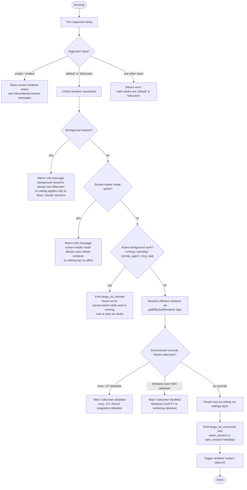

# `/tui`

> Analysis basis: CC v2.1.185 bundle.js (AST extraction + Claude interpretation)
> Minimum version: v2.1.185

---

## Overview

The `/tui` command lets the user switch the terminal UI renderer between `default` and `fullscreen` modes during an active Claude Code session. It validates that the requested mode is supported, enforces a set of environment-level constraints (background sessions, screen-reader mode, tmux-CC detection, Windows-over-SSH detection), checks that no background work is currently running, and—if all guards pass—persists the new setting and triggers a renderer restart.

---

## Registration

| Field | Value |
|---|---|
| type | `local-jsx` |
| name | `tui` |
| description | `Set the terminal UI renderer (default \| fullscreen)` |
| argumentHint | `[default\|fullscreen]` |
| module_id | `LTl` |
| load_inline | `true` |
| loc_byte | `12670424` |
| loc_byte_end | `12670606` |
| loc_line | `8320` |
| arbor_handler.name | `Ysf` |
| arbor_handler.fqn | `claude-2.1.185::Ysf` |
| arbor_handler.kind | `AsyncFunction` |
| arbor_handler.resolution_path | `module_id` |
| arbor_handler.n_hits | `0` |

Analysis basis: CC v2.1.185 bundle.js:+12670424

---

## Input Branching

Six or more distinct decision paths exist, so a Mermaid flowchart is used.



Analysis basis: CC v2.1.185 bundle.js:+12668039 (handler entry `Ysf`), +12668984 (`tengu_tui_refused`), +12669457 (`tengu_tui_command`), +3545004 (tmux-CC message), +3545190 (Windows SSH message)

---

## Behavioral Spec

### 1. Argument Parsing

```
async function tuiCommandHandler(rawArg, context):
    trimmedArg = rawArg.trim()                       // Ysf → n.trim() :+12668039
    validModes  = ["default", "fullscreen"]          // literals :+3545338, :+3545364

    if trimmedArg not in validModes and trimmedArg != "":
        return errorMessage("valid values: default | fullscreen")
```

Analysis basis: CC v2.1.185 bundle.js:+12668039, +12668151, +12668197

### 2. No-argument Status Display

```
if trimmedArg == "":
    currentMode = getEffectiveRenderer(context)      // Ysf → Os :+12668064
    displayStatusLines(currentMode)
    // Appends contextual notes based on environment
    return
```

When invoked without arguments the command calls the effective-renderer resolver (`Os`) and renders the current mode alongside relevant constraint notices, without modifying any settings.

Analysis basis: CC v2.1.185 bundle.js:+12668064

### 3. Background-session Guard

```
if context.isBackgroundSession():                    // Ysf → e :+12668109
    return infoMessage(
        "Background sessions always use the fullscreen renderer …"
        // literal :+12668349
    )
```

The exact user-facing string begins with "Background sessions always use the fullscreen renderer" and notes that the `/tui` setting applies only to sessions started directly with `claude`.

Analysis basis: CC v2.1.185 bundle.js:+12668109, +12668349

### 4. Screen-reader Mode Guard

```
if isScreenReaderModeActive(context):               // Ysf → tM :+12668545
    return infoMessage(
        "Screen-reader mode always uses the classic renderer …"
        // literal :+12668559
    )
```

Screen-reader mode (detected via `tM` / `Ani.isEnabled`) unconditionally forces the classic renderer, so this command has no effect while it is active. The handler surfaces an explanatory message and exits early.

Analysis basis: CC v2.1.185 bundle.js:+12668545, +12668559

### 5. Background-work Guard

```
activeTasks = getActiveTasks(context)               // Ysf → Object.values :+12668856
blockedStates = ["running", "pending", "remote_agent", "mcp_task"]
                // literals :+12668895, :+12668917, :+12668938, :+12668963

if any task in activeTasks has state in blockedStates:
    emit("tengu_tui_refused")                       // telemetry :+12668984
    return errorMessage(
        "Cannot switch renderers while work is running …"
        // literal :+12669025
    )
```

The guard prevents a renderer switch from disrupting in-flight agent work. The user is directed to `/tasks` to stop or wait for the work to finish.

Analysis basis: CC v2.1.185 bundle.js:+12668856, +12668984, +12669025

### 6. Effective-renderer Resolution

The effective renderer is computed by `Os` (described as `resolveEffectiveRenderer`), which applies the following priority chain:

```
function resolveEffectiveRenderer(context):
    // 1. Background session forces fullscreen
    if context.sessionType == "local-agent":        // literal :+3544784
        return { mode: "fullscreen", reason: "bg_forced_on" }
                // literal :+3545766

    // 2. Screen-reader auto-disables fullscreen
    if Ani.isEnabled():                             // tM :+3545784
        return { mode: "default", reason: "sr_auto_off" }
                // literal :+3545795

    // 3. Env variable CLAUDE_CODE_DISABLE_ALTERNATE_SCREEN disables
    if env "CLAUDE_CODE_DISABLE_ALTERNATE_SCREEN" set:  // literal :+12665417
        return { mode: "default", reason: "env_off" }
                // literal :+3545824

    // 4. Env variable forces on
    if env "CLAUDE_CODE_NO_FLICKER" set:            // literal :+12665392
        return { mode: "fullscreen", reason: "env_on" }
                // literal :+3545874

    // 5. tmux -CC (iTerm2 integration) auto-disables
    if tmuxCCDetected():                            // RFr :+3545920
        return {
            mode: "default",
            reason: "tmux_cc_auto_off",             // literal :+3545898
            warning: "fullscreen disabled: tmux -CC …" // literal :+3545004
        }

    // 6. Windows over SSH (ConPTY) auto-disables
    if windowsOverSshDetected():                    // platform == "windows" :+3544542
        return {
            mode: "default",
            reason: "win_ssh_auto_off",             // literal :+3545932
            warning: "fullscreen disabled: Windows over SSH …" // literal :+3545190
        }

    // 7. User / project settings
    savedSetting = readSettingsTuiValue()           // co :+12669213
    if savedSetting == "fullscreen":
        return { mode: "fullscreen", reason: "settings_on" }  // literal :+3545991
    if savedSetting == "default":
        return { mode: "default",    reason: "settings_off" } // literal :+3546025

    // 8. Feature-flag / gradual-rollout overrides
    if graduatedFullscreenEnabled():
        return { mode: "fullscreen", reason: "gb_on" }  // literal :+3546163
    else:
        return { mode: "default",    reason: "gb_off" } // literal :+3546171
```

Analysis basis: CC v2.1.185 bundle.js:+3544784, +3545766, +3545795, +3545824, +3545874, +3545898, +3545932, +3545991, +3546025, +3546163, +3546171

### 7. Settings Persistence and Relaunch

```
function applyTuiChange(newMode, context):
    persistTuiSetting(newMode)                      // co (settings layer) :+12669213

    sessionTiming = determineSessionTiming()
    // "same_session" or "later_session"            // literals :+12669921, :+12669936

    emit("tengu_tui_command", {                     // telemetry :+12669457
        requested_mode: newMode,
        session_timing: sessionTiming,
        process_uptime: Math.round(process.uptime() * 1000)
                        // :+12669548, :+12669559
    })

    triggerRendererRestart(context)                 // ujt :+12669983
```

The renderer restart sequence (`ujt` → `zDe`) performs a full terminal teardown and relaunch: it flushes pending analytics (timeout 30 000 ms, literal `:+12663430`), waits for cleanup (timeout 2 000 ms, literal `:+12663487`), unmounts the current Ink/JSX tree (`k3e`), saves terminal state using ANSI escape sequences `ESC 7` / `ESC 8` (literals `:+3886250`, `:+3886261`), spawns the replacement process via `TTl.spawnSync` with `--resume` (literal `:+12663363`), and exits with `process.exit`.

Analysis basis: CC v2.1.185 bundle.js:+12669457, +12669921, +12669936, +12669983, +12663363, +12663430, +12663487, +3886250, +3886261

### 8. Terminal Compatibility Probing (`U1` / `resolveFullscreenEligibility`)

The function `U1` probes the runtime terminal environment to decide whether fullscreen can actually be offered:

```
function resolveFullscreenEligibility():
    // JetBrains IDE terminal check
    if die.isJetBrainsIdeTerminal():               // :+3615662
        return NOT_ELIGIBLE

    // Platform exclusions
    if process.platform in ["darwin", "win32"]:    // literals :+3615872, :+3615919
        // Apply additional heuristics (xterm.js version checks etc.)

    // Known terminal emulators: cursor, vscode, ghostty, iTerm.app
    // Version-range checks for xterm.js-based terminals
    //   xterm.js versions 1092000–1105000 are eligible
    //   literals :+3616464, :+3616475
    // ghostty :+3613013, iTerm.app :+3613082 version gates

    return eligibilityResult
```

Analysis basis: CC v2.1.185 bundle.js:+3615594, +3615662, +3615872, +3615919, +3616464, +3616475

---

## State & Side Effects

| Item | Detail |
|---|---|
| Telemetry | `tengu_tui_refused` (emitted when background work blocks the switch, `:+12668984`); `tengu_tui_command` (emitted on every successful mode change, carries `same_session` / `later_session` and uptime, `:+12669457`); `tengu_amber_creek` and `tengu_pewter_brook` (effective-renderer resolution instrumentation, `:+3545521`, `:+3545429`) |
| Settings write | Persists the chosen `tui` mode (`"default"` or `"fullscreen"`) to the user settings layer via `co` / `Ves` `:+12669213` |
| Process relaunch | On a successful switch the process tears down Ink/JSX UI (`k3e`), saves cursor state, then re-spawns itself with `--resume` via `TTl.spawnSync` `:+12663989` |
| Environment variables read | `CLAUDE_CODE_NO_FLICKER` `:+12665392`, `CLAUDE_CODE_DISABLE_ALTERNATE_SCREEN` `:+12665417`, `CLAUDE_CODE_FORCE_FULLSCREEN_UPSELL` `:+12665456` |
| appState changes | Reads active task list and session type from app state via `Fr` / `e.getAppState` `:+10852887`; reads screen-reader mode via `tM` / `Ani.isEnabled` |
| Analytics flush | `XWe` / `B2o.drain` drains the analytics queue before exit; timeout 30 000 ms `:+12663430` |
| Terminal I/O | ANSI save-cursor (`ESC 7`) and restore-cursor (`ESC 8`) escape codes written via `nge.writeSync` / `OZ.writeSync` during relaunch `:+3886250`, `:+3886261` |
| Sound | None observed |

---

## Version History

| Version | Change |
|---|---|
| v2.1.185 | Initial analysis |

---

## Common Mistakes

1. **Running `/tui` while background tasks are active** — The command refuses the switch and emits `tengu_tui_refused`. Wait for all background tasks to finish (or stop them with `/tasks`) before calling `/tui`.
2. **Expecting `/tui` to affect background sessions** — Background sessions (`local-agent` type) are hard-wired to the fullscreen renderer regardless of the setting. The `/tui` preference only applies to foreground sessions started directly with `claude`.
3. **Expecting an immediate effect in screen-reader mode** — `Ani.isEnabled()` overrides the stored setting; the user-visible message explains this, but the setting is still written and will take effect once screen-reader mode is disabled.
4. **Mistyping the mode name** — Only the exact strings `default` and `fullscreen` are accepted; any other value (including `full`, `fs`, `normal`) produces an error.
5. **Overlooking environment-variable overrides** — `CLAUDE_CODE_DISABLE_ALTERNATE_SCREEN` and `CLAUDE_CODE_NO_FLICKER` take precedence over the stored setting, so even after a successful `/tui fullscreen` the effective mode may remain `default` if these variables are set in the environment.

---

## Appendix — Identifier Mapping

> For bundle debugging only. Identifiers change across versions.

| Identifier | Role |
|---|---|
| `Ysf` | Main async handler for `/tui` command (arbor-resolved) |
| `ujt` | Renderer restart entry point (calls `zDe`) |
| `zDe` | Full terminal teardown and relaunch orchestrator |
| `Os` | Resolves the effective renderer mode with all guards applied |
| `RIe` | Builds the effective-renderer reason/status object |
| `tM` | Screen-reader mode check (`Ani.isEnabled` wrapper) |
| `PFr` | Helper used inside effective-renderer resolution |
| `_Z` | Environment-variable override checker |
| `RFr` | tmux-CC and Windows-SSH detection logic |
| `Gr` | Feature-flag / gradual-rollout gate for fullscreen |
| `ved` | Additional renderer eligibility predicate |
| `ct` | Core rendering state accessor |
| `Fr` | App-state accessor (working directory, tool lists, session flags) |
| `Fh` | Secondary app-state accessor |
| `pVn` | CLI argument builder for relaunch invocation |
| `r_n` | Argument normalisation helper |
| `co` | Settings read/write layer (multi-tier: policy, flag, user, project, local) |
| `U1` | Terminal-emulator fullscreen eligibility probe |
| `God` | xterm.js version range comparator |
| `R_` | Auxiliary eligibility helper |
| `di` | Display/renderer component selector |
| `k3e` | Unmounts current Ink/JSX render tree before relaunch |
| `MEn` | Writes ANSI escape sequences and handles low-level terminal state |
| `EL` | tmux / screen escape-sequence rewriter |
| `o$e` | Terminal emulator identifier (ghostty, iTerm.app version gating) |
| `dDn` | Scroll-summary flush before relaunch |
| `HNt` | Clears render interval (`hJr` / `clearInterval`) |
| `STl` | Native library loader (`bun:ffi`, `execve`) |
| `XWe` | Analytics drain (`B2o.drain`) before relaunch |
| `uu` | Promise race with timeout utility (flush timeout) |
| `nD` | Registers relaunch signal handler |
| `eI` | Writes relaunch spawn error to disk |
| `eIe` | Post-relaunch environment flag checker |
| `s$` | Claude binary path resolver |
| `BUn` | Version directory locator |
| `Whe` | Local share path resolver |
| `Jae` | Home-directory bin path resolver |
| `ekn` | Home directory lookup (`Hia.homedir`) |
| `Hi` | Worker-type detector (`daemon-worker`) |
| `uNe` | Worker environment utility |
| `mB` | Settings `disable` field accessor |
| `b6n` | App-state `allowed_tools` / `working_directory` reader |
| `T6n` | App-state `disallowed_tools` reader |
| `T4` | Ink/JSX render bootstrap |
| `di` | Component display selector |
| `oAi` | Colour/theme resolver |
| `Cz` | Terminal capability probe |
| `pB` | Low-level terminal writer |
| `Oxt` | Terminal settings file reader |
| `Mme` | Telemetry consent classifier |
| `ra` | Telemetry stub/no-op shim |
| `Eme` | Alternative colour mode selector |
| `T` | General logging / formatting utility |
| `Pe` | JSON serialiser wrapper |
| `Mn` | Error normaliser (`dn`) |
| `dn` | Error-to-string converter |
| `Ue` | Feature-flag evaluator (`tengu_feature_ok` / `tengu_feature_bad`) |
| `Gr` | Gradual-rollout gate (`_j`) |
| `_j` | Settings-backed feature-flag resolver |
| `Ihr` | Settings loader with timing instrumentation |
| `Ln` | Settings file writer with directory creation |
| `Vns` | Project settings aggregator |
| `bhr` | Settings file parser |
| `Hj` | Cached settings accessor |
| `H2o` | Settings cache `get` |
| `_2o` | Settings cache `set` |
| `cU` | `structuredClone` wrapper |
| `yhr` | Settings entry parser/validator |
| `Wns` | SDK inline settings merger |
| `cze` | Diagnostic settings message builder |
| `$pe` | Settings schema validator |
| `LSe` | Settings file path resolver |
| `knn` | Settings path canonicaliser |
| `IQc` | Settings read helper |
| `J9` | `.claude/settings.json` path builder |
| `TQc` | Managed-settings path builder |
| `kbt` | WSL path adapter |
| `B2` | Full settings object assembler |
| `Thr` | Settings load orchestrator |
| `Ves` | File-system settings writer |
| `MSt` | Atomic file write (`writeFileSyncAndFlush`) |
| `vKe` | File-write error classifier (EINVAL, EPERM, etc.) |
| `qr` | Git-ignore checker |
| `QXc` | Path-to-gitignore resolver |
| `Wes` | `ls-files` git-tracked checker |
| `RAr` | Settings change timestamp recorder |
| `mH` | Settings cache invalidator |
| `Mt` | Async-local-storage settings context reader |
| `Qen` | Store getter |
| `hAr` | Settings diff helper |
| `Btn` | Settings write orchestrator |
| `Pt` | Feature flag: `tengu_feature_sad` |
| `Re` | Feature flag: `tengu_feature_ok` |
| `ke` | Feature flag: `tengu_feature_ok` (alternate) |
| `NNo` | Daemon socket connection manager |
| `jNo` | Background session lifecycle manager |
| `f` | Background session dispatcher |
| `M` | Scheduled-task runner |
| `B$e` | Stale-session file cleaner |
| `De` | Error logger (`QJ.logError`) |
| `n3e` | MCP server connector |
| `uZn` | MCP connection result applier |
| `B1o` | MCP server reconnection orchestrator |
| `mta` | MCP server state serialiser |
| `a` | `execve`-based relaunch entry |
| `u` | Daemon spawn orchestrator |
| `SG` | Graceful shutdown with exit racing |
| `rF` | First-party flag registry |
| `p` | Forced-shutdown handler |
| `Bn` | Abort-signal promise helper |
| `$` | Permission-verdict `retireIfSettled` |
| `YKn` | Low-memory background dispatcher |
| `Hca` | Animation frame timing calculator |
| `L2` | Local-agent type check |
| `k0l` | Telemetry event logger |
| `c` | Background session token |
| `Tn` | Background session name constant |
| `xIo` | Relaunch binary path resolver |
| `Hg` | Executable path helper |
| `Ec` | Path utility (`gx`) |

Note: index built via Arbor fallback; some signals (telemetry, literals) may be missing — see arbor-fallback.js.