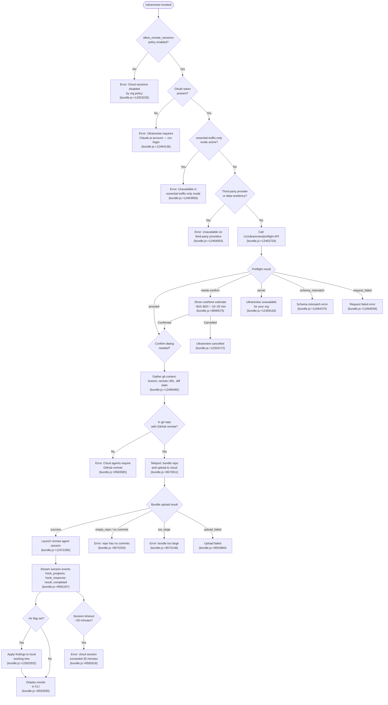

# `/ultrareview`

> Analysis basis: CC v2.1.185 bundle.js (AST extraction + Claude interpretation)
> Minimum version: v2.1.185

---

## Overview

`/ultrareview` launches a cloud-based agent (running in Claude Code on the web) that autonomously finds and verifies bugs in the current git branch. The command performs local environment pre-checks, teleports the repository to a remote cloud environment, and streams back results; it supports an optional `--fix` flag that auto-applies findings to the local working tree. Estimated cost is in the $10–$20 USD range with a runtime of approximately 10–20 minutes.

---

## Registration

| Field | Value |
|---|---|
| type | `local-jsx` |
| name | `ultrareview` |
| description | `"Start a cloud agent that finds and verifies bugs in your branch ( … , … USD) · Runs in Claude Code on the web. See …"` |
| loc_byte | `12505538` |
| loc_byte_end | `12505809` |
| loc_line | `8111` |
| module_id | `ZEl` |
| load_inline | `true` |
| arbor_handler.name | `cof` |
| arbor_handler.fqn | `claude-2.1.185::cof` |
| arbor_handler.kind | `AsyncFunction` |
| arbor_handler.resolution_path | `module_id` |
| arbor_handler.n_hits | `1` |

Analysis basis: CC v2.1.185 bundle.js:+12505538

---

## Input Branching

The command has well over three distinct branches across policy checks, git state, preflight API results, and session lifecycle states, so a Mermaid flowchart is used.



---

## Behavioral Spec

### 1. Policy and Authentication Pre-checks (`checkPoliciesAndAuth`)

Before any network call, the handler `cof` validates local configuration:

```
async function checkPoliciesAndAuth(appState):
    if not appState.settings.allow_remote_sessions:
        # Literal: "Cloud sessions are disabled by your organization's policy..."
        emit telemetry: tengu_review_remote_precondition_failed
        show error and abort

    if appState is in essential-traffic-only mode:
        # Literal: "Ultrareview runs in Claude Code on the web and is unavailable
        #            when essential-traffic-only mode is active."
        abort

    if provider is not firstParty (non-Anthropic API):
        # Literal: "Ultrareview runs in Claude Code on the web and is unavailable
        #            on third-party providers."
        abort

    if no OAuth token present:
        # Literal: "Ultrareview requires a Claude.ai account. Run /login..."
        emit reason: "no-auth" / "no_oauth_token"
        abort
```

Analysis basis: CC v2.1.185 bundle.js:+12503193, +12503230

---

### 2. Parse Subcommand Flags (`parseSubcommandFlags`)

The command parses subcommand tokens from the user input string:

```
function parseSubcommandFlags(inputText):
    tokens = inputText.trim().split()
    flags = new Set()
    for token in tokens:
        normalized = token.toLowerCase().replace(leading dashes)
        if normalized in ["fix", "comment"]:
            flags.add(normalized)
    # Special: "/code-review ultra" is treated as an alias
    # Literal: "/code-review ultra" (bundle.js:+12465342)
    return flags
```

Analysis basis: CC v2.1.185 bundle.js:+12503394, +12465257, +12465263, +12465342

---

### 3. Preflight API Call (`callPreflightEndpoint`)

Calls the backend to determine eligibility before expensive operations:

```
async function callPreflightEndpoint(sessionStore, orgId):
    response = await httpGet("/v1/ultrareview/preflight",
        headers: { "teleport-org": orgId })
    emit telemetry: tengu_review_bughunter_config (via W4e at bundle.js:+8890458)

    match response.status:
        "proceed"       → return { action: "proceed" }
        "needs-confirm" → return { action: "needs-confirm",
                                   costEstimate: "$10-$20",
                                   timeEstimate: "~10–20 min" }
        "server"        → abort with "Ultrareview is unavailable for your organization."
        "schema_mismatch" → emit "schema_mismatch"; abort
        "request_failed"  → emit "request_failed"; abort
```

The cost estimate string `"$10-$20"` and time estimate `"~10–20 min"` are bundle literals.
Analysis basis: CC v2.1.185 bundle.js:+12463726, +8890575, +8890668

---

### 4. Overage / Confirmation Dialog (`showOverageDialog`)

When the preflight returns `"needs-confirm"`, a JSX dialog is rendered showing cost and time information. The user must explicitly confirm before proceeding. If they decline, the command emits cancellation.

```
async function showOverageDialog(costInfo):
    emit telemetry: tengu_review_overage_dialog_shown
    result = await renderConfirmDialog(costInfo)
    if result == "cancelled":
        show "Ultrareview cancelled."
        return false
    return true
```

Analysis basis: CC v2.1.185 bundle.js:+12503864, +12504172

Overage blocking (when usage is already exceeded before dialog) emits `tengu_review_overage_blocked`.
Analysis basis: CC v2.1.185 bundle.js:+12503527

---

### 5. Git Context Gathering (`gatherGitContext`)

Before teleporting, the command collects information about the local repository:

```
async function gatherGitContext():
    # Verify git repo
    run: git rev-parse --is-inside-work-tree

    # Get remote URL (redacts credentials)
    remoteUrl = git config --get remote.origin.url
    redactedUrl = remoteUrl.replace("://***@" pattern)

    # Detect current and default branch
    currentBranch = git branch --abbrev-ref HEAD
    defaultBranch = git symbolic-ref --short refs/remotes/origin/HEAD
                    fallback to "main" or "master"

    # Compute merge-base diff stats
    mergeBase = git merge-base HEAD defaultBranch
    diffStats = git diff --shortstat mergeBase

    # Query PR info via GitHub CLI
    prInfo = gh pr view --repo REPO --json additions,deletions,changedFiles
    # gh command timeout: 5000 ms (bundle.js:+12466581)

    # Validate remote is GitHub
    if not remoteUrl.includes("github.com"):
        abort with "Cloud agents require a GitHub remote..."

    return { remoteUrl, currentBranch, defaultBranch, diffStats, prInfo }
```

Analysis basis: CC v2.1.185 bundle.js:+12466465, +12466092, +12466536, +12467633, +12468140

---

### 6. Repository Teleport — Bundle Upload (`teleportBundleUpload`)

The repository is bundled and uploaded to the cloud environment:

```
async function teleportBundleUpload(gitContext, sessionConfig):
    emit telemetry: tengu_teleport_bundle_mode (with bundle mode)
    emit telemetry: tengu_teleport_source_decision

    # Determine bundle mode
    if explicitSourceUrl set:
        mode = "explicit_source_url"
    elif noGitAtAll:
        mode = "no_git_at_all"
    else:
        # GitHub App preflight check
        appInstalled = await checkGithubAppInstalled()
        emit: "github_preflight_ok" or "github_preflight_failed"
        mode = "github" | "byoc" | "forced_bundle" | etc.

    # Bundle creation: randomBytes seed for unique ID
    bundleId = generateBundleId()   # uses KOL.randomBytes (bundle.js:+13551228)

    # Upload strategies (in preference order):
    for strategy in ["head", "fallback_head", "squashed", "fallback_squashed"]:
        result = await attemptUpload(strategy)
        emit telemetry: tengu_ccr_bundle_upload (with result)
        if result == "success": break
        if result == "too_large": abort
        if result == "upload_failed": continue

    if no strategy succeeded:
        abort "Ultrareview failed to launch the cloud session..."

    emit telemetry: tengu_ccr_bundle_seed_enabled
```

Analysis basis: CC v2.1.185 bundle.js:+8574911, +8553525, +8570220, +7181088

---

### 7. Remote Session Lifecycle (`runRemoteAgentSession`)

After the bundle is uploaded, a remote agent session is created and monitored:

```
async function runRemoteAgentSession(bundleInfo, flags):
    # POST to create session (type: "ultrareview")
    # Literal session type string: "ultrareview" (bundle.js:+12471004)
    sessionId = await createSession({
        type: "ultrareview",
        bundleRef: bundleInfo,
        env: sessionConfig.environment
    })

    emit telemetry: tengu_ccr_session_link
    emit telemetry: tengu_review_remote_launched

    # Session timeout: 1800000 ms = 30 minutes (bundle.js:+8589977)
    timeout = 1800000

    # Poll/stream session events
    while not (completed or timeout):
        event = await readNextEvent()
        match event.type:
            "hook_progress"  → render progress UI
            "hook_response"  → render intermediate response
            "hook_started"   → render "starting" indicator
            "result"         → capture final result
            "SessionStart"   → log session start
            "completed"      → break loop
            "assistant"      → render assistant message

    if timed_out:
        emit error: "cloud session exceeded 30 minutes"

    if no result:
        emit error: "no review output — orchestrator may have exited early"

    if flags.has("fix"):
        # Apply findings to local working tree
        # Literal hint: " The user passed --fix: when the findings arrive,
        #                  apply them to the local working tree." (bundle.js:+12502932)
        applyFindingsToWorkingTree(result)

    return result
```

Session states tracked: `"pending"`, `"running"`, `"starting"`, `"completed"`, `"archived"`.
Analysis basis: CC v2.1.185 bundle.js:+12471004, +8589977, +8591167, +12502932, +8592618

---

### 8. Error Handling and Cancellation (`handleTeleportError`)

The handler catches errors from the teleport/session phase:

```
function handleTeleportError(error, context):
    emit telemetry: tengu_review_remote_teleport_failed

    match error.type:
        "policy_blocked"         → "Cloud sessions are disabled by org policy."
        "not_first_party"        → "Cloud sessions are only available on first-party provider."
        "no_access_token"        → "Cloud sessions require a claude.ai login. Run /login."
        "no_org_uuid"            → "Unable to get organization UUID for cloud session creation."
        "github_repo_access_denied" → HTTP 401/403/429 → show GitHub access error
        "malformed_response"     → "Server returned a malformed session response (no session id)"
        "create_request_failed"  → show create failure
        "network_error"          → show network error
        "exception"              → show generic exception
        "no_environments"        → "No environments available for session creation"
        "no_default_env"         → "Could not create a cloud environment. Set one up at …"

    if user cancels (AbortError):
        show "Ultrareview cancelled."
```

Analysis basis: CC v2.1.185 bundle.js:+12471764, +8568844, +8569103, +8571759, +8573258, +8572236

---

### 9. Environment Auto-creation (`autoCreateDefaultEnvironment`)

If no cloud environment exists for the user's org, the command attempts to create a default one:

```
async function autoCreateDefaultEnvironment(orgId, accessToken):
    emit telemetry: (via teleport_default_environment_create at bundle.js:+7177141)
    env = {
        name: "Default",
        display_name: "Default - trusted network access",
        workdir: "/home/user",
        runtimes: { python: "3.11", node: "20" }
    }
    result = await postCreateEnvironment(orgId, env)
    log "[teleportToRemote] Auto-created default cloud env"
    return result
```

Analysis basis: CC v2.1.185 bundle.js:+7177141, +7177586, +7177662, +7177724, +8572078

---

## State & Side Effects

| Item | Detail |
|---|---|
| Telemetry: `tengu_review_remote_precondition_failed` | Fired when policy/auth blocks the command before any network call (bundle.js:+12465389) |
| Telemetry: `tengu_review_bughunter_config` | Fired after preflight API response is processed (bundle.js:+8890458) |
| Telemetry: `tengu_review_overage_blocked` | Fired when usage overage blocks launch (bundle.js:+12503527) |
| Telemetry: `tengu_review_overage_dialog_shown` | Fired when confirmation dialog is displayed (bundle.js:+12503864) |
| Telemetry: `tengu_ccr_bundle_seed_enabled` | Fired when seed bundle path is used (bundle.js:+7181088) |
| Telemetry: `tengu_ccr_bundle_upload` | Fired per upload attempt with strategy and outcome (bundle.js:+8553525) |
| Telemetry: `tengu_teleport_bundle_mode` | Records which bundle mode was selected (bundle.js:+8570220) |
| Telemetry: `tengu_ccr_session_link` | Records the created session link (bundle.js:+8563534) |
| Telemetry: `tengu_teleport_source_decision` | Records source/repository decision (bundle.js:+8575821) |
| Telemetry: `tengu_review_remote_teleport_failed` | Fired on any teleport or session failure (bundle.js:+12471764) |
| Telemetry: `tengu_review_remote_launched` | Fired when session is successfully started (bundle.js:+12472285) |
| Telemetry: `tengu_bg_dispatch_sigkill_escalate` | Fired when background session requires SIGKILL escalation (bundle.js:+17275024) |
| Telemetry: `tengu_bg_low_mem_mb` | Fired when background agent has low memory (bundle.js:+13292201) |
| Telemetry: `tengu_bg_sendclaim_failed` | Fired when daemon claim send fails (bundle.js:+17251556) |
| Telemetry: `tengu_ccr_bundle_max_bytes` | Records the maximum bundle byte count checked (bundle.js:+8550148) |
| File system | Git bundle written to temp path; session state files written under `.claude/` directory (bundle.js:+4906687) |
| appState changes | Session roster entry created; polling state and session ID tracked; working tree may be modified on `--fix` |
| Network | POST to `/v1/ultrareview/preflight` and session creation endpoint; GitHub CLI (`gh pr view`) invoked locally |
| Sound | None observed in depth-2 traversal |

---

## Version History

| Version | Change |
|---|---|
| v2.1.185 | Initial analysis |

---

## Common Mistakes

1. **Running without a GitHub remote**: The cloud agent requires `git remote add origin REPO_URL` pointing to GitHub. Non-GitHub remotes (GitLab, Bitbucket, etc.) will be rejected with the message "Cloud agents require a GitHub remote." (bundle.js:+8583585)

2. **Using an API key instead of Claude.ai OAuth**: Ultrareview requires OAuth login via `/login` — an `ANTHROPIC_API_KEY` alone is insufficient. Users see "Ultrareview requires a Claude.ai account. Run /login." (bundle.js:+12464136)

3. **Running in a repo with no commits**: An empty repository (no commits) will fail bundle upload. Run `git add . && git commit -m "initial"` first. (bundle.js:+8575250)

4. **Expecting results in essential-traffic-only mode**: The feature is explicitly blocked when the network mode is `"essential-traffic-only"` (bundle.js:+12463820).

5. **Confusing `--fix` behavior**: The `--fix` flag does not start a different agent; it instructs the same cloud review to apply patches to the local working tree when results arrive. Without `--fix`, findings are displayed only (bundle.js:+12502932).

6. **Organization policy restriction**: If the org admin has disabled remote sessions (`allow_remote_sessions: false`), no individual user override is possible. Contact the org admin to enable via `/admin-settings/` (bundle.js:+12503649).

7. **Expecting instant results**: The typical run is ~10–20 minutes and may cost $10–$20. The session timeout hard cap is 30 minutes (1800000 ms) (bundle.js:+8589977, +8890668).

---

## Appendix — Identifier Mapping

> For bundle debugging only. Identifiers change across versions.

| Identifier | Role |
|---|---|
| `cof` | Main async handler for `/ultrareview` (Arbor-resolved entry point) |
| `di` | Policy/auth precondition checker |
| `oAi` | Outer orchestration wrapper called by policy checker |
| `Cz` | Config/settings resolver for remote session flags |
| `pB` | Permission/plan check helper (checks `firstParty`, `enterprise`, `team`) |
| `Oxt` | Config file reader (uses `readFileSync`, `utf-8`) |
| `Mme` | Plan membership checker (checks `allow_product_feedback`) |
| `ra` | Telemetry/traffic mode checker |
| `eJo` | Traffic mode string resolver |
| `st` | String coercion utility |
| `Eme` | Additional state accessor |
| `Fs` | CLI error reporter (`console.error`, `process.exit`) |
| `yje` | Error formatter (uses `Ht.red`) |
| `eI` | Error file writer (`writeFileSync`) |
| `OEl` | Subcommand flag parser (parses `fix`, `comment`, `/code-review ultra` alias) |
| `Oqn` | Token normalizer (trim, split, replace) |
| `V0` | String escape helper |
| `n3e` | MCP connection manager / server config iterator |
| `uZn` | MCP connection result applier (`applyMcpUpdate`) |
| `mta` | MCP server state accessor |
| `B1o` | MCP client list builder (`getClients`) |
| `UTo` | Git context gatherer and preflight/confirm flow orchestrator |
| `Ast` | Git repository presence verifier (`rev-parse --is-inside-work-tree`) |
| `Mt` | Git command runner |
| `Qen` | Async store getter (`Jen.getStore`) |
| `Ar` | Generic utility resolver |
| `qr` | Child process executor for git commands |
| `zOe` | Child process spawn wrapper |
| `_Xc` | Child process error code handler (`ERR_CHILD_PROCESS_STDIO_MAXBUFFER`) |
| `HXc` | Child process error formatter |
| `De` | Error logger (`QJ.logError`, `hKe.push`) |
| `XO` | Git remote URL fetcher (`config --get remote.origin.url`) |
| `mK` | Remote URL cache reader |
| `Rtn` | Cache store getter (`hoe.get`) |
| `$Ke` | Credential redactor (replaces `://***@`) |
| `goe` | Remote URL parser and classifier |
| `Mes` | URL range splitter (splits on `..`) |
| `FKe` | HTTPS URL validator (`FXc.test`, `startsWith`) |
| `Di` | String slicer (indexOf + slice) |
| `Un` | Git branch resolver |
| `f` | Background session worker / daemon agent |
| `M` | Daemon session manager |
| `Dtt` | Session config file reader |
| `d` | Session subprocess writer |
| `CQ` | Virtual file system accessor (`vfe`) |
| `CMt` | Session directory/file initializer (mkdir, writeFile under `.claude/`) |
| `J1i` | Session filter (filters by timestamp) |
| `g` | Buffer/socket line reader |
| `u` | Daemon stop handler |
| `k` | Daemon message dispatcher |
| `h` | Daemon timeout handler |
| `Jnc` | Session summary formatter |
| `fae` | Session state file assembler (`Dtt` + `CMt`) |
| `Bn` | Promise timeout wrapper |
| `c` | Timeout callback |
| `Re` | Feature flag "ok" reporter (`tengu_feature_ok`) |
| `Ue` | Feature flag OK emitter |
| `ke` | Feature flag "ok" alternate reporter |
| `YKn` | Low-memory checker (macOS freemem) |
| `ct` | Memory threshold evaluator (`wxt`, `Lxt`, `I4`) |
| `B$e` | Pins file reader (`pins.json`) |
| `nDt` | Pins file path builder |
| `Gt` | JSON parser wrapper (`JSON.parse`) |
| `Mn` | Error code normalizer (`dn`) |
| `zAd` | Recursive directory reader (`readdir`) |
| `$` | Permission rule resolver |
| `zlt` | Rule classifier (`warn`, etc.) |
| `R6` | Rule evaluator (`allow`, `deny`, `ask`, `classify`) |
| `NNo` | Daemon socket claim sender |
| `Nko` | Claim file writer (`Yq.mkdir`, `Yq.writeFile`) |
| `f6f` | Claim timeout handler |
| `p6f` | Claim frame builder (`zq.buildClaimFrame`) |
| `wp` | Error code normalizer |
| `Ee` | String coercion helper |
| `FM` | Binary frame serializer (Buffer operations) |
| `jNo` | Background session lifecycle manager |
| `Ic` | Session workspace path builder |
| `fa` | File watcher / pinned file tracker |
| `pg` | Session active state setter |
| `OCe` | Session event parser (startsWith, indexOf, slice) |
| `Pp` | Session permission mode handler |
| `rft` | Session result timer (`Date.now`, `TKp`) |
| `P6t` | Session path joiner |
| `e_e` | Session error path resolver |
| `iD` | Session late-error logger (`Lcl`) |
| `BN` | Session archive writer |
| `WM` | Session late-write logger |
| `R6t` | Session roster path builder |
| `hio` | Token cost estimator (`W4e`, `Number.isFinite`, `Math.floor`) |
| `W4e` | Token counter accessor |
| `H` | Locale string formatter |
| `I4e` | Mailbox reader (TeammateMailbox) |
| `b4e` | Mailbox path builder |
| `Og` | Object config merger (`Object.assign`) |
| `Wge` | Mailbox message processor |
| `Wn` | Message wrapper |
| `vlt` | Set membership checker |
| `ci` | Context store getter (`L0u.getStore`) |
| `Pe` | JSON stringifier wrapper |
| `dDa` | Git object count checker (`count-objects -v`) |
| `uDa` | Git count command runner |
| `cDa` | Bundle size threshold checker |
| `CR` | Default branch resolver (`symbolic-ref --short refs/remotes/origin/HEAD`) |
| `oAr` | Default branch cache getter |
| `C_` | Current branch resolver (`branch --abbrev-ref HEAD`) |
| `nAr` | Current branch cache getter |
| `oBn` | PR stat parser (`parseInt`, `match`) |
| `FTo` | Confirmation dialog renderer and cost display |
| `MEl` | Preflight API caller (`/v1/ultrareview/preflight`) |
| `PTo` | Preflight error handler |
| `Pt` | Feature flag "sad" reporter (`tengu_feature_sad`) |
| `q4e` | Cost display formatter |
| `pct` | Subscription type checker |
| `WD` | Subscription plan resolver |
| `ZTe` | Subscription model classifier |
| `Mc` | API key / credential classifier |
| `hy` | Auth mode resolver (`ANTHROPIC_API_KEY`, `apiKeyHelper`) |
| `Ct` | Session timestamp recorder (`Date.now`, `Ebf`) |
| `vo` | Subscription tier evaluator |
| `Y2` | Array membership checker |
| `TC` | Role/plan checker (`max`, `pro`, `admin`, `billing`, `owner`) |
| `sa` | Role validator |
| `yIr` | Role category helper |
| `_Ir` | Role secondary validator |
| `Cte` | Token count estimator (calls `W4e`) |
| `lof` | Main session launch orchestrator (calls `$To` and `aof`) |
| `$To` | Teleport-to-remote session creator |
| `rce` | Remote eligibility pre-checker |
| `oca` | Background remote eligibility validator |
| `E` | Parallelism limiter (`Math.max`, `Math.min`) |
| `_` | Parallel task runner (`Promise.all`, `GF`, `vP`) |
| `hte` | Session metadata builder |
| `xPa` | Token cost display helper |
| `y6` | Core teleport-to-remote implementation |
| `Ac` | Write permission checker |
| `Lh` | Token refresh helper (`uhn`) |
| `lFn` | Login flow checker (`mi`, `st`) |
| `X2` | Session message sender |
| `Ps` | OAuth endpoint validator (`local`, `staging`, `prod`) |
| `YE` | HTTP header builder (`Content-Type`, `anthropic-version`) |
| `Goo` | Git bundle upload handler (`teleport_git_bundle_upload`) |
| `Lt` | General utility accessor |
| `Qe` | Output emitter |
| `fDa` | Remote task event dispatcher (`control_request`, `set_permission_mode`) |
| `oNt` | Session option normalizer |
| `ne` | Session event type resolver |
| `pDa` | Session link emitter (`tengu_ccr_session_link`) |
| `zkn` | Session phase logger |
| `qee` | Environment list fetcher (`teleport_environments_list`) |
| `mst` | Default environment creator (`teleport_default_environment_create`) |
| `Ehp` | Task prompt builder (`claude/task`, `json_schema`, `teleport_generate_title`) |
| `oF` | Token budget checker |
| `T3e` | GitHub App installation checker |
| `js` | Session state serializer |
| `K` | Output writer |
| `re` | Event stream reader |
| `Ho` | Error string converter |
| `hH` | Cancel/abort detector |
| `KH` | Session error renderer |
| `Bge` | Remote agent session runner (polls `gDa`) |
| `d3` | Random session ID generator |
| `mlt` | Browser launcher for session URL |
| `u0` | Session pending state poller |
| `xhp` | Session URL formatter |
| `gDa` | Session event stream processor (main polling loop) |
| `oce` | CLI output renderer |
| `Sy` | Terminal renderer (`ro`, `CWr`) |
| `aof` | Cancellation handler mapper |
| `NTo` | Cancelled state handler |