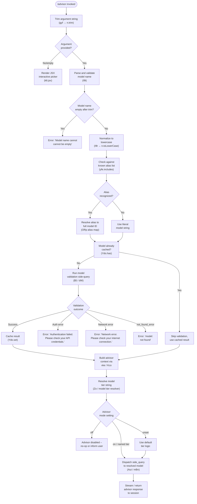

# `/advisor`

> Analysis basis: CC v2.1.186 bundle.js (AST extraction + Claude interpretation)
> Minimum version: v2.1.186

---

## Overview

The `/advisor` command lets Claude Code consult a stronger or more capable model at key decision moments during a session. It is a `local-jsx` command that, when invoked, constructs and dispatches a side-query to a configurable target model (selected from a ranked list including Opus, Sonnet, Haiku, Fable, and "best" tiers), validates the target model name, and returns the advisor model's response inline to the running session.

---

## Registration

| Field | Value |
|---|---|
| type | `local-jsx` |
| name | `advisor` |
| description | `Let Claude consult a stronger model at key moments` |
| argumentHint | `[ ... ]` |
| isHidden | `null` (not hidden) |
| module_id | `SOl` |
| load_inline | `true` |
| loc_byte | `12774984` |
| loc_byte_end | `12775240` |
| loc_line | `8682` |
| arbor_handler.name | `gyf` |
| arbor_handler.fqn | `claude-2.1.186::gyf` |
| arbor_handler.kind | `AsyncFunction` |
| arbor_handler.resolution_path | `module_id` |
| arbor_handler.n_hits | `2` |

Analysis basis: CC v2.1.186 bundle.js:+12774984

---

## Input Branching

The command has multiple distinct branches: argument trimming/validation, model alias resolution (many named tiers), model availability checking, and error dispatch. A flowchart is used to capture these paths.



---

## Behavioral Spec

### Handler Entry Point — `advisorCommandHandler` (`gyf`)

The Arbor-resolved handler is the async function `gyf` (FQN: `claude-2.1.186::gyf`, resolved via `module_id` → `SOl`).

```
async function advisorCommandHandler(commandArgs, appContext):
    rawInput = commandArgs.trim()                     // gyf → n.trim
    if rawInput is empty or undefined:
        return renderInteractivePicker(appContext)    // gyf → k6.jsx

    parsedModel = parseAndValidateModelName(rawInput) // gyf → I9t
    advisorContext = buildAdvisorContext(appContext)   // gyf → vke
    tierConfig = resolveModelTierConfig(parsedModel)  // gyf → Zo
    filteredTools = filterAdvisorTools(appContext)    // gyf → Aut

    return dispatchSideQuery(advisorContext, tierConfig, filteredTools)
```

Analysis basis: CC v2.1.186 bundle.js:+12774462, +12774498, +12774596, +12774610, +12774684, +12774757

---

### Sub-feature: Model Name Validation (`modelNameValidator` / `I9t`)

```
async function modelNameValidator(rawName):
    name = rawName.trim()
    if name is empty:
        throw Error("Model name cannot be empty")     // literal at +9065793

    normalized = name.toLowerCase()                   // +9065941
    if normalized in knownModelSuffixes:              // yfe.includes, +9065960
        // alias recognized

    if validationCache.has(normalized):               // Ydo.has, +9066062
        return validationCache.get(normalized)

    // Run a minimal probe query to validate model existence
    result = await runModelValidationQuery(normalized) // $5, +9066107

    if authError:
        return "Authentication failed. Please check your API credentials." // +9066529
    if networkError:
        return "Network error. Please check your internet connection."     // +9066631
    if result.type == "not_found_error":              // +9066750
        return "model: " + normalized + " not found"  // +9066832

    validationCache.set(normalized, result)           // Ydo.set, +9066270
    return result
```

Analysis basis: CC v2.1.186 bundle.js:+9065756, +9065793, +9065827, +9065941, +9065960, +9066062, +9066107, +9066270

---

### Sub-feature: Alias Resolution (`modelAliasResolver` / `ORp`)

The resolver maps short alias strings to known full model identifiers. The alias table (derived from literals found in the implementation) includes:

| Alias input | Resolved model family |
|---|---|
| `fable-5` / `fable_5` | `claude-fable-5` |
| `opus-4-8` / `opus_4_8` | `claude-opus-4-8` |
| `opus-4-7` / `opus_4_7` | `claude-opus-4-7` |
| `opus-4-6` / `opus_4_6` | `claude-opus-4-6` |
| `opus-4-5` / `opus_4_5` | `claude-opus-4-5` |
| `sonnet-4-6` / `sonnet_4_6` | `claude-sonnet-4-6` |
| `sonnet-4-5` / `sonnet_4_5` | `claude-sonnet-4-5` |

```
function modelAliasResolver(normalizedAlias):
    lowerAlias = normalizedAlias.toLowerCase()         // ORp → e.toLowerCase, +9067081
    if knownAliasList.includes(lowerAlias):            // ORp → t.includes, +9067100
        return aliasToFullModelId(lowerAlias)          // ORp → Vp, +9067185
    return normalizedAlias                             // pass through unchanged
```

Analysis basis: CC v2.1.186 bundle.js:+9067063, +9067081, +9067100, +9067185

---

### Sub-feature: Model Tier Configuration (`modelTierResolver` / `Zo`)

The tier resolver maps symbolic tier names to model strings and handles provider-specific routing. Supported tier names found in literals:

| Tier literal | Meaning |
|---|---|
| `"opusplan"` | Opus-class planning model |
| `"sonnet"` | Sonnet-class model |
| `"haiku"` | Haiku-class model |
| `"opus"` | Opus-class model |
| `"fable"` | Fable-class model |
| `"best"` | Highest available model |

The resolver also inspects provider context (`firstParty`, `anthropicAws`, `gateway`, `bedrock`, `foundry`, `mantle`, `vertex`) and applies format markers such as `"[1m]"` for specific routing signals.

```
function modelTierResolver(tierName, providerContext):
    normalized = tierName.trim()                       // Zo → e.trim, +2294335
    lower = normalized.toLowerCase()                   // Zo → t.toLowerCase, +2294346

    baseModel = lookupTierTable(lower)                 // Zo → TH, +2294364
    sanitized = sanitizeModelName(baseModel)           // Zo → yl, +2294374
    if isExcludedModel(sanitized):                     // Zo → XM, +2294392
        sanitized = applyFallback(sanitized)

    providerAdjusted = applyProviderRouting(sanitized, providerContext)  // Zo → Sfe, +2294427
    withFormat = applyFormatMarker(providerAdjusted)   // "[1m]" marker, +2294460
    withOpusPlan = resolveOpusPlan(withFormat)         // Zo → ww, +2294493
    withAfe = resolveAfeTier(withOpusPlan)             // Zo → Afe, +2294570
    withZG = applyZGTransform(withAfe)                 // Zo → zG, +2294610
    final = applyFinalNormalization(withZG)            // Zo → A_, +2294613

    return final
```

Analysis basis: CC v2.1.186 bundle.js:+2294335, +2294346, +2294364, +2294374, +2294392, +2294427, +2294460, +2294493, +2294570, +2294610, +2294613, +2294628, +2294642, +2294660, +2294666, +2294674, +2294715, +2294723, +2294736

---

### Sub-feature: Advisor Context Builder (`advisorContextBuilder` / `vke`)

```
function advisorContextBuilder(appContext):
    conversationContext = buildConversationContext(appContext)  // vke → ja, +8737897
    normalizedContext = normalizeMessages(conversationContext)  // vke → So, +8737978
    modelContext = resolveModelContext(normalizedContext)       // vke → Kco, +8737986
    return modelContext
```

The inner `modelContextResolver` (`Kco`) composes the conversation normalization (`So`), model-tier resolution (`Zo`), logging reference (`Lr`), content-filter check (`zoe`), model-string builder (`mz`), and type-inclusion checker (`nJe`/`nfn`).

Analysis basis: CC v2.1.186 bundle.js:+8737897, +8737978, +8737986, +8737653, +8737656, +8737667, +8737676, +8737685, +8737700, +8737709

---

### Sub-feature: Side Query Dispatch (`sideQueryDispatcher` / `Aut` + `mBn`)

```
function filterAndDispatchAdvisorQuery(appContext, advisorContext, tierConfig):
    eligibleTools = availableTools.filter(...)         // Aut → Awp.filter, +8737853
    queryBundle = buildQueryBundle(advisorContext,
                                   tierConfig,
                                   eligibleTools)      // Aut → mBn, +8737869

    // mBn composes: advisor context builder, response processor, tier resolver
    result = dispatchSideQuery(queryBundle)            // mBn → vke, Rp, Zo
    return result
```

The string literal `"side_query"` (bundle.js:+8947057) and `"sideQuery"` (bundle.js:+8948468) confirm this pathway is classified as a side query, separate from the main conversation turn.

Analysis basis: CC v2.1.186 bundle.js:+8737853, +8737869, +8737816, +8737820, +8737823

---

### Sub-feature: Advisor Mode Toggle

The `/advisor` command respects a mode flag with at least three states, found as string literals:

- `"off"` (bundle.js:+12774528) — advisor is disabled; the command is a no-op.
- `"unset"` (bundle.js:+12774539) — advisor mode not explicitly configured; default tier logic applies.
- Named tier / `"on"` — advisor is active; the resolved model is consulted.

Analysis basis: CC v2.1.186 bundle.js:+12774528, +12774539

---

### Sub-feature: Validation Side-Query Engine (`validationQueryRunner` / `$5`)

The model validation sub-query uses the same API client stack as the main conversation (`dW`), but is tagged with `"model_validation"` (bundle.js:+9066157). A short ephemeral probe message (`"Hi"`, bundle.js:+9066226; cache_control `"ephemeral"`, bundle.js:+9066251) is sent to the candidate model to confirm reachability.

```
async function runModelValidationQuery(modelId):
    message = { role: "user", content: "Hi" }          // +9066226
    params = {
        model: modelId,
        purpose: "model_validation",                    // +9066157
        cache_control: "ephemeral",                     // +9066251
        messages: [message]
    }
    try:
        response = await apiClient.call(params)         // $5 → dW
        storeValidationResult(modelId, response)        // Ydo.set
        return response
    catch AuthError:
        return AUTH_FAILURE_MESSAGE
    catch NetworkError:
        return NETWORK_FAILURE_MESSAGE
    catch NotFoundError:
        return "model: " + modelId
```

Analysis basis: CC v2.1.186 bundle.js:+9066157, +9066226, +9066251, +9066311, +9066529, +9066631, +9066729, +9066750, +9066832

---

## State & Side Effects

| Item | Detail |
|---|---|
| Telemetry | `tengu_api_success` (+8948728), `tengu_lone_surrogate_sanitized` (+8948424), `tengu_prompt_cache_1h_config` (+13604140), `tengu_scheduled_task_missed` (+16616739), `tengu_scheduled_task_fire` (+16617490), `tengu_scheduled_task_expired` (+16617833), `tengu_daemon_yield` (+17177902), `tengu_bg_retire_grace_bridged_min` (+13161510), `tengu_bg_retire_pinned_low_mem` (+17162316), `tengu_bg_attach_upgrade` (+13161582), `tengu_bg_prewarm_per_sweep` (+17162437) |
| Validation cache | Model validation results are written to a session-scoped Map (`Ydo`) keyed by normalized model name to avoid redundant probe calls (+9066062, +9066270) |
| Side query classification | Dispatched as `"side_query"` / `"sideQuery"` — does not affect the main conversation turn count |
| appState changes | Advisor mode state (`"off"` / `"unset"` / active) is read from app configuration; no persistent write observed in depth-2 traversal |
| Hook registration | <!-- TODO: not found in depth-2 traversal; needs --depth 4 --> |
| Sound | <!-- TODO: not found in depth-2 traversal; needs --depth 4 --> |
| API headers | Side query uses full standard API header set including `X-Claude-Code-Session-Id`, `x-client-app`, `x-claude-code-agent-id`, and `User-Agent` (inherited from `dW` / `IQu`) |
| Process exit | `process.exit` is reachable from the `Ts` → `X8e` / `sT` path in the call graph (+13194106), indicating fatal error handling on stream failure |

---

## Version History

| Version | Change |
|---|---|
| v2.1.186 | Initial analysis |

---

## Common Mistakes

1. **Invoking `/advisor off` to disable and expecting persistence** — the `"off"` mode is read from configuration at invocation time; toggling it mid-session requires updating the advisor setting, not re-running the command with `off` as an argument.
2. **Passing a partial model name without a recognized alias** — if the alias is not in `yfe` (the known-suffix list) and the literal name does not match any known model, the validation probe will return a `not_found_error`. Always use full model IDs or documented alias shortcuts.
3. **Assuming the advisor shares the main conversation context fully** — the side query is dispatched via the `"side_query"` pathway; context composition is handled by `vke` / `Kco`, which may apply its own filtering and normalization distinct from the primary turn.
4. **Expecting `/advisor` to work when mode is `"unset"` without a default model configured** — in the `"unset"` state, the tier resolver (`Zo`) applies default logic that requires at least one model tier to be reachable; if no provider is configured, the command may silently no-op.
5. **Supplying model names with mixed case** — the validator normalizes to lowercase before alias lookup and cache key generation; however, the full model ID passed to the API preserves the resolved casing from the alias table.

---

## Appendix — Identifier Mapping

> For bundle debugging only. Identifiers change across versions.

| Identifier | Role |
|---|---|
| `gyf` | Main advisor command handler (AsyncFunction, FQN `claude-2.1.186::gyf`) |
| `Ts` | Stream error / fatal exit dispatcher |
| `Zo` | Model tier configuration resolver |
| `TH` | Tier-name-to-base-model lookup table accessor |
| `Tfe` | Model string formatter (used by TH) |
| `ot` | Low-level string coercion / `String()` wrapper |
| `yl` | Model name sanitizer (regex replace) |
| `XM` | Excluded-model checker (suffix include list) |
| `Sfe` | Provider-specific routing applicator |
| `Fkr` | Provider routing sub-dispatcher |
| `Vp` | Provider context resolver (firstParty / bedrock / vertex / etc.) |
| `az` | Auth/provider base builder |
| `ywt` | Name replace transformer |
| `ww` | Opus-plan tier resolver |
| `tfn` | Format-tier sub-resolver |
| `Vu` | Tier base value provider |
| `Afe` | Afe-tier resolver |
| `$kr` | Afe sub-resolver |
| `zG` | ZG model string transform |
| `A_` | Final model name normalization step |
| `STe` | Sub-tier provider builder |
| `br` | Provider base string builder |
| `G6s` | Model group / family resolver |
| `mz` | Model string assembler |
| `Su` | Suffix utility |
| `Efe` | Array / type checker for model config |
| `zoe` | Content-inclusion checker |
| `ja` | Conversation context builder |
| `VIt` | Context header builder |
| `KIt` | Context key/object assembler |
| `BNe` | Blocked-name list checker |
| `Zpn` | Context normalization sub-pipeline |
| `$6s` | Entry-based context transformer |
| `In` | Context injection helper |
| `vXe` | Entry mapper / Object.entries walker |
| `F6s` | Name-index finder |
| `z2u` | Model context sub-assembler |
| `dwt` | Model name derivation utility |
| `j2u` | Context startsWith router |
| `Koe` | Role/content-type checker |
| `GNe` | Context generator using `ot` |
| `X2u` | Lowercase model name transformer |
| `nU` | Normalization utility orchestrator |
| `So` | Message normalization pipeline |
| `YH` | Message string processor (lower/include/replace) |
| `EEt` | Message error type constant |
| `Rp` | String replace utility |
| `bH` | Auth token helper |
| `wvt` | Auth base builder |
| `dUu` | Token prefix checker |
| `LNe` | Lowercase/value auth lookup |
| `I9t` | Model name parse-and-validate pipeline |
| `$5` | Model validation side-query runner |
| `Lf` | Route label builder |
| `Rt` | Route classifier |
| `dW` | Core API request dispatcher |
| `gz` | API base initializer |
| `gUr` | URL/path parser (split/trim/indexOf/slice) |
| `Ws` | Header builder |
| `Oz` | Error formatter |
| `Kkr` | URL encoder (replace + encodeURIComponent) |
| `T` | Request type tagger |
| `wh` | OAuth token refresher |
| `Y6s` | Boolean presence flag builder |
| `ny` | Request options assembler |
| `GH` | Session/global header injector |
| `_Qu` | Queue / back-pressure controller |
| `Lr` | Logger reference |
| `gln` | Proxy-auth helper runner |
| `IQu` | HTTP request executor (UUID, set/get, SSE) |
| `K$` | Config key accessor |
| `J_` | JWT/token lifecycle manager |
| `TQu` | Token refresh/expiry checker |
| `yQu` | Credential resolver |
| `wTe` | Timing/promise wrapper |
| `$ir` | Timestamp utility |
| `Ekt` | Header key lowercaser |
| `_Ie` | SDK error logger |
| `c_n` | Request content assembler |
| `D` | Session/task scheduler |
| `k` | Stream writer |
| `w` | Focus/blur session tracker |
| `kre` | Model prefix finder |
| `WC` | Worker context accessor |
| `iA` | Auth profile resolver |
| `LTe` | Provider token exchanger |
| `mJe` | WIF credentials resolver (fetch-based) |
| `I` | Input event handler |
| `g` | Timer/scheduler |
| `a` | Model cache map accessor |
| `wFe` | Claude-3 family checker |
| `SO` | Provider base for `br` |
| `ese` | Model endpoint selector |
| `Qyt` | Endpoint query builder |
| `RRr` | Resource name replacer |
| `_` | SDK transport initializer |
| `N_t` | SDK HTTP connector |
| `Re` | SDK retry/error handler |
| `ao` | Error/string coercer |
| `Ikp` | Model preference finder |
| `ddo` | Hash generator (SHA-256) |
| `ufn` | User-agent / header string builder |
| `el` | String coercion utility |
| `lfn` | Async-local-storage store getter |
| `WNe` | Header value appender |
| `CSn` | Cache-segment namespace builder |
| `Z5e` | Memory/context segment loader |
| `yo` | Conversation runner sub-init |
| `Ear` | Memory relevance scorer |
| `it` | Task registration entry |
| `Sar` | File/memory relevance filter |
| `ZM` | Model config validator |
| `kUr` | Config base builder |
| `vFe` | HIPAA/compliance flag checker |
| `L` | Background worker sweep manager |
| `q` | Scheduled task clock manager |
| `CVt` | System memory checker |
| `q2l` | Worker retirement checker |
| `D2e` | Disk/file cache manager |
| `Wn` | Worker node reference |
| `CXn` | Worker attach upgrader |
| `z` | Keyboard input interceptor |
| `JBa` | JSON builder utility |
| `__n` | Temperature / side-query option setter |
| `jC` | Message array mapper |
| `Awe` | Conversation message assembler |
| `_W` | Random-bytes nonce generator |
| `pc` | Pipeline sub-runner |
| `De` | JSON.stringify wrapper |
| `fWo` | Tool-call array manipulator (pop/push) |
| `IJt` | Tool-call validator |
| `EN` | Deep clone (structuredClone) |
| `vJt` | Tool-result array manipulator |
| `CJt` | Tool content replacer |
| `Ke` | Key-value config entry |
| `KVe` | Config value constant |
| `MRr` | Response metadata recorder |
| `aWs` | Tool-use pattern matcher |
| `xRr` | Structured output cache checker |
| `ASe` | API success recorder |
| `Mr` | Model-config merge utility |
| `yH` | Config key accessor (KVe-based) |
| `Go` | Config override getter |
| `EDt` | Agent dispatch controller |
| `_1i` | Agent id resolver |
| `Snt` | Agent config snapshot |
| `yDt` | Agent run sub-dispatcher |
| `FU` | Agent type prefix router |
| `iId` | Built-in agent resolver |
| `$O` | Agent context type checker |
| `Wyt` | Cache-control policy appender |
| `PRp` | Alias resolution pipeline |
| `ORp` | Alias-to-model-ID mapper |
| `vke` | Advisor context builder |
| `Kco` | Model context resolver |
| `nJe` | Content type inclusion checker |
| `nfn` | Content normalization builder |
| `Aut` | Tool filter and side-query dispatcher |
| `mBn` | Query bundle assembler |

---

Note: index built via Arbor fallback; some signals (telemetry, literals) may be missing — see arbor-fallback.js.