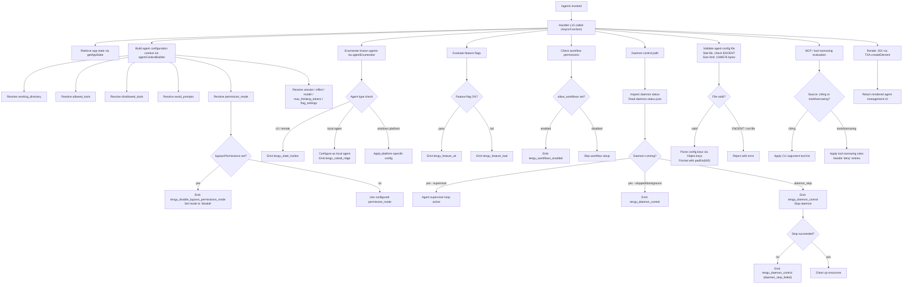

# `/agents`

> Analysis basis: CC v2.1.178 bundle.js (AST extraction + Claude interpretation)
> Minimum version: v2.1.178

---

## Overview

The `/agents` command provides a management interface for agent configurations within Claude Code. It allows users to inspect, modify, and control the lifecycle of background agents and daemon processes, including their tool permissions, working directories, permission modes, and runtime settings. The command renders a JSX-based UI component and delegates to an async handler (`L15`) that orchestrates agent state retrieval, configuration validation, and daemon control operations.

---

## Registration

| Field | Value |
|---|---|
| type | `local-jsx` |
| name | `agents` |
| description | `Manage agent configurations` |
| loc_byte | `12974192` |
| loc_byte_end | `12974317` |
| loc_line | `8995` |
| module_id | `bPK` |
| load_inline | `true` |
| arbor_handler.name | `L15` |
| arbor_handler.fqn | `claude-2.1.178::L15` |
| arbor_handler.kind | `AsyncFunction` |
| arbor_handler.resolution_path | `module_id` |
| arbor_handler.n_hits | `0` |

Analysis basis: CC v2.1.178 bundle.js:+12974192

---

## Input Branching

The `/agents` command involves more than three distinct operational paths across handler invocation, daemon control, agent configuration, permission evaluation, and JSX rendering. A Mermaid flowchart is required.



Analysis basis: CC v2.1.178 bundle.js:+12974064

---

## Behavioral Spec

### 1. Handler Entry Point

The primary handler `L15` is an `AsyncFunction` resolved via `module_id` path (`bPK`). It is invoked when the user runs `/agents` and dispatches to two top-level sub-handlers before rendering.

```
async function agentsCommandHandler(context):
    appState = retrieveAppState()                    // calls getAppState
    agentConfig = buildAgentConfigContext(appState)  // calls agentConfigBuilder (b_)
    agentList  = enumerateAgents(appState)           // calls agentEnumerator (ah)
    uiElement  = renderAgentsUI(agentConfig, agentList)  // TXA.createElement
    return uiElement
```

Analysis basis: CC v2.1.178 bundle.js:+12974043, +12974051, +12974064

---

### 2. Agent Configuration Context Builder

Resolves agent runtime configuration fields from app state. Searches for the last matching configuration entry (`findLast`) and extracts named fields.

```
function buildAgentConfigContext(appState):
    entry = appState.findLast(matchesCriteria)

    config = {
        working_directory : entry["working_directory"],   // literal at +10800701
        allowed_tools     : entry["allowed_tools"],       // literal at +10800756
        disallowed_tools  : entry["disallowed_tools"],    // literal at +10800811
        avoid_prompts     : entry["avoid_prompts"],       // literal at +10800872
        permission_mode   : entry["permission_mode"],     // literal at +10800974
        bypassPermissions : entry["bypassPermissions"],   // literal at +10801005
        session           : entry["session"],             // literal at +10801304
        effort            : entry["effort"],              // literal at +10801329
        model             : entry["model"],               // literal at +10801342
        max_thinking_tokens: entry["max_thinking_tokens"],// literal at +10801354
        flag_settings     : entry["flag_settings"],       // literal at +10801380
    }

    if config.bypassPermissions:
        emitTelemetry("tengu_disable_bypass_permissions_mode")
        config.permission_mode = "disable"    // literal at +4309116

    permissionManager = resolvePermissions(config)  // calls permissionResolver (Nx)
    return config
```

Analysis basis: CC v2.1.178 bundle.js:+10800596, +10800676, +10800774, +10800832, +10801027

---

### 3. Permission Mode Resolution

When the configured `permission_mode` includes `bypassPermissions`, the permission system disables bypass and records telemetry. The permission resolver (`Nx`) then calls the object-level permission store (`O6`) which checks multiple permission sets.

```
function resolvePermissions(config):
    if config.bypassPermissions:
        emitTelemetry("tengu_disable_bypass_permissions_mode")  // +4309015
        return setPermissionMode("disable")

    permissionStore = getPermissionStore()                  // O6 → uXH, xg
    if permissionStore.has(config.permission_mode):
        entry = permissionStore.get(config.permission_mode)
        result = applyPermissionEntry(entry)                // S6 path
        result.timestamp = Date.now()                       // +3347633
        emitWorkflowPermission(result)                      // wnf
        return result
    else:
        return deduplicateAndRegister(config)               // o$8 path
```

Analysis basis: CC v2.1.178 bundle.js:+4309012, +4309062, +3325253, +3325342, +3325379, +3325416

---

### 4. Agent Enumerator and UI Builder

Constructs the list of presentable agent entries by collecting environment info, feature flags, and tool configurations, then assembles them into UI-ready structures.

```
function buildAgentList(appState):
    results = []

    // Resolve configuration types (+4949887, +4949904, +4949949)
    configTypes = resolveConfigTypes()   // eT: Ul, DK, L6, O6

    // Enumerate agent entries
    for each agentEntry in configTypes:
        agentType = determineAgentType(agentEntry)    // cli / remote / local-agent

        if agentType in ["cli", "remote"]:             // +4950039, +4950050
            emitTelemetry("tengu_slate_harbor")        // +4950069

        if agentType == "local-agent":                 // +6970102
            localAgentConfig = buildLocalAgentConfig(agentEntry)   // x_6, F2
            emitTelemetry("tengu_cobalt_ridge")        // +4946211

        // Apply platform checks
        if platform == "windows":                      // +4946117
            applyWindowsConfig(agentEntry)

        results.push(agentEntry)

    return results
```

Analysis basis: CC v2.1.178 bundle.js:+10264292, +10264364, +4949887, +4950039, +6970102, +4946117

---

### 5. Feature Flag Evaluation

Before agent operations proceed, the handler checks feature flags via two separate flag evaluators (`GK.isEnabled`, `O.isEnabled`). Results are filtered and mapped.

```
function evaluateFeatureFlags(agentEntries):
    // Filter entries by flag availability
    flaggedEntries = agentEntries.filter(hasFlag)         // ah → K.filter (+10264745)
    
    for each entry in flaggedEntries:
        if featureRegistry.has(entry.id):                 // xH6.has (+10264760)
            continue

        isGKEnabled = GK.isEnabled(entry)                 // +10264669
        isOEnabled  = O.isEnabled(entry)                  // +10264799

        if isGKEnabled or isOEnabled:
            emitTelemetry("tengu_feature_ok")             // +1020153
        else:
            emitTelemetry("tengu_feature_bad")            // +1020220

    mapped = agentEntries.map(transformEntry)             // K.map (+10264788)
    return mapped
```

Analysis basis: CC v2.1.178 bundle.js:+10264618, +10264646, +10264669, +10264745, +10264799

---

### 6. Daemon Control and Status Management

The daemon subsystem manages background agent supervisor processes. It reads a status file (`daemon.status.json`), evaluates running state, and handles stop/restart operations.

```
function manageDaemon(config):
    statusPath = joinPath(baseDir, "daemon.status.json")   // +13159612

    // Read current daemon status
    statusData = readDaemonStatus(statusPath)

    if statusData.state == "supervisor":                    // +17081153
        // Supervisor loop is active — heartbeat mode
        supervisorLoop = startHeartbeat()                  // "heartbeat" +17080374
        supervisorLoop.updateConfig(config)
        supervisorLoop.start()

    elif statusData.state in ["stopped", "background session"]:  // +17103897, +17103940
        emitTelemetry("tengu_daemon_control")              // +17104063

    // Handle daemon stop request
    if stopRequested:
        events.push({ kind: "daemon_stop" })               // +17103988
        stopResult = attemptDaemonStop()

        if stopResult.failed:
            events.push({ kind: "daemon_stop_failed" })    // +17104025
            emitTelemetry("tengu_daemon_control")

        else:
            cleanupResources()

    // Config reload after changes
    if configChanged:                                      // mtime changed +17086569
        emitTelemetry("tengu_daemon_config_reload")        // +17081946
```

Analysis basis: CC v2.1.178 bundle.js:+13159612, +17081153, +17080374, +17103988, +17104025, +17081946

---

### 7. Agent Configuration File Validation

When a configuration file path is provided, the handler stats the file, validates it is a regular file, and enforces a maximum file size before parsing its keys.

```
function validateAgentConfigFile(filePath):
    try:
        stat = fileSystem.stat(filePath)           // MZK.stat +13348363
    except ENOENT:                                 // "ENOENT" +13348394
        return Promise.reject(fileNotFoundError)   // +13348408

    if not stat.isFile():                          // +13348435
        return Promise.reject(notAFileError)

    if stat.size > 1048576:                        // 1048576 bytes max +13348454
        return Promise.reject(fileTooLargeError)

    configData = parseConfigFile(filePath)         // f9 → P2f.getStore
    keys = Object.keys(configData)                 // +13348872
    formatted = keys.map(k => k.padEnd(40))        // padEnd(40) +17093864, "  " +17091893

    return { keys, formatted, configData }
```

Analysis basis: CC v2.1.178 bundle.js:+13348363, +13348394, +13348454, +13348872, +17093864

**Maximum agent config file size: 1,048,576 bytes** (bundle.js:+13348454)

---

### 8. Tool Permission Narrowing

Tool lists are resolved through two distinct sources — CLI arguments and a tool-narrowing subsystem — with `deny` entries handled separately.

```
function resolveToolPermissions(agentEntry):
    permissionSources = gatherPermissionSources(agentEntry)
    // Xu6 +11222187: sd (flatMap kB8) for deny-list, G$A for allow-list, T$A for combined

    denyList = permissionSources.filter(src => src.action == "deny")  // "deny" +11221384

    for each source in permissionSources:
        if source.kind == "cliArg":            // "cliArg" +11222124
            applyCliArgTools(source.tools)

        elif source.kind == "toolsNarrowing":  // "toolsNarrowing" +11222145
            applyToolNarrowing(source.tools, denyList)

    // Filter blocked tools
    blocked = agentEntry.tools.filter(t => blockedSet.has(t))   // "blocked" +10263752
    return agentEntry.tools.filter(t => !blocked.includes(t))
```

Analysis basis: CC v2.1.178 bundle.js:+11222187, +11221384, +11222124, +11222145, +10263752

---

### 9. MCP Connection Management

For agents that communicate over MCP, the handler manages connection lifecycle including connection mode (stdio, sdk, http, sse, dynamic) and connection state tracking.

```
function manageMCPConnection(agentEntry):
    connectionMode = agentEntry.connectionType
    // Supported modes: "stdio" +6790503, "sdk" +6790521, "http" +16901615,
    //                  "sse" +16901632, "dynamic" +16901712

    connection = openConnection(connectionMode)
    connection.on("connected", handleConnected)    // "connected" +16904443

    if connection.fails:
        connection.status = "failed"               // "failed" +16904630
        connection.message = "Connection failed"   // +16904648
        emitFailureState()

    // Supervisor manages ongoing connection set
    activeConnections.add(connection)              // q.add +17072131

    connection.finally(() => {
        activeConnections.delete(connection)       // q.delete +17072154
    })
```

Analysis basis: CC v2.1.178 bundle.js:+6790503, +6790521, +16901615, +16901632, +16904443, +16904630, +17072131

---

### 10. Agent Process Lifecycle (Start / Stop / Restart)

Background agent processes go through explicit lifecycle transitions managed by the supervisor.

```
function manageAgentLifecycle(agentEntry, operation):
    if operation == "stop":
        agent.stop()                    // E.stop +17081541, T.stop +17081421

        // Clamp exit delay
        delay = Math.max(0, Math.min(exitDelay, maxDelay))  // +16422355, +16422366

        await shutdownAll(activeAgents) // Promise.all +16904544

    elif operation == "start":
        agent.updateConfig(newConfig)   // E.updateConfig +17081550
        agent.start()                   // E.start +17081568, V.start +17081726

        // Random jitter for stagger: Math.random() * 2 + 1  // +14211632, +14211634, +14211648
        jitter = Math.random() * 2 + 1
        setTimeout(startCallback, jitter)    // +14211671

    elif operation == "restart":
        manageAgentLifecycle(agentEntry, "stop")
        manageAgentLifecycle(agentEntry, "start")

    // Emit config reload telemetry after changes
    emitTelemetry("tengu_daemon_config_reload")
```

Analysis basis: CC v2.1.178 bundle.js:+17081541, +17081550, +17081568, +14211632, +14211671, +16422355

---

### 11. Workflow Permission Check

Workflow enablement is gated behind `allow_workflows` and `allow_product_feedback` flags, with telemetry emitted on activation.

```
function checkWorkflowPermissions(config):
    if config.allow_product_feedback:              // "allow_product_feedback" +2542746
        // Check Uhf and Bhf sets
        if not Uhf.has(sessionId):
            if not Bhf.has(sessionId):
                if config.allow_workflows:         // "allow_workflows" +2544353
                    emitTelemetry("tengu_workflows_enabled")  // +2544554
                    // Only for "pro" tier users   // "pro" +2544799
                    if tier == "pro":
                        enableWorkflowFeatures()
```

Analysis basis: CC v2.1.178 bundle.js:+2542746, +2544353, +2544554, +2544799

---

### 12. Shutdown and Abort Handling

The command registers an abort/shutdown path for graceful termination of in-flight agent operations.

```
function handleShutdown(agentSet):
    // Race: either shutdown completes or timeout fires
    result = Promise.race([
        Promise.all(shutdownAll(agentSet)),    // f5H → K5H.shutdown +2531830
        timeoutPromise(500)                    // 500 ms timeout +17099106
    ])

    // Abort in-flight requests
    if result == "aborted":                    // "aborted" +2493538
        clearTimeout(pendingTimer)             // +2493657
        signalAbort("abort")                   // "abort" +2493616

    // Attempt clean exit
    process.exit(exitCode)                     // +17099145
```

**Shutdown timeout: 500 ms** (bundle.js:+17099106)

Analysis basis: CC v2.1.178 bundle.js:+17099062, +17099076, +17099106, +17099145, +2531830

---

## State & Side Effects

| Item | Detail |
|---|---|
| Telemetry: `tengu_disable_bypass_permissions_mode` | Emitted when `bypassPermissions` is set; permission mode forced to `"disable"` (bundle.js:+4309015) |
| Telemetry: `tengu_slate_harbor` | Emitted when agent type is `"cli"` or `"remote"` (bundle.js:+4950069) |
| Telemetry: `tengu_daemon_config_reload` | Emitted after daemon configuration is reloaded or mtime change detected (bundle.js:+17081946) |
| Telemetry: `tengu_workflows_enabled` | Emitted when `allow_workflows` is active for eligible users (bundle.js:+2544554) |
| Telemetry: `tengu_cobalt_ridge` | Emitted when a `"local-agent"` type agent is configured (bundle.js:+4946211) |
| Telemetry: `tengu_feature_ok` | Emitted when a feature flag check passes (bundle.js:+1020153) |
| Telemetry: `tengu_feature_bad` | Emitted when a feature flag check fails (bundle.js:+1020220) |
| Telemetry: `tengu_daemon_control` | Emitted on daemon stop, stop failure, or background session state change (bundle.js:+17104063) |
| Daemon status file | Reads `daemon.status.json` from the state directory (bundle.js:+13159612) |
| App state mutation | Updates agent configuration entries in app state via `getAppState` (bundle.js:+10800596) |
| Agent process lifecycle | Calls `.stop()`, `.updateConfig()`, `.start()` on agent process objects (bundle.js:+17081541, +17081550, +17081568) |
| MCP connection set | Maintains a `Set` of active MCP connections; adds and removes on connect/disconnect (bundle.js:+17072131, +17072154) |
| Timer: startup jitter | `setTimeout` with random jitter `Math.random() * 2 + 1` to stagger agent starts (bundle.js:+14211671) |
| Timer: shutdown timeout | 500 ms deadline for graceful agent shutdown before forced exit (bundle.js:+17099106) |
| Process exit | Calls `process.exit()` after failed graceful shutdown (bundle.js:+17099145) |
| JSX rendering | Invokes `TXA.createElement` to produce the agent management UI panel (bundle.js:+12974064) |
| Hook registration | <!-- TODO: not found in depth-2 traversal; needs --depth 4 --> |
| Sound | <!-- TODO: not found in depth-2 traversal; needs --depth 4 --> |

---

## Version History

| Version | Change |
|---|---|
| v2.1.178 | Initial analysis |

---

## Common Mistakes

1. **Assuming `/agents` takes a subcommand argument**: The command registers as `local-jsx` with no documented subcommand schema at this depth. All branching is internal to the handler based on existing app state; passing free-text arguments may have no effect.

2. **Expecting synchronous output**: The handler (`L15`) is an `AsyncFunction`. Output is rendered as JSX, not plain text. Scripting contexts that expect line-based output will not receive it in the expected form.

3. **Ignoring file size limits on agent config files**: Configuration files are validated against a hard limit of **1,048,576 bytes**. Files exceeding this limit are rejected before any keys are parsed (bundle.js:+13348454).

4. **Manually setting `bypassPermissions` expecting it to persist**: The handler immediately detects `bypassPermissions: true` and overrides `permission_mode` to `"disable"`, emitting a telemetry event. This override is applied at handler invocation time, not at a later configuration stage.

5. **Confusing `allowed_tools` and `disallowed_tools` sources**: Tool lists may come from either `cliArg` or `toolsNarrowing` sources, and `deny` entries are handled separately. Mixing configuration sources without understanding the priority order can result in unexpected tool availability.

6. **Expecting immediate daemon stop**: Daemon shutdown is subject to a **500 ms timeout** (bundle.js:+17099106). If agents do not shut down within this window, a forced `process.exit` is called. Do not rely on clean teardown being guaranteed.

7. **Missing `allow_workflows` tier requirement**: Workflow features are only activated for `"pro"` tier accounts with `allow_product_feedback` and `allow_workflows` both enabled (bundle.js:+2544799). Other tiers receive no workflow activation even if the flags appear set.

---

## Appendix — Identifier Mapping

> For bundle debugging only. Identifiers change across versions.

| Identifier | Role |
|---|---|
| `L15` | Primary async handler for `/agents` command (arbor_handler) |
| `b_` | Agent configuration context builder; calls `getAppState`, `findLast` |
| `H` | App state object / event emitter; uses `Math.random`, `setTimeout` |
| `A` | Agent entry collection; calls `toLowerCase`, `close` |
| `L` | Agent/connection object; calls `close`, `finally`, `isFile`, `set`, `get`, `delete`, `padEnd` |
| `q` | Active MCP connection set; methods: `add`, `delete`, `write`, `includes` |
| `f` | Connection registration helper; calls `q.add`, `L.finally`, `q.delete` |
| `tp8` | Tool permission resolver (allowed_tools branch) |
| `ep8` | Tool permission resolver (disallowed_tools branch) |
| `K1` | Shared tool permission utility called by `tp8` and `ep8` |
| `Nx` | Permission mode coordinator; calls `O6`, `rA` |
| `O6` | Permission store resolver; checks `uXH`, `xg`, calls `S6`, `o$8` |
| `vG6` | Permission utility sub-function |
| `NG6` | Permission utility sub-function |
| `Xp` | Permission lookup helper; calls `qp` |
| `o$8` | Permission deduplication handler; manages `ny_`, `uXH` sets |
| `S6` | Permission entry applicator; calls `n6`, `kT`, `$k_`, `_MH`, `wnf`, `Date.now` |
| `ah` | Agent enumerator and UI data assembler |
| `eT` | Config type resolver; calls `Ul`, `DK`, `L6`, `O6` |
| `Ul` | Config type utility |
| `DK` | String-based config key transformer |
| `L6` | String utility (wraps `String`) |
| `Y` | Agent list builder / supervisor; manages heartbeat, stop, start, config reload |
| `hVH` | Agent config file validator; stats file, checks ENOENT, size limit |
| `Z8` | File validation utility |
| `f9` | Store accessor; calls `P2f.getStore` |
| `b2A` | Config file helper; calls `C2A` |
| `TH` | String transformer (wraps `String`) |
| `K` | Config key formatter; calls `f.map`, `L.padEnd` |
| `$ZK` | Config display formatter; calls `Object.keys`, `Math.max`, `hD` |
| `T` | Agent process handle (stop path); calls `ch6`, `j36` |
| `ch6` | Process stop sub-handler |
| `j36` | Process lifecycle utility; calls `OA4` |
| `E` | Agent process controller; start/stop/updateConfig; uses `Math.max`, `Math.min` |
| `W` | Agent connection manager; calls `j36`, `rR`, `hh`, `Promise.all`, `gr`, `dx`, `RH`, `jA` |
| `R14` | Heartbeat registration helper; calls `h1H` |
| `h1H` | Heartbeat utility |
| `V` | Agent start controller; uses `Math.max`, `Math.floor`, `S.preventDefault`; calls `E` |
| `S` | Scroll / input event handler for agent UI; calls `x14`, `D5`, `N`, `RH`, `Ub5`, `Y.write` |
| `d` | Base display/render utility |
| `f7A` | Agent factory; calls `NQq`, `x_` |
| `x_` | Agent constructor/init; calls `FvH`, `dt8`, `tc6.call`, `ec6.bind`, `W94`, `thA.set` |
| `ec6` | Agent event binding utility |
| `P2` | Agent provider resolver; calls `B78`, `kc1`, `d0_`, `Fhf` |
| `B78` | Provider builder; calls `L6`, `GT` |
| `GT` | Provider configuration utility |
| `kc1` | Permission check orchestrator; calls `M9` |
| `M9` | Permission gate; checks `Uhf`, `Bhf`, `allow_product_feedback`; calls `ab`, `qq`, `eLH`, `Tt` |
| `d0_` | Workflow enablement handler; calls `ghf` |
| `ghf` | Workflow config builder; calls `L6`, `O6`, `DK`, `Yq` |
| `Fhf` | Provider fallback; calls `GT` |
| `J4H` | Agent filter; calls `H.filter`, `Xu6` |
| `Xu6` | Tool permission source resolver; calls `sd`, `G$A`, `T$A` |
| `sd` | Deny-list builder; calls `kB8.flatMap`, `k3` |
| `G$A` | Allow-list builder; calls `$yH`, `Dj6`, `nDH`, `jM_`, `RT` |
| `T$A` | Combined tool permission resolver |
| `L7A` | Agent type configuration; calls `ek`, `W46`, `x_` |
| `ek` | Agent platform/type builder; calls `a6`, `L6`, `DK`, `l7H`, `O6` |
| `jf` | Agent field extractor; calls `a6`, `l7H` |
| `z` | Daemon event list; holds `SH`, `bH`, `AR`, `aB` entries |
| `SH` | Daemon stop success event builder; calls `d`, `dH` |
| `dH` | Event detail builder; calls `c36` |
| `bH` | Daemon stop failure event builder; calls `d`, `dH` |
| `AR` | Agent registration handler; calls `qp`, `pkH`, `m0_` |
| `qp` | Agent queue helper; calls `ib` |
| `pkH` | Pending handler; calls `tV` |
| `m0_` | Agent spawn/emit; calls `b78`, `x0_.randomUUID`, `AoH`, `Yg`, `H.emit` |
| `aB` | Shutdown orchestrator; calls `Promise.race`, `Promise.all`, `f5H`, `L5H`, `o8`, `process.exit` |
| `f5H` | Shutdown initiator; calls `K5H.shutdown` |
| `L5H` | Timeout clearer; calls `clearTimeout`, `Xk_` |
| `o8` | Abort/timeout manager; calls `K`, `Error`, `q`, `setTimeout`, `O`, `clearTimeout`, `f.unref` |
| `Fd` | Full agent configuration builder; calls `jf`, `x_6`, `_J`, `L6`, `Kf6`, `f7A`, `L7A`, `kdq`, `jh` |
| `x_6` | Local-agent config factory; calls `F2`, `jf` |
| `F2` | Local-agent builder; calls `L6`, `xH_` |
| `_J` | Config string normaliser; calls `DK` |
| `Kf6` | Agent configuration sub-section builder |
| `jh` | Model/effort config builder; calls `yV6`, `N`, `S_`, `Y7` |
| `yV6` | Model resolution; calls `jSH`, `ZU_`, `fY7`, `L6`, `DK` |
| `N` | Model name normaliser; calls `xNH`, `AM4`, `xH`, `d4`, `py`, `VdH`, `LM4` |
| `S_` | Model provider config; calls `L6` |
| `Y7` | Model provider variant resolver; calls `vq8` |
| `m4` | Feature flag registry lookup |
| `O` | Feature flag evaluator object; wraps `C8` |
| `C8` | Feature flag check implementation |
| `$` | Agent includes checker; wraps `xGK` |
| `xGK` | Agent state snapshot reader; calls `zt`, `Date.now`, `f9`, `XF6`, `xH` |
| `zt` | State utility; calls `cLH` |
| `XF6` | Path builder for status file; calls `bGK.join`, `M_` |
| `xH` | JSON serialiser; calls `JSON.stringify` |

---

Note: index built via Arbor fallback; some signals (telemetry, literals) may be missing — see arbor-fallback.js.