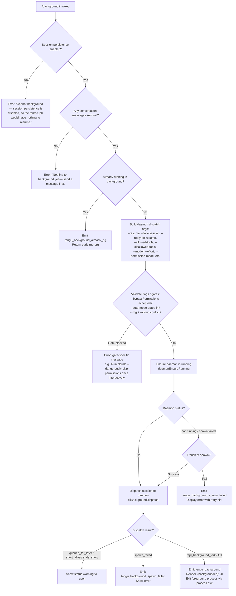

# `/background`

> Analysis basis: CC v2.1.186 bundle.js (AST extraction + Claude interpretation)
> Minimum version: v2.1.186

---

## Overview

The `/background` command (alias `/bg`) detaches the current interactive Claude Code session from the terminal and hands it off to the background daemon, freeing the terminal for other use. The session is dispatched to a persistent daemon process (or a transient spawn if no service daemon is running), and the user can reattach later via `--resume`. If no conversation has started yet, or if session persistence is disabled, the command is rejected with a descriptive error.

---

## Registration

| Field | Value |
|---|---|
| type | `local-jsx` |
| name | `background` |
| description | `Send this session to the background and free the terminal` |
| aliases | `["bg"]` |
| argumentHint | `[prompt]` |
| immediate | `null` |
| module_id | `$Bl` |
| load_inline | `true` |
| loc_byte | `13233696` |
| loc_byte_end | `13233936` |
| loc_line | `9085` |
| arbor_handler.name | `DCf` |
| arbor_handler.fqn | `claude-2.1.186::DCf` |
| arbor_handler.kind | `AsyncFunction` |
| arbor_handler.resolution_path | `module_id` |
| arbor_handler.n_hits | `0` |

Analysis basis: CC v2.1.186 bundle.js:+13233696

---

## Input Branching

The handler `DCf` contains at least four distinct decision paths based on session and daemon state; a Mermaid flowchart is used.



Analysis basis: CC v2.1.186 bundle.js:+13233002, +13233192, +13232950, +13227985, +13228638, +13228786

---

## Behavioral Spec

### Handler Entry Point — `backgroundCommandHandler` (`DCf`)

```
async function backgroundCommandHandler(context):
    // Guard 1: persistence must be enabled
    if not sessionPersistenceEnabled(context):
        display error "Cannot background — session persistence is disabled..."
        return

    // Guard 2: conversation must have started
    if conversationIsEmpty(context):
        display error "Nothing to background yet — send a message first."
        return

    // Guard 3: already in background?
    if alreadyInBackground(context):
        emit telemetry "tengu_background_already_bg"
        return  // no-op

    // Build subprocess argument list for the resumed background job
    args = buildResumeArgs(context)
    // Includes: --resume <sessionId>, --fork-session, --reply-on-resume
    //           --allowed-tools, --disallowed-tools, --model, --effort
    //           --permission-mode, --add-dir, --

    // Gate checks (permissions, auto-mode, cloud conflict)
    gateResult = checkBackgroundGates(context, args)
    if gateResult == "gate_blocked":
        display gateResult.message
        return

    // Ensure daemon is available (service or transient)
    daemonStatus = await ensureDaemonRunning(context)
    if daemonStatus == "spawn_failed":
        emit telemetry "tengu_background_spawn_failed"
        display spawn-failed error with retry prompt
        return

    // Dispatch session to daemon
    dispatchResult = await dispatchToDaemon(context, args)

    match dispatchResult.status:
        "repl_background_fork":
            emit telemetry "tengu_background"
            render "(backgrounded)" indicator
            flush outputs (timeout 2000 ms)
            process.exit(0)

        "queued_for_later" | "short_alive" | "stale_short":
            display status warning to user

        "spawn_failed":
            emit telemetry "tengu_background_spawn_failed"
            display "couldn't start in the background — press Enter to retry"
```

Analysis basis: CC v2.1.186 bundle.js:+13233002, +13233153, +13233262, +13232936, +13232984

---

### Daemon Argument Construction — `buildBackgroundArgs` (`KXn`)

```
function buildBackgroundArgs(sessionId, context):
    args = []

    // Session linkage
    args += ["--resume", sessionId]
    args += ["--fork-session"]
    args += ["--reply-on-resume"]

    // Tool allow/deny lists (flatMap from current session settings)
    args += buildAllowedToolsArgs(context)    // --allowed-tools
    args += buildDisallowedToolsArgs(context) // --disallowed-tools

    // MCP server dirs
    args += buildAddDirArgs(context)          // --add-dir

    // Model selection
    if context.model:
        args += ["--model", context.model]

    // Effort level
    if context.effort:
        args += ["--effort", context.effort]

    // Permission mode
    if context.permissionMode:
        args += ["--permission-mode", context.permissionMode]

    // Separator
    args += ["--"]

    return args
```

Analysis basis: CC v2.1.186 bundle.js:+13227265, +13227341, +13227354, +13227396, +13227448, +13227483, +13227524, +13227555, +13227584, +13227601, +13227629

---

### Daemon Ensure-Running — `daemonEnsureRunning` (inner of `P6`)

```
async function daemonEnsureRunning(context):
    status = queryDaemonStatus()

    if status == "up":
        return "up"

    if platformIsServiceCapable():
        // macOS/Linux: attempt launchd/systemd service
        if serviceExecPathIsStale():
            emit telemetry "tengu_bg_daemon_service_stale_exec"
            // fall through to transient spawn

        if not serviceInstalled():
            // Ask user once interactively
            answer = promptInstallService()
            // "Install as a service now? [y/N/never, or 'once' just for now]"
            emit telemetry "tengu_bg_daemon_cold_start_ask"
            record answer

    // Transient spawn fallback
    spawnResult = spawnTransientDaemon()
    if spawnResult.failed:
        emit telemetry "tengu_bg_daemon_spawn_failed"
        return "spawn_failed"

    // Wait up to 5000 ms for daemon to become reachable
    waitForDaemon(timeout=5000)
    return "up"
```

Analysis basis: CC v2.1.186 bundle.js:+13150640, +13150703, +13151150, +13151791, +13152441, +13158379

---

### Daemon Dispatch — `cliBackgroundDispatch` (`rMo`)

```
async function cliBackgroundDispatch(context, args):
    // Generate a unique dispatch file
    dispatchId = randomBytes(...)
    dispatchPath = join(socketDir, "tmp", dispatchId)

    // Write dispatch file (args + session metadata)
    writeDispatchFile(dispatchPath, args)

    // Connect to daemon control socket
    socket = connectToControlSocket(timeout=6000)
    if not socket:
        return { status: "daemon-unreachable" }

    // Send dispatch message; wait for ack
    sendDispatch(socket, dispatchId)

    result = await waitForDispatchAck(socket)

    match result.code:
        "repl_background_fork"  => return { status: "repl_background_fork" }
        "short_alive"           => return { status: "short_alive" }
        "stale_short"           => return { status: "stale_short" }
        "queued_for_later"      => return { status: "queued_for_later" }
        "spawn_failed"          => return { status: "spawn_failed" }
        _                       => return { status: "daemon_unavailable" }
```

Analysis basis: CC v2.1.186 bundle.js:+13190747, +13191093, +13191237, +13191255, +13192868, +13193151

---

### Gate Checks — `validateBackgroundGates` (inner of `bCf`)

```
function validateBackgroundGates(context, args):
    // Cloud/bg mutual-exclusion
    if argsContain(args, ["--cloud", "--cloud=", "--remote", "--remote="]):
        return gate_error("--bg and --cloud are different backends. Use `claude --cloud '<task>'` directly...")

    // bypassPermissions requires prior interactive acceptance
    if context.permissionMode == "bypassPermissions":
        if not disclaimerAccepted():
            return gate_error("--bg with bypassPermissions requires accepting the disclaimer first...")

    // Auto-mode requires prior interactive opt-in
    if context.permissionMode == "auto":
        if not autoModeOptedIn():
            return gate_error("--bg with auto mode requires opting in first...")

    return "ok"
```

Analysis basis: CC v2.1.186 bundle.js:+13160816, +13215715, +13215747, +13215884, +13216046

---

### Flush and Exit — `flushAndExit` (`Ts`)

```
function flushAndExit(exitCode):
    // Write any buffered output data
    flushOutputStream()      // X8e / sT
    // Emit "cli_error" telemetry if exitCode != 0
    if exitCode != 0:
        emit "cli_error"
    process.exit(exitCode)
```

Flush timeout: **2000 ms** (bundle.js:+13227285).
Exit code on success: `1` (bundle.js:+13194119) for error path; `0` implied for clean background handoff.

Analysis basis: CC v2.1.186 bundle.js:+13194083, +13194090, +13194106, +13194093

---

## State & Side Effects

| Item | Detail |
|---|---|
| Telemetry — primary | `tengu_background` (success path, bundle.js:+13228786) |
| Telemetry — already bg | `tengu_background_already_bg` (no-op path, bundle.js:+13232950) |
| Telemetry — spawn failed | `tengu_background_spawn_failed` (bundle.js:+13227985) |
| Telemetry — daemon dispatch | `tengu_bg_dispatch` (bundle.js:+13192868) |
| Telemetry — dispatch fallback | `tengu_bg_dispatch_fallback` (bundle.js:+13193398) |
| Telemetry — dispatch rescued | `tengu_bg_dispatch_rescued` (bundle.js:+13199932) |
| Telemetry — daemon spawn failed | `tengu_bg_daemon_spawn_failed` (bundle.js:+13152297) |
| Telemetry — daemon cold start ask | `tengu_bg_daemon_cold_start_ask` (bundle.js:+13151726) |
| Telemetry — daemon cold start answer | `tengu_bg_daemon_cold_start_ask_answer` (bundle.js:+13158454) |
| Telemetry — daemon service stale exec | `tengu_bg_daemon_service_stale_exec` (bundle.js:+13150778) |
| Telemetry — daemon install | `tengu_bg_daemon_install` (bundle.js:+13151161) |
| Telemetry — daemon unavailable | `tengu_daemon_unavailable` (reported via status field) |
| Telemetry — repl background fork | `repl_background_fork` label (bundle.js:+13228638) |
| Telemetry — feature ok/bad/sad | `tengu_feature_ok`, `tengu_feature_bad`, `tengu_feature_sad` (generic feature gates) |
| Telemetry — daemon control | `tengu_daemon_control` (daemon lifecycle, bundle.js:+17194642) |
| appState changes | Session is forked: a new job record is created in the daemon; the foreground process exits |
| Dispatch file written | Temp file under daemon socket dir (`tmp/` subdirectory) containing serialised args |
| Terminal freed | `process.exit(0)` called on success path after 2000 ms flush timeout |
| UI rendered | JSX component showing `(backgrounded)` string (bundle.js:+13229521) before exit |
| Daemon socket | Connects to UNIX control socket; timeout 6000 ms (bundle.js:+13191255) |
| Sound | None observed in call graph |

---

## Version History

| Version | Change |
|---|---|
| v2.1.186 | Initial analysis |

---

## Common Mistakes

1. **Running `/background` before sending any message** — The guard at the start of `DCf` rejects the command with "Nothing to background yet — send a message first." (bundle.js:+13233192). Always start a conversation turn before attempting to background.
2. **Mixing `--bg` with `--cloud` / `--remote`** — These are incompatible backends. The gate check (bundle.js:+13160816) will block and print a descriptive error. Use `claude --cloud '<task>'` directly for cloud sessions.
3. **Using `bypassPermissions` without prior interactive acceptance** — The daemon dispatch is blocked until `--dangerously-skip-permissions` has been accepted at least once in an interactive session (bundle.js:+13215884).
4. **No daemon running and `spawn_failed`** — If the background daemon cannot be started (no service installed and transient spawn fails), the command fails. Run `claude daemon install` to set up a persistent service (bundle.js:+13151791).
5. **Expecting the terminal to remain alive** — On success the foreground process calls `process.exit` after a 2000 ms flush; the terminal is released and the session is fully detached. Ctrl+Z or other job-control signals are not the intended mechanism.
6. **Using `/bg` inside a session that already backgrounded** — The `tengu_background_already_bg` path returns silently with no effect (bundle.js:+13232950).

---

## Appendix — Identifier Mapping

> For bundle debugging only. Identifiers change across versions.

| Identifier | Role |
|---|---|
| `DCf` | Main handler (`backgroundCommandHandler`), AsyncFunction resolved via module_id `$Bl` |
| `KXn` | Background args builder — assembles `--resume`, `--fork-session`, tool lists, model flags, etc. |
| `rMo` | Daemon dispatch function (`cliBackgroundDispatch`) — writes dispatch file, connects socket |
| `P6` | Daemon ensure-running / cold-start logic |
| `bCf` | Background gate validator — checks cloud/permissions/auto-mode conflicts |
| `hCf` | Core session fork orchestrator (called by `IX`) |
| `IX` | Session launch/fork entry (used by background dispatch path) |
| `Ts` | Flush-and-exit helper — calls `process.exit` after flushing output |
| `Dht` | Top-level interactive query driver (forked agent path) |
| `T0` | Per-turn query executor (resolves agent state, calls API) |
| `Kcf` | Session name generation / rename helper |
| `gF` | API query wrapper (streaming + fallback) |
| `S5l` | Core streaming query loop (large function, handles all streaming events) |
| `mSo` | Command-line argument parser / model-string resolver |
| `QB` | Environment detection (production/test/daemon-worker) |
| `Ws` | Daemon-worker init check (`XNe`) |
| `rye` | Detach-request sender (writes `detach-request` message to daemon pipe) |
| `zXn` | JSX renderer for background command response UI |
| `jNe` | Tmux child-session detection helper |
| `fBu` | Tmux `show-environment` spawner (checks `CLAUDE_CODE_CHILD_SESSION`) |
| `Mc` | Promise-race timeout helper (2000 ms flush timeout) |
| `HMo` | Hook registration wrapper |
| `hm` | Hook/event manager reference |
| `j6` | Forced shutdown sequencer (`Promise.race` + `Promise.all`) |
| `wme` | MCP server shutdown helper |
| `Nme` | Scheduled-task clear helper |
| `Bn` | Graceful-exit timer (sets `s.unref` on timeout) |
| `ke` | Emit `tengu_feature_ok` telemetry helper |
| `xe` | Emit `tengu_feature_bad` telemetry helper |
| `Mt` | Emit `tengu_feature_sad` telemetry helper |
| `Pe` | Feature telemetry base (calls `KVe`) |
| `gU` | Daemon control event emitter (`tengu_daemon_control`) |
| `x2r` | UUID-based event emission helper |
| `Z3e` | MCP connection manager (reconnect, backoff, slot management) |
| `q2o` | MCP update applier / retry-all-remote-servers logic |
| `arr` | Individual MCP connection result applier |
| `WT` | MCP cleanup handler |
| `Qw` | MCP skills telemetry emitter (`tengu_mcp_skills`) |
| `bYf` | Daemon IPC message dispatcher (handles ping/dispatch/reply/exec/kill/attach/resize/subscribe etc.) |
| `tyc` | Daemon heartbeat / stale-drop checker |
| `AYf` | Daemon attach stall respawner |
| `SYf` | Attach stall ms reporter (`tengu_bg_attach_stall_ms`) |
| `CXn` | Attach upgrade handler (`tengu_bg_attach_upgrade`) |
| `L` | Daemon supervisor tick (memory checks, retire, prewarm) |
| `q` | Scheduled-task clock / grace-period manager |
| `k` | Daemon yield writer (`tengu_daemon_yield`) |
| `CVt` | Memory-pressure checker (`W2l.freemem`) |
| `q2l` | Retire-grace-bridged reporter (`tengu_bg_retire_grace_bridged_min`) |
| `D2e` | Disk-based session state reader/cleaner |
| `f` | Worker process lifecycle manager (spawn, kill, retire, SIGTERM) |
| `v5e` | TeammateMailbox message marker |
| `Oi` | File cache reader (lstat + readFile, token counting) |
| `d` | Supervisor config watcher / writer |
| `loe` | Resume-file / session-link scanner |
| `Eru` | File line scanner (checks for `"type":"user"` / `"type":"assistant"`) |
| `wt` | Config loader (`cEe`) + file watcher (`Lxf`) |
| `cEe` | Config file parser (readFileSync + backup logic) |
| `Lxf` | Config file watcher (fs.watchFile) |
| `Xgt` | Allowed-tools set builder |
| `nV` | Tool name normaliser / expander |
| `nDe` | Tool prefix extractor |
| `IBl` | Resume-flag tool filter |
| `UXn` | Session-id tool filter |
| `TCf` | Continue-flag tool filter |
| `CBl` | Allowed-tools startsWith filter |
| `vBl` | Disallowed-tools set builder |
| `XW` | Path-permission set builder |
| `mI` | Windows UNC path normaliser (`KPe`) |
| `KPe` | Path key normaliser |
| `war` | UNC prefix stripper |
| `kd` | Working-directory resolver (`Tm`) |
| `Tm` | Atomic file writer (randomBytes + writeFile + rename) |
| `Ot` | AsyncLocalStorage context reader (`hrn`) |
| `gr` | Logger reference (`GL`) |
| `hBl` | Blocked-tools list formatter |
| `mCf` | Session command builder (`Srn`) |
| `Srn` | Shell command formatter |
| `Nie` | Path truncator (`Lc`) |
| `rMo` | (see above — daemon dispatch) |
| `kKn` | Control-socket connect with retry |
| `GWe` | Socket-path builder |
| `Sy` | Low-level socket writer (framed JSON protocol) |
| `uue` | Socket-path existence checker |
| `HBl` | Daemon status poller |
| `IVt` | Daemon install / cold-start interactor |
| `tMo` | Daemon status message formatter |
| `Dg` | Daemon status display helper |
| `jse` | Amber-anchor emitter (`tengu_amber_anchor`) |
| `Rme` | Amber-anchor inner (`px`) |
| `b_` | Amber-anchor store (`$Ie`) |
| `$Ie` | Amber-anchor state manager |
| `gF` | (see above — API query wrapper) |
| `Cc` | Credential / API-key resolver |
| `q8n` | Per-model API request builder |
| `qw` | Streaming event router (handles all SSE event types) |
| `S5l` | (see above — streaming query loop) |
| `x8e` | Non-streaming fallback request builder |
| `LSo` | Fallback request wrapper |
| `LI` | API provider selector (foundry/vertex/bedrock/api) |
| `br` | Provider base resolver |
| `Su` | Provider string formatter |
| `qkr` | Managed-key path detector |
| `Afe` | Auth header builder (`$kr`) |
| `Lf` | Logger factory (`Rt`) |
| `Rt` | Root logger (`GL`) |
| `Wl` | Tool-list filter |
| `LH` | Compact-boundary parser (`Qqn`) |
| `Qqn` | Compact DA extractor |
| `DA` | Compact-boundary marker |
| `Oie` | Working-dir context resolver |
| `Xf` | Permission-cache checker |
| `zXn` | (see above — JSX UI renderer) |
| `H8` | Array-check helper |
| `tHt` | Tool-name `some` tester |
| `iP` | Inline-prompt parser (`_Y`) |
| `_Y` | Wl-based prompt filter |
| `Gce` | `startsWith` gate for special flags |
| `ch` | `Rt`/`Oc` compound renderer |
| `Nq` | `Rt`/`Oc` compound renderer (secondary) |
| `WL` | `GL`-based log wrapper |
| `WO` | Output writer |
| `QB` | (see above — env detection) |
| `ot` | String coercer |
| `F3l` | Feature-flag reader |
| `N3` | Node env reader |
| `gjn` | Session-name generator argument builder |
| `cee` | Session-name generation base |
| `Pn` | UUID + session handle creator |
| `OIl` | Output item list builder (`Ea`/`J$`) |
| `J$` | String trimmer |
| `T0` | (see above — per-turn query executor) |
| `c4n` | App-state reader/writer for query context |
| `LM` | Random-bytes slug generator |
| `Sce` | `Oc`/`lWe` compound (output renderer) |
| `V5` | Sub-agent exit + command-lifecycle telemetry emitter |
| `Q5e` | Tombstone/tool-use-summary/notification event checker |
| `lce` | Tool-use summary filter |
| `kKp` | Fork-agent query (`tengu_fork_agent_query`) |
| `Mso` | (alias for `mSo`) arg parser |
| `_s` | Model-string normaliser/resolver |
| `b9` | Model config reader |
| `Zo` | Model alias expander (sonnet/haiku/opus/best/fable etc.) |
| `$g` | Model string post-processor |
| `Gyt` | Model capability checker |
| `Qae` | Sub-agent config builder |
| `u4n` | Turn-count/limit checker |
| `ok` | Permission-mode resolver |
| `Jte` | Streaming-idle timeout config reader |
| `k8n` | Rapid-refill breaker state |
| `FBa` | Tombstone-set checker (`Q5e`) |

---

Note: index built via Arbor fallback; some signals (telemetry, literals) may be missing — see arbor-fallback.js.